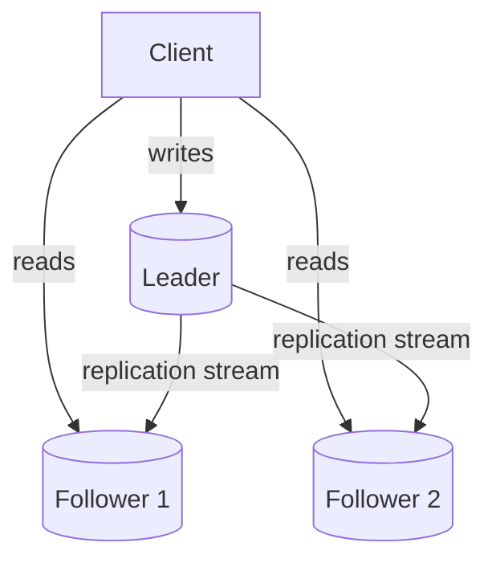
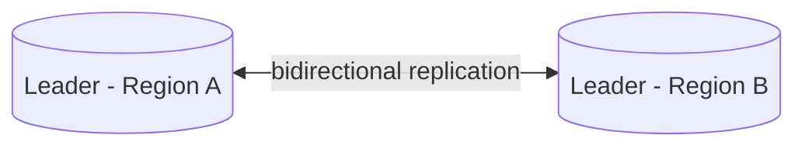
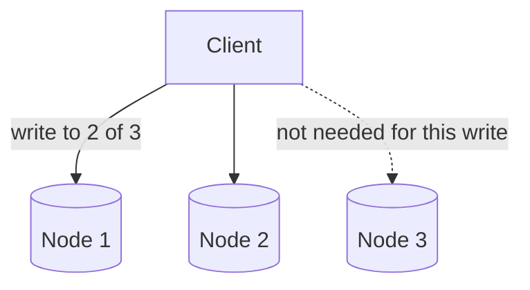

## Introduction

A single database instance is both a scalability bottleneck and a single point of failure (Chapter 1). **Replication** — maintaining copies of the same data across multiple nodes — is the foundational technique for addressing both problems, and it underlies nearly every distributed database system you'll encounter.

## Why Replicate?

1. **High availability** — if one node fails, another replica can take over.
2. **Read scalability** — distribute read traffic across multiple replicas instead of hammering a single node.
3. **Geographic locality** — place replicas closer to users in different regions, reducing read latency (echoing the CDN principle from Chapter 11, applied to databases).

## Leader-Follower (Primary-Replica) Replication

The most common topology: one node (the **leader**/primary) accepts all writes; one or more **followers**/replicas asynchronously or synchronously receive copies of those writes and serve read traffic.



- **Synchronous replication**: The leader waits for at least one follower to confirm the write before acknowledging it to the client. Stronger durability guarantee, but higher write latency, and a slow/down follower can block writes.
- **Asynchronous replication**: The leader acknowledges the write immediately, without waiting for followers. Lower write latency, but risks data loss if the leader fails before followers catch up, and followers can serve **stale reads** (replication lag).

```mermaid
sequenceDiagram
    participant C as Client
    participant L as Leader
    participant F as Follower
    C->>L: write(x=5)
    L-->>C: ack (async: immediately; sync: after F confirms)
    L->>F: replicate x=5
    Note over F: Follower catches up shortly after (async) or before ack (sync)
```

**Failover**: If the leader fails, one follower must be promoted to become the new leader — either manually or via automatic failover (using a consensus mechanism, Chapter 23, to agree on which follower becomes the new leader and avoid two nodes both believing they're the leader — a dangerous "split-brain" scenario).

## Multi-Leader Replication

Multiple nodes can each accept writes, replicating changes to each other.



**Use case**: Multi-region systems where writes need to be accepted locally in each region (for low write latency) rather than always routing to a single global leader.

**The core challenge: write conflicts.** If the same record is updated concurrently in two different regions before the replication catches up, which write wins? Common resolution strategies:
- **Last-Write-Wins (LWW)** — use a timestamp; the most recent write wins (simple, but can silently lose data).
- **Application-level merge logic** — e.g., merging concurrent shopping cart additions rather than letting one overwrite the other.
- **Conflict-free Replicated Data Types (CRDTs)** — specialized data structures mathematically designed to merge concurrent updates without conflicts (common in collaborative editing systems).

## Leaderless Replication

No single node is designated as "the leader" — any node can accept reads and writes, using **quorum** (Chapter 23) to ensure consistency: a write is considered successful once acknowledged by W replicas, and a read queries R replicas and returns the most recent value found (with `W + R > N`, where N is the total replica count, guaranteeing at least one overlap between any write and read set).



Systems like Cassandra and DynamoDB use this model, favoring availability (any node can serve a request, even if others are down) at the cost of more complex conflict resolution logic (directly connecting back to the CAP theorem trade-offs of Chapter 18).

## Replication Lag and Its Practical Consequences

Asynchronous replication inevitably introduces **replication lag** — the delay between a write on the leader and its visibility on a follower. This causes real, user-visible issues:

- **Read-your-writes inconsistency**: A user updates their profile, then immediately reloads the page and reads from a lagging follower — seeing their *old* profile, confusingly. Mitigation: route a user's own reads to the leader (or a replica known to be caught up) for a short period after they write.
- **Monotonic reads violation**: A user reads from a follower that's caught up, then a subsequent read happens to hit a *more* lagging follower — the data appears to go "backward" in time. Mitigation: consistently route a given user's reads to the same replica (sticky routing).

These practical failure modes are why Chapter 19 (Consistency Models) exists — the trade-offs here aren't abstract, they show up as confusing real-world bugs if not explicitly designed for.

## Summary

- Replication improves availability, read scalability, and geographic locality by maintaining copies of data across nodes.
- Leader-Follower is the most common topology: single write path, multiple read replicas, with sync/async trade-offs between durability and write latency.
- Multi-Leader replication allows writes in multiple locations but introduces write conflict resolution challenges.
- Leaderless replication (quorum-based) favors availability, letting any node serve requests, at the cost of more complex consistency logic.
- Replication lag is a real, practical source of confusing bugs (stale reads, non-monotonic reads) that must be explicitly designed around, not ignored.

---

## Interview Questions

### 1. What is the difference between synchronous and asynchronous replication, and what's the core trade-off between them?
**Answer:** In synchronous replication, the leader waits for at least one follower to confirm it has received and applied a write before acknowledging success to the client, guaranteeing that data exists in at least two places before the write is considered durable — at the cost of higher write latency (bound by the slowest required follower) and reduced availability if that follower becomes unreachable (the leader may be unable to complete writes at all). In asynchronous replication, the leader acknowledges the write immediately without waiting for any follower, achieving lower write latency and higher write availability, but risking permanent data loss if the leader fails before the write has actually propagated to any follower.

**Follow-up:** *What is "semi-synchronous" replication, and what problem does it try to solve?* — Semi-synchronous replication is a middle ground where the leader waits for acknowledgment from at least one follower (not all), balancing durability (data exists in at least two places before acknowledgment) against latency and availability (not blocked by every single follower, only needing one to respond) — a practical compromise many production systems use rather than choosing purely synchronous or purely asynchronous replication for every follower.

### 2. Explain "replication lag" and describe one concrete, user-visible bug it can cause if not accounted for in application design.
**Answer:** Replication lag is the delay between when a write is applied on the leader and when that same write becomes visible on a given follower, inherent to asynchronous replication. A concrete resulting bug: a user submits a form to update their display name, the write succeeds on the leader, and the application immediately redirects them to a profile page that reads from a lagging follower — the user sees their *old* display name still displayed, appearing as though their update failed or didn't save, even though it actually did succeed on the leader moments earlier.

**Follow-up:** *What's a straightforward mitigation for this specific "read-your-own-writes" problem?* — Route reads for a short window after a user's own write specifically to the leader (or to a replica confirmed to have caught up past that write) rather than to an arbitrary follower — commonly implemented by tracking a recent-write timestamp or version per user session and ensuring subsequent reads within some window are served from a sufficiently up-to-date source.

### 3. What is "split-brain," and why is it a dangerous failure mode specifically in leader-follower replication with automatic failover?
**Answer:** Split-brain occurs when, due to a network partition or failure detection error, two different nodes simultaneously believe themselves to be the legitimate leader and both begin accepting writes independently — since they're no longer properly coordinating/replicating with each other during this period, this can result in genuinely divergent, conflicting data that's extremely difficult (sometimes impossible) to reconcile afterward, undermining the entire premise of having a single authoritative leader for write consistency. This is particularly dangerous with automatic failover because a failure-detection mechanism might incorrectly (even if rarely) conclude the original leader is down (e.g., due to a temporary network partition, not an actual crash) and promote a follower to leader, while the original leader — still alive but partitioned — continues believing it's still the legitimate leader too.

**Follow-up:** *How does a consensus algorithm (previewed here, detailed in Chapter 23) help prevent split-brain?* — A proper consensus algorithm (like Raft) requires a node to be recognized as leader only after receiving explicit acknowledgment/votes from a *majority* of all nodes in the cluster — since a network partition can allow at most one side to contain a majority, this majority requirement mathematically guarantees at most one leader can be legitimately elected at any given time, preventing two simultaneously active leaders even under partition conditions that might otherwise appear ambiguous to either individual node.

### 4. Compare leader-follower and multi-leader replication in terms of write latency for a globally distributed application. What specific problem does multi-leader introduce that leader-follower avoids?
**Answer:** In leader-follower replication with a single global leader, users far from that leader's region experience higher write latency (their write must travel across a potentially significant physical distance to reach the single leader before being acknowledged). Multi-leader replication allows users in each region to write to a local leader, achieving low local write latency everywhere — but this introduces the write-conflict problem: if the same record is concurrently modified in two different regions before their leaders have replicated to each other, the system must somehow reconcile these conflicting concurrent writes, a problem that simply doesn't arise in single-leader replication since all writes naturally serialize through the one leader.

**Follow-up:** *For what kind of data/use case would multi-leader's conflict-resolution complexity be a worthwhile trade-off for the write-latency benefit?* — Use cases where writes to the *same specific record* from *different regions simultaneously* are inherently rare or naturally partitioned by region (e.g., each user's own data is typically only ever written from their own home region) benefit most, since the theoretical conflict risk rarely materializes in practice while the low-latency local-write benefit is realized on essentially every write — collaborative, frequently-co-edited data (like a shared real-time document) would face conflicts far more often, making the trade-off less favorable there without specialized conflict-resolution approaches like CRDTs.

### 5. What does the quorum condition `W + R > N` guarantee in a leaderless replication system, and why does that specific inequality matter?
**Answer:** In a leaderless system with N total replicas, a write is acknowledged once W replicas confirm it, and a read queries R replicas, using the most recent value found among those responses. The condition `W + R > N` mathematically guarantees that the set of replicas involved in any write and the set involved in any subsequent read must overlap by at least one node — meaning that at least one of the replicas queried during a read is guaranteed to have also participated in (and therefore have the data from) the most recent completed write, ensuring the read can always find the latest committed value rather than potentially missing it entirely by querying only replicas that weren't part of that write.

**Follow-up:** *If a system sets W=1 and R=1 with N=3 (violating the quorum condition), what specific consistency risk does this introduce?* — With W=1 and R=1, a write might only reach one specific replica, while a subsequent read might query a *different* single replica that never received that write — since `1 + 1 = 2` is not greater than `N=3`, there's no guaranteed overlap between the write and read sets, meaning the read could return stale data (missing the most recent write entirely) even though the write technically succeeded elsewhere in the cluster.

### 6. Why might a system deliberately choose a leaderless replication model (like Cassandra) over leader-follower replication, despite the added complexity of conflict resolution?
**Answer:** Leaderless replication avoids having any single node be a required, potentially-bottlenecking or failure-prone gatekeeper for all writes (or all writes to a given partition) — any available replica can accept a write or serve a read, meaning the system can remain available and responsive even if a significant fraction of nodes are simultaneously down or unreachable, as long as enough remain to satisfy the configured quorum. This directly favors the "Availability" side of the CAP theorem trade-off (Chapter 18) more strongly than leader-follower systems typically do, making leaderless replication attractive for use cases prioritizing continuous availability and tolerance of individual node/network failures over strict, immediately consistent single-leader-ordered writes.

**Follow-up:** *Does choosing a leaderless model mean you can never achieve strong consistency for specific critical operations?* — Not entirely — many leaderless systems support tunable consistency levels per operation (e.g., setting W and R such that `W + R > N`, or even requiring W=N or R=N for specific operations demanding stronger guarantees) — allowing an application to selectively trade away some availability for stronger consistency on a per-operation basis when genuinely needed, rather than being locked into one fixed consistency level for the entire system.

### 7. Explain "Last-Write-Wins" (LWW) conflict resolution in multi-leader replication, and articulate a concrete scenario where it silently causes data loss.
**Answer:** LWW resolves concurrent conflicting writes to the same record by comparing timestamps and simply keeping whichever write has the latest timestamp, discarding the other entirely. A concrete data-loss scenario: two users in different regions simultaneously add different items to what they each believe is the same shopping cart (perhaps a shared account) — if these writes are treated as full record overwrites of the "cart" record rather than as independent additive operations, LWW would keep only whichever write happened to have the later timestamp, silently discarding the other user's legitimately added item without any indication to either user that data was lost.

**Follow-up:** *Why might clock synchronization issues across regions make LWW's data-loss risk even worse in practice?* — If different regions' clocks are even slightly out of sync (a real, common occurrence in distributed systems without extremely precise clock synchronization infrastructure), a write that actually happened *later* in real/wall-clock time could incorrectly be assigned an *earlier* timestamp than a genuinely earlier write from a region with a clock running fast — potentially causing LWW to discard the objectively more recent, more correct write in favor of an older one, compounding the fundamental data-loss risk with an additional layer of clock-skew-induced unpredictability.

### 8. What is a CRDT (Conflict-free Replicated Data Type), and how does it avoid the data-loss problem inherent to Last-Write-Wins?
**Answer:** A CRDT is a specially designed data structure with mathematically defined merge semantics such that concurrent updates from different replicas can always be automatically and deterministically merged into a single, correct result without conflicts or arbitrary discarding of data — for example, a CRDT-based counter might track separate per-replica increment counts and sum them together during merge (rather than simply overwriting one value with another), correctly reflecting *all* increments from *all* replicas regardless of the order or timing in which they're merged, unlike LWW which would simply keep one value and completely discard the other.

**Follow-up:** *Why aren't CRDTs used universally in place of simpler conflict-resolution strategies like LWW, given this clear data-loss advantage?* — CRDTs require the data type and its intended operations to have well-defined, mathematically sound merge semantics designed specifically for that use case (a counter, a set, or specific collaborative-editing text structures have well-known CRDT implementations), meaning they're not a generic, universally applicable drop-in solution for arbitrary data structures — designing a correct CRDT for a complex or novel data type can be genuinely difficult, and LWW's simplicity (despite its data-loss risk) remains an easier, "good enough" default for many use cases where perfect conflict resolution isn't worth the implementation complexity.

### 9. If an interviewer asks you to design a system requiring strict, immediate consistency for reads after writes (e.g., a user must always see their own just-placed order immediately), how would replication topology choice factor into your answer?
**Answer:** You'd lean toward a leader-follower topology with reads for that specific critical path routed directly to the leader (or synchronously-replicated followers guaranteed to be caught up), rather than to arbitrary asynchronously-lagging followers or a fully leaderless quorum configuration with weak consistency settings — explicitly noting that while this sacrifices some read scalability benefit (since you can't freely distribute this specific read across all followers), it directly satisfies the stated strict consistency requirement, and you might explain this trade-off is deliberately scoped to just this one critical read path, while other, less consistency-sensitive reads elsewhere in the system could still be served from regular asynchronous followers for scalability.

**Follow-up:** *How would you handle this same requirement if the system instead used a leaderless (quorum-based) database?* — You'd configure this specific critical operation's read/write quorum settings to guarantee strong consistency (e.g., setting R and W such that `W + R > N`, or using an even stricter setting like requiring a full quorum read/write for this specific operation) rather than relying on the system's typical, more relaxed default consistency settings used for less critical operations — demonstrating that even within a fundamentally "eventually consistent by default" leaderless system, per-operation tunable consistency can still meet a strict specific requirement when genuinely needed.

### 10. Why is "monotonic reads" considered a distinct consistency problem from simple replication lag/staleness, and how does sticky routing address it specifically?
**Answer:** Simple staleness means a read might return outdated data relative to the absolute latest write. Monotonic reads is a more specific, arguably more confusing failure mode: a user's *sequence* of reads over time appears to go "backward," seeing progressively *older* data than what they already saw in a previous read — e.g., first reading from a nearly-caught-up follower (seeing recent data), then a subsequent read happens to hit a different, more significantly lagging follower (seeing genuinely older data than what was already displayed) — even though each individual read is "just" stale in isolation, the *inconsistency between consecutive reads* creates a distinctly jarring, seemingly impossible user experience (data appearing to un-happen). Sticky routing addresses this by consistently routing a given user's (or session's) reads to the *same* specific replica rather than an arbitrary one each time, ensuring that even if that replica is somewhat lagging, the user's sequence of reads from it will be monotonically non-decreasing in recency, since they're always reading from the same, consistently-progressing replication stream rather than potentially jumping between replicas at different lag states.

**Follow-up:** *Does sticky routing fully solve monotonic reads if the sticky-routed replica itself experiences a failure and the user must be rerouted to a different replica?* — Not entirely — if the originally sticky-assigned replica fails and the user is rerouted to a different replica that happens to be at an earlier point in its own replication stream than the failed replica had reached, the user could still momentarily perceive a "going backward" experience during that failover transition — fully robust monotonic-read guarantees across failover scenarios typically require additional mechanisms (like tracking and carrying forward a client-side "last seen" version/timestamp and ensuring any newly-assigned replica has caught up to at least that point before serving reads) beyond simple sticky routing alone.
