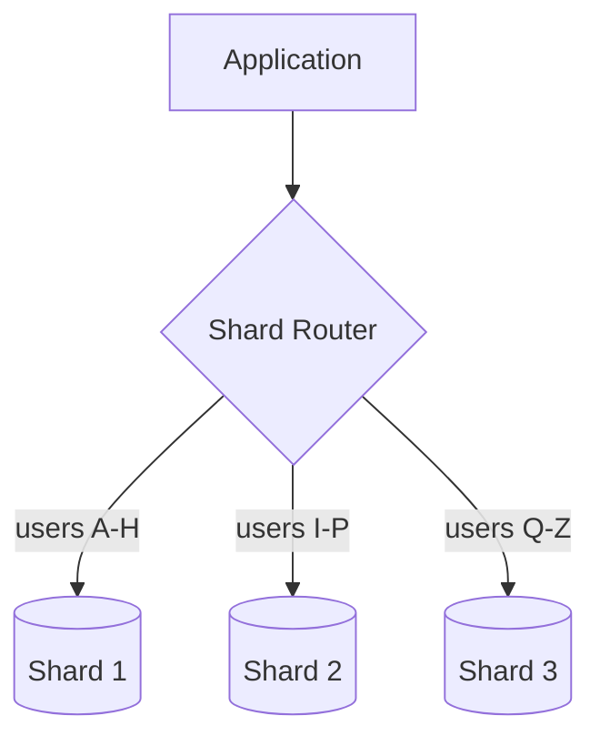
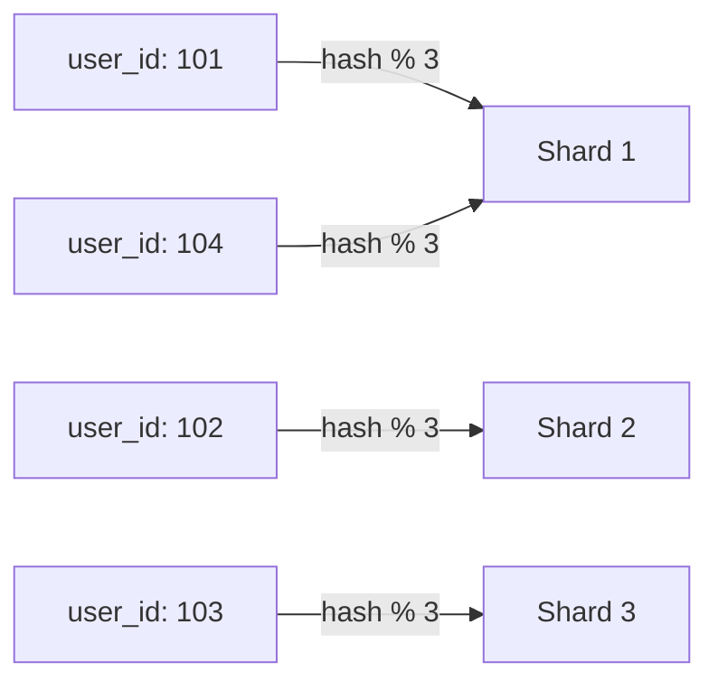
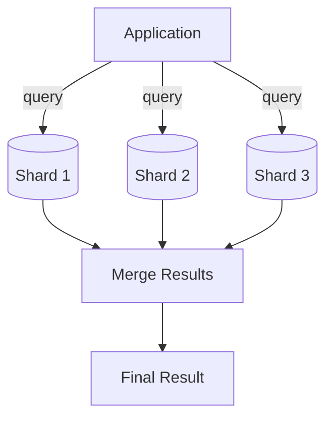

## Introduction

Replication (Chapter 15) copies the *same* data across nodes to improve availability and read scalability. **Sharding** (also called partitioning) does the opposite: it splits *different* data across nodes, so no single machine needs to hold the entire dataset — the core technique for scaling both storage and write throughput beyond what one machine can handle.

## Why Shard?

- A single machine's disk, memory, and CPU are finite — eventually a dataset (or its write load) outgrows what vertical scaling (Chapter 7) can address.
- Sharding distributes both **storage** and **write throughput** across multiple machines, since each shard independently handles only its own slice of data.

## Sharding Strategies

### 1. Range-Based Sharding

Data is partitioned by ranges of the shard key (e.g., user IDs 1–1,000,000 on Shard 1, 1,000,001–2,000,000 on Shard 2).

**Pros**: Simple to understand; range queries (e.g., "all users created in January") can be efficient if they align with the partition ranges.
**Cons**: Prone to **hotspots** — if a particular range receives disproportionate traffic (e.g., new users all landing in the newest, highest-ID range), that one shard becomes a bottleneck while others sit idle.

### 2. Hash-Based Sharding

The shard key is passed through a hash function, and the result determines which shard the data lives on (e.g., `hash(user_id) % number_of_shards`).

**Pros**: Distributes data much more evenly across shards, avoiding the hotspot problem of naive range-based sharding.
**Cons**: Range queries become inefficient (or impossible without querying every shard), since sequential keys are scattered across different shards. Also, naive modulo-based hashing has a serious rebalancing problem (see Consistent Hashing, Chapter 22) — changing the number of shards requires re-shuffling almost all the data.

### 3. Directory-Based (Lookup Table) Sharding

A separate lookup service maintains an explicit mapping of which shard holds which key range/value.

**Pros**: Maximum flexibility — shards can be rebalanced by simply updating the mapping, without needing a mathematical re-hash of the entire keyspace.
**Cons**: The lookup service itself becomes a critical dependency and potential bottleneck/single point of failure, requiring its own high availability design.

### 4. Geographic Sharding

Data is partitioned by the user's region (e.g., EU users' data stays on EU shards).

**Pros**: Reduces latency (data is physically closer to the relevant users); can help satisfy data residency/compliance regulations (e.g., GDPR requiring EU user data to stay within the EU).
**Cons**: Uneven load if user distribution across regions is skewed; users who travel or relocate complicate the model.

## Choosing a Shard Key

This is the single most consequential decision in a sharded system's design. A good shard key:
- **Distributes load evenly** — avoids hotspots.
- **Aligns with common query patterns** — most queries should be satisfiable by hitting a single shard (or a small, known number of shards), not by scattering across all of them.
- **Is rarely, ideally never, changed** — moving a record between shards (because its shard key value changed) is an expensive, error-prone operation.

**Example**: For a multi-tenant SaaS application, `tenant_id` is often an excellent shard key — most queries within the application are naturally scoped to a single tenant, so a query rarely needs to span multiple shards.

## Problems Sharding Introduces

### Cross-Shard Queries and Joins

A query that needs data from multiple shards (e.g., "find all orders above $100 across all users," when sharded by user ID) must **scatter-gather**: query every shard, then combine results in the application layer — significantly more complex and slower than a single-shard query.

### Distributed Transactions

Updating data across multiple shards atomically requires distributed transaction protocols (Chapter 20, e.g., Two-Phase Commit or the Saga pattern) — significantly more complex than a single-node transaction.

### Rebalancing

As data grows unevenly, some shards may need to be split or data redistributed. Naive hash-based sharding (`hash % N`) makes this painful, since changing N reshuffles nearly everything — this is precisely the problem **consistent hashing** (Chapter 22) is designed to solve.

### Hotspots (Celebrity Problem)

Even with a well-chosen shard key, a single extremely popular entity (a celebrity's account on a social platform, sharded by user ID) can overwhelm its single shard with disproportionate traffic, since that specific key always routes to the same shard. Mitigations include further sub-partitioning a hot key's data, or adding a caching layer in front of that specific shard.

## Summary

- Sharding splits different data across multiple machines, scaling storage and write throughput beyond a single node's limits.
- Range-based sharding is simple but hotspot-prone; hash-based sharding distributes load evenly but sacrifices efficient range queries; directory-based sharding maximizes rebalancing flexibility at the cost of a new critical dependency.
- Shard key selection is the most consequential decision — it should distribute load evenly, align with query patterns, and rarely change.
- Sharding introduces real complexity: cross-shard queries require scatter-gather, cross-shard writes require distributed transactions, and rebalancing is non-trivial without techniques like consistent hashing.

---

## Interview Questions

### 1. What is the fundamental difference between replication and sharding, and why are they often used together rather than as alternatives?
**Answer:** Replication maintains multiple copies of the *same* data across different nodes, primarily to improve availability and read scalability. Sharding splits *different* portions of the data across different nodes, primarily to scale storage capacity and write throughput beyond a single machine's limits. They're complementary, not competing, techniques: a well-designed large-scale system typically shards data across many nodes for scale, and *also* replicates each individual shard (so each shard itself has multiple copies) for availability and read scalability within that shard — losing one node shouldn't mean losing an entire shard's data or availability.

**Follow-up:** *In a system that both shards and replicates, what does a single logical "write" actually involve at the infrastructure level?* — The write is first routed to the correct shard based on the shard key, and then, within that shard, it follows that shard's own replication protocol (e.g., written to a shard-specific leader, then replicated to that shard's own followers) — meaning both the sharding routing logic and the underlying replication mechanism operate together, but as distinct, layered concerns.

### 2. Compare range-based and hash-based sharding, and explain why hash-based sharding sacrifices efficient range queries.
**Answer:** Range-based sharding assigns contiguous ranges of the shard key to each shard (e.g., IDs 1-1000 on Shard 1), preserving the natural ordering of data across shards, so a range query can often be satisfied by querying just the specific shard(s) whose range overlaps the query. Hash-based sharding instead applies a hash function to the shard key before assigning it to a shard, deliberately scattering even sequentially adjacent key values across different, effectively random shards to achieve even load distribution — but this scattering means a range query (e.g., "all records with IDs between 500 and 600") can no longer be satisfied by a small number of shards, since the hashed distribution has no relationship to the original key ordering, typically requiring the query to scatter-gather across all shards instead.

**Follow-up:** *Why is even load distribution often considered a higher priority than range-query efficiency in most real-world sharding decisions?* — Uneven load distribution (hotspots) can cause a single shard to become a severe bottleneck or even fail under load while other shards sit comparatively idle, directly threatening the system's core scalability/availability goals; range queries, while valuable, are often either less frequent in typical application access patterns or can be redesigned/supplemented (e.g., via a separate analytics store or secondary index) to accommodate the hash-sharded structure — making even distribution the more foundational, harder-to-work-around requirement for most systems.

### 3. What makes a shard key a "good" choice, and give a concrete example of a poor shard key choice along with why it's problematic.
**Answer:** A good shard key distributes data/load evenly across shards, aligns with the system's most common query patterns (so most queries hit a single or few shards, not all of them), and rarely if ever needs to change for a given record. A poor example: sharding a global e-commerce order table by `order_date` using coarse daily ranges — this would create a severe hotspot, since ALL new orders on any given day would concentrate on whichever single shard currently "owns" today's date range, while shards for past dates receive no new write traffic at all, completely defeating the purpose of distributing write load across multiple shards.

**Follow-up:** *What would be a better shard key choice for this order table, and why?* — Something like `customer_id` (or a hash of it) would typically distribute write load far more evenly, since orders from many different customers occur continuously and concurrently across the whole customer base rather than concentrating on a single, narrow, constantly-shifting time-based range — and since most order-related queries (e.g., "show this customer's order history") are naturally scoped to a single customer, this choice also aligns well with common query patterns, hitting just one shard per typical query.

### 4. Explain the "scatter-gather" pattern for cross-shard queries, and why it's significantly more expensive than a single-shard query.
**Answer:** When a query needs data that could exist across multiple shards (e.g., it doesn't filter by the shard key, or needs to aggregate/compare data across many different shard-key values), the application must send that query out to *every* relevant shard (scatter), wait for each shard's individual response, and then combine/merge those partial results into a final answer (gather) — as opposed to a single-shard query, which only needs to contact one node and return its direct result. This is significantly more expensive because: it requires network round trips to multiple nodes instead of one (increasing overall latency, bound by the slowest-responding shard), it consumes more aggregate compute resources across the cluster, and the application-layer merging logic (e.g., re-sorting or re-aggregating combined results from multiple shards) adds additional processing overhead that a single-node query wouldn't need.

**Follow-up:** *How might you redesign a system to minimize the frequency of scatter-gather queries, if a particular important query pattern doesn't align with your primary shard key?* — Consider introducing a secondary, denormalized data structure specifically optimized for that alternative query pattern — e.g., a separate search index (like Elasticsearch) that aggregates and indexes data across all shards specifically for that query need, or a differently-sharded read replica/materialized view keyed by the alternative access pattern — accepting additional storage and synchronization complexity in exchange for avoiding expensive scatter-gather operations on that specific, presumably important or frequent, query.

### 5. Why does naive hash-based sharding using `hash(key) % N` create a serious problem when you need to add or remove shards?
**Answer:** With `hash(key) % N`, the shard assignment for nearly every key depends directly on the current total number of shards, N — if N changes (e.g., going from 4 shards to 5 to accommodate growth), the modulo result for the vast majority of existing keys will also change, meaning almost all data across the entire cluster would need to be physically moved/re-distributed to its newly-computed shard location — an extremely expensive, disruptive operation for a live production system, especially at large data volumes, and one that ideally should be a rare, carefully-managed event rather than something that happens with every incremental capacity change.

**Follow-up:** *What technique specifically addresses this rebalancing problem, and how does it fundamentally differ from simple modulo hashing?* — Consistent hashing (Chapter 22) addresses this by mapping both shards and keys onto a conceptual hash ring, such that adding or removing a single shard only requires redistributing the relatively small portion of keys that fall specifically between that shard's position and its immediate neighbors on the ring — rather than reshuffling the entire keyspace's assignment as simple modulo hashing does, consistent hashing is specifically designed so that cluster resizing events only affect a proportionally small, bounded fraction of the total data.

### 6. What is the "celebrity problem" (hotspot) in a sharded system, and why can it occur even with an otherwise well-chosen, generally well-distributing shard key?
**Answer:** Even if a shard key like `user_id` generally distributes load evenly across the overall population of users, a single specific user (e.g., a celebrity with millions of followers generating enormous read/write traffic related to their account) can generate disproportionate load concentrated entirely on whichever single shard that specific user's data happens to reside on — since the shard key deterministically routes all of that one user's traffic to one fixed shard, no amount of good "average case" distribution across the broader user base prevents this specific shard from becoming overwhelmed by the traffic of just this one outlier entity.

**Follow-up:** *What are two practical mitigations for this celebrity/hotspot problem?* — (1) Adding an aggressive caching layer (Chapter 9) specifically in front of that hot shard (or more generally, in front of all shards) so that repeated reads for the hot entity's data can be served from cache rather than hitting the shard's database directly on every request; (2) further sub-partitioning or specially handling known/detected hot keys — e.g., replicating a hot key's specific data across multiple nodes beyond the normal single-shard placement, effectively treating that one entity as a special case requiring its own additional scaling strategy beyond the general sharding scheme.

### 7. Why does directory-based (lookup table) sharding offer more rebalancing flexibility than hash-based sharding, and what new risk does it introduce?
**Answer:** With directory-based sharding, the mapping from key (or key range) to shard is stored explicitly in a separate lookup structure, meaning rebalancing (moving a specific range or set of keys to a different shard) simply requires updating those specific entries in the lookup table, without requiring any mathematical recomputation across the entire keyspace as naive hash-based approaches would — this offers fine-grained, flexible control over exactly which data lives where, and allows rebalancing decisions to be made based on real observed load patterns rather than a rigid formula. The new risk introduced is that the lookup service itself becomes a new, critical, and potentially high-traffic dependency — since virtually every single query in the system must first consult this directory to determine which shard to route to, meaning the lookup service must itself be highly available and low-latency (and is itself a candidate for replication/caching), or it becomes a new single point of failure/bottleneck for the entire system.

**Follow-up:** *How might a system mitigate the risk of the lookup service becoming a bottleneck?* — Aggressively cache the shard-mapping lookups at the application layer (since shard assignments typically change relatively infrequently compared to how often they're read/looked up), and/or replicate the lookup service itself across multiple highly-available nodes — treating the lookup service's own availability and performance with the same seriousness as any other critical, high-traffic system component, since its failure would effectively make the entire sharded dataset unreachable regardless of the individual shards' own health.

### 8. In a system design interview, you're designing a multi-tenant SaaS platform. Why might `tenant_id` be an especially good shard key choice, and what specific risk should you still flag?
**Answer:** `tenant_id` is a strong shard key choice for multi-tenant SaaS because nearly all application queries are naturally already scoped to a single tenant (a company's employees only ever query and interact with their own company's data), meaning sharding by `tenant_id` means the vast majority of real queries will hit exactly one shard, avoiding the scatter-gather problem almost entirely for typical application usage. The risk to flag is uneven tenant size — if the platform serves a mix of small customers and a few very large enterprise customers with disproportionately more data/traffic, those large tenants could create hotspots similar to the celebrity problem, since a single large tenant's entire dataset and traffic load is concentrated on whichever single shard hosts it.

**Follow-up:** *How might you address this large-tenant hotspot risk while still keeping the general `tenant_id`-based sharding approach?* — For a small number of known, unusually large tenants, consider giving them dedicated shard(s) of their own (effectively a special-cased, single-tenant shard rather than sharing a shard with many smaller tenants) — this preserves the general simplicity of tenant-based sharding for the bulk of typical-sized tenants while specifically isolating and appropriately provisioning capacity for the disproportionately large outliers, rather than letting them overwhelm a shard shared with unrelated smaller tenants.

### 9. Why do distributed transactions across shards (previewed here, detailed in Chapter 20) become necessary once you shard a database, when they weren't a concern in a single-node database?
**Answer:** In a single, unsharded database, a transaction spanning multiple related records (e.g., transferring funds by debiting one account and crediting another) can rely on the database's built-in, local ACID transaction guarantees, since all the relevant data lives within that same single node's transactional boundary. Once data is sharded across multiple independent nodes, a transaction that needs to atomically update records living on *different* shards can no longer rely on any single node's local transaction mechanism alone — it needs a way to coordinate and guarantee atomicity *across* multiple independent nodes (each with their own separate local transaction capability), which is precisely the harder problem distributed transaction protocols like Two-Phase Commit or patterns like Saga are designed to address.

**Follow-up:** *Why might a well-designed sharding scheme try to minimize how often such cross-shard transactions are actually needed, rather than simply relying on a distributed transaction protocol whenever they arise?* — Distributed transaction protocols introduce significant additional latency (multiple coordination round trips across nodes), added failure-mode complexity (what happens if a node fails mid-transaction, or a network partition occurs during coordination), and generally reduced throughput compared to local single-node transactions — a well-chosen shard key (like the tenant or customer-based approaches discussed above) that keeps most logically-related, transactionally-linked data together on the *same* shard directly minimizes how often the significantly more complex and costly cross-shard transaction machinery needs to be invoked at all.

### 10. A candidate proposes sharding a database purely by hashing the primary key, without considering the application's actual query patterns. What follow-up question would reveal whether this is a well-reasoned choice?
**Answer:** A strong follow-up would be: "Walk me through how your application's most common and most performance-critical queries would execute against this sharding scheme — would they typically hit a single shard, or would they need to scatter-gather across many/all shards?" This tests whether the candidate considered query patterns at all, or simply defaulted to hash-based sharding purely for its general load-distribution properties without validating that it actually serves the system's real-world access patterns efficiently — a technically "well-distributed" sharding scheme that forces every important query into an expensive scatter-gather operation across all shards may perform far worse in practice than a scheme intentionally aligned with actual query needs, even if the latter has slightly less theoretically perfect load distribution.

**Follow-up:** *If, upon reflection, the candidate realizes their chosen shard key forces frequent scatter-gather for a critical query pattern, what are their options at that point?* — They could reconsider the shard key entirely to better align with that critical query pattern (if it doesn't unacceptably compromise load distribution), introduce a secondary denormalized index/store specifically optimized for that particular query need (accepting added complexity and data synchronization overhead), or, if the scatter-gather query is rare/non-critical enough, simply accept its higher cost as a reasonable trade-off for keeping the primary shard key optimized for the system's more frequent and critical access patterns — the right choice depends on weighing the actual frequency and performance sensitivity of the conflicting query pattern against the shard key's other benefits.
