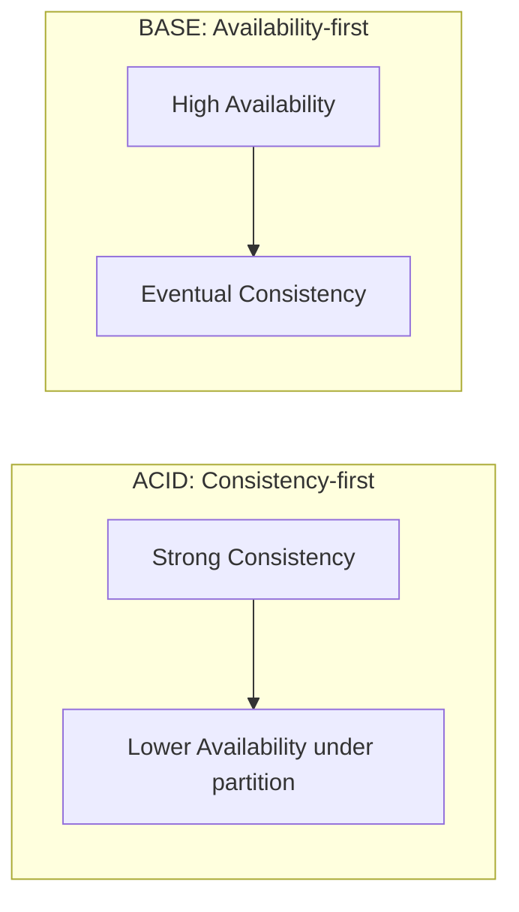

## Introduction

ACID and BASE represent two different philosophies about what a database should guarantee. Understanding them precisely — not just as acronyms to recite — is essential for justifying database choices in system design discussions.

## ACID

ACID describes the transactional guarantees traditionally associated with relational databases.

| Letter | Property | Meaning |
|---|---|---|
| **A** | Atomicity | A transaction's operations either all succeed or all fail together — no partial application |
| **C** | Consistency | A transaction moves the database from one valid state to another, respecting all defined constraints (foreign keys, unique constraints, etc.) |
| **I** | Isolation | Concurrent transactions don't interfere with each other's intermediate states, as if they executed sequentially |
| **D** | Durability | Once a transaction commits, it survives any subsequent crash — the data is permanently persisted |

```java
@Transactional
public void transferFunds(String fromAccountId, String toAccountId, BigDecimal amount) {
    Account from = accountRepository.findById(fromAccountId).orElseThrow();
    Account to = accountRepository.findById(toAccountId).orElseThrow();

    if (from.getBalance().compareTo(amount) < 0) {
        throw new InsufficientFundsException(fromAccountId);
    }

    from.setBalance(from.getBalance().subtract(amount));
    to.setBalance(to.getBalance().add(amount));

    accountRepository.save(from);
    accountRepository.save(to);
    // If any exception occurs before this point, @Transactional rolls back BOTH changes.
    // Atomicity guarantees we never end up with money deducted from one account
    // but not credited to the other.
}
```

### Isolation Levels (Briefly)

Isolation is the most nuanced ACID property — full isolation (`SERIALIZABLE`) is expensive, so databases offer weaker levels trading some correctness for performance:

| Level | Prevents | Allows |
|---|---|---|
| Read Uncommitted | Nothing | Dirty reads (seeing another transaction's uncommitted changes) |
| Read Committed | Dirty reads | Non-repeatable reads (a value changes between two reads in the same transaction) |
| Repeatable Read | Dirty + non-repeatable reads | Phantom reads (new rows appearing in a repeated range query) |
| Serializable | All of the above | Fully sequential-equivalent execution (highest cost) |

Most applications default to `Read Committed` (PostgreSQL's default) as a pragmatic middle ground.

## BASE

BASE emerged as a deliberate contrast to ACID, describing the philosophy behind many NoSQL/distributed systems that prioritize availability and scalability over strict consistency.

| Letter | Property | Meaning |
|---|---|---|
| **BA** | Basically Available | The system remains operational and responsive most of the time, even amid partial failures |
| **S** | Soft state | The system's state may change over time even without new input, as data propagates/converges across replicas |
| **E** | Eventual consistency | Given enough time without new writes, all replicas will converge to the same value |

BASE isn't a precise technical specification the way ACID is — it's more a description of a general design philosophy: relax strict, immediate consistency in exchange for higher availability and horizontal scalability, an idea directly connected to the CAP theorem (Chapter 18).

## Comparing Them Side-by-Side



| | ACID | BASE |
|---|---|---|
| Priority | Strong consistency, correctness | Availability, scalability |
| Typical databases | PostgreSQL, MySQL, Oracle | Cassandra, DynamoDB, most wide-column/key-value stores |
| Failure behavior | May reject operations to preserve consistency | Keeps serving requests, may return stale data |
| Best for | Financial transactions, inventory management, anything requiring correctness guarantees | Social media feeds, product catalogs, activity logs, analytics |

## Neither Is "Better" — It's a Requirement Match

A common interview mistake is treating ACID as strictly "more correct" and BASE as a lesser compromise. In reality:

- A banking ledger **must** be ACID — eventual consistency on account balances is unacceptable; a customer briefly seeing an incorrect balance could make a real financial decision based on wrong information.
- A social media "like" counter is **better served by BASE** — insisting on strong, immediately consistent counts across a globally distributed system would add unacceptable latency and reduce availability, for a feature where being off by a few counts for a few seconds causes no real harm.

The right question isn't "which is better" but "what does *this specific piece of data* actually require?" — and different pieces of data within the *same* system often warrant different answers (another argument for polyglot persistence, Chapter 13).

## Summary

- ACID (Atomicity, Consistency, Isolation, Durability) describes strong transactional guarantees, traditionally associated with relational databases.
- BASE (Basically Available, Soft state, Eventual consistency) describes a philosophy prioritizing availability and scalability over immediate consistency, common in distributed NoSQL systems.
- Isolation levels offer a tunable trade-off between correctness and performance within ACID systems.
- Neither philosophy is universally superior — the right choice depends on what a specific piece of data actually requires, and a single system can reasonably use both for different components.

---

## Interview Questions

### 1. Explain the four ACID properties with a concrete example that would fail if each one, individually, were absent.
**Answer:** **Atomicity** — without it, a funds transfer could debit one account but crash before crediting the other, leaving money "vanished." **Consistency** — without it, a transaction could leave the database violating its own defined constraints, e.g., an order referencing a deleted customer ID (violating referential integrity). **Isolation** — without it, one transaction reading an account balance mid-way through another transaction's not-yet-committed update could see a temporarily incorrect, partially-applied value (a "dirty read") and act on it incorrectly. **Durability** — without it, a transaction could be acknowledged as successful to the user, but then be lost entirely if the database crashes moments later before the data was actually persisted to durable storage.

**Follow-up:** *Which of these four properties is most directly related to how a database handles concurrent transactions specifically, as opposed to single-transaction correctness?* — Isolation — atomicity, consistency, and durability all matter even for a single transaction executing in complete isolation with no concurrency at all, whereas isolation specifically exists to define correct behavior *when multiple transactions execute concurrently* and might otherwise interfere with each other's intermediate states.

### 2. What is a "dirty read," and which isolation level is the minimum required to prevent it?
**Answer:** A dirty read occurs when one transaction reads data that has been modified by another transaction that has not yet committed (and might still be rolled back) — if the second transaction is later rolled back, the first transaction acted on data that, in the end, never actually became true in the database, an unrepeatable and potentially harmful inconsistency. `Read Committed` is the minimum isolation level that prevents dirty reads — it guarantees a transaction only ever sees data from other transactions that have already been fully committed, never an uncommitted, potentially-to-be-rolled-back intermediate state.

**Follow-up:** *Does `Read Committed` fully solve all consistency concerns for concurrent transactions, or what problem can still occur under it?* — `Read Committed` still allows "non-repeatable reads" — if a transaction reads the same row twice, another transaction could commit a change to that row in between the two reads, causing the second read within the same transaction to see a different value than the first read saw, even though no dirty (uncommitted) data was ever involved — this specific problem requires the stronger `Repeatable Read` isolation level to prevent.

### 3. Why is `SERIALIZABLE` isolation considered the "safest" but also often avoided in high-throughput production systems?
**Answer:** `SERIALIZABLE` isolation guarantees that concurrently executing transactions produce a result equivalent to some sequential (one-at-a-time) execution order, eliminating every possible concurrency anomaly (dirty reads, non-repeatable reads, phantom reads) entirely — the strongest possible correctness guarantee. It's often avoided in high-throughput systems because achieving this guarantee typically requires the database to do significantly more work — extensive locking, or aborting and retrying transactions that would violate serializability if allowed to proceed concurrently — substantially reducing overall throughput and increasing latency (and the rate of transaction retries/aborts) compared to weaker isolation levels that permit some concurrency anomalies in exchange for better performance.

**Follow-up:** *In what scenario would you specifically recommend `SERIALIZABLE` isolation despite its performance cost?* — For operations where even the specific weaker anomalies still allowed under `Repeatable Read` (like phantom reads — new rows matching a query's criteria appearing between two reads within the same transaction) could cause genuinely incorrect business outcomes — e.g., a financial reconciliation process performing complex multi-step calculations across many rows, where a phantom row appearing mid-transaction could cause the calculation to be based on an inconsistent snapshot of data, justifying the performance cost of full serializability for that specific critical operation.

### 4. What does "eventual consistency" actually guarantee, and what does it deliberately NOT guarantee?
**Answer:** Eventual consistency guarantees that, assuming no new writes occur to a given piece of data, all replicas of that data will *eventually* converge to the same, correct value — the system will not remain permanently, indefinitely inconsistent. It deliberately does NOT guarantee *when* that convergence will happen (there's no fixed, bounded time guarantee in the basic definition), and it does NOT guarantee that any given read at any specific moment will see the most recent write — a read immediately following a write could very plausibly return a stale, pre-write value, with no promise about how long that staleness might persist.

**Follow-up:** *Why might a business consider "eventual consistency" an acceptable, even preferable, guarantee for certain features despite its lack of an immediate consistency guarantee?* — For features where brief staleness causes no meaningful harm (a slightly outdated follower count, a delayed-by-a-few-seconds view count), eventual consistency's trade-off — significantly better availability and scalability, since the system doesn't need to coordinate and confirm consistency across all replicas before responding — is a worthwhile and often preferred trade against the comparatively minor cost of occasional brief staleness that users are unlikely to even notice or care about.

### 5. A candidate says "our system uses a NoSQL database, so it follows BASE, so we don't need to think about consistency at all." Why is this reasoning flawed?
**Answer:** This conflates a general architectural philosophy (BASE) with an excuse to ignore consistency considerations entirely — in reality, even BASE-oriented systems require careful, deliberate thought about *which specific pieces of data* can tolerate eventual consistency and which cannot, and many NoSQL databases offer tunable consistency levels (as discussed in Chapter 15's leaderless replication and Chapter 13) allowing specific operations to opt into stronger consistency guarantees when genuinely needed. Blindly assuming "NoSQL = BASE = don't worry about it" risks applying inappropriately weak consistency guarantees to data that actually requires stronger correctness properties (e.g., inventory counts that must not oversell), simply because the underlying database technology's *default* philosophy happens to favor availability.

**Follow-up:** *What would a more rigorous answer to "how do you handle consistency in a NoSQL-based system" sound like?* — A rigorous answer would specifically identify which pieces of data within the system have strict consistency requirements (and explain how those specific operations are configured — e.g., using stronger quorum settings, or routing to a component that better supports the needed guarantee) versus which pieces of data are genuinely fine with the database's default eventual consistency behavior, demonstrating deliberate per-use-case reasoning rather than a blanket philosophical assumption in either direction.

### 6. Why might a single system reasonably use both ACID-compliant and BASE-oriented data stores simultaneously, rather than being purely "an ACID system" or "a BASE system"?
**Answer:** Different data within the same overall system often has genuinely different consistency requirements — an e-commerce platform's payment and inventory-deduction logic likely needs ACID guarantees (an order should never be charged without correspondingly and atomically reserving the purchased inventory), while that same platform's product view-count or "customers also viewed" recommendation data can reasonably tolerate BASE's eventual consistency, since brief staleness there causes no real business harm. Forcing the entire system into a single consistency philosophy either over-engineers the low-stakes data (paying unnecessary ACID overhead for data that didn't need it) or under-engineers the high-stakes data (accepting unacceptable eventual-consistency risk for data that genuinely required strong guarantees) — using the right tool for each specific need, as discussed under polyglot persistence in Chapter 13, is the more mature approach.

**Follow-up:** *Does mixing ACID and BASE components within one system introduce any new complexity beyond what either approach alone would require?* — Yes — you now need to carefully reason about the boundaries and interactions between these differently-consistent components (e.g., ensuring an eventually-consistent search index doesn't cause a genuinely out-of-stock item, correctly tracked in the ACID inventory system, to still be shown as purchasable for some window of time) — the overall system's correctness now depends on understanding and correctly handling these cross-component consistency boundaries, not just each individual component's own internal guarantees in isolation.

### 7. Why is "Consistency" in ACID (referring to database constraints being upheld) a genuinely different concept from "Consistency" in the CAP theorem (referring to all nodes seeing the same data)? Why does this terminology overlap cause confusion?
**Answer:** ACID's Consistency means a transaction always leaves the database in a state that satisfies all defined integrity constraints (foreign keys, unique constraints, application-defined invariants) — it's about the *validity* of data relative to defined rules, evaluated within a single node/transaction. CAP theorem's Consistency means that every node in a distributed system returns the same, most-recent value for a given piece of data when queried — it's about *agreement across multiple copies* of data in a distributed setting, entirely independent of whether that data satisfies any particular business-defined constraint. The overlapping term is a well-known, genuinely confusing terminology collision in the field — a system can be "ACID-consistent" (never violates its defined constraints) while still being "CAP-inconsistent" (different nodes might briefly disagree on the current value of some field) or vice versa; they're addressing entirely different, non-overlapping concerns despite sharing the same word.

**Follow-up:** *If you were explaining this distinction to a colleague to avoid confusion, what alternative, less ambiguous term might you use for each?* — For ACID's Consistency, you might use "integrity" or "constraint validity" to clarify it's about upholding defined data rules; for CAP's Consistency, you might use "replica agreement" or "linearizability" (a more precise, related technical term covered in Chapter 19) to clarify it's specifically about multiple copies of data agreeing with each other — using these more specific terms in discussion can help avoid the ambiguity the shared word "consistency" often causes.

### 8. Why does "Soft state" in BASE matter as a distinct concept from simply "eventual consistency," and what does it specifically describe?
**Answer:** "Soft state" specifically describes the idea that a distributed system's state can change over time due to the ongoing process of achieving eventual consistency (replication, conflict resolution, data propagation) even *without any new external input/write* occurring — the system isn't static between writes; it's continuously converging in the background. This is distinct from simply stating the end-goal outcome ("eventual consistency," the guarantee that convergence *will* eventually happen) — "soft state" specifically calls attention to the fact that the intervening, in-progress state during that convergence process is itself dynamic and potentially observable as changing, which is a meaningful operational characteristic to be aware of (e.g., when debugging why a value appears to be actively changing even though no explicit write was just made).

**Follow-up:** *Can you give a concrete example where a developer might be confused by observing "soft state" behavior if they weren't aware of this BASE property?* — A developer monitoring a specific record's value across a distributed, eventually-consistent database might observe it changing multiple times in quick succession shortly after a write, even though only a single logical update was made — without understanding "soft state," they might incorrectly suspect a bug causing spurious extra writes, when in fact they're simply observing the natural, expected process of the write propagating and converging across replicas over that brief window.

### 9. In a system design interview, how would you justify choosing a strongly consistent (ACID) database specifically for an inventory management system, addressing the potential counter-argument that this limits horizontal scalability?
**Answer:** You'd explain that overselling inventory (allowing more units to be sold than actually exist in stock) is a direct, tangible business problem — customers ordering items that can't actually be fulfilled leads to cancellations, refunds, and reputational damage — making strong, immediate consistency on stock-count decrements a genuine business requirement, not a nice-to-have. You'd acknowledge the scalability trade-off honestly, but note that inventory management, while requiring correctness, typically doesn't need to scale write throughput to the same extreme degree as, say, a social media platform's activity feed — and that the system can still scale reads (via caching/replicas) and can even shard the inventory data itself (by product ID or warehouse, Chapter 16) while still maintaining strong consistency *within* each specific shard's relevant inventory records, rather than needing a single global monolithic consistency domain.

**Follow-up:** *What technique could allow this ACID-based inventory system to handle a sudden massive spike in demand for a single specific popular item (e.g., a flash sale) without becoming a bottleneck?* — Techniques like using an atomic decrement operation (rather than a read-then-write pattern prone to race conditions) directly at the database level for the specific hot inventory record, potentially combined with a short-lived, tightly-scoped in-memory reservation/queueing mechanism in front of the database to smooth out an extreme instantaneous burst of concurrent requests for that single item — while still ultimately relying on the underlying ACID guarantees to ensure the actual stock decrement itself remains correct and never oversells, even under this front-end traffic-smoothing layer.

### 10. Why might a candidate's claim that "BASE is just a lower-quality, less rigorous version of ACID" reveal a misunderstanding, and how would you correct this framing?
**Answer:** This framing incorrectly implies that BASE represents an inferior, sloppier engineering standard, rather than a deliberate, principled trade-off consciously made in exchange for specific, valuable benefits (higher availability, better horizontal scalability, lower latency) that are sometimes more important than immediate consistency for a given use case. BASE systems aren't "less rigorous" — they still require careful, precise engineering (e.g., correctly implementing quorum-based consistency, conflict resolution via CRDTs or LWW, or proper handling of the "soft state" convergence process) — the rigor is simply directed toward correctly managing a different set of trade-offs (availability and scale over immediate consistency) rather than being an absence of rigor altogether. The correction: reframe BASE as "the appropriate, principled choice for use cases prioritizing availability and scale, requiring its own real engineering discipline" rather than as ACID's lesser, degraded cousin.

**Follow-up:** *Why does correctly making this distinction matter for how someone approaches system design decisions in practice?* — Someone who views BASE as inherently inferior may reflexively over-apply ACID/strong-consistency solutions even where they're not actually needed (adding unnecessary complexity, cost, or scalability limitations), while someone who properly understands BASE as a deliberate, valid trade-off will more naturally evaluate each specific data/use-case on its own actual requirements — leading to more appropriately matched, genuinely well-reasoned architectural decisions rather than a reflexive bias toward one philosophy across the board.
