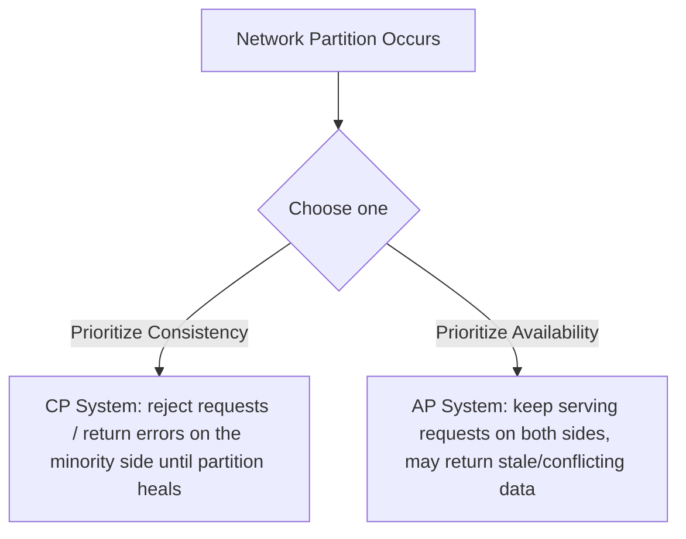
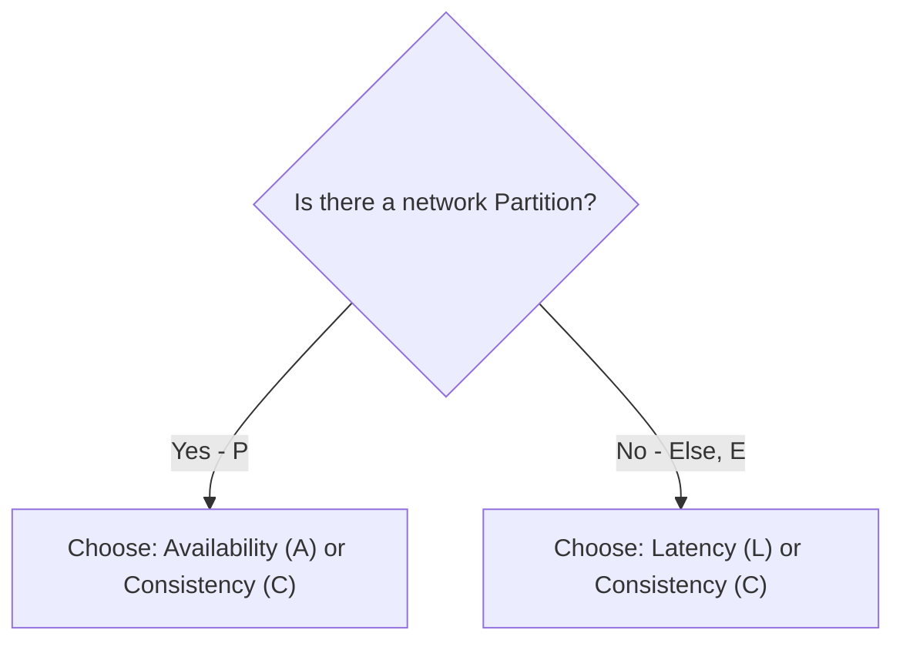

## Introduction

Chapter 1 introduced the CAP theorem conceptually. Now that you understand replication (Chapter 15), sharding (Chapter 16), and ACID vs BASE (Chapter 17), we can go deeper — including PACELC, which addresses CAP's most common misunderstanding.

## Restating CAP Precisely

For a distributed data system, you can provide at most two of the following three guarantees **simultaneously**:

- **Consistency (C)**: Every read receives the most recent write, or an error. (This specific technical meaning is closer to "linearizability" — see Chapter 19.)
- **Availability (A)**: Every request receives a (non-error) response, without guarantee that it contains the most recent write.
- **Partition Tolerance (P)**: The system continues to operate despite an arbitrary number of messages being dropped or delayed between nodes (i.e., a network partition).

**The critical, often-missed detail**: Partition tolerance isn't really an optional design choice you can trade away — network partitions *will* happen in any real distributed system (cables get cut, switches fail, packets get delayed). So the actual, practical choice CAP presents is: **when a partition occurs, do you sacrifice Consistency or Availability?** This is why you'll rarely hear "CP vs AP vs CA" treated as three equally viable options in practice — CA (sacrificing partition tolerance) essentially means "assume the network never fails," which isn't realistic for a genuinely distributed system.

## CP vs AP in Practice

| | CP Systems | AP Systems |
|---|---|---|
| Behavior during partition | Some nodes stop responding (or reject writes) to avoid inconsistency | All nodes keep responding, possibly with stale data |
| Examples | Traditional RDBMS with synchronous replication, ZooKeeper, etcd | Cassandra, DynamoDB, most leaderless systems (Chapter 15) |
| Best for | Configuration management, leader election, financial transactions | Social feeds, shopping carts, session storage, product catalogs |

## PACELC: The More Complete Picture

CAP only describes behavior **during a network partition** — but partitions are (hopefully) rare. What about the **vast majority of the time when the system is operating normally, with no partition at all**? This is what **PACELC** addresses:

> **If Partition (P), choose between Availability (A) and Consistency (C); Else (E, normal operation), choose between Latency (L) and Consistency (C).**

This matters because even *without* any partition, there's still a real trade-off: waiting for synchronous confirmation from multiple replicas (for strong consistency) adds latency compared to acknowledging a write immediately from a single node (lower latency, but weaker consistency). PACELC makes this everyday, no-partition trade-off explicit, which CAP alone doesn't address.

| System | Partition behavior | Normal operation behavior | PACELC classification |
|---|---|---|---|
| DynamoDB (default settings) | Availability over Consistency | Latency over Consistency | PA/EL |
| MongoDB (default settings) | Consistency over Availability (for the primary's shard) | Consistency over Latency (reads from primary) | PC/EC |
| Cassandra (tunable) | Configurable, defaults toward Availability | Configurable, can favor Latency or Consistency per operation | Tunable, often PA/EL by default |

## A Common Misconception, Corrected

**Misconception**: "You should design your system to be CP or AP overall."
**Reality**: The CAP/PACELC classification typically applies **per operation**, not to an entire system monolithically. A single application might require strongly consistent behavior for its payment processing (CP-like behavior for that operation) while using eventually consistent, highly available behavior for its activity feed (AP-like behavior for that operation) — even if both are backed by the same underlying tunable database (as discussed with quorum settings in Chapter 15).

## Why This Matters for System Design Interviews

When asked to design a system, explicitly naming the CAP/PACELC trade-off for each significant data component — and *justifying* the choice based on that component's actual requirements — is a strong signal of depth. Saying "I'll use a CP database" without specifying *for what data* and *why* is a weaker answer than: "For the payment ledger, I need CP behavior because incorrect balances are unacceptable even during a partition; for the activity feed, I'll accept AP behavior because staleness during a rare partition is a minor inconvenience compared to the feed becoming completely unavailable."

## Summary

- CAP theorem's real-world choice is C vs A specifically during a network partition — partition tolerance itself isn't optional for a genuinely distributed system.
- CP systems sacrifice availability to preserve consistency during partitions; AP systems sacrifice consistency to remain available.
- PACELC extends CAP by addressing the latency-vs-consistency trade-off that exists even during normal, partition-free operation — a gap CAP alone doesn't cover.
- These classifications apply per-operation/per-component, not to an entire system as a monolithic label — different data within the same system can and often should make different choices.

---

## Interview Questions

### 1. Why is "CA" (Consistency and Availability, sacrificing Partition Tolerance) generally not considered a realistic option for a genuinely distributed system?
**Answer:** Sacrificing partition tolerance means assuming network partitions simply won't happen — but in any system with multiple nodes communicating over a real network, partitions (dropped/delayed messages due to hardware failures, network congestion, misconfiguration) are a statistical inevitability over a long enough time horizon, not a rare edge case that can be engineered away entirely. A system that hasn't planned for how it behaves during a partition isn't actually avoiding the problem — it's just leaving its behavior during an inevitable partition undefined or accidental, rather than deliberately choosing to prioritize consistency or availability at that moment; this is why CAP is more accurately framed as a forced choice between C and A specifically during partitions, not a genuine three-way, equally-viable CA/CP/AP menu.

**Follow-up:** *Is there any legitimate context where treating a system as "CA" might be a reasonable simplification?* — Only for a system that's genuinely NOT distributed in the relevant sense — e.g., a single-node database with no replication at all has no "partition" scenario to speak of (there's only one node, so there's nothing to partition *from*), making CAP's three-way trade-off simply inapplicable rather than a meaningful "CA" choice — the moment you introduce even one additional replicated node, you're back to needing an explicit partition-behavior decision.

### 2. Explain, precisely, what CAP theorem's "Consistency" guarantees, and how it differs from simply "the data being correct."
**Answer:** CAP's Consistency specifically means every read operation returns the result of the most recent completed write (or an error) — essentially requiring that the system behaves as if there were only a single, up-to-date copy of the data, regardless of how many replicas actually exist underneath. This is a precise technical property (closely related to "linearizability," covered in Chapter 19) about the *recency and agreement* of data across a distributed system — it is not a broader claim about general data correctness or business-rule validity (which is closer to what ACID's Consistency addresses, as discussed in Chapter 17); a system could satisfy CAP's Consistency (always returning the latest write) while still having, for example, a data entry that violates a business rule if that invalid data was itself the "most recent write" that was validly, atomically committed.

**Follow-up:** *Why does this precise technical definition matter when someone claims a system "provides consistency"?* — Because "consistency" is used loosely and ambiguously across different contexts (CAP-consistency, ACID-consistency, and even informal everyday usage), a claim that a system "provides consistency" is often meaningless without specifying which precise technical guarantee is meant — a rigorous system design discussion should clarify exactly which consistency property (recency/agreement across replicas, or adherence to defined business/data constraints) is actually being referenced to avoid talking past each other.

### 3. What problem does PACELC address that CAP theorem alone does not?
**Answer:** CAP theorem exclusively describes the trade-off a system must make *during a network partition* — but partitions are (ideally) a relatively rare event, and CAP says nothing about what trade-offs the system makes during the vast majority of time when it's operating normally with no partition occurring at all. PACELC fills this gap by explicitly stating that even absent any partition, a real distributed system still faces a genuine, everyday trade-off between latency and consistency (e.g., waiting for synchronous acknowledgment from multiple replicas to guarantee strong consistency versus acknowledging a write immediately from a single node for lower latency) — a trade-off decision that matters continuously, not just during the comparatively rare partition scenario CAP focuses on.

**Follow-up:** *Why might focusing only on CAP (and ignoring the latency-vs-consistency trade-off PACELC highlights) lead to an incomplete system design discussion?* — A candidate who only discusses CAP might correctly reason about rare partition-handling behavior, but entirely miss discussing the more commonly-relevant, everyday performance trade-off their consistency choices impose on regular, partition-free operation — for many systems, the day-to-day latency cost of a chosen consistency level (paid on every single request during normal operation) is actually a more practically significant design consideration than the comparatively rare partition-handling behavior CAP alone addresses.

### 4. Give an example of a system or feature where you would choose "PA/EL" (Availability during partition, Latency during normal operation) classification, and justify why.
**Answer:** A "number of likes" counter on a social media post is a strong PA/EL fit: during a network partition, you'd want the system to remain available and keep incrementing/displaying counts on whichever side of the partition a user happens to be interacting with, rather than blocking the like action entirely just because full cross-replica consistency can't currently be guaranteed (Availability over Consistency during partition = "PA"). During normal, partition-free operation, you'd also prefer to acknowledge a "like" action immediately from the nearest/local replica without waiting for full synchronous confirmation from every other replica globally, prioritizing a snappy user experience over having the absolute latest, perfectly-agreed-upon count instantly reflected everywhere (Latency over Consistency during normal operation = "EL") — since a like count being off by a small amount for a brief window causes no meaningful harm to anyone.

**Follow-up:** *What would a PC/EC classified use case look like instead, and why would you choose that classification for it?* — A financial ledger recording account balance changes would justify "PC/EC": during a partition, you'd want the system to reject or delay operations rather than risk applying inconsistent, conflicting balance updates on different sides of the partition (Consistency over Availability = "PC"); during normal operation, you'd similarly accept the added latency of synchronous replication/confirmation to guarantee the balance is always accurately, immediately consistent before acknowledging any transaction as complete (Consistency over Latency = "EC") — because in this case, both the rare partition scenario and everyday normal operation both warrant prioritizing correctness over speed/availability.

### 5. Why is it misleading to describe an entire complex system (e.g., "our e-commerce platform") as simply "a CP system" or "an AP system"?
**Answer:** Real-world systems typically comprise many different data components and operations, each with potentially different, legitimate consistency/availability requirements — describing the whole system with a single monolithic CAP label obscures this necessary nuance and often reflects an oversimplified, one-size-fits-all mental model rather than genuine per-component reasoning. For example, an e-commerce platform's payment/order processing might reasonably need CP-like strong consistency guarantees, while its product recommendation engine or "recently viewed" feature might reasonably operate under AP-like eventual consistency — labeling the "whole platform" as one or the other fails to capture that these are genuinely different design decisions made independently for different parts of the system based on their specific needs.

**Follow-up:** *How would you rephrase a system design interview answer to avoid this oversimplification, using an e-commerce platform as the example?* — Rather than stating "our e-commerce platform is a CP system," a more precise and defensible answer would specify component by component: "For payment processing and inventory decrement, I'm choosing CP behavior because correctness during a partition is critical; for the product catalog and recommendation data, I'm choosing AP behavior because remaining available with potentially slightly stale data is preferable to blocking browsing during a rare partition event" — demonstrating deliberate, differentiated reasoning rather than a single blanket system-wide classification.

### 6. A database vendor advertises their product as "always consistent AND always available, even during partitions." How should a well-informed engineer respond to this marketing claim?
**Answer:** This claim should be treated with significant skepticism, since it directly contradicts the mathematically-proven CAP theorem — no distributed system can genuinely guarantee both perfect, immediate consistency and full availability simultaneously during an actual network partition; at least one of these properties must be compromised (even if only briefly, or only in specific edge-case scenarios) when a partition genuinely occurs. A well-informed engineer would want to dig into the specifics: what does the vendor actually mean by "consistent" (is it using a weaker, specific technical definition than CAP's strict consistency?), what exactly happens during a genuine, prolonged partition scenario (does availability quietly degrade, or does consistency quietly relax, even if not obviously advertised as such?), and would want to see this behavior tested/verified rather than simply accepting a marketing claim that appears to violate a well-established theoretical result.

**Follow-up:** *Is it possible for a system to appear to satisfy both properties simultaneously in practice, without technically violating CAP theorem?* — Yes — in many real-world deployments, network partitions between nodes within the same data center (or even between nearby data centers with highly reliable, redundant network links) are extremely rare in practice, so a system might empirically *appear* to provide both full consistency and full availability essentially all the time simply because it rarely if ever actually experiences a genuine partition during normal operation — but this doesn't mean CAP has been violated or disproven, it just means the system hasn't yet encountered the specific partition scenario where the theorem's forced trade-off would actually manifest and become visible.

### 7. Why does choosing a stronger consistency level (e.g., requiring synchronous acknowledgment from all replicas) generally increase system latency, connecting to the "EL" vs "EC" side of PACELC?
**Answer:** Achieving stronger consistency typically requires additional coordination among multiple nodes before an operation can be considered complete — e.g., waiting for a write to be confirmed by all (or a quorum of) replicas before acknowledging success to the client — and this coordination inherently takes more time than simply acknowledging a write from a single node without waiting for that broader confirmation. Since these confirmations often involve network round trips between geographically distributed nodes (recall Chapter 2's discussion of latency's physical floor), the more nodes/replicas a write must synchronously coordinate with before being acknowledged, the higher the resulting latency for that operation — directly illustrating PACELC's "Else" (no partition) branch trade-off between Latency and Consistency.

**Follow-up:** *If replicas were all located within the same data center (very low inter-node latency) rather than globally distributed, would this latency-vs-consistency trade-off become less significant?* — Yes, meaningfully so — the coordination overhead for stronger consistency is largely a function of the network round-trip time between the coordinating nodes; if those nodes are physically very close (same data center, sub-millisecond network latency), the "cost" of choosing stronger consistency (waiting for that coordination) becomes much smaller in absolute terms compared to a globally-distributed deployment where the same coordination might require round trips spanning continents — this is part of why some systems achieve strong consistency within a single region while relaxing to eventual consistency for cross-region replication specifically.

### 8. Why might a system choose "tunable consistency" (like Cassandra's configurable per-operation quorum settings) rather than committing to a single fixed CAP/PACELC classification for the whole database?
**Answer:** Different operations within the same application, even against the same underlying database, often have genuinely different consistency/availability/latency requirements (as discussed in Chapter 17's ACID-vs-BASE discussion) — tunable consistency allows a single database technology to serve both a critical operation needing strong consistency (by configuring a stricter quorum for that specific request) and a less critical, high-volume operation needing low latency and high availability (by configuring a more relaxed quorum for that request), without needing to operate two entirely separate database systems or over-engineer every operation to the strictest possible standard. This flexibility lets teams match the actual PACELC trade-off to each specific real-world need, rather than being locked into one fixed, system-wide classification that would necessarily be a compromise for at least some of the system's varied use cases.

**Follow-up:** *What's a risk of giving individual application developers this fine-grained tunable consistency control, from an organizational/operational perspective?* — Without clear guidelines, conventions, or code review discipline, different developers might inconsistently or incorrectly choose consistency settings for similar types of operations across the codebase (e.g., one developer using a strong quorum for a critical write while another engineer, working on a similar critical operation elsewhere, mistakenly uses a weaker default setting) — potentially introducing subtle, hard-to-detect correctness bugs; teams using tunable-consistency databases typically need strong internal conventions, documentation, or even custom wrapper libraries/abstractions that encode the "correct" consistency setting for each category of operation, rather than leaving this critical decision to ad hoc, per-developer judgment calls on every individual query.

### 9. Explain why "eventual consistency" (from BASE, Chapter 17) is essentially describing the "A" (Availability) choice in CAP theorem's partition scenario, extended to also describe general system behavior.
**Answer:** When a system chooses Availability over Consistency during a partition (an "AP" system), it's explicitly accepting that reads might return stale, not-yet-converged data for some period rather than blocking/erroring to guarantee only the absolute latest value is ever returned — this exact behavior (continuing to serve requests, accepting temporary staleness, with an expectation that data will eventually converge once the partition heals) is precisely what "eventual consistency" describes as a general property, not confined only to the partition scenario. In practice, many AP-classified systems apply this same eventual-consistency philosophy as their general, everyday operating model (not just during partitions) — meaning "AP" and "eventually consistent" are closely related, overlapping descriptions of essentially the same underlying design philosophy, viewed through slightly different frameworks (CAP's partition-specific lens vs BASE's broader general-behavior description).

**Follow-up:** *Does this mean every eventually consistent system is necessarily also an "AP" system under CAP, and vice versa?* — They're very closely correlated in practice, but not strictly, definitionally identical — CAP specifically describes behavior *during a partition*, while "eventual consistency" as a BASE property is often applied as the system's *general, everyday* behavioral philosophy (which naturally tends to align with also choosing Availability during partitions, since both stem from the same underlying "don't block on immediate cross-replica agreement" design choice) — but it's technically possible, if unusual, to imagine more nuanced systems where partition-specific behavior and general everyday behavior are configured somewhat independently rather than being perfectly, definitionally coupled.

### 10. In an interview, how would you use PACELC to critique a design that naively proposes "let's just always use strong consistency everywhere to be safe"?
**Answer:** You'd point out that "strong consistency everywhere" isn't a free safety margin with no cost — per PACELC, even in the normal, partition-free case (the much more common operating condition), choosing strong consistency for every single operation imposes a real, continuous latency cost (from the necessary cross-replica coordination on every write, and potentially reads too, depending on the consistency mechanism) across the entire system, for data where that strictness may provide no actual business value (e.g., a "last active" timestamp being off by a second doesn't matter, but would still pay this latency tax under a blanket strong-consistency policy). You'd advocate instead for the differentiated, per-component approach discussed earlier in this chapter — reserving the latency cost of strong consistency specifically for the subset of data/operations that genuinely require it, while allowing the majority of less consistency-sensitive operations to benefit from lower latency and higher availability, rather than uniformly over-paying this cost everywhere "to be safe" when that safety isn't actually needed for most of the data involved.

**Follow-up:** *How would you respond if the interviewer pushed back with "but isn't it simpler to just have one consistency policy everywhere, reducing complexity"?* — You'd acknowledge the genuine simplicity benefit of a single uniform policy, but argue that this simplicity comes at a real, ongoing performance and scalability cost that compounds as the system grows — and that a well-organized codebase can manage differentiated consistency policies without excessive complexity by clearly documenting and encapsulating the consistency requirements for each category of data/operation (e.g., through well-named service methods or clear architectural boundaries), making the "it's simpler" argument a reasonable initial default for a very small or early-stage system, but one that a mature, at-scale system usually needs to move beyond as its performance and cost sensitivity to unnecessary strong-consistency overhead grows.
