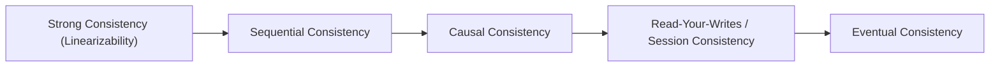
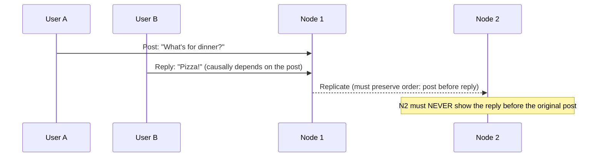

## Introduction

"Strong consistency" and "eventual consistency" get treated as if they're the only two options, but real distributed systems offer a spectrum of consistency models in between, each with distinct guarantees and costs. This chapter builds on Chapters 15 (Replication) and 18 (CAP/PACELC) to map that spectrum precisely.

## The Consistency Spectrum

Moving left to right: guarantees get weaker, but availability, latency, and scalability generally improve.

## Strong Consistency (Linearizability)

Every operation appears to take effect instantaneously at some point between its invocation and completion, and all nodes agree on a single, global order of operations that matches real time. Once a write completes, **every** subsequent read, from **any** node, sees that write immediately.

**Cost**: Requires coordination (often via consensus, Chapter 23) on every operation, meaning higher latency and reduced availability during partitions — this is the "C" in CAP theorem's strict sense.

**Example use case**: A distributed lock service (Chapter 27) — if two clients believe they hold the same lock simultaneously due to a consistency gap, the entire purpose of the lock is defeated.

## Sequential Consistency

All nodes see operations in the *same* order, but that order doesn't necessarily have to match real-world/wall-clock time. Weaker than linearizability (which additionally requires the order to respect real-time ordering), but still guarantees a single, globally-agreed sequence of events.

**Example use case**: A distributed logging system where all consumers must process log entries in an identical order, but the exact real-time alignment of when each entry became visible isn't critical.

## Causal Consistency

Operations that are **causally related** (one happened because of, or after seeing, another) are seen by all nodes in that same causal order. Operations with no causal relationship (**concurrent** operations) can be seen in different orders by different nodes without violating the guarantee.

**Example use case**: A comment thread — a reply must never be shown before the comment it's replying to, even if unrelated posts elsewhere can be displayed in any order across different users' views.

## Read-Your-Writes (Session) Consistency

A specific, practical guarantee: **a user always sees their own writes** in subsequent reads, even if other users might briefly see stale data. As discussed in Chapter 15, this directly solves the "I just updated my profile but see the old version" problem.

**Implementation approach**: Track a version/timestamp of the user's most recent write; route their subsequent reads to a replica confirmed to have caught up to at least that version (or to the leader directly).

## Monotonic Reads Consistency

Once a user has seen a particular value, they will never subsequently see an *older* value in later reads — the data they observe only moves forward in time, never backward (as introduced in Chapter 15). This is weaker than read-your-writes (it doesn't guarantee seeing your *own* writes specifically) but still prevents a specific class of confusing user experience.

## Eventual Consistency

The weakest common guarantee: given enough time with no new writes, all replicas will converge — but no ordering, causality, or timing guarantees are made in the interim (as detailed in Chapter 17's BASE discussion).

## Practical Guidance: Matching the Model to the Use Case

| Use case | Appropriate model | Why |
|---|---|---|
| Distributed lock / leader election | Strong (Linearizable) | Correctness fails completely without it |
| Bank account balance | Strong or Causal (often stronger) | Financial correctness required |
| Comment threads / social replies | Causal | Order of related events must be preserved; unrelated events don't matter |
| "You just updated your profile" | Read-Your-Writes | Solves the single most common, confusing UX bug from replication lag |
| Like counts, view counts | Eventual | Staleness causes no real harm |
| Global user activity feed ranking | Eventual (often with monotonic reads) | Staleness acceptable, but shouldn't visibly regress for one user |

## Why This Matters More Than the Coarse CAP Framing

A common shallow interview answer says "I'll use eventual consistency for availability." A stronger answer identifies the *specific* consistency guarantee actually needed — often something in between full linearizability and pure eventual consistency (like causal consistency or read-your-writes) — since the strongest guarantee that actually satisfies the requirement, and no stronger, is usually the right engineering target. Overshooting (defaulting to strong consistency everywhere) costs latency and availability unnecessarily; undershooting (defaulting to pure eventual consistency everywhere) risks visible, confusing correctness bugs.

## Summary

- Consistency exists on a spectrum, not a binary: linearizability, sequential, causal, read-your-writes, monotonic reads, and eventual consistency each offer distinct guarantees at distinct costs.
- Causal consistency preserves the order of *related* events while allowing unrelated events to be seen in different orders — a good middle ground for many social/collaborative features.
- Read-your-writes and monotonic reads are practical, narrowly-scoped guarantees that solve specific, common, confusing user-facing bugs without paying for full strong consistency.
- The right approach is matching the weakest guarantee that still satisfies the actual requirement — not defaulting reflexively to either extreme.

---

## Interview Questions

### 1. What is the difference between linearizability (strong consistency) and sequential consistency?
**Answer:** Linearizability requires that all operations appear to take effect in an order consistent with real, wall-clock time — if operation A completes before operation B begins (in real time), every node must observe A before B. Sequential consistency relaxes this specific real-time requirement: it still requires that all nodes agree on a single, consistent global order of operations, but that agreed-upon order doesn't necessarily have to match the actual real-time sequence in which operations were issued — two operations that were concurrent (or where their real-time ordering is ambiguous) could be sequenced either way, as long as every node agrees on and observes the *same* chosen order.

**Follow-up:** *Why might sequential consistency be easier (cheaper) to implement than linearizability in a distributed system?* — Sequential consistency doesn't require nodes to coordinate around precise real-time synchronization (which is inherently difficult in distributed systems due to network delays and imperfect clock synchronization) — it only requires agreement on *some* single consistent ordering, which can be achieved through mechanisms like a logical clock or a single ordering service, without needing every node's decisions to be tightly bound to actual wall-clock timing, reducing coordination overhead compared to linearizability's stricter real-time requirement.

### 2. Explain causal consistency using a concrete example, and describe what could go wrong for a user if a system only offered eventual consistency instead.
**Answer:** Causal consistency guarantees that if operation B happened *because of* or *after observing* operation A (a causal relationship), every node must show A before B — but operations with no causal relationship (concurrent, independent events) can be shown in different orders on different nodes without violating the guarantee. Concretely, in a comment thread, if User B replies to User A's original post, that reply is causally dependent on the post — under causal consistency, no other user should ever be able to see B's reply without also being able to see A's original post it's replying to. Under pure eventual consistency (with no causal ordering guarantee at all), it's possible — due to differing replication delays for the two separate writes — for a different user, briefly, to see B's reply appear on their feed *before* A's original post has replicated to that same node, creating a confusing, seemingly nonsensical "reply to nothing" experience.

**Follow-up:** *How might a system practically implement causal consistency, at a high level?* — A common technique uses "vector clocks" or similar causal metadata attached to each write, recording which prior operations a given write causally depends on (e.g., the reply's metadata records that it depends on having seen the original post) — when replicating or displaying data, the system checks this metadata and ensures a causally-dependent operation is only made visible after its dependencies have also been made visible on that same node, rather than simply replicating and displaying writes in whatever arbitrary order they happen to arrive.

### 3. What specific, common user-facing bug does "read-your-writes" consistency solve, and how is it typically implemented without requiring full strong consistency for all reads?
**Answer:** It solves the confusing scenario (introduced in Chapter 15) where a user updates something (e.g., their profile picture) and then immediately reloads/revisits a page that reads from a lagging replica, seeing their *old* data as if the update silently failed — a jarring, trust-eroding experience even though the write actually succeeded. It's typically implemented by tracking a marker (a timestamp, or a version/sequence number) associated with the user's most recent write, and ensuring that user's *subsequent* reads (at least for some window of time, or specifically for that piece of data) are either routed to the leader directly, or to a replica that can be confirmed to have caught up to at least that marked version — importantly, this special handling is scoped specifically to that user's own post-write reads, not applied as a blanket strong-consistency requirement for all reads from all users at all times, preserving most of the scalability benefit of using replicas for the vast majority of ordinary reads.

**Follow-up:** *Would a "monotonic reads" guarantee alone (without read-your-writes) be sufficient to solve this specific "I don't see my own update" problem?* — No — monotonic reads only guarantees that a user's sequence of reads never goes *backward* in time relative to what they've *already personally observed*; it says nothing about whether their very first read after making a write will actually reflect that specific write, since they haven't yet "observed" that write in a prior read to establish the forward-only baseline — read-your-writes is a distinctly stronger, more specific guarantee needed to directly address this particular scenario.

### 4. Why would a distributed lock service require linearizability specifically, and what could go wrong with a weaker consistency model like causal consistency for this use case?
**Answer:** A distributed lock's entire purpose is to guarantee mutual exclusion — ensuring only one client can hold the lock at any given real-world moment in time, so that only one client proceeds with whatever critical operation the lock is protecting. This requires linearizability specifically because it needs a single, real-time-consistent, global agreement on exactly who currently holds the lock at any instant — a weaker model like causal consistency, which only orders *causally related* operations relative to each other, provides no such guarantee for two clients' lock-acquisition attempts that have no causal relationship to each other (they're concurrent, independent attempts) — under causal consistency alone, both clients could potentially believe they've successfully acquired the lock simultaneously, completely defeating the mutual-exclusion guarantee the lock is meant to provide.

**Follow-up:** *Does requiring linearizability for a distributed lock mean the entire surrounding system must also be linearizable?* — No — as emphasized throughout this chapter and Chapter 18, consistency requirements should be evaluated per-component/per-operation; a system can use a specifically linearizable component (like ZooKeeper or etcd, purpose-built for this exact use case) just for its distributed locking/coordination needs, while other, less strict parts of the same broader system (e.g., logging, analytics, non-critical caches) can reasonably use much weaker consistency models without needing the entire system to be uniformly linearizable.

### 5. A candidate defaults to designing every feature in a social media application with strong (linearizable) consistency "to be safe." What's the practical cost of this decision, and how would you push back constructively?
**Answer:** Defaulting to linearizability everywhere imposes a continuous, system-wide coordination/latency cost (as discussed in Chapter 18's PACELC framing) on every single operation, even for features like like-counts, view-counts, or activity feeds where brief staleness or even occasional out-of-order visibility causes no real harm to users or the business — this unnecessarily sacrifices availability and adds latency across the entire application for a level of correctness that most of its features simply don't need, potentially making the whole product feel sluggish or become less resilient to partial failures, all in service of a guarantee that's overkill for the vast majority of its actual data. A constructive pushback would involve walking through specific features one by one, asking "what would actually go wrong, concretely, if this specific piece of data were only eventually consistent (or causally consistent) rather than linearizable?" — for most social media features, the honest answer is "very little to nothing," at which point a weaker, cheaper, more available consistency model becomes the clearly better-justified choice, reserving strong consistency specifically for the comparatively rare operations (e.g., payment processing, if the platform has any commerce features) that genuinely need it.

**Follow-up:** *What's a risk of swinging too far in the opposite direction — defaulting to pure eventual consistency everywhere without considering intermediate models like causal consistency?* — As illustrated in the comment-thread example earlier in this chapter, pure eventual consistency (with no causal ordering guarantee at all) can produce genuinely confusing, seemingly broken user experiences (like a reply appearing before the post it's replying to) — swinging to the opposite extreme trades one set of problems (unnecessary latency/availability cost from over-applying strong consistency) for a different set of problems (confusing, causality-violating user experiences from under-applying any ordering guarantee at all) — the well-reasoned middle ground, using models like causal consistency or read-your-writes for the specific features that need them, avoids both extremes' respective downsides.

### 6. Why is it inaccurate to describe "eventual consistency" and "causal consistency" as simply two arbitrary points with no principled relationship, rather than as part of a coherent, ordered spectrum?
**Answer:** These consistency models exist in a principled hierarchy based on how much ordering/agreement information they preserve: eventual consistency provides no ordering guarantees at all beyond "things will converge eventually," while causal consistency provides a strictly *additional* guarantee on top of that — preserving the relative order specifically of causally-related operations — meaning any system that is causally consistent is, by definition, also eventually consistent (it still guarantees eventual convergence, plus the additional causal-ordering property), but the reverse isn't true (a purely eventually consistent system provides no such causal guarantee). This strict "provides everything the weaker model provides, plus more" relationship is what makes it a genuine spectrum/hierarchy rather than a set of arbitrary, unrelated options — each stronger model in the spectrum (sequential, causal, read-your-writes relative to pure eventual) adds a specific, well-defined additional guarantee on top of the guarantees already provided by the weaker models below it.

**Follow-up:** *Where does "read-your-writes" consistency fit relative to "causal consistency" in this hierarchy — is one strictly stronger than the other?* — They're not strictly ordered relative to each other in a simple subset relationship — they provide different, somewhat orthogonal specific guarantees (read-your-writes is about a single user seeing their *own* prior writes specifically; causal consistency is about preserving order between *any* causally-related operations, regardless of which user made them) — a system could reasonably implement one without the other, or both together (many practical systems combine several of these targeted, specific guarantees rather than needing the full generality of a strict, single-dimension hierarchy for every model in this chapter).

### 7. In a system using vector clocks to implement causal consistency, what problem are vector clocks specifically solving, and why can't a simple, single incrementing counter (like a Lamport timestamp) fully solve it?
**Answer:** Vector clocks are designed to precisely capture and distinguish *causal* relationships between events across multiple, potentially concurrent nodes — specifically, to determine whether one event definitively happened-before another (a genuine causal relationship) or whether two events are truly concurrent (neither happened before the other, with no causal relationship at all) — this distinction matters because causal consistency specifically only needs to preserve order for the former case, while genuinely concurrent events can be ordered arbitrarily. A simple single incrementing counter (Lamport timestamp) can establish *a* consistent ordering of events (useful for sequential consistency) but cannot, on its own, distinguish whether two events with different counter values are genuinely causally related or merely happen to have been assigned different counter values despite being truly concurrent and causally independent — vector clocks solve this by maintaining a separate counter *per node*, allowing a precise, mathematical comparison between any two events' vector clocks to definitively determine happened-before vs. concurrent relationships, which a single scalar counter fundamentally cannot distinguish.

**Follow-up:** *What's a practical downside of vector clocks that limits their use in very large-scale distributed systems?* — A vector clock's size grows proportionally with the number of distinct nodes/replicas in the system (since it needs one counter per node), meaning the metadata overhead attached to every single operation grows as the system scales to more nodes — for systems with very large numbers of nodes/replicas, this overhead can become significant, motivating various practical approximations, size-bounding techniques, or alternative causality-tracking mechanisms in extremely large-scale real-world deployments rather than using unbounded, full vector clocks.

### 8. Why might a system offering "monotonic reads" but NOT "read-your-writes" still leave a gap in user experience, even though monotonic reads sounds like a strong guarantee?
**Answer:** Monotonic reads only guarantees that once a user has observed a particular value in a read, their subsequent reads will never show them anything *older* than what they've already seen — but it says nothing about whether their reads will promptly reflect their *own* recent writes specifically; if a user's first read after making a write happens to hit a replica that hasn't yet caught up to that write, monotonic reads alone doesn't prevent this — it only prevents things from getting *worse* (going backward) after that point, not the initial failure to see one's own just-made change at all. This means a system could technically satisfy monotonic reads perfectly while still exhibiting the classic "I just updated my profile but it still shows the old version" bug on the user's very first post-write read — read-your-writes is a distinct, additional guarantee specifically needed to close this particular gap.

**Follow-up:** *Could a system provide read-your-writes without also providing monotonic reads? What would that look like, and why would it still be problematic?* — Yes, in principle — a system might correctly ensure a user always sees their *own* specific writes promptly (satisfying read-your-writes for that specific data), but if the user's *general* reads are still routed inconsistently across differently-lagging replicas for other, unrelated data, they could still experience a "going backward in time" sensation for that other data even while their own writes are handled correctly — this would still be a confusing, incomplete experience, illustrating why many real systems aim to provide both guarantees together (often via the same underlying mechanism, like consistently routing a given session's reads to a sufficiently caught-up, consistently-chosen replica) rather than treating them as fully independent, separately-solvable problems.

### 9. How would you explain, to a product manager without a technical background, why a "like" button can safely use a weaker consistency model while a "checkout/payment" button cannot?
**Answer:** You might frame it in terms of consequences of being briefly wrong: if a "like" count is off by one or two for a few seconds while the update spreads across our servers, essentially no one will notice or be meaningfully affected — the cost of that brief inaccuracy is effectively zero. But if our payment system briefly shows an incorrect account balance or allows an order to be processed twice due to the same kind of brief inconsistency, that translates into real financial harm — double-charging a customer, or shipping an item that was actually out of stock — with real costs in refunds, customer trust, and potentially legal/compliance exposure. Because these two features have such different real-world costs of being briefly "wrong," it makes sense to invest the extra performance and infrastructure cost of stronger guarantees specifically where the stakes are high (payments), while keeping the less critical features (likes) fast and highly available, since spending that same extra cost there wouldn't actually protect against anything that matters.

**Follow-up:** *How would you extend this explanation if the product manager then asks "why not just use the strong, safe option everywhere, then, to avoid ever having to make this judgment call feature by feature"?* — You'd explain that the "strong, safe" option isn't free — it makes every single interaction (including things like liking a post) measurably slower and less resilient (more likely to fail or become temporarily unavailable during infrastructure hiccups), because the system has to do extra coordination work behind the scenes for every single action, not just the important ones — applying that cost uniformly to every feature, including ones where it provides no real user or business benefit, would make the entire product feel slower and less reliable overall, for no actual gain on the low-stakes features, which is why matching the guarantee to the actual stakes of each specific feature is the better trade-off, not a shortcut being taken for low-priority features.

### 10. Why is a claim like "MongoDB is an eventually consistent database" potentially misleading or oversimplified, given the material in this chapter and Chapter 18?
**Answer:** This kind of blanket, database-wide characterization ignores that most modern databases (including MongoDB) offer *configurable, per-operation* consistency behavior rather than being fixed to a single point on the consistency spectrum — MongoDB, for instance, can provide strongly consistent reads from its primary node by default in many configurations, while also supporting explicitly reading from secondary replicas (which could then exhibit eventual consistency / replication lag) if the application specifically opts into that for performance/scalability reasons — describing "MongoDB" as simply "eventually consistent" collapses this nuanced, tunable reality into an oversimplified, and often simply inaccurate, single label, when the actual consistency behavior experienced depends heavily on specific configuration choices and read/write settings made by the application for each specific operation, not a single fixed property of the database as a whole.

**Follow-up:** *What would a more accurate, nuanced way of discussing a specific database's consistency properties in an interview look like?* — Rather than applying single blanket labels, a nuanced answer would specify the particular configuration/settings being assumed or chosen (e.g., "using MongoDB with reads directed to the primary, we get strongly consistent reads for that data; if we instead configure read preference to allow reads from secondaries for better read scalability on less critical data, we'd be accepting eventual consistency with some replication lag for those specific reads") — demonstrating awareness that consistency is often a per-operation configuration choice within a given database technology, not an immutable, singular property inherent to the technology's name alone.
