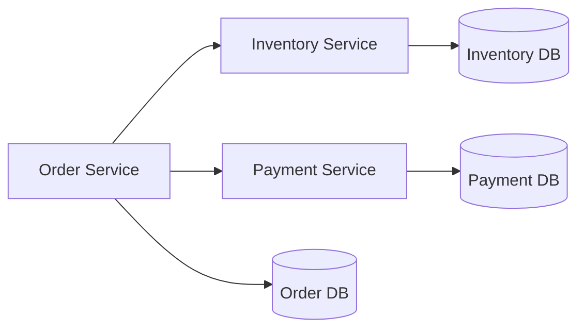
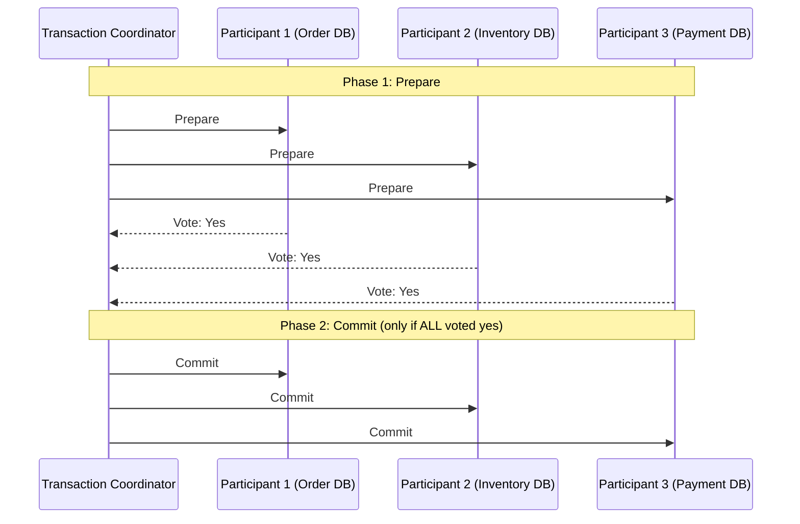
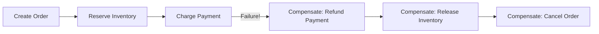
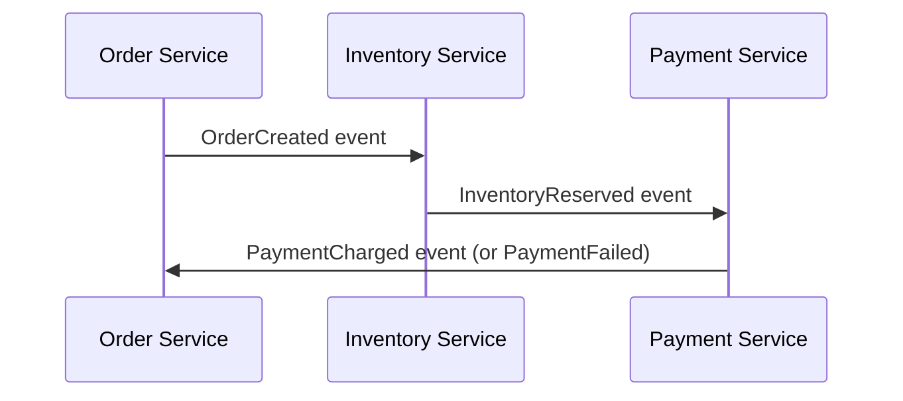
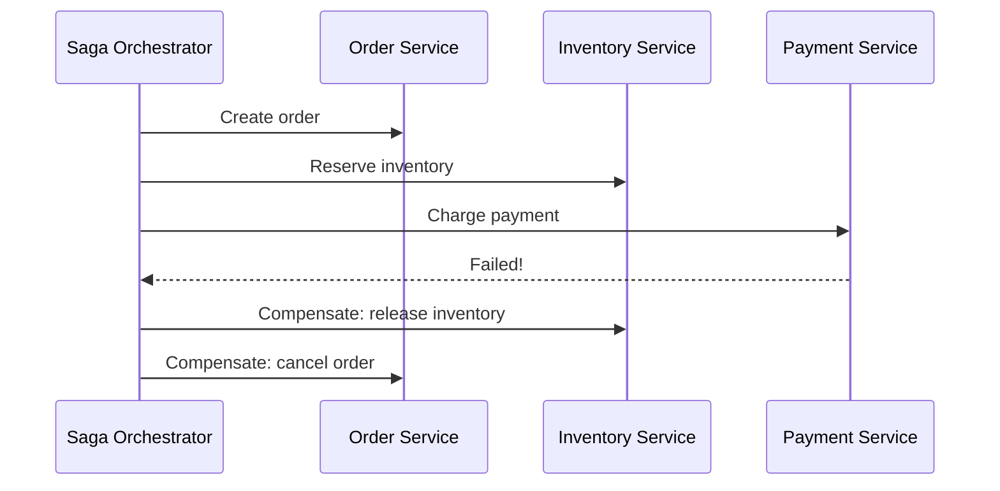

## Introduction

Chapter 17 covered ACID transactions within a single database. But once data is sharded (Chapter 16) or split across microservices (Chapter 34), a single logical business operation — like "place an order," which touches the Order Service, Inventory Service, and Payment Service — often needs to update multiple independent systems atomically. This chapter covers the two main approaches: Two-Phase Commit (2PC) and the Saga pattern.

## The Problem



Placing an order might require: creating the order record, decrementing inventory, and charging the customer's card — three operations across three independently-owned databases. If the payment fails after inventory has already been decremented, you have an inconsistent state: inventory reduced, but no successful order or payment to justify it. A single-database ACID transaction can't span these three separate systems.

## Two-Phase Commit (2PC)

2PC is a classic distributed transaction protocol coordinated by a central **transaction coordinator**.



**Phase 1 (Prepare)**: The coordinator asks every participant "can you commit this?" Each participant locks the necessary resources and responds "yes" (ready to commit) or "no" (abort).

**Phase 2 (Commit/Abort)**: If **all** participants voted "yes," the coordinator tells everyone to commit. If **any** participant voted "no," the coordinator tells everyone to abort/rollback.

**Strengths**: Provides genuine atomicity — either all participants commit, or none do.

**Weaknesses**:
- **Blocking protocol**: Participants hold locks on their resources from the "prepare" vote until they receive the final commit/abort instruction — if the coordinator crashes in between, participants can be stuck holding locks indefinitely, unable to proceed.
- **Coordinator is a single point of failure.**
- **Poor performance at scale**: Requires multiple synchronous round trips, and locks are held for the duration — not well suited to high-throughput microservices, and generally not natively supported across genuinely independent, differently-owned services communicating over a network (it was designed more for tightly-coupled distributed database systems).

Because of these weaknesses, 2PC is rarely used for cross-microservice transactions in modern architectures — it survives mainly within specific distributed database internals.

## The Saga Pattern

A **Saga** breaks a distributed transaction into a sequence of local transactions, each with a corresponding **compensating transaction** that undoes its effect if a later step fails.



If "Charge Payment" fails, the Saga executes compensating transactions in reverse order — refunding (if partially charged), releasing the reserved inventory, and canceling the order — bringing the system back to a consistent state, without ever needing a global lock across all three services simultaneously.

### Choreography vs Orchestration

**Choreography**: Each service listens for events from others and reacts independently — no central coordinator.



**Orchestration**: A central orchestrator explicitly directs each step and handles failures/compensation.



| | Choreography | Orchestration |
|---|---|---|
| Coordination | Distributed across services via events | Centralized in one orchestrator |
| Coupling | Looser (services only know about events, not each other directly) | Tighter (orchestrator knows the whole workflow) |
| Complexity as steps grow | Can become hard to trace/debug ("where did this fail?") | Easier to visualize and manage as a single defined workflow |
| Best for | Simple sagas with few steps | Complex, multi-step sagas needing clear visibility and control |

## A Java Sketch: Saga Step with Compensation

```java
public class OrderSagaOrchestrator {

    public void executeOrderSaga(OrderRequest request) {
        String orderId = null;
        boolean inventoryReserved = false;
        boolean paymentCharged = false;

        try {
            orderId = orderService.createOrder(request); // Step 1
            inventoryService.reserve(request.getItems());  // Step 2
            inventoryReserved = true;
            paymentService.charge(request.getPaymentInfo()); // Step 3
            paymentCharged = true;

            orderService.confirmOrder(orderId);
        } catch (Exception e) {
            // Compensate in reverse order
            if (paymentCharged) {
                paymentService.refund(request.getPaymentInfo());
            }
            if (inventoryReserved) {
                inventoryService.release(request.getItems());
            }
            if (orderId != null) {
                orderService.cancelOrder(orderId);
            }
            throw new SagaExecutionException("Order saga failed, compensated.", e);
        }
    }
}
```

## The Trade-off: Sagas Give Up Isolation

The critical thing Sagas sacrifice compared to a true ACID transaction is **isolation**. Between individual saga steps, the partial state is visible to other parts of the system — e.g., between "Reserve Inventory" and "Charge Payment," another process could see the reduced inventory count even though the overall order hasn't been confirmed yet. Handling this typically requires patterns like marking records with a "pending" status, and designing read paths to account for in-progress sagas appropriately.

## Summary

- Distributed transactions are needed when a single business operation spans multiple independently-owned databases or services.
- Two-Phase Commit provides strong atomicity but is a blocking protocol with a single point of failure, making it poorly suited to modern, loosely-coupled microservice architectures.
- The Saga pattern breaks a distributed transaction into a sequence of local transactions with compensating actions, avoiding 2PC's blocking/locking cost at the expense of giving up true isolation.
- Choreography (event-driven, decentralized) and orchestration (centrally coordinated) are the two implementation styles for Sagas, trading off coupling against visibility/manageability.

---

## Interview Questions

### 1. Why is a standard single-database ACID transaction insufficient once a system adopts microservices or shards its data?
**Answer:** ACID transactions rely on a single database engine's ability to atomically apply or roll back a set of changes within its own transactional boundary — this mechanism has no way to coordinate atomicity across multiple *independent* database instances or services, each with their own separate transactional boundary and no shared underlying transaction log. Once a business operation spans multiple independently-owned databases (as happens naturally with microservices, where each service typically owns its own database, or with sharding, where data is split across multiple database instances), you need a different mechanism specifically designed to coordinate atomicity *across* these independent transactional boundaries — which is exactly the problem distributed transaction protocols like 2PC and patterns like Saga are designed to solve.

**Follow-up:** *Why don't microservices typically share a single database that could use normal ACID transactions to avoid this problem entirely?* — Sharing a single database across microservices directly undermines a core microservices principle: independent deployability and loose coupling — if multiple services shared one database, a schema change needed by one service could inadvertently break another service relying on the same shared schema, and it would become far harder to scale, evolve, or even choose different database technologies independently per service, which is precisely the flexibility microservices architecture is meant to provide (further discussed in Chapter 34).

### 2. Walk through the two phases of Two-Phase Commit, and explain specifically why the protocol is described as "blocking."
**Answer:** In Phase 1 (Prepare), the coordinator asks every participant whether they can commit; each participant does whatever preparation is needed (acquiring necessary locks, validating the operation can succeed) and responds with a vote (yes/no), but critically does NOT yet actually commit — it holds its prepared state and acquired locks, awaiting further instruction. In Phase 2 (Commit/Abort), only after collecting all votes does the coordinator instruct every participant to either commit (if all voted yes) or abort (if any voted no). The protocol is "blocking" because, after voting "yes" in Phase 1, a participant *must* hold its locks and prepared state, unable to independently decide to commit or abort on its own, until it receives the coordinator's final instruction in Phase 2 — if the coordinator crashes or becomes unreachable during this window, the participant has no way to safely proceed on its own and can remain blocked, holding those locks indefinitely, until the coordinator recovers.

**Follow-up:** *Why can't a participant simply decide to abort on its own if the coordinator becomes unresponsive after Phase 1, rather than remaining blocked?* — Because the participant doesn't know whether other participants might have already received a "commit" instruction from the coordinator before it became unreachable (perhaps the coordinator sent commit to some participants before crashing) — if this participant unilaterally aborts while other participants have already committed, the system would end up in exactly the inconsistent, partially-applied state 2PC was designed to prevent; the safest option, absent further information, is to wait for the coordinator to recover and provide a definitive final instruction, which is precisely why the protocol is fundamentally blocking by design.

### 3. Why has the Saga pattern become more popular than Two-Phase Commit for coordinating transactions across microservices in modern system design?
**Answer:** Sagas avoid 2PC's fundamental blocking problem entirely — rather than holding locks across multiple services while waiting for a coordinator's final decision, each Saga step is its own independent, immediately-committed local transaction, and failures are handled after the fact via compensating transactions rather than by holding everything in a pending, locked state until a global decision is reached. This makes Sagas far better suited to the loosely-coupled, independently-scaled, and often geographically-distributed nature of microservices, where synchronous, multi-service locking (as 2PC requires) would introduce unacceptable latency, reduce availability, and create fragile dependencies between services that are supposed to be able to fail and scale independently — Sagas trade away strict atomicity/isolation (accepting that intermediate, partial states are briefly visible) in exchange for much better availability, scalability, and resilience to individual service failures, a trade-off that better matches microservices' overall design philosophy.

**Follow-up:** *Does this mean 2PC has no legitimate use cases at all in modern systems?* — 2PC still has legitimate uses in more tightly-coupled, typically single-vendor or single-infrastructure contexts — for example, some distributed database systems use 2PC-like protocols internally to coordinate transactions across their own shards (where the participants are all part of the same trusted, tightly-integrated system, and network latency between them is typically very low) — but it's generally avoided for coordinating transactions across genuinely independent, separately-deployed microservices communicating over less predictable networks, which is the context where Sagas have become the dominant pattern.

### 4. What is a "compensating transaction," and why must it be carefully designed rather than simply being the literal reverse of the original operation?
**Answer:** A compensating transaction is an operation specifically designed to semantically undo the effect of a previously completed Saga step, restoring the system to a consistent state as if that step (and any subsequent failed steps) had not succeeded. It often can't be the literal, naive reverse of the original operation because real-world business operations frequently have side effects or timing considerations that a simple reversal wouldn't correctly address — for example, compensating for "charge payment" isn't simply "un-charge payment" as if it never happened; it typically means explicitly issuing a *refund*, which is its own distinct operation (potentially with its own processing delay, fees, or audit trail) rather than a instantaneous, silent reversal of the original charge — the compensating action needs to achieve the same *end effect* (the customer isn't out any money) through operations that make sense within that specific domain's real-world constraints and semantics.

**Follow-up:** *What happens if a compensating transaction itself fails partway through (e.g., the refund attempt itself fails)?* — This is a genuinely hard, important edge case that Saga implementations must explicitly plan for — common approaches include retrying the compensating transaction with backoff (since many failures, like a transient network issue, are often temporary), routing persistently failing compensations to a manual review/intervention queue for human operators to resolve, and designing compensating transactions themselves to be idempotent (safe to retry) — the system generally cannot simply "give up," since an unresolved failed compensation represents genuinely inconsistent state (e.g., a customer who was charged but never received their refund) that needs some path to eventual resolution, even if that path sometimes requires human involvement.

### 5. Compare choreography-based and orchestration-based Saga implementations. What specific debugging/observability challenge does choreography introduce that orchestration avoids?
**Answer:** In choreography, each service independently listens for and reacts to events from other services, with no single component holding a complete view of the overall workflow — this makes debugging a failed or stuck saga significantly harder, since understanding "what happened and why" requires piecing together events and logs scattered across multiple independent services, with no single place to look for the full picture of the saga's current state or history. In orchestration, a central orchestrator explicitly tracks and directs every step of the saga, meaning its logs/state directly show the complete, sequential history and current status of any given saga instance in one place — making it far easier to answer questions like "where exactly did this specific order's saga fail, and what compensations have already been executed?"

**Follow-up:** *Given this debugging advantage, why would a team still choose choreography over orchestration for some sagas?* — Choreography avoids introducing a new, centralized orchestrator component that every participating service must depend on and communicate through, preserving looser coupling between services (each service only needs to know about the events it cares about, not a specific central coordinator's API) — for simpler sagas with few steps and straightforward failure handling, this reduced coupling and architectural simplicity can outweigh the debugging/observability disadvantage, especially if the team invests in strong distributed tracing (Chapter 42) to help mitigate the cross-service debugging challenge choreography otherwise introduces.

### 6. Why do Sagas explicitly sacrifice "isolation" compared to a true ACID transaction, and what practical problem can this cause?
**Answer:** Since a Saga is composed of multiple independently-committed local transactions rather than a single atomic unit, the intermediate state between steps (e.g., after inventory has been reserved but before payment has been confirmed) is genuinely, immediately visible and committed in its respective local database — unlike a true ACID transaction, where intermediate states are never visible to other observers until the entire transaction commits as a single, atomic unit. A practical problem this can cause: another process (or a customer refreshing an inventory count) might see very specific inventory as "reserved"/decremented for an order that ultimately ends up failing and being compensated (releasing that inventory back) moments later — briefly showing a technically inconsistent, in-progress state to anyone observing the system during that window.

**Follow-up:** *What's a common mitigation for the specific inventory-visibility problem described here?* — Using explicit intermediate status fields (e.g., marking reserved inventory with a "pending" or "reserved" status distinct from "available," rather than simply decrementing a raw count as if it were already fully, finally sold) allows other parts of the system reading that data to correctly interpret and handle the genuinely in-progress nature of that state — e.g., showing "3 left, 1 reserved" rather than silently showing an inventory count that later needs to be "un-decremented" if the saga fails and compensates, giving downstream consumers of that data the information needed to reason correctly about the system's true, in-progress state rather than being misled by an ostensibly final-looking number.

### 7. In an interview, you're asked to design an "place an order" flow spanning Order, Inventory, and Payment services. Walk through why you'd choose Saga over 2PC, and outline your compensating transactions.
**Answer:** You'd choose Saga because these are independently-owned, independently-scaled microservices communicating over a network — 2PC's blocking, lock-holding nature would create tight, fragile coupling between these otherwise-independent services and risk poor availability/performance under real production conditions (network delays, individual service slowness), which directly conflicts with the scalability and resilience goals that typically motivate a microservices architecture in the first place. Your Saga steps might be: (1) Create Order (status: pending), (2) Reserve Inventory, (3) Charge Payment, (4) Confirm Order (status: confirmed). If step 3 (Charge Payment) fails, your compensating transactions would run in reverse: release the reserved inventory (Step 2's compensation) and cancel/mark the order as failed (Step 1's compensation) — no compensation needed for payment itself since it never succeeded in this failure scenario; if instead a later step (e.g., a hypothetical shipping-initiation step) failed *after* payment succeeded, you'd additionally need a "refund payment" compensating transaction for the payment step.

**Follow-up:** *How would you decide between choreography and orchestration for this specific 3-4 step saga?* — Given the relatively small, well-defined number of steps (3-4) and the clear, linear dependency between them, orchestration is likely the more pragmatic choice here — it gives clear, centralized visibility into each order's saga progress (valuable for customer support and debugging failed orders) without much added coupling cost, since the number of services involved is small and the workflow itself is a natural fit for an explicit, sequential orchestrator rather than needing choreography's looser, event-driven decentralization, which tends to pay off more clearly for much larger, more complex, or more frequently-changing workflows involving many more participating services.

### 8. Why might a Saga's compensating transactions need to be designed as idempotent operations, similar to the idempotency discussion in Chapter 4?
**Answer:** In a distributed system, network failures or timeouts can cause a Saga orchestrator (or a choreography-based service) to be uncertain whether a compensating transaction it sent was actually received and executed — leading it to potentially retry sending that same compensating instruction (e.g., "release this inventory reservation" or "issue this refund") more than once to be safe. If the compensating transaction isn't idempotent, a retried compensation could cause incorrect double-effects — e.g., releasing the same reserved inventory twice (potentially causing inventory counts to become artificially inflated beyond what was ever actually available) or issuing a duplicate refund to a customer — designing compensating transactions to be idempotent (e.g., using the original transaction's unique ID to ensure a specific compensation is only ever actually applied once, regardless of how many times the instruction to perform it is received) prevents these retry-related correctness bugs, just as idempotency prevents similar problems for regular API requests in Chapter 4's discussion.

**Follow-up:** *How might you concretely implement idempotency for a "release inventory" compensating transaction?* — Track the original reservation by a unique reservation ID; when a "release" compensating instruction arrives, first check whether that specific reservation ID has already been released — if so, treat the (retried) release request as a no-op success rather than attempting to release/increment inventory again, ensuring that no matter how many times the same release instruction is received, the actual inventory adjustment is only ever applied once for that specific original reservation.

### 9. Why can't the Saga pattern alone fully guarantee "Consistency" in the strict ACID sense, and what does this imply for how you should describe Saga-based systems in an interview?
**Answer:** ACID's Consistency guarantees that a transaction always leaves the database in a state satisfying all defined constraints — but a Saga, being a sequence of independently-committed local transactions with a deliberate, potentially-visible intermediate state between steps (as discussed above), cannot make that same strict, atomic, all-or-nothing guarantee about the *overall*, cross-service business operation while it's still in progress — there genuinely exists a window where the aggregate state across all involved services doesn't yet reflect a single, fully-consistent "final" business outcome (e.g., inventory reserved without a confirmed payment yet). In an interview, you should be precise about this: describe the Saga pattern as providing *eventual* consistency for the overall multi-service business operation (the system will eventually reach a consistent final state — either all steps succeed, or compensations correctly undo the partial progress) rather than claiming it provides the same strict, immediate ACID consistency guarantee a single-database transaction would — conflating these two different guarantees would signal an imprecise understanding of what Sagas actually promise.

**Follow-up:** *Does this mean choosing Sagas is fundamentally at odds with ever achieving strong consistency for a critical cross-service business operation?* — It means achieving strong, immediate consistency for a *specific* critical cross-service operation would require either accepting 2PC's blocking trade-offs for that specific operation (if truly justified by the stakes involved), or redesigning the system so that the specific data requiring strong atomic consistency actually lives within a single service/database's transactional boundary in the first place (avoiding the cross-service coordination problem entirely for that specific critical piece of data) — rather than trying to force the Saga pattern itself to provide a guarantee it's fundamentally not designed to provide.

### 10. A junior engineer proposes implementing the entire "place an order" saga using 2PC because "it guarantees correctness, and correctness is what matters most." How would you respond, incorporating both the theoretical and practical considerations from this chapter?
**Answer:** You'd acknowledge that 2PC's atomicity guarantee is theoretically appealing and genuinely does provide stronger, more immediately consistent correctness than a Saga's eventual, compensation-based approach — but you'd point out that this theoretical correctness comes with serious practical costs in this specific context: 2PC would require the Order, Inventory, and Payment services to remain synchronously coordinated and hold locks for the duration of the transaction, meaning if any one of these services (or the network connecting them) experiences even a brief slowdown, the entire order-placement flow blocks for *all* customers attempting to place orders during that window, not just the ones affected by the specific slow service — a severe availability and scalability risk for what's likely a very high-traffic, business-critical flow (order placement) that should ideally remain resilient to any single service's transient issues. You'd propose that the Saga pattern's eventual-consistency trade-off, combined with well-designed compensating transactions and appropriate handling of the brief intermediate-state visibility (as discussed earlier), provides a more practically appropriate level of correctness — genuinely resolving to a consistent final state, just not instantaneously — while preserving the availability and independent scalability that make a microservices architecture worthwhile in the first place, and that this is a case where the theoretically "stronger" guarantee (2PC) is actually the practically worse engineering choice for this specific real-world context.

**Follow-up:** *Is there a scenario where you'd agree with the junior engineer that the stronger guarantee is worth the practical cost, even for this type of order-placement flow?* — If the business genuinely operated at a small enough scale, with sufficiently low traffic and tightly-controlled, co-located infrastructure (e.g., all three services running in the same data center with very reliable, low-latency internal networking, and order volume low enough that occasional blocking during rare transient issues wouldn't meaningfully harm the business), the practical downsides of 2PC's blocking behavior might genuinely be small enough to accept in exchange for its stronger correctness guarantee and comparative implementation simplicity — the "right" choice, as with most system design decisions in this series, ultimately depends on the specific, actual scale and requirements at hand, not a universal rule that Sagas are always correct and 2PC is always wrong.
