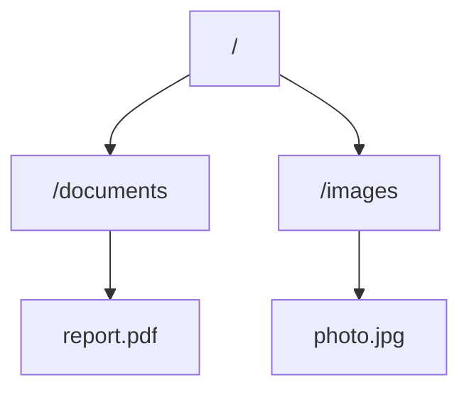
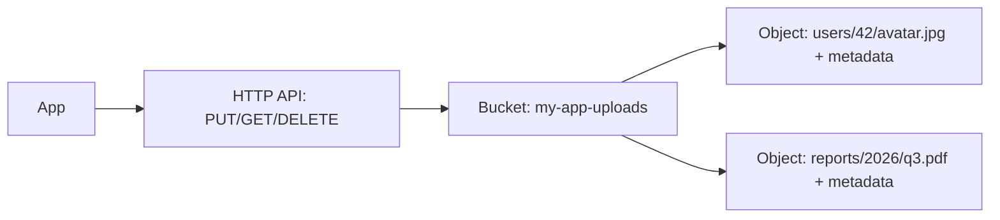

## Introduction

This chapter closes Part 3 by stepping beneath the database layer entirely — to the raw storage abstractions that databases, file systems, and applications are built on top of. Understanding these helps you make grounded decisions when a system design calls for storing large binary files (images, videos, backups) rather than structured records.

## Block Storage

Block storage divides data into fixed-size **blocks**, each with its own address, with no inherent understanding of files or structure — that's left entirely to whatever is layered on top (typically an OS file system).


**Characteristics:**
- Extremely low latency, high performance — the closest storage abstraction to raw hardware.
- Supports random access reads/writes to individual blocks efficiently.
- Requires something else (an OS, a database engine) to impose structure on top.

**Use cases**: The underlying storage for databases (a database engine manages its own data layout directly on block storage for maximum control and performance), virtual machine disks (e.g., AWS EBS), and any workload needing raw, low-level disk performance.

## File Storage

File storage organizes data into a familiar **hierarchical structure** of files and directories, accessed via standard file system protocols (NFS, SMB).



**Characteristics:**
- Familiar, human-readable organization (paths, folders, filenames).
- Supports concurrent access from multiple clients/servers (a "Network File System").
- Metadata (permissions, timestamps, file names) is a first-class part of the abstraction.

**Use cases**: Shared file systems accessed by multiple application servers (e.g., a shared configuration directory, legacy applications expecting a traditional file system interface), content management systems, home directories in enterprise environments.

## Object Storage

Object storage manages data as discrete **objects** — each with data, metadata, and a unique identifier — stored in a flat namespace (no true nested directory hierarchy, though prefixes can simulate one) and accessed via an HTTP-based API.



**Characteristics:**
- **Virtually unlimited horizontal scalability** — designed from the ground up for massive scale (billions of objects) across distributed infrastructure.
- **Rich, custom metadata** attached to each object (unlike block storage, which has no concept of metadata at all).
- **HTTP API access** (`GET`, `PUT`, `DELETE`) rather than file-system-style access — a natural fit for cloud-native and web applications.
- **No in-place partial modification** — updating an object typically means replacing it entirely, unlike a file system's ability to modify part of a file in place.
- Higher latency than block storage, and not suited for random, low-latency access patterns a database needs.

**Use cases**: Storing user-uploaded images/videos, static website assets (often paired with a CDN, Chapter 11), backups and archives, data lake storage for analytics — the default choice for large binary content in modern cloud-native systems (Amazon S3 being the canonical example).

## Comparison Table

| | Block Storage | File Storage | Object Storage |
|---|---|---|---|
| Access unit | Fixed-size blocks | Files in a hierarchy | Objects (data + metadata) in a flat namespace |
| Access method | Direct disk-level access | File system protocols (NFS/SMB) | HTTP API (REST) |
| Latency | Lowest | Low-medium | Higher |
| Scalability | Limited (tied to the volume) | Moderate | Virtually unlimited |
| Metadata support | None | Basic (filesystem attributes) | Rich, customizable |
| In-place modification | Yes | Yes | No (replace whole object) |
| Typical use case | Databases, VM disks | Shared drives, legacy apps | User uploads, backups, static assets, data lakes |

## Why This Matters for HLD

When a case study (Chapter 60, "Design a Distributed File Storage System") asks you to store user-uploaded files, the correct instinct is almost always **object storage**, not trying to build a custom file system or storing binary blobs directly in a relational database. Storing large binary files directly inside a SQL database (as a `BLOB` column) is a classic anti-pattern — it bloats the database, slows down backups, and doesn't scale the way dedicated object storage does; the standard pattern is to store the file in object storage and keep only a reference (a URL or object key) in the database record.

```java
public class DocumentService {

    private final ObjectStorageClient storageClient; // e.g., S3 client
    private final DocumentRepository documentRepository; // relational DB

    public Document uploadDocument(String userId, byte[] fileContent, String fileName) {
        String objectKey = "users/" + userId + "/" + UUID.randomUUID() + "-" + fileName;
        storageClient.putObject("my-app-bucket", objectKey, fileContent);

        Document doc = new Document();
        doc.setUserId(userId);
        doc.setFileName(fileName);
        doc.setObjectKey(objectKey); // store only the reference, not the file itself
        doc.setUploadedAt(Instant.now());
        return documentRepository.save(doc);
    }
}
```

## Summary

- Block storage is the lowest-level, highest-performance abstraction, underlying databases and VM disks, with no inherent structure of its own.
- File storage provides a familiar hierarchical structure with shared, multi-client access via standard protocols.
- Object storage offers virtually unlimited scalability and rich metadata via an HTTP API, at the cost of higher latency and no in-place partial modification — the default choice for large binary content in cloud-native systems.
- Storing large binary files directly in a relational database is a common anti-pattern; storing them in object storage and keeping only a reference in the database is the standard, scalable pattern.

---

## Interview Questions

### 1. What is the key structural difference between block storage and object storage, and why does this difference lead to object storage's superior horizontal scalability?
**Answer:** Block storage manages data as raw, fixed-size blocks with no inherent metadata or higher-level structure — it's tightly coupled to a specific volume/device, and there's no distributed API designed for accessing blocks from many different clients across a network at scale. Object storage manages data as complete, self-contained objects (data plus rich metadata plus a unique key) in a flat namespace, purpose-built with an HTTP-based API from the ground up specifically to be distributed across many nodes and accessed concurrently by potentially massive numbers of clients — this fundamentally different, network-native design (rather than being tied to the low-level, single-volume semantics of block storage) is precisely what allows object storage systems to scale horizontally to billions of objects across globally distributed infrastructure in a way block storage's architecture was never designed to support.

**Follow-up:** *Does this mean object storage could theoretically be built "on top of" block storage internally? What would that imply?* — Yes — in practice, object storage systems are typically implemented using block storage (or raw disks) as their actual underlying physical storage medium, with the object storage system's own software layer providing the distributed API, metadata management, and horizontal scaling logic on top of that lower-level foundation — this illustrates that these aren't necessarily mutually exclusive alternatives at the physical level, but rather different abstraction layers, with object storage being a higher-level, purpose-built distributed system constructed using block storage as one of its foundational building blocks.

### 2. Why is storing large binary files (like user-uploaded videos) directly as BLOBs in a relational database generally considered an anti-pattern?
**Answer:** Storing large binary content directly in a relational database bloats the database's size significantly, which slows down routine database operations like backups, replication, and index maintenance (since the database now has to manage and move around potentially enormous binary payloads alongside its actual structured, relational data) — none of which the relational database's transactional/relational strengths are actually needed for or well-suited to handle at scale. Additionally, relational databases don't scale horizontally as easily as dedicated object storage systems (Chapter 16), meaning large binary content stored this way inherits the database's comparatively limited scalability rather than benefiting from object storage's purpose-built, virtually unlimited horizontal scale for exactly this kind of large binary content.

**Follow-up:** *What's the standard pattern instead, and what specific piece of information does the database still need to store?* — The standard pattern stores the actual binary file content in dedicated object storage (like Amazon S3), and the relational database stores only a lightweight reference — typically the object's unique key/identifier (and often a few pieces of associated metadata like upload timestamp or file size) — allowing the database to remain small, fast, and focused on the structured relational data it's actually good at managing, while the object storage system handles the actual large binary payloads it's specifically designed for.

### 3. Explain why object storage typically does not support efficient in-place partial modification of an object, unlike a traditional file system.
**Answer:** Object storage is architecturally designed around treating each object as a complete, immutable (or replace-as-a-whole) unit — this design choice is part of what enables its massive horizontal scalability and distributed architecture, since the system doesn't need to support complex, fine-grained, concurrent partial-write coordination *within* a single object across a distributed, replicated storage system (which would be considerably more complex to implement correctly and efficiently at scale). A traditional file system, by contrast, is typically designed around a single machine's (or a smaller-scale, more tightly-coupled distributed) file system, generally with a much smaller effective single-tenant scale, where efficiently supporting in-place partial modifications (like appending to a log file, or updating specific bytes) is comparatively more tractable to implement well.

**Follow-up:** *What does this trade-off imply for an application that needs to make frequent, small, incremental updates to a large file, such as an append-only log?* — Such a use case is generally a poor fit for standard object storage's whole-object-replacement model (since even a tiny incremental update would require re-uploading the entire object) and would be much better served by block storage or file storage instead, where in-place, incremental modifications like appends are a natural, efficient, well-supported operation — this is a good example of matching the storage abstraction choice to the actual access pattern's specific needs, rather than defaulting to object storage universally just because of its general scalability appeal for other kinds of large binary content.

### 4. Why might a legacy enterprise application specifically require file storage (like NFS) rather than modern object storage, even in an otherwise cloud-native environment?
**Answer:** Many legacy applications were originally built assuming direct access to a traditional, POSIX-compliant hierarchical file system — they might use file system-specific operations (like locking specific files, or navigating directory structures using standard file system calls) that simply have no equivalent in object storage's flat-namespace, whole-object HTTP API model. Migrating such an application to natively use object storage's API could require significant, potentially risky code changes to how the application interacts with its data — in these cases, using a managed file storage service (which presents a standard NFS/SMB interface, even if it's built on more modern, cloud-native infrastructure underneath) allows the legacy application to continue operating with the file system interface it expects, without requiring a potentially expensive and risky application rewrite, while still gaining some benefits of running in a modern cloud environment.

**Follow-up:** *What would be a reasonable long-term strategy for an organization in this situation, beyond just using managed file storage indefinitely as a stopgap?* — A reasonable long-term strategy would involve gradually refactoring or replacing the legacy application's data-access layer to work with object storage's API directly (or introducing an abstraction layer that could support either backend), allowing the organization to eventually benefit from object storage's superior scalability and cost-efficiency for this data — while using managed file storage in the interim as a pragmatic bridge that avoids blocking broader cloud migration efforts on a complete legacy application rewrite happening all at once.

### 5. In a system design interview for a photo-sharing application, why would object storage combined with a CDN (Chapter 11) be the natural architectural choice for storing and serving user photos?
**Answer:** User photos are essentially write-once, read-many, large binary objects with no need for in-place partial modification (a photo is typically replaced entirely, not incrementally edited byte-by-byte at the storage layer) — precisely the access pattern object storage is designed for, and its virtually unlimited horizontal scalability comfortably accommodates a photo-sharing application's potentially enormous and ever-growing volume of stored images. Pairing this with a CDN addresses the read-latency side of the equation: since photos, once uploaded, are typically read very frequently by many different users (and rarely change), caching them at CDN edge locations close to users (rather than serving every single photo view directly from the object storage's own, potentially more centralized location) directly reduces latency for the read-heavy access pattern that a photo-sharing application overwhelmingly exhibits.

**Follow-up:** *Would you store the actual photo file's binary data anywhere else in this architecture, such as directly in your application's relational database?* — No — following the anti-pattern discussion earlier, the relational database should store only the photo's metadata (uploader's user ID, upload timestamp, the object storage key/reference, perhaps dimensions or a caption) rather than the actual binary image data itself, keeping the database lean and focused on the structured, relational aspects of the application (like user relationships, likes, comments) while object storage (fronted by the CDN) exclusively handles serving the actual heavy binary photo content.

### 6. Why does object storage's rich, customizable metadata capability provide a genuine architectural advantage over block storage for certain use cases, beyond simply "it's nice to have extra information"?
**Answer:** Rich, queryable (in many object storage systems) metadata attached directly to each object allows an application to store and later retrieve important contextual information about that specific piece of content without needing a separate database lookup for basic attributes — e.g., storing a content-type, a custom application-specific tag, an access-control classification, or a checksum directly as object metadata allows systems consuming that object (or managing its lifecycle, like automated archival/deletion policies based on metadata like "created more than 1 year ago and tagged as temporary") to make decisions based on that metadata without necessarily requiring a database round trip just to determine basic handling logic for that specific piece of stored content — block storage, having no concept of metadata at all, would require any such contextual information to be tracked entirely separately (typically in an actual database), adding an extra coordination point that object storage's built-in metadata capability can sometimes eliminate for simpler use cases.

**Follow-up:** *Does relying on object storage's built-in metadata mean an application no longer needs a separate database for tracking information about stored objects?* — Not generally — for anything requiring complex querying, relational integrity, or transactional guarantees across multiple related pieces of information (e.g., "find all photos uploaded by users in a specific country, ordered by likes"), a proper database remains necessary, since object storage's metadata capabilities are typically much more limited in their querying sophistication compared to a full database — object storage metadata is best used for simpler, object-specific attributes and lifecycle management directly tied to that individual object, complementing rather than replacing a proper database for more complex application data needs.

### 7. Why is block storage generally the appropriate underlying choice for a database's own storage engine, rather than the database being built directly on top of object storage?
**Answer:** Database engines require extremely low-latency, fine-grained, random-access read/write operations to specific, precisely-addressed portions of their data files (e.g., updating a specific row within a specific data page as part of a transaction) — block storage's direct, low-level access to individual fixed-size blocks provides exactly this kind of fast, granular, in-place modification capability that a database engine's internal storage management (like B-Tree page updates, discussed in Chapter 14) fundamentally depends on for acceptable performance. Object storage's whole-object-replacement model and generally higher access latency (being accessed via an HTTP API rather than direct block-level access) would be a poor architectural fit for a database engine's need to efficiently read and modify small, specific portions of its data files with the low latency and fine-grained control that transactional database workloads demand.

**Follow-up:** *Are there any modern database or database-adjacent systems that do use object storage as their primary storage layer, and if so, what trade-off are they making?* — Yes — some modern data warehouse and data lake query engines (like certain configurations of Snowflake or various "lakehouse" architectures) do use object storage (like S3) as their primary durable storage layer, particularly for large-scale analytical workloads — these systems generally accept higher latency per individual data access in exchange for object storage's massive scalability and cost-efficiency for storing very large data volumes, and they typically compensate for the latency trade-off through techniques like extensive caching, columnar data formats optimized for large sequential scans (rather than the fine-grained random access transactional databases need), and being primarily used for read-heavy analytical queries rather than low-latency transactional workloads — illustrating that the "right" storage choice still fundamentally depends on the specific access pattern and workload characteristics involved.

### 8. A candidate proposes using file storage (NFS) as the primary storage layer for a globally distributed application serving millions of users' uploaded content. What scalability concern should you raise?
**Answer:** Traditional file storage systems (including managed NFS-based cloud services) generally have more limited horizontal scalability compared to purpose-built object storage — they're often tied to specific scaling limits around total capacity, throughput, or the number of concurrent client connections a given file share/volume can handle, and typically don't offer the same kind of virtually unlimited, globally-distributed scaling that object storage systems are specifically engineered to provide across essentially unbounded numbers of objects and concurrent global users. For a globally distributed application serving millions of users' content, this could become a genuine bottleneck as the platform grows, whereas object storage's architecture is specifically designed from the outset to handle this scale of distributed, high-concurrency access without the same kind of scaling ceiling.

**Follow-up:** *If the candidate's original design decision was influenced by wanting a more "familiar" file-system-like interface for their application's file-handling code, how might you address that underlying concern while still steering them toward object storage?* — You could point out that most modern object storage systems support SDK libraries and, in some cases, file-system-emulation layers (like S3-compatible file system mounting tools) that can provide a reasonably familiar interface for common operations, while still benefiting from the underlying object storage's actual scalability — allowing the team to get much of the desired interface familiarity without actually committing to file storage's more limited scaling characteristics as the platform's true underlying architecture for a use case that clearly needs to scale to millions of users' content over time.

### 9. Why is it inaccurate to think of "object storage" as simply "a more modern, better version of file storage" in all respects, rather than as a genuinely different abstraction with its own distinct trade-offs?
**Answer:** While object storage does offer superior horizontal scalability and richer metadata compared to file storage in many respects, it's not a strict, unconditional improvement — it explicitly sacrifices capabilities that file storage provides natively, such as efficient in-place partial file modification, true hierarchical directory structures (rather than just simulated prefixes within a flat namespace), and the ability to use standard, widely-supported file system protocols and tooling that many existing applications and operating system-level tools are already built to work with directly. Describing object storage as simply "better" ignores these genuine capability trade-offs — the correct framing is that object storage and file storage are different abstractions, each with distinct strengths, suited to genuinely different access patterns and use cases, rather than one being a strictly superior, more modern replacement for the other in every scenario.

**Follow-up:** *Can you give a specific access pattern where file storage's capabilities would make it the clearly better choice over object storage, reinforcing this point?* — A shared, actively-edited configuration directory used by multiple application servers — where files need frequent small in-place edits, directory-level operations (like listing and organizing configuration files hierarchically), and file-locking semantics during concurrent access — is a poor fit for object storage's whole-object-replacement, flat-namespace model, and is a scenario where traditional file storage's native support for these exact capabilities makes it the clearly more appropriate and practical choice, despite object storage's general scalability advantages being largely irrelevant to this particular, comparatively small-scale and interaction-pattern-specific use case.

### 10. How would you incorporate the choice between block, file, and object storage into your answer when designing a video streaming platform (previewing Chapter 56), addressing both the raw video files and the platform's own operational databases?
**Answer:** For the actual video files themselves (large binary content, written once during upload/encoding and then read very frequently by many viewers, with no need for in-place partial modification), object storage is the clear choice — providing the massive scalability needed to store an ever-growing video catalog, paired naturally with a CDN (Chapter 11) for efficient, low-latency global delivery to viewers. For the platform's own operational databases (tracking user accounts, video metadata, view counts, comments, subscription/billing data), you'd use appropriate database technology (likely a mix, per Chapter 13's polyglot persistence discussion) running on top of block storage — since these databases need the fine-grained, low-latency, transactional read/write capabilities block storage provides, which would be a poor fit for either object storage's whole-object model or file storage's more moderate scalability characteristics. You might also mention file storage as a possible fit for a much narrower, specific internal use case, like a shared configuration or logging directory used by a small number of internal operational tools — though this would be a comparatively minor, supporting piece of the overall architecture rather than a primary storage layer for the platform's core video content or operational data.

**Follow-up:** *Would your answer change if the platform needed to support user-generated video editing features that modify uploaded videos incrementally (e.g., trimming or adding captions) after initial upload?* — This would introduce a more nuanced consideration — while the *final*, published version of an edited video would still ultimately be stored as a new (or replaced) object in object storage once editing is complete, the *in-progress* editing workflow itself (especially if it involves frequent incremental modifications to a working video file before final publication) might benefit from a temporary, intermediate storage layer better suited to in-place modification (such as block storage attached to the video-processing compute instances handling the editing operations) — with the finished result only being written to object storage as a final, publish-ready object once editing is complete, rather than performing the actual iterative editing operations directly against object storage's whole-object-replacement model, which would be inefficient for that specific in-progress, iterative editing access pattern.
