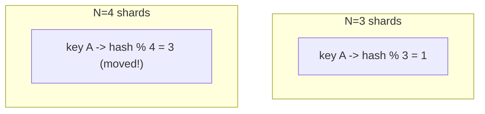
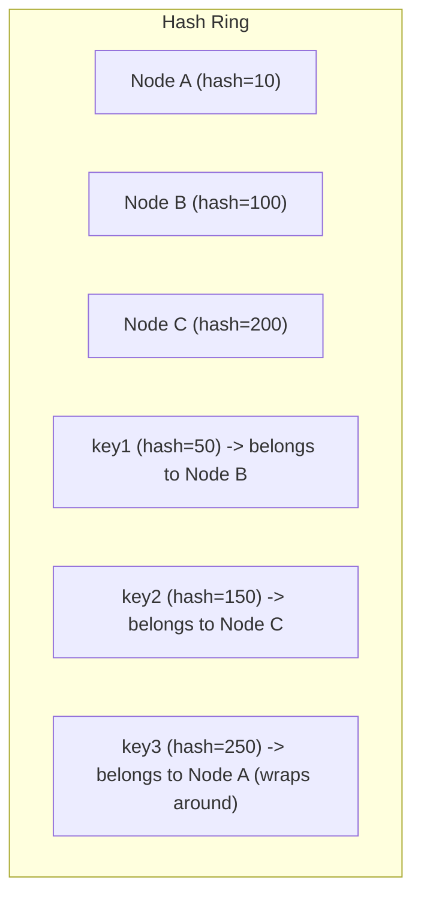
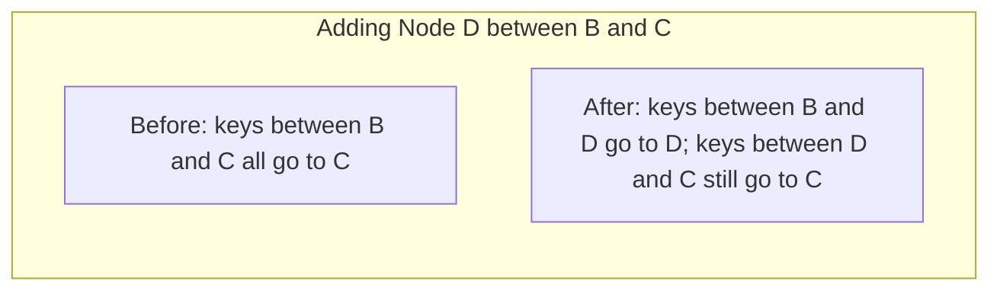
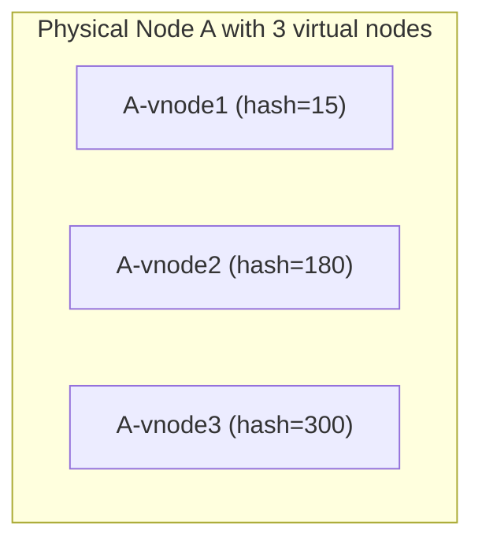

## Introduction

Chapter 16 flagged a serious problem with naive hash-based sharding: `hash(key) % N` requires reshuffling nearly the entire dataset whenever N (the number of nodes) changes. **Consistent hashing** solves this, and it's one of the most frequently asked "explain and implement" topics in system design interviews.

## The Problem with Modulo Hashing



With `hash(key) % N`, changing N from 3 to 4 changes the modulo result for the vast majority of keys — not just the ones that logically need to move to the new node, but nearly everything, because the divisor itself changed. This makes adding or removing a single node in a large cluster prohibitively expensive.

## The Consistent Hashing Solution: A Hash Ring

Consistent hashing maps both **nodes** and **keys** onto the same fixed, circular hash space (conceptually 0 to 2^32 - 1), typically visualized as a ring. A key belongs to the first node encountered by moving clockwise from the key's position on the ring.



**Why this fixes the rebalancing problem**: When a node is added or removed, only the keys that fall between that node's position and its immediate predecessor on the ring need to move — everything else on the ring is completely unaffected.



Only the (relatively small) slice of the keyspace between the new node and its neighbor is affected — a dramatic improvement over modulo hashing's near-total reshuffle.

## The Uneven Distribution Problem — and Virtual Nodes

With only a handful of physical nodes placed at essentially random points on the ring, the distribution of keys across nodes can be quite uneven (imagine three nodes randomly placed close together on one side of the ring, leaving one node responsible for a disproportionately large arc).

**Solution: Virtual nodes.** Instead of placing each physical node once on the ring, place it at many different points (e.g., 100–200 virtual nodes per physical node), each independently hashed. This averages out imbalances — even if a few virtual nodes cluster unluckily, the physical node's *total* share (summed across all its virtual nodes) converges toward an even distribution.



Virtual nodes also make rebalancing after a node addition/removal smoother: rather than one physical node's entire range dumping onto a single neighbor, the load is spread across many different neighbors (since the new/removed node's virtual points are scattered across the ring).

## Java Implementation

```java
import java.security.MessageDigest;
import java.security.NoSuchAlgorithmException;
import java.util.SortedMap;
import java.util.TreeMap;

public class ConsistentHashRing<T> {

    private final SortedMap<Long, T> ring = new TreeMap<>();
    private final int virtualNodesPerPhysicalNode;

    public ConsistentHashRing(int virtualNodesPerPhysicalNode) {
        this.virtualNodesPerPhysicalNode = virtualNodesPerPhysicalNode;
    }

    public void addNode(T node) {
        for (int i = 0; i < virtualNodesPerPhysicalNode; i++) {
            long hash = hash(node.toString() + "#VN" + i);
            ring.put(hash, node);
        }
    }

    public void removeNode(T node) {
        for (int i = 0; i < virtualNodesPerPhysicalNode; i++) {
            long hash = hash(node.toString() + "#VN" + i);
            ring.remove(hash);
        }
    }

    public T getNode(String key) {
        if (ring.isEmpty()) {
            throw new IllegalStateException("No nodes available in the hash ring");
        }
        long hash = hash(key);
        // Find the first node at or after this hash; wrap around to the first node if none found.
        SortedMap<Long, T> tailMap = ring.tailMap(hash);
        Long nodeHash = tailMap.isEmpty() ? ring.firstKey() : tailMap.firstKey();
        return ring.get(nodeHash);
    }

    private long hash(String key) {
        try {
            MessageDigest md5 = MessageDigest.getInstance("MD5");
            byte[] digest = md5.digest(key.getBytes());
            // Use the first 8 bytes of the MD5 digest as a long value for ring placement.
            long hash = 0;
            for (int i = 0; i < 8; i++) {
                hash = (hash << 8) | (digest[i] & 0xFF);
            }
            return hash;
        } catch (NoSuchAlgorithmException e) {
            throw new RuntimeException("MD5 algorithm not available", e);
        }
    }
}
```

**Why `TreeMap`**: Java's `TreeMap` maintains keys in sorted order and provides `tailMap()`, giving O(log n) lookup for "the first node hash greater than or equal to this key's hash" — a direct, efficient implementation of "move clockwise on the ring to find the next node."

```java
ConsistentHashRing<String> ring = new ConsistentHashRing<>(150); // 150 virtual nodes each
ring.addNode("cache-server-1");
ring.addNode("cache-server-2");
ring.addNode("cache-server-3");

String targetServer = ring.getNode("user:42:session");
// Later, add a new node - only a fraction of keys will need to move:
ring.addNode("cache-server-4");
```

## Real-World Usage

Consistent hashing (or close variants) underlies:
- **Distributed caches** — Memcached client libraries use it to determine which cache server holds a given key.
- **Cassandra and DynamoDB** — both use consistent hashing (DynamoDB's original paper popularized much of this technique) to distribute data across nodes in a cluster.
- **Load balancers** — some use consistent hashing to route requests, providing a degree of session affinity (Chapter 8) without a fully centralized session store, since the same key generally routes to the same server.
- **CDNs** — determining which edge cache/origin shard should handle a given piece of content.

## Summary

- Consistent hashing maps nodes and keys onto a shared ring, so adding/removing a node only affects the small slice of keyspace between it and its neighbor — solving modulo hashing's total-reshuffle problem.
- Virtual nodes address the uneven distribution that occurs with too few points on the ring, spreading each physical node's load across many positions.
- A `TreeMap` (or equivalent sorted structure) gives an efficient, direct implementation via its ability to find "the next node clockwise" in O(log n).
- Consistent hashing underlies distributed caches, NoSQL databases like Cassandra/DynamoDB, and some load balancing strategies.

---

## Interview Questions

### 1. Explain why consistent hashing solves the rebalancing problem that naive `hash(key) % N` sharding suffers from.
**Answer:** With `hash(key) % N`, every key's assignment depends directly on the current value of N — changing N (adding/removing a node) changes the divisor, which changes the modulo result for nearly every key in the system, forcing a near-total data reshuffle. Consistent hashing instead places both nodes and keys onto a fixed, shared hash ring independent of the total node count — a key's assignment depends only on which node is the next one clockwise from its position, so adding or removing a node only affects the specific, bounded slice of keys that fall between that node and its immediate neighbor on the ring, leaving every other key's assignment completely unchanged.

**Follow-up:** *In the worst case, roughly what fraction of keys need to move when adding one new node to a consistent hash ring with N existing nodes (assuming reasonably even distribution)?* — Approximately `1/(N+1)` of the total keys need to move — specifically, the keys that fall within the new node's slice of the ring (taken from whichever existing node previously owned that entire slice) — a dramatic improvement over modulo hashing's near-100% reshuffle for the same operation.

### 2. What problem do virtual nodes solve, and why can't you simply rely on placing each physical node once on the ring?
**Answer:** With only a small number of physical nodes placed at essentially arbitrary (hashed) positions on the ring, the actual resulting distribution of ring-space (and therefore key load) among them can be quite uneven purely by chance — e.g., three physical nodes might happen to hash to positions clustered closely together on one part of the ring, leaving a large arc (and therefore a disproportionate share of keys) assigned to whichever single node happens to own that gap. Virtual nodes solve this by placing each physical node at many different points on the ring (e.g., 100-200 virtual positions), so that each physical node's *total* effective ring coverage is the sum of many independently-hashed positions — statistically, this averages out to a much more even distribution across physical nodes than relying on just one lucky or unlucky random position per node.

**Follow-up:** *Does increasing the number of virtual nodes per physical node always improve load distribution, with no downside?* — Not entirely — while more virtual nodes generally improve distribution evenness (up to a point of diminishing returns), each virtual node adds an entry to the ring's underlying data structure (increasing memory usage and the size of the structure that must be searched/maintained), so there's a practical trade-off between distribution evenness and the overhead of managing a very large number of virtual node entries, especially in systems with many physical nodes already.

### 3. Why is a `TreeMap` (or similar sorted structure) a natural fit for implementing the hash ring's "find the next node clockwise" lookup?
**Answer:** A `TreeMap` maintains its keys in sorted order internally and provides methods like `tailMap()` (returning all entries with keys greater than or equal to a given value) that directly express the exact operation needed — "given this key's hash, find the smallest node-hash that is greater than or equal to it" (moving clockwise on the ring) — the first entry of that `tailMap()` result is precisely the next node encountered clockwise from the key's position. This lookup and the underlying sorted structure operations are O(log n), making the overall consistent hashing lookup efficient even for rings containing a large number of virtual node entries.

**Follow-up:** *What specific ring behavior does your implementation need to handle explicitly when `tailMap()` returns an empty result, and why does this happen?* — This happens when the key's hash value is greater than every node's hash on the ring — meaning, moving clockwise from that key's position, you'd need to "wrap around" past the highest hash value back to the beginning (lowest hash value) of the ring to find the next node; the implementation handles this explicitly by falling back to `ring.firstKey()` (the node with the smallest hash overall) whenever `tailMap()` comes back empty, correctly modeling the ring's circular (wrap-around) nature rather than treating it as a simple linear sorted list.

### 4. In the context of a distributed cache, why does consistent hashing specifically minimize cache invalidation/misses compared to a system that simply re-distributes keys arbitrarily whenever the cache cluster resizes?
**Answer:** Since consistent hashing guarantees that only the (relatively small) subset of keys assigned to a newly added or removed node's specific slice of the ring are affected — with every other key continuing to map to the exact same node it did before the resize — the vast majority of cached keys remain correctly located on the same cache node they were already on, meaning those keys can continue being served as cache hits without any interruption. If keys were redistributed arbitrarily on any cluster size change (as naive modulo hashing would effectively cause), nearly every key would suddenly be looked up on the "wrong" (from the cache's perspective) node relative to where it was previously cached, causing a massive, simultaneous wave of cache misses across almost the entire keyspace — a phenomenon sometimes described as a cache "cold start" storm exactly when the system is most likely already under stress (during a scaling event).

**Follow-up:** *Does consistent hashing eliminate cache misses entirely for the specific keys that do need to move when a node is added?* — No — the keys that do fall within the specific slice of the ring reassigned to the new (or away from the removed) node will still experience a cache miss on their next access, since their data isn't already present on whichever node now owns them — consistent hashing minimizes the *scope* of this disruption to just that specific slice of affected keys, rather than eliminating cache misses for those specific reassigned keys entirely.

### 5. Why might MD5 (as used in the example Java implementation) not be the ideal choice for a consistent hashing implementation in a real, performance-critical production system, and what might be used instead?
**Answer:** MD5 is a cryptographic hash function designed with security properties (like resistance to intentional collision attacks) that aren't actually needed for consistent hashing's purpose — computing a cryptographic hash is comparatively more CPU-expensive than using a faster, non-cryptographic hash function that still provides good statistical distribution properties (avoiding clustering) without the unnecessary computational overhead of cryptographic security guarantees. In performance-sensitive production systems, faster non-cryptographic hash functions like MurmurHash or xxHash are commonly used instead, since consistent hashing's requirements are about achieving a good statistical spread of keys across the ring, not about resisting deliberate, malicious hash manipulation.

**Follow-up:** *Is there ever a legitimate reason to specifically want a cryptographic hash function's properties in a consistent hashing context?* — In a scenario where the hash ring's key inputs are at least partially controlled by potentially adversarial/untrusted external parties (e.g., user-supplied identifiers) and an attacker might deliberately try to craft inputs that all hash to the same narrow region of the ring to intentionally create a hotspot/denial-of-service condition against one specific node, a cryptographic hash's collision-resistance properties could provide meaningful protection against this kind of deliberate manipulation — though this is a less common concern than the typical internal, trusted-key-space use case most consistent hashing implementations are designed for.

### 6. A candidate implements consistent hashing correctly but with only 1 virtual node per physical node, and observes significant load imbalance in testing with 5 physical nodes. What would you expect to happen if they increased this to 200 virtual nodes per physical node, and why?
**Answer:** You would expect the load distribution across the 5 physical nodes to become dramatically more even — with only 1 point per node, the actual ring-space each node ends up owning is essentially a single random arc length, highly susceptible to statistical unevenness at small node counts (5 random points splitting a circle rarely divides it perfectly evenly); with 200 virtual points per physical node (1000 total points on the ring), each physical node's *total* owned ring-space becomes the sum of 200 independently, randomly-placed small arcs — by the law of large numbers, this sum converges much more reliably toward each physical node's fair 1/5th share of the total ring, since the random over- and under-allocations of individual virtual node arcs increasingly average out across the larger sample of 200 points per node.

**Follow-up:** *Would you expect further increasing virtual nodes from 200 to 2000 per physical node to produce a similarly dramatic further improvement, or would you expect diminishing returns?* — Diminishing returns — the improvement in distribution evenness from increasing virtual node count follows a pattern similar to statistical convergence (akin to how averaging more independent random samples reduces variance, but with rapidly diminishing marginal benefit past a certain sample size) — going from 1 to 200 virtual nodes typically yields dramatic improvement, while going from 200 to 2000 would likely yield only marginal further improvement in evenness, while still linearly increasing the memory and lookup overhead of maintaining a much larger ring structure, making that further increase a poor trade-off past a reasonable point.

### 7. How does consistent hashing relate to, and differ from, simply maintaining a directory-based (lookup table) mapping of keys to shards, as discussed in Chapter 16?
**Answer:** Both approaches aim to solve the same fundamental problem (flexibly mapping keys to nodes without requiring a full-dataset reshuffle on cluster changes), but they differ significantly in mechanism: a directory-based approach maintains an explicit, typically centrally-stored mapping (often at the level of key ranges or individual keys) that must be looked up (potentially via a network call to a separate directory service) for every single key access, and rebalancing means directly updating specific entries in that explicit mapping. Consistent hashing instead computes a key's node assignment algorithmically (via the hash function and ring position) without needing any separate, explicitly-maintained lookup table at all — every node (or client) can independently compute the correct assignment for any key using only a shared, relatively small ring structure (the list of node hash positions), without needing to consult or maintain a potentially much larger, centrally-managed directory of individual key-to-node mappings.

**Follow-up:** *Given this difference, what's an advantage directory-based sharding might still have over consistent hashing for certain use cases?* — Directory-based sharding permits arbitrary, fully manual, fine-grained control over exactly which specific keys or ranges live on which specific node — useful when you need to make deliberate, business-driven placement decisions (e.g., placing a specific very large customer's data on a dedicated, specially-provisioned node, as discussed in Chapter 16's "celebrity" hotspot mitigation) — consistent hashing's purely algorithmic, hash-based assignment doesn't naturally support this kind of arbitrary, manually-overridden placement without additional special-casing logic layered on top of the base consistent hashing scheme.

### 8. Why might a system combine consistent hashing with data replication (each key stored on the "next N nodes" clockwise from its position, not just one), and what benefit does this provide?
**Answer:** Storing each key not just on its single primary assigned node, but also replicated to the next N-1 nodes clockwise on the ring (a common pattern in systems like Cassandra and DynamoDB), provides fault tolerance and availability directly integrated with the same consistent hashing mechanism used for basic sharding — if the primary node for a given key fails, its replicated copies on the immediately following nodes on the ring can continue serving that data without requiring a separate, independently-designed replication topology; this combines the load-distribution benefits of consistent hashing (Chapter 22) with the availability benefits of replication (Chapter 15) within a single, elegant, unified mechanism.

**Follow-up:** *How does this replication approach interact with virtual nodes — do you replicate each virtual node's data separately, or is there a subtlety to be aware of?* — A subtlety to be aware of: naively replicating strictly by "next N virtual node positions clockwise" could sometimes result in a key's "different" replicas ending up on the same physical node (if that physical node happens to own multiple nearby virtual node positions on the ring) — well-designed implementations typically add logic to specifically skip over virtual nodes belonging to a physical node already selected as a replica for that key, ensuring the N replicas are genuinely placed on N *distinct* physical nodes, not just N distinct virtual node ring positions that might collapse onto fewer actual physical machines.

### 9. In an interview, how would you explain the trade-off consistent hashing makes regarding range queries, connecting back to Chapter 16's sharding discussion?
**Answer:** Just like general hash-based sharding (discussed in Chapter 16), consistent hashing deliberately scatters keys pseudo-randomly across the ring based on their hash value, meaning keys that are sequentially or logically related (e.g., adjacent timestamps, or alphabetically adjacent names) end up on essentially unrelated, scattered nodes rather than being co-located — this means range queries (e.g., "give me all keys between X and Y") generally cannot be efficiently satisfied by consistent hashing alone, since the relevant keys for such a query could be scattered across many or even all nodes in the ring, requiring the same kind of expensive scatter-gather operation discussed in Chapter 16, rather than being retrievable from one or a few contiguous nodes the way range-based sharding would allow.

**Follow-up:** *If a system genuinely needs both consistent hashing's even-load/easy-rebalancing benefits AND efficient range queries, what architectural approach might reconcile this tension?* — A common approach is maintaining a separate, differently-organized secondary index or materialized view specifically optimized for the range-query access pattern (e.g., a range-based index or a search engine like Elasticsearch) alongside the primary consistent-hashed storage used for the system's main key-value access pattern — accepting the additional complexity and synchronization overhead of maintaining this secondary structure in exchange for supporting both access patterns well, rather than trying to force a single storage/partitioning scheme to simultaneously optimize for two access patterns (even key distribution vs. range-query locality) that are somewhat fundamentally in tension with each other.

### 10. Why does a client-side (or gateway-level) implementation of consistent hashing, where every client independently computes the correct node for a key, require that all clients share an identical, synchronized view of the current ring (node list)?
**Answer:** Since each client computes a key's target node purely algorithmically based on the current set of nodes (and their virtual node positions) on the ring, any two clients with a *different* view of which nodes currently exist on the ring (e.g., one client hasn't yet learned about a recently-added node that another client already knows about) would compute *different, inconsistent* target nodes for the exact same key — leading to genuinely incorrect behavior, such as writes and subsequent reads for the same key ending up on different nodes simply because the reading and writing clients had disagreeing views of the current ring topology at the time each operation was performed.

**Follow-up:** *What mechanism would a real system need to ensure clients maintain a sufficiently up-to-date, consistent view of the ring as nodes are added or removed?* — Real systems typically rely on some form of cluster membership/configuration propagation mechanism — such as a gossip protocol (Chapter 24) to disseminate ring topology changes across all nodes and clients, or a centralized, highly-available configuration/coordination service (like ZooKeeper or etcd, tied to the consensus mechanisms discussed in Chapter 23) that clients periodically consult or subscribe to for ring topology updates — ensuring that, even if briefly and imperfectly synchronized during a transition period, all participants eventually converge on a consistent view of the current ring topology rather than operating indefinitely on stale, conflicting views.
