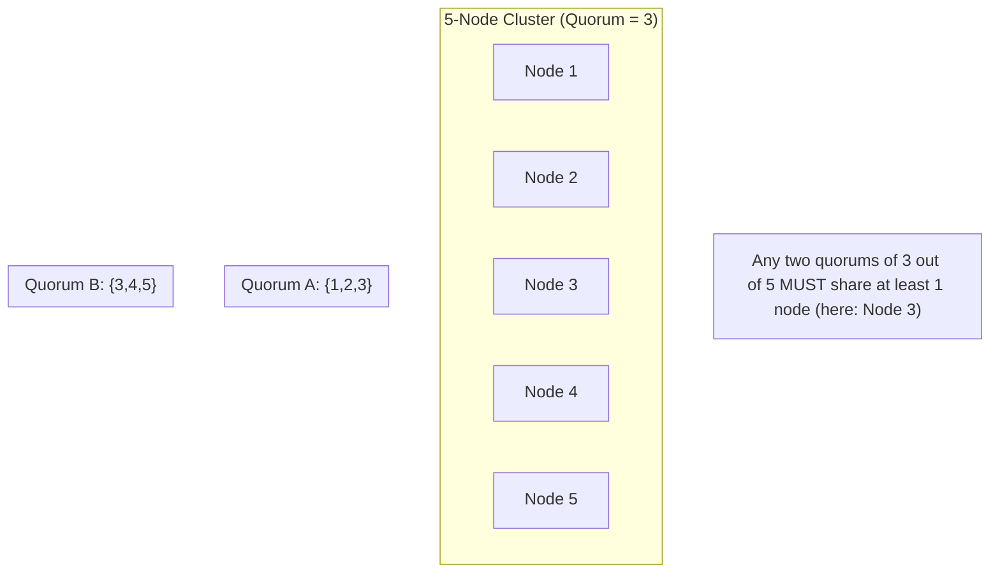
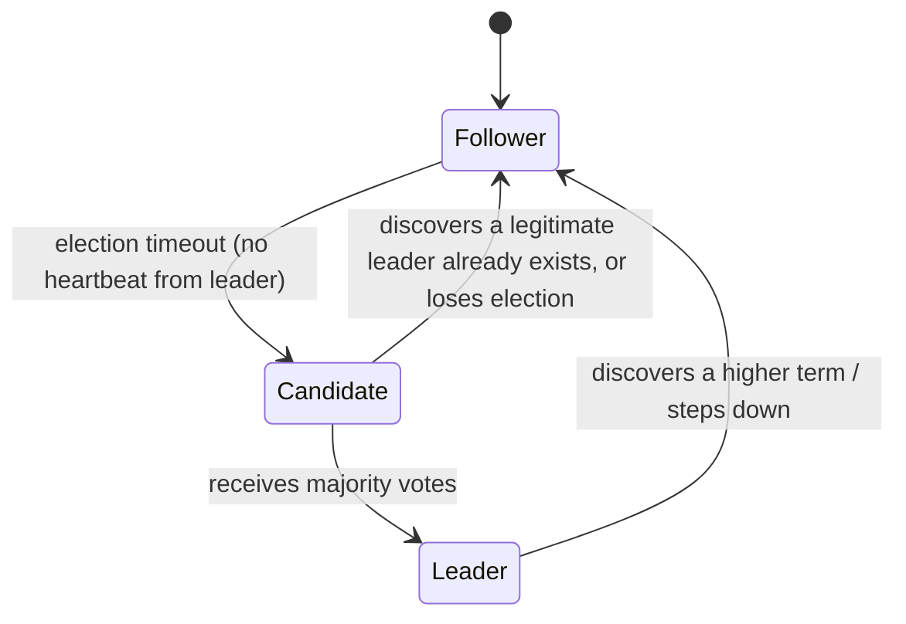
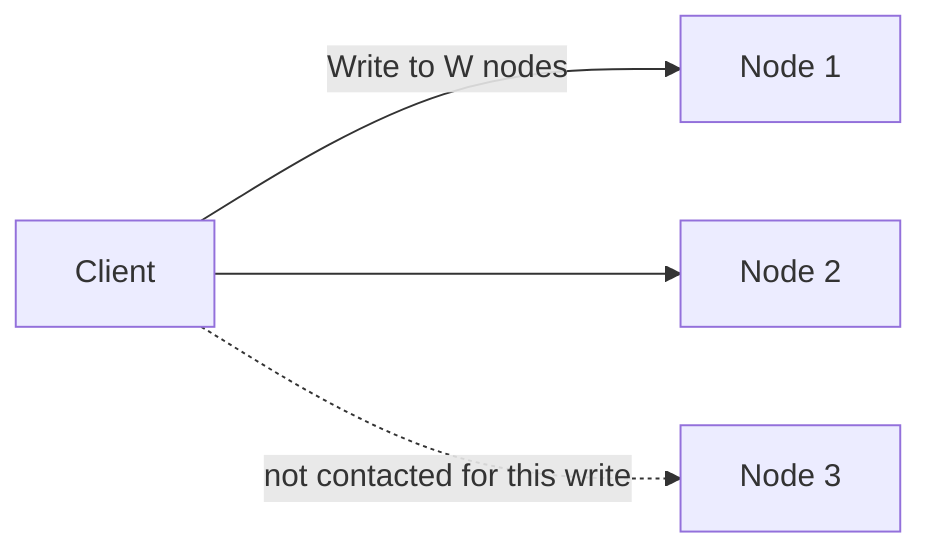

## Introduction

Chapters 15 and 19 referenced "quorum" and "consensus" without fully unpacking them. This chapter does — covering the mechanics that let a distributed system safely agree on things like "who is the leader" or "was this write actually successful," even when individual nodes fail or the network misbehaves.

## What Is a Quorum?

A **quorum** is the minimum number of nodes that must participate in an operation for it to be considered valid — typically a strict majority: `floor(N/2) + 1` out of N total nodes.

**Why a majority?** Any two majority quorums, no matter how they're chosen, are mathematically guaranteed to overlap in at least one node. This overlap is what prevents split-brain scenarios (Chapter 15): two *different* majority groups can never simultaneously make independent, conflicting decisions, because they'd have to share at least one common node, and that node can't agree with both conflicting decisions at once.

This is precisely the `W + R > N` condition from Chapter 15's leaderless replication — it's the same overlap-guarantee principle, applied to reads and writes specifically.

## Leader Election

Many distributed systems (as covered in Chapter 15's leader-follower replication) need exactly one node designated as the leader at any given time, to serialize writes or make authoritative decisions. **Leader election** is the process of choosing that node, and correctly re-electing a new one if the current leader fails.

### Why Simple Approaches Fail

A naive approach — "whichever node notices the leader is down first, promotes itself" — is dangerous: if a temporary network glitch merely *prevents* one node from reaching the leader (rather than the leader actually being down), that node might promote itself while the real leader is still alive and serving other nodes — producing the split-brain scenario Chapter 15 warned about.

### The Consensus-Based Approach

Real systems use **consensus algorithms** — most commonly **Raft** (simpler to understand and widely adopted) or **Paxos** (older, more academically foundational) — which use quorum-based voting specifically to make leader election (and other agreement decisions) safe even under node failures and network delays.

## Raft: A Practical Walkthrough

Raft organizes time into **terms**, each with at most one leader.

1. **Follower state**: Every node starts as a follower, passively receiving heartbeats from the current leader.
2. **Election timeout**: If a follower doesn't receive a heartbeat within a randomized timeout window, it assumes the leader may have failed and transitions to **candidate**, incrementing the term number and requesting votes from all other nodes.
3. **Voting**: Other nodes vote for at most one candidate per term (first-come, first-served) — a candidate becomes leader only upon receiving votes from a **majority (quorum)** of the cluster.
4. **Leadership**: The new leader begins sending regular heartbeats to reset followers' election timeouts, preventing unnecessary re-elections.

**Why randomized timeouts matter**: If every follower used the identical timeout duration, multiple nodes could simultaneously become candidates at the exact same moment, splitting votes and potentially failing to reach a majority repeatedly. Randomizing each node's timeout makes it statistically likely that one node times out first, becomes a candidate, and collects votes before others even attempt to start their own election — reducing (though not fully eliminating) the chance of a "split vote" needing a re-run.

**Why a majority prevents split-brain**: Since Raft requires a strict majority vote to become leader, and any two majorities out of the same cluster must overlap (as shown above), it's mathematically impossible for two different candidates to simultaneously win a majority in the *same* term — at most one leader can exist per term, directly preventing the dangerous dual-leader scenario.

## Quorum Reads and Writes (Revisited)

As introduced in Chapter 15's leaderless replication:

- **Write quorum (W)**: A write succeeds once W replicas acknowledge it.
- **Read quorum (R)**: A read queries R replicas and uses the most recent value found.
- **`W + R > N`**: Guarantees every read overlaps with the most recent write, ensuring the read always sees the latest committed value.

Choosing W and R lets a system tune its position on the consistency/availability/latency spectrum (Chapters 18–19) — larger W and R mean stronger consistency but higher latency and lower availability (more nodes must respond); smaller W and R mean the opposite.

## Where This Shows Up in Real Systems

- **ZooKeeper and etcd**: Both use consensus (ZooKeeper uses a Paxos-derived protocol called Zab; etcd uses Raft directly) to provide strongly consistent coordination services — used for leader election, distributed configuration, and distributed locks (Chapter 27) in countless production systems.
- **Distributed databases**: Systems like CockroachDB and TiDB use Raft internally per data shard/range to coordinate replication and handle leader failures for that specific range of data.
- **Kafka**: Uses a controller election process (historically via ZooKeeper, now via its own KRaft consensus protocol) to elect a controller responsible for partition leadership decisions.

## Summary

- A quorum (typically a strict majority) guarantees any two quorums overlap — the mathematical foundation preventing split-brain scenarios in distributed systems.
- Leader election requires more than "whoever notices first" — consensus algorithms like Raft use quorum-based voting, terms, and randomized election timeouts to safely elect exactly one leader even under failures and network delays.
- Quorum reads/writes (`W + R > N`) apply the same overlap principle directly to data operations, letting systems tune their consistency/availability trade-off.
- Real coordination services (ZooKeeper, etcd) and distributed databases rely on these consensus mechanisms as foundational building blocks for leader election, configuration, and distributed locking.

---

## Interview Questions

### 1. Why does requiring a strict majority (quorum) for leader election prevent two nodes from simultaneously believing they're the leader?
**Answer:** A strict majority out of N nodes means more than half of all nodes must vote for a candidate — mathematically, any two distinct majority groups drawn from the same total set of N nodes are guaranteed to share at least one common node (since two disjoint groups that each exceed half of N would together exceed the total N, which is impossible). This guaranteed overlap means it's impossible for two different candidates to each simultaneously secure a majority of votes in the same election term — at least one node would have had to vote for both candidates, which the protocol explicitly disallows (each node votes for at most one candidate per term) — making split-brain leadership within a single term mathematically impossible under this quorum requirement.

**Follow-up:** *Could split-brain still occur across two different terms, and how does Raft handle that possibility?* — Raft's term numbers are monotonically increasing and strictly ordered — if a node discovers a message (like a heartbeat or vote request) from a higher term than its own current term, it immediately updates to that higher term and steps down from leadership if it was a leader in a now-outdated, lower term; this ensures that even if a leader from an older term is still operating (e.g., due to a network partition that isolated it), as soon as it reconnects and observes evidence of a newer term with a legitimately elected leader, it recognizes its own leadership as stale and steps down, preventing a genuinely lasting split-brain situation once communication is restored.

### 2. Why is a naive "first node to notice the leader is unreachable promotes itself" approach to leader election dangerous, even though it might work correctly most of the time?
**Answer:** This naive approach conflates "I cannot reach the leader" with "the leader has actually failed" — these are not the same thing in a distributed system, since a network partition or transient connectivity issue could prevent one specific node from reaching a leader that is, in fact, still alive and functioning perfectly well from the perspective of other nodes. If that isolated node unilaterally promotes itself to leader based purely on its own inability to reach the existing leader, you could end up with two simultaneously active leaders — the original, still-functioning one (from the perspective of nodes still able to reach it) and the newly self-promoted one — a genuine split-brain scenario, precisely because the decision to become leader wasn't validated against a broader, quorum-based agreement from the rest of the cluster.

**Follow-up:** *How does requiring a majority vote (rather than unilateral self-promotion) specifically address this exact failure scenario?* — Requiring a majority vote means the isolated node, even if it decides to become a candidate, cannot actually become leader unless it can successfully collect votes from a majority of the *entire* cluster — if it's genuinely isolated (unable to communicate with enough other nodes due to a network partition), it simply cannot obtain the required majority and therefore cannot become leader, correctly preventing the split-brain scenario the naive unilateral approach would have allowed.

### 3. Explain why Raft uses randomized (rather than fixed) election timeouts across different nodes.
**Answer:** If every follower node used the exact same fixed timeout duration to decide when to become a candidate after not hearing from the leader, then in the event of an actual leader failure, multiple (or even all) followers would likely time out and become candidates at nearly the exact same moment, each requesting votes simultaneously — this can lead to votes being split roughly evenly among multiple simultaneous candidates, with no single candidate achieving the required majority, forcing the election to time out and restart, potentially repeating this same synchronized-timeout problem again and again. Randomizing each node's specific timeout duration (typically within some reasonable range) makes it statistically likely that one particular node's timer will expire meaningfully before the others', giving that node a head start to request and collect votes before other nodes even begin their own candidacy — significantly reducing the likelihood of repeated split votes and speeding up the time to successfully elect a new leader.

**Follow-up:** *Does randomizing timeouts completely eliminate the possibility of a split vote, or just reduce its likelihood?* — It only reduces the likelihood, rather than eliminating the possibility entirely — it's still statistically possible (just less probable) for two or more nodes' randomized timeouts to expire closely enough together that multiple candidacies and a split vote still occur; Raft handles this by simply allowing the election to time out and restart (with each node choosing a *new* random timeout for the next attempt), relying on the underlying randomization to make eventual success in some subsequent round highly likely, even if a particular round doesn't succeed on the first attempt.

### 4. What does the quorum condition `W + R > N` guarantee, and why does this same underlying mathematical principle also explain why leader election requires a majority?
**Answer:** As covered in Chapter 15, `W + R > N` guarantees that the set of nodes involved in any write and the set of nodes involved in any subsequent read must share at least one common node — ensuring a read can always find the most recently written value. This is the exact same "guaranteed overlap between two groups drawn from the same total set" principle that makes majority-based leader election safe — a majority write-quorum and a majority read-quorum (each being more than half of N) are mathematically guaranteed to overlap for the same fundamental combinatorial reason that any two majority vote groups in leader election are guaranteed to overlap: if two groups from the same total population of N each contain more than half of N, they cannot possibly be entirely disjoint from each other, since their combined membership would then have to exceed the total population N itself, which is impossible.

**Follow-up:** *Would a quorum configuration like W=2, R=2 with N=5 still satisfy the overlap guarantee? What about W=1, R=1 with N=5?* — W=2, R=2 with N=5 gives `2+2=4`, which is NOT greater than `N=5` — this configuration does NOT guarantee overlap, meaning a read could potentially miss the most recent write; you'd need something like W=3, R=3 (`3+3=6 > 5`) to guarantee overlap with N=5. W=1, R=1 with N=5 (`1+1=2`, not greater than 5) similarly fails to guarantee overlap — both examples illustrate that satisfying `W + R > N` requires deliberately choosing sufficiently large W and R values relative to N, not just any arbitrary positive values for W and R.

### 5. Why do production coordination services like ZooKeeper and etcd exist as separate, dedicated systems rather than every distributed application implementing its own leader election/consensus logic from scratch?
**Answer:** Correctly implementing consensus algorithms like Raft or Paxos is notoriously difficult to get right in all the subtle edge cases (network partitions, simultaneous failures, message reordering/delays, and various timing-related race conditions) — even experienced distributed systems engineers frequently introduce subtle correctness bugs when attempting custom implementations, and the consequences of a consensus bug (like an actual split-brain scenario slipping through) can be severe and hard to detect/debug in production. Dedicated coordination services like ZooKeeper and etcd have had their consensus implementations extensively battle-tested, formally analyzed, and refined over years of real-world production use across many different organizations — using one of these proven, dedicated services for leader election/coordination needs is generally a far safer and more pragmatic engineering choice than attempting a custom, from-scratch consensus implementation for each individual application that happens to need this capability.

**Follow-up:** *What's a reasonable scenario where a team might still choose to implement their own simplified coordination logic rather than depending on an external service like ZooKeeper or etcd?* — For a very small-scale, low-stakes internal tool or prototype where the consequences of an occasional, rare coordination failure are genuinely minor (e.g., an internal batch job scheduler where a brief, rare double-execution or missed-execution is an acceptable, easily-noticed and correctable inconvenience rather than a serious business problem), a team might reasonably choose simpler, less rigorously "correct" coordination logic to avoid the operational overhead of running and depending on an additional dedicated coordination service — explicitly trading away some correctness rigor for reduced operational complexity, given the low stakes of the specific use case.

### 6. In a 5-node Raft cluster, if 2 nodes fail simultaneously, can the remaining cluster still elect a leader and continue operating? What if 3 nodes fail?
**Answer:** With 5 total nodes and a required majority of 3 (`floor(5/2) + 1 = 3`), if only 2 nodes fail, the remaining 3 nodes still constitute exactly a majority and can successfully elect a leader among themselves and continue normal operation (write availability is preserved, since a quorum of 3 out of 5 is still achievable). If 3 nodes fail instead, only 2 nodes remain — which is fewer than the required majority of 3 — meaning the remaining nodes cannot achieve quorum, and the cluster cannot safely elect a new leader or process new writes at all (correctly prioritizing consistency/safety over availability in this scenario, per the CP-leaning nature of consensus-based systems discussed in Chapter 18) until enough failed nodes recover to restore majority capability.

**Follow-up:** *Why might a team choose to run a 5-node cluster instead of a 3-node cluster, given that a 3-node cluster (requiring majority of 2) is cheaper to operate?* — A 5-node cluster can tolerate up to 2 simultaneous node failures while still maintaining quorum and availability, whereas a 3-node cluster can only tolerate 1 simultaneous failure before losing quorum — for systems where the cost of complete unavailability during a period of multiple concurrent failures (e.g., during a rolling deployment combined with an unrelated hardware failure) is high enough to justify the added infrastructure cost, running a 5-node cluster provides meaningfully better fault tolerance at the cost of running more nodes (and, notably, requiring more nodes to agree on every operation, which can also modestly increase latency for each individual consensus decision).

### 7. Why does Raft's design specifically separate the concept of a "term" from a simple, ever-incrementing global counter shared instantly across all nodes?
**Answer:** In a genuinely distributed system, there's no way to instantaneously and perfectly synchronize a single shared counter across all nodes at all times (this would itself require the very kind of coordination/consensus the term mechanism is trying to help establish) — instead, each node maintains and increments its own local view of the current term as it learns about newer terms through communication with other nodes (e.g., a candidate requesting votes always includes its candidate term, and any node encountering a message from a term higher than its own local knowledge immediately updates to that higher term). This eventually-consistent, locally-tracked-but-globally-convergent approach to term numbers allows the system to establish a clear, unambiguous relative ordering of leadership periods (a higher term always supersedes a lower one) without requiring an impossible, perfectly synchronized global clock or counter across all nodes at every instant.

**Follow-up:** *What could go wrong if a node's local term number somehow became corrupted or reset to an artificially low value?* — If a node's term number were incorrectly reset to a lower value than the cluster's actual current term, that node would likely quickly encounter communication from other nodes referencing the correct, higher term (e.g., receiving a heartbeat or vote request citing the true current term) and would immediately and correctly update its own term to match — Raft's design specifically expects and gracefully handles nodes with outdated term knowledge rejoining or recovering, as long as they correctly adopt the higher term they learn about from other nodes, rather than requiring every node's term tracking to be perfectly, continuously accurate at all times to function correctly.

### 8. How does the choice of W and R in a quorum-based system relate to the PACELC framework discussed in Chapter 18?
**Answer:** Choosing larger values of W and/or R (closer to N) increases the strength of the consistency guarantee (per the `W + R > N` overlap principle) but requires waiting for confirmation/response from more nodes for every write or read operation, directly increasing latency during normal operation — this is a direct, concrete instantiation of PACELC's "Else" (no-partition) branch trade-off between Latency and Consistency. Conversely, choosing smaller values of W and/or R reduces the number of nodes that must respond for an operation to complete, improving latency (and, during a partition, improving availability, since fewer nodes need to be reachable) at the direct cost of a weaker consistency guarantee — illustrating that quorum tuning is a concrete, practical mechanism through which the abstract PACELC trade-off is actually implemented and controlled in real systems.

**Follow-up:** *If a system needed to prioritize write latency above all else for a specific operation, even at the cost of the strong consistency guarantee `W + R > N` normally provides, what quorum setting might it use?* — It might set W=1 (a write is considered successful as soon as just a single node acknowledges it, minimizing write latency to essentially a single round trip) — explicitly accepting that this sacrifices the guaranteed read/write overlap (since a subsequent read might not query that specific one node the write went to), deliberately choosing to prioritize write latency over the stronger consistency guarantee for this specific operation, consistent with a PACELC "EL" (Latency over Consistency during normal operation) classification.

### 9. Why is Paxos often described as more difficult to understand and implement correctly than Raft, despite both being consensus algorithms solving fundamentally the same problem?
**Answer:** Paxos, in its original formulation, is known for describing its core algorithm in a fairly abstract, mathematically-oriented way that, while rigorously correct, doesn't map as intuitively or directly onto a clear, easy-to-follow operational implementation — many engineers and even researchers have historically found translating Paxos's abstract proof-oriented description into a concrete, practical, correctly-implemented system to be notably challenging, leading to numerous variations and "Paxos made simple"-style explanatory papers attempting to bridge this gap. Raft was explicitly designed later, specifically with understandability and ease of correct implementation as primary design goals — its authors deliberately structured Raft's description around clearer, more operationally intuitive concepts (like the explicit leader-based normal operation, clearly-defined terms, and a more straightforward election process) specifically to make it easier for engineers to understand, reason about, and correctly implement compared to Paxos, even though both algorithms are proven to solve the same underlying distributed consensus problem with comparable theoretical guarantees.

**Follow-up:** *Does Raft's improved understandability mean it's theoretically more powerful or capable than Paxos, or are they fundamentally equivalent in what they can achieve?* — They are fundamentally equivalent in the core consensus guarantees they can provide (both are proven correct solutions to the same distributed consensus problem, tolerating up to a minority of node failures) — Raft's primary claimed advantage over Paxos is specifically around understandability and ease of correct real-world implementation, not a difference in fundamental theoretical capability or power; this is precisely why Raft has become the more popular choice for new systems (like etcd) specifically built with practical implementability as a priority, even though Paxos (or its variants, like ZooKeeper's Zab) remains a foundational, still-used approach as well.

### 10. In a system design interview, if asked to design a distributed configuration management system that many services need to read consistently, how would you use the concepts from this chapter to justify your design?
**Answer:** You'd propose using an existing, proven coordination service (like etcd or ZooKeeper) rather than building custom leader election/consensus logic from scratch, explaining that these services already correctly implement the majority-quorum-based consensus (Raft or a Paxos-derivative) needed to safely elect a single leader responsible for accepting configuration writes, while providing strongly consistent reads to the many services that need to reliably read the current configuration. You'd explain that this design choice directly leverages the majority-quorum overlap guarantee discussed in this chapter to ensure all services reading configuration always see a consistent, agreed-upon value (critical for configuration data, where different services operating on inconsistent configuration values could cause serious, hard-to-debug operational problems), and that the underlying consensus protocol's leader election and term-based mechanisms handle node failures and network issues safely, without your application needing to reimplement this notoriously tricky-to-get-right logic itself.

**Follow-up:** *Why would this specific use case (configuration management) reasonably warrant paying the latency/availability cost of strong, quorum-based consistency, compared to some other, more eventual-consistency-tolerant use case?* — Configuration data, unlike something like a social media like-count, often directly controls critical application behavior (feature flags, connection strings, critical operational parameters) across potentially many different services simultaneously — if different services briefly read genuinely different, inconsistent configuration values due to weak consistency, this could cause serious, confusing, and potentially harmful operational inconsistencies (e.g., some services enforcing a new security policy while others still operate under an old one) — the relatively infrequent nature of configuration *writes* (compared to something like a high-frequency like-counter) also means the latency cost of strong quorum-based consistency is paid relatively rarely, making the strong-consistency trade-off both genuinely necessary for correctness and relatively cheap in practice for this specific, comparatively low-write-frequency use case.
