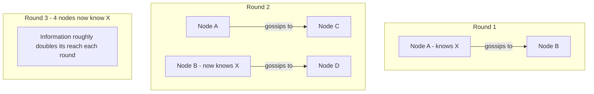

## Introduction

Chapter 23 covered how a small number of nodes can safely agree on things like leadership through quorum-based consensus. But consensus protocols don't scale well to thousands of nodes — the coordination overhead grows too large. **Gossip protocols** solve a different but related problem: efficiently spreading information (like "which nodes are currently alive") across a very large cluster, without any central coordinator and without every node needing to talk to every other node directly.

## The Core Idea

Named after how rumors spread through a social network: periodically, each node picks one or a few random peers and shares (gossips) what it currently knows. Over successive rounds, information propagates exponentially — spreading to the entire cluster remarkably quickly, without any single node needing complete connectivity to all others.



This exponential spread (similar in spirit to how an epidemic spreads through a population, which is why gossip protocols are sometimes called "epidemic protocols") means information reaches every node in a cluster of N nodes in roughly O(log N) rounds — remarkably efficient even for very large clusters.

## What Gossip Protocols Are Used For

### 1. Failure Detection (Membership)

Nodes gossip about which peers they believe are alive or dead, based on recent successful/failed communication. This lets the entire cluster eventually converge on a shared understanding of cluster membership without any single node needing to directly monitor every other node.

```mermaid
sequenceDiagram
    participant A as Node A
    participant B as Node B
    participant C as Node C
    A->>B: Gossip: "I've heard from D, E; haven't heard from F in a while"
    B->>C: Gossip: "A says F might be down; here's what I know too"
```

### 2. Disseminating Configuration/State Changes

As referenced in Chapter 22, when nodes are added or removed from a consistent hash ring, gossip protocols are a natural mechanism for propagating that topology change to every node in the cluster without a central broadcaster.

### 3. Anti-Entropy (Data Synchronization)

Nodes periodically gossip and compare their data (or version summaries of their data, like Merkle tree root hashes) with random peers, detecting and repairing any inconsistencies — helping eventually-consistent systems (Chapter 19) actually converge over time, rather than remaining permanently inconsistent after replication gaps.

## Push, Pull, and Push-Pull Gossip

| Style | How it works | Trade-off |
|---|---|---|
| **Push** | A node proactively sends its known state to a random peer | Fast initial spread, but can waste bandwidth re-sending already-known information late in propagation |
| **Pull** | A node asks a random peer "what do you know that I don't?" | More efficient late in propagation (when most nodes already have the information) but slower to start |
| **Push-Pull** | Combines both — exchange full state in one round-trip | Generally the most efficient in practice, most commonly used in production systems |

## Real-World Usage

- **Apache Cassandra**: Uses a gossip protocol for cluster membership and failure detection — every node periodically gossips with a few random peers about which nodes it believes are up, down, or newly joined.
- **Amazon DynamoDB (and the original Dynamo paper)**: Uses gossip-based protocols for membership and failure detection, directly informing the influential distributed systems design this series references throughout Part 4.
- **Consul and Serf (HashiCorp)**: Use a gossip protocol (SWIM — Scalable Weakly-consistent Infection-style Membership) specifically for efficient, scalable failure detection across large clusters.
- **Redis Cluster**: Uses a gossip protocol among nodes to propagate cluster configuration and detect node failures.

## Gossip vs Consensus: When to Use Which

| | Gossip Protocols | Consensus (Chapter 23) |
|---|---|---|
| Guarantee | Eventually consistent (probabilistic) | Strongly consistent (guaranteed, given quorum) |
| Scalability | Excellent — scales to thousands of nodes | Limited — coordination overhead grows with node count |
| Speed of convergence | Fast, but probabilistic (not instantly guaranteed) | Immediate agreement once consensus is reached |
| Best for | Cluster membership, failure detection, disseminating non-critical state at scale | Leader election, configuration requiring strict correctness, distributed locks |

This is a direct, practical instance of the CAP/consistency spectrum discussed in Chapters 18–19: gossip protocols deliberately trade strict, immediate consistency for massive scalability and resilience, appropriate for information (like "which nodes are alive") where a brief, eventually-corrected inaccuracy is a normal, tolerable part of the design — not a bug.

## Summary

- Gossip protocols spread information across a cluster by having nodes periodically share what they know with a few random peers, achieving exponential, efficient propagation without central coordination.
- Common uses include failure detection/cluster membership, disseminating topology/configuration changes, and anti-entropy data synchronization in eventually-consistent systems.
- Push, pull, and push-pull are the three propagation styles, with push-pull generally being the most efficient in practice.
- Gossip protocols trade strict consistency for massive scalability — appropriate for cluster membership and failure detection, while consensus (Chapter 23) remains necessary for scenarios requiring strict, immediate agreement like leader election.

---

## Interview Questions

### 1. Why do gossip protocols scale to thousands of nodes far better than consensus algorithms like Raft?
**Answer:** Consensus algorithms like Raft require coordinated communication (votes, heartbeats) that, in various forms, scales with the total number of participating nodes — every node needs to be aware of and communicate with (or be represented in) the quorum-based decision-making process, and the coordination overhead of maintaining a single, strongly-consistent leader and log across a very large number of nodes becomes increasingly costly and slow as node count grows. Gossip protocols, in contrast, require each node to only communicate with a small, fixed, random number of peers per round (regardless of total cluster size) — the total information exchange work per node stays constant even as the cluster grows to thousands of nodes, and information still propagates efficiently (in O(log N) rounds) across the entire cluster, because the total *reach* of gossip grows exponentially through repeated peer-to-peer relaying, even though any single node's direct communication burden per round remains small and constant.

**Follow-up:** *Does this mean gossip protocols could be used as a full replacement for consensus algorithms in every distributed systems use case?* — No — gossip protocols only provide eventual, probabilistic consistency (information will very likely, but not with an absolute mathematical guarantee, reach every node within a certain number of rounds), which is fundamentally unsuitable for use cases requiring strict, immediate, guaranteed agreement (like safely electing exactly one leader, or ensuring a distributed lock is held by exactly one client) — these specific use cases genuinely require consensus's stronger correctness guarantees, and gossip protocols are a complementary tool for different problems (large-scale, eventually-consistent information dissemination), not a universal replacement for consensus.

### 2. Explain why information spreads through a cluster via gossip in roughly O(log N) rounds, rather than linearly with the number of nodes.
**Answer:** In each gossip round, every node that already knows a piece of information shares it with a new, randomly-chosen peer — critically, the number of nodes that know the information can roughly *double* each round (since every currently-informed node can inform one new node simultaneously in that round) — this doubling pattern is exactly analogous to exponential growth (similar to how a rumor or, notably, an epidemic spreads through a population), and reaching the full population of N nodes through repeated doubling takes approximately log₂(N) rounds, rather than the N rounds it would take if information could only spread to one additional new node per round throughout the entire process (linear growth).

**Follow-up:** *In practice, does the actual observed propagation time exactly match this theoretical O(log N) estimate, or are there real-world factors that cause deviation?* — Real-world propagation is generally close to but not perfectly matching the idealized theoretical estimate, due to practical factors like the possibility of a node randomly gossiping to a peer that already has the information (a "wasted" gossip exchange that doesn't contribute new spread that round), network latency/failures affecting actual message delivery timing, and the specific gossip style used (push vs. pull vs. push-pull, discussed in this chapter) — but the fundamental exponential-growth character, and the resulting logarithmic-in-cluster-size propagation time, holds true as a strong practical approximation across real gossip protocol implementations.

### 3. Compare push-based and pull-based gossip, and explain specifically why push-pull is generally considered the most efficient approach in practice.
**Answer:** Push-based gossip has informed nodes proactively send their known information to randomly chosen peers — this is very effective early in the propagation process (when few nodes know the information, so most "pushes" deliver genuinely new information), but becomes increasingly wasteful later in the process, as the majority of nodes already have the information, meaning many push attempts simply re-send already-known data to peers who don't need it. Pull-based gossip instead has nodes proactively ask random peers "what do you know that I don't?" — this is comparatively less effective early on (most peers you'd ask also don't yet have the information, since it hasn't spread far), but becomes very effective later in the process (since most peers you ask by then likely do have the information you're missing). Push-pull combines both directions within a single exchange (both parties share what they know that the other doesn't in one round-trip), capturing the efficiency benefits of push during early propagation and pull during late propagation simultaneously, generally converging faster and with less wasted redundant communication than either pure approach alone across the full lifecycle of a piece of information spreading through the cluster.

**Follow-up:** *Why might a system still choose pure push (rather than push-pull) despite this general efficiency advantage of push-pull?* — Pure push is simpler to implement (only requiring one-directional communication logic) and requires less back-and-forth network round-trip overhead per individual exchange (a full push-pull exchange inherently requires both parties to communicate their respective state, which can mean more total data or round-trips per single gossip interaction) — for very simple use cases, or where minimizing the complexity/overhead of each individual gossip exchange is prioritized over minimizing the total number of rounds needed for full propagation, the simpler pure-push approach might still be a reasonable, pragmatic choice despite its comparatively less efficient late-stage propagation behavior.

### 4. Why is failure detection via gossip described as "eventually consistent" rather than providing an immediate, guaranteed, real-time view of cluster membership?
**Answer:** Since gossip relies on periodic, randomized peer-to-peer information exchange rather than instantaneous global broadcast, there's inherently some delay between when a node actually fails (or joins) and when every other node in the cluster has actually received and incorporated that information through the ongoing gossip propagation process — during this propagation window, different nodes in the cluster may hold genuinely different, temporarily inconsistent views of current cluster membership (some nodes might already know about a recent failure, while others, not yet reached by the relevant gossip round, might still believe that node is alive) — this is precisely the "eventually consistent" characteristic: the cluster will eventually converge on a shared, accurate view of membership, but there's no guarantee that this convergence happens instantaneously or that all nodes agree at any single specific point in time during the propagation process.

**Follow-up:** *What practical consequence does this eventual-consistency characteristic of gossip-based failure detection have for a system that needs to route requests away from failed nodes as quickly as possible?* — There's an inherent, unavoidable detection lag between an actual failure and the point where enough of the cluster has learned about it to reliably route around the failed node — systems sensitive to this lag often combine gossip-based failure detection with additional, more immediate mechanisms (like direct health checks from a load balancer, as discussed in Chapter 8, for request-routing decisions) rather than relying solely and immediately on gossip-propagated cluster-wide membership knowledge for time-sensitive routing decisions, using gossip more for the broader, less immediately time-critical goal of general cluster-wide membership awareness and eventual consistency.

### 5. What is "anti-entropy" in the context of gossip protocols, and how does it help an eventually-consistent database actually achieve convergence over time?
**Answer:** Anti-entropy is a process where nodes periodically compare their held data (or, more efficiently, a compact summary/fingerprint of their data, like a Merkle tree's root hash) with a randomly-chosen peer, specifically to detect and repair any inconsistencies or missing updates between their respective copies of the data. This directly supports eventual consistency's core promise (Chapter 19) — since regular replication alone (Chapter 15) might occasionally miss propagating a specific update to a specific replica due to a transient failure or missed message, anti-entropy provides an additional, ongoing, background "catch-up and repair" mechanism that actively works to detect and resolve any such gaps over time, ensuring the system doesn't remain permanently, silently inconsistent due to an isolated missed update that never gets an opportunity to be corrected otherwise.

**Follow-up:** *Why would comparing a compact summary (like a Merkle tree root hash) be preferable to simply comparing and transferring the entire dataset directly during anti-entropy?* — Comparing full datasets directly between every pair of gossiping peers would be extremely bandwidth- and compute-intensive, especially for large datasets — a Merkle tree allows two nodes to first compare just a single root hash (a very small piece of data); if the root hashes match, they can conclude their entire datasets are identical without any further comparison at all, and if they differ, they can efficiently narrow down and identify specifically *which* smaller subtrees/portions of the data actually differ (by comparing hashes at progressively deeper tree levels), transferring and reconciling only the specific, actually-differing data rather than the entire dataset — dramatically reducing the bandwidth and computation needed for routine anti-entropy comparisons, especially when the vast majority of data between two replicas is already identical.

### 6. Why might a system like Cassandra choose gossip specifically for cluster membership/failure detection, while still using a different mechanism (like quorum-based reads/writes, per Chapter 23) for actual data consistency guarantees on individual read/write operations?
**Answer:** These represent two genuinely different problems with different appropriate consistency requirements: cluster membership/failure detection is inherently a large-scale, frequently-changing, and relatively low-stakes-if-briefly-stale piece of information (a node being incorrectly, briefly believed to still be "up" for a few extra moments during gossip propagation is a minor, self-correcting inconvenience, not a serious correctness violation) — making gossip's scalable, eventually-consistent approach well-suited to this specific need. Individual data read/write operations, however, often need stronger, more immediate consistency guarantees (as discussed via the `W + R > N` quorum condition in Chapters 15 and 23) to ensure a client actually reads the most recent committed value for a specific piece of business data — a fundamentally different, stricter correctness requirement than "eventually know which nodes are roughly still alive," justifying the use of a different, stronger consistency mechanism (quorum-based reads/writes) specifically for that distinct purpose, even within the same overall system.

**Follow-up:** *Does this mean Cassandra's overall consistency model is best described as a single, uniform point on the consistency spectrum, or something more nuanced?* — Something more nuanced — as this example illustrates, Cassandra (like many sophisticated real-world distributed systems) uses different consistency mechanisms and guarantees for different specific concerns *within* the same overall system (eventually-consistent, gossip-based membership awareness alongside tunable, quorum-based consistency for actual data operations) — reinforcing a broader theme from this series (see Chapters 13, 17-19) that sophisticated systems typically make differentiated, per-concern consistency choices rather than being accurately described by a single, monolithic consistency label applied uniformly across every aspect of the system.

### 7. In an interview, if asked to design a monitoring system that needs to detect node failures across a fleet of 10,000 servers, why might you propose a gossip-based approach over having a single central monitoring server directly health-check every node?
**Answer:** A single central monitoring server directly health-checking 10,000 individual nodes creates a significant, concentrated bottleneck and a single point of failure — that one central server must maintain and manage 10,000 individual connections/checks, and its own failure would completely blind the entire monitoring system to the fleet's actual health, plus its own network bandwidth and processing capacity might struggle to check that many nodes frequently enough for timely failure detection at that scale. A gossip-based approach distributes this monitoring workload across the fleet itself — each node only needs to communicate with a small, constant number of peers per round, and no single node bears a disproportionate coordination burden or represents a single point of failure for the entire monitoring capability — this approach scales naturally and gracefully as the fleet grows even larger, without requiring a correspondingly more powerful (and more failure-critical) central coordinating server.

**Follow-up:** *What would you propose as a complementary mechanism if the interviewer specifically requires that a human operator be notified within, say, 30 seconds of any node failure, given gossip's inherently probabilistic, eventually-consistent propagation timing?* — You might propose that individual nodes, upon detecting (via gossip or direct failed communication) that a peer appears to be down, immediately and directly notify a smaller, dedicated alerting/notification service (rather than relying solely on gossip's eventual, cluster-wide convergence for this specific, time-sensitive external notification requirement) — using gossip for the broader, less time-critical goal of maintaining overall fleet-wide membership awareness among the nodes themselves, while layering a more direct, immediate notification path specifically for the human-alerting requirement, which has a stricter, non-negotiable timing constraint that pure gossip propagation alone might not reliably guarantee.

### 8. Why is gossip protocol design often specifically compared to how epidemics/diseases spread through a population, and is this analogy purely illustrative or does it have deeper mathematical grounding?
**Answer:** The comparison has genuine mathematical grounding, not just illustrative value — the same underlying mathematical models used in epidemiology (like the SIR model, tracking Susceptible, Infected, and Recovered populations over time) to describe how a disease spreads through repeated random person-to-person contact are directly analogous to, and in some cases mathematically identical in structure to, the models used to analyze gossip protocol propagation (where "infected" corresponds to "has received the information," and the random peer-selection process mirrors random person-to-person contact) — this shared mathematical foundation is precisely why gossip protocols are sometimes formally called "epidemic protocols," and why the same well-established mathematical tools and intuitions from epidemiology (like predicting propagation speed and eventual saturation/convergence patterns) can be meaningfully applied to analyze and predict gossip protocol behavior in distributed systems.

**Follow-up:** *Given this connection, what real epidemiological concept might have a direct, useful analog in gossip protocol design for improving propagation reliability?* — The epidemiological concept of ensuring a sufficiently high "effective contact rate" (enough random interactions per time period to sustain exponential spread) has a direct analog in gossip protocol tuning — specifically, choosing an appropriately high enough gossip fan-out (how many peers each node gossips with per round, rather than just one) and frequent enough gossip interval can be deliberately tuned to ensure sufficiently fast, reliable propagation even in the presence of some message loss or node failures — mirroring how epidemiologists might analyze the minimum contact rate needed to sustain an epidemic's spread versus have it die out prematurely due to insufficient transmission opportunities.

### 9. Why might a gossip-based system deliberately choose to occasionally gossip with a peer it already knows is up-to-date, rather than always trying to intelligently target only "under-informed" peers?
**Answer:** Determining with certainty which specific peers are genuinely "under-informed" at any given moment would itself require additional coordination/tracking overhead that partially undermines gossip's core simplicity and decentralization advantage (you'd need some mechanism to actually know each peer's current information state before deciding whether to contact them, which is a harder, more centralized-feeling problem than gossip is meant to solve) — instead, most practical gossip implementations deliberately embrace pure randomness in peer selection specifically because it keeps the protocol simple, requires no additional centralized state-tracking, and — despite occasionally "wasting" some individual gossip exchanges on already-informed peers — still achieves the desired overall exponential propagation and eventual full-cluster convergence in expectation, without the added complexity of trying to optimize each individual gossip target selection.

**Follow-up:** *Is there a meaningful risk that purely random peer selection could, by unlucky chance, fail to reach certain nodes for an extended period?* — Yes, in principle a specific node could experience unlucky randomness and go for a longer-than-typical period without being selected as a gossip target — but since gossip rounds repeat continuously and frequently (rather than being a single one-time event), and every node is both gossiping *to* others and also independently initiating its own gossip *from* others each round, the practical probability of any specific node being persistently and repeatedly missed across many successive rounds becomes vanishingly small very quickly — this is a well-understood, generally accepted and quantifiable statistical property of random peer-selection gossip protocols, rather than a serious practical concern in real deployments with reasonably frequent gossip rounds.

### 10. A candidate proposes using a gossip protocol for a use case requiring an immediate, strongly consistent distributed lock (Chapter 27) across a cluster. Why is this a fundamentally poor fit, and what should be used instead?
**Answer:** A distributed lock's entire purpose is to guarantee, with strong immediate certainty, that at most one client holds the lock at any given real moment in time — but gossip protocols explicitly and only provide *eventual*, probabilistic consistency, meaning there's an inherent, unavoidable window during which different nodes in the cluster could hold different, temporarily inconsistent beliefs about who currently holds the lock (exactly the kind of ambiguity a lock is specifically designed to prevent) — using gossip for this purpose would risk exactly the kind of correctness failure (multiple clients simultaneously believing they hold the same lock) that a distributed lock's core guarantee is meant to eliminate, making it a fundamentally inappropriate mechanism for this specific strong-consistency requirement. Instead, this use case calls for a consensus-based coordination service (like ZooKeeper or etcd, discussed in Chapter 23), which provides the strong, immediate, quorum-guaranteed consistency genuinely required for a correct distributed lock implementation.

**Follow-up:** *Could gossip play any legitimate, complementary supporting role within a broader distributed locking system, even though it can't provide the core locking guarantee itself?* — Yes — gossip could reasonably be used for a genuinely complementary, lower-stakes purpose within the broader system, such as disseminating general, non-critical informational updates about lock usage patterns or overall system health/load across the cluster (information where eventual consistency is perfectly acceptable) — while the actual, correctness-critical lock acquisition/release logic itself would still need to rely entirely on the strongly consistent coordination service, illustrating again the broader theme that gossip and consensus are complementary tools suited to genuinely different sub-problems within the same overall system, rather than being interchangeable solutions for the same correctness-critical need.
