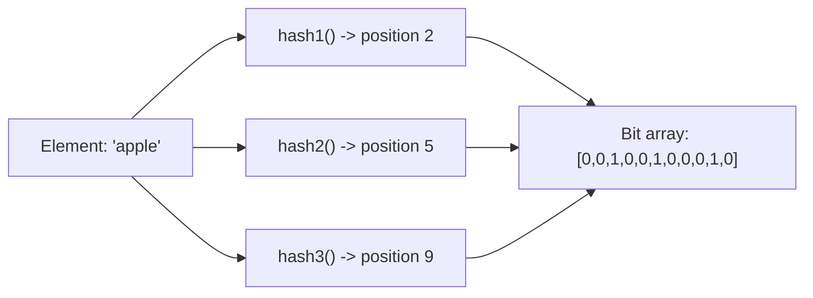
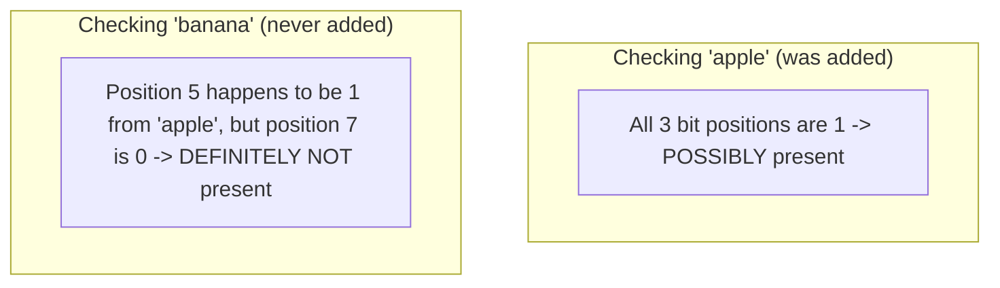
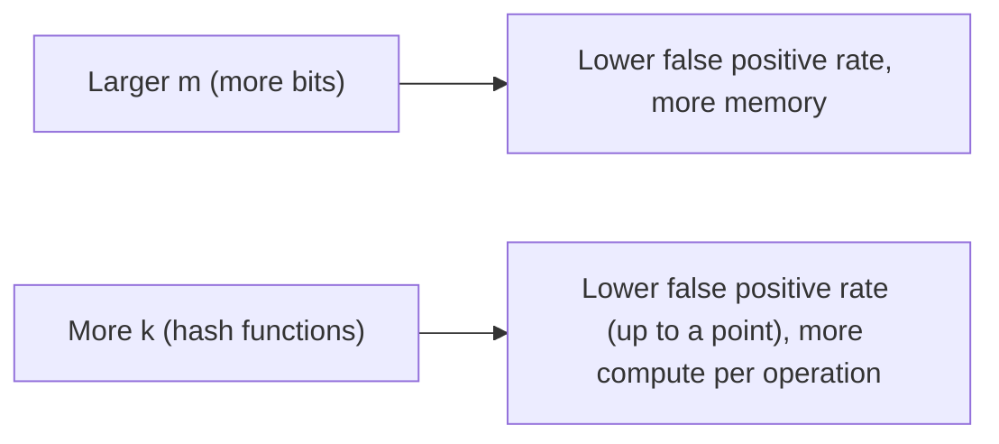

## Introduction

Chapters 9 and 14 both referenced Bloom filters — for mitigating cache penetration and for skipping irrelevant SSTables in an LSM Tree. This chapter covers the data structure itself: how it achieves extremely compact "does this exist?" checks, and the precise trade-off it makes to get there.

## The Problem It Solves

Checking whether an element exists in a large set (e.g., "has this URL been crawled before?" across billions of URLs) using a standard `HashSet` requires storing every single element — memory usage grows linearly with the number of elements, which becomes impractical at very large scale (billions of entries).

A **Bloom filter** answers the same membership question ("is this element possibly in the set?") using a small, fixed-size bit array, regardless of how many elements have been added — at the cost of allowing **false positives** (occasionally saying "yes, it might be in the set" for an element that was never actually added), while **guaranteeing zero false negatives** (if it says "definitely not in the set," that's always correct).

## How It Works

A Bloom filter consists of:
1. A bit array of size `m`, initialized to all zeros.
2. `k` independent hash functions, each mapping an element to one position in the bit array.

**Adding an element**: Hash it with all `k` hash functions, and set the bit at each resulting position to 1.



**Checking membership**: Hash the element with all `k` hash functions. If **all** `k` corresponding bit positions are 1, the element is *possibly* in the set (could be a false positive). If **any** of the `k` positions is 0, the element is **definitely not** in the set — this is the guarantee that makes Bloom filters useful.



**Why false positives happen, but false negatives don't**: Multiple different elements can hash to overlapping bit positions, so a queried element might have all its "required" bits set to 1 purely by coincidence from *other* elements — producing a false positive. But an element that was genuinely added always has all its own bits set to 1 by definition, so a genuine member can never be incorrectly reported as absent.

## Tuning the Trade-off

The false positive rate depends on three factors: bit array size (`m`), number of hash functions (`k`), and number of elements added (`n`). More bits and more well-chosen hash functions reduce the false positive rate, but increase memory usage and computation per operation — a direct, tunable trade-off, similar in spirit to the LRU/LFU trade-offs from Chapter 10.



## Java Implementation

```java
import java.util.BitSet;
import java.nio.charset.StandardCharsets;
import java.security.MessageDigest;
import java.security.NoSuchAlgorithmException;

public class BloomFilter {

    private final BitSet bitArray;
    private final int size;
    private final int numHashFunctions;

    public BloomFilter(int size, int numHashFunctions) {
        this.size = size;
        this.numHashFunctions = numHashFunctions;
        this.bitArray = new BitSet(size);
    }

    public void add(String element) {
        for (int i = 0; i < numHashFunctions; i++) {
            int position = hash(element, i);
            bitArray.set(position);
        }
    }

    public boolean mightContain(String element) {
        for (int i = 0; i < numHashFunctions; i++) {
            int position = hash(element, i);
            if (!bitArray.get(position)) {
                return false; // definitely not present
            }
        }
        return true; // possibly present (could be a false positive)
    }

    // Simulate k independent hash functions using a single hash function
    // combined with a seed - a common, practical technique (double hashing).
    private int hash(String element, int seed) {
        try {
            MessageDigest md = MessageDigest.getInstance("MD5");
            md.update((seed + "-" + element).getBytes(StandardCharsets.UTF_8));
            byte[] digest = md.digest();
            int hashValue = 0;
            for (int i = 0; i < 4; i++) {
                hashValue = (hashValue << 8) | (digest[i] & 0xFF);
            }
            return Math.abs(hashValue % size);
        } catch (NoSuchAlgorithmException e) {
            throw new RuntimeException(e);
        }
    }
}
```

```java
BloomFilter filter = new BloomFilter(1_000_000, 7); // tuned for expected element count
filter.add("https://example.com/page1");
filter.add("https://example.com/page2");

filter.mightContain("https://example.com/page1"); // true (definitely added)
filter.mightContain("https://example.com/page999"); // false, or rarely a false positive
```

Note: this implementation never supports **removal** — clearing a bit could inadvertently remove another element's "vote" for that same bit position, since bits are shared across elements. Removal requires a variant called a **Counting Bloom Filter**, which uses small counters instead of single bits, incrementing on add and decrementing on remove.

## Real-World Usage

- **Databases (LSM Trees, Chapter 14)**: Each SSTable maintains its own Bloom filter, letting a read cheaply skip SSTables that definitely don't contain a given key, avoiding unnecessary disk reads.
- **Cache penetration mitigation (Chapter 9)**: Checking a Bloom filter before querying the database for a potentially non-existent key avoids wasting database load on requests that can be definitively rejected upfront.
- **Web crawlers (Chapter 59)**: Tracking which URLs have already been crawled, at a scale (billions of URLs) where a full `HashSet` would be memory-prohibitive.
- **CDN / browser security**: Google Chrome's Safe Browsing feature historically used a Bloom filter to check URLs against a large list of known malicious sites without needing to store or query the full list for every single page visit.
- **Distributed databases (Cassandra, HBase)**: Use Bloom filters extensively to reduce unnecessary disk I/O when checking whether a key might exist in a given data file.

## Summary

- A Bloom filter is a compact, probabilistic data structure answering "possibly present" or "definitely absent" using a fixed-size bit array and multiple hash functions.
- False positives are possible (and tunable via bit array size, hash function count, and expected element count); false negatives are mathematically impossible.
- Standard Bloom filters don't support removal — a Counting Bloom Filter variant is needed for that.
- Real-world usage is widespread: LSM Tree read optimization, cache penetration mitigation, web crawler deduplication, and malicious URL checking.

---

## Interview Questions

### 1. Why can a Bloom filter guarantee zero false negatives but not zero false positives?
**Answer:** When an element is genuinely added to the Bloom filter, all `k` of its corresponding bit positions are explicitly set to 1 as part of the add operation — so when later checking that same element, all `k` of its bits will, by definition, still be found set to 1 (assuming no removal capability, which standard Bloom filters lack), guaranteeing it will always correctly be reported as "possibly present," never incorrectly as "definitely absent" — this is why false negatives are mathematically impossible. False positives occur because the bit array is shared across all added elements — a different element (or combination of different elements) might happen to have already set all the same bit positions that a *never-added* queried element would also hash to, purely by coincidental overlap, causing the filter to incorrectly report that never-added element as "possibly present" even though it was never actually added.

**Follow-up:** *If you used a separate, non-overlapping bit array for every single distinct element (essentially no shared bits at all), would this eliminate false positives entirely, and what would you sacrifice to achieve that?* — Yes, using entirely separate, dedicated bits per element would eliminate the possibility of coincidental bit overlap causing false positives, but this would completely eliminate the Bloom filter's core memory-efficiency benefit — you'd essentially need enough total bits to uniquely represent every possible distinct element, which is exactly the memory-scaling-with-element-count problem (like a standard `HashSet`) that Bloom filters are specifically designed to avoid; the shared-bit-array design (and the resulting possibility of false positives) is precisely the trade-off that enables the filter's compact, fixed-size memory footprint regardless of how many elements are added.

### 2. Explain how the choice of `m` (bit array size) and `k` (number of hash functions) affects the Bloom filter's false positive rate, and why simply maximizing both isn't the right approach.
**Answer:** Increasing `m` (more total bits) reduces the false positive rate because it reduces the probability of coincidental bit overlap between different elements — with more available bit positions to spread across, any two distinct elements are less likely to happen to hash to entirely overlapping sets of positions. Increasing `k` (more hash functions per element) also affects the false positive rate, but non-monotonically: too few hash functions means each individual element sets very few bits, potentially not distinguishing well from other elements, but too many hash functions cause the bit array to fill up (become saturated) more quickly, since each added element sets more bits, actually *increasing* the false positive rate past a certain optimal point — there's a well-defined mathematically-optimal `k` for a given `m` and expected number of elements `n`, rather than "more is simply always better." Simply maximizing `m` (making the bit array enormous) does technically approach zero false positive rate, but sacrifices the entire memory-efficiency benefit that makes Bloom filters valuable in the first place — the whole point is choosing `m` and `k` deliberately, based on the expected number of elements and an acceptable false-positive-rate target, to achieve a good balance between memory usage and accuracy, not maximizing either dimension in isolation.

**Follow-up:** *If you know in advance you'll be adding significantly more elements than you originally planned for when sizing the Bloom filter, what happens to your originally-chosen false positive rate?* — The actual false positive rate will increase beyond your originally intended/calculated target, since the bit array (sized and tuned based on your original expected element count) becomes increasingly saturated (more bits set to 1) as more elements than planned are added, increasing the likelihood of coincidental bit overlaps for any given query — this is why accurately estimating the expected number of elements in advance is an important part of correctly sizing a Bloom filter for a specific real-world use case, and why some systems use "Scalable Bloom Filters," a variant designed to gracefully handle situations where the eventual element count significantly exceeds initial expectations.

### 3. Why is Java's `HashSet` not a suitable replacement for a Bloom filter in a use case like tracking billions of crawled URLs, even though both can answer "have I seen this before?"
**Answer:** A `HashSet` stores each actual element (or at least a full reference/hash sufficient to reconstruct exact identity) explicitly, meaning its memory usage grows roughly linearly with the number of elements added — for billions of URLs (each potentially dozens to hundreds of bytes long), this would require many gigabytes or more of memory just to track membership, which can become impractical or prohibitively expensive at truly massive scale. A Bloom filter's memory usage is essentially fixed (determined by the pre-chosen bit array size `m`), regardless of how many elements are actually added — trading away perfect accuracy (accepting some tunable false positive rate) specifically to achieve this dramatically more compact, scale-independent memory footprint, which is exactly the trade-off that makes it practical for extremely large-scale set-membership tracking where an exact `HashSet`'s memory requirements would be genuinely prohibitive.

**Follow-up:** *In the web crawler use case, what's the practical consequence of a Bloom filter's false positive rate — what happens to a URL that's incorrectly reported as 'possibly already crawled' when it actually hasn't been?* — A false positive would cause the crawler to skip re-crawling that specific URL, incorrectly believing it had already been visited, even though it was actually a never-before-seen page — this means the crawler misses out on discovering/indexing that specific URL's content; the practical consequence is a small, generally acceptable/tunable rate of missed pages, which is typically a reasonable trade-off for a web crawler's overall goals, given the dramatic memory savings across billions of URLs, though a crawler needing perfect completeness would need a different approach (or an extremely low false-positive-rate configuration accepting proportionally more memory usage).

### 4. Why does a standard Bloom filter not support element removal, and how does a Counting Bloom Filter address this limitation?
**Answer:** In a standard Bloom filter, bit positions are shared across potentially many different elements — if you tried to "remove" an element by simply clearing (setting to 0) its corresponding bit positions, you might inadvertently also clear bits that are still legitimately needed by *other*, still-present elements that happen to share some of those same bit positions, incorrectly causing those other elements to now be reported as "definitely absent" even though they were never actually removed — this shared-bit design is fundamental to how the Bloom filter achieves its compact size, but it directly prevents safe, simple bit-clearing as a removal mechanism. A Counting Bloom Filter addresses this by replacing each single bit with a small counter (e.g., a few bits wide) — adding an element increments the counters at its `k` hash positions, and removing an element decrements those same counters; a position is only considered "unset" (equivalent to a Bloom filter's 0 bit) when its counter returns to zero, correctly allowing removal without incorrectly affecting other elements that still have a positive count at any shared position.

**Follow-up:** *What's a practical cost of using a Counting Bloom Filter's small counters instead of standard Bloom filter's single bits?* — Using small counters (e.g., 4 bits per position instead of 1 bit) directly multiplies the memory footprint of the underlying array by that same factor (e.g., roughly 4x more memory for 4-bit counters versus 1-bit flags) — this is a real, direct trade-off: you gain the ability to safely support element removal, but at the cost of some of the extreme memory compactness that makes standard Bloom filters so attractive in memory-constrained, removal-not-needed use cases like the web crawler or LSM Tree examples discussed in this chapter.

### 5. In the LSM Tree context (Chapter 14), explain precisely how a Bloom filter reduces unnecessary disk I/O, and why this specifically matters for LSM Tree read performance.
**Answer:** As covered in Chapter 14, an LSM Tree read may need to check multiple separate SSTable files on disk to find the most recent value for a given key, since data isn't consolidated into one single structure the way a B-Tree is. Without Bloom filters, checking whether a specific SSTable contains a given key would require actually reading that SSTable's data (or at least its index) from disk — an expensive operation, especially when repeated across potentially many SSTables for a single logical read, most of which likely don't actually contain the queried key at all. By maintaining a small, in-memory Bloom filter per SSTable, the read path can first cheaply check (in memory, no disk I/O at all) whether each SSTable's Bloom filter says the key is "definitely not present" — allowing the read to completely skip actually reading from disk for the (typically large majority of) SSTables that don't contain the key, and only performing the actual, more expensive disk read for the smaller subset of SSTables where the Bloom filter indicates the key is "possibly present."

**Follow-up:** *Since Bloom filters can produce false positives, does this mean the LSM Tree read path can never be 100% certain a key doesn't exist based on Bloom filters alone?* — Correct — a Bloom filter false positive means the read path might still occasionally perform an unnecessary disk read for an SSTable that, in actuality, doesn't contain the queried key (the Bloom filter incorrectly indicated "possibly present") — but this is still a significant net performance win in practice, since it only causes some *unnecessary but still occasionally accurate-in-outcome* extra disk reads at the (tunable, generally low) false positive rate, while reliably and correctly avoiding disk reads entirely for the (typically much larger) fraction of SSTables the Bloom filter correctly and definitively rules out — the actual definitive answer of whether the key truly exists is still ultimately confirmed (or refuted) by the actual disk read itself when one is performed, the Bloom filter's role is purely to reduce how many of those disk reads are needed in the first place.

### 6. A candidate proposes using a Bloom filter to store a set of currently valid user session tokens, checking it before allowing access to a protected resource. Why is this a fundamentally inappropriate use of a Bloom filter?
**Answer:** This is a security-critical use case where a false positive would be a serious problem: since a Bloom filter can occasionally report "possibly present" for a session token that was actually never legitimately issued, this design could allow an attacker with an entirely fabricated, never-issued token to be incorrectly granted access simply because their guessed/fabricated token happens to trigger a false positive against the Bloom filter's shared bit array — for a security/authentication use case, this represents a genuine, unacceptable security vulnerability, not merely a tolerable minor inefficiency (unlike, say, an unnecessary extra disk read in the LSM Tree use case) — Bloom filters are appropriate for use cases where a false positive causes a minor, tolerable *inefficiency* (an extra check, an extra disk read, a missed crawl), but fundamentally inappropriate for use cases where a false positive causes a genuine *correctness or security failure*, like incorrectly authenticating an illegitimate credential.

**Follow-up:** *What would be an appropriate data structure/approach instead for this specific session-token-validation use case?* — A proper key-value store (like Redis) or a database table specifically designed for exact, authoritative membership/lookup checks (with no false-positive possibility at all) should be used for validating security-critical credentials like session tokens — accepting the additional memory cost of storing full, exact token data (rather than a Bloom filter's compact but imprecise representation), since correctness is non-negotiable for this specific security use case, unlike the memory-optimization-over-perfect-accuracy trade-off that makes Bloom filters appropriate for their more suitable use cases discussed elsewhere in this chapter.

### 7. Why might the choice of hash functions used in a Bloom filter implementation matter for its actual real-world false positive rate, beyond just the theoretical formula based on `m`, `k`, and `n`?
**Answer:** The theoretical false positive rate formula for Bloom filters assumes that the hash functions used produce outputs that are effectively uniformly and independently distributed across the bit array's positions — if the actual hash functions used in a real implementation have poor distribution properties (e.g., clustering certain types of input strings toward similar bit positions rather than spreading them uniformly at random), the *actual, observed* false positive rate in practice could be meaningfully worse than the theoretical formula would predict, since the underlying uniform-distribution assumption the formula relies on wouldn't actually hold for that specific, poorly-distributing hash function choice — this is why choosing well-tested, good-quality hash functions with strong distribution properties (not necessarily cryptographically secure ones, similar to the consistent hashing discussion in Chapter 22, but genuinely good at avoiding clustering/bias) matters for a Bloom filter implementation to actually achieve its intended, theoretically-calculated false positive rate in real-world practice.

**Follow-up:** *Why might using genuinely independent hash function implementations (rather than a technique like the "double hashing" trick shown in this chapter's Java example, which derives multiple hash values from a single underlying hash function plus a seed) sometimes be preferred, despite being more implementation effort?* — Genuinely independent hash functions provide a theoretically cleaner, more rigorously-guaranteed uniform and independent distribution across all `k` hash outputs, whereas techniques like double hashing (deriving multiple values from a single base hash function with different seeds) rely on the assumption that this derivation technique itself doesn't introduce unwanted correlations between the resulting `k` values — while double hashing is widely used and generally works well in practice (and is simpler to implement, as shown in this chapter's example), some more rigor-sensitive implementations may prefer genuinely independent hash functions specifically to avoid any risk of subtle correlation between the derived hash values undermining the theoretical false-positive-rate guarantees the Bloom filter's design depends on.

### 8. How would you explain, to a teammate unfamiliar with Bloom filters, why "a Bloom filter can tell you a key definitely doesn't exist, but can't tell you a key definitely does exist" using a real-world, non-technical analogy?
**Answer:** You might compare it to checking a big shared "attendance chart" for a large event, where each attendee, upon arrival, checks off (without writing their actual name) several randomly assigned boxes on a shared chart rather than each person having their own individual named check-in sheet — later, if you want to know whether a specific person attended, you check whether *their specific* assigned boxes are all checked off; if even one of their assigned boxes is unchecked, you can be completely certain they never attended (since attending would have definitely checked off all their assigned boxes) — but if all their boxes happen to be checked off, you can't be 100% sure it was actually *them* who attended, since it's possible that *other* different attendees, through their own check-ins, happened to coincidally check off exactly the same combination of boxes that were also assigned to this specific person you're asking about, even though that specific person never actually showed up themselves.

**Follow-up:** *Using this same attendance-chart analogy, how would you explain what increasing the number of boxes on the chart (equivalent to increasing `m`) does to this coincidental-overlap problem?* — Using a much larger chart with many more total available boxes means each attendee's specific randomly-assigned combination of boxes is spread across a much bigger space of possibilities — making it statistically much less likely that any two different attendees would happen to have their assigned boxes' coincidentally overlap completely by chance, directly reducing the likelihood of this kind of "looks like they attended, but actually didn't" false-positive confusion, exactly mirroring how increasing the Bloom filter's bit array size `m` reduces its false positive rate by reducing the likelihood of coincidental bit-position overlap between different elements.

### 9. Why do some systems use a "Scalable Bloom Filter" or similar variant rather than a single, fixed-size standard Bloom filter, and what problem does this variant address?
**Answer:** A standard Bloom filter must be sized in advance based on an expected number of elements (`n`) to achieve a target false positive rate — if the actual number of elements added significantly exceeds this initial expectation, the fixed-size bit array becomes increasingly saturated, causing the actual false positive rate to degrade progressively worse than originally intended (as discussed earlier in this chapter). A Scalable Bloom Filter addresses this by dynamically adding additional, new Bloom filter "layers" (each appropriately sized) as the existing filter(s) approach their intended capacity/target false-positive-rate threshold — checking membership across all layers (an element is "possibly present" if any layer indicates so) — allowing the overall structure to gracefully grow and maintain a controlled, bounded false-positive-rate guarantee even when the total eventual number of elements wasn't accurately known or fixed in advance, at the cost of some additional implementation complexity and slightly more overhead per membership check (needing to check multiple layers) compared to a single, simple, fixed-size standard Bloom filter.

**Follow-up:** *In what kind of real-world scenario would you specifically recommend a Scalable Bloom Filter over a standard, fixed-size one, given this added complexity?* — A scenario with genuinely unpredictable, potentially unbounded, or rapidly-growing element counts over time — for example, a system tracking "have we ever seen this specific event ID before" for deduplication purposes in a rapidly growing platform, where the total eventual number of distinct events might grow by orders of magnitude over the system's lifetime in ways that are difficult to accurately predict upfront — would benefit from a Scalable Bloom Filter's ability to gracefully accommodate this kind of unpredictable growth while maintaining a controlled false-positive rate, whereas a use case with a well-understood, relatively stable, and accurately-predictable expected element count (like a fixed, known-size product catalog) would likely be well-served by a simpler, standard fixed-size Bloom filter without needing this added complexity.

### 10. In a system design interview, if you propose using a Bloom filter as part of your design, what specific follow-up details would you proactively address to demonstrate deep understanding, rather than just naming the data structure?
**Answer:** You'd proactively address: (1) the specific false-positive-rate target appropriate for this use case, and how you'd size `m` and `k` accordingly given the expected number of elements; (2) explicit acknowledgment of what happens, functionally, when a false positive occurs in this specific context (is it a minor, tolerable inefficiency, like an extra cache/database check, or could it be a more serious problem requiring a different approach altogether?); (3) whether the use case requires element removal, and if so, that you'd need a Counting Bloom Filter variant rather than a standard one; and (4) if the total eventual element count is genuinely unpredictable or likely to grow significantly beyond initial estimates, whether a Scalable Bloom Filter variant would be more appropriate than a simple fixed-size one — proactively addressing these specific details, rather than simply saying "I'll use a Bloom filter here" as a buzzword, demonstrates genuine understanding of both the data structure's mechanics and its precise, deliberate fit (or potential misfit) for the specific use case at hand.

**Follow-up:** *If, upon walking through these considerations, you realized the specific use case actually has zero tolerance for false positives (unlike the LSM Tree or web crawler examples), what would this imply about your design, and how would you communicate this pivot to the interviewer?* — This would imply that a Bloom filter is fundamentally the wrong tool for this specific requirement (similar to the earlier session-token example), and you should clearly and directly communicate this realization to the interviewer rather than forcing an inappropriate solution — explaining specifically *why* the false-positive characteristic makes it unsuitable for this particular need, and then proposing an appropriate alternative (like an exact, authoritative key-value lookup) instead — this kind of honest, reasoned course-correction during the interview, rather than stubbornly sticking with an initially-proposed but ultimately ill-fitting solution, is itself a strong signal of genuine understanding and sound engineering judgment.
