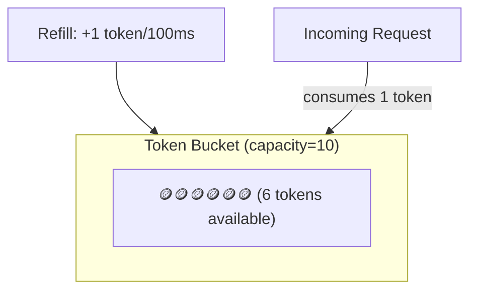
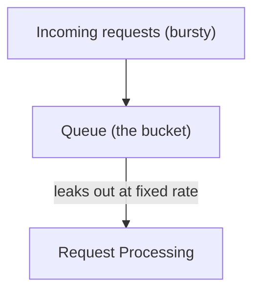
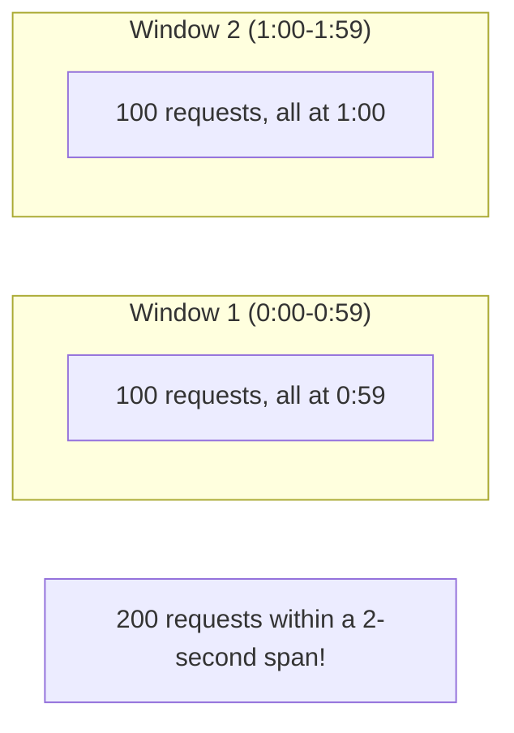

## Introduction

Rate limiting — restricting how many requests a client can make in a given time window — protects systems from abuse, accidental overload, and cascading failures. Chapter 4 introduced the `429 Too Many Requests` status code; this chapter covers how rate limiting is actually implemented.

## Why Rate Limit?

- **Protect against abuse**: Prevent a single malicious or misbehaving client from overwhelming shared infrastructure.
- **Ensure fair usage**: Prevent one heavy user from degrading service for everyone else (a form of the "noisy neighbor" problem).
- **Cost control**: For APIs with usage-based billing or expensive downstream calls (e.g., third-party APIs charged per call), rate limiting bounds costs.
- **Protect downstream dependencies**: A service might rate limit its own outbound calls to a fragile downstream dependency to avoid overwhelming it.

## Token Bucket

A bucket holds up to `capacity` tokens. Tokens are added at a fixed rate (e.g., 10 tokens/second) up to the capacity. Each incoming request consumes one token; if no tokens are available, the request is rejected (or queued).



**Key property**: Allows **bursts** up to the bucket's capacity — if the bucket has been filling up during a quiet period, a sudden burst of requests can be served immediately (up to the accumulated token count), not just at the steady refill rate.

```java
public class TokenBucketRateLimiter {

    private final long capacity;
    private final double refillTokensPerMillisecond;
    private double currentTokens;
    private long lastRefillTimestamp;

    public TokenBucketRateLimiter(long capacity, double refillTokensPerSecond) {
        this.capacity = capacity;
        this.refillTokensPerMillisecond = refillTokensPerSecond / 1000.0;
        this.currentTokens = capacity; // start full
        this.lastRefillTimestamp = System.currentTimeMillis();
    }

    public synchronized boolean tryConsume() {
        refill();
        if (currentTokens >= 1) {
            currentTokens -= 1;
            return true;
        }
        return false; // rate limited
    }

    private void refill() {
        long now = System.currentTimeMillis();
        long elapsedMillis = now - lastRefillTimestamp;
        double tokensToAdd = elapsedMillis * refillTokensPerMillisecond;
        currentTokens = Math.min(capacity, currentTokens + tokensToAdd);
        lastRefillTimestamp = now;
    }
}
```

## Leaky Bucket

Requests enter a queue (the "bucket") and are processed ("leak out") at a fixed, constant rate, regardless of how bursty the incoming traffic is. If the queue is full, new requests are rejected.



**Key property**: Unlike token bucket, leaky bucket **smooths out bursts** into a constant, steady output rate — useful when the downstream system genuinely cannot handle bursts at all, even briefly, and needs a perfectly uniform request rate.

```java
import java.util.concurrent.LinkedBlockingQueue;
import java.util.concurrent.TimeUnit;

public class LeakyBucketRateLimiter {

    private final LinkedBlockingQueue<Runnable> queue;
    private final long leakIntervalMillis;

    public LeakyBucketRateLimiter(int capacity, long processingRatePerSecond) {
        this.queue = new LinkedBlockingQueue<>(capacity);
        this.leakIntervalMillis = 1000 / processingRatePerSecond;
        startLeaking();
    }

    public boolean tryEnqueue(Runnable request) {
        return queue.offer(request); // false if the bucket (queue) is full
    }

    private void startLeaking() {
        Thread leakThread = new Thread(() -> {
            while (true) {
                try {
                    Runnable request = queue.take(); // blocks until a request is available
                    request.run(); // process at a fixed rate
                    TimeUnit.MILLISECONDS.sleep(leakIntervalMillis);
                } catch (InterruptedException e) {
                    Thread.currentThread().interrupt();
                    break;
                }
            }
        });
        leakThread.setDaemon(true);
        leakThread.start();
    }
}
```

## Fixed Window Counter

Count requests within fixed, non-overlapping time windows (e.g., "100 requests per minute," resetting at the top of each minute).

**Weakness**: Allows up to **2x the intended rate** at window boundaries — e.g., 100 requests in the last second of one window, plus another 100 in the first second of the next window, totaling 200 requests in a 2-second span, despite the "100/minute" limit.



## Sliding Window Log

Maintain a timestamp log of every request; when a new request arrives, discard timestamps older than the window, then check if the remaining count is under the limit.

**Strength**: Perfectly accurate — no boundary problem.
**Weakness**: Memory usage grows with request volume (storing every individual timestamp), which can be significant at high request rates.

## Sliding Window Counter (The Practical Compromise)

Combines fixed window's efficiency with sliding window log's accuracy by using a **weighted average** of the current and previous fixed windows.

```java
public class SlidingWindowCounterRateLimiter {

    private final int limit;
    private final long windowSizeMillis;
    private long currentWindowStart;
    private int currentWindowCount;
    private int previousWindowCount;

    public SlidingWindowCounterRateLimiter(int limit, long windowSizeMillis) {
        this.limit = limit;
        this.windowSizeMillis = windowSizeMillis;
        this.currentWindowStart = System.currentTimeMillis();
    }

    public synchronized boolean tryConsume() {
        long now = System.currentTimeMillis();
        long elapsedSinceWindowStart = now - currentWindowStart;

        if (elapsedSinceWindowStart >= windowSizeMillis) {
            // Roll over to a new window
            long windowsElapsed = elapsedSinceWindowStart / windowSizeMillis;
            previousWindowCount = (windowsElapsed == 1) ? currentWindowCount : 0;
            currentWindowCount = 0;
            currentWindowStart += windowsElapsed * windowSizeMillis;
            elapsedSinceWindowStart = now - currentWindowStart;
        }

        double weightOfPreviousWindow = 1.0 - ((double) elapsedSinceWindowStart / windowSizeMillis);
        double estimatedCount = (previousWindowCount * weightOfPreviousWindow) + currentWindowCount;

        if (estimatedCount < limit) {
            currentWindowCount++;
            return true;
        }
        return false;
    }
}
```

**How the weighting works**: If we're 25% of the way into the current window, we assume 75% of the previous window's requests are still "relevant" to the sliding view — this approximation is far cheaper than storing every timestamp, while avoiding the fixed window's sharp boundary problem.

## Algorithm Comparison

| Algorithm | Smooths bursts? | Memory | Accuracy | Best for |
|---|---|---|---|---|
| Token Bucket | Allows controlled bursts | O(1) | High | General-purpose API rate limiting (most common default) |
| Leaky Bucket | Yes, fully smooths | O(queue size) | High | Protecting a fragile downstream needing constant rate |
| Fixed Window | No | O(1) | Low (boundary issue) | Simple, low-stakes rate limiting |
| Sliding Window Log | No | O(requests in window) | Perfect | Low-volume, high-accuracy needs |
| Sliding Window Counter | Approximate | O(1) | High (approximate) | High-volume production systems (common practical default) |

## Distributed Rate Limiting

In a horizontally-scaled system (Chapter 7), rate limiting state (token counts, request timestamps) must be shared across all instances — otherwise each instance independently allows the full limit, multiplying the effective limit by the number of instances. The standard solution: store rate limit state in a shared, fast store like **Redis**, using atomic operations (`INCR` with expiry, or Redis's built-in Lua scripting for atomic check-and-decrement) to avoid race conditions between concurrent instances.

## Summary

- Token bucket allows controlled bursts and is the most common general-purpose choice; leaky bucket fully smooths output at a constant rate for protecting fragile downstreams.
- Fixed window counters are simple but allow up to 2x the intended rate at window boundaries; sliding window log is perfectly accurate but memory-intensive; sliding window counter is the common practical compromise.
- Distributed systems need shared, atomic rate-limit state (typically in Redis) — independent per-instance counting multiplies the effective limit by the number of instances.

---

## Interview Questions

### 1. What is the key behavioral difference between token bucket and leaky bucket, given that both are described using a "bucket" metaphor?
**Answer:** Token bucket allows bursty traffic to be served immediately, up to the bucket's accumulated token capacity — if tokens have built up during a quiet period, a sudden spike of requests can all be served at once (as long as enough tokens are available), meaning the *output* rate can be bursty even though the average *refill* rate is fixed. Leaky bucket, in contrast, always processes requests at a strictly constant, fixed output rate regardless of how bursty the *input* is — incoming requests are queued and only "leak out" for processing at that fixed rate, meaning leaky bucket actively smooths bursty input into perfectly uniform output, while token bucket permits burstiness in the output as long as sufficient tokens are available.

**Follow-up:** *Given this difference, which algorithm would you choose to protect a downstream payment processor that can only reliably handle exactly 10 requests per second, with no tolerance for even brief bursts above that rate?* — Leaky bucket, since its defining property is enforcing a strictly constant output rate regardless of input burstiness — token bucket's willingness to allow bursts (serving many requests at once if tokens have accumulated) would risk momentarily exceeding the downstream payment processor's stated hard capacity limit, which is precisely the scenario leaky bucket's smoothing behavior is specifically designed to prevent.

### 2. Explain the "boundary problem" with fixed window counters, and why it can allow up to double the intended rate.
**Answer:** A fixed window counter resets its count to zero at fixed, predetermined interval boundaries (e.g., every 60 seconds, on the minute) — this means a client could send the maximum allowed number of requests right at the very end of one window (e.g., all 100 allowed requests in the last second before the window resets), and then immediately send another full window's worth of requests right at the start of the very next window (another 100 requests in the first second of the new window) — since the counter resets completely between these two windows, both bursts are individually "compliant" with the stated limit, but together they represent 200 requests within a roughly 2-second real-time span, double the intended "100 per minute" rate, because the fixed window's counting doesn't account for the actual real-time distribution of requests relative to a continuously "sliding" observation period, only relative to its own fixed, non-overlapping reset boundaries.

**Follow-up:** *Why doesn't a sliding window log algorithm suffer from this same boundary problem?* — A sliding window log continuously maintains a record of individual request timestamps and, for any new request, checks the count of requests within the *actual, continuously-sliding* time window immediately preceding that request (e.g., "how many requests occurred in the last 60 seconds, counting backward from right now"), rather than relying on fixed, artificially-aligned reset boundaries — this means the two-burst boundary-straddling scenario described above would be correctly detected and rate-limited, since a sliding window naturally and continuously accounts for the true real-time distribution of requests, regardless of how they happen to align (or not) with any particular fixed interval boundary.

### 3. Why does the sliding window counter algorithm use a weighted average of the current and previous window counts, rather than exactly tracking every individual request timestamp like the sliding window log?
**Answer:** Exactly tracking every individual request timestamp (as the sliding window log does) provides perfect accuracy but requires memory proportional to the number of requests within the observation window — at high request volumes, this can become a significant memory burden, especially when rate limiting many different clients/keys simultaneously. The sliding window counter instead only needs to store two simple integer counts (the current and immediately preceding fixed window's totals) plus a timestamp — using the mathematical assumption that requests within the previous window were roughly evenly distributed throughout that window, it can compute a good, computationally cheap *approximation* of "how many requests occurred in the true sliding window ending right now" by taking a weighted combination of the previous window's count (weighted by how much of that previous window still falls within the current true sliding lookback period) and the current window's exact count — trading a small amount of accuracy (based on the evenly-distributed-within-window assumption, which isn't always perfectly true) for a dramatic, constant O(1) memory footprint regardless of actual request volume.

**Follow-up:** *Under what specific traffic pattern would the sliding window counter's approximation be least accurate compared to a true sliding window log?* — The approximation is least accurate when traffic within the previous window was highly uneven/bursty rather than evenly distributed — e.g., if all of the previous window's requests actually occurred in just the final few moments of that window (rather than being spread evenly throughout it), the weighted-average approximation (which assumes even distribution) would tend to *overestimate* how many of those requests are still "relevant" to the current true sliding lookback window if the weighting logic doesn't align with reality, or conversely could underestimate in other bursty patterns — this approximation error is the acknowledged, generally small and acceptable cost of the sliding window counter's significant memory efficiency advantage over the sliding window log's perfect but memory-intensive accuracy.

### 4. Why does rate limiting state need to be stored in a shared store like Redis in a horizontally-scaled system, rather than simply maintained in each application server's local memory?
**Answer:** If each individual application server instance maintains its own independent, local in-memory rate-limiting counters, a client's requests distributed by a load balancer (Chapter 8) across multiple different server instances would each be counted completely independently by whichever specific instance happens to handle them — meaning a client could effectively receive the full configured rate limit *from each individual server instance separately*, multiplying their true effective total rate limit by the total number of server instances in the fleet, completely undermining the intended, system-wide rate limit the design was meant to enforce. Using a shared, centralized store like Redis (accessible by all server instances) ensures that rate-limiting counts/state are correctly aggregated and enforced consistently across the *entire* fleet, regardless of which specific instance happens to handle any individual request, correctly reflecting and enforcing the true, intended system-wide limit rather than an inadvertently multiplied one.

**Follow-up:** *What specific technical property must Redis operations used for this shared rate-limiting have, to avoid race conditions between multiple concurrent server instances checking and updating the same rate-limit counter simultaneously?* — The check-and-update operation (checking the current count against the limit, and incrementing it if allowed) must be **atomic** — meaning it happens as a single, indivisible operation from the perspective of concurrent callers, typically achieved via Redis's `INCR` command combined with an expiry (`EXPIRE`), or more robustly via a Redis Lua script that performs the entire check-and-increment logic as a single atomic unit — without this atomicity, two concurrent requests from different server instances could both read the same "count so far" value before either has incremented it, both incorrectly concluding they're allowed to proceed even if their combined effect would exceed the actual configured limit, a classic race condition that atomic operations specifically prevent.

### 5. A candidate implements a token bucket rate limiter but forgets to account for elapsed time correctly, instead refilling a fixed number of tokens every time `tryConsume()` happens to be called. Why is this implementation flawed?
**Answer:** Refilling based on the *number of calls* to `tryConsume()` (rather than based on *actual elapsed wall-clock time* since the last refill) means the effective refill rate becomes dependent on how frequently the method happens to be called, rather than on true, real-world time — if the method is called very frequently in rapid succession, tokens would be refilled far faster than intended (based on call frequency rather than the intended fixed real-time rate), and conversely if the method is called very infrequently, tokens would refill far slower than intended relative to actual elapsed time — the correct implementation must calculate the actual elapsed real-time duration since the last refill (as shown in this chapter's Java example, using `System.currentTimeMillis()`) and calculate the token refill amount based on that real elapsed time multiplied by the intended refill rate, ensuring the rate limit's real-world effective throughput matches its intended specification regardless of how often or infrequently the checking method happens to be invoked.

**Follow-up:** *Why might this specific bug be easy to miss during initial testing but cause serious problems in production?* — During typical development/testing with a relatively steady, moderate rate of test requests, the bug might produce plausible-looking results that don't obviously reveal the underlying flaw — but in production, real traffic patterns are often much bursier or more variable (sometimes very high-frequency bursts, sometimes long quiet periods) — under a burst of very rapid, closely-spaced requests, this flawed implementation would incorrectly over-refill tokens (each call adding tokens regardless of how little real time has actually passed), potentially allowing a burst far exceeding the intended limit to pass through undetected, precisely the kind of overload scenario the rate limiter was meant to prevent in the first place — making this a subtle bug likely to surface specifically under the exact high-traffic conditions where correct rate limiting matters most.

### 6. Why might a system apply different rate limiting algorithms for different purposes within the same overall architecture — e.g., token bucket for a public API, but leaky bucket for calls to a specific fragile downstream partner?
**Answer:** These two scenarios have genuinely different requirements: a public API rate limit is typically about fair usage and abuse prevention for many different end clients, where allowing reasonable, occasional bursts (e.g., a client briefly making several rapid requests after a period of inactivity) is a perfectly acceptable, even desirable, user experience — making token bucket's burst-tolerant behavior a good fit. A call to a fragile downstream partner system, however, might have a hard, non-negotiable technical constraint (e.g., the partner's own infrastructure genuinely cannot handle more than a strictly constant N requests per second without errors or degradation, regardless of any burst tolerance) — making leaky bucket's strict, constant-rate-smoothing behavior specifically necessary to protect that fragile dependency, even if it means occasionally queuing or rejecting requests that a burst-tolerant algorithm like token bucket would have allowed through immediately.

**Follow-up:** *Could you use leaky bucket for the public-facing API instead, applying the same strict smoothing there as well? What would be the user-experience trade-off?* — You could, but it would mean legitimate clients experiencing brief, reasonable bursts of activity (e.g., a mobile app syncing several pieces of data right after the user opens it) would have those requests artificially queued and spread out at a constant rate rather than being served immediately, even though the system might have ample capacity to handle that brief burst without issue — this would likely create an unnecessarily sluggish, throttled-feeling user experience for legitimate, bursty-but-reasonable usage patterns, which is precisely the kind of cost that leads most public API rate limiters to prefer token bucket's burst-tolerant approach unless there's a specific, hard technical reason (like the fragile downstream partner scenario) requiring leaky bucket's stricter smoothing instead.

### 7. Why is `429 Too Many Requests` (from Chapter 4) often accompanied by a `Retry-After` header, and how does this relate to which specific rate limiting algorithm is being used internally?
**Answer:** The `Retry-After` header tells a well-behaved client how long to wait before retrying, allowing it to back off appropriately rather than immediately retrying (which would likely just be rejected again, wasting both the client's and server's resources) or, conversely, waiting unnecessarily longer than actually required — this value is typically computed based on the specific internal rate limiting algorithm's actual state: for a token bucket, it might be calculated as the time until enough tokens will have refilled to allow the request; for a fixed or sliding window, it might be the time remaining until the current window resets or enough of the sliding window's older requests will have "aged out" to allow the new request. Correctly computing this value requires the rate limiter to expose (or allow calculation of) not just a binary allow/reject decision, but also enough internal state information to determine when the client's next request would actually likely be allowed.

**Follow-up:** *What's a risk of providing an inaccurate or overly conservative `Retry-After` value that's much longer than actually necessary?* — An overly conservative `Retry-After` value causes well-behaved clients to wait longer than truly necessary before retrying, artificially degrading their experienced latency/throughput even though the server might actually be ready to accept their request sooner than indicated — while erring on the side of some conservatism is generally safer than under-estimating (which could cause a client to retry too soon and get rejected again), a well-designed rate limiter should aim to calculate this value as accurately as reasonably possible given its specific internal algorithm and state, to avoid unnecessarily penalizing legitimate clients' effective throughput beyond what the actual rate limit itself requires.

### 8. In an interview, if asked to design rate limiting for a multi-tenant SaaS API where different customers have different subscription-tier rate limits (e.g., free tier: 100 req/min, enterprise tier: 10,000 req/min), how would you extend the basic algorithms discussed in this chapter?
**Answer:** You'd key the rate limiting state (whichever specific algorithm you choose — token bucket is a common default) by a unique identifier per tenant/customer (e.g., their API key or account ID) rather than maintaining a single global rate limit shared across all customers — each tenant would have their own independent bucket/window/counter, with capacity and refill rate parameters specifically configured according to that tenant's subscription tier, likely looked up from a tenant-configuration store (or cached from one) at request time to determine the appropriate limit parameters to apply for that specific tenant's rate limiting state. This is architecturally very similar to the multi-tenant sharding discussion in Chapter 16 — `tenant_id` again serves as a natural key, this time for partitioning rate-limiting state rather than partitioning primary data storage.

**Follow-up:** *Where would you enforce this multi-tenant rate limiting in your overall architecture, and why there specifically?* — At the API Gateway layer (Chapter 6), since it's the natural, centralized chokepoint through which all incoming requests for every tenant already pass — enforcing rate limiting here means you can reject over-limit requests before they consume any actual backend service resources, and it keeps this cross-cutting concern (tenant-specific rate limiting) centralized in one place rather than needing to duplicate tenant-aware rate-limiting logic independently across every individual backend microservice.

### 9. Why might a well-designed rate limiter apply different, layered rate limits (e.g., a per-second burst limit AND a separate per-day total quota) rather than relying on a single rate limiting rule?
**Answer:** A single rate limit rule (like "100 requests per minute") only protects against one specific kind of problematic usage pattern — but real abuse or unintentional overuse can take different shapes: a very short, intense burst (which a per-second or per-minute limit specifically guards against) versus sustained, high-volume usage spread out evenly over a long period that might technically comply with a short-term rate limit while still representing an unacceptably high total usage/cost over a day or month (which a separate, longer-term quota specifically guards against). Layering multiple rate limits operating at different time granularities (e.g., a token-bucket-style burst limit for very short-term spikes, combined with a separate daily/monthly quota counter for total cumulative usage) provides more comprehensive protection against different categories of problematic usage patterns than any single rate limiting rule operating at just one time scale could achieve alone.

**Follow-up:** *How would you technically implement the interaction between these two layered limits — should a request be rejected if it violates either limit, or only if it violates both?* — Typically, a request should be rejected if it violates *either* limit independently (the two limits act as independent, both-must-pass gates) — you'd check the request against the short-term burst limit first (since it's likely cheaper/faster to check and will reject the most common abuse pattern earliest), and if it passes that check, then separately check it against the longer-term cumulative quota — implementing this as two independent, sequentially-checked rate limiting mechanisms (potentially even using different underlying algorithms suited to their respective time granularities, like token bucket for the short-term burst check and a simple incrementing counter with a daily expiry for the long-term quota) rather than trying to unify them into a single, more complex combined algorithm.

### 10. A candidate proposes rate limiting purely based on client IP address for a public API. What limitation of this approach should you raise, connecting back to Chapter 2's discussion of NAT?
**Answer:** As discussed in Chapter 2, multiple distinct clients can share the same visible public IP address due to NAT (Network Address Translation) — for example, many users behind the same corporate network, university, or even a large mobile carrier's shared IP pool could all appear to originate from a single IP address from the rate limiter's perspective; rate limiting purely by IP address in this scenario would incorrectly treat all these genuinely distinct, unrelated clients as a single entity for rate-limiting purposes, meaning legitimate users sharing that IP could be unfairly rate-limited due to the *combined* activity of everyone else behind that same shared IP, even though any individual user's actual usage might be entirely reasonable and well within intended limits.

**Follow-up:** *What alternative or complementary rate-limiting key would you propose instead of (or alongside) raw IP address, to address this limitation?* — For an authenticated API, rate limiting by a unique identifier tied to the actual authenticated principal — such as an API key, user account ID, or OAuth client ID — provides a much more accurate and fair basis for rate limiting, since it correctly identifies and limits based on the actual distinct client/application making requests, regardless of how many different clients might happen to share the same underlying network-level IP address; IP-based rate limiting might still be reasonably retained as a secondary, coarser-grained defensive layer (e.g., specifically for unauthenticated endpoints, or as an additional layer of protection against certain abuse patterns like credential-stuffing attempts), but shouldn't be the sole or primary rate-limiting mechanism for a system with proper client authentication available as a more precise alternative.
