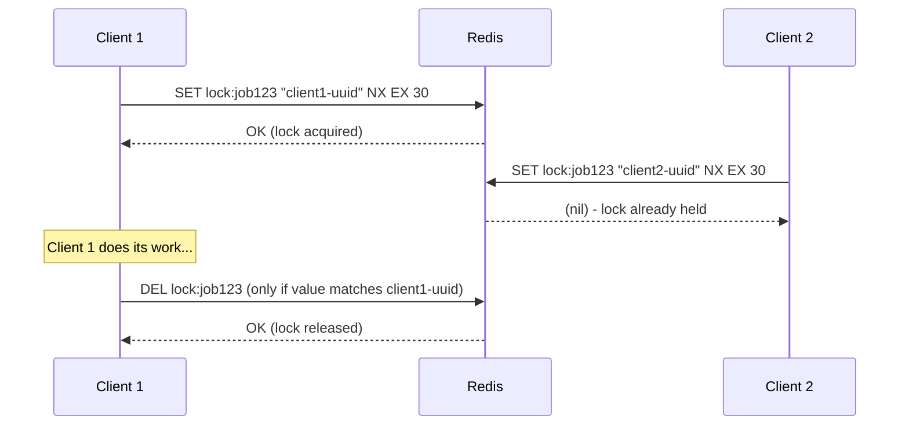
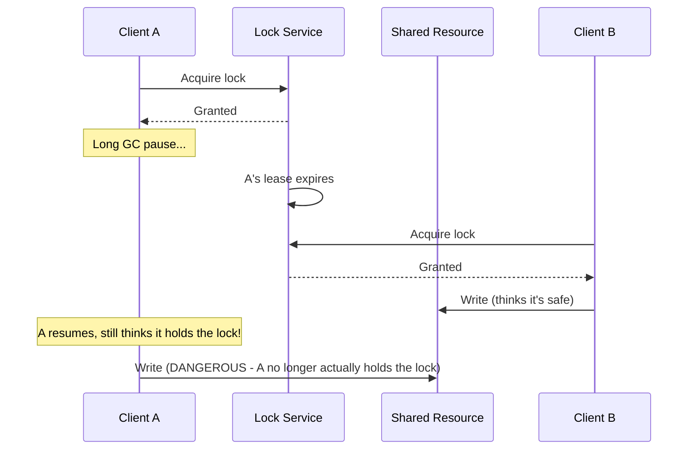
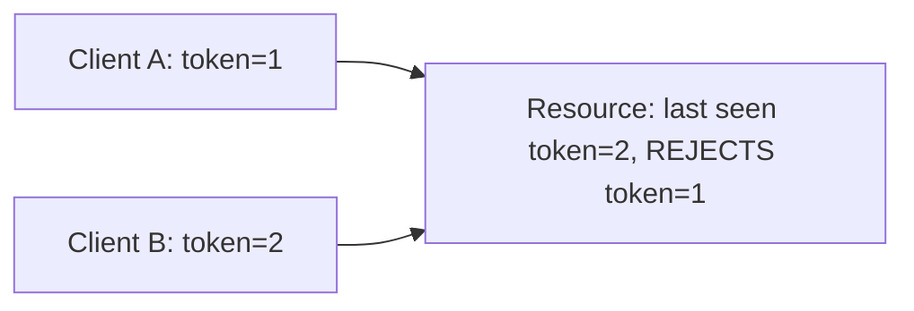
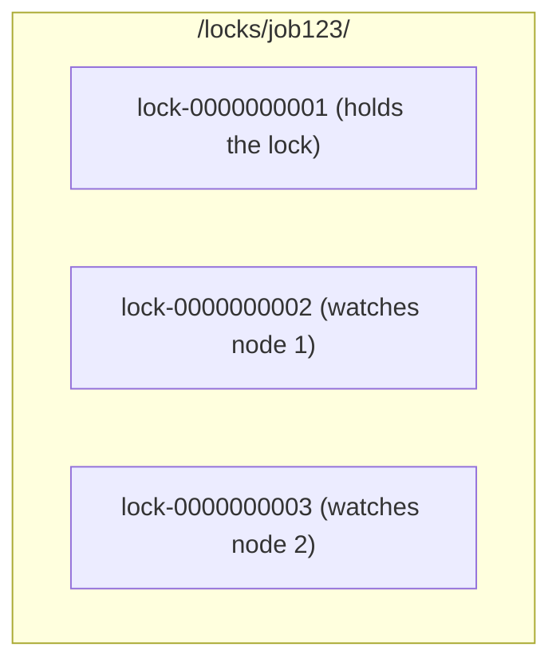

## Introduction

A regular in-process lock (like Java's `synchronized` or `ReentrantLock`) coordinates threads within a single process. A **distributed lock** coordinates access to a shared resource across multiple processes running on different machines — needed whenever multiple service instances (Chapter 7) might otherwise race to perform the same exclusive operation simultaneously (e.g., only one instance should process a specific scheduled job at a time).

## Why Distributed Locks Are Harder Than Local Locks

A local lock's correctness relies on the operating system's guarantees within a single machine. A distributed lock has no such guarantee — network delays, partial failures, and clock differences between machines all create correctness challenges a local lock never has to consider:

- A client might believe it holds the lock, but a network delay could mean its lease has already expired from the lock server's perspective.
- The lock server itself could fail or become partitioned from the client mid-operation.
- Clock skew between machines complicates any lease/expiry mechanism relying on wall-clock time.

## Redis-Based Distributed Locks

The simplest approach uses Redis's atomic `SET key value NX EX seconds` command: set a key only if it doesn't already exist (`NX`), with an automatic expiry (`EX`) as a safety net in case the lock holder crashes without releasing it.



```java
public class RedisDistributedLock {

    private final JedisPool jedisPool;
    private final String lockKey;
    private final String lockValue;
    private final int expirySeconds;

    public RedisDistributedLock(JedisPool jedisPool, String lockKey, int expirySeconds) {
        this.jedisPool = jedisPool;
        this.lockKey = lockKey;
        this.lockValue = UUID.randomUUID().toString(); // unique per acquisition attempt
        this.expirySeconds = expirySeconds;
    }

    public boolean tryLock() {
        try (Jedis jedis = jedisPool.getResource()) {
            String result = jedis.set(lockKey, lockValue,
                    SetParams.setParams().nx().ex(expirySeconds));
            return "OK".equals(result);
        }
    }

    public boolean unlock() {
        // CRITICAL: only delete if the value matches - prevents releasing
        // a lock that was actually acquired by someone else after our own expired.
        String luaScript =
            "if redis.call('get', KEYS[1]) == ARGV[1] then " +
            "    return redis.call('del', KEYS[1]) " +
            "else " +
            "    return 0 " +
            "end";
        try (Jedis jedis = jedisPool.getResource()) {
            Object result = jedis.eval(luaScript,
                    Collections.singletonList(lockKey),
                    Collections.singletonList(lockValue));
            return Long.valueOf(1).equals(result);
        }
    }
}
```

**Why a unique value (UUID) matters**: Without it, a dangerous race is possible: Client A acquires the lock, gets stuck (e.g., a long GC pause) past the expiry, so the lock auto-expires and Client B acquires it. When Client A finally resumes and calls `unlock()`, a naive implementation would delete the key — releasing **Client B's** lock, not its own. Checking the value before deleting (atomically, via a Lua script) prevents this.

## The Fencing Token Problem

Even the UUID-checked unlock above doesn't fully solve every correctness issue. Consider: Client A acquires the lock, experiences a long pause, its lock expires, Client B acquires the lock and starts writing to a shared resource (e.g., a file or database). Client A then wakes up, *still believing it holds the lock* (it hasn't tried to unlock yet, so it doesn't know its lease expired), and also writes to that same shared resource — now **both** clients are writing concurrently, exactly what the lock was supposed to prevent.



**The fix: fencing tokens.** Each time the lock is granted, the lock service issues a monotonically increasing number (the fencing token). The shared resource itself must check this token and **reject any write with a token lower than the highest one it has already seen**. Client A's write, resuming after B, would carry an *older* (lower) token than B's — the resource itself rejects it, even though Client A has no idea its lock had expired.



This shifts the correctness burden partly onto the resource being protected — a distributed lock alone, without fencing, is not sufficient for correctness in scenarios involving arbitrary process pauses.

## ZooKeeper-Based Distributed Locks

ZooKeeper (built on the consensus mechanisms from Chapter 23) offers a more robust primitive: **ephemeral sequential znodes**.

1. Each client creates an ephemeral, sequential node under a shared lock path (e.g., `/locks/job123/lock-0000000001`).
2. The client with the **lowest-numbered** sequential node holds the lock.
3. Other clients watch the node immediately preceding their own — when it's deleted (released, or the client crashes and its ephemeral node is automatically removed), the next client in line is notified and checks if it now holds the lowest number.



**Advantage over Redis-based locking**: ZooKeeper's ephemeral nodes are automatically cleaned up if a client's session dies (crash, network partition) — no reliance on a fixed TTL/expiry guess the way the Redis approach requires. It also provides fairness (strict queue ordering) more naturally.

## Summary

- Distributed locks coordinate mutual exclusion across processes on different machines, facing challenges (network delays, partial failures, clock skew) that local locks never encounter.
- Redis-based locks use `SET NX EX` for simple, fast locking, but require a unique value per holder and an atomic check-and-delete to avoid releasing someone else's lock.
- Fencing tokens are necessary for true correctness when a paused/delayed client might resume and act after its lock has already expired and been reacquired by another client — the protected resource itself must reject stale tokens.
- ZooKeeper's ephemeral sequential znodes provide a more robust locking primitive, automatically cleaning up after crashed clients without relying on a fixed TTL guess.

---

## Interview Questions

### 1. Why is a distributed lock fundamentally harder to implement correctly than a local, in-process lock?
**Answer:** A local lock's correctness relies on a single operating system's scheduler and memory model guarantees within one machine — there's no network involved, and a thread either holds the lock or it doesn't, with no ambiguity. A distributed lock spans multiple independent machines communicating over an unreliable network, introducing failure modes a local lock never faces: a client might experience an arbitrary pause (GC, OS scheduling delay, network partition) causing its lock lease to expire from the lock server's perspective while the client itself is unaware; the lock server itself could fail; and clock differences between machines complicate any lease-based expiry mechanism relying on wall-clock time — these factors mean a distributed lock implementation must explicitly account for scenarios (like the fencing token problem discussed in this chapter) that simply cannot occur with a local, single-machine lock.

**Follow-up:** *Why can't a distributed lock simply use an infinitely long lease (no expiry at all) to sidestep the "lease expired while I still think I hold it" problem?* — Without any expiry, a client that crashes or becomes permanently unreachable while holding the lock would cause that lock to be held forever, indefinitely blocking every other client from ever acquiring it — a distributed lock without some form of automatic expiry/cleanup mechanism creates an unacceptable risk of permanent deadlock from any single client failure, which is precisely why a TTL/lease-based expiry (despite the correctness challenges it introduces) is generally still necessary, rather than being avoidable by simply using an infinite lease.

### 2. Why must a Redis-based distributed lock's release ("unlock") operation check that the stored value matches the specific client attempting to release it, rather than simply deleting the key unconditionally?
**Answer:** Without this check, a dangerous race condition becomes possible: if Client A's lock has already expired (e.g., due to a long pause) and Client B has since legitimately acquired the same lock, Client A — unaware its lease already expired — might still attempt to call "unlock" when it eventually resumes; if unlock simply deletes the key unconditionally, this would delete Client B's *currently valid* lock, incorrectly releasing a lock that Client A no longer actually owns, potentially allowing a third client to then also acquire the lock while Client B still believes it's operating under mutual exclusion — checking that the stored value matches the specific identifier the releasing client originally set when it acquired the lock ensures a client can only ever release a lock it actually still, currently holds, not one that has since been reacquired by someone else.

**Follow-up:** *Why must this check-and-delete operation be implemented as a single atomic operation (like the Lua script shown in this chapter), rather than as two separate Redis commands (first a GET to check the value, then a separate DEL if it matches)?* — Performing the check and the delete as two separate, non-atomic commands introduces a race condition window between them — another client could acquire the lock (after Client A's original lease expired) in the brief gap between Client A's GET check succeeding and its subsequent DEL command actually executing, meaning Client A's DEL could still end up deleting this newly-acquired lock even though its own GET check appeared to pass just moments earlier; performing the check-and-delete as a single atomic Lua script (executed indivisibly by Redis) eliminates this race window entirely, ensuring the value check and the deletion happen as one uninterruptible unit.

### 3. Explain the fencing token problem: why is checking a lock's value before releasing it (as in the previous question) still not fully sufficient to guarantee correctness against a paused client?
**Answer:** The value-check-before-release fix specifically prevents Client A from incorrectly *releasing* Client B's legitimately-held lock — but it does nothing to prevent the more fundamental problem of Client A, after resuming from its pause, still believing it holds the lock and proceeding to directly act on the shared resource (e.g., writing to a file or database) *without ever calling unlock at all* — since Client A never learns that its lease already expired (it simply resumes execution assuming it's still operating under the lock's protection), it could perform its intended protected operation concurrently with Client B, who legitimately and correctly acquired the lock after A's lease expired — the lock service itself has no way to prevent this, since Client A isn't interacting with the lock service at all during this dangerous window, it's interacting directly with the shared resource being protected.

**Follow-up:** *Why does the fencing token solution shift responsibility to the shared resource itself, rather than being something the lock service alone can fully guarantee?* — Because the fundamental problem is that Client A can act on the shared resource directly, without any further interaction with the lock service, during the exact window when it's mistakenly acting on stale/expired lock ownership — the lock service has no visibility into or control over this direct interaction with the resource; the only way to reliably prevent Client A's stale, out-of-order write from having any effect is for the resource itself to independently verify and enforce that only monotonically increasing fencing tokens are accepted, rejecting any operation whose token is lower than one it has already seen — this requires the shared resource to be specifically designed to participate in this fencing-token verification, which is an additional design requirement beyond simply "using a distributed lock" in isolation.

### 4. Why is ZooKeeper's ephemeral znode-based locking approach generally considered more robust than a simple Redis `SET NX EX`-based approach, specifically regarding handling client crashes?
**Answer:** The Redis-based approach relies on a fixed, pre-configured TTL (expiry time) as a guess for "how long might this client legitimately need the lock before we assume it's crashed and should release it automatically" — this requires picking a specific expiry duration that's a somewhat arbitrary trade-off (too short risks prematurely expiring a lock still legitimately in use by a slow-but-still-alive client; too long risks other clients waiting unnecessarily long after an actual crash). ZooKeeper's ephemeral znodes are instead tied directly to the client's actual session with the ZooKeeper server — if that session genuinely terminates (due to a real crash, or the client's connection to ZooKeeper being lost beyond a session timeout), ZooKeeper automatically and promptly removes that specific ephemeral node, without requiring a fixed, pre-guessed TTL value — this ties lock release much more directly and adaptively to the actual, real-time liveness of the client's connection to the coordination service, rather than an arbitrary fixed timer.

**Follow-up:** *Does ZooKeeper's session-based approach eliminate the need for any timeout configuration at all?* — Not entirely — ZooKeeper itself still relies on a configurable session timeout to determine how long it will wait without receiving a heartbeat from a client before considering that client's session (and therefore its ephemeral nodes) to have expired — so there's still a timeout parameter involved, but it's a more general "is this client's connection to the coordination service still alive" session-liveness check (which ZooKeeper actively manages via ongoing heartbeats) rather than a fixed, one-time-set TTL guess about how long a specific lock-holding operation might reasonably take, which is a meaningfully different and generally more adaptive/robust mechanism.

### 5. Explain how ZooKeeper's ephemeral sequential znode approach naturally provides "fairness" (first-come-first-served ordering) for waiting clients, and why a simple Redis-based lock typically does not.
**Answer:** In the ZooKeeper approach, each client requesting the lock creates a new sequential znode, and ZooKeeper guarantees these sequence numbers are assigned in the order the creation requests were actually processed — clients can determine their position in this effectively fair, ordered queue simply by comparing their own sequence number to others', and each client specifically watches only the node immediately preceding its own, meaning when the lock is released, the very next client in the original request order is directly and specifically notified to attempt acquiring the lock next, preserving strict, fair, first-come-first-served ordering. A simple Redis `SET NX`-based lock provides no such inherent ordering — when the lock is released (or expires), *any* currently-waiting/retrying client (whichever happens to next attempt and successfully execute the `SET NX` command) can acquire it, with no guarantee that whichever client had been waiting the longest gets priority — this can lead to newer clients "cutting in line" ahead of clients that have actually been waiting longer, a form of unfairness (sometimes contributing to a related problem called "thundering herd," where all waiting clients simultaneously retry upon a lock's release, wasting resources with many failed attempts beyond just the one that succeeds).

**Follow-up:** *Could a Redis-based locking implementation be enhanced to also provide this kind of fair, ordered queuing behavior?* — Yes, with meaningfully more custom implementation complexity — you could build a separate, explicit queue data structure in Redis (e.g., using a Redis List or Sorted Set to track waiting clients in arrival order) alongside the basic lock key itself, having clients check and respect this queue ordering before attempting to acquire the actual lock — but this essentially means reimplementing much of the fair-queuing logic that ZooKeeper's sequential znodes provide natively and out-of-the-box, which is part of why ZooKeeper (or a similar dedicated coordination service) is often preferred specifically when fairness guarantees are an important requirement, rather than building this queuing logic manually on top of simpler Redis primitives.

### 6. A candidate proposes using a distributed lock to ensure "exactly-once" processing of a message from a message queue (Chapter 30), acquiring the lock before processing and releasing it after. Why might this alone be insufficient, connecting to the fencing token discussion?
**Answer:** Even with a distributed lock correctly acquired before processing, the same fundamental fencing-token problem applies: if the processing client experiences a long pause *after* acquiring the lock but *before* completing its work, its lock could expire and be reacquired by another client (or the same client retrying after a perceived failure), which then also begins processing the same message — if the original, paused client then resumes and completes its own processing (e.g., writing a result to a database, or triggering a downstream side effect) without knowing its lock had already expired, you could still end up with the message being processed more than once, exactly the "exactly-once" guarantee the lock was meant to help provide — without a fencing-token mechanism at the actual processing/output stage (e.g., the database write itself validating a monotonically increasing token, or an idempotency mechanism as discussed in Chapter 28), a distributed lock alone doesn't fully guarantee "exactly-once" semantics in the presence of arbitrary client pauses.

**Follow-up:** *How does this connect to the general principle, emphasized elsewhere in this chapter, that "a distributed lock alone is not sufficient for correctness"?* — This is a direct, concrete instance of the same underlying principle: a distributed lock can help *reduce the likelihood* of concurrent processing under normal, well-behaved conditions, but it cannot, by itself, provide an absolute guarantee against a paused/delayed client's stale action taking effect after its lock has already expired and been reacquired elsewhere — genuine, robust "exactly-once" (or truly safe mutual exclusion in the presence of arbitrary pauses) correctness requires an additional mechanism — like fencing tokens validated by the protected resource itself, or idempotent processing (Chapter 28) that makes a duplicate processing attempt harmless even if it does occur — layered on top of the distributed lock itself, rather than relying on the lock in isolation as a complete solution.

### 7. Why might a team choose a simpler Redis-based distributed lock despite its known correctness limitations (compared to ZooKeeper with fencing), rather than always using the more robust ZooKeeper-based approach?
**Answer:** For many real-world use cases, the specific, relatively rare failure scenario the fencing token problem addresses (a client experiencing an unusually long pause specifically *between* acquiring the lock and completing its protected operation, long enough for its lease to expire and be reacquired by another client, followed by the original client resuming and acting anyway) may be considered an acceptable, low-probability risk given the operation's actual stakes — e.g., a distributed lock protecting a periodic cache-warming job, where an extremely rare double-execution would cause only minor, easily-tolerated redundant work rather than serious harm, doesn't necessarily justify the additional operational complexity and dependency of running and maintaining a ZooKeeper cluster specifically for this comparatively low-stakes locking need, when a simpler, already-available Redis instance (perhaps already used for caching elsewhere in the system) can provide "good enough" locking behavior for this specific, lower-stakes use case.

**Follow-up:** *What specific characteristics of a use case would push you toward requiring the more robust ZooKeeper/fencing-token approach instead?* — Use cases where a rare double-execution or lock-correctness violation could cause serious, hard-to-reverse harm — such as a distributed lock protecting a financial settlement process, a critical infrequent leader-election decision, or any operation where duplicate/concurrent execution could cause genuine data corruption or financial loss — would justify the additional complexity and robustness of a ZooKeeper-based approach (potentially combined with explicit fencing tokens validated by the protected resource) specifically because the cost of even a rare correctness failure in these higher-stakes scenarios significantly outweighs the added operational overhead of the more robust coordination mechanism.

### 8. Why is choosing an appropriate TTL/expiry duration for a Redis-based distributed lock described as "a somewhat arbitrary trade-off," and what happens if it's set too short versus too long?
**Answer:** The TTL must be chosen as an estimate of "how long could this operation legitimately, reasonably take under normal (even if somewhat slow) conditions" — but this is inherently an estimate/guess, not a precise, guaranteed bound, since real-world operation durations can vary due to factors like variable load, occasional slow downstream dependencies, or garbage collection pauses that are difficult to predict with certainty in advance. If the TTL is set too short, a legitimately slow (but not actually crashed) client risks having its lock prematurely expire and reacquired by another client while it's still validly working, potentially causing the exact concurrent-access problem the lock was meant to prevent, purely due to an overly aggressive expiry setting rather than any actual client failure. If the TTL is set too long, a client that genuinely does crash while holding the lock causes all other waiting clients to be blocked for an unnecessarily long duration before the lock is automatically released, reducing the system's overall responsiveness/availability in the specific case of an actual crash.

**Follow-up:** *What technique can help mitigate the "TTL too short for a legitimately slow operation" risk, without simply setting an excessively long, overly conservative TTL upfront?* — A common technique is implementing "lock extension" (sometimes called a "watchdog" or "heartbeat" mechanism) — the client holding the lock periodically, proactively extends/renews its own lease (resetting the TTL) as long as it's still actively, legitimately working on the protected operation, rather than relying on a single, fixed, upfront TTL guess that must cover the entire potential operation duration in one shot; this allows using a shorter base TTL (enabling faster recovery in an actual crash scenario, since the lock will expire soon after the crashed client stops sending its extension heartbeats) while still safely accommodating legitimately longer-running operations through this active renewal mechanism, rather than needing to choose one single, static TTL value that must awkwardly balance both concerns simultaneously.

### 9. Why can't two independent Redis instances (not a properly configured Redis Cluster or replicated setup) reliably be used together for a "more robust" distributed lock by simply requiring a majority of them to agree, in the same way quorum-based consensus works (Chapter 23)?
**Answer:** This is actually a legitimate, real technique (known as the "Redlock" algorithm, proposed by Redis's creator) — requiring a lock acquisition to succeed on a majority of independent Redis instances specifically to gain the same kind of quorum-based fault tolerance discussed in Chapter 23, rather than depending on a single Redis instance as a single point of failure. However, this approach has been the subject of significant, genuine academic debate and criticism (notably from distributed systems researcher Martin Kleppmann) specifically regarding whether it actually provides the strong correctness guarantees it claims, given subtleties around clock behavior assumptions across the independent Redis instances and the network-timing assumptions the algorithm relies on — illustrating that even a seemingly reasonable extension of the quorum principle to Redis-based locking requires very careful, rigorous analysis to verify it actually achieves the intended correctness guarantees, rather than simply assuming "majority agreement across multiple instances" automatically provides the same robustness as a purpose-built consensus system like ZooKeeper.

**Follow-up:** *What does this controversy suggest about evaluating claimed distributed systems correctness properties in general, as a broader takeaway for this chapter?* — It reinforces a recurring theme across this Part of the series: claimed correctness properties in distributed systems (whether for locks, consistency models, or consensus) deserve genuinely rigorous scrutiny and should ideally be backed by formal analysis or well-established, widely-vetted implementations rather than taken at face value from a plausible-sounding design description — subtle timing assumptions, clock behavior, and edge cases in distributed systems are notoriously easy to get wrong even for experienced practitioners, which is precisely why relying on mature, extensively analyzed and battle-tested tools (like ZooKeeper's well-established consensus-based approach) is often the safer choice for genuinely correctness-critical distributed locking needs, rather than newer or less rigorously-vetted alternative approaches, however initially appealing they might seem.

### 10. In a system design interview, how would you decide between recommending a simple Redis-based lock versus a ZooKeeper-based lock with fencing tokens for a specific use case — walk through your decision process.
**Answer:** You'd start by identifying the actual consequence of a rare correctness violation for this specific use case: what's the real-world impact if, in some unlikely edge case, two clients briefly and incorrectly believe they simultaneously hold the lock? If the consequence is minor and easily tolerated (e.g., redundant, idempotent work being performed twice with no lasting harm), you'd lean toward the simpler, lower-operational-overhead Redis-based approach, since the added robustness of ZooKeeper/fencing likely isn't justified by the low stakes involved. If the consequence is serious (data corruption, financial impact, or a violation of a genuine business-critical invariant), you'd recommend the more robust ZooKeeper-based approach, explicitly including fencing tokens validated by the protected resource itself, accepting the additional operational complexity and dependency as a necessary cost given the higher stakes. You'd also factor in whether the team already operates a ZooKeeper cluster (or a similar coordination service) for other purposes — if so, the operational cost of also using it for this specific lock is much lower than introducing a brand-new dependency solely for this one need, which might shift your recommendation even for a moderate-stakes use case.

**Follow-up:** *If the interviewer specifically states the use case involves financial settlement (a clear high-stakes scenario), but the team has no existing ZooKeeper/etcd infrastructure at all, how would you factor in this additional operational cost?* — You'd still recommend the more robust approach despite the added infrastructure cost — for a genuinely high-stakes use case like financial settlement, the risk of a correctness violation (potentially resulting in real financial harm, incorrect settlements, or serious compliance/audit issues) clearly outweighs the one-time operational cost of introducing and properly operating a new coordination service — you might note this as an explicit, deliberate trade-off in your interview answer, acknowledging the added infrastructure investment while clearly justifying why the specific stakes of this particular use case warrant it, demonstrating that you're making a reasoned, context-specific engineering trade-off rather than either defaulting reflexively to "always use the simpler option" or "always use the most robust option" regardless of the actual situation's specific requirements.
