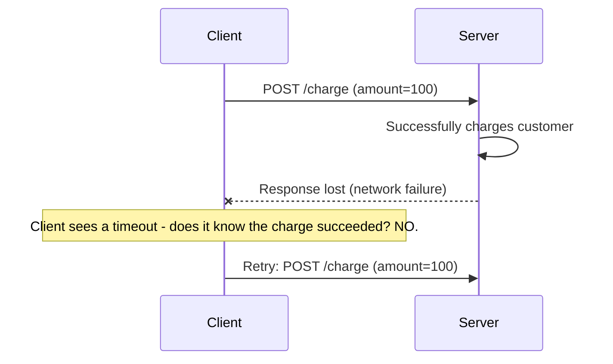

## Introduction

Chapter 4 introduced idempotency at the HTTP method level. This chapter treats it as a first-class distributed systems concern — because retries are not an edge case in distributed systems, they're a near-certainty. Networks drop packets, timeouts fire, services crash mid-request. A system that isn't designed for safe retries will, eventually, corrupt its own data.

## Why Retries Are Unavoidable



The client cannot distinguish between "the request never arrived," "the request arrived but failed," and "the request succeeded but the response was lost" — from the client's perspective, all three look identical: a timeout. A robust client's only reasonable strategy is to retry. If the server-side operation isn't idempotent, that retry can cause real harm — like charging the customer twice.

## Designing for Idempotency

### 1. Client-Generated Idempotency Keys (Revisited from Chapter 4)

The client generates a unique key (typically a UUID) per logical operation and includes it with every attempt (including retries) of that same operation. The server stores the result keyed by this identifier and returns the cached result for any repeat.

```java
@Service
public class PaymentService {

    private final IdempotencyKeyRepository idempotencyRepository;
    private final PaymentProcessor paymentProcessor;

    @Transactional
    public PaymentResult chargeCustomer(String idempotencyKey, ChargeRequest request) {
        Optional<PaymentResult> existing = idempotencyRepository.findResult(idempotencyKey);
        if (existing.isPresent()) {
            return existing.get(); // already processed - return the same result, don't charge again
        }

        PaymentResult result = paymentProcessor.charge(request);
        idempotencyRepository.saveResult(idempotencyKey, result);
        return result;
    }
}
```

**Important detail**: Storing the idempotency key and performing the actual operation must happen within the same transaction (or via some other atomicity guarantee) — otherwise a crash between the two steps could still allow a duplicate charge on retry.

### 2. Natural Idempotency Through Operation Design

Sometimes you can design the operation itself to be inherently idempotent, without needing an explicit key:

```java
// NOT idempotent - repeating this call multiple times keeps incrementing
public void incrementInventory(String sku, int amount) {
    inventoryRepository.increment(sku, amount);
}

// Idempotent by design - repeating this call with the same targetVersion has no
// additional effect once the version has already been applied
public void setInventoryIfVersionMatches(String sku, int newQuantity, long expectedVersion) {
    inventoryRepository.updateIfVersionMatches(sku, newQuantity, expectedVersion);
    // subsequent retries with the same expectedVersion will simply no-op,
    // since the version will have already advanced past expectedVersion
}
```

**Using `UPSERT` instead of `INSERT`**: An `INSERT` fails (or worse, creates a duplicate row) if retried; an `UPSERT` (`INSERT ... ON CONFLICT DO UPDATE`) naturally handles retries by overwriting with the same data, producing the same end state regardless of how many times it's applied.

### 3. Deduplication at the Messaging Layer

For asynchronous systems (Chapter 30), message brokers often provide **at-least-once delivery** — meaning a consumer might receive the same message more than once. Consumers must deduplicate using a message ID:

```java
@KafkaListener(topics = "order-events")
public void handleOrderEvent(OrderEvent event) {
    if (processedEventRepository.existsById(event.getEventId())) {
        return; // already processed this exact event, skip it
    }
    processOrder(event);
    processedEventRepository.save(new ProcessedEvent(event.getEventId()));
}
```

## Idempotency Is Not the Same as "No Side Effects"

A common confusion: idempotency doesn't mean an operation has no side effects — it means **repeating** it produces the same end state as doing it once. `DELETE /users/42` has a real side effect (a user is deleted), but it's idempotent: deleting an already-deleted user still results in "user 42 does not exist," the same end state as the first call.

## Idempotency Windows and Storage

Idempotency key records can't be kept forever — systems typically retain them for a bounded **idempotency window** (e.g., 24 hours), long enough to cover realistic retry scenarios (including a client retrying after a genuinely delayed response), after which they expire. This connects directly to the TTL-based cache eviction concepts from Chapter 9 and Chapter 10 — the storage backing idempotency keys (often Redis) is functionally very similar to a cache.

## Idempotency and Distributed Transactions (Revisited)

As emphasized in Chapter 20, Saga compensating transactions must be idempotent — a Saga orchestrator retrying a compensation (because it's unsure whether its previous attempt succeeded) must not cause harm if that compensation actually did already apply. Idempotency isn't a nice-to-have in distributed transaction design — it's a structural requirement for the whole pattern to be safe.

## Summary

- Retries are an unavoidable consequence of network unreliability — a client cannot distinguish a lost request from a lost response, so it must retry, and the server must handle that safely.
- Client-generated idempotency keys, naturally idempotent operation design (versioned updates, UPSERT), and message deduplication are the three primary techniques for achieving idempotency.
- Idempotency means "repeating produces the same end state," not "has no side effects" — a common and important distinction.
- Idempotency key storage requires a bounded retention window, and idempotency is a structural requirement (not optional) for Saga compensating transactions to be safe.

---

## Interview Questions

### 1. Why can't a client reliably distinguish between "my request was never received" and "my request succeeded but the response was lost," and why does this ambiguity make idempotency essential?
**Answer:** From the client's perspective, both scenarios produce the exact same observable symptom: a timeout, with no response ever received — the client has no direct visibility into what actually happened on the server side or in the network between sending the request and failing to receive a response, since the failure could have occurred at any point in that round trip (request never arriving, arriving but the server crashing before processing, arriving and processing successfully but the response being lost on the way back, etc.). Because the client cannot distinguish these cases, its only reasonable, safe strategy when it wants to ensure the operation eventually succeeds is to retry the request — but if the original request actually *did* succeed server-side despite the lost response, a naive retry of a non-idempotent operation (like "charge $100") would incorrectly repeat that side effect, making idempotency essential specifically to make this necessary, unavoidable retry behavior safe rather than harmful.

**Follow-up:** *Does using a more reliable transport protocol (like TCP instead of UDP) eliminate this ambiguity?* — No — while TCP guarantees reliable delivery *at the transport layer* for data that's successfully transmitted, it cannot protect against the server crashing after receiving and processing the request but before sending its response, nor against the response itself being lost due to an issue occurring after it leaves the server (e.g., a load balancer or intermediate proxy failing), nor against the client's own connection timing out due to the server simply taking too long to respond even though it's still actively processing — the fundamental ambiguity exists at the application/business-logic level (did the operation's *effect* actually happen?), which no transport-layer reliability guarantee alone can fully resolve.

### 2. Explain why storing an idempotency key's result and performing the actual protected operation must happen within the same atomic transaction, using a concrete failure scenario.
**Answer:** If these two steps aren't atomic, consider this scenario: a request arrives, the server successfully performs the actual protected operation (e.g., charges the customer), but then crashes *before* it manages to save the idempotency key record marking that operation as completed — when the client, having not received a response, retries with the same idempotency key, the server checks for an existing record, finds none (since it was never successfully saved due to the crash), and incorrectly concludes this is a fresh request, proceeding to perform the charge a second time — exactly the duplicate-charge problem idempotency was meant to prevent. Performing both the actual operation and the idempotency record-keeping within a single atomic transaction ensures that either both happen together (the operation completes AND the record is durably saved) or neither does (if the transaction is rolled back due to a failure, neither the charge nor the record persists), eliminating this specific window where a crash could leave the system in an inconsistent state that defeats the idempotency mechanism's purpose.

**Follow-up:** *What if the "actual protected operation" involves calling an external payment processor's API, which cannot participate in your own database's local transaction?* — This is a genuinely harder, common real-world problem — since you can't include an external API call within your own database's atomic transaction boundary, you typically need a different pattern, such as: first atomically recording "this idempotency key is being processed" (a pending state) within your own transaction, then calling the external API, then atomically updating the record with the final result — and designing your retry/reconciliation logic to specifically handle the case where a previous attempt is found in this "pending" state (e.g., by querying the external processor's own idempotency-aware API using the same key, if it supports one, to determine the actual outcome, rather than blindly retrying the external call) — this is a more nuanced pattern than a single local atomic transaction can fully solve alone, often requiring the external system to also support its own idempotency key mechanism (as many payment processors like Stripe do) to be handled robustly.

### 3. Why is "idempotent" not synonymous with "has no side effects," and what's a concrete example that illustrates the distinction?
**Answer:** Idempotency specifically means that performing an operation multiple times produces the same end result/state as performing it exactly once — it says nothing about whether the operation has side effects at all; many genuinely idempotent operations have very real, meaningful side effects. A concrete example: `DELETE /users/42` has a clear, real side effect (removing user 42's data) — but it's idempotent because calling it once results in "user 42 no longer exists," and calling it a second time (on an already-deleted user) also results in "user 42 does not exist" — the exact same end state, even though the second call technically has "no additional effect" simply because the first call already achieved that end state; the operation's defining side effect (deletion) still genuinely occurred, at least on the first successful call.

**Follow-up:** *Is "GET /users/42" idempotent, and does this example help clarify the difference between idempotency and having no side effects?* — Yes, `GET /users/42` is both idempotent AND has no side effects (it's a pure read, causing no state change at all) — this illustrates that "no side effects" is actually a stronger property than idempotency: every operation with no side effects is trivially idempotent (repeating a no-op is still a no-op, obviously matching itself), but not every idempotent operation lacks side effects, as the `DELETE` example demonstrates — idempotency is the more general, weaker property that specifically concerns the *end state after repetition*, not whether any effect occurred at all.

### 4. Explain how using database-level `UPSERT` (INSERT ... ON CONFLICT DO UPDATE) can make an operation naturally idempotent without needing an explicit application-level idempotency key.
**Answer:** A plain `INSERT` is not naturally idempotent — retrying it with the same data would either fail (if there's a unique constraint being violated by the duplicate attempt) or, worse, silently create a genuine duplicate row (if no such constraint exists) — neither outcome matches "same effect as doing it once." An `UPSERT` instead specifies: attempt to insert, but if a conflicting record already exists (matching some specified unique key), update that existing record instead — if the update logic simply sets the record's fields to the exact same values the original insert would have set, then retrying the same `UPSERT` operation multiple times with identical input data will always converge to and maintain the exact same final record state, regardless of how many times it's applied — achieving idempotency directly through the database operation's own conflict-handling semantics, without needing to separately track and check a distinct idempotency key record at the application level.

**Follow-up:** *Would this UPSERT-based approach work for the "charge a customer's credit card" use case from earlier in this chapter? Why or why not?* — No, not directly — charging a credit card is a call to an *external* payment processor's API, not a local database write; there's no local database `UPSERT` operation that can, by itself, prevent an external payment API from actually processing a duplicate charge if called twice — this is precisely why the explicit, application-level idempotency key pattern (Chapter 4, and revisited in this chapter) is specifically needed for operations involving external side effects that your own database's `UPSERT` semantics have no direct control over; `UPSERT`-based natural idempotency works well for operations whose entire effect is captured within your own database's local write, but not for operations with external, non-database side effects like third-party API calls.

### 5. In an event-driven system using Kafka (previewing Chapter 30), why must consumers explicitly deduplicate messages even though this adds application-level complexity?
**Answer:** Most message broker systems, including Kafka in typical configurations, provide an "at-least-once" delivery guarantee rather than "exactly-once" — meaning a message might occasionally be delivered to a consumer more than once, due to scenarios like a consumer successfully processing a message but crashing (or experiencing a network issue) before it can acknowledge/commit that it processed that message, causing the broker to redeliver the same message to another consumer instance (or the same one upon recovery), believing it was never successfully processed. Since the consumer's actual processing of a message might have real side effects (e.g., sending an email, decrementing inventory, charging a customer), receiving the same logical message more than once and processing it multiple times could cause exactly the kind of harmful, duplicated side effects that idempotent handling (via tracking already-processed message/event IDs, as shown in this chapter's Kafka listener example) is specifically designed to prevent — the added application-level complexity of deduplication is the direct, necessary cost of achieving true, safe "process each logical event's effect exactly once" behavior on top of a broker that only guarantees "at-least-once delivery" at the transport level.

**Follow-up:** *If a message broker specifically advertised "exactly-once delivery" as a built-in guarantee, would this eliminate the need for consumer-side deduplication entirely?* — Even brokers that advertise "exactly-once" semantics (like Kafka's exactly-once processing features in certain configurations) typically only guarantee this within the scope of the broker's own internal processing and offset-management guarantees — if the actual side effect the consumer performs (like calling an external, non-Kafka-aware API) isn't itself covered by that same exactly-once transactional scope, there can still be edge cases (e.g., the consumer's own external side-effect call succeeding, but its subsequent Kafka offset-commit failing) where the broker's internal "exactly-once" guarantee doesn't fully extend to guarantee the consumer's actual downstream side effect also happened exactly once — meaning consumer-side idempotent handling of the actual business-logic side effect often remains a valuable safety net even when using a broker that advertises strong exactly-once delivery semantics, for genuinely bulletproof end-to-end correctness.

### 6. Why does an idempotency key storage system need a bounded retention window (TTL) rather than storing every idempotency key indefinitely?
**Answer:** Storing every idempotency key ever used, indefinitely, would cause the idempotency-key storage to grow without bound over the system's entire lifetime, eventually consuming unsustainable amounts of storage for records that are almost certainly no longer practically relevant — a legitimate retry of a specific logical operation using a specific idempotency key realistically only happens within some bounded, reasonable time window after the original attempt (e.g., a client is unlikely to meaningfully "retry" an operation using the exact same idempotency key many months after its original attempt; by that point, any new attempt should reasonably be treated as a genuinely new, distinct operation, likely with its own new key) — choosing an appropriate, bounded TTL (long enough to cover realistic retry scenarios, including reasonably delayed client retries, but not indefinite) allows the system to reclaim storage for keys that are no longer practically needed, similar in spirit to the general cache TTL discussion in Chapter 9.

**Follow-up:** *What would be a reasonable way to determine an appropriate idempotency window duration for a specific system, rather than picking an arbitrary value?* — A reasonable approach considers the actual expected client retry behavior and realistic failure-recovery timelines for the specific system — e.g., if client-side retry logic uses exponential backoff capped at retrying for up to, say, 1 hour before giving up entirely, an idempotency window somewhat longer than that (e.g., 24 hours, providing a safety margin beyond the client's own typical retry ceiling, to also account for scenarios like a client application itself being restarted and re-attempting an operation it believes may not have completed) would reasonably cover realistic retry scenarios without needing indefinite storage — the specific right duration depends on understanding your actual system's realistic failure and retry patterns, rather than an arbitrary, one-size-fits-all default.

### 7. Why is idempotency described in this chapter as a "structural requirement" (not optional) for the Saga pattern's compensating transactions, connecting back to Chapter 20?
**Answer:** As discussed in Chapter 20, a Saga orchestrator (or a choreography-based service) may need to retry a compensating transaction (like "release this inventory reservation" or "issue this refund") if it's uncertain whether a previous attempt actually succeeded — due to the same fundamental request/response ambiguity discussed throughout this chapter (a timeout doesn't tell you definitively whether the compensating action actually took effect or not). If these compensating transactions aren't idempotent, a retry could cause incorrect double-effects — e.g., releasing the same reserved inventory twice (potentially inflating available inventory beyond what was ever genuinely reserved) or issuing a duplicate refund — since Sagas fundamentally rely on the ability to safely retry steps (including compensations) whenever their outcome is uncertain, without idempotency, the entire pattern's reliability and correctness guarantee breaks down; idempotency isn't an optional nice-to-have enhancement layered on top of Sagas, it's a foundational precondition the pattern depends on to safely handle the inherent uncertainty of distributed communication.

**Follow-up:** *Does this mean every single step within a Saga (not just the compensating transactions) must also be idempotent?* — Yes, generally — the same underlying justification applies equally to the "forward" steps of a Saga (like the original "reserve inventory" or "charge payment" steps) as it does to their compensating counterparts, since a Saga orchestrator might similarly need to retry any of these forward steps if their outcome is uncertain due to a timeout or communication failure — designing every step of a Saga (both forward actions and their compensations) to be idempotent is a general best practice for the pattern as a whole, not a requirement specific only to the compensation/rollback side of the workflow.

### 8. A candidate implements idempotency by having the client always generate the idempotency key as a hash of the request's exact content (rather than a random UUID per attempt). What's a potential problem with this specific approach?
**Answer:** Using a deterministic hash of the request content as the idempotency key means that two *genuinely distinct, separately-intended* requests that happen to have identical content (e.g., a user legitimately wanting to charge $50 to the same account twice, for two separate, unrelated purchases made in quick succession) would incorrectly generate the exact same idempotency key — the server would then treat the second, entirely legitimate request as a duplicate retry of the first (since it can't distinguish "same content because it's a retry" from "same content because it's coincidentally an equally-valued but distinct new request"), and would incorrectly return the first request's cached result instead of actually processing the second, legitimate charge — silently and incorrectly preventing a real, intended operation from taking effect, which is arguably just as harmful as the duplicate-processing problem idempotency keys are meant to solve, just manifesting in the opposite direction (incorrectly treating distinct operations as duplicates, rather than incorrectly treating a duplicate as a new operation).

**Follow-up:** *Why does using a client-generated random UUID per logical operation attempt (rather than a deterministic content hash) avoid this specific problem?* — A random UUID is generated once by the client at the moment it decides to *initiate* a specific logical operation, and that same UUID is then reused only for actual *retries* of that exact same specific attempt (e.g., due to a timeout) — the client itself is responsible for correctly distinguishing "this is a retry of an operation I already initiated" (reuse the same UUID) from "this is a new, distinct operation, even if it happens to have identical content to a previous one" (generate a new, different UUID) — this correctly places the responsibility for identifying genuine retries versus coincidentally-identical-but-distinct new operations with the client, which has the actual context/intent needed to make this distinction correctly, rather than trying to infer it purely from the request's content, which cannot reliably capture the client's actual intent in ambiguous cases like the twice-charged $50 example.

### 9. Why might idempotency be considered a form of "defense in depth" alongside, rather than a replacement for, reliable message delivery guarantees or distributed locks (Chapter 27)?
**Answer:** Each of these mechanisms addresses a related but distinct aspect of the broader "ensure operations happen correctly exactly once, despite an unreliable distributed environment" problem, and they're most robust when combined rather than relied upon individually: reliable delivery guarantees (like a message broker's at-least-once or exactly-once semantics) reduce how *often* duplicate delivery/processing attempts occur in the first place, but as discussed earlier, don't always perfectly guarantee true exactly-once *effects* end-to-end; distributed locks (Chapter 27) reduce the likelihood of truly *concurrent* processing of the same operation by multiple clients simultaneously, but as the fencing-token discussion showed, aren't airtight against all possible timing/pause scenarios on their own; idempotency specifically ensures that *even if*, despite these other mechanisms' best efforts, a duplicate attempt or a stale concurrent action does still somehow occur, the actual end-state effect remains correct and harmless regardless — layering all three provides genuinely stronger, more robust real-world correctness than relying on any single one of these mechanisms in isolation, each compensating for the specific residual risks the others don't fully eliminate on their own.

**Follow-up:** *If a system could only implement one of these three mechanisms due to resource/time constraints, which would you argue provides the most fundamental, broadly-applicable safety net, and why?* — Idempotency is arguably the most fundamental and broadly-applicable, since it directly addresses the *outcome* correctness regardless of *why or how* a duplicate/retry situation arose in the first place — whether the duplicate came from a network retry, a message broker's at-least-once redelivery, or a distributed lock's fencing-token edge case, idempotent operation design ensures the actual end result remains correct in all these scenarios; reliable delivery and distributed locks are valuable for *reducing the frequency* of problematic scenarios and improving overall system efficiency (avoiding unnecessary reprocessing or genuinely concurrent conflicting work), but idempotency is the layer that actually guarantees correctness of the final outcome even when those other mechanisms' guarantees have some edge-case gap, making it a particularly high-leverage, foundational investment when resources are constrained.

### 10. In a system design interview, how would you explain why "just add a distributed lock" is not, by itself, a complete answer to "how do you prevent duplicate order processing," incorporating both Chapter 27's and this chapter's material?
**Answer:** You'd explain that a distributed lock alone reduces the likelihood of *concurrent* duplicate processing (two processes trying to handle the same order literally at the same time), but doesn't fully address the *sequential* duplicate processing scenario central to this chapter — e.g., a client's request times out (even though the order was actually successfully processed server-side), and the client later retries by submitting what looks like a brand-new order-processing request; a distributed lock wouldn't even be relevant here, since there's no genuine concurrency involved — it's a single client, sequentially, unknowingly re-submitting what it believes might be a new attempt at the same logical operation. To fully prevent duplicate order processing, you need idempotency specifically designed around the actual business operation (e.g., a client-generated idempotency key per logical "place this order" intent, as discussed in this chapter), potentially combined with a distributed lock specifically to handle the separate, genuine-concurrency scenario (e.g., preventing two different, otherwise-legitimate concurrent requests from racing to decrement the same limited inventory simultaneously) — these are two distinct problems (sequential retries vs. genuine concurrent access) that both contribute to "preventing duplicate order processing," and a complete, robust answer needs to explicitly address both, rather than assuming a distributed lock alone covers every scenario that could lead to duplicate processing.

**Follow-up:** *How would you prioritize implementing these two mechanisms if you had to build the order-processing system incrementally, starting with just one?* — You'd likely prioritize idempotency (via client-generated idempotency keys) first, since the sequential retry scenario (a client's request timing out and being retried) is generally a far more common, everyday occurrence in real-world distributed systems than genuine, simultaneous concurrent requests for the exact same specific operation — most systems will encounter and need to correctly handle client-retry scenarios essentially from day one of real-world usage, while genuine concurrent-access races for the exact same specific resource/operation, while still important to eventually address, may be a comparatively rarer occurrence depending on the specific system's actual usage patterns and scale — starting with robust idempotency handling addresses the more frequently-encountered correctness risk first, with distributed locking added subsequently to handle the specific concurrent-access scenarios that idempotency alone doesn't fully cover.
