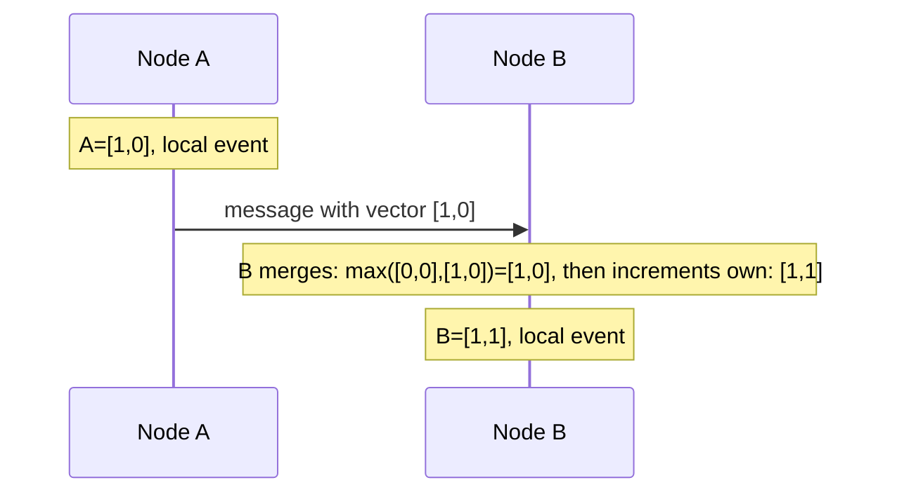
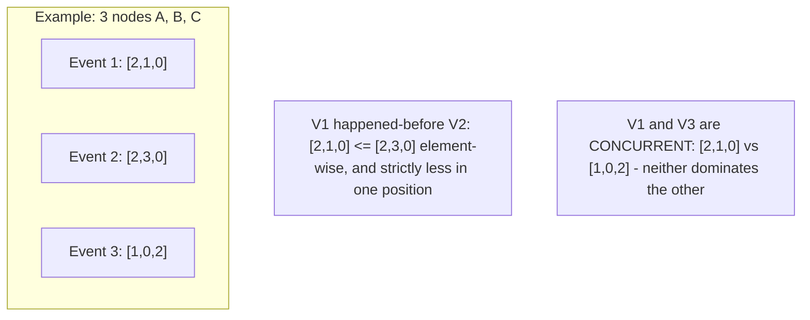

## Introduction

Chapter 19 introduced causal consistency and mentioned vector clocks as the mechanism that makes it work; Chapter 15 discussed conflict resolution in multi-leader replication. This chapter closes Part 4 by explaining precisely how vector clocks work — the tool that lets a distributed system distinguish "this event happened because of that one" from "these two events happened independently, with no relationship."

## The Problem: Why Wall-Clock Timestamps Aren't Enough

A tempting but flawed approach to ordering events across distributed nodes is to simply timestamp each event with the local machine's wall-clock time and compare timestamps. This fails because:

- **Clock skew**: Different machines' clocks are never perfectly synchronized — even with NTP (Network Time Protocol), drift of tens to hundreds of milliseconds is common, and larger discrepancies happen during network issues or hardware problems.
- **No causality information**: Even with perfectly synchronized clocks, a timestamp alone tells you *when* something happened, but not *whether* it happened *because of* something else — two genuinely unrelated (concurrent) events might simply have close timestamps by coincidence, while two genuinely causally-related events might, due to clock skew, appear to have timestamps in the wrong order.

## What a Vector Clock Actually Is

A vector clock is a vector (array) of counters, one per node in the system: `[counter_A, counter_B, counter_C, ...]`. Each node maintains and increments its own position in the vector whenever it performs a local event, and merges (takes the element-wise maximum of) vectors it receives from other nodes when communicating.

### The Rules

1. **On a local event**: A node increments its own position in its vector clock.
2. **On sending a message**: The node includes its current vector clock with the message.
3. **On receiving a message**: The node updates its own vector clock by taking the element-wise maximum of its current vector and the received vector, then increments its own position.



## Comparing Vector Clocks: Happened-Before vs Concurrent

Given two vector clocks `V1` and `V2`:

- **V1 happened-before V2** if every element of `V1` is ≤ the corresponding element of `V2`, and at least one element is strictly less. (V2 has "seen" everything V1 has, and more.)
- **V1 and V2 are concurrent** if neither happened-before the other — some elements of V1 are greater, and some elements of V2 are greater, meaning neither has fully "seen" the other's updates.



This is precisely the mechanism that allows causal consistency (Chapter 19) to distinguish "this reply must be shown after its parent post" (happened-before) from "these two unrelated posts can be shown in any order" (concurrent) — and precisely how Chapter 15's multi-leader replication systems detect genuine write conflicts (concurrent updates to the same record) versus a legitimate, ordered sequence of updates.

## Java Implementation

```java
import java.util.HashMap;
import java.util.Map;

public class VectorClock {

    private final Map<String, Integer> clock = new HashMap<>();
    private final String nodeId;

    public VectorClock(String nodeId) {
        this.nodeId = nodeId;
        this.clock.put(nodeId, 0);
    }

    public void tick() {
        clock.merge(nodeId, 1, Integer::sum);
    }

    public void merge(VectorClock other) {
        for (Map.Entry<String, Integer> entry : other.clock.entrySet()) {
            clock.merge(entry.getKey(), entry.getValue(), Math::max);
        }
        tick(); // increment own counter after merging, per the rules above
    }

    public enum Relationship { HAPPENED_BEFORE, HAPPENED_AFTER, CONCURRENT, EQUAL }

    public Relationship compareTo(VectorClock other) {
        boolean thisLessOrEqual = true;
        boolean otherLessOrEqual = true;

        Set<String> allNodes = new HashSet<>(clock.keySet());
        allNodes.addAll(other.clock.keySet());

        for (String node : allNodes) {
            int thisValue = clock.getOrDefault(node, 0);
            int otherValue = other.clock.getOrDefault(node, 0);
            if (thisValue > otherValue) thisLessOrEqual = false;
            if (otherValue > thisValue) otherLessOrEqual = false;
        }

        if (thisLessOrEqual && otherLessOrEqual) return Relationship.EQUAL;
        if (thisLessOrEqual) return Relationship.HAPPENED_BEFORE;
        if (otherLessOrEqual) return Relationship.HAPPENED_AFTER;
        return Relationship.CONCURRENT; // neither dominates - a genuine conflict
    }
}
```

## Using Vector Clocks for Conflict Resolution

When a system (like Amazon's original Dynamo, discussed in Chapter 24) detects that two versions of a record are **concurrent** (a genuine conflict — neither happened-before the other), it has a few options:

1. **Surface the conflict to the application** — return both concurrent versions and let the application (or, in Dynamo's original design, the end user) decide how to merge them. This was Dynamo's actual approach for shopping carts: showing both versions and merging them (e.g., taking the union of items) rather than arbitrarily picking one and losing data.
2. **Apply a deterministic merge function** — as discussed with CRDTs in Chapter 15, if the data type has well-defined merge semantics, the conflict can be resolved automatically and correctly.
3. **Fall back to Last-Write-Wins** — simplest, but as Chapter 15 covered, this risks silently discarding data.

## The Practical Cost: Vector Clock Size

A vector clock's size grows with the number of distinct nodes that have ever written to a given piece of data — in a system with many thousands of nodes/clients, this can become a genuinely significant storage and transmission overhead per piece of data. Real-world systems often use techniques to bound this growth, such as pruning entries for nodes that haven't been seen in a long time, or using a fixed, smaller number of "logical" replica identifiers rather than tracking every individual client.

## Summary

- Vector clocks solve the problem wall-clock timestamps can't: distinguishing genuinely causally-related events (happened-before) from genuinely independent, concurrent events, without relying on synchronized clocks.
- Each node maintains a vector of per-node counters, incrementing its own position on local events and merging (element-wise max) vectors received from other nodes.
- Comparing two vector clocks reveals whether one happened-before the other, or whether they're concurrent (a genuine conflict) — directly powering causal consistency (Chapter 19) and conflict detection in multi-leader/leaderless replication (Chapter 15).
- Detected conflicts can be resolved by surfacing both versions to the application, applying a CRDT-style deterministic merge, or falling back to (data-loss-risking) Last-Write-Wins.
- Vector clock size grows with the number of distinct writing nodes, requiring pruning strategies in systems with very large or highly dynamic node populations.

---

## Interview Questions

### 1. Why can't wall-clock timestamps alone reliably determine whether one event caused another in a distributed system?
**Answer:** Wall-clock timestamps across different machines are never perfectly synchronized — even with protocols like NTP actively working to minimize drift, some degree of clock skew is unavoidable in practice, meaning two machines' clocks can disagree by a meaningful amount at any given moment. This means that if Event A on Machine 1 actually causally led to (happened-before) Event B on Machine 2, but Machine 2's clock happens to be running slightly behind Machine 1's, Event B's recorded timestamp could actually appear *earlier* than Event A's timestamp, despite B genuinely having occurred as a causal consequence of A — timestamp comparison alone would then incorrectly suggest B happened before A, the opposite of the true causal relationship, which is precisely the kind of error vector clocks are specifically designed to avoid by tracking actual causal relationships directly, rather than relying on potentially-skewed wall-clock time as a proxy for causality.

**Follow-up:** *Would using a more precise, tightly-synchronized clock source (like Google's TrueTime, used in their Spanner database) fully eliminate the need for vector clocks?* — Even highly precise, tightly-bounded clock synchronization systems like TrueTime don't eliminate the fundamental need for a causality-tracking mechanism in every scenario — TrueTime specifically provides a *bounded uncertainty interval* for clock readings (allowing Spanner to make certain strong consistency guarantees by explicitly waiting out this bounded uncertainty), which is a different, more specialized and infrastructure-intensive approach than vector clocks; for general-purpose distributed systems without access to this kind of specialized, tightly-bounded global clock synchronization infrastructure, vector clocks (or similar logical/causal clock mechanisms) remain the standard, broadly-applicable approach to correctly tracking causality without relying on physical clock precision at all.

### 2. Walk through the three rules governing how a vector clock is updated, and explain why the "merge, then increment own counter" order specifically matters when receiving a message.
**Answer:** The three rules: (1) on any local event, a node increments its own position in its vector clock; (2) when sending a message, the node includes its current full vector clock alongside it; (3) when receiving a message, the node first merges (takes the element-wise maximum of) its own current vector clock with the received vector clock, and only *then* increments its own position. The specific order (merge first, then increment own counter) matters because the increment represents "the very act of receiving and processing this message" as a distinct new local event *following* the merge — if you incremented your own counter *before* merging, you'd be recording the increment as if it happened prior to seeing the sender's information, when the receipt-and-processing of the incoming message is actually a new event that logically depends on (happens after) having caused you to now know about everything reflected in the merged vector; performing the increment after the merge correctly places this receive-event later in the causal ordering than everything the merge just incorporated.

**Follow-up:** *What would go wrong, specifically, if a node forgot to increment its own counter at all upon receiving a message (only performing the merge step)?* — Without incrementing its own counter after merging, the receiving node's vector clock would become identical to (or a plain merge of) the sender's — meaning that if this receiving node subsequently performed its own new local event and sent a message onward, there would be no way to distinguish, from the vector clock alone, "information the receiving node learned purely from the sender" versus "a genuinely new, distinct local event that occurred at the receiving node after processing that message" — the receiving node's own causal contribution to subsequent events would be effectively invisible/unrecorded in the vector clock, undermining the mechanism's ability to correctly track and distinguish each node's own specific causal contributions over time.

### 3. Explain, using the comparison rules, why two vector clocks `[2,1,0]` and `[1,0,2]` are considered "concurrent" rather than one happening before the other.
**Answer:** To determine "happened-before," every single element of one vector must be less than or equal to the corresponding element of the other, with at least one element strictly less — comparing `[2,1,0]` and `[1,0,2]` element by element: the first vector's first element (2) is greater than the second vector's first element (1), but the first vector's third element (0) is less than the second vector's third element (2) — since neither vector is consistently less-than-or-equal-to the other across *all* positions (the first vector "wins" on position 1, but "loses" on position 3), neither can be said to have fully "seen" or incorporated everything the other has recorded; this mixed, non-dominating relationship is exactly the definition of "concurrent" — both events reflect genuinely independent branches of causal history that have each recorded something the other hasn't yet incorporated, meaning neither could have possibly caused the other.

**Follow-up:** *What would this concurrency detection mean in a practical scenario, such as two different replicas independently updating the same shopping cart record?* — This would indicate a genuine conflict: two different replicas each independently made an update to the shopping cart (e.g., one added item X, the other added item Y) without either replica having yet seen the other's specific update at the time it made its own — since neither update causally depended on or was aware of the other, the system cannot simply say "the later one wins" (as Last-Write-Wins would naively do, risking losing one of the two legitimate additions) — instead, this concurrency detection specifically signals that both updates need some form of explicit reconciliation (like the merge-based approach Dynamo's original shopping cart design used, discussed in this chapter) to correctly preserve the effect of both independent, non-conflicting-in-intent updates, rather than arbitrarily discarding one.

### 4. Why does Amazon's original Dynamo design choose to surface concurrent (conflicting) shopping cart versions directly rather than automatically picking one via Last-Write-Wins?
**Answer:** For a shopping cart specifically, the two "conflicting" concurrent updates typically represent two entirely legitimate, non-contradictory actions by the same user (e.g., adding item X on one device/session and adding item Y on another, both before either device had synced with the other) — simply picking one version via Last-Write-Wins based on an arbitrary or even carefully-chosen timestamp would silently and incorrectly discard one of these two legitimate additions, resulting in the user's cart missing an item they genuinely, intentionally added, which is a direct, tangible, business-meaningful data-loss problem (a customer might not even notice the missing item until checkout, or worse, not notice at all) — by instead detecting this specific situation as a genuine concurrent conflict (via vector clock comparison) and explicitly merging both versions (e.g., taking the union of items from both concurrent cart versions) rather than picking just one, the system preserves the actual, intended effect of both legitimate concurrent actions, avoiding this silent data loss.

**Follow-up:** *Would this same "merge both concurrent versions" approach make sense for a use case like "the current status of a support ticket" (e.g., 'open' vs 'closed'), rather than a shopping cart?* — Generally, no — unlike a shopping cart's items (which can be sensibly combined via a union operation), a support ticket's status is typically a single, mutually-exclusive value where "merging" two concurrent, conflicting status updates (e.g., one agent concurrently marking it 'closed' while another marks it 'reopened') doesn't have an obvious, sensible combined value the way merging a cart's item list does — for this kind of use case, detecting the concurrent conflict via vector clocks might instead need to trigger a different resolution strategy, such as flagging the conflict for explicit human review/resolution, or applying a specific, deliberately-chosen business rule (e.g., "a 'closed' status always takes precedence over other concurrent statuses") rather than Dynamo's shopping-cart-specific "just merge/union both" approach, illustrating that the appropriate conflict-resolution strategy genuinely depends on the specific semantics of the data type in question.

### 5. Why does a vector clock's size grow with the number of distinct nodes/clients that have ever written to a piece of data, and why can this become a genuine practical concern?
**Answer:** A vector clock maintains one counter position specifically for every distinct node/client identifier that has ever contributed a causally-relevant event to that piece of data's history — every time a genuinely new, previously-unseen node writes to (or otherwise causally interacts with) that data, the vector clock structure needs to grow to accommodate tracking that new node's own counter position going forward. In a system with a very large, and especially a highly dynamic (constantly changing/rotating) population of clients/nodes ever writing to shared data (e.g., a system where potentially millions of distinct end-user devices might each occasionally write directly to some shared piece of data, each needing their own tracked vector position), the vector clock attached to that data could grow to include an impractically large number of tracked node entries over the data's lifetime, consuming increasingly significant storage space and network transmission overhead for what should ideally remain a comparatively lightweight piece of metadata compared to the actual data it's tracking causality for.

**Follow-up:** *What's one practical technique mentioned in this chapter for bounding this growth, and what trade-off does it introduce?* — Pruning entries for nodes that haven't contributed a new causally-relevant update in a long time (based on some threshold, like "no update from this node in over 30 days") — the trade-off is that this pruning necessarily discards some precise historical causality information (specifically, information about that pruned node's exact prior contribution), meaning very rare, "long-lost" nodes suddenly reappearing with an extremely old, pruned-away causal contribution might have their true causal relationship to more recent events become ambiguous or incorrectly resolved (e.g., potentially misclassified as "concurrent" rather than correctly identified as genuinely older/superseded) — this is a deliberate, generally reasonable and practically necessary trade-off between the vector clock's storage/transmission efficiency and its theoretically perfect causal-tracking precision over unboundedly long timeframes and unboundedly large node populations.

### 6. Explain the relationship between vector clocks and causal consistency (Chapter 19) — specifically, how does a system use vector clock comparisons to actually enforce the causal ordering guarantee?
**Answer:** As introduced in Chapter 19, causal consistency requires that if operation B is causally dependent on (happened-after) operation A, every node must observe A before observing B — a system implements this in practice by attaching a vector clock to each operation/update, and before making a given update visible/deliverable to a client or another node, checking whether that update's vector clock indicates it causally depends on any other updates that this specific node/client hasn't yet actually received and applied — if such an unmet causal dependency is detected (the incoming update's vector clock shows it "happened-after" some other specific update this node hasn't yet seen), the system holds/buffers the dependent update until the causally-prior update it depends on has also been received and applied, at which point it can then safely deliver the dependent update, correctly preserving the required happened-before ordering; updates with no such detected causal dependency relative to what this node has already seen (i.e., genuinely concurrent with everything the node has seen) can be delivered immediately in any order, since no causal ordering constraint applies to them.

**Follow-up:** *Why is this "buffer until causal dependencies are met" approach necessary, rather than simply delivering updates in the exact order the vector clock timestamps suggest they globally occurred?* — Vector clocks specifically do NOT provide a single, total, globally-agreed ordering of all events the way a true global clock would (that's precisely the point of the "concurrent" classification — genuinely concurrent events have no inherent, meaningful relative order between them at all) — causal consistency only requires preserving the order of *causally-related* events specifically, while explicitly allowing concurrent, unrelated events to be observed in different orders by different nodes without violating the guarantee; the buffering approach correctly implements exactly this more nuanced, partial-ordering requirement (enforce order only where a genuine causal dependency exists, per the vector clock comparison), rather than incorrectly trying to impose a single, fully deterministic global ordering on every event, which would actually be a stronger (and more expensive, closer to full linearizability) guarantee than causal consistency is meant to provide.

### 7. A candidate proposes using a simple, single incrementing integer counter (a Lamport timestamp) instead of a full vector clock, arguing "it's simpler and still gives me an ordering." What critical capability does this sacrifice?
**Answer:** A Lamport timestamp (a single, globally-comparable logical counter incremented on each event and updated to `max(local, received) + 1` on receiving a message) does successfully provide *a* consistent ordering of events that respects the happened-before relationship (if A happened-before B, A's Lamport timestamp will indeed be less than B's) — but critically, it cannot reliably distinguish genuine happened-before relationships from genuinely concurrent events: two completely unrelated, concurrent events might simply happen to receive different Lamport timestamp values (since Lamport timestamps impose a total, if somewhat arbitrary for concurrent events, ordering on everything), making it *appear* as though one happened-before the other, when in fact neither actually causally influenced the other at all — this is precisely the critical distinction (happened-before vs. genuinely concurrent) that vector clocks are specifically designed to correctly capture, which a single-integer Lamport timestamp fundamentally cannot, since it collapses all events into one single, totally-ordered sequence with no way to represent or detect true concurrency at all.

**Follow-up:** *Given this limitation, why might a Lamport timestamp still be genuinely useful for some purposes, despite lacking vector clocks' ability to detect true concurrency?* — Lamport timestamps are much more compact (a single integer, versus a vector that grows with the number of nodes) and are sufficient for use cases that only need *some* consistent, happened-before-respecting total ordering of events — such as the "sequential consistency" model discussed in Chapter 19 (which explicitly doesn't require the ordering to reflect true, precise real-time or causal relationships, just *some* single agreed-upon consistent order) — for use cases specifically requiring the ability to correctly detect and distinguish genuine concurrency (like accurately identifying true write conflicts for the kind of reconciliation discussed in this chapter), a full vector clock's additional structure and information is genuinely necessary, but for simpler use cases only needing "a" consistent ordering without this specific concurrency-detection capability, a Lamport timestamp's greater simplicity and compactness can be the more appropriate, sufficient choice.

### 8. Why might a real-world production system choose to use "dotted version vectors" or similar refinements rather than the "classic" vector clock design described in this chapter?
**Answer:** The classic vector clock design, as described, has certain known practical inefficiencies and edge cases in real distributed database implementations — for example, classic vector clocks can sometimes retain more "garbage" (stale, no-longer-causally-relevant) entries than strictly necessary as data is repeatedly read, updated, and merged across a system's actual operational lifecycle, and certain replica-recovery or replica-replacement scenarios (a specific physical node being replaced with a new one that reuses that same logical node identifier) can introduce genuine correctness subtleties that the classic design doesn't cleanly handle. Refinements like "dotted version vectors" (used in real production systems including newer versions of Riak, itself inspired by many of the same Dynamo-paper principles referenced throughout this chapter) are specifically designed to more precisely and efficiently track causality while better handling these kinds of real-world operational edge cases (like sibling/conflict cleanup after resolution, and safer replica identifier reuse) that the more textbook-classic vector clock description in this chapter doesn't fully address by itself.

**Follow-up:** *Does this mean the classic vector clock explanation given in this chapter is "wrong" or not useful for understanding real systems?* — Not at all — the classic vector clock model presented in this chapter correctly captures the fundamental, essential concepts (per-node counters, merge-then-increment, happened-before vs. concurrent detection) that underlie causality tracking in distributed systems, and refinements like dotted version vectors build directly on top of, rather than replace or contradict, these same core principles — understanding the classic model thoroughly (as this chapter aims to provide) is the essential foundation for then understanding why and how more refined, production-hardened variants like dotted version vectors address specific additional real-world operational edge cases on top of that same core, correctly-understood foundation.

### 9. In an interview, if you propose using vector clocks for conflict detection in a multi-region, multi-leader database design (Chapter 15), what follow-up question about your resolution strategy should you be prepared to answer?
**Answer:** You should be prepared to explain specifically *what happens after* a conflict (a genuine "concurrent" relationship) is detected — vector clocks are purely a detection mechanism, identifying *that* a conflict exists, but they don't inherently resolve *how* that conflict should actually be handled; a strong interviewer would likely ask you to specify your actual resolution strategy: will you surface both conflicting versions to the application/end-user for manual reconciliation (as Dynamo did for shopping carts)? Will you apply an automatic, deterministic merge function specific to your data's semantics (a CRDT-style approach)? Or will you fall back to a simpler but data-loss-risking approach like Last-Write-Wins for this specific use case, and if so, why is that an acceptable trade-off for your particular data? — proposing vector clocks alone, without a clear, deliberate answer for the actual resolution strategy that follows detection, is an incomplete answer to the overall conflict-handling design question.

**Follow-up:** *How would your answer regarding resolution strategy likely differ between designing this for a collaborative document-editing feature versus a simple user-preference/settings record?* — For collaborative document editing, you'd likely lean toward CRDT-based automatic merging (given CRDTs' strong track record specifically for collaborative text editing use cases, as mentioned in Chapter 15) or, if that's not feasible for the specific editor implementation, surfacing conflicts for explicit user review/merge (similar in spirit to how version control systems like Git handle merge conflicts) — since silently discarding either concurrent edit via Last-Write-Wins would be a poor, data-losing experience for genuine collaborative editing. For a simple user-preference/settings record, where concurrent conflicting updates are likely rare and the individual setting values are typically independent, simple key-value pairs (rather than a single complex combined document), you might reasonably accept a simpler Last-Write-Wins approach as a pragmatic trade-off, given the comparatively low stakes and rarity of genuine conflicts for this kind of typically low-contention, simple data.

### 10. Why is understanding vector clocks valuable for a system design interview even if you're unlikely to ever implement one from scratch in a real production system, given that most teams would use an existing database/library's built-in causality handling?
**Answer:** Understanding vector clocks deeply provides essential conceptual grounding for correctly reasoning about a whole cluster of related, frequently-tested distributed systems concepts covered throughout this Part — causal consistency (Chapter 19), conflict detection and resolution in multi-leader/leaderless replication (Chapter 15), and the fundamental limitations of wall-clock-based event ordering in distributed systems generally — even when using an existing database or library that handles the actual vector-clock (or similar) mechanics internally for you, being able to correctly explain *why* that database's specific conflict-detection and resolution behavior works the way it does, and being able to reason clearly about the resulting trade-offs (data-loss risk from Last-Write-Wins vs. the complexity of surfacing/merging conflicts) when explaining your system design choices, directly demonstrates the kind of deep, first-principles understanding that distinguishes a strong system design interview answer from one that's merely repeating memorized tool names and buzzwords without genuine underlying comprehension of why those tools behave the way they do.

**Follow-up:** *Can you give an example of a system design interview question where explicitly mentioning vector clocks (even briefly) would meaningfully strengthen your answer, beyond just using the term as a buzzword?* — If asked to "design a distributed key-value store," when discussing how you'd handle the scenario of two different replicas concurrently receiving different updates to the same key (a scenario likely to come up given this Part's material on replication and consistency), explicitly naming that you'd use something like vector clocks specifically to correctly distinguish genuine concurrent conflicts from a simple, already-ordered sequential update history — and then following through with a clear, specific explanation of your chosen resolution strategy for genuinely detected conflicts (rather than just vaguely saying "we'll handle conflicts somehow") — demonstrates the kind of precise, mechanism-aware reasoning that shows genuine understanding, rather than simply mentioning "vector clocks" as an impressive-sounding term without being able to explain what specific problem they solve or how your system would actually use that information to make a concrete resolution decision.
