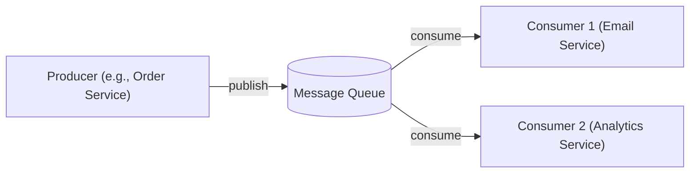
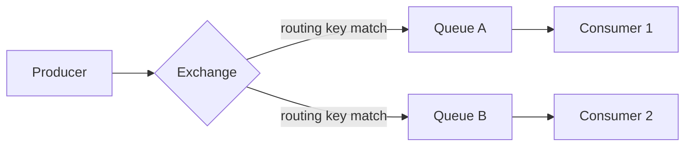
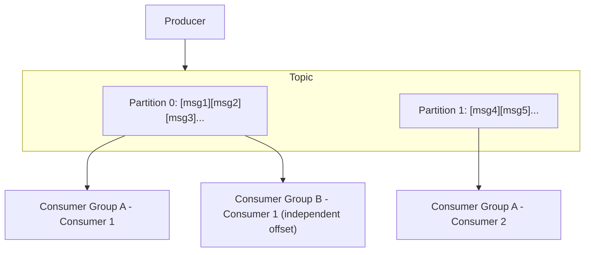

## Introduction

Every system design chapter so far has assumed synchronous, request-response communication (Chapter 5). But many operations don't need an immediate response — sending a confirmation email, processing an uploaded video, updating a search index. **Message queues** let services communicate asynchronously, decoupling the producer of work from the consumer that eventually performs it.

## Why Asynchronous Messaging?

- **Decoupling**: The producer doesn't need to know anything about the consumer (how many there are, whether they're currently available) — it just publishes a message and moves on.
- **Load leveling**: A sudden burst of incoming work (e.g., 10,000 image uploads in a minute) can be buffered in a queue and processed by consumers at a sustainable, steady rate, rather than overwhelming downstream systems immediately.
- **Resilience**: If a consumer is temporarily down, messages simply wait in the queue rather than being lost — the producer's request still succeeds immediately.
- **Enabling the Saga pattern (Chapter 20)**: Event-driven choreography between services fundamentally relies on message queues/brokers.

## Delivery Guarantees

| Guarantee | Meaning | Trade-off |
|---|---|---|
| **At-most-once** | A message is delivered zero or one times — never duplicated, but might be lost | Fastest, simplest, but risks data loss |
| **At-least-once** | A message is guaranteed to be delivered one or more times — never lost, but might be duplicated | Requires consumer-side idempotency (Chapter 28) to handle duplicates safely |
| **Exactly-once** | A message is delivered and processed exactly one time | Hardest to achieve; usually means "effectively-once" via at-least-once delivery plus idempotent processing |

**Important nuance**: True end-to-end "exactly-once" is famously difficult (some argue impossible) to guarantee in a fully general distributed setting — most systems that advertise "exactly-once" actually mean "exactly-once processing effect," achieved through at-least-once delivery combined with idempotent consumers, precisely the pattern discussed in Chapter 28.

## RabbitMQ: The Traditional Message Broker

RabbitMQ implements the **AMQP** protocol, built around **exchanges**, **queues**, and **bindings**.

- **Exchange**: Receives messages from producers and routes them to queues based on rules (direct, topic, fanout, headers).
- **Queue**: Holds messages until a consumer processes them.
- **Once consumed and acknowledged, a message is typically removed from the queue** — RabbitMQ is fundamentally a *queue* (transient work items), not a persistent log.

**Best for**: Complex routing logic, task queues (distributing discrete units of work among worker consumers), scenarios needing fine-grained per-message acknowledgment and retry control.

## Apache Kafka: The Distributed Log

Kafka is architecturally quite different — it's a **distributed, append-only log**, organized into **topics**, each split into **partitions** for parallelism (directly analogous to sharding, Chapter 16).

Key differences from RabbitMQ:
- **Messages are retained** (for a configurable period, e.g., 7 days) even after being consumed — multiple, independent consumer groups can each read the same topic at their own pace, tracking their own **offset** (position) in the log.
- **Ordering is guaranteed within a partition**, but not across partitions — this is why choosing a good partition key (e.g., `order_id`, so all events for one order land in the same partition) matters, directly echoing Chapter 16's shard key discussion.
- **High throughput**: Kafka's log-based, sequential-write design (similar in spirit to the LSM Tree's write-optimized approach, Chapter 14) is built for very high sustained write volume.

**Best for**: Event streaming, event sourcing (Chapter 38), systems needing to replay historical events, very high-throughput pipelines, and scenarios where multiple independent consumers need to process the same stream of events differently.

## Amazon SQS: The Managed Queue Service

SQS is a simpler, fully-managed cloud queue service.

- **Standard queues**: At-least-once delivery, best-effort ordering (messages might occasionally be delivered out of order).
- **FIFO queues**: Exactly-once processing and strict ordering *within a message group*, at the cost of lower throughput than standard queues.
- **Visibility timeout**: When a consumer receives a message, it becomes temporarily invisible to other consumers; if not deleted (acknowledged) within the visibility timeout, it becomes visible again for another consumer to pick up — directly analogous to the lease/TTL mechanism in Chapter 27's distributed locks.
- **Dead-letter queues (DLQ)**: Messages that repeatedly fail processing (exceeding a configured retry count) are moved to a separate queue for manual inspection, preventing a single "poison pill" message from blocking a queue indefinitely.

**Best for**: Simpler task-queue needs without Kafka's operational complexity, especially within an existing AWS-centric architecture.

## Choosing Between Them

| | RabbitMQ | Kafka | SQS |
|---|---|---|---|
| Model | Traditional message broker (queue) | Distributed log | Managed queue |
| Message retention after consumption | No (removed once acked) | Yes (configurable retention) | No |
| Throughput | Moderate-high | Very high | High (managed, auto-scaling) |
| Ordering | Per-queue (with care) | Per-partition | FIFO queues only, per message group |
| Replay historical messages | No | Yes | No |
| Operational complexity | Moderate (self-hosted) | High (self-hosted; lower if managed, e.g., MSK/Confluent Cloud) | Low (fully managed) |
| Best fit | Task distribution, complex routing | Event streaming, event sourcing, high-throughput pipelines | Simple, managed task queues |

## Summary

- Message queues decouple producers from consumers, providing load leveling and resilience for asynchronous work.
- Delivery guarantees range from at-most-once (fast, lossy) to at-least-once (safe, requires idempotent consumers) to the practically-achieved "effectively-once" (at-least-once plus idempotency).
- RabbitMQ is a traditional broker well-suited to complex routing and task distribution; Kafka is a distributed log built for high-throughput event streaming and replay; SQS is a simpler, fully-managed queue service.
- Choosing between them depends on throughput needs, whether message replay/multiple independent consumers matter, ordering requirements, and operational complexity tolerance.

---

## Interview Questions

### 1. What fundamental architectural difference distinguishes Kafka from RabbitMQ, and how does this drive their different typical use cases?
**Answer:** RabbitMQ is architected as a traditional message broker built around the concept of a transient queue — messages are routed to queues, consumed, acknowledged, and then removed, with the queue representing a temporary holding area for work not yet processed. Kafka is architected as a distributed, append-only, persistent log — messages are retained for a configurable period regardless of whether they've been consumed, and multiple independent consumers can read the same log at their own pace, each tracking their own position (offset). This difference drives their typical use cases: RabbitMQ's transient-queue model suits task distribution (each task should be processed once, by one worker, then discarded), while Kafka's persistent-log model suits event streaming and event sourcing, where the same sequence of events might need to be replayed or independently processed by multiple different consumers/systems over time.

**Follow-up:** *Could RabbitMQ be used for an event-sourcing use case (Chapter 38) requiring the ability to replay historical events?* — Not naturally or well — since RabbitMQ removes messages once they've been consumed and acknowledged, it doesn't provide a built-in mechanism to replay a historical sequence of past events to a new or existing consumer that needs to reconstruct state from that full history — this is a core capability Kafka's persistent log provides natively (any consumer can simply reset its offset to an earlier point and re-read), making Kafka the far more natural fit specifically for event-sourcing style use cases requiring historical replay.

### 2. Explain why "exactly-once" message delivery is often considered practically unachievable in a fully general sense, and what most systems actually mean when they claim to support it.
**Answer:** Achieving true, absolute exactly-once delivery across an unreliable network with independent, potentially-failing producer, broker, and consumer components runs into the same fundamental ambiguity problem discussed in Chapter 28 — a producer sending a message and a consumer processing it each involve acknowledgments that could be lost, making it impossible to definitively distinguish "the message was never sent/received" from "it was sent/received but the acknowledgment was lost," without some retry mechanism that then risks duplication. What most systems that advertise "exactly-once" actually provide is "exactly-once processing effect" — achieved through at-least-once delivery (ensuring no message is ever silently lost, accepting the possibility of duplicate delivery) combined with idempotent consumer-side processing (ensuring that even if a message is delivered/processed more than once, the final effect on the system's state is identical to processing it exactly once) — the "exactly-once" experience is an emergent property of these two combined techniques, not a literal guarantee that the message physically traverses the system only a single time.

**Follow-up:** *Does Kafka's specific "exactly-once semantics" (EOS) feature contradict this general principle, or is it consistent with it?* — It's consistent with it — Kafka's EOS feature specifically provides exactly-once guarantees *within the scope of Kafka's own internal transactional producer/consumer/offset-management mechanisms* (ensuring, for example, that a message isn't duplicated due to a producer retry, and that offset commits are atomically tied to processing), but this guarantee is scoped to operations happening entirely within Kafka's own transactional boundary — if a consumer's processing involves an external side effect outside of Kafka's transactional scope (like calling an external, non-Kafka-aware API), that external effect isn't automatically covered by Kafka's EOS guarantee, and idempotent handling of that specific external side effect may still be needed for genuinely complete end-to-end exactly-once behavior, consistent with the general principle rather than contradicting it.

### 3. Why does Kafka guarantee message ordering only within a single partition, not across an entire topic, and why does this make partition key selection an important design decision?
**Answer:** Kafka achieves its high throughput partly by allowing multiple partitions of the same topic to be written to and read from in parallel, potentially by different producer threads and consumer instances simultaneously — enforcing a single, strict global ordering across all these parallel partitions would require significant additional coordination overhead that would undermine this parallelism and throughput benefit; instead, Kafka only guarantees that messages *within the same specific partition* are strictly ordered (since a single partition is written and read sequentially). This makes partition key selection important because your application's meaningful ordering requirements (e.g., "all events for a specific order must be processed in the order they occurred") can only be satisfied if all causally-related events consistently hash to (and therefore land within) the *same* partition — directly analogous to the shard key selection discussion in Chapter 16, where choosing a key that groups related data/events together is essential for the system's partitioning scheme to actually support the application's real access/ordering needs.

**Follow-up:** *What would go wrong if you chose a partition key that didn't group related events together, such as partitioning by a random UUID generated per message rather than by order_id?* — Events relating to the same logical order could be scattered across multiple different partitions, each independently ordered internally but with no guaranteed relative ordering *between* partitions — a consumer processing events for that order could then receive them in an incorrect relative sequence (e.g., an "order shipped" event processed before its corresponding "order placed" event, if they landed on different partitions consumed at different rates), potentially causing serious application-level correctness bugs for any logic that depends on receiving that order's events in their true chronological/causal sequence.

### 4. What is a Kafka consumer group, and how does it enable both parallel processing within a group and independent processing across multiple groups?
**Answer:** A consumer group is a set of consumer instances that collectively and cooperatively process all partitions of a topic, with each specific partition being consumed by exactly one consumer instance *within* that group at any given time — this allows the group to parallelize processing across multiple consumer instances (each handling a different subset of the topic's partitions), scaling consumption throughput roughly with the number of partitions and consumer instances, up to the total partition count. Multiple *different* consumer groups can independently subscribe to and consume the exact same topic, each maintaining their own separate, independent offset (read position) into the log — meaning, for example, one consumer group (an "email notification" service) and an entirely separate consumer group (an "analytics" service) can both independently process every single message in the same topic, each at their own pace, without interfering with or being aware of each other at all, since Kafka's persistent log allows the same messages to be read multiple times by different, independent consumer groups.

**Follow-up:** *What happens if you add more consumer instances to a group than there are partitions in the topic?* — The excess consumer instances beyond the total partition count will sit idle, since Kafka's consumer group model assigns at most one consumer instance to each individual partition at any given time — a topic with, say, 4 partitions can have at most 4 actively-consuming instances within a single consumer group processing in parallel simultaneously; adding a 5th instance to that same group would leave it without any partition assigned and therefore without any work to do, meaning partition count effectively caps the maximum useful parallelism achievable by a single consumer group for that topic.

### 5. Explain the purpose of a "visibility timeout" in SQS, and how it relates conceptually to the lease/TTL mechanism discussed for distributed locks in Chapter 27.
**Answer:** When an SQS consumer receives a message, that message isn't immediately deleted from the queue — instead, it becomes temporarily "invisible" to other consumers for a configured visibility timeout duration, giving the receiving consumer time to actually process the message and then explicitly delete it (acknowledging successful processing) before that timeout expires; if the consumer fails to delete the message within this window (e.g., because it crashed mid-processing), the message automatically becomes visible again, allowing another (or the same, recovered) consumer to pick it up and attempt processing again. This is conceptually very similar to the lease/TTL mechanism in Redis-based distributed locks (Chapter 27) — both use a time-bound mechanism to grant temporary, exclusive access/ownership (of a lock, or of a message for processing) with an automatic expiry serving as a safety net against a client/consumer crashing while holding that temporary ownership, preventing indefinite blocking in the failure case while still providing the receiving party a reasonable window to complete its work under normal, successful conditions.

**Follow-up:** *What happens if a consumer's processing genuinely takes longer than the configured visibility timeout, even without crashing — could this cause a problem similar to the "paused client" scenario discussed with distributed locks?* — Yes, precisely analogous — if a consumer is still legitimately, actively processing a message when its visibility timeout expires, the message becomes visible again and could be picked up and processed a second time by another consumer, even though the original consumer is still working on it and hasn't actually failed — this is why many SQS consumer implementations use a technique directly analogous to the "lock extension"/heartbeat pattern discussed in Chapter 27, periodically calling SQS's `ChangeMessageVisibility` API to proactively extend the visibility timeout for messages still being legitimately, actively processed, rather than relying on a single fixed timeout value chosen upfront to (hopefully) cover the entire processing duration in one shot.

### 6. Why does a "dead-letter queue" (DLQ) exist, and what specific operational problem does it prevent?
**Answer:** A DLQ is a separate queue that repeatedly-failing messages are automatically moved to after exceeding a configured maximum retry/receive count — this prevents the specific operational problem of a single malformed, unprocessable "poison pill" message causing an infinite retry loop that could otherwise block or significantly degrade the processing of an entire queue: without a DLQ, a message that a consumer can never successfully process (due to, say, a data format bug or an unexpected edge case in the message content) would simply be returned to the queue (via visibility timeout expiry or explicit negative acknowledgment) again and again indefinitely, potentially being redelivered and reattempted endlessly, consuming processing resources repeatedly and potentially delaying the processing of other, entirely valid messages behind it in a strictly-ordered queue scenario.

**Follow-up:** *What should a well-designed system do with messages that end up in a dead-letter queue, rather than simply leaving them there indefinitely?* — A well-designed system should have monitoring/alerting on the DLQ specifically (so operators are notified when messages start accumulating there, indicating a genuine processing bug or unexpected data issue needing investigation), and typically a defined process for manually inspecting, potentially fixing/reprocessing, or explicitly and deliberately discarding these problematic messages after root-causing why they failed — simply leaving messages to accumulate silently and indefinitely in a DLQ without any monitoring or follow-up process defeats much of its purpose as an early-warning and containment mechanism for processing problems.

### 7. In a system design interview, if asked to design a video processing pipeline (upload triggers encoding into multiple formats), how would you justify choosing a message queue over a direct, synchronous API call from the upload service to the encoding service?
**Answer:** Video encoding is typically a resource-intensive, potentially long-running operation (potentially minutes, depending on video length/quality settings) — if the upload service directly, synchronously called the encoding service and waited for a response, the user uploading the video would be stuck waiting for the entire encoding process to complete before receiving any response, creating a poor user experience and tying up the upload service's own resources/connections for an extended duration per upload. Using a message queue instead lets the upload service quickly publish an "encode this video" message and immediately return a fast response to the user (e.g., "your video is being processed"), fully decoupling the upload flow from the actual encoding work — encoding workers can then consume from the queue at a sustainable pace matching their actual processing capacity, naturally handling load leveling during traffic spikes (e.g., many simultaneous uploads) without needing the upload service itself to scale in lockstep with encoding capacity, and providing resilience if encoding workers are temporarily unavailable (messages simply queue up rather than causing upload requests to fail entirely).

**Follow-up:** *Given the video pipeline might need to encode into multiple different formats/resolutions from a single upload, would you use a simple task queue (like RabbitMQ) or an event log (like Kafka) for this, and why?* — This could reasonably work with either, but a common approach might favor Kafka if there's value in having multiple independent consumers (e.g., separate services generating different resolution variants, a separate thumbnail-generation service, and a separate content-moderation scanning service) all needing to independently process the same "video uploaded" event — Kafka's ability to let multiple independent consumer groups each process the same event stream at their own pace fits this multi-consumer scenario well; if there were genuinely just one single type of encoding task needing straightforward work distribution among a pool of interchangeable workers with no need for multiple independent consumer perspectives on the same event, a simpler task queue like RabbitMQ (or SQS) might be sufficiently simpler operationally while still meeting the actual requirements.

### 8. Why might a system deliberately choose "at-least-once" delivery combined with idempotent consumers, rather than attempting to build a custom "exactly-once" delivery mechanism from scratch?
**Answer:** As established in this chapter and Chapter 28, true, fully general exactly-once delivery is extremely difficult to achieve correctly from first principles, given the fundamental ambiguity around lost acknowledgments in any distributed communication — attempting to build this from scratch risks introducing subtle, hard-to-detect correctness bugs (similar to the risks discussed around implementing custom consensus algorithms in Chapter 23). At-least-once delivery is a comparatively much simpler, more robust guarantee to correctly implement and reason about (the system's only real obligation is "never silently lose a message," which is more straightforward to guarantee via appropriate acknowledgment and retry mechanisms), and combining it with idempotent consumer-side processing (a pattern already well-understood and independently valuable, as covered in Chapter 28) achieves the same practical, real-world outcome (each message's effect is applied exactly once) through the composition of two individually simpler, more tractable guarantees, rather than needing a single, more complex and error-prone "exactly-once" mechanism.

**Follow-up:** *Does this mean idempotent consumer design is effectively a mandatory requirement whenever using at-least-once message delivery, rather than an optional best practice?* — For any consumer whose processing has real side effects (rather than being a pure, harmless-if-repeated read/no-op), yes — idempotent processing is effectively mandatory, not merely a nice-to-have optional enhancement, precisely because at-least-once delivery's core guarantee explicitly allows for occasional message duplication as an accepted trade-off for its stronger no-message-loss guarantee; a consumer that doesn't handle this expected, guaranteed-possible duplication correctly (via idempotent design) will eventually, inevitably experience real, harmful duplicate-processing bugs in production, given enough message volume and enough opportunities for the underlying redelivery scenarios (consumer crashes, timeouts, etc.) to actually occur.

### 9. Why is Kafka often described as well-suited for "event sourcing" (a pattern previewed here, detailed in Chapter 38), while a traditional queue like RabbitMQ is generally not?
**Answer:** Event sourcing is a pattern where an application's current state is derived by replaying/reconstructing from a complete, ordered history of all past events that led to that state, rather than storing just the current state directly — this fundamentally requires the ability to retain and later re-read the *entire historical sequence* of events, potentially by multiple different consumers reconstructing different views/projections of that same event history at different times. Kafka's core architecture as a persistent, retained, replayable log directly and naturally supports this requirement — any consumer can read from the beginning of a topic's retained history to reconstruct full state, or multiple different consumers can each independently build their own different materialized views/projections from that same shared historical event log. RabbitMQ's transient-queue model, where messages are removed once consumed and acknowledged, is fundamentally incompatible with this need to retain and replay historical event history — once a message has been consumed and removed from a RabbitMQ queue, there's no way to later replay it to reconstruct historical state, making RabbitMQ's core architecture a poor structural fit for event sourcing's fundamental requirements.

**Follow-up:** *If a team were already heavily invested in RabbitMQ for their task-queue needs but wanted to also adopt event sourcing for a specific new feature, what would you recommend?* — Rather than trying to force RabbitMQ into a role its architecture doesn't naturally support, you'd recommend introducing Kafka (or a similar persistent event log/event store technology) specifically for the event-sourcing use case, potentially running alongside their existing RabbitMQ infrastructure for its continuing, well-suited task-queue needs — this reflects the broader "polyglot" principle seen elsewhere in this series (Chapter 13's polyglot persistence) applied to messaging infrastructure: using the right, purpose-suited tool for each specific need rather than forcing a single technology to serve fundamentally different architectural requirements it wasn't designed for.

### 10. A candidate proposes using Kafka for a simple, low-volume internal task queue (e.g., "send a welcome email when a new user signs up," at a rate of maybe 100 signups/day). Why might this be considered over-engineering, and what would you suggest instead?
**Answer:** Kafka's architecture and operational model (managing partitions, consumer group coordination, offset management, and the underlying distributed, replicated log infrastructure) is specifically designed and optimized for high-throughput, high-scale event streaming and scenarios needing historical replay or multiple independent consumers — for a genuinely simple, low-volume task (100 emails/day is a trivially small load for essentially any messaging technology), taking on Kafka's meaningfully greater operational complexity (running and maintaining a Kafka cluster, or paying for a managed Kafka service, plus the added application-level complexity of correctly using consumer groups/offsets) provides no real, tangible benefit proportional to this added cost, when the actual requirements (reliably queue and process a small number of simple, independent tasks) are exactly what a much simpler technology (like a basic SQS queue, or even a simple database-backed task table with polling, for a truly small-scale internal need) is specifically designed to handle well, with dramatically less operational overhead and complexity.

**Follow-up:** *At what point might this same team's needs justify reconsidering Kafka for this use case, if their business grows significantly?* — If their signup volume grew dramatically (into the range of many thousands or millions of signups per day), or if they developed a genuine need for multiple independent consumers to process the same "user signed up" event differently (e.g., not just sending a welcome email, but also separately triggering analytics tracking, a CRM sync, and a personalized onboarding sequence, each as an independent consumer of the same event), or if they specifically needed the ability to replay historical signup events (e.g., to reprocess all past signups through a newly-added onboarding step) — any of these scenarios would represent a genuine shift toward the specific strengths Kafka's architecture provides, at which point revisiting and potentially adopting Kafka would be a well-justified, need-driven decision rather than premature over-engineering for requirements that don't yet actually exist.
