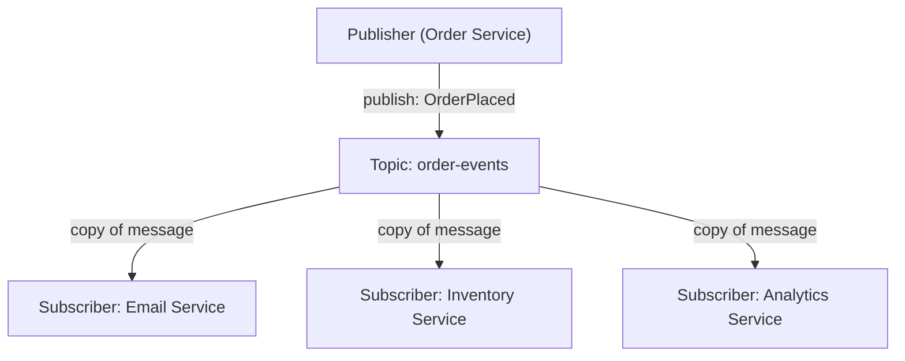
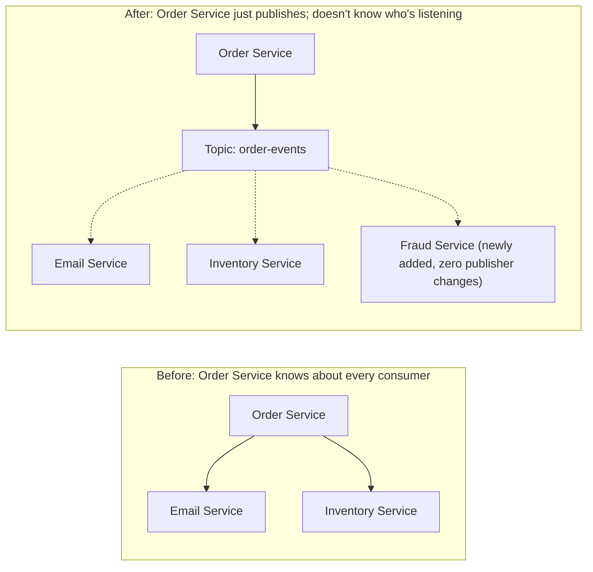

## Introduction

Chapter 30 covered message queues broadly. This chapter zooms in on a specific, foundational messaging pattern that underlies much of event-driven architecture (Chapter 32): **publish-subscribe (pub-sub)**.

## The Core Pattern

In pub-sub, **publishers** send messages to a **topic** without knowing anything about who (if anyone) is listening. **Subscribers** register interest in a topic and receive every message published to it. This is a fundamental shift from point-to-point messaging (one producer, one consumer processes each message) to broadcast messaging (one producer, many independent consumers each receive a copy).

This directly maps onto Kafka's consumer group model from Chapter 30 — each independent consumer group effectively acts as a separate subscriber, receiving its own full copy of the topic's message stream.

## Point-to-Point vs Pub-Sub

| | Point-to-Point (Task Queue) | Pub-Sub |
|---|---|---|
| Message consumed by | Exactly one consumer (from a pool) | Every subscriber gets its own copy |
| Purpose | Distribute work among interchangeable workers | Broadcast an event/fact to multiple interested parties |
| Example | Processing a queue of image resize jobs | Notifying multiple services that "an order was placed" |

Both patterns can coexist: within a single pub-sub subscriber (like Kafka's "Analytics Service" consumer group above), multiple instances of that specific consumer can still divide the *that group's* copy of the work among themselves via point-to-point-style partitioning — the two patterns operate at different layers.

## Decoupling: The Core Benefit

The publisher in a pub-sub system has **zero knowledge** of its subscribers — it doesn't know how many exist, what they do with the message, or whether new ones might be added tomorrow. This is a powerful decoupling property:

- **Adding a new subscriber requires zero changes to the publisher.** If a new "Fraud Detection Service" needs to know about every order placed, it simply subscribes to the existing `order-events` topic — the Order Service (the publisher) never needs to be modified or even made aware.
- This directly enables the **choreography-based Saga pattern** from Chapter 20 — each service reacts independently to events it cares about, with no central point needing to know about every participant.

## Topic Design and Fan-Out

Designing topics well matters:

- **Granularity**: A single, broad `all-events` topic forces every subscriber to filter out messages they don't care about; overly narrow topics (a separate topic per specific event subtype) can fragment related events awkwardly. A common middle ground: topic per entity/domain (`order-events`, `user-events`), with an event `type` field within the message payload for subscribers to filter on.
- **Fan-out cost**: Every subscriber receives a full copy of every message on a topic it's subscribed to — a topic with many subscribers multiplies the actual data transfer/processing load by the number of subscribers, a real infrastructure cost to account for at scale.

## Real-World Pub-Sub Systems

- **Kafka**: As discussed, its consumer group model natively implements pub-sub semantics on top of its persistent log.
- **Google Cloud Pub/Sub, AWS SNS**: Purpose-built managed pub-sub services — AWS SNS is frequently paired with SQS in a "fan-out" pattern: SNS publishes once, and multiple SQS queues (each with their own consumer pool) subscribe, combining pub-sub's broadcast semantics with SQS's simple, managed point-to-point queue processing per subscriber.
- **Redis Pub/Sub**: A lightweight, in-memory pub-sub mechanism — notably, it does **not** persist messages; a subscriber that's offline when a message is published simply misses it entirely, unlike Kafka's persistent log. This makes Redis Pub/Sub suitable for ephemeral, real-time-only use cases (like the WebSocket connection routing described in Chapter 5) but unsuitable for anything requiring reliable delivery.

## Summary

- Pub-sub decouples publishers from an unknown, dynamic number of subscribers, each receiving their own copy of every published message.
- This contrasts with point-to-point/task-queue messaging, where each message is consumed by exactly one worker from a pool — the two patterns solve different problems and often coexist within the same system.
- The core benefit is zero-coupling extensibility: new subscribers can be added without any change to the publisher, directly enabling patterns like choreography-based Sagas.
- Topic granularity and fan-out cost are real design considerations; systems like Kafka, SNS+SQS, and Redis Pub/Sub offer different durability/delivery trade-offs for implementing the pattern.

---

## Interview Questions

### 1. What is the fundamental difference between point-to-point (task queue) messaging and pub-sub messaging?
**Answer:** In point-to-point messaging, each individual message is consumed and processed by exactly one consumer, typically drawn from a pool of interchangeable workers — the goal is distributing discrete units of work so each one is handled exactly once by whichever worker happens to be available. In pub-sub messaging, each message published to a topic is delivered to every subscriber independently — each subscriber receives its own full copy of the message, and the goal is broadcasting an event or fact to potentially many different, independent interested parties, each of which may do something entirely different with that same information.

**Follow-up:** *Can a single system use both patterns simultaneously, and if so, how?* — Yes, commonly — for example, in Kafka, pub-sub semantics operate at the level of independent consumer groups (each group gets its own full copy of the topic's messages, which is the pub-sub broadcast property), while *within* a single consumer group, the messages are still divided point-to-point-style across that group's multiple consumer instances (each specific message/partition is handled by only one consumer within that particular group) — the two patterns operate at different layers of the same system rather than being mutually exclusive alternatives.

### 2. Explain the core decoupling benefit of pub-sub architecture, using a concrete example of adding a new feature to an existing system.
**Answer:** In a pub-sub architecture, a publisher (e.g., an Order Service publishing "OrderPlaced" events) has no knowledge of, and no direct coupling to, its subscribers — it simply publishes to a topic and moves on, regardless of how many subscribers exist or what they do with the message. Concretely, if a business later wants to add a new "Fraud Detection Service" that needs to be notified of every order placed, this new service can simply subscribe to the existing `order-events` topic — the Order Service itself requires zero code changes, zero redeployment, and no awareness whatsoever that this new subscriber now exists, since it was never coupled to any specific, enumerated list of consumers in the first place.

**Follow-up:** *Contrast this with what would be required to add this same "Fraud Detection Service" if the Order Service instead made direct, synchronous API calls to each interested service.* — In a direct-call architecture, the Order Service's code would need to be explicitly modified to add a new synchronous (or even asynchronous) call to the new Fraud Detection Service's API, requiring a code change, testing, and redeployment of the Order Service itself — and this coupling would compound with each additional consumer added over time, eventually resulting in the Order Service needing direct knowledge of and calls to a large and growing list of dependent services, exactly the kind of tight coupling pub-sub architecture is specifically designed to avoid.

### 3. Why is Redis Pub/Sub's lack of message persistence a critical limitation for certain use cases, and what use cases is it still well-suited for despite this limitation?
**Answer:** Since Redis Pub/Sub doesn't persist published messages at all, a subscriber that's offline, disconnected, or simply not yet actively listening at the exact moment a message is published will permanently and silently miss that message — there's no way to later "catch up" or replay missed messages, unlike Kafka's persistent log, which retains messages for later consumption regardless of a consumer's connection timing. This makes Redis Pub/Sub fundamentally unsuitable for any use case requiring reliable, guaranteed delivery (e.g., ensuring an order confirmation event is never lost, even if the consuming service happens to be briefly restarting at the exact moment of publication). It remains well-suited for genuinely ephemeral, real-time-only use cases where missing an occasional message causes no lasting harm — such as the WebSocket connection routing use case discussed in Chapter 5, where a pub-sub message is used to route a real-time chat message to whichever specific server instance currently holds a particular user's live connection; if that specific routing message is missed due to a very brief timing issue, the practical consequence is simply a slightly delayed or occasionally dropped real-time update, not a permanently lost, business-critical fact.

**Follow-up:** *Why might Redis Pub/Sub still be chosen over Kafka for this WebSocket-routing use case, despite Kafka's stronger delivery guarantees?* — Redis Pub/Sub is significantly simpler and lower-latency for this specific kind of lightweight, high-frequency, ephemeral coordination messaging — introducing Kafka's more heavyweight infrastructure (partitions, consumer groups, persistent log management) for what is fundamentally a transient, real-time-only signaling need (rather than a durable business event needing reliable processing/replay) would be a form of over-engineering, similar to the Kafka-for-simple-task-queue example discussed in Chapter 30 — the specific requirements of this use case (low latency, ephemeral by nature, tolerant of rare missed messages) align well with what Redis Pub/Sub's simpler, lighter-weight design provides.

### 4. What is the "fan-out cost" of a pub-sub topic, and why does it matter for capacity planning as a topic gains more subscribers?
**Answer:** Fan-out cost refers to the fact that every subscriber to a pub-sub topic receives its own independent, full copy of every message published to that topic — this means the total data transfer and processing load generated by a single published message scales directly (multiplicatively) with the number of subscribers: a topic with 10 subscribers, each processing every message, generates roughly 10x the total downstream data transfer and processing work compared to that same topic with just 1 subscriber, even though the publisher itself only published the message once. This matters for capacity planning because a system design that reasonably estimated capacity needs based on a topic having just a few initial subscribers could face a significant, multiplicative infrastructure cost/load increase if the number of subscribers to that same topic grows substantially over time (e.g., as more and more services are added as new "listeners" to important business events), a cost that isn't necessarily obvious or intuitive if you're only thinking about the publisher's own, comparatively modest publishing load.

**Follow-up:** *Does this fan-out cost argue against liberally adding new subscribers to widely-used topics, given the multiplicative infrastructure cost?* — Not necessarily against adding new subscribers when they provide genuine business value (that's precisely the core benefit of pub-sub's decoupled extensibility) — but it does argue for being deliberately aware of and monitoring this multiplicative cost as a real, non-free consequence of the pattern, rather than assuming that pub-sub's ease of adding new subscribers means doing so is entirely free from an infrastructure capacity perspective — the architectural flexibility benefit is real and valuable, but it should be weighed with genuine awareness of its actual infrastructure cost implications as subscriber count grows, not treated as an unconditionally cost-free operation.

### 5. Why might a system use the SNS + SQS "fan-out" pattern (AWS) rather than having each subscriber directly and independently subscribe to a raw pub-sub topic?
**Answer:** In this pattern, a publisher sends a message once to an SNS topic (providing the pub-sub broadcast semantics — SNS delivers a copy to every subscribed queue), and each *individual* subscriber is actually an SQS queue (rather than a live, currently-connected subscriber process) — this combines pub-sub's broadcast/decoupling benefit with SQS's specific strengths: durable message persistence and buffering (an SQS queue holds its copy of the message reliably until its own specific consumer processes it, even if that particular consumer is temporarily down or slow, unlike a live pub-sub subscriber that might need to be actively connected at publish time to receive certain implementations of pub-sub), managed retry/visibility-timeout handling per subscriber, and the ability for each individual subscriber's own consumer pool to independently scale and process its queue's messages at its own pace, fully decoupled from how quickly other subscribers process their own respective copies.

**Follow-up:** *How does this pattern's reliability compare to using Redis Pub/Sub directly for the same fan-out scenario?* — Significantly more reliable — since each subscriber in the SNS+SQS pattern has its own durable, persistent SQS queue holding its copy of the message until that specific subscriber's consumer successfully processes and deletes it, a temporarily offline or slow subscriber simply has messages accumulate safely in its own dedicated queue rather than permanently missing them, directly avoiding the exact "silently lost if not actively listening" limitation discussed earlier regarding Redis Pub/Sub's lack of persistence — this makes the SNS+SQS pattern well-suited for reliable, business-critical event distribution to multiple independent subscribers, unlike Redis Pub/Sub's better fit for ephemeral, loss-tolerant real-time signaling.

### 6. In an interview, how would you decide on appropriate topic granularity (e.g., one broad `all-events` topic versus many narrow, specific event-type topics) for a new event-driven system?
**Answer:** You'd weigh the trade-offs on both extremes: an overly broad, single topic containing every kind of event forces every subscriber to receive and then locally filter out the (likely large majority of) messages they don't actually care about, wasting bandwidth/processing on irrelevant messages and potentially complicating subscriber-side filtering logic; overly narrow, granular topics (a separate topic per very specific event subtype) can fragment genuinely related events awkwardly across many different topics, complicating scenarios where a subscriber legitimately needs to process several related event types together in their original relative order (which, as discussed in Chapter 30, Kafka only guarantees within a single partition/topic, not across separate topics). A common, reasonable middle-ground approach organizes topics around a meaningful business domain or entity (e.g., a single `order-events` topic covering all order-lifecycle events — created, paid, shipped, canceled), with an explicit `event_type` field within each message's payload that subscribers can use to filter for the specific sub-types of events they actually care about, balancing meaningful topic-level organization against avoiding excessive fragmentation of genuinely related events.

**Follow-up:** *What signal might indicate that a currently-broad topic should be split into more granular topics as a system evolves?* — If it becomes clear that most subscribers to a broad topic are each only interested in a small, consistent subset of the event types published there (and are doing significant, ongoing filtering work to discard the majority of irrelevant messages), or if the *volume* of one specific event type within that broad topic grows so large that it starts to dominate and effectively "drown out" other, comparatively rarer event types for subscribers who only care about those rarer types — either of these signals would suggest that splitting the overly-broad topic into more purpose-specific, narrower topics could better serve the system's actual, evolved subscriber needs and reduce unnecessary fan-out/filtering overhead.

### 7. Why does pub-sub architecture make choreography-based Sagas (Chapter 20) more naturally implementable than orchestration-based Sagas?
**Answer:** Choreography-based Sagas rely on each service independently listening for and reacting to relevant events, without any central coordinator directing the overall workflow — this maps directly and naturally onto pub-sub's core pattern: each service participating in the Saga simply subscribes to the specific events it cares about (e.g., the Inventory Service subscribes to "OrderCreated" events, and itself publishes "InventoryReserved" events that the Payment Service, in turn, subscribes to) — pub-sub's inherent decoupling (publishers not needing to know their subscribers) is exactly the property that allows this fully decentralized, event-reactive coordination style to work without requiring any single component to have complete, centralized knowledge of the entire multi-step workflow, which is precisely what distinguishes choreography from the more centrally-coordinated orchestration approach.

**Follow-up:** *Does this mean orchestration-based Sagas cannot use pub-sub/messaging at all, and must rely purely on direct, synchronous calls?* — No — an orchestration-based Saga can still use asynchronous messaging (including pub-sub or simple point-to-point queues) for the actual communication between the orchestrator and each participating service, but the key architectural difference is that the *orchestrator itself* still maintains centralized knowledge of and explicit control over the overall workflow's sequence and state (issuing specific commands to specific services and explicitly handling their responses/failures), rather than services purely reacting independently to broadcast events with no central coordinating component — the underlying transport (pub-sub vs. direct calls) is somewhat orthogonal to this more fundamental choreography-vs-orchestration architectural distinction discussed in Chapter 20.

### 8. A candidate designs a pub-sub system where a critical downstream service (e.g., a billing service) subscribes directly to a high-volume "user-activity" topic that includes many types of events the billing service doesn't actually need. What potential problems should you flag?
**Answer:** You'd flag the fan-out cost concern discussed earlier — the billing service would be receiving and needing to process (at least enough to filter/discard) potentially a very large volume of irrelevant messages, consuming unnecessary compute/network resources and potentially adding unnecessary processing latency or backpressure risk to a service (billing) that's likely business-critical and should ideally be insulated from unrelated, high-volume, unrelated traffic spikes elsewhere in the system (e.g., a completely unrelated surge in some other type of "user-activity" event, like page-view tracking, could inadvertently create backpressure or resource contention affecting the billing service's ability to promptly process the specific, comparatively rare events it actually cares about). You'd suggest either introducing a more specific, dedicated topic containing only the events genuinely relevant to billing (better topic granularity, as discussed above), or, at minimum, ensuring the billing service's subscription/consumption infrastructure is robustly isolated (e.g., its own dedicated consumer group/infrastructure) from the potentially much higher and more variable volume of the broader activity topic, so that unrelated traffic spikes elsewhere don't risk degrading this critical service's specific processing needs.

**Follow-up:** *Why might this concern be especially important for a "critical" service like billing, compared to a less critical, best-effort service like a general analytics/logging consumer?* — A critical service like billing likely has strict correctness and timeliness requirements (e.g., ensuring charges are processed promptly and accurately) where any degradation, delay, or resource contention caused by unrelated high-volume traffic could have direct, tangible negative business consequences (delayed or missed billing events); a best-effort analytics/logging consumer, by contrast, can typically tolerate occasional delays, backpressure, or even the rare dropped message with comparatively minor consequences — this differing tolerance for degradation directly justifies applying more careful isolation and topic-design consideration specifically to the more critical, less fault-tolerant service, even if it means slightly more topic-design complexity compared to simply subscribing everyone to one broad, convenient topic.

### 9. Why is understanding the distinction between "at-least-once delivery" (Chapter 30) and pub-sub's "broadcast to every subscriber" property important when reasoning about a subscriber that's temporarily offline?
**Answer:** These are two related but distinct concerns that are easy to conflate: "at-least-once delivery" specifically concerns whether a *given individual subscriber* will eventually, reliably receive a *specific* message it's entitled to (even if it requires redelivery due to a processing failure or timeout) — this depends on whether the underlying pub-sub implementation *persists* messages for that subscriber (as Kafka does, or as the SNS+SQS pattern does via each subscriber's own durable queue) versus not (as plain Redis Pub/Sub does not). The "broadcast to every subscriber" property is a separate architectural characteristic describing that *multiple different* subscribers each receive their own independent copy — but this broadcast property alone says nothing about whether any *specific one* of those subscribers is guaranteed to actually, reliably receive and successfully process its own copy if it happens to be temporarily offline or slow — a system could correctly implement true multi-subscriber broadcast semantics while still providing zero delivery guarantee to a subscriber that isn't actively listening at the moment of publication (exactly Redis Pub/Sub's behavior), meaning "pub-sub" and "reliable/at-least-once delivery" are genuinely orthogonal properties that must each be independently verified for a specific pub-sub implementation, not properties that automatically or necessarily come bundled together.

**Follow-up:** *Which specific technologies discussed in this chapter and Chapter 30 provide both true multi-subscriber pub-sub broadcast AND reliable, at-least-once delivery to each individual subscriber, even if temporarily offline?* — Kafka (each independent consumer group gets its own persisted, replayable copy of the topic's history, so a temporarily offline consumer group simply resumes from its last committed offset once it reconnects, without missing anything) and the AWS SNS+SQS fan-out pattern (each subscriber's dedicated SQS queue durably holds its copy of the message until that specific subscriber successfully processes and deletes it) both provide this combination — in contrast to plain Redis Pub/Sub, which provides the multi-subscriber broadcast property but explicitly does NOT provide reliable delivery to an offline subscriber, illustrating that these two properties, while often desired together, are architecturally distinct and must be evaluated separately for any specific messaging technology under consideration.

### 10. In a system design interview, how would you respond if asked "why not just have every service call every other interested service directly via REST, instead of introducing the complexity of a pub-sub messaging system"?
**Answer:** You'd acknowledge that for a very small number of services with a stable, well-known, rarely-changing set of interested consumers, direct REST calls can indeed be simpler to reason about and avoid introducing additional messaging infrastructure — but you'd explain that this approach doesn't scale well architecturally as the number of services and inter-service event-driven relationships grows: every time a new service needs to be notified of an existing event, the *publishing* service itself must be modified to add a new direct call, creating tight coupling and requiring coordinated changes/redeployment across services that should ideally be able to evolve independently (a core motivation for microservices architecture generally, discussed in Chapter 34) — and if a downstream service is temporarily unavailable, a direct synchronous call either blocks/fails immediately (unlike a message that can safely queue and be reliably delivered once the consumer recovers) or requires the publishing service to implement its own bespoke retry/resilience logic, reinventing (likely less robustly) what a proper messaging system already provides as a well-tested, reusable capability. Pub-sub trades some upfront infrastructure complexity for significantly better long-term decoupling, extensibility, and resilience as a system's number of services and inter-service event relationships grow over time.

**Follow-up:** *Is there a reasonable middle-ground answer, rather than an absolute "always use pub-sub" or "always use direct calls"?* — Yes — a nuanced answer would note that the right choice genuinely depends on the specific relationship between two services: for tightly-coupled, synchronous request-response needs where the caller genuinely needs an immediate result to proceed (e.g., "look up this specific product's current price before displaying the page"), a direct API call remains the appropriate, simpler choice; for looser, asynchronous "notify interested parties that something happened" relationships (e.g., "an order was placed," which many different, evolving services might want to react to over time), pub-sub's decoupling benefits become increasingly valuable — most real, larger systems reasonably use both patterns for different specific relationships within the same overall architecture, rather than dogmatically committing to just one communication style for every single inter-service interaction.
