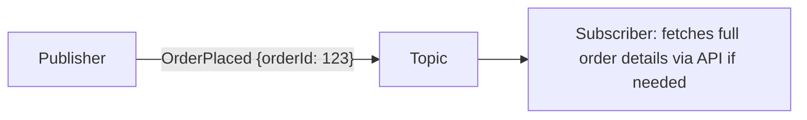
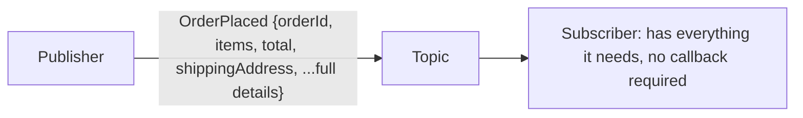

## Introduction

Chapters 30 and 31 covered the mechanics of message queues and pub-sub. This chapter zooms out to the architectural philosophy that uses them as a foundation: **Event-Driven Architecture (EDA)** — designing a system around events (things that happened) as the primary way services communicate and react to each other, rather than direct, synchronous request-response calls.

## What Counts as an "Event"?

An event is an immutable record that **something happened** — `OrderPlaced`, `PaymentProcessed`, `UserRegistered`. Critically, an event describes a fact about the past, not a command about what should happen next (that distinction matters — see "Events vs Commands" below).

```json
{
  "eventType": "OrderPlaced",
  "eventId": "evt_8f3a2b1c",
  "timestamp": "2026-09-15T10:30:00Z",
  "payload": {
    "orderId": "order_123",
    "userId": "user_456",
    "totalAmount": 99.99
  }
}
```

## Events vs Commands

This distinction is a common source of confusion:

| | Event | Command |
|---|---|---|
| Meaning | "This already happened" (past tense) | "Please do this" (imperative) |
| Naming convention | `OrderPlaced`, `PaymentFailed` | `PlaceOrder`, `ChargePayment` |
| Sender's expectation | None — sender doesn't know or care who reacts | Sender expects the specific recipient to act |
| Coupling | Loose — any number of subscribers can react | Tighter — typically directed at a specific, known recipient |

A system can use both: a command (`PlaceOrder`) triggers processing that, upon success, publishes an event (`OrderPlaced`) that other, unrelated services can react to — commands express intent to one recipient; events broadcast facts to anyone interested.

## Core EDA Patterns

### Event Notification

A lightweight event containing minimal information (often just an ID), prompting interested services to query for full details if needed.



**Trade-off**: Keeps events small and reduces the risk of leaking data subscribers don't need, but requires an extra synchronous call back to the source service for details — reintroducing some coupling and a potential availability dependency.

### Event-Carried State Transfer

The event itself contains all the data a subscriber would need, avoiding any callback to the publisher.



**Trade-off**: Removes the runtime coupling/dependency of calling back the publisher (better decoupling and availability), but larger event payloads, and subscribers may hold on to a "copy" of data that drifts from the source of truth if not carefully managed (a form of purposeful, accepted denormalization).

### Event Sourcing (Preview — Full Treatment in Chapter 38)

Rather than storing just the current state, store the full sequence of events that led to it, deriving current state by replaying them. Briefly previewed here since it's a natural extension of thinking in events; Chapter 38 covers it in depth.

## Benefits of Event-Driven Architecture

- **Loose coupling**: As established in Chapter 31, publishers don't need to know their consumers — services can be added, removed, or evolved independently.
- **Scalability**: Asynchronous processing means services aren't blocked waiting on each other, and each can scale independently based on its own load.
- **Resilience**: A temporarily unavailable consumer doesn't block the producer — messages queue up and are processed once the consumer recovers (Chapter 30).
- **Auditability**: A stream of events naturally forms an audit trail of everything that happened in the system over time.
- **Natural fit for the Saga pattern**: As covered in Chapter 20, choreography-based Sagas are essentially event-driven architecture applied to distributed transactions.

## Costs and Challenges

- **Harder to trace/debug**: A request's effects can ripple through many independently-reacting services, making it harder to answer "what happened, in what order, and why?" without strong distributed tracing (Chapter 42).
- **Eventual consistency by default**: Since processing is asynchronous, there's an inherent delay between an event being published and all interested subscribers having processed it — directly connecting to the consistency model discussions of Chapters 18-19.
- **Schema evolution**: As a system grows, event schemas change — old consumers must handle new event versions gracefully (or publishers must maintain backward compatibility), a genuine ongoing engineering discipline requirement.
- **Duplicate/out-of-order events**: As covered in Chapters 28-30, consumers must be designed for idempotency and, where ordering matters, must rely on appropriate partitioning (Chapter 30) or causal consistency techniques (Chapter 19).

## When NOT to Use Event-Driven Architecture

Not every interaction should be an event. If Service A genuinely needs an immediate answer from Service B to proceed (e.g., "is this payment method valid before I show the checkout confirmation button?"), a direct, synchronous call is simpler and more appropriate than fire-and-forget events — EDA is best suited to *reactions to facts*, not scenarios requiring an immediate, blocking answer to continue.

## Summary

- Event-driven architecture structures a system around the production and reaction to events — immutable records of things that already happened — rather than direct request-response calls.
- Events (broadcast facts) differ meaningfully from commands (directed intent) — many real systems use both.
- Event notification (small events, requiring callback for details) and event-carried state transfer (self-contained events) represent a trade-off between payload size/data duplication and reduced runtime coupling.
- EDA provides loose coupling, scalability, resilience, and natural auditability, at the cost of harder debugging, inherent eventual consistency, and the ongoing discipline required for schema evolution and idempotent, order-aware consumers.
- Not every interaction should be event-driven — genuine synchronous, blocking needs are still better served by direct calls.

---

## Interview Questions

### 1. What is the fundamental distinction between an "event" and a "command," and why does this distinction matter architecturally?
**Answer:** An event describes a fact about something that has already happened (typically named in the past tense, like `OrderPlaced`), published without the sender knowing or caring who, if anyone, reacts to it. A command expresses an imperative directive to a specific, known recipient to perform an action (typically named in the imperative, like `PlaceOrder`), with the sender generally expecting that specific recipient to act on it. This distinction matters architecturally because it reflects fundamentally different coupling relationships: commands are inherently more tightly coupled (directed at a specific recipient, with an expectation of action), while events are inherently loosely coupled (broadcast facts that any number of unknown, evolving subscribers can independently choose to react to or ignore) — conflating the two (e.g., naming something as an "event" but actually expecting a specific recipient to take a specific required action) can lead to confused, unclear architectural intent and unexpected coupling.

**Follow-up:** *Can a single business operation reasonably involve both a command and an event? Give an example.* — Yes, commonly — a client might send a `PlaceOrder` command directly to the Order Service (a directed request expecting that specific service to act), and upon successfully processing that command, the Order Service might then publish an `OrderPlaced` event to a shared topic (a broadcast fact that other, unrelated services — like Inventory, Email, Analytics — can independently choose to react to) — the command represents the direct, intentional trigger for the specific primary action, while the resulting event represents the broadcastable fact of that action having successfully occurred, enabling further, decoupled downstream reactions.

### 2. Compare "event notification" and "event-carried state transfer," and explain the specific trade-off between them.
**Answer:** Event notification publishes a minimal event (often just an identifier and event type) and expects interested subscribers to make a separate, subsequent call back to the originating service (or a shared data store) if they need the full details — this keeps events small and centralizes the canonical, always-up-to-date source of truth in one place, but reintroduces a runtime dependency/coupling (the subscriber now depends on the publisher's API being available and responsive at the time it needs those details) and an additional network round trip. Event-carried state transfer instead includes all the data a subscriber might plausibly need directly within the event payload itself, eliminating any callback dependency (subscribers are fully self-sufficient once they receive the event) and improving decoupling/availability (a subscriber can process the event even if the original publisher is currently down), but at the cost of larger event payloads and the subscriber now holding its own potentially-duplicated copy of data that could, in principle, drift out of sync from the actual current source of truth if the underlying entity is updated again after the event was published.

**Follow-up:** *For a use case where the underlying entity (e.g., a user's shipping address) is updated frequently after the initial event, which approach would you lean toward, and why?* — For frequently-changing underlying data, event notification (requiring a fresh callback for current details) might actually be preferable despite its added coupling, since event-carried state transfer would risk subscribers acting on a snapshot of data that's likely to have already become stale by the time they process it — if a subscriber genuinely needs the *current, latest* state of frequently-changing data (rather than specifically needing "the state exactly as it was at the moment this specific event occurred"), fetching it fresh via a callback avoids acting on data that may already be outdated, even though this reintroduces the coupling/availability trade-off discussed above — this is a genuine judgment call depending on whether the subscriber's need is for "state as of this event" or "current state," which differs by use case.

### 3. Why does event-driven architecture inherently introduce eventual consistency, even if every individual event is delivered reliably and quickly?
**Answer:** Because processing in an event-driven system is fundamentally asynchronous — a publisher publishes an event and immediately moves on without waiting for any subscriber to actually process it, meaning there's an inherent, unavoidable time gap between when an event is published and when each individual subscriber has actually received, processed, and reflected its effects in their own respective systems/state; during this gap (however brief under normal healthy operation), different parts of the overall system genuinely, legitimately hold different views of the world (some have already processed the event and updated accordingly, others haven't yet) — this is precisely the definition of eventual consistency (Chapter 19) applied at the level of an entire event-driven system's overall state, not a flaw or failure mode, but an inherent, structural consequence of choosing asynchronous, decoupled processing over synchronous, blocking calls that would force immediate, universal consistency at the cost of the availability/scalability/decoupling benefits EDA specifically provides.

**Follow-up:** *Does this mean event-driven architecture is fundamentally incompatible with any use case requiring strong consistency?* — Not entirely — as discussed throughout Chapters 17-19, a single overall system can (and often should) apply differentiated consistency requirements to different specific operations; a system can be predominantly event-driven for the many operations well-suited to eventual consistency and loose coupling, while still using direct, synchronous calls (and potentially even strongly-consistent, ACID-backed operations) for the specific subset of operations genuinely requiring immediate, strong consistency (e.g., checking real-time payment authorization before allowing a checkout to proceed) — EDA as a general architectural philosophy doesn't preclude selectively using stronger-consistency mechanisms for the specific operations that genuinely warrant them.

### 4. Why is debugging and tracing a specific business transaction often significantly harder in an event-driven architecture compared to a traditional, synchronous request-response system?
**Answer:** In a synchronous system, a single request's entire processing path is typically visible within one continuous call stack/trace, since each step directly calls the next and waits for its response, making the sequence of what happened relatively straightforward to follow linearly. In an event-driven system, a single triggering action might cause an event to be published, which independent, decoupled subscribers then react to *asynchronously* and at their own pace, potentially triggering further events that yet other independent services react to in turn — the resulting "story" of what actually happened for a specific business transaction can span many different services' logs, executed at different times, with no single, continuous call stack tying them all directly together, making it inherently harder to reconstruct the full, correct sequence of cause-and-effect without deliberate additional tooling.

**Follow-up:** *What specific tool or technique, previewed in this chapter and detailed later in this series, directly addresses this debugging challenge?* — Distributed tracing (Chapter 42), which specifically involves propagating a shared trace ID (and correlated span IDs for each individual processing step) across all the services and asynchronous message-passing steps involved in a single logical transaction, allowing all these separately-executed, independently-timed processing steps across different services to later be correlated and reconstructed into a single, coherent, traceable end-to-end view of what actually happened — directly addressing the debugging complexity that event-driven architecture's inherent decoupling and asynchrony otherwise introduces.

### 5. Explain why "schema evolution" is a genuine, ongoing engineering discipline requirement in event-driven architecture, using a concrete example of what could go wrong without it.
**Answer:** As a system evolves over time, the structure/schema of events published to a topic will likely need to change (adding new fields, potentially removing or renaming old ones) — but since events are consumed asynchronously by potentially many different, independently-deployed subscriber services (each possibly deployed and updated on its own separate schedule), a publisher cannot simply assume all its subscribers have been updated to expect a new event schema at the exact moment it starts publishing that new schema. Concretely, if a publisher renames a field from `total` to `totalAmount` without any backward-compatibility consideration, any subscriber still expecting the old `total` field name (perhaps because it hasn't yet been redeployed with corresponding updated parsing logic) would either fail to parse the event correctly, silently receive a null/missing value where it expected `total`, or crash outright — a real, production-impacting failure caused specifically by not managing the schema change with appropriate backward-compatibility discipline (e.g., adding the new field while temporarily still also including the old one, or using a schema versioning/registry system that allows for graceful, staged evolution).

**Follow-up:** *What's a common practical technique for managing this kind of schema evolution challenge in a real production event-driven system?* — Using a schema registry (like Confluent Schema Registry, commonly paired with Kafka) that enforces schema compatibility rules (e.g., only allowing backward-compatible changes like adding new optional fields, while rejecting breaking changes like removing or renaming required fields without an explicit, coordinated migration process) — combined with a general team discipline/convention of always adding new fields as optional with sensible defaults (directly echoing the API versioning/extensibility discussion from Chapter 6) rather than modifying or removing existing fields that other, potentially-not-yet-updated subscribers may still depend on.

### 6. A candidate proposes making literally every single inter-service interaction in their system event-driven, arguing "it's the most scalable and decoupled approach." What scenario would you present to challenge this blanket approach?
**Answer:** You might present a checkout flow scenario: "A user is on a checkout page and needs to know, right now, before they can even see the 'Complete Purchase' button, whether their entered credit card is valid and has sufficient funds" — this is a case where the calling service (the checkout page/backend) genuinely cannot proceed or render a meaningful next step without an immediate, synchronous answer; if this were implemented as "fire an event, and asynchronously wait for a response event at some indeterminate point later," the user would be left staring at a loading spinner with no reasonable, bounded expectation of when (or even whether) they'll get a response, which is a poor fit for what is fundamentally a synchronous, blocking, need-an-immediate-answer-to-proceed interaction — challenging the candidate to recognize that event-driven architecture is not a universally superior approach that should replace every single interaction, but rather a pattern specifically well-suited to *asynchronous reactions to facts*, not synchronous requests genuinely requiring an immediate answer to make forward progress.

**Follow-up:** *If the candidate then proposes "I'll still use events, but the checkout page will just poll for the response event," how would you respond?* — You'd point out that polling-for-an-event-driven-response is generally a strictly worse experience and implementation than simply making a direct, synchronous call in the first place for this specific type of interaction — polling introduces its own added complexity (managing poll intervals, handling the "not yet ready" state, potential wasted requests) and typically results in *worse*, not better, actual latency compared to a direct call that returns the answer as soon as it's available, without needing repeated, wasteful polling round trips — this is a case where recognizing "this specific interaction is fundamentally synchronous in nature" and simply using a direct, synchronous call is the more honest, appropriate, and ultimately simpler and better-performing architectural choice, rather than forcing an asynchronous, event-driven pattern onto a fundamentally synchronous need.

### 7. Why might "event notification" (rather than "event-carried state transfer") be specifically preferred for events containing sensitive data, even though it introduces additional coupling?
**Answer:** With event-carried state transfer, the full details (potentially including sensitive information like a user's full payment details, home address, or other PII) are embedded directly within the event and broadcast to every subscriber of that topic — this means every current and future subscriber automatically receives this potentially sensitive data, regardless of whether they actually need it, creating a broader surface area for potential data exposure/leakage (a subscriber added later for an entirely unrelated purpose might now also have access to sensitive data it has no genuine need for, simply because it's included in every event on that topic) — with event notification, only the minimal necessary identifying information is broadcast, and any subscriber that genuinely needs the full sensitive details must make an explicit, individually-authorized callback to retrieve them, allowing the source system to apply proper, granular access control/authorization checks at the point of that specific callback request, rather than having sensitive data broadly and automatically distributed to every topic subscriber by default.

**Follow-up:** *Does this mean event-carried state transfer should never be used for any data with even mild sensitivity?* — Not necessarily an absolute rule — the right choice depends on weighing the specific sensitivity of the data involved against the operational/availability benefits of avoiding the callback coupling; for data with genuinely significant sensitivity (financial details, health information, government IDs), the access-control benefits of event notification's callback-based approach are usually compelling enough to justify the added coupling — for less sensitive data where the primary concern is just avoiding unnecessary payload bloat/duplication rather than genuine access-control risk, event-carried state transfer's decoupling benefits might still reasonably win out; this is a genuine, case-by-case security/architecture trade-off rather than a strict universal rule in either direction.

### 8. Why does event-driven architecture naturally support strong system auditability, and what's a limitation of relying solely on this natural byproduct rather than deliberately designing for audit requirements?
**Answer:** Since an event-driven system is fundamentally built around a continuous stream of immutable events, each representing a specific fact about something that happened at a specific point in time, this event stream naturally forms a chronological record of significant business occurrences across the system — providing much of the raw material needed for an audit trail (what happened, when, and often by whom/what triggered it) essentially "for free," as a natural byproduct of the architecture's core design, rather than requiring dedicated, separate audit-logging infrastructure to be built and maintained independently. The limitation is that this natural byproduct isn't automatically a *complete or properly governed* audit system on its own — genuine audit requirements often need specific additional considerations the raw event stream alone doesn't automatically provide: guaranteed long-term retention (Kafka's configurable retention might default to a much shorter window than genuine compliance/audit requirements demand), tamper-evidence/immutability guarantees beyond just "the log wasn't explicitly designed to be edited," and often specific, queryable audit-report formatting/access-control requirements that a raw technical event stream isn't necessarily structured or governed to directly satisfy without additional, deliberate audit-specific engineering effort layered on top.

**Follow-up:** *What might this deliberate additional audit-specific engineering effort concretely involve?* — This might involve deliberately configuring specific, audit-relevant topics with much longer (or indefinite) retention specifically for compliance purposes (distinct from the shorter, operational-purpose retention used for other topics), potentially archiving events to a separate, purpose-built long-term audit storage system (e.g., object storage, Chapter 21, specifically configured for immutability/tamper-evidence), and building dedicated audit-reporting/query tooling on top of this data specifically designed to satisfy actual compliance/audit requirements and access-control needs — treating "audit trail" as a genuine, deliberate requirement to be explicitly engineered for, rather than simply assuming the general event stream automatically and sufficiently satisfies whatever specific audit requirements the business or regulatory environment actually demands.

### 9. In a system design interview, if asked to design a ride-sharing platform's core architecture (previewing Chapter 55), how would you justify which specific interactions should be event-driven versus direct/synchronous?
**Answer:** You'd identify interactions requiring an immediate, blocking answer to proceed as good candidates for direct/synchronous calls — e.g., "check if this specific driver is currently available and accept this ride request" likely needs a fairly immediate response for the rider's app to show appropriate real-time feedback. You'd identify interactions that are fundamentally about broadcasting a fact for various other, decoupled parts of the system to independently react to as good candidates for event-driven handling — e.g., a `RideCompleted` event could be published once, and independently trigger: the billing service calculating and charging the fare, the analytics service recording trip data, a driver-rating-prompt service scheduling a rating request, and a loyalty-points service crediting the rider — none of these downstream reactions need to block the core "ride completed" flow itself from concluding promptly, and each represents a genuinely decoupled, independently-evolving concern well-suited to asynchronous, event-driven processing rather than the core ride-completion flow needing direct, synchronous knowledge of and calls to every one of these various downstream concerns.

**Follow-up:** *Where would you place the real-time, continuous driver-location-update stream to the rider's app during an active ride — synchronous, or event-driven?* — This is a good candidate for event-driven, real-time messaging specifically via a mechanism like WebSockets combined with pub-sub (as discussed in Chapters 5 and 31) — the driver's app continuously publishes location-update events, and the rider's app (as a subscriber) receives and reacts to these events to update the map display in real time; this isn't a "request-response, need an immediate single answer" interaction, but rather an ongoing, continuous stream of "here's a new fact: the driver is now at this location" events, exactly the kind of ongoing, broadcast-style, asynchronous reaction pattern event-driven architecture (in this specific real-time-messaging form) is well-suited for, rather than the rider's app needing to repeatedly make direct, synchronous polling calls asking "where is the driver right now?" on a tight loop.

### 10. Why might a team migrating from a monolithic architecture (Chapter 34) to microservices deliberately introduce event-driven architecture as part of that migration, rather than simply replacing direct in-process function calls with direct synchronous network calls between the newly-separated services?
**Answer:** Replacing in-process function calls with direct synchronous network calls between newly-separated services (sometimes called a "distributed monolith" anti-pattern) preserves the exact same tight coupling that existed in the original monolith — services still directly depend on and must synchronously wait for each other, still require coordinated deployment/awareness of each other's specific APIs and availability, and still suffer from cascading failures (if one service is down, every service that directly, synchronously calls it also fails) — largely negating many of the key benefits (independent deployability, fault isolation, scalability) that motivated the migration to microservices in the first place, while now also adding network latency/unreliability on top of the same tight coupling. Deliberately introducing event-driven architecture for the interactions that are genuinely well-suited to it (facts that other services should independently react to, rather than synchronous requests needing immediate answers) allows the migration to actually achieve the loose coupling, independent scalability, and resilience benefits that are core motivations for adopting microservices in the first place, rather than ending up with a more complex, network-distributed version of the same tightly-coupled architecture the migration was meant to improve upon.

**Follow-up:** *Does this mean every single service-to-service interaction identified during a monolith-to-microservices migration should be converted to event-driven communication?* — No — as emphasized throughout this chapter, genuinely synchronous, immediate-answer-required interactions should remain direct/synchronous calls even after the migration (now over the network rather than in-process) — the key architectural judgment during a migration is correctly identifying *which specific* interactions are fundamentally synchronous request-response in nature (and should become direct network calls, ideally still designed thoughtfully to minimize unnecessary tight coupling/cascading-failure risk even as direct calls) versus which are fundamentally asynchronous "react to this fact" interactions (which are strong candidates for event-driven conversion) — a blanket, one-size-fits-all conversion of every interaction to either pure synchronous calls or pure event-driven messaging would each represent the kind of oversimplified, context-blind approach this chapter has argued against throughout its interview questions.
