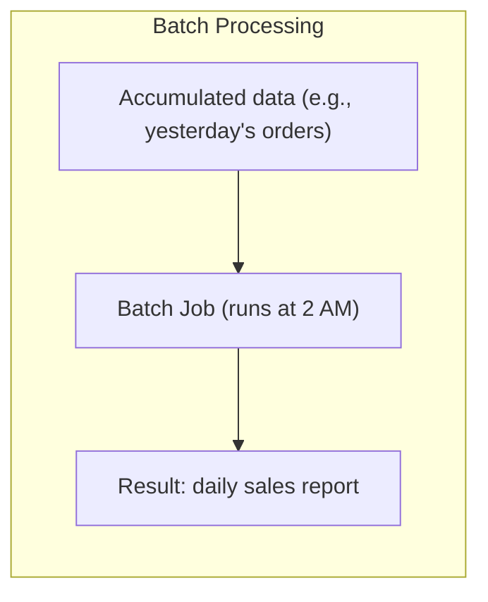
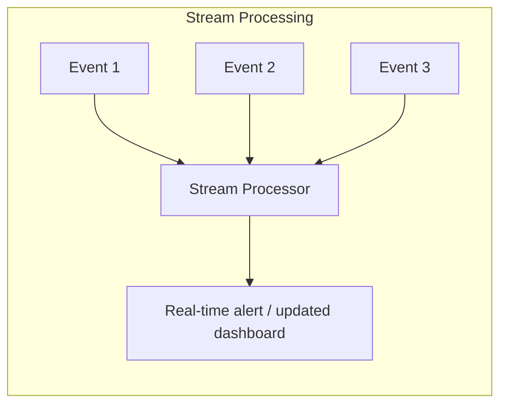
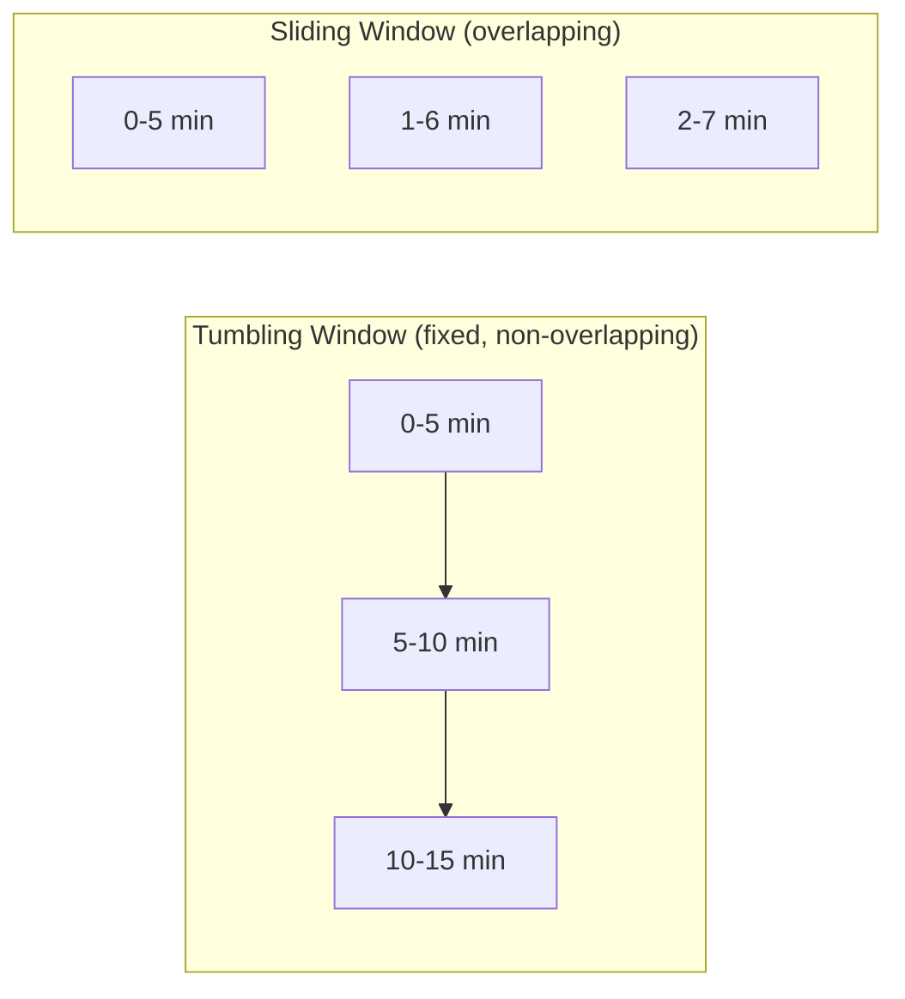
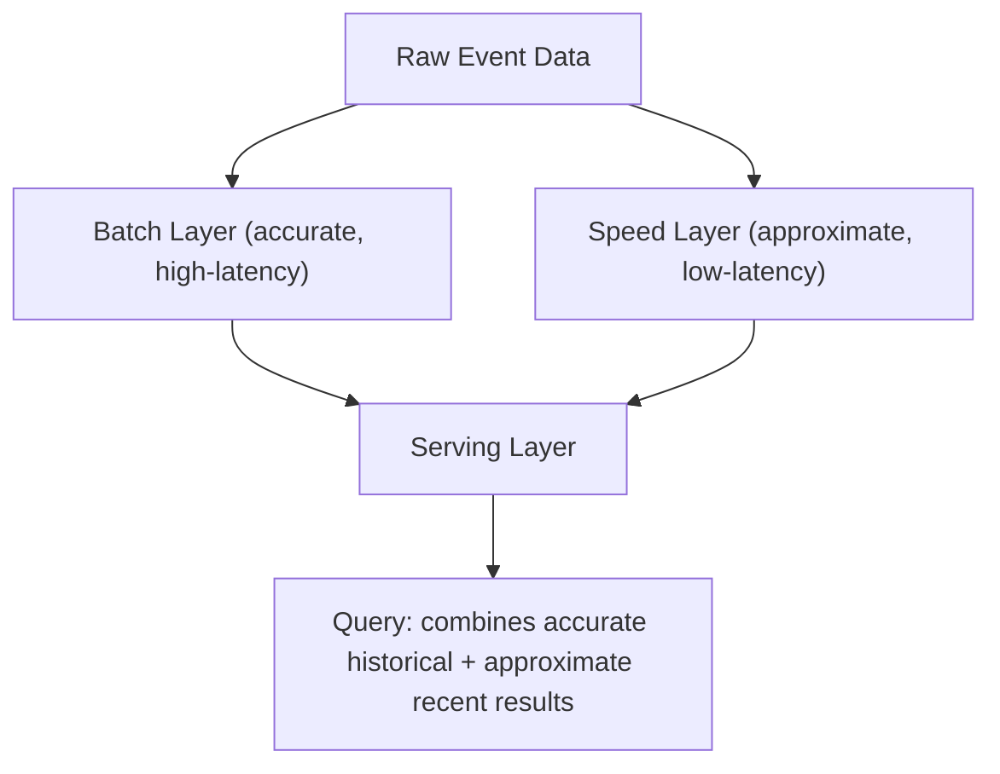
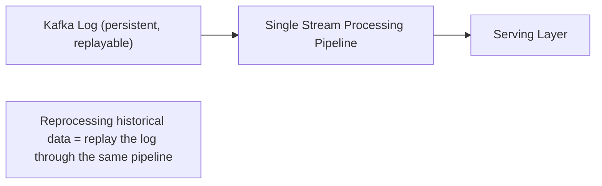

## Introduction

This chapter closes Part 5 by addressing a question that spans everything covered so far: once data exists (whether sitting in a database or flowing through a Kafka topic), how do you actually process large volumes of it to produce useful results — reports, aggregations, machine learning features, alerts? The two fundamental approaches are **batch** and **stream** processing.

## Batch Processing

Batch processing operates on a large, **bounded** dataset all at once, typically on a schedule (hourly, daily) — "process everything that accumulated since the last run."

**Characteristics:**
- **High throughput**: Processing large volumes at once is very efficient (economies of scale in processing).
- **High latency**: Results are only available after the batch job completes — often minutes to hours after the underlying events actually occurred.
- **Simplicity**: Easier to reason about — a batch job processes a fixed, known dataset and produces a deterministic, reproducible result; if it fails, it can simply be re-run against the same data.

**Common tools**: Apache Spark (batch mode), Hadoop MapReduce (largely legacy today, but foundational), scheduled SQL queries against a data warehouse.

**Best for**: End-of-day reports, monthly billing runs, large-scale historical data reprocessing, machine learning model training on historical data.

## Stream Processing

Stream processing operates on **unbounded**, continuously-arriving data, processing each event (or small "micro-batches") as it arrives.

**Characteristics:**
- **Low latency**: Results are available within milliseconds to seconds of the triggering event.
- **Lower per-event efficiency**: Processing events individually (or in small windows) is generally less throughput-efficient than large-batch processing.
- **More complex**: Must handle out-of-order events, late-arriving data, and maintain state incrementally (e.g., a running average) rather than computing over a complete, known dataset in one pass.

**Common tools**: Apache Kafka Streams, Apache Flink, Spark Streaming (micro-batch based).

**Best for**: Real-time fraud detection, live dashboards, real-time personalization/recommendations, monitoring and alerting.

## Windowing in Stream Processing

Since stream data is unbounded, aggregations (like "average order value") need a defined **window** to operate over:

- **Tumbling window**: Fixed-size, non-overlapping windows (e.g., "orders per 5-minute bucket") — directly analogous to Chapter 26's fixed window rate limiting, including its boundary-related quirks.
- **Sliding window**: Fixed-size but overlapping windows that advance continuously — analogous to Chapter 26's sliding window rate limiting.
- **Session window**: Groups events by periods of activity separated by gaps of inactivity (e.g., "group a user's clicks into a session, ending after 30 minutes of no activity") — useful for user-behavior analysis where fixed time windows don't align with natural usage patterns.

### Handling Late-Arriving Events

Real-world event streams don't always arrive in perfect order (network delays, mobile clients briefly offline then reconnecting). Stream processors handle this via **watermarks** — a declared threshold like "assume all events for a given time window have arrived once we've observed a timestamp at least 2 minutes past that window's end," allowing the system to finalize window results while still tolerating some bounded amount of lateness.

## Lambda Architecture: Combining Both

The **Lambda Architecture** runs both a batch layer and a speed (stream) layer in parallel against the same data, merging their results.

- The **batch layer** periodically recomputes accurate, complete results over all historical data.
- The **speed layer** provides fast, approximate, low-latency results for very recent data not yet covered by the latest batch run.
- The **serving layer** merges both, so queries get accurate historical data plus a reasonably fresh (if slightly less precise) view of the most recent activity.

**Criticism**: Maintaining two entirely separate codebases/pipelines (one batch, one streaming) that must produce logically consistent results is a genuine, significant engineering burden — this complexity is the primary motivation for the alternative below.

## Kappa Architecture: Stream-Only

The **Kappa Architecture** simplifies this by treating **everything as a stream** — including historical reprocessing, which is done by simply replaying the stream from the beginning (leveraging Kafka's persistent log retention, Chapter 30) through the same stream-processing code used for real-time processing.

**Advantage**: A single codebase/pipeline handles both real-time and historical reprocessing needs, avoiding Lambda's dual-pipeline maintenance burden.
**Trade-off**: Requires the underlying log to retain enough history to support full reprocessing when needed (potentially very large retention windows or full log compaction strategies), and stream processing frameworks must be genuinely capable of handling both the throughput demands of full historical replay and the low-latency demands of real-time processing.

## Summary

- Batch processing handles large, bounded datasets with high throughput but high latency — ideal for periodic reports and large-scale historical analysis.
- Stream processing handles unbounded, continuously-arriving data with low latency but added complexity — ideal for real-time alerting, dashboards, and personalization.
- Windowing (tumbling, sliding, session) defines how unbounded stream data is grouped for aggregation; watermarks handle late-arriving events.
- Lambda Architecture combines both batch (accurate) and stream (fast) layers but doubles pipeline maintenance burden; Kappa Architecture simplifies this by treating everything as a replayable stream, at the cost of requiring the underlying log to support full historical reprocessing.

---

## Interview Questions

### 1. What is the fundamental difference between batch and stream processing in terms of the data they operate on?
**Answer:** Batch processing operates on a bounded, complete dataset known in advance (e.g., "all orders from yesterday") — the job has a defined start and end, processing a fixed amount of data and then finishing, producing a deterministic result. Stream processing operates on unbounded, continuously-arriving data with no defined end — the processing logic runs indefinitely, handling each new event (or small window of events) as it arrives, without ever having access to the "complete" dataset at any single point in time, since new data is always still arriving.

**Follow-up:** *Why does this "bounded vs unbounded" distinction directly explain why batch processing can achieve higher throughput efficiency than stream processing?* — Batch processing can apply various efficiency optimizations that specifically rely on having the complete, bounded dataset available upfront — such as sorting data once for efficient processing, choosing optimal execution plans based on the full known data volume/distribution, and processing large chunks of data together to amortize per-operation overhead across many records at once; stream processing, lacking this complete upfront view (data is still arriving, potentially indefinitely), must process events incrementally, individually or in small windows, without these same batch-oriented optimization opportunities, generally resulting in lower per-event processing efficiency in exchange for the significant latency benefit of near-real-time results.

### 2. Explain the difference between a tumbling window and a sliding window in stream processing, and give a use case where each would be the more appropriate choice.
**Answer:** A tumbling window divides the continuous stream into fixed-size, non-overlapping segments (e.g., a new 5-minute window starts exactly when the previous one ends) — each event belongs to exactly one window. A sliding window is also fixed-size, but overlapping and continuously advancing (e.g., a "5-minute window" that recalculates every 1 minute, so consecutive windows share 4 minutes of overlapping data) — a given event can belong to multiple different sliding windows simultaneously. Tumbling windows are well-suited for straightforward periodic reporting where you want clean, distinct, non-overlapping buckets (e.g., "how many orders were placed in each discrete 5-minute period today," useful for a simple bar chart of discrete time buckets). Sliding windows are better suited for smoothly-updating, continuously-relevant metrics (e.g., "what's the average response time over the last 5 minutes," recalculated every second) where you want an frequently-refreshed, continuously current view rather than only getting a new number once per discrete period.

**Follow-up:** *Why might a sliding window be more computationally expensive to maintain than a tumbling window, given the same window size?* — Since a sliding window recalculates its aggregate result much more frequently (e.g., every 1 minute, or even every second) and each event can contribute to multiple overlapping window calculations simultaneously (unlike a tumbling window's clean one-event-one-window relationship), the stream processor must maintain and update more overlapping state and recompute aggregates more frequently — directly analogous to the fixed-window vs. sliding-window rate limiting trade-off discussed in Chapter 26, where sliding window approaches trade additional computational/state overhead for smoother, more continuously accurate results compared to the simpler, cheaper (but coarser) tumbling/fixed window approach.

### 3. Why do stream processing systems need a concept like "watermarks" to handle late-arriving events, and what problem would occur without them?
**Answer:** In a real-world distributed system, events don't always arrive at a stream processor in perfect timestamp order — network delays, temporarily disconnected mobile clients reconnecting and sending previously-buffered events, or clock differences between producers can all cause events to arrive later than their actual timestamp would suggest, potentially after a window that timestamp logically belongs to has already been processed and its result finalized/emitted. Without some mechanism to handle this, a stream processor faces an impossible choice: either wait indefinitely before finalizing any window's result (to be absolutely certain no more late events could possibly still arrive for it, which would completely defeat stream processing's core low-latency benefit), or finalize windows immediately/eagerly without any tolerance for lateness (risking silently incorrect, incomplete results whenever legitimately late events do arrive after a window's premature finalization). A watermark provides a practical, explicit compromise: a declared threshold (e.g., "assume all events for a given window have arrived once we've observed timestamps at least 2 minutes past that window's end") that allows the system to finalize window results after a bounded, reasonable wait, while still tolerating some defined amount of realistic lateness, accepting that events arriving even later than the watermark threshold might be handled via a separate, explicit "late data" strategy (like a subsequent correction/update to an already-emitted result) rather than blocking indefinitely.

**Follow-up:** *What's the trade-off in choosing a very conservative (long) watermark threshold versus a very aggressive (short) one?* — A longer, more conservative watermark threshold reduces the likelihood of legitimately late events being missed/mishandled (since the system waits longer before finalizing results, tolerating more realistic lateness), but directly increases the overall latency of receiving finalized results (defeating some of stream processing's core low-latency value proposition); a shorter, more aggressive watermark threshold provides faster, lower-latency finalized results, but increases the risk of legitimately late (though not extremely so) events arriving after their window has already been finalized, requiring some additional handling strategy for this more frequently-occurring "too late" scenario — this is a genuine, workload-specific trade-off between result latency and completeness/accuracy that must be tuned based on the actual expected lateness characteristics of a given real-world data source.

### 4. Explain the Lambda Architecture, and articulate its primary practical criticism.
**Answer:** The Lambda Architecture processes the same underlying data through two separate, parallel pipelines: a batch layer that periodically (e.g., nightly) recomputes complete, accurate results over the full historical dataset, and a speed (stream) layer that provides fast, low-latency, but potentially less precise/approximate results for the most recent data not yet covered by the latest batch computation — a serving layer then combines results from both layers to answer queries with a blend of accurate historical data and reasonably fresh (if less precise) recent data. Its primary practical criticism is the significant engineering burden of maintaining two entirely separate codebases/processing pipelines (one for batch, one for streaming) that must nonetheless implement essentially the same underlying business logic and produce results that are ultimately consistent with each other when merged — any change to the business logic (e.g., a new way of calculating a specific metric) must be carefully, correctly implemented and kept in sync across both independently-written and independently-maintained pipelines, roughly doubling the ongoing development and testing effort, and creating real risk of subtle inconsistencies/bugs if the two implementations ever drift apart or are updated out of sync with each other.

**Follow-up:** *Why is this dual-pipeline maintenance burden considered a more significant practical problem than it might initially appear?* — Beyond the obvious doubled initial implementation effort, this burden compounds over the system's entire ongoing lifecycle — every future change to business logic, every bug fix, every new metric or aggregation added to the system needs to be correctly implemented (and correctly tested for logical equivalence) in both the batch and streaming codebases, which are often written in different frameworks/paradigms (e.g., a batch Spark job versus a Flink streaming job) with genuinely different programming models, making it easy for subtle behavioral differences (edge-case handling, precision differences, different handling of malformed data) to accumulate and cause hard-to-detect inconsistencies between the batch and speed layers' results over time, even when both were initially implemented correctly and consistently.

### 5. How does the Kappa Architecture address Lambda Architecture's dual-pipeline maintenance problem, and what specific infrastructure capability does it depend on to work?
**Answer:** Kappa Architecture eliminates the separate batch layer entirely, treating all processing — both real-time and any needed historical reprocessing — as stream processing through a single, unified codebase/pipeline; when historical reprocessing is needed (e.g., due to a bug fix in the processing logic, or a need to recompute results with entirely new logic applied retroactively to historical data), this is accomplished by simply replaying the historical event log from an earlier point (or the very beginning) through that same single streaming pipeline, rather than needing an entirely separate batch-specific codebase to handle this historical-reprocessing scenario. This specifically depends on the underlying data source being a persistent, replayable log with sufficient retention to support this kind of full (or sufficiently long-range) historical replay — this is precisely why Kappa Architecture is closely associated with and dependent on technologies like Kafka (Chapter 30), whose core architecture as a persistent, replayable log directly provides this necessary replay capability, unlike a traditional transient message queue (like RabbitMQ) that doesn't retain messages after consumption.

**Follow-up:** *What's a practical challenge Kappa Architecture faces that Lambda Architecture's separate batch layer doesn't need to worry about as much?* — The single streaming pipeline in Kappa Architecture must be genuinely capable of handling both its normal, ongoing real-time processing load AND, when historical reprocessing is needed, the significantly higher throughput demands of replaying potentially very large volumes of historical data through that same pipeline as quickly as reasonably possible (since a slow historical reprocessing job that takes days to complete may not be practically useful if the underlying issue prompting the reprocessing needs a faster resolution) — Lambda's dedicated batch layer, by contrast, is specifically designed and optimized from the ground up for this kind of large-volume, high-throughput bulk processing (using tools purpose-built for it, like Spark's batch mode), meaning Kappa's single streaming pipeline needs to be carefully engineered/scaled to reasonably handle both its everyday low-latency streaming workload and its occasional, much higher-throughput full-reprocessing workload, which can be a genuine engineering challenge to properly provision and tune for both scenarios using the same underlying pipeline infrastructure.

### 6. Why might a business choose batch processing for its monthly billing run, even though stream processing could theoretically calculate charges in near real-time as usage events occur?
**Answer:** A monthly billing run typically needs to operate over a complete, well-defined, bounded dataset — "all of this customer's usage for the entire calendar month" — and batch processing's fundamental strength is precisely handling exactly this kind of complete, bounded, known dataset with high efficiency and straightforward, reproducible correctness (if a batch billing job has a bug and needs to be re-run, it can simply be re-executed against the same complete, unchanging historical dataset to produce a corrected result). Attempting to calculate a customer's running bill via continuous stream processing throughout the month, while technically possible, doesn't provide any meaningful additional business value for this specific use case (customers typically don't need to see their bill update in true real-time throughout the month; a single, accurate monthly statement is what's actually needed) — introducing streaming's additional complexity (handling late-arriving usage events, maintaining incrementally-updated running totals, watermark tuning) for a use case that doesn't actually require or benefit from stream processing's core value proposition (low latency) would be unnecessary, unjustified complexity, similar in spirit to earlier "don't over-engineer for requirements that don't exist" discussions in this series.

**Follow-up:** *Would your answer change if the business specifically wanted to offer customers a real-time, continuously-updating "current usage/estimated bill so far this month" dashboard feature?* — Yes, meaningfully — if this specific real-time visibility is a genuine, explicitly desired business/product requirement, this would justify introducing a stream processing component specifically to power that real-time dashboard feature (calculating and continuously updating an estimated running total as usage events occur) — while potentially still using a separate, traditional batch process for the actual, final, authoritative monthly billing calculation itself (where the stakes of getting the number exactly, definitively correct are highest) — this would actually be a reasonable, well-justified example of a Lambda-Architecture-style approach: a fast, approximate stream-based "estimated bill so far" for the real-time dashboard experience, combined with an accurate, authoritative batch-based final calculation for the actual billing/invoicing process itself.

### 7. In a system design interview, if asked to design a real-time fraud detection system for credit card transactions, why would stream processing be strongly preferred over batch processing?
**Answer:** Fraud detection's entire value proposition depends critically on detecting and potentially blocking a fraudulent transaction *before* it completes or very shortly after, minimizing the actual financial damage from that specific fraudulent transaction and ideally preventing similar immediately-following fraudulent transactions from the same compromised account/pattern — a batch processing approach that only analyzes transactions in a periodic (e.g., hourly or daily) batch run would, by design, only detect fraud well after the fact, likely long after the fraudulent transaction(s) have already completed and any associated financial damage has already occurred, making batch processing fundamentally unsuited to fraud detection's core, time-sensitive value proposition of preventing or minimizing harm in near-real-time, rather than merely reporting on it retrospectively after significant damage may have already occurred.

**Follow-up:** *Would you completely eliminate any batch processing component from this fraud detection system's overall architecture, given stream processing's clear necessity for the core real-time detection?* — No — you'd likely still want a batch processing component for complementary purposes that don't require real-time latency: for example, periodically (e.g., nightly) retraining and updating the machine learning models used by the real-time stream processor to actually detect fraud patterns (model training on large historical datasets is itself a classic batch processing use case, as mentioned earlier in this chapter), and for generating comprehensive historical fraud analysis reports/audits that don't need real-time freshness — illustrating that even a system with a clear, dominant real-time streaming requirement for its core functionality can still reasonably incorporate batch processing for other, genuinely batch-appropriate supporting needs within the same overall system.

### 8. Why does a session window (grouping events by activity separated by inactivity gaps) not fit neatly into the tumbling vs. sliding window dichotomy discussed earlier?
**Answer:** Both tumbling and sliding windows are defined by a fixed, predetermined time duration (e.g., "5 minutes") that applies uniformly and predictably regardless of the actual pattern or volume of events occurring within that time — their boundaries are determined purely by clock time. A session window's boundaries, by contrast, are determined by the actual observed *pattern of activity itself* — a session continues for as long as events keep arriving with gaps between them shorter than some defined inactivity threshold, and only ends (closes) once a gap of inactivity exceeding that threshold is observed; this means session windows have inherently variable, data-dependent durations (a highly active user's session might last hours if they never pause long enough to trigger the inactivity threshold, while a briefly-active user's session might last just seconds) — fundamentally different from tumbling/sliding windows' fixed, clock-determined durations, making session windows a genuinely distinct third category specifically suited to activity-pattern-based grouping rather than fixed-time-interval-based grouping.

**Follow-up:** *Give a concrete example of an analysis where a session window would produce meaningfully more useful results than a fixed tumbling window of, say, 30 minutes.* — Analyzing user browsing behavior on an e-commerce site to understand "how many distinct shopping sessions did users have today, and how long did each typically last" — a fixed 30-minute tumbling window would artificially and arbitrarily split a single continuous 45-minute shopping session into two separate, disconnected 30-minute buckets, or conversely could inaccurately merge together what were actually two genuinely separate, distinct shopping sessions (e.g., a brief visit in the morning and an unrelated, separate visit in the evening) if both happened to fall within the same fixed 30-minute clock-time window on different days' equivalent time slots when misapplied — a session window, by instead grouping events based on actual observed gaps in the user's real activity pattern (e.g., closing a session after 30 minutes of genuine inactivity, regardless of what specific clock time that occurs at), correctly captures the natural, activity-based boundaries of what a "shopping session" actually and meaningfully represents for this specific kind of behavioral analysis.

### 9. Why might a team building a new, greenfield system today lean toward starting with a Kappa-style, stream-only architecture, rather than starting with the traditionally more established Lambda Architecture?
**Answer:** Modern stream processing frameworks (like Apache Flink) have matured significantly and now offer robust capabilities for handling many of the correctness and completeness concerns that historically motivated Lambda Architecture's separate, more mature batch layer as a necessary "accuracy backstop" (e.g., sophisticated watermarking, exactly-once processing semantics, and the ability to reprocess historical data via log replay, as discussed in this chapter) — for a genuinely new system without existing legacy batch infrastructure/investment already in place, the significant ongoing engineering cost of building and maintaining two entirely separate pipelines (Lambda's core criticism) is a real, substantial cost that a greenfield team can specifically avoid by committing to a unified, stream-only Kappa approach from the outset, provided their chosen streaming technology and underlying persistent log infrastructure are mature and capable enough to handle their specific correctness, throughput, and historical-reprocessing needs adequately without requiring a separate batch layer as a necessary supplement.

**Follow-up:** *In what scenario might a team still reasonably choose Lambda Architecture today, despite Kappa's appeal for greenfield systems?* — If the team already has significant, mature, well-tested existing batch processing infrastructure and expertise (e.g., an established Spark-based batch pipeline already handling their historical/large-scale analytical needs effectively) and is specifically looking to *add* new real-time capabilities on top of that existing investment (rather than building an entirely new system from scratch), it may be more pragmatic to add a new speed/streaming layer alongside their existing, already-functioning batch layer (a Lambda-style approach) rather than undertaking the potentially significant risk and effort of migrating their entire existing, working batch infrastructure to a new, stream-only Kappa approach — the right choice genuinely depends on the specific starting point (greenfield vs. existing infrastructure) and the team's actual risk tolerance/migration bandwidth, not a universal "Kappa is always better" or "Lambda is always better" rule.

### 10. A candidate proposes using stream processing for literally all data processing needs in a system, arguing "it's strictly more capable since it handles both real-time and, via sufficient log retention, historical data too (as in Kappa Architecture)." Why might you push back on this as a blanket claim?
**Answer:** While Kappa Architecture demonstrates that stream processing *can* be extended to also handle historical reprocessing needs via log replay, this doesn't mean stream processing is unconditionally the more efficient or simpler choice for every conceivable data processing need — for large-scale, one-time or infrequent, genuinely bulk historical analysis tasks (e.g., "recompute this specific complex aggregate across our entire 5-year historical dataset just once, for a specific one-off business analysis need"), a purpose-built batch processing tool (like Spark's batch mode) specifically optimized for large-scale, one-shot bulk computation may well be simpler to implement, reason about, and more resource-efficient for that specific one-off need than provisioning and running an entire persistent streaming pipeline/infrastructure (with its associated always-on operational overhead, state management complexity, and windowing/watermark considerations that are largely irrelevant to a genuinely one-off, bounded historical analysis task) just to replay the full historical log through it once — "capable of doing X" doesn't automatically mean "the most appropriate, efficient, or simplest tool for every instance of X," and this general principle (matching the tool to the specific, actual need, rather than assuming one universally "more capable" tool should replace all others) has been a recurring, deliberate theme throughout this entire system design series.

**Follow-up:** *How would you summarize the overall decision framework a system designer should use when choosing between batch, stream, Lambda, or Kappa approaches for a given new data processing requirement?* — Start by identifying the actual latency requirement of the specific use case (does it genuinely need near-real-time results, or is periodic, higher-latency processing genuinely sufficient?); if genuinely real-time, consider whether historical reprocessing is also a meaningful, recurring need (favoring a Kappa-style unified streaming approach if the team's streaming infrastructure can adequately support it) or whether real-time and historical/bulk needs are sufficiently distinct and infrequent that maintaining them somewhat separately (a Lambda-style or even simpler "mostly separate stream and batch systems, integrated only where genuinely needed" approach) is more pragmatic given the team's existing infrastructure, expertise, and actual operational complexity tolerance; and throughout, resist the urge to apply a single "one true architecture" reflexively to every need, instead making this determination deliberately, per-use-case, based on the specific combination of latency requirements, historical reprocessing needs, and existing infrastructure/team context — precisely mirroring the broader decision-making discipline this series has emphasized for essentially every other major system design trade-off covered so far.
