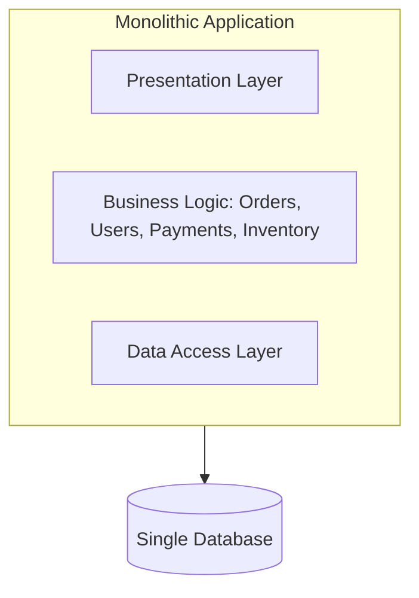
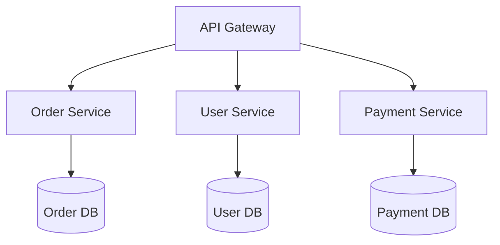
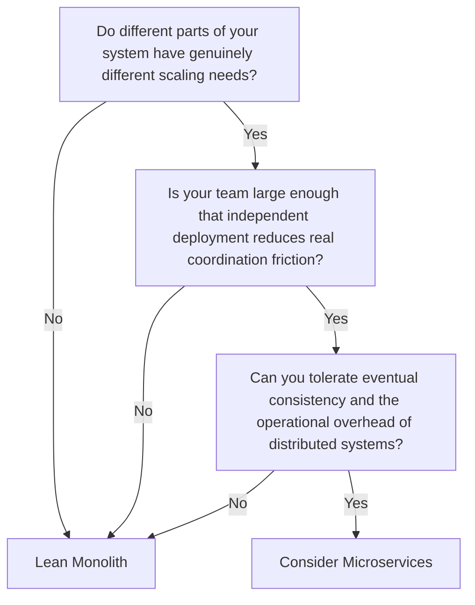
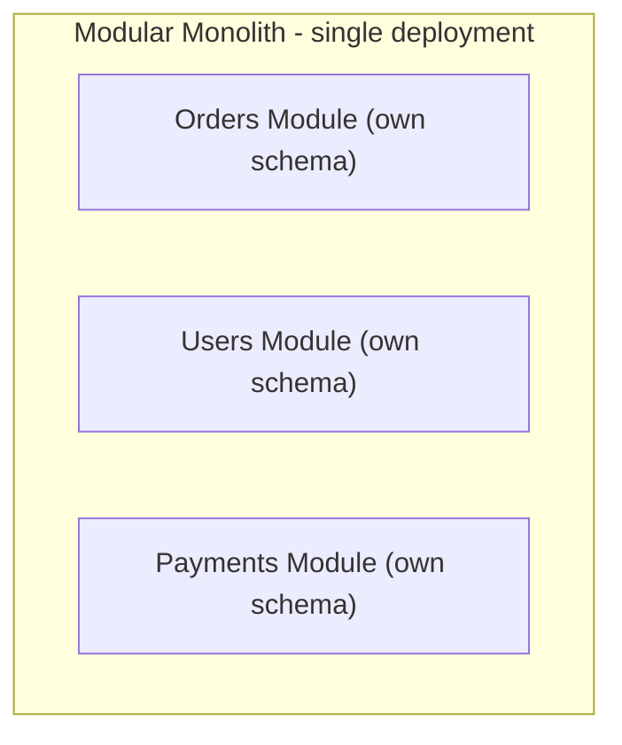

## Introduction

This chapter opens Part 6 by directly confronting a decision this series has referenced constantly without fully unpacking: monolith or microservices? Nearly every chapter in Parts 4 and 5 (distributed locks, message queues, distributed transactions) exists specifically to solve problems that microservices architectures create — so before going further, it's worth being precise about when that trade-off is actually worth making.

## The Monolith

A single, unified application — one codebase, one deployment unit, typically one database — containing all of a system's business logic.

**Advantages:**
- **Simplicity**: One codebase to build, test, and deploy. No network calls between internal components — just function calls.
- **Easier transactions**: A single database means standard ACID transactions (Chapter 17) work naturally across the entire application's data — no need for Sagas (Chapter 20).
- **Simpler debugging/tracing**: A single process means a single call stack — no distributed tracing (Chapter 42) needed to understand what happened.
- **Lower operational overhead**: One thing to deploy, monitor, and scale (even if that scaling is coarser-grained).

**Disadvantages:**
- **Scaling is all-or-nothing**: If only the "Orders" component is under heavy load, you still have to scale the *entire* application (Chapter 7) — you can't scale just the hot part independently.
- **Deployment coupling**: A change to any part of the system requires redeploying the whole application, and a bug in one module can potentially bring down the entire system.
- **Technology lock-in**: The whole application typically shares one language/framework/database choice.
- **Team scaling friction**: As a team grows, many engineers working in the same large codebase increases merge conflicts, coordination overhead, and the blast radius of any single change.

## Microservices

The system is decomposed into multiple independent services, each owning its own data and business logic for a specific domain, communicating over the network (Chapter 5).

**Advantages:**
- **Independent scaling**: Scale only the specific services under load (Chapter 7), rather than the whole system.
- **Independent deployment**: Teams can deploy their own service without coordinating a release of the entire application.
- **Technology flexibility**: Each service can use the language/database best suited to its specific needs (polyglot persistence, Chapter 13).
- **Fault isolation**: A failure in one service (if properly isolated — see Chapter 36's circuit breakers) doesn't necessarily bring down the entire system.
- **Team autonomy**: Teams can own a service end-to-end, reducing cross-team coordination for most day-to-day work.

**Disadvantages:**
- **Massive added complexity**: Distributed transactions (Chapter 20), service discovery (Chapter 35), network unreliability, distributed tracing needs (Chapter 42) — essentially all of Parts 4-6 of this series exist because of this complexity.
- **Operational overhead**: More things to deploy, monitor, secure, and keep available — each service is its own potential point of failure.
- **Data consistency challenges**: No single database transaction spans multiple services — eventual consistency and Sagas become necessary (Chapters 17-20).
- **Network latency**: What was an in-process function call becomes a network round trip, with all the latency and failure-mode implications from Chapter 2.

## The Real Decision Framework

**Team size (Conway's Law) matters as much as technical scale.** Conway's Law observes that system architecture tends to mirror the communication structure of the organization that builds it. A 5-person team building microservices is often fighting this law — they'll end up constantly coordinating across "independent" services anyway, paying microservices' complexity cost without the organizational-scaling benefit that's supposed to justify it. Microservices tend to pay off specifically when an organization has grown large enough that a monolith's shared-codebase coordination overhead has become the actual bottleneck.

## The "Distributed Monolith" Anti-Pattern (Revisited from Chapter 32)

A common, genuinely bad outcome: splitting a monolith into separate services that still share a database, or that call each other synchronously in tightly-coupled chains, or that must always be deployed together due to hidden interdependencies. This produces the operational complexity and network latency cost of microservices, with **none** of the independent-scaling, independent-deployment, or fault-isolation benefits — the worst of both worlds. Migrating to microservices is not just "put a network boundary between modules" — it requires genuinely decoupling data ownership and deployment lifecycles.

## The Modular Monolith: A Middle Ground

A **modular monolith** structures a single-deployment-unit application into clearly-separated internal modules with well-defined boundaries (each module owns its own data access, ideally even its own database schema within the same physical database), without the network/deployment overhead of full microservices.

This provides a genuine middle ground: enforced internal boundaries and clear ownership (making a future extraction to real microservices easier if genuinely needed later) while retaining a monolith's deployment and transactional simplicity — often the pragmatic starting point many teams should consider before jumping straight to microservices.

## Summary

- Monoliths offer simplicity, easier transactions, and lower operational overhead; microservices offer independent scaling, deployment, and technology flexibility, at the cost of substantial distributed systems complexity.
- Team size and organizational structure (Conway's Law) matter as much as technical scaling needs — microservices often pay off specifically when organizational coordination, not technical load, is the actual bottleneck.
- The "distributed monolith" anti-pattern — microservices' complexity without their benefits — results from splitting deployment without genuinely decoupling data ownership.
- A modular monolith is a legitimate, often underrated middle ground, providing clear internal boundaries without full distributed-systems overhead.

---

## Interview Questions

### 1. Why does a monolith avoid the need for the Saga pattern (Chapter 20), and what does this reveal about the true cost of that pattern?
**Answer:** In a monolith, all business logic and data typically live within a single application and a single database, meaning a business operation spanning multiple logical domains (e.g., creating an order and decrementing inventory) can be wrapped in a single, standard ACID database transaction (Chapter 17) — the database itself natively guarantees all-or-nothing atomicity across these operations without any special distributed coordination pattern needed. This reveals that the Saga pattern's complexity isn't an inherent, unavoidable cost of "doing business logic that spans multiple domains" — it's specifically a cost incurred *because* microservices architecture has split that data across independently-owned databases; choosing microservices is, among other things, implicitly choosing to take on this specific complexity (Sagas, compensating transactions, eventual consistency) that a monolith simply never needs to deal with in the first place.

**Follow-up:** *Does this mean a team should avoid microservices specifically to avoid needing Sagas?* — Not necessarily as a sole deciding factor, but it should be weighed honestly as one genuine, concrete cost among the several described in this chapter — if a team's primary motivation for microservices is something else entirely (e.g., needing independent deployment for organizational/team-scaling reasons), they should go in with clear eyes that this specific complexity (needing patterns like Sagas for cross-service business operations) is a direct, unavoidable consequence of that architectural choice, not an optional extra they can simply skip by being sufficiently careful.

### 2. Explain Conway's Law and why it's directly relevant to deciding between monolith and microservices architecture, beyond purely technical scaling considerations.
**Answer:** Conway's Law observes that organizations tend to design systems that mirror their own internal communication and team structure — teams that communicate frequently and are organized around shared ownership tend to naturally produce tightly-coupled, monolithic-style systems, while organizations with genuinely separate, more independently-operating teams tend to naturally produce more modular, loosely-coupled systems that mirror those team boundaries. This is relevant to the monolith-vs-microservices decision because introducing microservices specifically to gain "independent team ownership and deployment" benefits only genuinely works if the team's actual organizational structure already supports (or is deliberately restructured to support) that same independence — a small, tightly-collaborating team artificially splitting their system into microservices will likely still need to coordinate closely across those "independent" services anyway (since their actual team structure hasn't changed), meaning they pay microservices' technical complexity cost without realizing the organizational-autonomy benefit that's supposed to justify it.

**Follow-up:** *Does this mean a large organization should always choose microservices, and a small one should always choose a monolith?* — Not as an absolute, mechanical rule — but it strongly suggests that organizational structure and team communication patterns should be a first-order input into this architectural decision, not an afterthought; a large organization considering microservices should genuinely have (or be prepared to restructure into) multiple, sufficiently independent teams that can actually operate with the autonomy microservices are meant to enable, and a small organization should be honestly skeptical of adopting microservices' complexity primarily because of its popularity or perceived prestige, rather than because their actual, current organizational structure and coordination needs genuinely call for it.

### 3. What is a "distributed monolith," and why is it considered one of the worst possible outcomes of a microservices migration?
**Answer:** A distributed monolith results when a system is split into separate, independently-deployed services (superficially resembling microservices), but those services still share an underlying database, or are so tightly coupled through synchronous call chains and hidden interdependencies that they must, in practice, almost always be deployed and changed together — it has all the network communication overhead, latency, and operational complexity of a true microservices architecture, but retains the actual coupling and lack of independent deployability/scalability that a monolith (which at least avoids the network overhead) would have had anyway. It's considered one of the worst outcomes specifically because it combines the downsides of both architectural styles (microservices' distributed-systems complexity and network overhead, plus monolith-style tight coupling preventing genuine independent scaling/deployment) while providing essentially none of either style's core benefits (a monolith's deployment/transactional simplicity, or true microservices' independent scaling/deployment/fault-isolation).

**Follow-up:** *What specific technical decision, if made incorrectly during a migration, most commonly leads to this distributed monolith outcome?* — Failing to genuinely decouple data ownership — specifically, allowing multiple newly-separated services to continue directly querying or writing to the same shared underlying database (rather than each service owning its own distinct data store, as true microservices architecture requires) — this single decision alone tends to recreate most of a monolith's tight coupling (since services remain implicitly, tightly coupled through their shared database schema and any changes to it) while still incurring the network communication overhead and operational complexity of having split the application into separate deployable services in the first place.

### 4. Why might a "modular monolith" be a genuinely underrated architectural choice, rather than simply a lesser, compromise version of "real" microservices?
**Answer:** A modular monolith deliberately enforces clear internal module boundaries and data ownership (each module ideally owning its own distinct schema/tables within the single physical database, with disciplined restrictions against one module directly querying another's tables) — this achieves much of the *organizational clarity and maintainability* benefit that's often cited as a microservices motivation (clear ownership boundaries, reduced accidental coupling between unrelated business domains), while entirely avoiding the network latency, distributed transaction complexity, and operational overhead that come specifically from physically splitting the application into separately-deployed services communicating over a network — for many organizations, especially those not yet facing genuine, pressing independent-scaling or independent-deployment needs, a modular monolith can provide "microservices' architectural discipline" without paying microservices' full distributed-systems complexity tax, making it a legitimate, often superior choice for that context rather than merely a lesser stepping-stone.

**Follow-up:** *If a team starts with a well-structured modular monolith, does this make a future migration to true microservices easier, if it eventually becomes genuinely necessary?* — Yes, significantly — because a well-implemented modular monolith already has clear, enforced module boundaries and (ideally) already-separated data ownership at the schema level, extracting a specific module into an independently-deployed microservice later becomes a much more contained, lower-risk operation (primarily "move this already-isolated module's code and schema to run as its own separate deployed service, and replace its in-process calls with network calls") — compared to attempting the same extraction from a poorly-structured, tightly-coupled "big ball of mud" monolith, where the actual boundaries between what should become separate services are unclear and deeply entangled, making genuine extraction dramatically more difficult and risky; this connects directly to the Strangler Fig migration pattern discussed in Chapter 39.

### 5. A candidate proposes microservices for a brand-new startup's MVP, arguing "it's better to build it the right, scalable way from the start rather than having to migrate later." How would you challenge this reasoning?
**Answer:** You'd point out that this reasoning inverts the actual, most common and costly risk facing a brand-new startup's MVP: the primary risk isn't usually "the system won't scale technically" (a genuine, well-understood, and comparatively solvable problem once you actually have significant traffic/scale to justify addressing it) — it's "we don't yet know if this product concept is even correct, and we need to iterate extremely quickly based on real user feedback to find out." Microservices' architectural rigidity (separate deployments, network boundaries between components, more complex cross-service data consistency) makes this kind of rapid, exploratory iteration measurably slower and more expensive precisely when speed of iteration matters most — a monolith's simplicity directly supports the fast, low-overhead experimentation an early-stage startup most needs, and the "scalability" microservices theoretically provide is a solution to a problem (handling massive technical scale) the startup likely doesn't have yet and might never have, if the product doesn't find genuine market fit in the first place.

**Follow-up:** *Is there ever a legitimate case for a genuinely new startup choosing microservices from day one, despite this general reasoning?* — In specific, narrower cases — e.g., if the startup's core product itself is fundamentally, inherently a set of clearly-separable, independently-valuable services from day one (rather than a single cohesive product with tightly-interrelated features), or if the founding team already has deep, specific prior expertise and existing tooling/infrastructure specifically for operating microservices efficiently (reducing the usual added overhead cost), a more nuanced case for early microservices adoption could exist — but the general, default guidance for most typical early-stage startups (building a single, cohesive product and needing to iterate rapidly and cheaply while searching for product-market fit) strongly favors starting with a monolith (ideally a well-structured, modular one) and evolving toward microservices later specifically if and when genuine, concrete organizational or technical scaling needs actually materialize and justify that added complexity.

### 6. Why does a microservices architecture generally require more sophisticated observability/monitoring tooling (previewing Chapter 42) than an equivalent monolithic application?
**Answer:** In a monolith, a single request's entire processing path exists within one process's call stack, making it comparatively straightforward to debug/trace using standard, familiar tools (a single application's logs, a debugger attached to a single process) — there's no need to correlate information across separately-running, independently-deployed processes. In microservices, a single logical business operation might traverse many independently-deployed services, each running as its own separate process, potentially on different machines — understanding what happened for a specific request (which service was slow, where an error actually originated, what the full sequence of cross-service calls looked like) requires being able to correlate logs, metrics, and traces across all these separately-running services, which fundamentally requires more sophisticated, purpose-built distributed observability tooling (like distributed tracing systems propagating a shared trace ID across service boundaries) that simply isn't needed for understanding a single-process monolith's behavior.

**Follow-up:** *Does this mean a team should specifically avoid microservices if they don't already have mature observability tooling in place?* — This is a genuinely important, often underweighted practical consideration — a team adopting microservices without first investing in adequate distributed tracing, centralized logging, and metrics aggregation capabilities will likely find themselves unable to effectively debug and operate their system in production, potentially experiencing significantly worse operational outcomes than they would have with a simpler, more directly-debuggable monolith — this reinforces the broader theme of this chapter that microservices' benefits come with real, concrete prerequisite costs (here, specifically observability tooling investment) that should be honestly planned for and ideally established *before* or *alongside* a microservices adoption, not treated as an afterthought to be addressed only once operational pain from its absence is already being felt.

### 7. Why might independent technology choice per service (a commonly cited microservices benefit) be a double-edged sword rather than an unambiguous positive?
**Answer:** While the flexibility to choose the best-suited language/database/framework for each specific service's specific needs (polyglot persistence and polyglot programming) can genuinely improve that specific service's performance/developer-experience for its particular problem, it also means the organization now needs to maintain expertise, tooling, operational runbooks, and hiring capability across potentially many different technology stacks simultaneously, rather than concentrating that expertise and investment into a smaller, more consistent set of technologies — this can fragment institutional knowledge (fewer engineers deeply understand any single service's specific stack), complicate cross-team mobility/collaboration (an engineer moving between teams/services faces a steeper technology-relearning curve if each service uses genuinely different stacks), and increase the operational burden of keeping many different technology stacks patched, updated, and well-understood from a security/reliability perspective.

**Follow-up:** *How might an organization capture some of microservices' independent-technology-choice benefit while mitigating this fragmentation risk?* — Many organizations adopt a middle-ground approach: maintaining a small, deliberately curated set of "approved" or "golden path" technology stacks/frameworks that most services are expected to use (rather than allowing genuinely unlimited, per-service technology choice), reserving the flexibility to deviate from this golden path specifically for services with a clear, well-justified specific need that the standard stack genuinely can't serve well — this captures much of the practical benefit of technology flexibility for the genuinely exceptional cases that need it, while avoiding the worst of the fragmentation and institutional-knowledge-dilution risk that comes from truly unconstrained, per-service technology choice across a large number of services.

### 8. In a system design interview, if the interviewer explicitly states "assume a small team of 5 engineers building a new product," how should this constraint shape your architectural recommendation, even if the interviewer separately mentions the product needs to eventually support millions of users?
**Answer:** You should explicitly recommend starting with a monolith (ideally a well-structured, modular one) despite the eventual large-scale user target, and explain your reasoning clearly: a team of 5 engineers doesn't have the organizational scale that makes microservices' independent-team-deployment benefits meaningful (per the Conway's Law discussion above), and would face a disproportionate operational and cognitive burden trying to build and operate a full microservices architecture with such a small team relative to the number of separately-deployed services and their associated distributed-systems complexity that a "proper" microservices decomposition might otherwise suggest. You'd explain that "millions of users eventually" is a future scaling concern that can be addressed incrementally as the team and system genuinely grow (following the general "scale incrementally, only as justified by real, measured need" principle emphasized throughout this series, e.g., in Chapter 7) — starting with a well-structured monolith doesn't preclude a future, well-justified migration to microservices (potentially via the Strangler Fig pattern, Chapter 39) once the team and the system's actual demonstrated needs genuinely warrant that additional complexity.

**Follow-up:** *How would your answer specifically change if the interviewer instead said "assume 50 engineering teams, each with 5-8 engineers, all needing to work on this system somewhat independently"?* — This organizational structure much more directly supports and motivates a microservices architecture — with 50 independent teams, a single shared monolithic codebase would likely create severe coordination bottlenecks (frequent merge conflicts, coordinated release scheduling across dozens of teams, a shared codebase becoming increasingly difficult for any single team to safely and confidently modify without extensive cross-team coordination) — in this scenario, microservices' core benefit of enabling genuinely independent development, deployment, and ownership per team directly addresses the actual, primary organizational bottleneck this scale of team structure would create in a monolithic architecture, making the case for microservices (and investment in the associated distributed-systems tooling/expertise to support it well) considerably stronger and better-justified than in the small, 5-engineer team scenario.

### 9. Why is "we chose microservices for better fault isolation" an incomplete claim unless specific additional patterns (like circuit breakers, Chapter 36) are also explicitly part of the design?
**Answer:** Simply splitting a system into separate, independently-deployed services doesn't automatically provide meaningful fault isolation on its own — if Service A makes a direct, synchronous call to Service B, and Service B becomes slow or entirely unresponsive, Service A (and potentially every other service that depends on A, in a cascading chain) can still become blocked, exhaust its own resources (e.g., thread pool exhaustion waiting on B's slow responses), and ultimately fail as a direct consequence of B's failure — this is functionally very similar to how a failure in one module of a monolith can bring down the entire application, just now happening across a network boundary rather than within a single process; true fault isolation specifically requires deliberate additional patterns and design decisions (like circuit breakers that stop calling a failing dependency after detecting repeated failures, bulkheads that isolate resource pools so one dependency's slowness can't exhaust resources needed for calls to other, healthy dependencies, and appropriate timeouts) layered on top of the basic microservices decomposition — without these, "microservices" alone provides deployment/scaling independence, but not the fault-isolation benefit that's often assumed to come automatically bundled with it.

**Follow-up:** *Does this mean a monolith could theoretically achieve similar fault-isolation benefits by applying similar patterns internally, without actually adopting microservices?* — To a meaningful degree, yes, for certain classes of failure — a well-designed monolith can apply techniques like internal timeouts, bulkheading of thread pools per internal dependency/resource, and graceful degradation logic for specific failing internal operations, providing some genuine fault-isolation benefit even without a full microservices decomposition; however, a monolith cannot fully isolate against certain failure modes that are inherent to sharing a single process/deployment (e.g., a memory leak or an unhandled exception in one part of the codebase can still potentially crash the entire single process, taking down every function of the monolith simultaneously, in a way that a genuinely separate, independently-deployed and independently-crash-isolated microservice process cannot directly cause for unrelated services) — so while some fault-isolation techniques can be applied within either architectural style, true, complete process-level fault isolation is a benefit that specifically requires genuine, separate deployment units (microservices), even though it still requires the additional patterns discussed above to be fully realized and not merely assumed.

### 10. Why might a team choose to intentionally use both a monolith AND microservices within the same overall organization/system, rather than treating this as an all-or-nothing architectural commitment?
**Answer:** Different parts of a system, and different teams within an organization, can have genuinely different needs and organizational contexts that warrant different architectural approaches — a core, tightly-interrelated set of business logic actively developed by a small, cohesive core team might be genuinely best served by a monolith (or modular monolith) for the simplicity and iteration-speed benefits discussed in this chapter, while a specific, well-isolated capability with genuinely distinct scaling needs, a separate specialized team, or a need for independent technology choice (e.g., a machine-learning-heavy recommendation service, or a specific high-throughput real-time component) might be genuinely well-served by being extracted as a separate microservice, even while the "core" of the system remains a monolith — this pragmatic, mixed approach (sometimes emerging naturally via the Strangler Fig migration pattern, Chapter 39) allows an organization to apply the most appropriate architectural style to each specific part of their system based on its actual, specific needs, rather than dogmatically committing every single component to one single architectural philosophy uniformly across an entire, likely genuinely heterogeneous organization and system.

**Follow-up:** *What risk does this mixed approach introduce that a purely one-architecture-or-the-other approach avoids?* — A mixed approach requires the organization to maintain genuine competency and appropriate tooling for *both* architectural styles simultaneously (monolith deployment/operational practices AND microservices' distributed-systems tooling/expertise), rather than being able to fully specialize and optimize their tooling, hiring, and operational practices around just one single, consistent architectural approach — there's also a real risk of the boundary between "what should be in the monolith" versus "what should be a separate microservice" becoming unclear or contested over time without disciplined, deliberate architectural governance, potentially leading to an unplanned, organically-grown mix that resembles the "distributed monolith" anti-pattern's confusion rather than a genuinely deliberate, well-reasoned hybrid architecture — successfully executing a mixed approach requires more deliberate architectural discipline and clear decision criteria (much like this chapter's own decision framework) than either a purely monolithic or purely microservices commitment might otherwise require.
