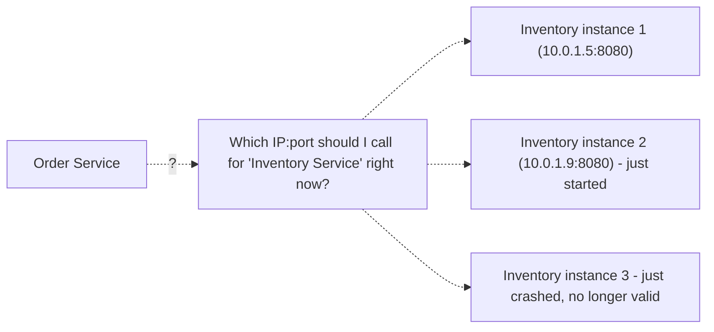
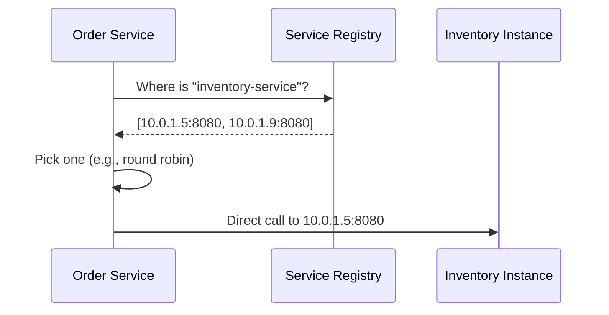
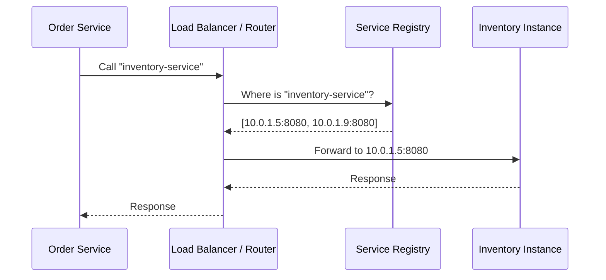

## Introduction

Chapter 34 established that microservices communicate over a network. But how does the Order Service actually know the current IP address and port of a healthy Inventory Service instance — especially when instances are constantly being added, removed, restarted, or auto-scaled (Chapter 7)? Hardcoding IP addresses is a non-starter in this dynamic environment. **Service discovery** solves this.

## The Problem

In a dynamic, auto-scaled, containerized environment, the set of healthy instances for any given service is constantly changing. Hardcoding IPs would require updating and redeploying every dependent service every time instances change — completely impractical.

## Two Patterns: Client-Side and Server-Side Discovery

### Client-Side Discovery

The calling service queries a **service registry** directly to get a list of healthy instances, then chooses one itself (often using a load-balancing algorithm client-side, Chapter 8).

**Pros**: No extra network hop for the actual call (client calls the instance directly); the client can implement sophisticated, custom load-balancing logic.
**Cons**: Every client needs discovery-client logic (potentially duplicated across every language/service in the system) and a client library to talk to the registry.

### Server-Side Discovery

The calling service simply calls a well-known, stable endpoint (typically a load balancer), which itself queries the registry and forwards the request to a healthy instance.

**Pros**: The calling service needs no discovery-specific logic at all — it just calls a stable address, exactly like calling any regular service.
**Cons**: An additional network hop through the load balancer/router for every call, and that router itself needs to be highly available.

Kubernetes' built-in Service abstraction is a widely-used example of server-side discovery — application code simply calls a stable Service DNS name/IP, and Kubernetes' internal networking transparently handles routing to a healthy pod.

## Service Registration: Self-Registration vs Third-Party Registration

- **Self-registration**: Each service instance registers itself with the registry on startup and deregisters (or lets its registration lease expire) on shutdown — directly analogous to ZooKeeper's ephemeral znodes from Chapter 27.
- **Third-party registration**: A separate component (a "registrar," often integrated with the deployment/orchestration platform itself) monitors instances and registers/deregisters them automatically — the service itself has no awareness of or responsibility for the registry at all. Kubernetes uses this model: the platform itself tracks which pods are running and updates its internal service registry accordingly, without any application-level registration code.

## Health Checking and the Registry

A service registry is only useful if it reflects **actual current health**, not just "this instance was started at some point." This directly connects to Chapter 8's health check discussion — registries typically require instances to send periodic heartbeats (or be actively health-checked), removing entries that stop responding, much like ZooKeeper's session-based ephemeral node cleanup (Chapter 27).

## Real-World Service Discovery Tools

- **Consul (HashiCorp)**: A dedicated service registry with built-in health checking, often paired with gossip-based (Chapter 24) cluster membership.
- **etcd**: A distributed key-value store (using Raft consensus, Chapter 23) commonly used as the backing store for service discovery, notably as the core data store underlying Kubernetes itself.
- **Kubernetes Services + DNS**: Kubernetes' built-in server-side discovery mechanism — a Service object provides a stable virtual IP/DNS name, with `kube-proxy` handling the actual routing to healthy backing pods.
- **Eureka (Netflix)**: A well-known client-side discovery registry from Netflix's early, influential microservices architecture, commonly used with client-side load balancing libraries.

## Summary

- Service discovery solves the problem of finding a healthy service instance's current network location in a dynamic, constantly-changing microservices environment where hardcoded IPs are impractical.
- Client-side discovery has the calling service query a registry and choose an instance itself; server-side discovery has a load balancer/router perform this lookup transparently on the client's behalf.
- Services register with the registry either themselves (self-registration) or via a separate registrar component (third-party registration, as Kubernetes does).
- A registry's usefulness depends entirely on accurate, current health information, requiring the same heartbeat/health-check principles discussed in Chapters 8 and 27.

---

## Interview Questions

### 1. Why is hardcoding service IP addresses fundamentally incompatible with a modern, auto-scaled microservices environment?
**Answer:** In a modern environment using auto-scaling (Chapter 7), container orchestration, and elastic infrastructure, the specific set of running instances for any given service — and their IP addresses — changes constantly and dynamically: instances are added during traffic spikes, removed during scale-downs, restarted after crashes or deployments, and generally have no long-term stable identity at the network level. Hardcoding a specific IP address into a dependent service's configuration would require that configuration to be manually updated and that dependent service redeployed every single time the target service's instances changed — completely impractical and operationally infeasible at any meaningful scale or rate of change, which is precisely why a dynamic, automatically-updated service discovery mechanism is a foundational requirement for any genuinely elastic microservices architecture.

**Follow-up:** *Would using a fixed, stable DNS name (without dynamic service discovery) instead of a raw IP address fully solve this problem?* — Partially, but not completely — a stable DNS name does avoid the specific problem of hardcoded IPs directly, but basic DNS (Chapter 3) alone typically doesn't have the fast update propagation, fine-grained health-awareness, or low caching-latency characteristics needed to reflect the very rapid instance changes typical in a dynamic microservices environment (DNS TTL-based caching, as discussed in Chapter 3, could mean clients continue trying to reach recently-removed, no-longer-valid instances for some period) — this is exactly why purpose-built service discovery mechanisms (often built on top of, or complementary to, basic DNS) with more immediate health-awareness and update propagation are generally preferred over relying on basic DNS alone for this specific, highly dynamic internal service-location need.

### 2. Compare client-side and server-side service discovery, and explain the specific operational trade-off between them regarding where discovery logic lives.
**Answer:** In client-side discovery, each calling service directly queries the service registry itself and is responsible for selecting a specific healthy instance (often applying its own client-side load-balancing logic) before making the actual call directly to that chosen instance — this avoids an extra network hop for the actual request, but requires every single calling service (potentially written in many different languages across a genuinely polyglot microservices environment, per Chapter 34's technology-flexibility discussion) to implement and maintain its own service-discovery client logic. In server-side discovery, the calling service simply makes a request to a stable, well-known address (typically a load balancer or router), which itself handles querying the registry and routing to a healthy instance — this centralizes all discovery logic into that one router/load-balancer component, meaning calling services need zero special discovery-aware code at all (they just make what looks like an ordinary network call), at the cost of an additional network hop through that router for every single call.

**Follow-up:** *Given microservices' potential for genuinely polyglot technology choices (per Chapter 34), why might server-side discovery be a particularly attractive default choice for a large, technologically diverse organization?* — Since server-side discovery requires zero discovery-specific logic in each individual calling service (they simply make ordinary calls to a stable address), it completely avoids the burden of needing to build, maintain, and keep in sync separate service-discovery client libraries across every different programming language/technology stack in use across the organization — client-side discovery, by contrast, would require either building and maintaining discovery-client libraries for every language in use, or accepting inconsistent, potentially lower-quality ad hoc implementations across different teams/services — this makes server-side discovery's centralization of complexity into one well-maintained router component particularly valuable specifically in a genuinely polyglot technology environment.

### 3. Why does a service registry need to incorporate health checking (or heartbeat-based liveness), rather than simply tracking "which instances have ever registered"?
**Answer:** If a registry only tracked historical registration events without any ongoing health/liveness verification, it would inevitably accumulate stale entries for instances that have since crashed, been terminated during a scale-down, or otherwise become unavailable — since these instances never explicitly, reliably "deregistered" themselves in every possible failure scenario (a crash, by definition, doesn't give an instance the opportunity to gracefully clean up after itself) — dependent services querying this registry could then be given the network location of an instance that's actually no longer running or responsive at all, causing failed calls to what the registry incorrectly still lists as a valid, available instance; ongoing health checking or heartbeat-based liveness tracking (directly analogous to Chapter 8's load balancer health checks and Chapter 27's ZooKeeper ephemeral node session-based cleanup) ensures the registry's contents accurately reflect only genuinely currently-healthy, available instances, rather than an inaccurate historical record of instances that merely existed at some point in the past.

**Follow-up:** *How does this connect specifically to the "self-registration" vs. "third-party registration" distinction discussed in this chapter?* — With self-registration, the registering instance itself is typically also responsible for sending ongoing heartbeats to maintain its "alive" status in the registry (with the registry automatically expiring/removing entries that stop heartbeating, similar to ZooKeeper's session-based ephemeral node expiry) — if that instance crashes, its heartbeats simply stop, and the registry naturally, automatically removes it after the heartbeat timeout elapses; with third-party registration (as Kubernetes uses), the separate registrar component (the orchestration platform itself) has its own independent, authoritative knowledge of which instances/pods are actually currently running and healthy (since the platform itself is responsible for starting/stopping/monitoring those instances), and updates the registry accordingly based on this independent, platform-level health knowledge, rather than relying on each individual instance's own self-reported heartbeats.

### 4. Why is Kubernetes' built-in Service abstraction considered an example of server-side discovery, and what specific problem does `kube-proxy` solve within this model?
**Answer:** In Kubernetes, application code simply makes a call to a Service's stable, unchanging virtual IP address or DNS name — the application itself has no awareness of, or direct interaction with, the actual, dynamically-changing set of individual healthy pod instances backing that Service; this is precisely the server-side discovery pattern — the calling application is completely unaware of and uninvolved in the actual discovery/routing logic, which happens transparently on its behalf. `kube-proxy` is the component that actually implements this transparent routing — it runs on each node and configures the underlying networking (e.g., via iptables or IPVS rules) so that traffic sent to a Service's stable virtual IP is transparently intercepted and redirected to one of the currently-healthy backing pod IPs, with `kube-proxy` continuously updating these routing rules as the actual set of healthy pods changes over time (pods being created, terminated, or failing health checks) — solving the core service discovery problem transparently at the networking layer, without requiring any service-discovery-aware application code at all.

**Follow-up:** *Why might a system additionally use a service mesh (like Istio or Linkerd) on top of Kubernetes' built-in Service discovery, rather than relying solely on the basic Kubernetes Service/kube-proxy mechanism?* — A service mesh adds a further layer of sophisticated, application-aware (typically Layer 7) capabilities on top of Kubernetes' basic Layer 3/4 Service routing — such as more advanced traffic management (canary deployments, fine-grained traffic splitting), built-in mutual TLS between services, more sophisticated retry/circuit-breaker policies (Chapter 36) applied transparently at the networking layer rather than needing to be implemented in each individual service's own application code, and richer observability (automatic distributed tracing/metrics collection for all inter-service calls) — while Kubernetes' basic Service discovery solves the fundamental "how do I find and reach a healthy instance" problem, a service mesh builds additional, valuable cross-cutting capabilities on top of that foundational discovery/routing layer.

### 5. Explain why "self-registration" introduces a form of coupling between application code and the specific service discovery technology being used, and how "third-party registration" avoids this.
**Answer:** With self-registration, each individual service's application code must directly integrate with and call the specific service registry's API (e.g., explicitly registering itself with Consul or Eureka on startup, and sending periodic heartbeats) — this means the application code itself has a direct, explicit dependency on and awareness of the specific chosen service discovery technology, and switching to a different service discovery technology later would require modifying every single service's application code to integrate with the new system's specific API instead. With third-party registration, the actual application code has zero awareness of or direct interaction with the service discovery mechanism at all — a separate, external registrar component (typically deeply integrated with the underlying deployment/orchestration platform, as Kubernetes' control plane is) handles all registration/deregistration automatically based on its own independent knowledge of which instances are running, meaning the application code itself remains completely decoupled from and unaware of whatever specific service discovery technology or mechanism happens to be used underneath — switching the underlying discovery mechanism would require changes only to the platform/infrastructure layer, not to any individual service's application code.

**Follow-up:** *Given this coupling difference, why might a large organization deliberately prefer third-party registration as a general architectural principle, even beyond just the polyglot-technology benefit discussed earlier?* — Beyond avoiding the need for per-language discovery-client libraries, third-party registration significantly reduces the organization's overall risk and switching cost if they ever need to change their underlying service discovery/orchestration platform in the future (e.g., migrating between different container orchestration systems, or adopting a new service mesh technology) — since no individual application's business logic code has any direct dependency on the specific discovery mechanism, this kind of infrastructure-level migration can happen with zero changes required to the actual application codebases themselves, representing a cleaner separation of concerns between "infrastructure/platform responsibilities" and "application/business-logic responsibilities" that many organizations find valuable as a general architectural principle, independent of any specific polyglot-technology consideration.

### 6. Why does the service registry itself need to be highly available, and what pattern from earlier chapters would you apply to ensure this?
**Answer:** The service registry is a critical, foundational dependency that essentially every inter-service call in the entire microservices architecture relies on (directly or indirectly, depending on client-side vs. server-side discovery) to find the correct instance to actually communicate with — if the registry itself becomes unavailable, services would be unable to discover and reach each other at all, effectively causing a cascading, system-wide outage far beyond just the specific service(s) the registry itself represents; this makes the registry's own availability a uniquely critical, high-leverage concern deserving the same rigorous fault-tolerance treatment as the most critical components discussed throughout this series. You'd apply the same principles discussed in Chapter 23 (quorum-based consensus, as tools like Consul, etcd, and ZooKeeper — all commonly used as service registries or their backing stores — are themselves built upon) and Chapter 15 (replication) — running the registry itself as a properly replicated, consensus-based cluster (rather than a single instance) so that it can tolerate individual node failures without losing availability or correctness, exactly the same fundamental fault-tolerance approach applied to any other critical piece of shared infrastructure covered throughout this series.

**Follow-up:** *If the service registry itself experiences a partition or brief unavailability, what fallback behavior might well-designed client-side discovery clients implement to maintain some resilience?* — Well-designed discovery clients often implement local caching of recently-retrieved instance lists — if a fresh query to the registry temporarily fails or times out, the client can fall back to using its most recently cached, still-reasonably-fresh list of known healthy instances for a bounded grace period, rather than immediately failing every single outbound call the moment the registry itself becomes briefly unavailable — this trades a small amount of potential staleness (the cached instance list might not perfectly reflect very recent changes) for meaningfully better resilience against brief registry unavailability, directly echoing the broader theme of graceful degradation under partial failure that recurs throughout this series' discussion of building genuinely fault-tolerant distributed systems.

### 7. A candidate designing a microservices system says "I'll just have each service directly maintain a hardcoded configuration file listing the IPs of the 2-3 other specific services it depends on, updated manually when needed." At what scale/context might this actually be a reasonable, pragmatic choice rather than a mistake?
**Answer:** For a genuinely small-scale system — perhaps a handful of services total, running in a relatively stable environment without aggressive auto-scaling, frequent deployments, or dynamic instance churn (e.g., a small number of long-lived, relatively static VM instances rather than a highly dynamic, elastically-scaled container orchestration environment) — the operational overhead of manually updating a small number of hardcoded configuration entries on the relatively rare occasions they actually need to change might genuinely be less burdensome than standing up, learning, and operating a full dedicated service discovery infrastructure (like Consul or etcd) purely for this very limited need; this mirrors the broader "don't over-engineer for a scale/complexity you don't yet have" principle emphasized repeatedly throughout this series — for a sufficiently small, stable environment, this simpler (if less elegant) manual approach might be a genuinely pragmatic, appropriately-scoped choice rather than an obvious architectural mistake.

**Follow-up:** *What specific signals would indicate this team has outgrown this simple manual approach and now genuinely needs proper service discovery infrastructure?* — Signals would include: the number of services and their inter-dependencies growing large enough that manually tracking and updating configuration for every dependency relationship becomes genuinely error-prone and operationally burdensome; adopting more dynamic, elastic infrastructure (auto-scaling, container orchestration with frequent pod restarts/rescheduling) where instance IPs genuinely change frequently enough that manual updates can't realistically keep pace; or experiencing actual production incidents/outages specifically caused by stale, incorrect, or out-of-date manually-maintained configuration — any of these would indicate that the simple manual approach's underlying assumptions (small scale, infrequent change, low error cost) no longer hold, justifying the investment in proper, automated service discovery infrastructure at that point.

### 8. Why might service discovery be described as "solving a problem that only exists because of the architectural choice made in Chapter 34," directly connecting these two chapters?
**Answer:** The fundamental need for service discovery arises specifically because a system has been decomposed into multiple independently-deployed services communicating over a network with dynamically-changing instance locations — a monolith, by definition, has no such problem at all, since all its internal components communicate via simple, direct in-process function calls with no network addresses or dynamic instance locations involved whatsoever; service discovery is therefore not some generically necessary, universal system design capability that every system needs, but rather a specific, direct consequence of and requirement introduced by choosing a microservices (or otherwise networked, multi-instance) architecture in the first place — reinforcing Chapter 34's broader theme that microservices' benefits come bundled with a series of genuine, concrete additional complexities (service discovery being one clear, direct example) that a monolith simply never needs to address.

**Follow-up:** *Can you name another specific complexity from a different chapter in this series that similarly "only exists because of" the microservices architectural choice, following this same pattern?* — Distributed transactions and the Saga pattern (Chapter 20) fit this same pattern precisely — the need for compensating transactions and eventual-consistency-based cross-service coordination exists specifically because microservices architecture has split what would otherwise be a single database's data across multiple independently-owned databases; a monolith, with its single shared database, has no need for this complexity at all, exactly mirroring how service discovery is a complexity specifically introduced by, and only necessary because of, the choice to decompose a system into multiple independently-deployed, dynamically-located services in the first place — both examples reinforce that microservices' genuine benefits (discussed in Chapter 34) come with a real, itemizable list of specific additional complexities that should be honestly weighed against those benefits, not treated as a costless, universally-superior default choice.

### 9. Why does the trade-off between client-side and server-side discovery partly mirror the trade-off between an API Gateway (Chapter 6) and direct service-to-service calls?
**Answer:** Both trade-offs fundamentally concern where to centralize a specific cross-cutting concern (routing/discovery logic in this chapter's case, or authentication/rate-limiting/routing more broadly in the API Gateway's case) versus distributing that same logic/responsibility into each individual calling service — server-side discovery, like an API Gateway, centralizes the relevant logic (finding and routing to the correct destination) into one well-maintained, shared component, keeping calling services simple and unaware of that underlying complexity, at the cost of an additional network hop and that centralized component needing to be highly available and well-scaled itself; client-side discovery, like direct service-to-service calls bypassing a gateway, pushes more responsibility and logic directly into each individual calling service, avoiding that extra hop but requiring each service to independently implement (and keep consistent) the relevant logic itself — this is a recurring architectural pattern/trade-off (centralize cross-cutting concerns vs. distribute them to callers) that shows up in multiple, related forms throughout this series' System Design curriculum, not just in this specific chapter's context.

**Follow-up:** *Given this parallel, would you expect a system already using an API Gateway for external, client-facing traffic to also naturally lean toward server-side discovery for its internal, service-to-service traffic? Why or why not?* — There's a reasonable architectural consistency argument for this — a team that has already decided the benefits of centralizing cross-cutting concerns (simplicity for callers, consistent policy enforcement, technology-stack independence) outweigh the added network-hop cost for their external API Gateway would likely find the same underlying reasoning applies similarly to their internal service discovery choice, favoring server-side discovery (or a service mesh, which extends this same centralizing philosophy even further into areas like retries, circuit breaking, and mutual TLS) for consistency of philosophy and operational approach — though this isn't a strict logical requirement, and some organizations do reasonably make different choices for their external gateway versus internal service-to-service communication based on the genuinely different specific requirements, trust boundaries, and performance sensitivities that can exist between external client-facing traffic and internal service-to-service traffic.

### 10. In a system design interview, if asked to design a large-scale microservices system, how would you concisely justify recommending server-side discovery via a service mesh over a custom-built client-side discovery solution?
**Answer:** You'd explain that a service mesh (built on top of server-side discovery principles) provides a mature, well-tested, and comprehensive solution to not just service discovery itself, but a whole cluster of related, commonly-needed cross-cutting concerns (retries, circuit breaking per Chapter 36, mutual TLS, observability/tracing) in a single, centrally-managed layer — building and maintaining a custom client-side discovery solution (potentially needing separate client libraries across multiple different languages/technology stacks, per the earlier polyglot-technology discussion) would require significant ongoing engineering investment to build, test, and keep consistent across the organization, essentially reinventing (likely less robustly and comprehensively) capabilities that mature, widely-adopted, battle-tested service mesh technologies already provide out of the box — for a large-scale system, leveraging this existing, proven technology generally represents a more efficient and lower-risk use of engineering effort than building an equivalent custom solution from scratch, allowing engineering teams to focus their own effort on their actual core business logic rather than reinventing well-solved distributed-systems infrastructure problems.

**Follow-up:** *What's a legitimate counter-argument or scenario where a team might still reasonably choose a simpler, more custom-built approach over adopting a full service mesh, despite this general recommendation?* — For a smaller-scale system, or a team without existing operational expertise in running and troubleshooting a service mesh's own additional infrastructure and complexity (service meshes themselves are non-trivial systems to operate and debug, adding their own genuine operational overhead and learning curve), the added complexity of adopting a full service mesh might not yet be justified relative to the team's actual current scale and needs — a simpler, more limited discovery solution (or even a well-chosen managed cloud platform's built-in discovery capabilities, like basic Kubernetes Services without a full service mesh layered on top) might be a more appropriately-scoped, pragmatic choice for a team not yet operating at a scale or organizational complexity where a full service mesh's comprehensive but more operationally demanding capabilities are genuinely necessary or worth their own additional overhead — again reflecting this series' recurring theme of matching architectural complexity to actual, current, demonstrated need rather than defaulting to the most comprehensive available solution regardless of context.
