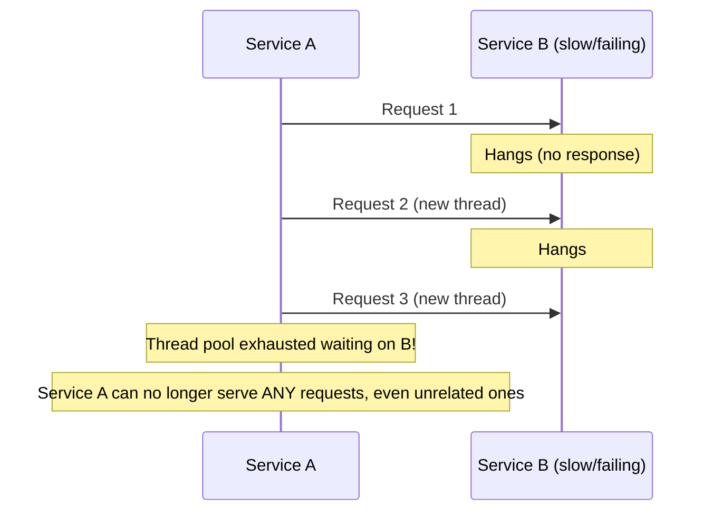
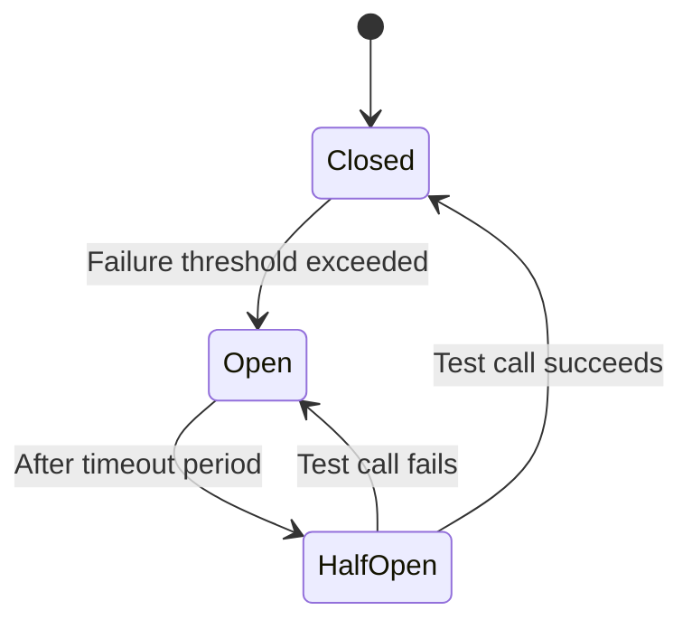
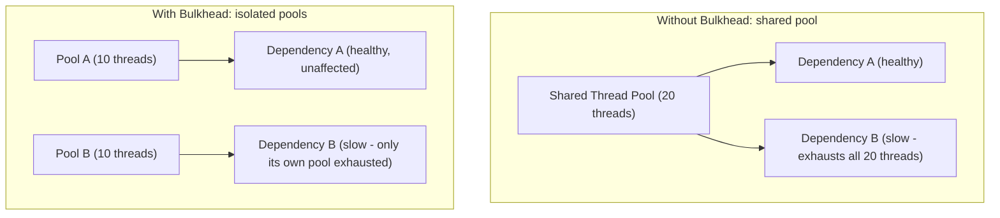
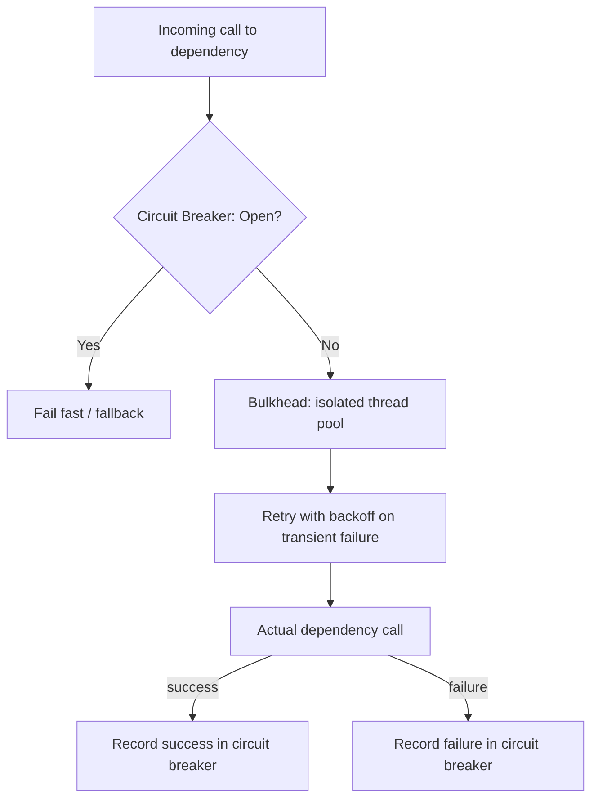

## Introduction

Chapter 35 flagged that microservices alone don't provide fault isolation — a slow or failing dependency can still cascade and take down its callers. This chapter covers the three patterns that actually deliver on that promise: **circuit breaker**, **bulkhead**, and **retry** — the last of this series' eight Java implementation chapters.

## The Cascading Failure Problem



If Service A makes synchronous calls to a slow/unresponsive Service B, and A's thread pool is limited (as it always is), enough concurrent calls to B waiting on responses will exhaust A's entire thread pool — at which point A can no longer serve *any* request, including ones that have nothing to do with B. A single failing dependency has now taken down an entire, otherwise-healthy service.

## Circuit Breaker

A circuit breaker monitors calls to a dependency and, after detecting a threshold of failures, **"opens" the circuit** — immediately failing (or falling back) subsequent calls without even attempting to contact the failing dependency, giving it time to recover and preventing the caller from wasting resources on calls likely to fail anyway.



- **Closed**: Normal operation — calls pass through to the dependency. Failures are tracked.
- **Open**: Calls fail immediately (or trigger a fallback) without contacting the dependency at all.
- **Half-Open**: After a timeout, a limited number of test calls are allowed through — success transitions back to Closed; failure returns to Open.

```java
public class CircuitBreaker {

    public enum State { CLOSED, OPEN, HALF_OPEN }

    private State state = State.CLOSED;
    private int failureCount = 0;
    private final int failureThreshold;
    private long lastFailureTime;
    private final long openTimeoutMillis;

    public CircuitBreaker(int failureThreshold, long openTimeoutMillis) {
        this.failureThreshold = failureThreshold;
        this.openTimeoutMillis = openTimeoutMillis;
    }

    public synchronized boolean allowRequest() {
        if (state == State.OPEN) {
            if (System.currentTimeMillis() - lastFailureTime > openTimeoutMillis) {
                state = State.HALF_OPEN;
                return true; // allow one test request through
            }
            return false; // still open, fail fast
        }
        return true; // CLOSED or HALF_OPEN test slot
    }

    public synchronized void recordSuccess() {
        failureCount = 0;
        state = State.CLOSED;
    }

    public synchronized void recordFailure() {
        failureCount++;
        lastFailureTime = System.currentTimeMillis();
        if (failureCount >= failureThreshold) {
            state = State.OPEN;
        }
    }
}
```

```java
public String callInventoryService(String sku) {
    if (!circuitBreaker.allowRequest()) {
        return getFallbackInventoryStatus(sku); // fail fast, don't even try
    }
    try {
        String result = inventoryClient.checkStock(sku);
        circuitBreaker.recordSuccess();
        return result;
    } catch (Exception e) {
        circuitBreaker.recordFailure();
        return getFallbackInventoryStatus(sku);
    }
}
```

**Why "fail fast" matters**: Without the circuit breaker, every call during Service B's outage would still consume a thread and wait for a timeout before failing — with it, calls fail (or fall back) essentially instantly, freeing up resources for other work and giving Service B breathing room to recover instead of being hammered with requests it can't handle anyway.

## Bulkhead

Named after ship compartments designed to contain flooding to one section — a bulkhead isolates resources (typically thread pools or connection pools) **per dependency**, so that one dependency's slowness can't exhaust resources needed to call other, entirely healthy dependencies.



```java
public class BulkheadExecutor {

    private final Map<String, ExecutorService> pools = new ConcurrentHashMap<>();

    public ExecutorService getPoolFor(String dependencyName, int poolSize) {
        return pools.computeIfAbsent(dependencyName,
                name -> Executors.newFixedThreadPool(poolSize));
    }

    public <T> Future<T> executeIsolated(String dependencyName, int poolSize, Callable<T> task) {
        ExecutorService pool = getPoolFor(dependencyName, poolSize);
        return pool.submit(task);
    }
}
```

```java
// Calls to Inventory and Payment services use separate thread pools -
// Inventory being slow cannot starve threads needed to call Payment.
Future<String> inventoryResult = bulkhead.executeIsolated("inventory", 10,
        () -> inventoryClient.checkStock(sku));
Future<String> paymentResult = bulkhead.executeIsolated("payment", 10,
        () -> paymentClient.charge(request));
```

## Retry (with Exponential Backoff and Jitter)

Retrying a failed call makes sense for transient failures (a brief network blip) — but naive immediate retries can worsen an already-struggling dependency by adding to its load right when it's least able to handle it.


```java
public <T> T retryWithBackoff(Callable<T> operation, int maxRetries) throws Exception {
    int attempt = 0;
    long baseDelayMillis = 100;

    while (true) {
        try {
            return operation.call();
        } catch (Exception e) {
            attempt++;
            if (attempt >= maxRetries) {
                throw e; // give up after max retries
            }
            long exponentialDelay = baseDelayMillis * (1L << attempt); // 100, 200, 400, 800...
            long jitter = ThreadLocalRandom.current().nextLong(exponentialDelay / 2);
            Thread.sleep(exponentialDelay + jitter);
        }
    }
}
```

**Why jitter matters**: If many clients all retry a failed dependency using the exact same fixed backoff schedule, they'll all retry again at the exact same moment — creating synchronized bursts of load that can repeatedly overwhelm a recovering dependency (a "retry storm"). Adding random jitter spreads retries out over time, smoothing the load rather than creating synchronized waves.

**Critical interaction with idempotency (Chapter 28)**: Retrying is only safe for idempotent operations. Retrying a non-idempotent operation (like a payment charge without an idempotency key) risks duplicating its effect — retry logic and idempotency design are inseparable in practice.

## Combining All Three



Production resilience libraries (like Netflix's Hystrix, historically, and its modern successor **Resilience4j** in the Java ecosystem) implement all three patterns together, typically as configurable decorators wrapped around a dependency call.

## Summary

- Circuit breakers detect repeated failures and "open" to fail fast, preventing wasted resources on calls likely to fail and giving a struggling dependency time to recover.
- Bulkheads isolate resource pools (like thread pools) per dependency, so one dependency's slowness can't exhaust resources needed for calls to other, healthy dependencies.
- Retries with exponential backoff and jitter handle transient failures without creating synchronized "retry storms" — and are only safe for idempotent operations.
- These three patterns combine to provide genuine fault isolation in a microservices architecture — the missing piece that turns "separately deployed services" into services that can actually withstand each other's failures.

---

## Interview Questions

### 1. Explain, step by step, how a cascading failure occurs when Service A makes synchronous calls to a slow Service B, without any resilience patterns in place.
**Answer:** Service A has a finite thread pool (or connection pool) used to handle incoming requests, some of which involve making an outbound synchronous call to Service B. If Service B becomes slow or unresponsive, each of Service A's threads handling a request that calls B will block, waiting for B's response (or a timeout) — as more concurrent requests to A each attempt to call the struggling B, more and more of A's limited threads become blocked waiting on B; if this continues long enough (and B remains unresponsive), A's entire thread pool can become fully exhausted, entirely occupied by threads stuck waiting on B — at this point, A can no longer accept or process *any* new incoming requests at all, including requests that have nothing to do with B, because there are simply no free threads left to handle them — a failure that originated entirely within B has now completely taken down A as well, and this can continue cascading to any service that itself depends on A.

**Follow-up:** *Why doesn't simply setting a reasonable timeout on Service A's calls to Service B fully solve this problem on its own?* — A timeout does bound how long each individual thread remains blocked waiting on B (preventing indefinite blocking), but it doesn't prevent the underlying problem of *repeated* calls to a *known-to-be-currently-failing* dependency continuing to consume resources (a thread blocked for even a bounded timeout duration, repeated across many concurrent requests during an extended B outage, can still exhaust A's thread pool if the timeout duration multiplied by the concurrent call volume exceeds A's pool capacity) — a circuit breaker specifically addresses this remaining gap by stopping calls to B *entirely* once it's clearly established that B is failing, rather than continuing to attempt (and wait out the timeout for) calls that are highly likely to fail anyway.

### 2. Walk through the three states of a circuit breaker and explain why the "Half-Open" state is necessary rather than simply transitioning directly from "Open" back to "Closed" after a fixed timeout.
**Answer:** In the Closed state, calls pass through normally to the dependency, with failures being tracked; once failures exceed a configured threshold, the breaker transitions to Open, where calls fail immediately (or trigger a fallback) without even attempting to contact the dependency, for a configured timeout period. After that timeout, rather than assuming the dependency has definitely recovered and jumping straight back to normal, full-volume Closed-state traffic, the breaker transitions to Half-Open, allowing only a small, limited number of test requests through to actually verify whether the dependency has genuinely recovered — if these test requests succeed, the breaker transitions to Closed (resuming normal traffic); if they still fail, it transitions back to Open for another timeout period. This Half-Open intermediate step is necessary because immediately resuming full traffic volume after a fixed timeout, without first verifying actual recovery, risks slamming a dependency that hasn't actually finished recovering yet with a full flood of traffic all at once — potentially causing it to fail again immediately, and the resulting immediate re-failure might not even be cleanly detected before significant, wasted load has already been sent.

**Follow-up:** *What would happen if the Half-Open state allowed many concurrent test requests through simultaneously, rather than just a small, limited number?* — This would risk essentially recreating the exact same "flood of full traffic hitting a not-yet-fully-recovered dependency" problem the Half-Open state's careful, limited-testing approach is specifically designed to avoid — if the dependency is only *partially* recovered (e.g., it can handle some load but not yet its full pre-failure volume), allowing many concurrent test requests through simultaneously could still overwhelm it and cause renewed failures, precisely why well-designed circuit breaker implementations specifically limit the Half-Open state to a small, controlled number of test requests (sometimes just one) rather than allowing full-volume traffic through immediately upon timeout expiration.

### 3. Why does a bulkhead pattern specifically address a different failure mode than a circuit breaker, even though both are resilience patterns aimed at preventing cascading failures?
**Answer:** A circuit breaker addresses the problem of *continuing to call a dependency that's already known to be failing*, stopping those calls to avoid wasting resources and to give the dependency recovery time — but it operates per-dependency and doesn't, by itself, prevent one dependency's *currently ongoing* slowness (before the circuit breaker's failure threshold has even been reached, or during the period calls are still being attempted) from consuming shared resources (like a shared thread pool) that are also needed for calls to *other, entirely unrelated and healthy* dependencies. A bulkhead specifically addresses this different, resource-isolation problem by proactively partitioning resources (thread pools, connection pools) into separate, isolated allocations *per dependency*, ensuring that even if one specific dependency is currently slow (whether or not its circuit breaker has yet tripped), its resource consumption is contained within its own dedicated pool and cannot exhaust the resources available for calling other, unrelated dependencies — the two patterns are complementary, addressing different aspects of the overall cascading-failure problem (stopping calls to a *known-bad* dependency, versus containing the *resource impact* of a currently-struggling dependency regardless of whether it's yet been definitively identified as failing).

**Follow-up:** *Could a system rely solely on circuit breakers without bulkheads, and still be reasonably resilient? What specific gap would remain?* — A system relying solely on circuit breakers would still be vulnerable during the specific window before a circuit breaker's failure threshold is reached — during this window, calls to the struggling dependency are still being attempted (and are consuming shared resources like threads while waiting on them, potentially for their full timeout duration each) precisely because the circuit hasn't yet tripped to Open; if the shared resource pool is exhausted during this "detection window" before the threshold is reached, other unrelated dependencies could still be starved of resources even with a well-configured circuit breaker in place — bulkheads close this specific gap by ensuring this detection-window resource consumption for one dependency is isolated and can't affect resources needed for other, unrelated dependencies, regardless of whether that specific dependency's circuit breaker has yet tripped.

### 4. Why is exponential backoff generally preferred over immediately retrying with a fixed, constant delay between attempts?
**Answer:** A fixed, constant retry delay (e.g., always retrying exactly 100ms after each failure) doesn't account for how long a dependency's underlying issue might actually take to resolve — for issues that persist for a longer duration (e.g., several seconds or longer), a fixed short delay results in many rapid, repeated retry attempts hitting the still-struggling dependency in quick succession, potentially adding further load precisely when the dependency is least able to handle it and needs relief, not additional pressure, to actually recover. Exponential backoff instead progressively increases the delay between successive retry attempts (e.g., 100ms, then 200ms, then 400ms, then 800ms) — this naturally reduces the rate of retry attempts over time for a persistently-failing dependency, giving it progressively more breathing room to recover as the outage continues, while still allowing for a relatively quick initial retry attempt for genuinely brief, transient failures that resolve almost immediately.

**Follow-up:** *Why is there typically a maximum cap placed on the exponential backoff delay, rather than letting it grow completely unbounded?* — Without a cap, the exponentially-growing delay would eventually become impractically, absurdly long (e.g., after enough failed attempts, the delay could grow to many minutes or even hours) — for most real-world use cases, there's a reasonable practical maximum delay beyond which further exponential growth provides no additional benefit and simply makes the client wait unnecessarily long even if the dependency has, in fact, already recovered well before that excessively long delay would have elapsed; capping the maximum backoff delay (e.g., "never wait longer than 30 seconds between retries, regardless of how many consecutive failures have occurred") balances the benefit of reduced retry pressure during genuine extended outages against the practical need to still retry at a reasonably responsive interval once the underlying issue has likely been resolved.

### 5. Explain the "retry storm" problem that jitter specifically addresses, using a concrete scenario involving multiple independent clients.
**Answer:** Imagine 1,000 independent client instances all simultaneously experience a failed call to the same dependency at roughly the same moment (e.g., due to a brief, dependency-wide blip) — if every one of these 1,000 clients uses the exact same, deterministic exponential backoff schedule (e.g., "always wait exactly 100ms, then retry"), all 1,000 clients will attempt their retry at almost exactly the same moment 100ms later, creating a large, synchronized burst/spike of simultaneous retry traffic hitting the dependency all at once — if the dependency was already struggling or only just beginning to recover, this synchronized flood of simultaneous retries (a "retry storm" or "thundering herd," directly analogous to concepts discussed in Chapters 8 and 9) could easily overwhelm it again, potentially causing another wave of failures, followed by another synchronized retry storm at the next backoff interval, and so on — a self-perpetuating cycle of synchronized failure. Adding random jitter (a small, randomized additional delay on top of the base exponential backoff value) spreads these 1,000 clients' actual retry attempts out over a wider window of time rather than all landing at exactly the same instant, smoothing the resulting load on the dependency into a more gradual, manageable trickle rather than a sudden, synchronized spike.

**Follow-up:** *Why might "full jitter" (where the actual delay is a fully random value between 0 and the calculated exponential backoff value, rather than the exponential value plus a smaller random amount) sometimes be preferred over the more modest jitter approach shown in this chapter's Java example?* — "Full jitter" spreads retry attempts across an even wider range of possible delay values (from zero up to the full calculated exponential backoff ceiling) rather than clustering them more narrowly around the exponential value with only a smaller amount of added randomness — this can provide even smoother, more evenly-distributed retry load spreading in scenarios with very large numbers of concurrent clients, at the cost of some individual retry attempts potentially happening sooner (closer to zero delay) than a pure, unmitigated exponential backoff schedule alone would suggest, representing a slightly different point on the trade-off between "spread retries out as smoothly and widely as possible" versus "still generally respect the intended exponential backoff progression's timing" — different jitter strategies (as documented in various published resilience-engineering research, notably AWS's own architecture blog posts on this exact topic) make slightly different trade-offs here depending on specific workload characteristics.

### 6. Why must retry logic be carefully coordinated with idempotency (Chapter 28), and what could go wrong if a system implements robust retry logic without ensuring the retried operations are idempotent?
**Answer:** Retry logic's fundamental assumption is that re-attempting a failed operation is a safe, reasonable thing to do — but this assumption only holds true if the operation being retried is idempotent (repeating it produces the same end effect as performing it once, per Chapter 28's definition); if a non-idempotent operation (like "charge this customer's credit card $50," without an idempotency key mechanism) is retried after an ambiguous failure (recall Chapter 28's core point: a timeout doesn't tell you whether the original attempt actually succeeded or not), a well-intentioned, correctly-implemented retry mechanism could inadvertently cause the operation's harmful side effect (the charge) to be duplicated — robust, well-engineered retry logic layered on top of a non-idempotent operation doesn't fix or prevent this risk at all; it can actually make the problem *more likely* to manifest in practice, since the retry logic is specifically designed to *ensure* the operation gets attempted again under exactly the ambiguous-failure conditions where this duplication risk is most acute.

**Follow-up:** *Does this mean every single operation that might ever be wrapped in retry logic must be made explicitly idempotent, with no exceptions?* — For operations with genuine, meaningful side effects (especially ones with real business consequences, like financial transactions or resource allocation), yes, essentially — idempotency is a practical prerequisite for retry logic to be safely applied; however, some operations are either already naturally idempotent by their nature (a pure read/query operation, or an operation using an inherently idempotent design like the versioned-update pattern from Chapter 28), in which case no *additional* explicit idempotency mechanism is needed beyond the operation's own inherent design — the key principle is that retry logic and idempotency must be considered *together* as a pair for any operation with real side effects, not that every single operation universally requires an explicit, separate idempotency-key mechanism regardless of its actual inherent nature.

### 7. In an interview, if asked to design resilient communication between a critical checkout service and a less-critical, "nice-to-have" recommendation service it calls to show "customers also bought" suggestions, how would you apply circuit breaker and fallback concepts?
**Answer:** You'd specifically wrap the call to the recommendation service in a circuit breaker, and critically, define a graceful, meaningful fallback behavior for when that circuit is open (or when the call otherwise fails/times out) — since the recommendation feature is explicitly "nice-to-have" rather than critical to completing a purchase, an appropriate fallback might be to simply render the checkout page *without* the "customers also bought" section at all (or show a generic, cached/static suggestion rather than a personalized one), rather than letting a failure or slowness in this non-critical dependency have any chance of blocking, delaying, or failing the actual, critical checkout completion flow itself — this directly demonstrates the practical value of combining circuit breakers with thoughtful fallback design: not just "fail fast" in the abstract, but "fail fast, and specifically degrade gracefully in a way that preserves the critical path's success," which is the actual, meaningful business goal these patterns serve.

**Follow-up:** *Would you also recommend a bulkhead specifically isolating the thread pool used for this recommendation service call, separate from the pool used for genuinely critical calls (e.g., payment processing) within the same checkout service?* — Yes, absolutely — this is precisely the scenario bulkheads are designed for: even with a circuit breaker in place, there's still some window (before the breaker trips, or during the Half-Open testing phase) where calls to the recommendation service could still be slow and consume shared thread pool resources; isolating the recommendation service's calls into their own dedicated, appropriately-sized (likely smaller) thread pool, separate from the pool used for critical operations like payment processing, ensures that even a temporarily slow-but-not-yet-circuit-broken recommendation service call can never consume resources that are needed to keep the actually-critical payment processing path fully functional and responsive — directly reinforcing why both patterns are typically applied together, not treated as alternative, either-or choices.

### 8. Why might a well-designed circuit breaker's failure threshold be based on a rolling percentage of failed calls over a recent time window, rather than a simple, fixed absolute count of consecutive failures?
**Answer:** A simple fixed count of *consecutive* failures (e.g., "trip the breaker after exactly 5 failures in a row") can be overly sensitive to brief, isolated failure clusters that don't actually reflect a genuinely sustained, ongoing problem — e.g., 5 unlucky, closely-timed but ultimately isolated transient failures interspersed among hundreds of otherwise entirely successful calls might trip the breaker unnecessarily, even though the dependency is actually healthy and performing well overall. A rolling-percentage-based threshold (e.g., "trip the breaker if more than 50% of calls in the last 10-second rolling window have failed, provided there's been a reasonable minimum volume of calls to make this percentage statistically meaningful") more accurately reflects genuine, sustained degradation in the dependency's actual overall health/success rate over a meaningful recent window, rather than being unnecessarily sensitive to a small number of possibly-coincidental, non-representative consecutive failures within an overall healthy call volume.

**Follow-up:** *Why does this approach specifically require a "reasonable minimum call volume" qualifier, rather than just tracking the raw percentage alone?* — Without a minimum volume requirement, a percentage-based threshold could be easily and misleadingly triggered by statistical noise during genuinely low-traffic periods — e.g., if only 2 calls have been made in the current rolling window and 1 of them happened to fail, that's technically a 50% failure rate, but this single data point is far too small a sample to reliably indicate genuine, sustained dependency degradation (compared to, say, 500 out of 1,000 calls failing, which represents the same 50% rate but with far greater statistical confidence that something is genuinely, meaningfully wrong) — requiring a minimum call volume before the percentage-based threshold logic is even evaluated prevents the circuit breaker from being triggered by essentially meaningless statistical noise during low-traffic periods.

### 9. A candidate implements retry logic that retries a failed call up to 5 times, but doesn't account for the fact that this specific call is itself wrapped by an upstream caller that also independently retries up to 3 times. What compounding problem could this create?
**Answer:** If both layers retry independently without coordination, a single underlying failure could result in the effective total number of actual attempts against the ultimately-failing dependency being multiplied across both retry layers (in the worst case, up to 5 × 3 = 15 total attempts for what the topmost caller perceives as just "one logical operation, retried up to 3 times") — this "retry amplification" problem means a dependency experiencing genuine distress could receive significantly more retry traffic than any single layer's retry configuration alone would suggest, potentially worsening an already-struggling dependency's load far beyond what was intended by either individual retry configuration considered in isolation, and making the actual, true retry behavior of the overall system much harder to reason about or predict from any single component's configuration alone.

**Follow-up:** *What's a general architectural principle or practice that helps avoid this specific retry-amplification problem in a system with multiple layers of service calls?* — A common guiding principle is to concentrate retry logic at a single, well-chosen layer (often the outermost, client-facing layer closest to the original request, or specifically at points explicitly designated as "retry boundaries") rather than having every single intermediate layer/service independently implement its own uncoordinated retry logic on top of calls that may already be wrapped by retries elsewhere in the call chain — some resilience frameworks and service meshes (as discussed in Chapter 35) also provide centralized, consistent retry policy configuration and enforcement specifically to avoid this kind of uncoordinated, amplifying retry behavior emerging from multiple independently-configured layers each making their own local, uncoordinated retry decisions without visibility into what other layers in the same call chain might also independently be doing.

### 10. Why does the combination of circuit breaker, bulkhead, and retry patterns represent "the missing piece" that turns microservices from merely "separately deployed" into "genuinely fault-isolated," directly connecting back to Chapter 34's discussion?
**Answer:** As Chapter 34 explicitly noted, simply splitting a system into separately-deployed microservices doesn't automatically provide fault isolation — a naive, synchronous call chain between services can still allow one service's failure to cascade and take down its callers, exactly as this chapter's opening cascading-failure scenario demonstrated, functionally similar to how a bug in one module could bring down an entire monolith. Circuit breakers specifically prevent continued, wasted calls to a known-failing dependency; bulkheads specifically prevent one dependency's resource consumption from starving calls to other, healthy dependencies; and properly-idempotency-paired retries handle transient failures gracefully without amplifying load or duplicating effects — together, these three patterns directly and specifically address the concrete mechanisms by which failures would otherwise cascade across service boundaries, actually delivering the fault-isolation benefit that's often assumed to come "for free" simply from choosing a microservices architecture, when in fact it requires this additional, deliberate engineering investment layered on top of the basic architectural decomposition to be genuinely realized in practice.

**Follow-up:** *Given this, would you say these three patterns are "optional enhancements" to a microservices architecture, or something closer to a "required minimum" for a production-grade system?* — For any production-grade microservices system with genuine reliability requirements, these patterns are much closer to a required minimum than an optional enhancement — without them, the system remains vulnerable to exactly the kind of cascading failure scenario this chapter opened with, meaning a single struggling dependency (which is a realistic, expected, and eventually inevitable occurrence in any sufficiently complex distributed system) could cause a far more severe, wide-reaching outage than that single dependency's own issue alone would otherwise warrant — treating these patterns as "nice-to-have, add them later if we have time" rather than a core, foundational part of the initial microservices architecture design is a common, genuine real-world mistake that this chapter's material directly argues against, reinforcing that choosing microservices (Chapter 34) implicitly commits a team to also properly implementing this kind of resilience engineering, not just handling the network communication and data-ownership aspects of the architectural decomposition alone.
