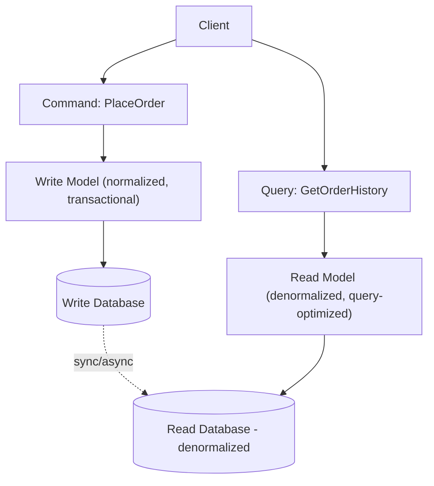
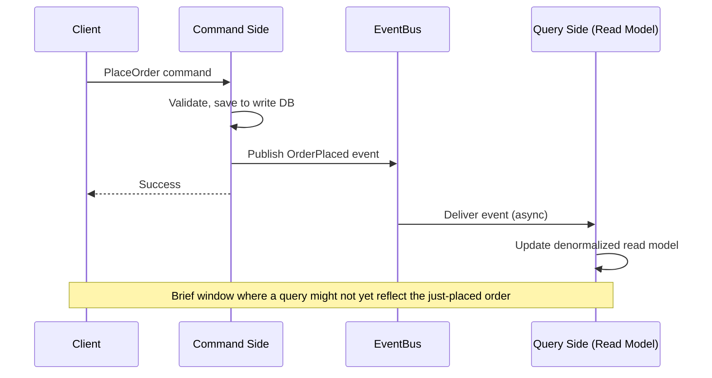

## Introduction

Most applications use the same data model for both reading and writing — the same database tables, the same entity classes, serving both "create an order" and "show me a customer's order history." **CQRS (Command Query Responsibility Segregation)** questions this default: what if reads and writes have such different needs that they deserve genuinely separate models?

## The Core Idea

CQRS splits an application into two distinct paths:

- **Commands**: Operations that change state (create, update, delete) — go through a **write model**, optimized for validating business rules and maintaining data integrity.
- **Queries**: Operations that read state — go through a separate **read model**, optimized purely for the specific shapes of data consumers actually need to display.



This is a direct application of a theme recurring throughout this series: reads and writes have fundamentally different scaling and optimization needs (Chapter 9's caching, Chapter 15's read replicas) — CQRS takes this further by allowing the read and write sides to use **entirely different data models**, and even entirely different database technologies (polyglot persistence, Chapter 13).

## Why Split Them?

In a traditional single-model system, the same entity class/table structure must serve both:
- **Write needs**: Enforcing invariants (e.g., "an order can't be shipped before payment"), normalized to avoid update anomalies, structured around business logic.
- **Read needs**: Often requiring denormalized, pre-joined, aggregated views tailored to specific UI screens (e.g., "show a dashboard combining order, customer, and shipping data in one view").

Forcing one model to serve both often means compromising on both — the write model gets awkward denormalized fields to speed up reads, or the read path requires expensive joins across a normalized schema on every single query. CQRS lets each side be optimized purely for its own concern.

## A Simple Java Illustration

```java
// Command side - focused on business logic and validation
@Service
public class OrderCommandService {

    private final OrderRepository orderRepository; // normalized write model

    public void placeOrder(PlaceOrderCommand command) {
        Order order = new Order(command.getUserId(), command.getItems());
        order.validate(); // enforce business invariants
        orderRepository.save(order);
        eventPublisher.publish(new OrderPlacedEvent(order)); // keeps read model in sync
    }
}

// Query side - a completely separate, denormalized, read-optimized model
@Service
public class OrderQueryService {

    private final OrderSummaryReadRepository readRepository; // denormalized read model

    public List<OrderSummaryView> getOrderHistory(String userId) {
        // Directly returns a pre-joined, UI-ready shape - no runtime joins needed
        return readRepository.findByUserId(userId);
    }
}
```

The `OrderSummaryReadRepository` might query an entirely different database (e.g., a document store or a dedicated read-replica with a denormalized schema) than the `OrderRepository`, kept in sync via events published whenever the write model changes — directly connecting to Chapter 32's event-driven architecture.

## CQRS and Eventual Consistency

Since the read model is typically synchronized from the write model **asynchronously** (via events), there's an inherent, unavoidable lag — a write might not be immediately reflected in the read model. This is the same eventual consistency trade-off from Chapters 17-19, applied specifically to the relationship between a system's own write and read paths, not just across replicas of the same model.



This has a real UX implication: a user who places an order and immediately views their order history might briefly not see it — the same "read-your-writes" concern discussed in Chapter 15, now applying specifically to the CQRS read-model-lag scenario, and requiring similar mitigations (e.g., the command side returning enough data for the client to optimistically render the new order immediately, without waiting on the read model to catch up).

## CQRS Doesn't Require Two Databases

A common misconception: CQRS *implies* separate databases for reads and writes. It doesn't — a simpler form of CQRS can use the same database, just with separate model/query classes on the read and write sides (e.g., a rich, validating `Order` write entity vs. a simple, flat `OrderSummaryDto` read query using a different, optimized SQL query against the same underlying tables). The *fully separated, eventually-consistent, separate-database* version is a more advanced, higher-complexity variant, appropriate specifically when read and write scaling/modeling needs have diverged enough to justify it.

## When CQRS Is Worth It

- **Significant read/write asymmetry**: A system with orders of magnitude more reads than writes (or vice versa) benefits from scaling and optimizing each independently.
- **Complex reporting/dashboard needs**: When read-side requirements involve complex aggregations across multiple entities that would be awkward or expensive to compute from a normalized write model on every query.
- **Combined with Event Sourcing (Chapter 38)**: CQRS pairs especially naturally with event sourcing, where the write side stores an event log, and one or more read models are built as materialized projections of that log.

**When it's overkill**: For a simple CRUD application with modest, roughly symmetric read/write needs, CQRS's added complexity (two models to maintain, eventual consistency between them, synchronization logic) is rarely justified — this is a genuinely advanced pattern, not a default architectural starting point.

## Summary

- CQRS splits an application's write path (commands, business logic, invariant enforcement) from its read path (queries, denormalized, UI-optimized views), allowing each to be modeled and scaled independently.
- The read model is typically synchronized from the write model asynchronously via events, introducing eventual consistency between what was written and what queries reflect.
- CQRS doesn't require two separate databases — a simpler form can use separate model classes against the same underlying data store, with full read/write database separation reserved for cases with genuinely divergent scaling needs.
- CQRS is a genuinely advanced pattern, best justified by significant read/write asymmetry, complex reporting needs, or pairing with event sourcing — not a default choice for simple CRUD systems.

---

## Interview Questions

### 1. What problem does CQRS solve that a traditional single-model (same model for reads and writes) architecture struggles with?
**Answer:** A traditional single-model architecture uses the same entity/table structure to serve both write operations (which need to enforce business rules, invariants, and normalized data integrity) and read operations (which often need denormalized, pre-aggregated, UI-specific views combining data from multiple entities) — these two needs frequently pull the data model in opposite directions: optimizing for write-side correctness/normalization tends to make reads require expensive runtime joins/aggregations, while optimizing for read-side query performance (e.g., adding denormalized fields) tends to complicate the write side's ability to cleanly enforce invariants and avoid update anomalies. CQRS resolves this tension by explicitly maintaining separate models for each concern, allowing the write model to be optimized purely for correctness/business-logic enforcement and the read model to be optimized purely for query performance and UI-friendly data shapes, without either concern compromising the other.

**Follow-up:** *Why might this tension become more pronounced specifically as a system's reporting/dashboard requirements grow more complex over time?* — As a system accumulates more complex reporting needs (e.g., dashboards combining data from many different entities with various aggregations, filters, and sorts), the number and complexity of runtime joins/computations required to serve these reads from a purely normalized write model grows correspondingly — at some point, the read-side performance cost and query complexity of continuously computing these views on-demand from the write model becomes significant enough that maintaining a separate, pre-computed/denormalized read model (updated asynchronously as the write model changes) becomes a clearly worthwhile trade-off, which is precisely the scenario CQRS is designed to address.

### 2. Why is it a misconception that CQRS necessarily requires two separate physical databases?
**Answer:** The core principle of CQRS is the *separation of responsibility* between command (write) and query (read) models — this can be implemented at different levels of physical separation: a simpler form of CQRS can use entirely separate model/service classes (a rich, validating write entity class versus a simple, flat, read-optimized query/DTO class) while still querying and writing to the exact same underlying physical database and tables, simply using different queries/mapping logic tailored to each specific concern; a more advanced, fully-separated form additionally uses genuinely separate physical databases (potentially even different database technologies) for the read and write sides, synchronized asynchronously via events. The "two separate databases" version is a valid and sometimes necessary implementation of CQRS's principles, but it represents one end of a spectrum of possible implementations, not a mandatory, defining requirement of the pattern itself.

**Follow-up:** *What specific benefit does the simpler, same-database version of CQRS provide over a traditional single-model approach, if it doesn't get the scaling/technology-independence benefits of a fully separate read database?* — Even without physical database separation, explicitly separating the read and write *models/code* (rather than the physical storage) still provides meaningful benefits: the write-side model/code can remain focused purely on business logic, validation, and invariant enforcement without being cluttered or compromised by read-specific concerns (like specific UI display formatting or denormalized convenience fields), and the read-side code can use whatever specific, optimized queries or projections best serve each particular query need, without needing to be constrained by or coupled to the specific object/entity structure the write side uses internally — this cleaner separation of concerns and reduced coupling between distinct responsibilities remains valuable even without the additional (and more complex) benefit of independent physical scaling that full database separation provides.

### 3. Explain why CQRS introduces eventual consistency between the write and read sides, and describe a concrete user-facing symptom this can cause if not properly handled.
**Answer:** In the fully-separated form of CQRS, the read model is built and kept up to date by asynchronously consuming events published whenever the write model changes (directly connecting to Chapter 32's event-driven architecture) — since this synchronization happens asynchronously, there's an inherent, unavoidable time gap between when a write is committed on the command side and when that same change has actually been processed and reflected in the separately-maintained read model. A concrete user-facing symptom: a user submits a "place order" command, receives a success confirmation, and is then immediately redirected to a page that queries the (separate, asynchronously-updated) read model for their order history — if the read model hasn't yet processed the corresponding "OrderPlaced" event by the time this query happens, the user might briefly not see their own, just-placed order in their order history, creating a confusing "did my order actually go through?" experience, directly analogous to the "read-your-writes" consistency problem discussed in Chapter 15, but now occurring specifically between a single system's own write and read models rather than across database replicas.

**Follow-up:** *What's a practical mitigation for this specific symptom, drawing on techniques discussed elsewhere in this series?* — Similar to the read-your-writes mitigation discussed in Chapter 15 and 19, the command side's success response can include enough information about the just-created entity (e.g., the full new order details) for the client application to optimistically render that information immediately, without needing to wait for or depend on a subsequent read-model query to reflect it — alternatively, some systems specifically route a user's own immediate post-write reads to the write-side model directly (bypassing the eventually-consistent read model for that specific, narrow window) or track a "read your own writes" marker similar to the mechanism described in Chapter 19, ensuring the specific user who just made the change sees it reflected immediately, even while other users' reads continue to rely on the normal, asynchronously-updated read model.

### 4. Why does CQRS pair particularly naturally with Event Sourcing (previewed here, detailed in Chapter 38)?
**Answer:** Event sourcing stores an entity's state as a complete, ordered sequence of events representing everything that has ever happened to it, rather than just its current state directly — this event log is naturally and precisely the same kind of "stream of changes" that a CQRS read model needs to consume in order to build and continuously update its own denormalized projection(s) of the data; in fact, with event sourcing, the write side's *natural, primary* representation of data already *is* an event stream, making it a particularly clean, natural fit to have one or more separate read-side "projections" simply subscribe to and continuously process this same event stream to build whatever specific denormalized views each read use case needs — rather than CQRS needing some separate, additional mechanism to detect and publish "what changed" events from a traditional (non-event-sourced) write model, event sourcing's fundamental data model already provides exactly this event stream as its core, primary artifact.

**Follow-up:** *Does this mean CQRS requires event sourcing, or event sourcing requires CQRS, to be used effectively?* — No, they are genuinely independent, separable patterns that happen to combine particularly well together — CQRS can be implemented without event sourcing (e.g., using a traditional write model that publishes explicit "change" events via a mechanism like database change-data-capture, or simply publishing domain events explicitly within the command-handling code, as shown in this chapter's Java example, without necessarily storing the *entire* history as the system of record) — and conversely, event sourcing can be used with a more traditional, unified read/write model that simply replays events to reconstruct current state on demand for both reading and writing, without necessarily maintaining a separate, continuously-updated read-optimized projection — but the natural synergy between the two (event sourcing provides a clean event stream; CQRS's read side naturally wants to consume exactly that kind of stream) is a major, common reason the two patterns are frequently adopted and discussed together in practice.

### 5. A candidate proposes CQRS for a simple internal admin tool with roughly equal, modest read and write traffic (a few hundred operations per day total). Why would you push back on this choice?
**Answer:** CQRS's core justification rests on genuine, significant asymmetry or complexity differences between read and write needs (Chapter 37's stated criteria: significant read/write traffic asymmetry, complex reporting/aggregation needs, or a natural pairing with event sourcing) — a simple internal admin tool with modest, roughly symmetric read/write volume and presumably straightforward CRUD-style data needs doesn't exhibit any of these justifying characteristics; introducing CQRS's added complexity here (maintaining two separate models, handling eventual consistency between them if using separate databases, or at minimum maintaining separate read/write code paths even without database separation) would impose real, ongoing engineering and cognitive overhead without a corresponding, genuine benefit — this is a clear instance of applying an advanced pattern where a simpler, traditional single-model CRUD approach would serve the actual, modest requirements perfectly well, echoing this series' recurring theme (Chapters 7, 30, 34) of matching architectural complexity to genuine, demonstrated need rather than defaulting to sophisticated patterns for their own sake.

**Follow-up:** *What specific, concrete change in this admin tool's requirements would make CQRS a more genuinely justified choice?* — If the admin tool's reporting needs grew substantially more complex (e.g., needing to display rich, multi-entity dashboards with various aggregations that would require expensive, awkward joins against a normalized write model), or if its read traffic grew dramatically disproportionate to its write traffic (e.g., becoming a widely-used internal reporting/analytics tool read by hundreds of employees continuously, while writes remained rare and occasional) — either of these changes would introduce the kind of genuine read/write asymmetry or complexity divergence that would make investing in CQRS's added complexity a well-justified, need-driven architectural decision, rather than premature or unnecessary over-engineering for the tool's original, simpler requirements.

### 6. Why might CQRS specifically improve a system's ability to scale reads and writes independently, beyond what a simple read-replica approach (Chapter 15) alone provides?
**Answer:** A simple read-replica approach still uses the *same underlying data model/schema* for both the primary (write) and replica (read) databases — it improves read *throughput* (by distributing read load across multiple replica instances) but doesn't allow the read side's actual data *model/shape* to differ from the write side's model at all; if the read side's actual query needs require a fundamentally different, denormalized shape than the write side's normalized schema, read replicas alone don't help with that specific modeling mismatch, only with distributing read query *volume*. CQRS goes further by allowing the read side to use an entirely different data model/shape (and potentially different database technology entirely) specifically optimized for its query patterns — this means CQRS can address both throughput scaling (similar to what read replicas provide) *and* the more fundamental data-modeling mismatch between normalized write needs and denormalized read needs simultaneously, which a same-schema read-replica approach alone cannot address.

**Follow-up:** *Could a system reasonably combine CQRS with read replicas, rather than treating them as alternative, competing approaches?* — Yes, very reasonably — a system could implement CQRS's separate read model, and then *additionally* apply read replication (Chapter 15) specifically to that separate read database if its query volume alone (independent of any data-modeling concerns) grows large enough to also benefit from horizontal read scaling across multiple replica instances of that read-optimized database — these two techniques address genuinely different, complementary concerns (data-model/shape mismatch, addressed by CQRS; raw read query volume/throughput, addressed by replication) and can be layered together within the same overall architecture rather than being mutually exclusive alternative approaches to read scaling.

### 7. Why does a well-designed CQRS command side typically return a success/failure result (and perhaps the resulting entity's ID), rather than returning the full, richly-detailed state of the entity after the write?
**Answer:** Since CQRS explicitly separates the write (command) responsibility from the read (query) responsibility, having the command side also construct and return a full, rich, denormalized representation of the resulting entity (the kind of shape the *read* side is specifically responsible for producing) would blur this intended separation of concerns and potentially duplicate read-side projection/formatting logic within the command side's codebase — a cleaner, more disciplined CQRS implementation typically has the command side return only the minimal information needed to confirm success/failure (and perhaps a newly-created entity's ID, so the client knows what to subsequently query for), leaving the actual, full read-optimized representation to be explicitly fetched via a separate, dedicated query call to the query side once needed — maintaining a clean, principled boundary between the two responsibilities rather than having the command side informally take on some of the query side's formatting/projection responsibilities as a shortcut.

**Follow-up:** *Doesn't this stricter separation seem to work against the earlier-discussed mitigation for the "read-your-writes" UX problem, which suggested having the command response include enough data for optimistic client-side rendering?* — There's a genuine, real tension here worth acknowledging explicitly — pure CQRS purism would suggest strict separation (command returns minimal confirmation; client must separately query for full details), while pragmatic UX considerations sometimes favor having the command response include enough data to avoid the read-model-lag UX problem; in practice, many real-world CQRS implementations make a deliberate, pragmatic trade-off here — having the command response include *some* additional data specifically to support good client-side UX (like optimistic rendering) is a reasonable, common pragmatic compromise, as long as the team is deliberate and consistent about it, rather than either dogmatically enforcing strict separation at the cost of poor UX, or allowing the command side to gradually, informally accumulate more and more read-side-style responsibilities without any clear, deliberate boundary at all.

### 8. In a system design interview, if asked to design a high-traffic news/content platform (many more reads than writes — millions of readers, comparatively few content publishers), how would you justify recommending CQRS?
**Answer:** You'd point out that this platform exhibits exactly the kind of significant read/write asymmetry that CQRS is specifically well-suited to address — the write side (content publishers creating/editing articles) has comparatively low volume and can be optimized around correctness, editorial workflow, and content-validation business logic without needing to worry about extreme scale; the read side (millions of readers browsing, searching, and viewing articles) has vastly higher volume and very different needs — likely requiring a denormalized, heavily-cached, possibly full-text-search-optimized (Elasticsearch, perhaps) read model specifically tailored for fast content delivery and discovery at massive scale, completely independent of and unconstrained by whatever specific data model/technology best serves the publishing/editorial write-side workflow. You'd propose the write side publishes events whenever content is created/updated/published, and a separate read-model pipeline consumes these events to build and continuously update the actual reader-facing content delivery data store(s) — allowing each side to scale and evolve independently according to its own, very different actual requirements.

**Follow-up:** *Would you propose a single, unified read model for this platform, or might multiple different read models make sense here?* — Multiple different, purpose-specific read models likely make sense here — for example, one read model optimized specifically for full-text search/discovery (likely backed by a search-specific technology like Elasticsearch), another optimized for fast, simple direct article retrieval by ID/URL (likely a simple, heavily-cached key-value or document store), and perhaps another specifically for generating personalized "recommended articles" feeds (potentially involving more complex, precomputed recommendation data) — CQRS doesn't restrict a system to exactly one single read model; multiple, independently-optimized read-side projections, each tailored to a genuinely distinct query/access pattern, are a natural and common extension of the core CQRS principle when a system has multiple, genuinely different read-side use cases that would each benefit from their own specifically-tailored data model/technology.

### 9. Why might introducing CQRS actually increase the operational/debugging complexity of a system in ways that go beyond just "there are now two models to maintain"?
**Answer:** Beyond the straightforward cost of building and maintaining two separate models/code paths, CQRS (particularly its fully-separated, asynchronously-synchronized form) introduces genuine distributed-systems-style debugging challenges directly analogous to those discussed in Chapter 32's event-driven architecture section — when a discrepancy is observed between what was written and what a query returns, diagnosing the root cause requires tracing through the asynchronous event-publishing and read-model-updating pipeline (was the event published correctly? Was it consumed and processed correctly by the read-model updater? Is there a bug in the read-model's specific projection logic?) rather than simply inspecting a single, unified data model/database directly — this kind of "is the discrepancy caused by A, B, or C stage of an asynchronous pipeline" debugging is genuinely more complex than debugging a traditional single-model system, where the same underlying data being both written and immediately read from the exact same place eliminates this entire category of potential synchronization-related bugs and corresponding debugging complexity.

**Follow-up:** *Does this added debugging complexity argue against ever using CQRS, given these genuine costs?* — No — it argues for CQRS being a deliberate, need-justified architectural choice (as emphasized throughout this chapter) rather than a default, casually-applied pattern; for systems with genuine, significant read/write asymmetry or complex reporting needs that CQRS specifically addresses well, this added debugging/operational complexity is a reasonable, worthwhile cost to accept in exchange for the genuine architectural and scaling benefits CQRS provides for those specific circumstances — but it does mean teams should go into a CQRS adoption with clear, honest awareness of this added complexity cost (similar to microservices' costs discussed in Chapter 34), ensuring they also invest in the observability/tracing tooling (Chapter 42) needed to actually debug and operate this more complex, asynchronous architecture effectively in production, rather than adopting the pattern without adequately planning for its genuine operational implications.

### 10. Why is "CQRS" sometimes conflated with "having a read replica," and what specific, precise distinction would you draw to correct this conflation in an interview setting?
**Answer:** Both patterns involve some notion of "a separate thing to read from, distinct from where writes happen," which can superficially seem similar — but the precise, important distinction is that a read replica (Chapter 15) uses the *exact same data model/schema* as the primary write database, simply providing additional read *capacity* by copying that same-shaped data to additional nodes; CQRS's read model, by contrast, can use a *genuinely different data model/shape* entirely (different tables/schema, potentially different database technology altogether, structured specifically around read-side query needs rather than mirroring the write side's structure at all) — the key distinguishing question is: "is the read-side data structured identically to the write-side data (just physically copied for read scaling), or is it a genuinely different, independently-designed model/shape specifically optimized for read-side query patterns?" — the former is simply read replication; the latter, specifically-different-model characteristic is what actually defines CQRS.

**Follow-up:** *Could a system use read replicas as part of its implementation of CQRS's read side, and if so, how would you describe that combined architecture precisely?* — Yes — as discussed in an earlier question, a system could implement CQRS's separate, differently-modeled read database, and then apply read replication *to that specific CQRS read database* if its read query volume alone also warrants horizontal scaling across multiple replica instances; in this combined architecture, you'd precisely describe it as: "CQRS provides the separate, differently-shaped read model/database; read replication is then applied as an additional, complementary scaling technique specifically to that CQRS read database, to handle its own read query volume across multiple replica instances" — clearly distinguishing the two techniques' distinct roles (data-model separation vs. read-throughput scaling) even when they're combined together within the same overall system, rather than treating them as the same underlying concept or technique.
