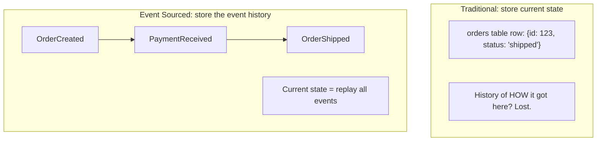
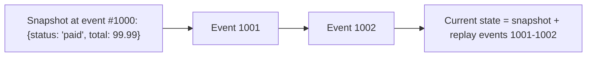

## Introduction

Every system covered so far in this series stores **current state** — an `orders` table with a `status` column that gets overwritten as an order progresses. **Event sourcing** proposes something different: store the complete, ordered sequence of events that led to that state, and derive current state (and anything else you might need) by replaying them.

## Traditional State Storage vs Event Sourcing



In traditional storage, once an order's status changes from "paid" to "shipped," the fact that it was ever "paid" is simply overwritten and gone (unless separately logged elsewhere). In event sourcing, `OrderCreated`, `PaymentReceived`, and `OrderShipped` are each permanently, immutably recorded — current state is a *derived, computed view*, not the primary source of truth.

## How Current State Is Derived

```java
public class Order {
    private String orderId;
    private OrderStatus status;
    private BigDecimal totalAmount;
    private List<OrderItem> items = new ArrayList<>();

    // Reconstruct current state by replaying every event from the beginning
    public static Order replay(List<OrderEvent> events) {
        Order order = new Order();
        for (OrderEvent event : events) {
            order.apply(event);
        }
        return order;
    }

    private void apply(OrderEvent event) {
        if (event instanceof OrderCreatedEvent e) {
            this.orderId = e.getOrderId();
            this.items = e.getItems();
            this.status = OrderStatus.CREATED;
        } else if (event instanceof PaymentReceivedEvent e) {
            this.totalAmount = e.getAmount();
            this.status = OrderStatus.PAID;
        } else if (event instanceof OrderShippedEvent e) {
            this.status = OrderStatus.SHIPPED;
        }
        // Each event type has a well-defined effect on the aggregate's state
    }
}
```

Each event has a defined effect (an "apply" function) on the entity's (often called an **aggregate**, borrowing Domain-Driven Design terminology) in-memory state — replaying the full event history from the beginning reconstructs current state deterministically, every time, from the same immutable source of truth.

## Why Store Events Instead of State?

- **Complete audit trail, by construction**: Every change is permanently recorded with full context — not bolted on afterward via a separate audit log (echoing Chapter 32's discussion of EDA's natural auditability).
- **Temporal queries**: "What did this order look like at 3 PM yesterday?" is simply "replay events up to that timestamp" — nearly impossible to answer accurately with traditional current-state-only storage.
- **Debugging and root-cause analysis**: When something goes wrong, you have the exact, complete sequence of what happened, not just the final (possibly confusing) end state.
- **Natural fit with CQRS (Chapter 37)**: The event log is the write-side source of truth; one or more read models are built as projections of it.
- **Enables reprocessing**: If business logic changes (e.g., a new way of calculating loyalty points), you can replay historical events through the *new* logic to retroactively compute what the new logic would have produced — directly connecting to Chapter 33's Kappa Architecture discussion.

## Snapshots: Solving the Replay Performance Problem

For a long-lived entity with thousands of events, replaying the entire history from the beginning every time you need current state becomes slow. **Snapshots** solve this: periodically save the computed current state at a specific point, and future reconstructions only need to replay events *since* that snapshot.



```java
public Order loadOrder(String orderId) {
    Snapshot snapshot = snapshotStore.getLatest(orderId); // e.g., every 100 events
    List<OrderEvent> eventsSinceSnapshot = eventStore.getEventsAfter(orderId, snapshot.getVersion());
    Order order = snapshot != null ? snapshot.toOrder() : new Order();
    for (OrderEvent event : eventsSinceSnapshot) {
        order.apply(event);
    }
    return order;
}
```

## Challenges of Event Sourcing

- **Event schema evolution**: Old events, once written, are immutable — but business logic and event structures evolve. Handling old event versions gracefully (upcasting old event formats to new ones during replay) is an ongoing, non-trivial discipline, directly echoing Chapter 32's schema evolution discussion, but with higher stakes since you can never simply "fix" a historical event.
- **Querying is harder**: "Show me all orders currently in 'shipped' status" isn't a simple query against an event log — this is precisely why event sourcing is almost always paired with CQRS's separate, queryable read model/projection.
- **Eventual consistency for read models**: As discussed in Chapter 37, if a read model is a separate projection, it lags slightly behind the write-side event log.
- **Steeper learning curve**: Thinking in terms of events and replaying state is a genuine mental model shift for teams used to CRUD-style current-state storage — not a decision to make lightly or apply universally.
- **Storage growth**: An unbounded, ever-growing event log requires a real, deliberate storage/archival strategy over the long term (though this is generally a solvable, well-understood problem, not a fundamental blocker).

## Real-World Usage

- **Financial ledgers**: A bank account's balance is naturally, traditionally computed as the sum of all transactions (deposits and withdrawals) — a textbook, real-world example of event sourcing that predates the term itself by centuries (double-entry bookkeeping).
- **Version control systems (Git)**: A repository's current state is derived by replaying/applying a sequence of commits — conceptually a form of event sourcing applied to source code.
- **Kafka-based systems (Chapter 30)**: Kafka's persistent, replayable log is a natural infrastructure fit for implementing event sourcing at scale.
- **E-commerce order management**: Where the full lifecycle history of an order (created, paid, shipped, returned, refunded) has genuine business and compliance value beyond just knowing the current status.

## Summary

- Event sourcing stores the complete, immutable sequence of events that led to an entity's current state, rather than storing just that current state directly — current state becomes a derived, replayable view.
- This provides a natural, complete audit trail, enables temporal queries, and allows retroactive reprocessing of historical events through updated business logic.
- Snapshots solve the performance problem of replaying an ever-growing event history from the beginning on every read.
- Event sourcing pairs naturally with CQRS, since querying an event log directly is awkward — a separate, queryable read model/projection is almost always needed alongside it.
- Real-world precedents include financial ledgers (double-entry bookkeeping) and Git — event sourcing is a genuine, powerful pattern, but with a real learning curve and schema-evolution discipline requirement that shouldn't be adopted without a specific, justifying need.

---

## Interview Questions

### 1. Explain the fundamental difference between traditional current-state storage and event sourcing, and why this difference specifically enables temporal queries ("what did this look like at time T?").
**Answer:** Traditional current-state storage overwrites data as it changes — an order's `status` field is updated in place from "paid" to "shipped," with no inherent record of what the previous value was or when the change occurred, unless a separate mechanism (like an explicit, bolted-on audit log) is built specifically to capture this history alongside the primary current-state storage. Event sourcing instead treats each individual change as a permanent, immutable, timestamped event appended to a log — current state is never directly stored as the primary source of truth at all; it's always a derived, computed result of replaying events. This makes temporal queries a natural, direct capability rather than requiring separate infrastructure: to answer "what did this order look like at 3 PM yesterday," you simply replay all events with a timestamp at or before 3 PM yesterday and stop there — the same fundamental replay mechanism used to compute *current* state (replay all events) is trivially extended to compute state *as of any specific point in time* (replay events up to that point), which is fundamentally impossible to reconstruct accurately from traditional current-state-only storage that has already overwritten and lost prior values.

**Follow-up:** *Why is it "fundamentally impossible" (not just "harder") to accurately reconstruct historical state from traditional current-state storage, even with a separately-maintained audit log bolted on afterward?* — A separately-maintained audit log, if implemented rigorously and consistently, *could* theoretically capture enough information to reconstruct historical state — the more precise point is that this requires the audit log to be treated as comprehensively and rigorously as event sourcing treats its event log as the actual, primary source of truth; in practice, bolted-on audit logs are frequently incomplete, inconsistently applied across all code paths that modify data (someone forgets to log a specific type of change), or not designed with the specific intent of enabling accurate state reconstruction — event sourcing's discipline of making the event log itself the *primary, only* source of truth (rather than an optional, secondary afterthought) is what actually guarantees this temporal-query capability is reliably, comprehensively available, not merely theoretically possible if a parallel audit system happens to have been implemented with sufficient rigor.

### 2. Why does event sourcing require a snapshotting mechanism for long-lived entities, and how does a snapshot specifically improve read performance?
**Answer:** Without snapshotting, reconstructing an entity's current state requires replaying its *entire* event history from the very beginning, every single time that entity needs to be loaded — for a long-lived entity that has accumulated thousands or millions of events over its lifetime, this replay process becomes increasingly slow and computationally expensive as the event count grows, potentially making read/load operations impractically slow for older, more event-heavy entities. A snapshot captures and persists the fully-computed state of an entity at a specific point (e.g., after every 100 events), allowing future loads to start from that pre-computed snapshot state and only need to replay the (typically much smaller number of) events that have occurred *since* that snapshot was taken, rather than replaying the entire history from the very beginning every time — dramatically reducing the number of events that need to be replayed for any given load operation, directly improving read performance for entities with substantial event history.

**Follow-up:** *What determines an appropriate snapshotting frequency (e.g., every 100 events vs. every 10 events), and what's the trade-off involved?* — More frequent snapshotting (e.g., every 10 events) means less replay work needed on each individual load (since fewer events accumulate between snapshots), improving read/load latency, but at the cost of more frequent snapshot-creation overhead and increased storage consumption for the snapshots themselves; less frequent snapshotting (e.g., every 1000 events) reduces this snapshot-creation overhead and storage cost, but means more events need to be replayed on each load, increasing read latency — the right frequency depends on the specific entity's typical event-accumulation rate and the acceptable read-latency threshold for that specific system, representing a genuine, tunable trade-off similar in spirit to other caching/optimization trade-offs discussed throughout this series (e.g., Chapter 10's LRU/LFU tuning).

### 3. Why is event sourcing almost always paired with CQRS (Chapter 37) in practice, rather than being used as a standalone pattern with direct queries against the event log?
**Answer:** An event log's natural structure (an ordered sequence of individual change events) is fundamentally awkward and inefficient for answering typical, real-world query needs like "show me all orders currently in 'shipped' status" or "what's the total revenue this month" — answering these queries directly against a raw event log would require replaying and filtering through potentially the *entire* event history for *every single entity* in the system on every single query, which is computationally prohibitive and completely impractical at any meaningful scale. CQRS's read model provides exactly the missing piece: a separate, continuously-updated, denormalized, directly-queryable projection built specifically to answer these kinds of common read/query needs efficiently — event sourcing provides an excellent, comprehensive *write-side* source of truth, but genuinely needs a complementary, purpose-built read-side query mechanism (which is precisely what CQRS's read model provides) to be practically usable for real-world application query needs, rather than event sourcing alone being a complete, sufficient architecture on its own.

**Follow-up:** *Could a system theoretically use event sourcing without any CQRS-style separate read model at all, and if so, what would the practical limitation be?* — Theoretically, yes — a system could rely entirely on replaying events (of a single specific entity, or with more elaborate but expensive filtering/scanning across all entities' events) to answer every single query need directly, without maintaining any separate, pre-computed read projection at all; the practical limitation is that this approach would only remain viable for very simple query needs (e.g., "get the current state of this one specific, known entity by its ID," which is a reasonably efficient, bounded replay operation) — any query needing to search, filter, or aggregate *across* many different entities (which is the vast majority of typical, real-world application query needs) would require prohibitively expensive, essentially full-log-scanning operations on every single query, making a genuinely usable, general-purpose querying capability practically impossible without introducing some form of separate, purpose-built read projection — which is, again, exactly what CQRS's read-model concept specifically provides.

### 4. Why does event schema evolution carry higher stakes in an event-sourced system compared to schema evolution in a traditional event-driven architecture (Chapter 32) using transient messages?
**Answer:** In a traditional event-driven system using transient messages (like RabbitMQ, Chapter 30), an old event, once consumed and processed, is simply gone — if a schema mistake is discovered, you generally only need to worry about correctly handling *future* events going forward, since past events are no longer stored anywhere requiring ongoing compatibility. In an event-sourced system, past events are the *permanent, immutable source of truth* that must continue to be correctly, accurately replayable indefinitely into the future, potentially for the entire lifetime of the system — if an old event's schema needs to be reinterpreted correctly by a newer version of the "apply" logic (because the business logic or event structure has evolved since that old event was originally written), that old event can *never simply be edited or deleted* to fix a schema mismatch the way you might correct a bug in a traditional current-state database record; instead, you need robust "upcasting" logic that can correctly translate/interpret old event schema versions into whatever the current replay logic expects, and this compatibility burden persists forever, for the full historical depth of the event log, not just for a brief window until old, already-processed messages have naturally aged out of a transient queue.

**Follow-up:** *What's a concrete strategy for managing this ongoing, indefinite backward-compatibility burden in event-sourced systems?* — A common approach involves explicit event versioning (e.g., `OrderCreatedEventV1`, `OrderCreatedEventV2`) combined with dedicated "upcaster" functions that know how to transform an older version's data into the shape the current, latest version's "apply" logic expects — this creates an explicit, maintainable chain of transformation logic (V1 → V2 → V3, etc.) rather than trying to handle every possible historical schema variant directly within the core business logic itself, keeping the core "apply" logic simpler (always working with the latest, current event shape) while isolating the accumulating historical-compatibility complexity into a separate, dedicated upcasting layer that can be extended over time as new event schema versions are introduced.

### 5. Explain how event sourcing enables "retroactive reprocessing" of historical data through updated business logic, and connect this to Chapter 33's Kappa Architecture discussion.
**Answer:** Since event sourcing retains the complete, permanent history of every event that has ever occurred, and current (or any historical point's) state is always computed by *replaying* those events through the current "apply" logic, updating that apply logic (e.g., to implement a new way of calculating loyalty points, or fixing a bug in how a specific event type was previously being interpreted) and then re-replaying the entire historical event log through this *new* logic effectively allows you to retroactively compute what the results *would have been* if the new logic had been in place from the very beginning — this is directly, precisely the same underlying principle as Chapter 33's Kappa Architecture, which specifically relies on a persistent, replayable log (like Kafka's) to enable exactly this kind of full historical reprocessing through updated processing logic, using a single, unified pipeline/codebase rather than needing Lambda Architecture's separate, dual batch/stream pipelines — event sourcing's event log is, in effect, a specific application of the same underlying "persistent, replayable log as the source of truth" principle that Kappa Architecture applies more broadly to general stream/data processing pipelines.

**Follow-up:** *What practical business scenario would specifically benefit from this retroactive reprocessing capability?* — A concrete example: a business realizes their loyalty points calculation had a subtle bug for the past six months (perhaps undercounting points for orders including a specific promotional discount type) — rather than needing to manually, retroactively patch every affected customer's current points balance individually (which would be error-prone and lose the ability to verify the correction's accuracy), the business can fix the bug in the points-calculation "apply" logic, and then simply replay the entire historical order-event log through this corrected logic to recompute exactly what every affected customer's points balance *should* have been all along — providing a rigorous, verifiable, and complete correction directly grounded in the actual, permanent historical record of what really happened, rather than an approximate, manually-reconstructed fix.

### 6. Why might a candidate's claim that "event sourcing is basically the same thing as just keeping a detailed audit log alongside your normal database" be considered an oversimplification?
**Answer:** While both event sourcing and a detailed audit log share the goal of preserving historical change information, a critical, defining distinction is that in event sourcing, the event log *is* the actual, primary, authoritative source of truth — current state is *derived from* it, not stored independently alongside it; in a traditional "database plus audit log" approach, the current-state database remains the actual primary source of truth for the application's real-time operations, while the audit log is a secondary, typically read-only-for-humans record maintained *alongside* it, often not even guaranteed to be perfectly complete or consistently applied across every possible code path that modifies data (since it's not the primary mechanism the application logic actually operates against for reads/writes). This distinction has real, practical consequences: an event-sourced system's temporal-query and retroactive-reprocessing capabilities (discussed above) are direct, natural, first-class capabilities of its core architecture, whereas a bolted-on audit log's usefulness for these same purposes depends entirely on how rigorously and completely it happens to have been implemented — a genuinely different level of architectural commitment and guarantee, not merely a difference in terminology for functionally equivalent approaches.

**Follow-up:** *If a team implemented a "database plus audit log" approach with extremely rigorous discipline — capturing every single change with full fidelity, and treating the audit log as equally authoritative as the primary database — would this effectively become event sourcing in all but name?* — This is a genuinely interesting edge case worth acknowledging — if implemented with sufficiently rigorous, comprehensive discipline (every change captured with full fidelity, the audit log treated as equally or more authoritative than the current-state database, and the current-state database explicitly treated as merely a derived, rebuildable cache/projection of that audit log), such a system would indeed begin to functionally resemble event sourcing quite closely; the practical distinction at that point becomes less about a fundamental architectural difference and more about the explicit design intent, tooling, and conventions (like proper snapshotting, well-defined "apply" semantics, and treating the log as genuinely immutable and authoritative) that a purpose-built event-sourcing approach and its associated tooling/frameworks tend to more naturally and rigorously enforce, compared to an audit log that might have started as a more informal, secondary afterthought even if it has since been implemented quite rigorously in a specific instance.

### 7. In an interview, if asked to design a financial ledger system (e.g., for a digital wallet), how would you use event sourcing's real-world precedent in double-entry bookkeeping to justify this architectural choice?
**Answer:** You'd explain that a financial ledger's current balance has, for centuries (long predating computers), been correctly and reliably computed as the sum of all historical transactions (deposits and withdrawals) — never as a single, directly-overwritten "current balance" number stored in isolation — precisely because financial correctness fundamentally *requires* a complete, immutable, auditable record of every individual transaction that contributed to the current balance, both for regulatory/audit compliance and for the ability to definitively reconcile and verify correctness at any point; this is, in essence, event sourcing applied to finance, and adopting an explicitly event-sourced architecture for a digital wallet directly mirrors this well-established, battle-tested real-world pattern — storing each deposit/withdrawal/transfer as an immutable event, with the current balance always computed (or cached via a snapshot) as a derived result of replaying these events, rather than ever treating a single "current balance" field as the primary, directly-mutable source of truth, which would lose the transaction-level detail and immutable audit trail that financial correctness and regulatory compliance genuinely require.

**Follow-up:** *How would you specifically use snapshotting in this financial ledger design to keep balance-lookup performance acceptable for an account with millions of historical transactions, while still preserving the full audit trail?* — You'd periodically (e.g., after every N transactions, or on some regular schedule) compute and persist a snapshot of the account's balance at that specific point, without ever deleting or modifying the underlying individual transaction events themselves (preserving the complete, immutable audit trail indefinitely) — subsequent balance lookups would then only need to replay the (much smaller number of) transactions that occurred *since* the most recent snapshot, rather than replaying potentially millions of historical transactions on every single balance check, directly applying this chapter's snapshotting technique to keep the system practically performant while still fully preserving event sourcing's core audit-trail and correctness benefits for the underlying financial data.

### 8. Why might a team specifically avoid event sourcing for a simple, straightforward CRUD application (e.g., an internal employee directory), even though event sourcing's benefits sound generally appealing?
**Answer:** An internal employee directory's actual, realistic requirements (store and update basic employee contact/role information, allow simple lookups) typically don't have a genuine, pressing need for the specific benefits event sourcing provides — comprehensive audit trails of every field-level change, temporal "what did this look like at time T" queries, or the ability to retroactively reprocess historical changes through updated business logic are unlikely to be meaningfully valuable capabilities for this particular, low-stakes use case; meanwhile, event sourcing's genuine costs (the mental-model shift for the team, the need for careful event-schema-evolution discipline indefinitely into the future, the near-mandatory pairing with CQRS's added architectural complexity to make querying practical) would represent real, ongoing overhead without a correspondingly meaningful benefit for this specific, simple use case — this is another clear instance of this series' recurring theme: matching architectural sophistication to genuine, demonstrated need, not adopting an advanced, powerful-sounding pattern simply because its benefits sound appealing in the abstract, without concretely tying those benefits to this specific system's actual requirements.

**Follow-up:** *What specific new requirement, if added to this employee directory system later, might change this recommendation?* — If the organization later developed a genuine compliance/legal requirement to maintain a complete, auditable history of every change made to employee records (e.g., for HR compliance or legal-dispute purposes, needing to definitively prove "who changed this employee's role, and when, and what it was before"), or a need to support "what was this employee's role as of this specific past date" queries for some specific business process — either of these would introduce a genuine, concrete justification for event sourcing's specific capabilities that the original, simpler directory use case lacked, making a reconsideration of event sourcing (or at minimum, a more rigorous, dedicated audit-logging mechanism approaching event sourcing's level of rigor) a reasonably justified architectural evolution at that point, driven by an actual, demonstrated new requirement rather than the pattern's general, abstract appeal alone.

### 9. Why does event sourcing's storage growth concern generally not represent a fundamental architectural blocker, despite being a real, legitimate consideration?
**Answer:** While an event-sourced system's event log does grow indefinitely and without bound over the system's lifetime (unlike a traditional current-state database, which stays roughly proportional to the number of *currently existing* entities rather than growing with the *total historical number of changes* ever made), this is fundamentally a solvable, well-understood storage-management problem rather than a deep architectural flaw — techniques like archiving older events to cheaper, colder storage tiers (directly connecting to Chapter 21's object storage discussion, since archived historical events are a natural fit for inexpensive, durable object storage rather than needing to remain in a fast, expensive primary database indefinitely), combined with snapshotting (reducing the *practical, operational* need to frequently access very old events for typical read operations, even if they remain retained somewhere for audit/compliance purposes), mean that storage growth, while a real and necessary consideration requiring deliberate planning, doesn't fundamentally undermine event sourcing's core viability as an architectural pattern the way, for example, a genuine correctness flaw or an unsolvable performance bottleneck would.

**Follow-up:** *Would you ever recommend actually deleting old events from an event-sourced system's log, given the strong emphasis throughout this chapter on events being immutable and permanent?* — This is a genuine tension worth being honest about — for some specific use cases with genuine, legally-mandated data retention limits (e.g., certain privacy regulations requiring personal data deletion after a specific period, like GDPR's "right to be forgotten"), a system might need mechanisms to selectively remove or anonymize specific historical events despite event sourcing's general philosophy of immutability and permanence — this typically requires careful, deliberate design (e.g., ensuring snapshots taken *after* a required deletion point don't depend on the deleted events, or using techniques like "crypto-shredding" where encrypted event data becomes effectively unrecoverable once its specific encryption key is deleted, rather than trying to literally, physically excise specific events from an immutable log) — this represents a genuine, sometimes difficult tension between event sourcing's core philosophical commitment to permanent immutability and real-world legal/regulatory requirements that occasionally do require certain data to be genuinely, verifiably removable, and is an important practical consideration to be aware of rather than assuming event sourcing's "permanent, immutable" principle can always be applied with zero exceptions in every real-world regulatory context.

### 10. In a system design interview, how would you respond if an interviewer asked you to justify NOT using event sourcing for a system where you might initially expect it to apply, such as a simple product inventory count?
**Answer:** You'd explain that while inventory *changes* (a purchase decrementing stock, a restock incrementing it) could theoretically be modeled as events, the actual, practical value of event sourcing's specific benefits (complete audit trail, temporal queries, retroactive reprocessing) needs to be weighed honestly against this specific use case's actual needs — if the business has no genuine requirement to answer "what was our exact inventory count at 3pm last Tuesday" or to retroactively reprocess historical inventory changes through updated logic, and the primary, dominant need is simply "efficiently and correctly track and query current stock levels, with reasonable protection against race conditions during concurrent updates" (a need well-served by simpler techniques like atomic database increment/decrement operations, as discussed in earlier chapters), then a traditional current-state model (perhaps combined with a simpler, more limited change-log specifically for basic troubleshooting purposes, without committing to full event-sourcing architecture) may be the more appropriately-scoped, pragmatic choice — reserving full event sourcing's added complexity and mental-model shift for cases where its specific, distinguishing capabilities are genuinely, concretely needed by the business, rather than applying it reflexively to every scenario that merely *involves* a sequence of changes over time.

**Follow-up:** *What specific business requirement change would flip this recommendation toward event sourcing for the inventory system?* — If the business developed a genuine need to conduct detailed root-cause analysis of inventory discrepancies (e.g., "why does our physical count not match our system's recorded count — walk me through every single change that happened to this specific SKU's inventory over the past month"), or needed to support complex, retroactive financial/inventory-valuation reporting that depended on knowing exact historical inventory levels at various past points in time (common in certain accounting/audit contexts), these would introduce genuine, concrete justifications for event sourcing's specific capabilities (complete, replayable change history; accurate temporal state reconstruction) that the simpler "just track current count efficiently" requirement originally lacked — again illustrating that the right architectural choice should be driven by genuine, specific, demonstrated business requirements rather than by a pattern's general appeal or theoretical applicability to any scenario involving change over time.
