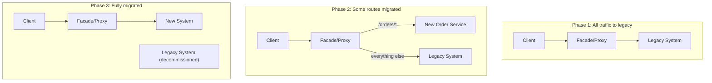
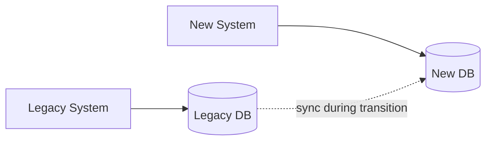

## Introduction

This chapter closes Part 6 by addressing a question every pattern so far has assumed away: how do you actually get from an existing legacy system to a better-architected one, in a real production environment with real users, without simply stopping everything and rewriting from scratch? The **Strangler Fig pattern** is the standard, battle-tested answer.

## The Name's Origin

The pattern is named after strangler fig vines, which grow around a host tree, gradually taking over its structure and function, until eventually the original tree is no longer needed and can be removed — while the fig has been alive and functioning as a complete organism throughout the entire process, never requiring the "host" to be an all-or-nothing replacement at any single point.

## Why Not Just Rewrite From Scratch?

Full rewrites ("big bang" rewrites) have a notoriously poor track record in software engineering — famously discussed in Joel Spolsky's "Things You Should Never Do":

- **Extremely long time-to-value**: The new system provides zero business value until it's completely finished, potentially many months or years away.
- **Requirements drift**: The legacy system continues evolving (bug fixes, new features) while the rewrite is underway, meaning the rewrite target keeps moving.
- **All-or-nothing risk**: If the rewrite fails, is late, or has serious bugs discovered only after a full cutover, there's no partial, incremental way back.
- **Loss of accumulated business logic**: Legacy systems often encode years of accumulated edge-case handling and business rules that aren't documented anywhere except in the old code itself — a rewrite risks silently dropping this hard-won knowledge.

## The Strangler Fig Approach

Instead of a full rewrite, incrementally redirect specific pieces of functionality from the legacy system to the new system, one piece at a time, with both systems running side by side throughout the transition.

### The Facade/Proxy Layer

A routing layer (often implemented as a reverse proxy or, in modern architectures, an API Gateway, Chapter 6) sits in front of both the legacy and new systems, directing each incoming request to whichever system currently owns that specific piece of functionality. Clients are entirely unaware of this internal migration — they simply call the facade, exactly the same decoupling benefit discussed for API Gateways generally.

### Choosing What to Migrate First

Common strategies:
- **Start with the least risky, most isolated functionality** — build confidence in the new system and the migration process itself before tackling core, business-critical logic.
- **Start with the most valuable/most frequently-changed functionality** — if a specific module is under heavy, ongoing development, migrating it early means the team benefits from the new architecture's advantages (Chapter 34) sooner, for the code they're actively working in most.
- **Start with the most painful/most bug-prone legacy code** — directly addressing the biggest source of ongoing operational pain first.

There's no single universally correct order — the right choice depends on the specific system's risk profile and business priorities.

## Data Migration: The Hardest Part

Migrating *behavior* (routing requests to new code) is usually more straightforward than migrating the underlying *data*, especially when the legacy and new systems need to operate on shared data simultaneously during the transition period.

Common approaches:
- **Dual writes**: Both systems write to both databases during the transition — simple in concept, but prone to consistency bugs if not carefully synchronized (directly connecting to the distributed transaction challenges of Chapter 20).
- **Change Data Capture (CDC)**: A mechanism that watches the legacy database's transaction log and streams changes to the new system in near-real-time (often via Kafka, Chapter 30) — avoids requiring the legacy application code itself to be modified to support dual writes.
- **One-directional cutover**: Migrate all existing historical data once, then only ever write to the new system going forward, with the legacy system becoming read-only (or fully decommissioned) for that specific data going forward.

## When the Strangler Fig Pattern Is (and Isn't) the Right Choice

**Well-suited for**: Large, business-critical legacy systems where continuous availability during migration is essential, and where the risk of a full rewrite's all-or-nothing failure mode is unacceptable.

**Less necessary for**: Small systems where a full rewrite's risk and blast radius are genuinely manageable, or greenfield systems with no existing legacy system to migrate away from in the first place (the pattern is specifically a *migration* strategy, not a general architecture pattern for new systems).

## Summary

- The Strangler Fig pattern incrementally migrates functionality from a legacy system to a new one, piece by piece, with both running side by side — avoiding the high risk and poor track record of full "big bang" rewrites.
- A facade/proxy layer routes each request to whichever system currently owns that specific functionality, keeping clients unaware of the ongoing internal migration.
- Data migration (dual writes, Change Data Capture, or one-directional cutover) is typically the hardest part of the process, especially when legacy and new systems must operate on shared data simultaneously.
- The pattern is specifically a migration strategy for existing, business-critical legacy systems — not a general architectural pattern for building new systems from scratch.

---

## Interview Questions

### 1. Why do full "big bang" rewrites of legacy systems have a notoriously poor track record, and what specific risk does the Strangler Fig pattern directly address?
**Answer:** Full rewrites suffer from several compounding risks: they provide zero business value until fully complete (often many months or years), during which time the legacy system's actual requirements continue to evolve (new features, bug fixes, changing business rules) meaning the rewrite is perpetually chasing a moving target rather than a fixed, well-understood specification; they also carry all-or-nothing risk — if serious bugs or missing functionality are discovered only after a full cutover, there's often no easy, incremental way to partially roll back, given how much has changed simultaneously. The Strangler Fig pattern directly addresses this all-or-nothing risk specifically by enabling incremental, piece-by-piece migration with both systems running side by side — if a newly-migrated piece of functionality has problems, only that specific piece needs to be investigated/rolled back, not the entire system at once, and the new system begins providing real business value incrementally as each piece is migrated, rather than requiring the entire rewrite to be finished before any benefit is realized.

**Follow-up:** *Does the Strangler Fig pattern eliminate all risk associated with a legacy system migration, or does it change the nature of the risk rather than eliminate it entirely?* — It changes the nature and scope of the risk rather than eliminating it entirely — instead of one large, concentrated, all-or-nothing risk at a single big-bang cutover moment, the risk is distributed across many smaller, more contained increments, each individually easier to test, validate, and roll back if needed; there's still real risk at each individual migration step (a specific migrated piece of functionality could have bugs, or the facade/routing layer itself could misroute traffic), but the *blast radius* of any single failure is dramatically reduced compared to a full rewrite's single, all-encompassing cutover moment, and problems can typically be caught and addressed incrementally rather than only being discovered after the entire, much larger rewrite effort is complete.

### 2. What role does the facade/proxy layer play in the Strangler Fig pattern, and why is client transparency (clients being unaware of the ongoing migration) an important property of this layer?
**Answer:** The facade/proxy layer sits in front of both the legacy and new systems, inspecting each incoming request and routing it to whichever system currently owns that specific piece of functionality at that point in the migration — this is directly analogous to, and often literally implemented using, the API Gateway pattern discussed in Chapter 6. Client transparency matters because it means client applications (whether external customers, internal consumers, or other services) never need to be aware of, or make any changes to accommodate, the fact that a migration is happening at all — they continue calling the same stable endpoints throughout the entire migration process, with the facade layer handling all the complexity of routing to the correct backend system internally; this decoupling is what allows the migration to proceed incrementally and safely without requiring coordinated changes across every client of the system simultaneously, which would reintroduce much of the coordination risk and complexity the pattern is specifically designed to avoid.

**Follow-up:** *What would happen if, instead of using a transparent facade layer, individual clients were each directly told "call the new system for these specific endpoints, and the old system for these other ones"?* — This would push the migration's routing complexity and awareness directly onto every single client, requiring each one to be individually updated and coordinated as specific pieces of functionality are migrated over time — this reintroduces significant coordination overhead and risk (every client needs to correctly track and implement the current migration state, and any mistake in a specific client's routing logic could cause it to call the wrong system), essentially defeating much of the Strangler Fig pattern's core value proposition of enabling a smooth, low-coordination-overhead, incremental migration that's invisible to and independent of client behavior — this is precisely why a centralized, transparent facade layer is a defining, essential component of the pattern rather than an optional implementation detail.

### 3. Compare "dual writes" and "Change Data Capture (CDC)" as data migration strategies during a Strangler Fig migration, and explain why CDC is often preferred despite requiring additional infrastructure.
**Answer:** Dual writes require modifying the legacy application's own code to explicitly write to both the legacy database and the new system's database for every relevant operation during the transition period — this is conceptually simple but genuinely risky in practice: if the two writes aren't properly coordinated (ideally atomically, which is often difficult to achieve across two independently-owned databases, directly echoing Chapter 20's distributed transaction challenges), a partial failure (one write succeeds, the other fails) can cause the legacy and new systems' data to silently drift out of sync, and this dual-write logic must be correctly implemented and tested within the legacy codebase itself, which is often exactly the kind of code teams are trying to migrate *away from* and may be reluctant to invest further changes into. Change Data Capture instead observes the legacy database's own transaction log directly (without requiring any changes to the legacy application code itself) and streams detected changes to the new system asynchronously — this avoids the risk and effort of modifying legacy application code, and provides a more reliable, consistent single source of truth (the legacy database's actual committed transaction log) for what changes need to be propagated, rather than relying on the legacy application code to correctly and reliably perform two separate writes itself.

**Follow-up:** *What's a trade-off or limitation of CDC that dual writes doesn't have?* — CDC introduces an inherent asynchronous delay (however typically brief) between when a change is committed in the legacy database and when it's actually detected and propagated to the new system, meaning the new system's data is always at least slightly eventually-consistent relative to the legacy system during the transition period — dual writes, if correctly and atomically implemented, could in principle provide more immediate, synchronous consistency between the two systems (though achieving genuine atomicity across two independently-owned databases without something like the distributed transaction patterns from Chapter 20 is itself quite difficult in practice) — additionally, CDC requires additional infrastructure investment (a CDC tool/pipeline, likely combined with a message broker like Kafka to stream and deliver the captured changes) that dual writes, despite their other risks, don't require, representing a genuine infrastructure-investment-vs-application-code-risk trade-off between the two approaches.

### 4. Why might a team choose to migrate the "most painful, most bug-prone" legacy functionality first, rather than starting with the safest, most isolated piece?
**Answer:** While starting with the safest, most isolated functionality is a common, risk-averse strategy for building confidence in the new system and migration process before tackling more critical pieces, a team might instead prioritize migrating the most painful, bug-prone legacy code first specifically because that code is likely already causing significant, ongoing operational cost (frequent production incidents, high maintenance burden, developer frustration) — addressing this pain point early provides more immediate, tangible business/operational value and relief compared to migrating already-stable, low-maintenance-burden legacy code that isn't causing significant ongoing problems in its current form; this represents a different, equally valid strategic prioritization (maximize immediate pain relief) compared to the risk-minimization strategy (build confidence with low-risk pieces first) — the right choice genuinely depends on the specific organization's priorities and risk tolerance, as this chapter notes.

**Follow-up:** *What risk does this "tackle the most painful code first" strategy carry that the "start with the safest piece" strategy specifically avoids?* — Since the most painful, bug-prone legacy code is often painful and bug-prone precisely *because* it's genuinely complex, poorly understood, or deeply entangled with other parts of the system (rather than simply being neglected despite being simple) — attempting to migrate this specific code first, before the team has built up experience and confidence with the migration process itself on simpler, lower-risk pieces, could mean the team encounters the migration's most difficult challenges (untangling complex, poorly-documented legacy logic) at the same time they're still learning and refining their overall migration approach and tooling — potentially compounding difficulty and risk at the exact point in the process where the team has the least accumulated experience with the specific migration techniques and facade/routing infrastructure being used, which the "start safe, build confidence first" strategy specifically avoids by deferring the hardest challenges until after simpler successes have validated the overall approach.

### 5. In a system design interview, if asked to migrate a legacy monolithic e-commerce platform to a microservices architecture (Chapter 34) using the Strangler Fig pattern, how would you sequence this migration at a high level?
**Answer:** You'd propose introducing an API Gateway/facade layer (Chapter 6) in front of the existing monolith as the very first step, initially routing 100% of traffic through to the unchanged monolith — establishing the transparent routing infrastructure before any actual functionality migration begins. You'd then identify a well-bounded, relatively low-risk piece of functionality to extract first (e.g., perhaps a product catalog/search feature, which is often more read-heavy, less tightly coupled to critical transactional logic like payments, and could benefit from independent scaling per Chapter 34's discussion) — building this as a new, independent microservice with its own database, using either dual writes or CDC (per this chapter's data migration discussion) to keep its data synchronized with the legacy system during the transition, and updating the facade to route catalog-related requests to this new service while everything else continues to route to the monolith. You'd then continue this pattern incrementally for other bounded pieces of functionality (perhaps user accounts, then order management, then payments — likely saving the most critical, tightly-coupled transactional logic like payments for later in the process, once the team has built confidence with the migration approach) until eventually the legacy monolith handles a shrinking, and finally zero, portion of overall traffic, at which point it can be fully decommissioned.

**Follow-up:** *Why might payment processing specifically be a reasonable candidate to migrate later in this sequence, rather than earlier?* — Payment processing typically involves the most critical, correctness-sensitive business logic in an e-commerce system (directly involving real financial transactions, regulatory/compliance considerations like PCI-DSS, and the highest cost of any bugs or data inconsistencies introduced during migration) — deferring this until later in the migration sequence allows the team to first build substantial confidence and experience with the overall migration approach, tooling, and data-synchronization techniques on lower-stakes functionality, before applying that now-validated, well-understood process to the system's most business-critical and risk-sensitive component, directly reflecting the "start with lower-risk pieces to build confidence" strategy discussed earlier in this chapter, applied specifically and concretely to this e-commerce scenario's particular risk profile.

### 6. Why is the Strangler Fig pattern specifically described as a "migration strategy" rather than a general architectural pattern applicable to any new system design?
**Answer:** The Strangler Fig pattern's entire premise and value proposition is specifically about the *transition process* from an existing legacy system to a new one — it addresses the specific problem of "how do we safely, incrementally move away from something that already exists and is currently in production use" through techniques like the facade/routing layer and incremental data migration strategies; a brand-new, greenfield system being designed and built from scratch has no existing legacy system to migrate away from in the first place, meaning there's no "strangling" process to apply — the pattern's core mechanisms (routing between old and new implementations of the same functionality, migrating data from an existing system to a new one) are simply inapplicable to a context where there is no pre-existing "old" system to transition away from at all; a greenfield system should instead simply be designed and built according to whatever architectural patterns (from Chapters 34-38, and the rest of this series) genuinely suit its actual requirements, without needing any migration-specific pattern at all.

**Follow-up:** *Could elements or lessons from the Strangler Fig pattern still be relevant advice for a team building a genuinely new, greenfield system, even though the pattern itself doesn't directly apply?* — Some general underlying principles could still offer relevant, transferable wisdom — for example, the broader lesson that large, complex initiatives often benefit from being broken into smaller, incrementally-deliverable, independently-valuable pieces rather than attempted as one enormous, all-or-nothing effort could reasonably inform how a team approaches building even a greenfield system's initial rollout (e.g., launching an MVP with a subset of features first, then incrementally adding more, rather than attempting to build and launch every conceivable feature simultaneously) — but this is a more general, transferable engineering/project-management principle rather than the Strangler Fig pattern's specific, defining migration mechanisms (facade-based routing between old/new implementations, legacy data migration techniques) actually being directly applied, since there's no actual "legacy system" involved in a genuine greenfield build to strangle in the first place.

### 7. A candidate proposes using dual writes for a legacy-to-new-system data migration, arguing "it's simpler to understand and implement than setting up a whole CDC pipeline." What follow-up scenario would you present to test whether they've considered dual writes' correctness risks?
**Answer:** You might present this scenario: "The legacy application successfully writes a new customer order to the legacy database, but then, due to a transient network issue or a bug, the corresponding write to the new system's database fails or times out — walk me through what happens next, and how your dual-write implementation handles this specific partial-failure scenario." This directly probes whether the candidate has genuinely considered dual writes' core correctness risk (discussed in this chapter) — a well-prepared candidate should recognize this as a genuine, realistic failure mode requiring explicit handling (e.g., retry logic with idempotency per Chapter 28, a reconciliation/discrepancy-detection process to catch and correct any resulting data drift between the two systems, or potentially even acknowledging that dual writes without additional safeguards carry real correctness risk that CDC's single-source-of-truth approach specifically avoids) — a candidate who hasn't considered this scenario at all, or who assumes both writes will simply always succeed together without addressing this realistic partial-failure case, would reveal an incomplete understanding of dual writes' actual, practical risks despite its surface-level implementation simplicity.

**Follow-up:** *If the candidate proposes adding retry logic to handle this specific partial-failure scenario for dual writes, what additional consideration from earlier chapters should they also address?* — They should address idempotency (Chapter 28) — since retrying the failed write to the new system risks the same ambiguous-failure/duplicate-effect problem discussed throughout that chapter (did the original failed attempt actually partially succeed before failing? Could a retry cause a duplicate record in the new system?) — a robust dual-write implementation with retry logic needs the write to the new system to be idempotent (e.g., using a unique identifier from the original legacy record to detect and prevent duplicate writes on retry), directly connecting this chapter's data migration discussion back to the idempotency principles covered earlier in the series, reinforcing that dual writes' "simplicity" is somewhat illusory once all the necessary correctness safeguards (retry logic, idempotency, reconciliation) are properly accounted for.

### 8. Why might "requirements drift" specifically make a full rewrite's already-poor track record even worse for a system that's under active, ongoing feature development, compared to a more stable, rarely-changed legacy system?
**Answer:** If the legacy system being rewritten is under active, ongoing feature development (new features, bug fixes, changing business requirements continuing to be implemented in the legacy system while the rewrite effort proceeds in parallel), the rewrite team faces a continuously moving target — by the time the rewrite is finally complete, it may already be missing numerous features/fixes that were added to the legacy system during the (often lengthy) rewrite period, requiring either an uncomfortable choice to freeze legacy development entirely during the rewrite (sacrificing business agility and competitiveness for however long the rewrite takes) or accepting that the rewritten system will launch already behind/incomplete relative to the legacy system's then-current actual functionality, undermining much of the rewrite's intended value. A more stable, rarely-changed legacy system doesn't face this same compounding requirements-drift problem nearly as severely, since there's comparatively little new functionality being added to the legacy system during the rewrite period that the rewrite effort would need to continuously chase and incorporate.

**Follow-up:** *How does the Strangler Fig pattern's incremental approach specifically mitigate this requirements-drift problem compared to a full rewrite?* — Since the Strangler Fig pattern migrates functionality incrementally, piece by piece, rather than requiring the entire system to be rebuilt before any of it can go live, each individual migrated piece can be completed and deployed relatively quickly (compared to an entire system rewrite), meaning there's a much shorter window during which that specific piece's legacy and new implementations could drift apart due to ongoing legacy development — and critically, once a specific piece of functionality has been successfully migrated to the new system, *future* development and feature additions for that specific piece happen directly in the new system going forward (since it's now the "owning" implementation for that functionality), meaning the requirements-drift problem is naturally, incrementally resolved piece by piece as the migration progresses, rather than accumulating as one large, compounding problem across the entire system for the full duration of a single, monolithic rewrite effort.

### 9. Why does the Strangler Fig pattern's approach directly embody this series' recurring theme of "incremental, need-justified complexity" rather than pursuing a theoretically ideal architecture all at once?
**Answer:** Throughout this series (Chapters 7, 30, 34, 37, 38, among others), a consistent theme has been that architectural complexity should be introduced incrementally, specifically justified by genuine, demonstrated need at each step, rather than being adopted wholesale based on theoretical best practices or anticipated future requirements that haven't yet actually materialized — the Strangler Fig pattern applies this exact same philosophy specifically to the challenge of *migrating* an existing system: rather than attempting to design and build an entire, theoretically ideal target architecture all at once (which reintroduces much of the "big bang" rewrite's risk profile, just aimed at achieving architectural purity rather than simply reimplementing existing functionality), it advocates incrementally moving toward that improved architecture one genuinely justified, manageable piece at a time, allowing the team to learn, adjust, and validate their approach continuously throughout the process rather than committing to a single, large, upfront architectural bet that can't be easily adjusted once significant investment has already been made.

**Follow-up:** *Does this mean a team using the Strangler Fig pattern should avoid having any overall target architecture vision at all, and simply migrate piece by piece without any larger plan?* — No — having a clear, well-reasoned target architecture vision (informed by the genuine, actual needs and trade-offs discussed throughout this series, e.g., which specific pieces genuinely warrant becoming independent microservices per Chapter 34's criteria, versus which might be better served remaining together) remains valuable and important for guiding the *sequence and shape* of the incremental migration steps — the key distinction is between having a clear *directional* vision that guides incremental decision-making (which the Strangler Fig pattern's approach fully supports and typically requires) versus attempting to fully design and then implement that entire target architecture in one single, monolithic, all-at-once effort (which reintroduces the big-bang rewrite risks this pattern is specifically designed to avoid) — the pattern is about *how* you get to a well-reasoned target architecture incrementally and safely, not an argument against having a clear, well-reasoned target architecture vision in the first place.

### 10. In a system design interview, if the interviewer asks "what would you do differently if the legacy system you needed to migrate had extremely poor or nonexistent test coverage," how would this specifically affect your Strangler Fig migration strategy?
**Answer:** Extremely poor legacy test coverage significantly increases the risk of unknowingly breaking existing, correct behavior when extracting and reimplementing specific pieces of functionality in the new system, since there's no reliable, automated way to verify that the new implementation genuinely preserves all the legacy system's actual (even if undocumented) behavior and edge cases; you'd propose investing in building targeted characterization/regression tests specifically around the *legacy* system's actual observed behavior for whatever specific piece of functionality is about to be migrated (essentially documenting "here's precisely what the legacy system currently, actually does for these various inputs/scenarios" through testing, even without understanding *why* internally) before attempting to reimplement that piece in the new system — these characterization tests then serve as a concrete, verifiable safety net to confirm the new implementation genuinely replicates the legacy behavior (intentional and, importantly, any unintentional-but-relied-upon quirks) accurately, rather than proceeding with the migration based purely on assumptions about what the legacy code "should" do, which risks silently introducing behavioral regressions that poor legacy test coverage would otherwise leave completely undetected until they cause real problems in production.

**Follow-up:** *Would you recommend fixing the legacy system's test coverage broadly and comprehensively before beginning any migration work at all, given this risk?* — Generally, no, as a strict prerequisite for the *entire* system — this would likely reintroduce much of the "big bang" delay and risk the Strangler Fig pattern is specifically designed to avoid, since comprehensively testing an entire poorly-tested legacy system before any migration progress begins could itself become a lengthy, high-effort undertaking; a more pragmatic, incremental approach is to build targeted characterization tests specifically and only for each *specific piece* of functionality immediately before it's about to be migrated (as described above), directly integrating this test-coverage investment into the incremental migration process itself, piece by piece, rather than treating comprehensive legacy test coverage as a separate, large, blocking prerequisite that must be fully completed before any actual migration work can begin — keeping the overall approach genuinely incremental and need-justified, consistent with the pattern's core philosophy, rather than introducing a new, large, upfront blocking effort that undermines the very incrementalism the pattern is meant to provide.
