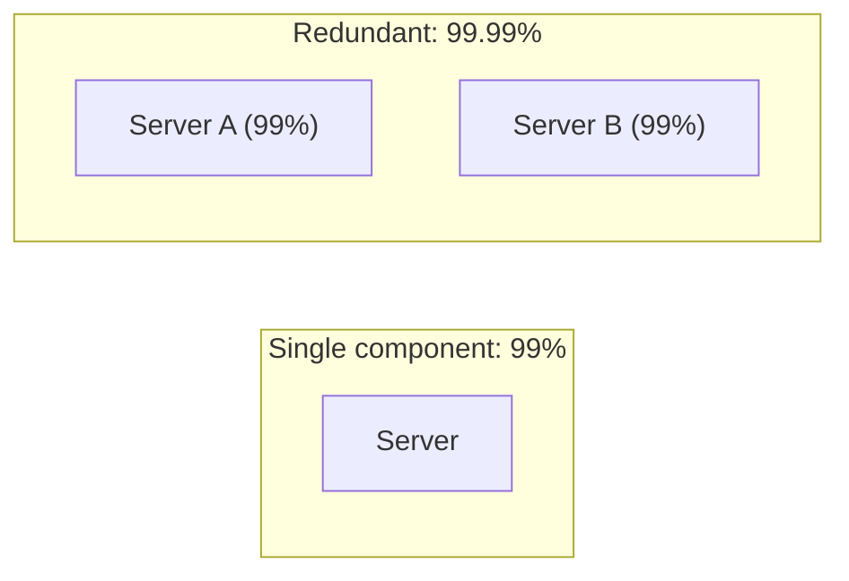
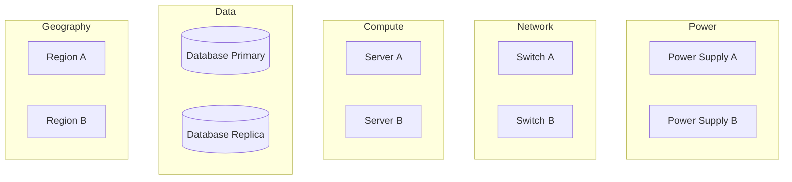
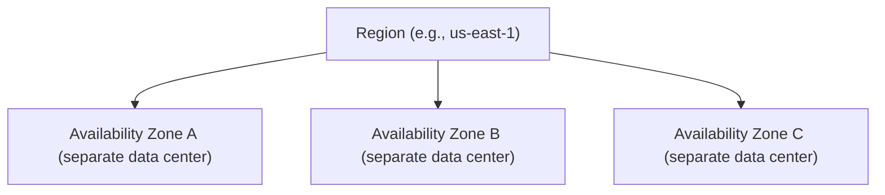

## Introduction

Chapter 1 introduced availability conceptually — "five nines," SLAs, single points of failure. This chapter goes deeper into the actual mechanics: how redundancy mathematically improves availability, and the concrete architectural patterns used to eliminate single points of failure across every layer of a system.

## The Math of Availability

If a single component has 99% availability (roughly 3.65 days of downtime per year), adding a **redundant** backup component — assuming failures are independent — dramatically improves combined availability:

```
Combined unavailability (both must fail simultaneously) = 0.01 × 0.01 = 0.0001 (0.01%)
Combined availability = 99.99%
```

Two independent 99%-available components in an active-passive or active-active redundant configuration together achieve 99.99% availability — because both must fail *at the same time* for the combined system to fail, and independent failures happening simultaneously is far less likely than either failing alone.



**Critical assumption**: This math only holds if failures are genuinely **independent**. If both servers share a single power supply, a single rack, or a single network switch, a failure of that *shared* component takes both down simultaneously — the redundancy provides zero actual benefit, because the failures are correlated, not independent. This is why true redundancy requires eliminating shared failure domains, not just duplicating servers.

## Redundancy at Every Layer



Genuine high availability requires redundancy at *every* layer where a single point of failure could exist:
- **Power**: Redundant power supplies, ideally fed from independent utility circuits.
- **Network**: Redundant switches, routers, and network paths (Chapter 2's SPOF discussion).
- **Compute**: Multiple server/application instances (Chapter 7's horizontal scaling), behind a redundant load balancer (Chapter 8).
- **Data**: Database replication (Chapter 15) so no single database instance is a SPOF.
- **Geography**: Multi-availability-zone or multi-region deployment, so a single data center outage doesn't take down the entire system.

Missing redundancy at even *one* of these layers means that layer remains a single point of failure, regardless of how redundant every other layer is — availability is limited by the **weakest, least-redundant link**.

## Active-Passive vs Active-Active

| | Active-Passive | Active-Active |
|---|---|---|
| Normal operation | Only the active instance serves traffic; passive stands by | All instances actively serve traffic simultaneously |
| Resource utilization | Passive capacity sits idle until needed | All capacity is continuously utilized |
| Failover | Requires detecting failure and promoting the passive instance (some downtime/delay) | No failover needed — remaining active instances simply absorb the load |
| Complexity | Simpler to reason about (only one "source of truth" at a time) | More complex (must handle concurrent writes/requests across multiple active instances) |

Active-active provides better resource utilization and typically faster recovery (no failover delay), but requires the underlying system to correctly handle genuinely concurrent operation across multiple active nodes — directly connecting to Chapter 15's multi-leader/leaderless replication trade-offs.

## Availability Zones and Regions

Cloud providers organize infrastructure into a hierarchy specifically designed to support this kind of redundancy:



- **Availability Zones (AZs)**: Physically separate data centers within a region, with independent power, cooling, and networking, but low-latency connections between them — deploying across multiple AZs protects against a single data-center-level failure while keeping latency between components low.
- **Regions**: Geographically distant, entirely independent infrastructure — protects against region-wide disasters (natural disasters, regional power grid failures, or a cloud provider's region-wide outage) at the cost of higher latency between regions (Chapter 2's physical latency floor).

Multi-AZ deployment is the common baseline for genuinely production-grade systems; multi-region deployment is reserved for systems with the highest availability requirements, given its added cost and complexity (data replication across regions, Chapter 15, and the consistency trade-offs of Chapter 18).

## Calculating Combined Availability of a Full Request Path

If a request depends on multiple *sequential* components (each of which must be available for the request to succeed), their availabilities **multiply**, and the combined availability is always *lower* than the least-available individual component:

```
API Gateway (99.99%) × App Server (99.95%) × Database (99.9%) = 99.84% combined
```

This is a critical, often-overlooked point: adding more sequential dependencies to a request path, even if each individual dependency is highly available, *reduces* overall availability — motivating both minimizing unnecessary sequential dependencies and ensuring each individual dependency's own availability is as high as reasonably achievable, since the weakest link disproportionately drags down the whole chain.

## Summary

- Redundancy mathematically improves availability, but only when failures are genuinely independent — shared failure domains (power, network, rack) undermine the entire premise.
- Real high availability requires redundancy at every layer — power, network, compute, data, and geography — since availability is limited by the least redundant layer.
- Active-active configurations provide better resource utilization and faster recovery than active-passive, at the cost of handling genuine concurrent operation.
- Availability Zones protect against data-center-level failures with low latency; regions protect against larger-scale disasters at higher latency cost.
- Sequential dependencies in a request path multiply (not average) their availabilities — combined availability is always lower than the weakest link, motivating both minimizing dependencies and maximizing each one's individual availability.

---

## Interview Questions

### 1. Explain why the "combined availability" calculation for redundant components (multiplying unavailability rates) only holds true under the assumption of independent failures, and give an example where this assumption is violated.
**Answer:** The math behind combined availability (e.g., two 99%-available components combining to 99.99% availability) relies on the probabilistic principle that the joint probability of two *independent* events both occurring (both components failing at the same time) is the product of their individual probabilities — this dramatically lower joint-failure probability is precisely what drives the availability improvement. If the two components' failures aren't actually independent — for example, if both servers plug into the same single power distribution unit (PDU) — then a failure of that shared PDU would cause *both* "redundant" servers to fail simultaneously as a single, correlated event, not as two independent failures whose combined probability should be multiplied; in this case, the redundancy provides essentially zero real availability benefit, since the servers' failures are actually strongly correlated through this shared, unredundant dependency, completely undermining the mathematical assumption the availability improvement calculation depends on.

**Follow-up:** *What's a practical technique to verify or audit whether two "redundant" components in a real system actually have independent failure domains?* — A "failure domain analysis" or dependency audit — explicitly tracing and documenting every shared physical or logical dependency between the two supposedly-redundant components (power source, network path, physical rack/data center, even shared software/configuration that could contain the same bug affecting both) — any shared dependency identified through this analysis represents a potential correlated-failure risk that undermines the redundancy's assumed independence, and should either be eliminated (by using genuinely separate power/network/physical infrastructure for each redundant component) or explicitly acknowledged as a residual risk that the combined-availability calculation doesn't actually account for.

### 2. Why does a request path with multiple sequential dependencies have LOWER combined availability than any single one of those dependencies, and what practical design implication does this have?
**Answer:** When a request must successfully pass through multiple components in sequence (each one being a necessary condition for the overall request to succeed), the overall request only succeeds if *every single* component in that sequential chain is available and functioning — mathematically, this means the combined availability is the *product* of each individual component's availability (e.g., 99.99% × 99.95% × 99.9% = 99.84%), and since each individual availability value is a fraction less than 100%, multiplying several such fractions together always produces a result *smaller* than the smallest individual fraction in the chain — the practical design implication is that adding more sequential dependencies to a critical request path, even dependencies that are each individually quite highly available, will always reduce the overall combined availability of that path, motivating system designers to both minimize the number of genuinely necessary sequential dependencies in critical paths, and to invest disproportionately in improving the availability of whichever specific dependency in the chain has the *lowest* individual availability, since it has an outsized effect on the overall combined result.

**Follow-up:** *How might a system architecturally reduce the number of sequential dependencies in a critical request path, beyond simply improving each individual dependency's availability?* — Techniques include: caching (Chapter 9) to avoid needing to sequentially depend on a slower, less-available downstream service for every single request; making non-critical sequential calls asynchronous/parallel rather than sequential where genuinely possible (e.g., if two downstream calls don't actually depend on each other's results, calling them concurrently rather than one-after-another doesn't reduce the *number* of dependencies but can reduce overall *latency*, which is a related but distinct concern from availability); and applying graceful degradation/fallback patterns (Chapter 36's circuit breakers with fallbacks) so that a failure in a specific *non-essential* sequential dependency doesn't necessarily cause the *entire* request to fail, effectively removing that dependency from the "must all succeed" critical chain for the purposes of the overall request's success/failure determination.

### 3. Compare active-passive and active-active redundancy configurations, and explain why active-active generally provides faster recovery from a node failure.
**Answer:** In active-passive, only the active node handles traffic under normal conditions, while the passive node stands by, idle, ready to take over if the active node fails — this failover process requires explicitly detecting the active node's failure (which itself takes some time, depending on health-check frequency/sensitivity) and then promoting the passive node to become the new active node (which may involve additional steps like updating DNS/routing, or the passive node needing to catch up on any recent state it wasn't actively processing) — this entire detection-plus-promotion sequence introduces some unavoidable downtime/delay during the transition. In active-active, all nodes are already actively serving traffic simultaneously under normal conditions — if one node fails, the remaining active node(s) simply continue serving traffic (potentially at somewhat higher individual load), with no explicit "promotion" or "takeover" step required at all, since there's no distinction between an "active" role that needs to be newly assumed and a "passive" role being vacated — the remaining nodes were already fully active and capable of serving all traffic, meaning the transition upon a node failure is typically much faster (often near-instantaneous from an end-user perspective, especially if combined with proper load-balancer health checking per Chapter 8) compared to active-passive's more involved failover sequence.

**Follow-up:** *Why might a team still choose active-passive despite this generally faster active-active recovery time?* — Active-active requires the underlying system to correctly handle genuinely concurrent, simultaneous operation across multiple active nodes — for stateful systems, this often means dealing with the multi-leader/leaderless replication complexities and consistency trade-offs discussed in Chapters 15 and 18-19 (write conflicts, eventual consistency, more complex data synchronization) — for a system where this added complexity isn't justified by the specific availability/performance requirements, or where the underlying data store doesn't cleanly support multi-active-writer semantics, active-passive's simpler, single-active-source-of-truth model (accepting a brief failover delay in the rare event of an actual failure) may be a more pragmatic, lower-complexity choice, trading some recovery speed for meaningfully reduced operational and architectural complexity.

### 4. Why is deploying across multiple Availability Zones (AZs) within a single region generally considered a baseline requirement for production systems, while multi-region deployment is reserved for only the highest-availability-requirement systems?
**Answer:** Availability Zones are specifically designed to provide meaningful failure-domain independence (separate physical data centers with independent power, cooling, and networking) while maintaining very low latency between them (since they're geographically close, typically within the same metropolitan area) — this means multi-AZ deployment provides substantial protection against realistic, relatively common failure scenarios (a single data center's power outage, cooling failure, or localized network issue) with minimal added latency cost or architectural complexity compared to a single-AZ deployment, making it a very favorable cost-benefit trade-off that's reasonable to treat as a near-universal baseline for any genuinely production-grade system. Multi-region deployment, by contrast, protects against much rarer, larger-scale disaster scenarios (a natural disaster affecting an entire geographic region, a region-wide cloud provider outage) but introduces the significantly higher latency costs discussed in Chapter 2 (speed-of-light propagation delay between genuinely distant regions) and substantially more architectural complexity (cross-region data replication and the associated consistency trade-offs from Chapters 15-19) — this higher cost-to-benefit ratio (protecting against rarer events, at meaningfully higher ongoing cost/complexity) is why multi-region deployment is reserved specifically for systems whose availability requirements and business stakes are high enough to justify this additional investment, rather than being a universal baseline the way multi-AZ deployment has become.

**Follow-up:** *What's a specific type of system or business where the added cost/complexity of multi-region deployment would likely be clearly justified?* — A global financial trading platform, a critical national infrastructure system (power grid management, emergency services coordination), or a globally-distributed consumer platform where even a brief, region-wide outage would cause severe, direct financial loss or safety risk (rather than just user inconvenience) — for these kinds of systems, the business/safety cost of a rare but severe region-wide outage is high enough to clearly justify multi-region deployment's added latency and architectural complexity costs, whereas a more typical business application (even one with meaningful availability requirements) might reasonably conclude that multi-AZ deployment alone provides a sufficiently high availability level relative to the business's actual risk tolerance and the added cost of going further to multi-region.

### 5. Explain why "high availability" and "high performance/low latency" can sometimes be in direct tension, using multi-region active-active deployment as a concrete example.
**Answer:** A multi-region active-active deployment (all regions actively serving traffic and, if truly active-active for writes, needing to synchronize/replicate data with each other) improves availability by ensuring that even if an entire region fails, other regions continue serving traffic — but achieving strong consistency across genuinely distant, active-active regions requires cross-region coordination for writes (per Chapter 18's PACELC framework), and this coordination is bound by the physical speed-of-light latency floor discussed in Chapter 2 — meaning either write latency must increase significantly to accommodate this cross-region coordination (hurting performance), or the system must accept weaker consistency guarantees (eventual consistency, Chapter 19) to avoid this latency cost, which introduces its own correctness trade-offs; this illustrates a genuine, direct tension where pursuing very high availability (surviving an entire region's failure via active-active multi-region deployment) can directly conflict with also achieving very high performance/low latency for strongly consistent operations, requiring an explicit, deliberate choice about which of these competing priorities to favor for any specific operation, rather than assuming both can always be maximized simultaneously without trade-off.

**Follow-up:** *How might a system resolve this tension for a specific operation that genuinely needs both strong consistency AND to survive a region-level failure?* — One common approach is designating a single "leader region" that handles all writes for a specific piece of data (avoiding the need for genuinely active-active, multi-region write coordination for that data), with other regions serving as read replicas providing low-latency local reads (accepting some eventual-consistency staleness for reads in non-leader regions) — if the leader region fails, a new leader region is promoted (accepting some failover delay, similar to active-passive's trade-off discussed above) rather than requiring continuous, ongoing active-active write coordination across all regions simultaneously; this represents a deliberate, explicit trade-off choice (accepting active-passive-style failover latency for the rare region-failure case, in exchange for avoiding the ongoing, continuous latency cost of genuine active-active cross-region write coordination during normal, non-failure operation) rather than attempting to achieve unconditionally maximal availability and unconditionally maximal consistency/performance simultaneously, which the underlying physics and distributed-systems trade-offs (Chapters 2, 18-19) make fundamentally impossible to fully achieve at the same time.

### 6. A candidate designs a system with redundant application servers behind a load balancer, redundant database replicas, but only a single load balancer instance. Why is this design still not genuinely highly available, connecting to Chapter 8's discussion?
**Answer:** As discussed in Chapter 8, a single load balancer instance is itself a single point of failure — even though the application servers and database layers have been made redundant, if that one single load balancer fails, clients have no way to reach *any* of the otherwise-healthy, redundant application servers behind it, since the load balancer is the sole entry point routing traffic to them; this directly illustrates this chapter's broader point that genuine high availability requires redundancy at *every* layer, and a system is only as available as its *least* redundant layer — no amount of redundancy at the application or database layers can compensate for a single point of failure at the load balancer layer, since a failure there completely blocks access to everything behind it, regardless of how well-redundant those downstream layers happen to be.

**Follow-up:** *What specific mechanism, discussed in Chapter 8, would you recommend to eliminate this remaining single point of failure?* — Running multiple load balancer instances behind a floating/virtual IP (using a protocol like VRRP, managed by software like keepalived) or leveraging a cloud provider's managed, inherently-redundant load balancer service (which internally handles this redundancy at the infrastructure level, abstracting it away from the application architect) — either approach ensures that the load-balancing layer itself has no single point of failure, completing the redundancy chain across every layer (power, network, compute, data, and now load balancing) discussed in this chapter, rather than leaving this one specific layer as an unaddressed gap in an otherwise well-redundant overall architecture.

### 7. Why might "adding more redundant servers" alone fail to actually improve a system's real-world availability, even if the underlying math suggests it should, if those additional servers are deployed carelessly?
**Answer:** As emphasized throughout this chapter, the availability-improvement math specifically assumes genuinely independent failures — if additional redundant servers are deployed carelessly (e.g., all within the same single rack, sharing the same top-of-rack network switch, or even just running the exact same software with the exact same undiscovered bug that could be triggered by the same specific input across all instances simultaneously), the theoretical availability improvement the redundancy math promises simply won't materialize in practice, since a single shared-infrastructure failure or a single triggering software bug could still take down all the "redundant" servers simultaneously, exactly as if there had been no redundancy at all; this is a common, genuine real-world pitfall — organizations sometimes believe they've achieved high availability simply by having multiple server instances, without rigorously verifying that those instances' failure domains are actually, meaningfully independent across every relevant dimension (physical infrastructure, software version/bugs, configuration, even human operational processes like who has access to make changes).

**Follow-up:** *How does the concept of "software bugs" specifically challenge the typical hardware-failure-focused independence assumptions usually discussed for redundancy?* — Hardware failure independence is usually achieved by physical separation (different racks, power supplies, network paths) — but if all redundant server instances run the *exact same* software version with the *exact same* latent bug, a specific input or condition that triggers that bug could cause all instances to fail *simultaneously and identically*, regardless of how physically independent their hardware infrastructure is — this is a distinct, software-level correlated-failure risk that pure hardware-redundancy thinking doesn't address; mitigations include practices like canary deployments and gradual rollouts (deploying a new software version to only a small subset of instances first, monitoring for problems, before rolling out further) specifically to avoid a single bad software version simultaneously affecting 100% of a system's "redundant" instances all at once, treating software deployment risk as a genuine, distinct category of correlated-failure risk requiring its own specific mitigation strategy beyond just physical/hardware redundancy.

### 8. In a system design interview, if asked to design a system requiring 99.99% availability, how would you use the sequential-dependency multiplication principle to reason about your target availability for each individual component?
**Answer:** You'd work backward from the overall 99.99% target: if your critical request path involves, say, 3 sequential components (an API Gateway, an application server, and a database), and you want their combined availability to reach 99.99%, you'd need to determine an appropriate individual availability target for each component such that their product meets or exceeds this overall target — for example, if you aimed for each of the 3 components to individually achieve roughly 99.997% availability, their combined product would approximate the desired 99.99% overall target (since 0.99997³ ≈ 0.9999) — this backward-calculation approach makes explicit and quantifiable exactly how reliable each individual component in the chain actually needs to be to collectively achieve the overall system-level availability goal, rather than only reasoning about availability in vague, qualitative terms without connecting it to concrete, actionable targets for each specific component's own required reliability engineering investment.

**Follow-up:** *If one specific component in this chain (say, a critical third-party payment API you don't control) can only realistically achieve 99.9% availability regardless of your own engineering efforts, how would this affect your overall system design approach?* — Since this third-party dependency's availability is a hard constraint outside your direct control, and it would disproportionately drag down your overall combined availability if treated as a strictly sequential, always-required dependency, you'd want to explore architectural approaches to reduce its impact on your overall availability calculation — such as making calls to this specific dependency asynchronous/non-blocking where the business logic genuinely allows it (so a temporary unavailability doesn't block the entire critical request path, perhaps queuing the payment request for later processing instead, if the business context allows for that kind of delayed processing), or implementing circuit-breaker-based graceful degradation (Chapter 36) so that this specific dependency's unavailability results in a defined, acceptable fallback behavior rather than a complete failure of the overall request — effectively removing or reducing this constrained-availability dependency's direct multiplicative impact on your overall critical-path availability calculation, rather than simply accepting that your overall system availability is hard-capped at this third party's own limited availability ceiling.

### 9. Why might a genuinely highly-available system still experience real user-visible downtime during a planned software deployment, and what pattern addresses this?
**Answer:** Even a system with excellent redundancy across every infrastructure layer (power, network, compute, data, geography) can still experience downtime during a deployment if the deployment process itself involves taking instances offline to update them without careful coordination — e.g., if a deployment script simply stops and updates every application server instance simultaneously (rather than one at a time), there would be a window where zero healthy instances are available to serve traffic, regardless of how redundant the underlying infrastructure otherwise is; this is a distinct availability concern from pure infrastructure/hardware redundancy — it's specifically about *deployment process* design. Rolling deployments (updating instances one at a time, or in small batches, ensuring a sufficient number of healthy instances always remain available to serve traffic throughout the entire deployment process) directly address this, along with related techniques like blue-green deployments (maintaining two complete, parallel environments and switching traffic from the old to the fully-deployed-and-verified new environment only once it's confirmed healthy) — both specifically designed to achieve zero-downtime deployments even for otherwise highly-available, redundant infrastructure.

**Follow-up:** *How does a load balancer's health-checking capability (Chapter 8) specifically support a rolling deployment strategy?* — During a rolling deployment, as each individual instance is taken offline for updating, the load balancer's health checks detect that instance's temporary unavailability and correctly stop routing traffic to it, then — once that instance is updated and its health checks begin passing again — the load balancer automatically resumes routing traffic to it, before the deployment process moves on to update the next instance in the rotation; this tight integration between the deployment process and the load balancer's real-time health-checking capability is precisely what allows a rolling deployment to safely take individual instances offline for updates one at a time, without any window where insufficient healthy instances remain to serve incoming traffic, directly connecting this deployment-process concern back to the fundamental health-checking infrastructure discussed in Chapter 8.

### 10. Why does this chapter's emphasis on "redundancy at every layer, with genuinely independent failure domains" represent a more rigorous standard than simply "having backups" or "running multiple servers"?
**Answer:** Casually "having backups" or "running multiple servers" often satisfies only a surface-level, incomplete notion of redundancy — as this chapter has emphasized throughout, true, effective redundancy requires rigorously verifying independence of failure domains across every relevant dimension (physical infrastructure like power/network/racks, software versions and potential shared bugs, and every architectural layer from power up through geography) — merely having multiple instances of something, without this rigorous independence verification, can create a false, misleading sense of security while leaving significant, unaddressed correlated-failure risks (shared power circuits, shared software bugs, a single non-redundant load balancer in front of otherwise-redundant servers, as explored in earlier questions) that undermine the actual, real-world availability improvement the team believes they've achieved; this chapter's more rigorous framing — explicitly considering every layer, explicitly verifying genuine independence, explicitly calculating combined availability using the correct multiplicative principles for both parallel-redundant and sequential-dependent components — provides a genuinely more reliable, quantifiable, and trustworthy foundation for actually achieving a specific, targeted availability goal, rather than relying on an intuitive but potentially significantly incomplete or incorrect sense that "we have redundancy, so we should be fine."

**Follow-up:** *What practical exercise or process could a team use to systematically apply this more rigorous standard to an existing system they suspect may have hidden, unaddressed single points of failure?* — A systematic failure-mode analysis (sometimes formalized as FMEA — Failure Mode and Effects Analysis) — explicitly and deliberately walking through every component and layer of the system's architecture, and for each one, asking "if this specific component failed right now, what would actually happen, and is there genuinely independent redundancy in place to handle it?" — combined with concrete verification techniques like chaos engineering (previewed here, covered in depth in Chapter 43), which involves deliberately, safely inducing controlled failures in a production or production-like environment specifically to empirically verify that assumed redundancy and failover mechanisms actually work as intended, rather than relying solely on theoretical architecture diagrams and availability calculations that might not accurately reflect how the system would genuinely behave under a real, specific failure scenario.
