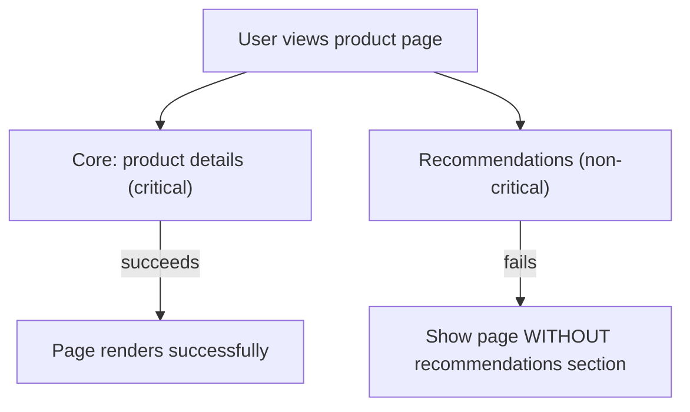
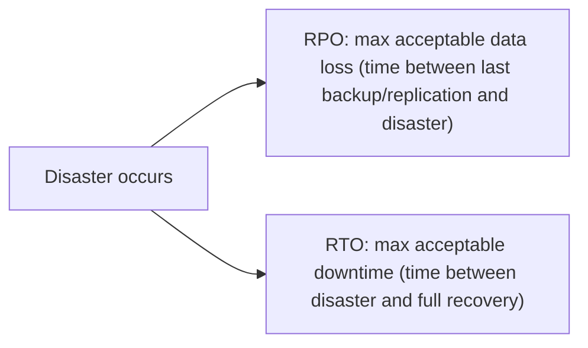
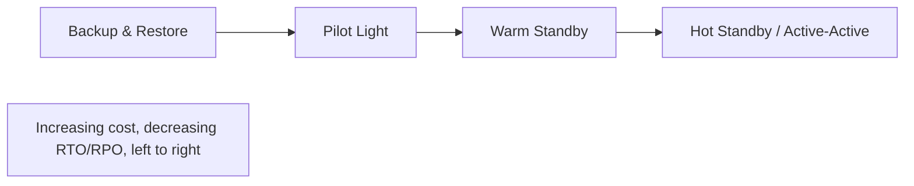

## Introduction

Chapter 40 covered redundancy — the architectural mechanism for high availability. This chapter covers two related but distinct concerns: **fault tolerance** (continuing to operate correctly despite component failures) and **disaster recovery** (the planned process for recovering when failures exceed what your redundancy can absorb).

## Fault Tolerance vs High Availability: A Precise Distinction

These terms are often used interchangeably, but they mean different things:

- **High availability** is about *minimizing downtime* — the system is reachable and responsive most of the time.
- **Fault tolerance** is about *continuing to function correctly* even while a failure is actively occurring, often *without the user even noticing*.

A system can be highly available (quick to recover after a failure) without being fully fault-tolerant (users experience a brief blip during the failover). True fault tolerance — zero perceptible disruption — is harder and more expensive to achieve than "just" high availability, and is reserved for the highest-stakes systems (e.g., aircraft control systems, financial exchange matching engines).

## Graceful Degradation

A core fault tolerance technique: when a non-critical component fails, the system continues operating with **reduced functionality** rather than failing entirely.

This directly builds on Chapter 36's circuit breaker/fallback discussion — graceful degradation is the *design philosophy*; circuit breakers with fallbacks are one *mechanism* for implementing it. The key discipline is explicitly classifying every component/feature as critical or non-critical *in advance*, so degradation decisions are deliberate architectural choices, not accidental behavior discovered during an actual incident.

## Disaster Recovery: Planning for the Worst Case

Redundancy and fault tolerance handle *component-level* failures gracefully. **Disaster recovery (DR)** plans for larger-scale catastrophic events — an entire region going down, a catastrophic data corruption event, a security breach requiring a full rebuild — where normal redundancy mechanisms aren't sufficient, and a deliberate recovery process must be executed.

### RTO and RPO: The Two Key Metrics

- **RTO (Recovery Time Objective)**: How long can the system be down before recovery must be complete? ("We must be back online within 4 hours.")
- **RPO (Recovery Point Objective)**: How much data can be acceptably lost, measured in time? ("We can afford to lose at most 15 minutes of data.")

These two metrics drive nearly every DR architecture decision — a smaller RPO requires more frequent backups/replication (more expensive); a smaller RTO requires faster, more automated recovery mechanisms (also more expensive, often requiring pre-provisioned standby infrastructure).

## DR Strategies, by Cost and Recovery Speed

| Strategy | Description | RTO | RPO | Cost |
|---|---|---|---|---|
| **Backup and Restore** | Periodic backups stored (often off-site/different region); restore from backup when needed | Hours to days | Hours (since last backup) | Lowest |
| **Pilot Light** | Minimal, always-on core infrastructure (e.g., a replicated database) in the DR region; full application infrastructure provisioned only when needed | Tens of minutes | Minutes | Low-moderate |
| **Warm Standby** | A scaled-down but fully functional version of the full system runs continuously in the DR region, scaled up when needed | Minutes | Seconds to minutes | Moderate-high |
| **Hot Standby / Multi-Site Active-Active** | Full-scale production system runs simultaneously in multiple regions | Near-zero (seconds) | Near-zero | Highest |

This is a direct cost-vs-recovery-speed trade-off, and the right choice depends entirely on the business's actual RTO/RPO requirements — over-provisioning a Hot Standby DR strategy for a system that could genuinely tolerate hours of downtime wastes significant, ongoing infrastructure cost; under-provisioning (relying on slow backup-and-restore for a system that truly needs near-zero downtime) risks unacceptable business impact when disaster actually strikes.

## Backup Strategies

- **Full backups**: A complete copy of all data — simple to restore from, but expensive in storage and time to create.
- **Incremental backups**: Only the changes since the last backup (full or incremental) — much faster and cheaper to create, but restoration requires replaying the full backup plus every subsequent incremental in sequence.
- **Differential backups**: Changes since the last *full* backup (not the last backup of any kind) — a middle ground, faster to restore than pure incrementals (only need the last full backup plus one differential) at the cost of larger individual backup sizes than incrementals.

**The 3-2-1 backup rule**: Keep at least **3** copies of data, on **2** different types of storage media, with at least **1** copy stored **off-site** (or in a different region) — protecting against media failure, site-level disasters, and (with an off-site/immutable copy) certain security incidents like ransomware that might otherwise compromise all *on-site* copies simultaneously.

## The Discipline Nobody Wants to Do: Testing DR Plans

A disaster recovery plan that has never actually been tested is, in practice, not a reliable plan at all — untested runbooks routinely fail in ways only discovered when actually executed (missing credentials, outdated infrastructure references, undocumented manual steps). Regular **DR drills** — actually executing the recovery process (ideally in a realistic, isolated environment, sometimes even in production via controlled chaos engineering exercises, Chapter 43) — are the only reliable way to verify that RTO/RPO targets are actually achievable in practice, not just on paper.

## Summary

- Fault tolerance (continuing to function correctly during a failure) is a stronger, more expensive guarantee than high availability (minimizing downtime) alone.
- Graceful degradation — continuing with reduced functionality when a non-critical component fails — requires deliberately classifying components as critical/non-critical in advance.
- RTO (acceptable downtime) and RPO (acceptable data loss) are the two metrics that drive disaster recovery architecture decisions, trading cost against recovery speed.
- DR strategies range from cheap, slow backup-and-restore to expensive, near-instant hot standby/active-active — the right choice depends on genuine business RTO/RPO requirements.
- The 3-2-1 backup rule and regular, actually-executed DR drills are essential disciplines — an untested DR plan is not a reliable plan.

---

## Interview Questions

### 1. Explain the precise distinction between "high availability" and "fault tolerance," and why a system can be highly available without being fully fault-tolerant.
**Answer:** High availability focuses on minimizing the total *duration* of downtime — a system with excellent redundancy and fast failover mechanisms (Chapter 40) might recover from a failure within seconds, achieving a very high overall availability percentage, even though users experience a brief, perceptible disruption during that failover window. Fault tolerance is a stronger guarantee — the system continues to function *correctly and without user-perceptible disruption* even while a failure is actively occurring, meaning there's no window at all where users experience any interruption, not even a brief one. A system can achieve excellent high-availability metrics (minimal *total* downtime over a year) while still not being fully fault-tolerant, if each individual failure event, despite being brief, still causes some momentary, perceptible disruption (e.g., a few dropped requests during an active-passive failover) rather than being completely transparent and imperceptible to users.

**Follow-up:** *Why is achieving true fault tolerance (zero perceptible disruption) generally significantly more expensive than achieving high availability alone?* — True fault tolerance typically requires techniques like active-active redundancy with instantaneous, seamless failover (no detection-and-promotion delay at all, since backup capacity must already be actively serving traffic and immediately able to absorb 100% of load the instant a peer fails), often combined with sophisticated state-replication mechanisms ensuring in-flight requests/transactions aren't lost or duplicated even during the exact moment of a failure — this level of engineering rigor and redundant, always-active capacity (rather than a more cost-efficient active-passive standby model that accepts a brief failover delay) is considerably more expensive to build and operate, which is why true fault tolerance is generally reserved for the highest-stakes systems where even a few seconds of perceptible disruption would be genuinely unacceptable, rather than being a universal target for all production systems.

### 2. What are RTO and RPO, and why must both be defined explicitly (rather than just one) for a complete disaster recovery plan?
**Answer:** RTO (Recovery Time Objective) defines the maximum acceptable duration of downtime following a disaster before the system must be fully recovered and operational again. RPO (Recovery Point Objective) defines the maximum acceptable amount of data loss, measured as a time duration (e.g., "we can lose at most 15 minutes of data," meaning data changes made within 15 minutes before the disaster might be unrecoverable). These are genuinely independent, orthogonal metrics — a system could have an excellent RTO (recovers very quickly) but a poor RPO (loses a lot of recent data in the process, e.g., restoring from an infrequent backup) if its recovery process quickly stands up a working system but from stale, outdated data; conversely, a system could have an excellent RPO (near-zero data loss, e.g., via continuous replication to a standby region) but a poor RTO if the actual process of promoting that standby and redirecting traffic to it is slow and manual — a complete DR plan must explicitly define and design for *both* metrics together, since they represent genuinely different business risks (extended downtime vs. lost data) that require different, sometimes independent architectural investments to address.

**Follow-up:** *Give a concrete business scenario where a very strict RPO would be required, but a comparatively relaxed RTO might be acceptable.* — A financial trading record-keeping system might have an extremely strict RPO (e.g., zero or near-zero data loss is required, since even a few seconds of lost trade records could have serious financial/regulatory/legal consequences) but could potentially tolerate a somewhat more relaxed RTO (e.g., a few hours of downtime during a genuine disaster might be operationally painful but survivable, especially if trading itself can be temporarily halted industry-wide during a genuine large-scale disaster, as sometimes happens) — this specific combination would drive an architecture prioritizing extremely frequent, likely synchronous or near-synchronous data replication/backup (to satisfy the strict RPO) without necessarily requiring the most expensive, fully-automated, near-instantaneous hot-standby infrastructure that a strict RTO would otherwise demand.

### 3. Compare the "Pilot Light" and "Warm Standby" disaster recovery strategies, and explain the specific trade-off between them.
**Answer:** In a Pilot Light strategy, only a minimal, always-on core piece of infrastructure runs continuously in the DR region (typically just a continuously-replicated database, ensuring data is always reasonably up to date), while the full application/compute infrastructure needed to actually serve traffic is only provisioned (spun up from templates/images) at the moment a disaster actually occurs and recovery is initiated — this keeps ongoing costs low (since most infrastructure isn't running at all until actually needed) but means the RTO includes the time needed to actually provision and configure this compute infrastructure from scratch during the recovery process, typically resulting in an RTO measured in tens of minutes. In a Warm Standby strategy, a scaled-down but fully functional version of the *entire* application (not just the database) runs continuously in the DR region at all times — this means recovery simply involves *scaling up* this already-running, already-functional system to full production capacity (a typically much faster operation than provisioning entirely new infrastructure from scratch), achieving a meaningfully faster RTO (minutes rather than tens of minutes), but at a higher ongoing cost, since meaningful compute infrastructure is running continuously in the DR region even during normal, non-disaster operation, rather than being provisioned only when actually needed.

**Follow-up:** *Why might "Pilot Light" specifically be described as primarily addressing RPO, while "Warm Standby" additionally provides a meaningfully better RTO?* — Pilot Light's core, continuously-running component is specifically the *data* replication (the database), which is precisely what drives RPO (how much data could be lost) — the RTO for Pilot Light remains relatively slower because provisioning the actual application compute infrastructure from scratch still takes meaningful time even with already-current data available; Warm Standby additionally keeps the *application/compute* layer running continuously (even if at reduced scale), meaning both the data replication (RPO) and a functioning, ready-to-scale application layer (directly improving RTO, since there's no "provision the application from scratch" step required, only a "scale up already-running capacity" step) are addressed simultaneously, which is precisely why Warm Standby achieves a meaningfully better RTO than Pilot Light, at the cost of the additional ongoing infrastructure expense of keeping that application layer continuously running rather than only provisioning it on-demand.

### 4. Why does the "3-2-1 backup rule" specifically require an off-site copy, rather than simply having 3 copies stored redundantly within the same data center?
**Answer:** Having multiple copies within the same single data center, even if stored on genuinely different physical media/servers, still leaves all copies vulnerable to a single, site-level disaster event (a fire, a flood, a large-scale power grid failure, or a natural disaster affecting that entire physical location) — if such an event occurs, *all* copies stored at that single site could be destroyed or rendered inaccessible simultaneously, regardless of how many "redundant" copies existed within that one location, directly echoing this chapter and Chapter 40's broader emphasis on genuinely independent failure domains; requiring at least one copy to be stored off-site (in a genuinely separate physical location, ideally a different region entirely) ensures that even a catastrophic, complete loss of the primary site doesn't result in complete, unrecoverable data loss, since the off-site copy remains safe and accessible from an entirely independent physical location and failure domain.

**Follow-up:** *Why might the 3-2-1 rule's off-site copy specifically also provide meaningful protection against ransomware attacks, beyond just physical site disasters?* — A sophisticated ransomware attack often specifically attempts to locate and encrypt/destroy not just an organization's primary data, but also any accessible backup copies it can reach on the same network/systems, specifically to eliminate the victim's ability to simply restore from backup without paying the ransom — an off-site backup copy, especially if implemented with additional protections like immutability (the backup cannot be modified or deleted even by someone with otherwise-elevated access, for some defined retention period) or air-gapping (physically or logically disconnected from the primary network in a way that malware propagating through that primary network cannot reach), provides a genuinely protected, uncompromised recovery option specifically resistant to this kind of attack pattern that might otherwise successfully destroy all backup copies reachable from the compromised primary environment.

### 5. Explain why graceful degradation requires "deliberately classifying components as critical or non-critical in advance," rather than simply handling failures reactively as they occur.
**Answer:** Reactively deciding, in the middle of an actual live incident, whether a specific failing component is "critical enough to block the entire request" or "acceptable to degrade/omit" introduces significant risk and inconsistency — under the pressure and time constraints of an actual production incident, engineers might make inconsistent, ad hoc decisions (sometimes correctly identifying something as safe to degrade, sometimes incorrectly blocking an entire critical flow over something that should have been treated as non-critical, or vice versa), and implementing a genuinely safe fallback behavior on the fly, without prior design and testing, is itself risky and error-prone. Deliberately classifying components as critical or non-critical *in advance*, as part of the system's designed architecture (and correspondingly implementing well-tested fallback behaviors for the non-critical components ahead of time, as shown in Chapter 36's circuit breaker examples), ensures that when an actual failure does occur, the system's degradation behavior is a well-understood, previously-designed, and ideally already-tested response, rather than an improvised, potentially risky decision made under the pressure of a live incident.

**Follow-up:** *What organizational practice or artifact would you recommend to make this "critical vs non-critical" classification explicit, discoverable, and consistently applied across a team?* — A "service criticality" or "dependency" catalog/registry — an explicit, documented, and regularly-reviewed record of every significant service/dependency in the system, along with its classification (critical vs. non-critical) and its designated fallback behavior if applicable — making this a formal, visible artifact (rather than implicit, tribal knowledge held only by whichever engineers happened to build a specific feature) ensures the classification is consistently understood and applied across the team, can be reviewed and updated as the system evolves, and provides a clear, quick reference during actual incidents (helping responders quickly confirm "yes, this specific failing component is officially classified as non-critical, and its documented fallback behavior is X" rather than needing to make this determination from scratch during the stress of an active incident).

### 6. Why is an "untested" disaster recovery plan considered unreliable in practice, even if it appears well-documented and logically sound on paper?
**Answer:** Real-world systems accumulate subtle, often undocumented dependencies and configuration details over time (expired or rotated credentials that a DR runbook still references using outdated values, infrastructure that has been modified/upgraded since the DR plan was originally written without the plan being correspondingly updated, manual steps that were only ever performed once by a specific engineer who has since left the team and whose tribal knowledge was never fully captured in the written plan) — these kinds of discrepancies between a written plan and the actual, current state of the real system are extremely common and can only be reliably discovered by actually attempting to execute the plan, rather than simply reviewing it on paper, no matter how thorough and logically sound that paper review might seem; a DR plan that has never actually been executed (even in a test/drill environment) carries substantial, often significant, hidden risk that it will fail or take much longer than expected when it's actually needed during a genuine disaster — precisely when there's the least tolerance for unexpected delays or discovered gaps in the plan.

**Follow-up:** *What's a specific challenge organizations often face in actually committing to and regularly performing DR drills, despite understanding their importance?* — DR drills often require significant coordination and can be disruptive or resource-intensive to execute realistically (potentially requiring dedicated time from key engineers, careful coordination to avoid actually impacting real production systems/users if not done in a properly isolated test environment, and genuine executive/organizational buy-in to prioritize this work over other, more immediately visible feature-development priorities) — this combination of real cost/effort and the fact that DR drills address a risk (a disaster) that hasn't actually happened yet (and hopefully never will) often leads organizations to deprioritize or defer this important but not urgently-forcing work, a common and well-recognized organizational challenge that requires deliberate leadership commitment and process discipline (e.g., scheduling DR drills as a recurring, non-negotiable calendar commitment, similar to how security audits or compliance reviews are often mandated) to consistently overcome.

### 7. A candidate proposes a "Hot Standby / Active-Active" multi-region DR strategy for an internal company tool used by 20 employees with modest availability requirements. Why would you challenge this recommendation?
**Answer:** A Hot Standby/Active-Active strategy represents the highest-cost, most operationally complex point on the DR strategy spectrum, specifically justified for systems with extremely strict RTO/RPO requirements (near-zero downtime and near-zero data loss) — for an internal tool with modest availability requirements (e.g., where a few hours of downtime during a genuine disaster would be an inconvenience but not a severe business crisis, given its limited, internal 20-employee user base), this level of investment is almost certainly disproportionate to the actual business risk/requirements involved — the ongoing cost of running full-scale, duplicate production infrastructure continuously across multiple regions, plus the added architectural complexity of genuine active-active data consistency (Chapters 15-19), would likely far exceed any reasonable, proportionate response to this tool's actual, modest RTO/RPO needs — a simpler, cheaper strategy (perhaps even just reliable backup-and-restore, or at most a Pilot Light approach) would likely be entirely sufficient and far more cost-appropriate for this specific, low-stakes use case.

**Follow-up:** *What specific questions would you ask to help this candidate arrive at a more appropriately-scoped DR strategy recommendation?* — You'd ask directly: "What is the actual, business-justified RTO and RPO for this specific tool? If it were down for 4 hours, or even a full business day, what would the real, concrete business impact be? How much data loss (if any) would genuinely be unacceptable versus merely inconvenient?" — walking through these concrete, business-grounded questions (rather than defaulting to the most technically sophisticated or impressive-sounding DR strategy) would likely reveal that this internal tool's actual requirements are modest enough to be well-served by a much simpler, lower-cost DR strategy, reinforcing this series' recurring theme (echoed throughout Chapters 34, 37-40) of matching architectural investment to genuine, demonstrated business need rather than defaulting to maximal sophistication regardless of actual context and requirements.

### 8. Why does the "incremental vs. differential backup" trade-off directly parallel a trade-off discussed elsewhere in this series regarding LSM Trees (Chapter 14)?
**Answer:** Incremental backups (storing only changes since the *immediately previous* backup, whether full or incremental) minimize the storage space and time needed for each individual backup operation, but restoration requires sequentially replaying the original full backup plus *every single* subsequent incremental backup in the correct order — directly analogous to how an LSM Tree's write path is optimized (fast, sequential writes) at the cost of read/reconstruction potentially needing to check multiple separate SSTables in sequence (Chapter 14's "read amplification" concept). Differential backups (storing changes since the last *full* backup specifically, not since the last backup of any kind) require more storage per individual differential backup (since each one grows to encompass all changes since the last full backup, rather than just changes since the immediately preceding backup) but only require the last full backup plus a *single* differential backup to fully restore — directly analogous to a database applying periodic "compaction" (Chapter 14's LSM Tree compaction) that consolidates multiple smaller pieces into fewer, larger ones specifically to reduce the number of pieces that must be read/combined during a reconstruction/read operation, at the cost of more storage and processing during the consolidation/differential-creation step itself.

**Follow-up:** *Given this parallel, what "compaction-like" practice might a well-designed backup strategy periodically perform, directly mirroring LSM Tree compaction?* — Periodically creating a new full backup (even when using an incremental backup strategy day-to-day) specifically to "reset" the incremental chain — rather than allowing an ever-growing, indefinitely long chain of incremental backups to accumulate (which would require restoring from an increasingly long, increasingly slow and risk-prone sequential chain of many incrementals), periodically taking a fresh full backup effectively "compacts" all the prior incremental changes into a single, consolidated full backup, after which future incrementals can build from this new, more recent full-backup baseline — directly mirroring how LSM Tree compaction periodically consolidates accumulated smaller SSTables into fewer, larger ones specifically to bound the read/reconstruction cost, rather than allowing an unbounded number of pieces to accumulate indefinitely.

### 9. Why might a well-designed disaster recovery plan explicitly account for "human factors" (like key personnel being unavailable), not just technical infrastructure recovery?
**Answer:** A disaster scenario significant enough to trigger a formal DR plan (a major regional outage, a significant security incident, a natural disaster) might also directly or indirectly affect the availability of the specific human personnel who would normally be relied upon to execute the recovery process — for example, a regional natural disaster affecting a company's primary data center might also affect the physical safety, availability, or ability to work of employees who happen to live in that same geographic region, or a significant security incident might specifically require input from personnel who are unreachable at the exact moment the incident occurs (e.g., outside business hours, on vacation, or otherwise unavailable) — a DR plan that assumes specific, named individuals will always be available and reachable to execute specific manual steps introduces a genuine, realistic risk of the recovery process itself failing or being significantly delayed if those specific people happen to be unavailable exactly when needed, which is a meaningfully more likely scenario during a genuine large-scale disaster than during routine, everyday operations.

**Follow-up:** *What specific practices help mitigate this "key person" risk in a DR plan's design?* — Ensuring DR runbooks are thoroughly documented in enough detail that they can be executed by any sufficiently qualified team member, not just the one specific person who happens to have built or is most familiar with a given system (avoiding "bus factor" risk); cross-training multiple team members on DR procedures (rather than concentrating this knowledge in just one or two individuals); maintaining an on-call rotation and escalation policy specifically designed to ensure someone with adequate DR-execution knowledge and authority is always reachable, even outside normal business hours; and, as discussed earlier, actually conducting regular DR drills involving different team members each time (rather than always having the same specific person "run" the drill), which both validates the plan's clarity/completeness for someone other than its original author and builds broader organizational resilience against any single individual's unavailability during an actual disaster.

### 10. In a system design interview, how would you use the RTO/RPO framework to structure a conversation about disaster recovery requirements, when an interviewer simply says "the system needs good disaster recovery" without further specifics?
**Answer:** You'd treat this vague statement as a prompt for the same kind of clarifying-questions discipline emphasized throughout this series (Chapter 1's requirement-gathering framework) — rather than jumping directly to proposing a specific DR strategy, you'd ask explicitly: "What's the maximum acceptable downtime if a genuine disaster occurred — minutes, hours, or days? And what's the maximum acceptable data loss, measured in time — seconds, minutes, or hours of recent data that could be lost?" These two concrete, quantifiable questions (directly mapping to RTO and RPO) transform a vague, qualitative requirement ("good disaster recovery") into concrete, actionable design parameters that can then directly inform your recommendation of an appropriately cost-matched DR strategy from the spectrum discussed in this chapter (backup-and-restore, pilot light, warm standby, or hot standby/active-active) — demonstrating the same rigorous, requirements-driven design discipline this series has emphasized from Chapter 1 onward, now applied specifically to the disaster recovery domain.

**Follow-up:** *If the interviewer responds with "I'm not sure, what would you recommend as a reasonable default?" how would you frame your answer?* — You'd explain that there isn't a single universal "reasonable default" independent of the system's actual business context and stakes, but you could offer a reasoned, tiered suggestion based on typical patterns: for a business-critical, revenue-generating production system, a Warm Standby approach (moderate cost, RTO in minutes, RPO in seconds-to-minutes) is often a reasonable, commonly-adopted middle-ground default that most organizations find an acceptable balance of cost versus protection; you'd caveat this by explicitly noting that if the interviewer can provide any further context about the specific system's actual criticality, regulatory requirements, or business impact of downtime/data-loss, you'd refine this recommendation accordingly — demonstrating both a helpful, pragmatic default suggestion when pressed, while still being clear and transparent that a genuinely well-reasoned DR strategy should ultimately be grounded in the system's actual, specific business requirements rather than a one-size-fits-all default applied without that context.
