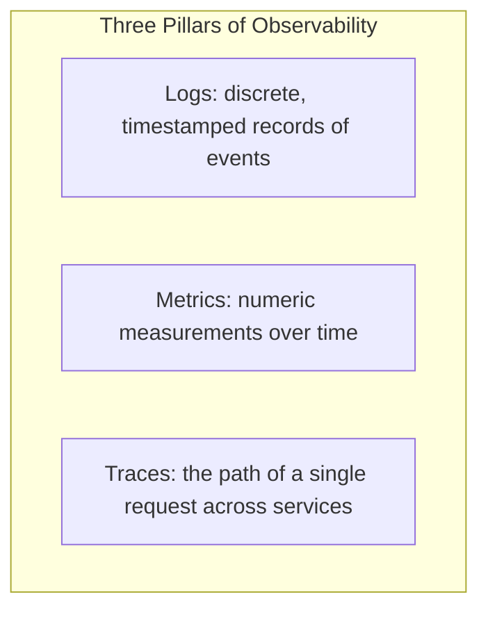
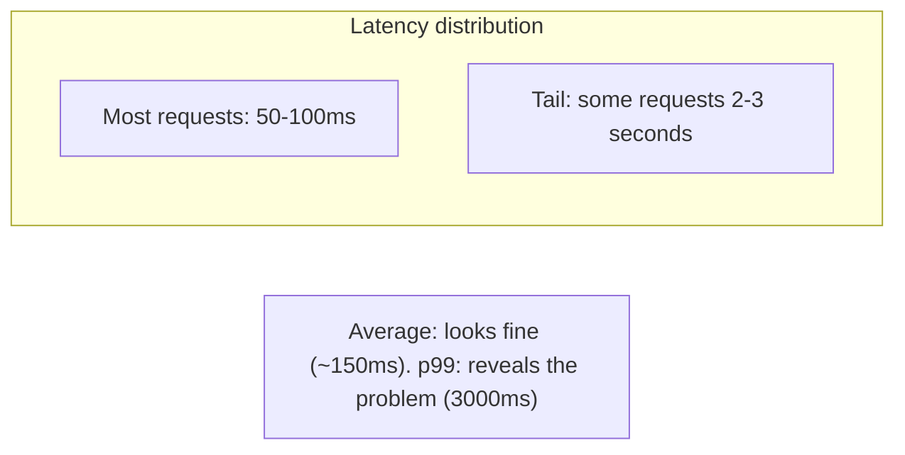
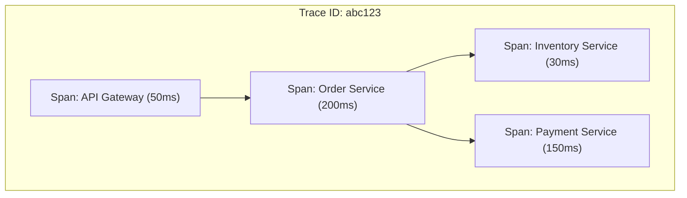
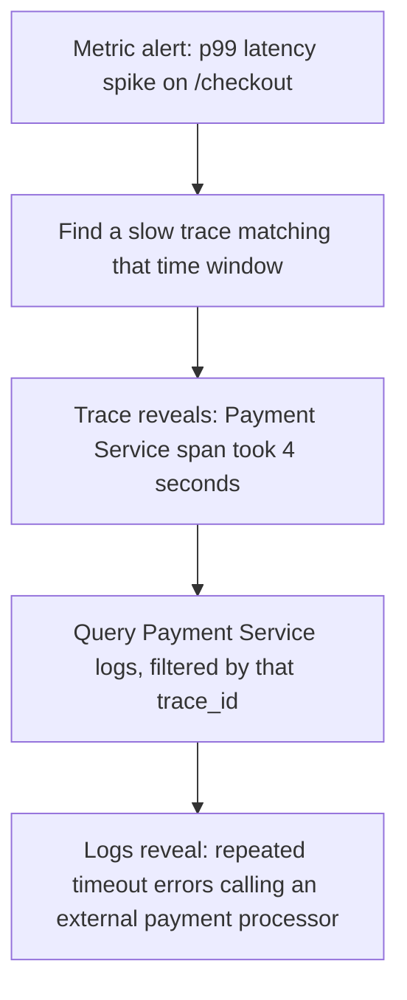

## Introduction

This chapter delivers on a promise made repeatedly throughout this series — Chapters 6, 32, and 34 all pointed here when discussing why debugging distributed systems is hard. **Observability** is the discipline (and toolset) that makes a distributed system's internal behavior understandable from the outside, without needing to modify it or guess.

## Observability vs Monitoring: A Distinction Worth Making

- **Monitoring** answers *known* questions you thought to ask in advance ("is CPU usage above 80%?", "is the error rate above 1%?") — it's built around predefined dashboards and alerts.
- **Observability** provides enough raw, detailed data that you can answer *new, unanticipated* questions after the fact ("why did exactly these specific users experience elevated latency between 2:03 and 2:07 PM, and only when calling this specific endpoint from this specific region?") — without needing to have predicted that specific question in advance and built a dashboard for it.

Modern systems need both — but observability's value is specifically in handling the "unknown unknowns" that inevitably arise in complex, distributed systems that monitoring alone, built around anticipated questions, cannot address.

## The Three Pillars



### Logs

Timestamped, discrete records of specific events — "User 42 logged in," "Payment failed: insufficient funds," "Cache miss for key X."

**Structured logging** (emitting logs as JSON with consistent fields, rather than free-form text) is essential at scale:

```java
// Unstructured (hard to query at scale)
log.info("User " + userId + " placed order " + orderId + " for $" + amount);

// Structured (queryable, filterable, aggregatable)
log.info("order_placed", Map.of(
    "user_id", userId,
    "order_id", orderId,
    "amount", amount,
    "trace_id", currentTraceId
));
```

**Centralized log aggregation** (e.g., the ELK stack — Elasticsearch, Logstash, Kibana — or cloud-native equivalents) collects logs from every service instance into one searchable system, since a single request's logs might be scattered across dozens of different, independently-deployed service instances (directly echoing Chapter 34's monolith-vs-microservices debugging discussion).

### Metrics

Numeric measurements aggregated over time — request rate, error rate, latency percentiles, CPU/memory usage, queue depth.

**Why percentiles matter more than averages**: An average latency of 100ms can hide the fact that 5% of requests take 3 seconds — those slow requests are averaged away and invisible. **p50, p95, p99** (median, 95th percentile, 99th percentile) latencies reveal this directly: "p99 latency is 3 seconds" tells you that 1% of your users are having a genuinely bad experience, information a simple average completely erases.



The **RED method** (Rate, Errors, Duration) and **USE method** (Utilization, Saturation, Errors) are common frameworks for deciding which metrics to actually track for services and resources, respectively — providing a structured starting point rather than tracking metrics ad hoc.

### Distributed Tracing

As referenced in Chapters 32 and 34: a **trace** represents a single request's complete journey across every service it touches, composed of individual **spans** (one span per unit of work, e.g., one span per service call).



**How it works**: A trace ID is generated at the entry point (typically the API Gateway, Chapter 6) and propagated via headers through every subsequent service call in that request's chain; each service creates its own span(s), tagged with that same shared trace ID, and reports them to a central tracing backend (e.g., Jaeger, Zipkin, or a cloud provider's tracing service) — which then reconstructs the full, cross-service timeline, showing exactly where time was spent and where failures occurred, for that one specific request.

```java
// Simplified illustration of trace context propagation
public ResponseEntity<OrderResponse> createOrder(HttpServletRequest request) {
    String traceId = request.getHeader("X-Trace-Id");
    if (traceId == null) {
        traceId = UUID.randomUUID().toString(); // this is the entry point - start a new trace
    }
    Span span = tracer.startSpan("create-order", traceId);
    try {
        // Propagate the trace ID to downstream calls
        inventoryClient.checkStock(sku, traceId);
        paymentClient.charge(request, traceId);
        return ResponseEntity.ok(orderResponse);
    } finally {
        span.finish(); // records duration, tags, and reports to tracing backend
    }
}
```

This is exactly the capability Chapter 32 identified as essential for debugging event-driven architectures, and Chapter 34 identified as a prerequisite before adopting microservices at all.

## Putting It Together: A Real Debugging Scenario



This walkthrough shows why all three pillars matter together: **metrics** detect that something is wrong and roughly when; **traces** pinpoint which specific service/component in a multi-service request path is responsible; **logs** (filtered by that trace's ID, connecting all three pillars) provide the detailed, specific context needed to actually identify the root cause.

## Alerting: Turning Observability Into Action

Metrics and logs are only useful operationally if they trigger **alerts** when something requires human attention. Good alerting practice:

- **Alert on symptoms, not causes**: Alert on "checkout error rate > 5%" (a user-facing symptom), not "CPU usage > 90%" (a possible cause that may or may not actually be causing user-facing harm) — symptom-based alerts avoid paging engineers for issues that don't actually matter to users.
- **Avoid alert fatigue**: Too many low-signal alerts train engineers to ignore or silence them, defeating the entire purpose — alert thresholds and coverage should be deliberately curated, not maximized.

## Summary

- Observability (answering unanticipated questions) complements monitoring (answering anticipated ones) — both are needed for a genuinely operable distributed system.
- Logs provide detailed, discrete event records (structured logging and centralized aggregation are essential at scale); metrics provide aggregated numeric trends over time (percentiles reveal tail latency that averages hide); traces show a single request's path across every service it touches.
- Distributed tracing works by propagating a shared trace ID through every service call in a request's chain, letting a tracing backend reconstruct the full cross-service timeline.
- Real debugging typically uses all three pillars together: metrics detect and localize a problem in time, traces localize it to a specific service, and logs (filtered by trace ID) provide the root-cause detail.
- Alerting should be symptom-based (alert on user-facing impact) and deliberately curated to avoid alert fatigue.

---

## Interview Questions

### 1. Explain the distinction between monitoring and observability, and why a system with excellent monitoring dashboards could still be genuinely difficult to debug during an unusual incident.
**Answer:** Monitoring is built around predefined metrics and dashboards answering questions engineers anticipated needing to ask in advance (CPU usage, error rate, request volume) — it's excellent for tracking known, expected failure modes and typical operational health. Observability is about having sufficiently detailed, granular underlying data (logs, traces, high-cardinality metrics) that engineers can investigate and answer *genuinely new, unanticipated* questions that arise during an unusual, novel incident — a system with excellent monitoring dashboards covering all the "expected" failure scenarios could still be very difficult to debug during a genuinely novel, unanticipated incident (e.g., "why are exactly these specific users, from exactly this one specific mobile app version, experiencing this exact specific symptom, only during this particular narrow time window") if the underlying data isn't detailed/granular enough to actually drill into and answer this kind of specific, unanticipated question after the fact — the pre-built dashboards, having been designed around anticipated scenarios, simply don't have a relevant view for this genuinely novel combination of factors.

**Follow-up:** *Why might "high cardinality" data (e.g., being able to filter/query by very specific, granular dimensions like individual user ID or exact request ID, not just broad categories) be specifically important for observability, even though this level of detail isn't typically needed for standard monitoring dashboards?* — Standard monitoring dashboards typically aggregate data across broad, low-cardinality dimensions (e.g., "error rate by service," "average latency by endpoint") which is sufficient for tracking overall system health trends — but investigating a genuinely novel, specific incident (as in the example above) often requires being able to drill down into much more granular, high-cardinality dimensions (a specific individual user, a specific individual request, a specific exact app version and device combination) that wouldn't be practical or useful to pre-build as a permanent, standing dashboard for every possible combination in advance — observability tooling specifically needs to support this kind of ad hoc, high-cardinality querying and filtering after the fact, which is a meaningfully different technical capability than simply displaying pre-aggregated, low-cardinality monitoring dashboards.

### 2. Why do percentile-based latency metrics (p50, p95, p99) provide meaningfully more useful information than a simple average latency metric?
**Answer:** An average latency metric can be significantly skewed or misleading because it mathematically blends together both the many fast requests and the comparatively few very slow ones into a single number that may not accurately represent what most users, or the worst-affected users, are actually experiencing — for example, if 95% of requests complete in 50ms but 5% take 3 seconds (perhaps due to occasional cache misses, garbage collection pauses, or specific edge-case data), the average might land around 150-200ms, appearing reasonably healthy overall, while completely obscuring the fact that a meaningful 5% of users are having a genuinely poor, slow experience. Percentile metrics directly reveal this distribution: p50 (median) shows what a "typical" request experiences, while p95 or p99 specifically show what the slower end of the distribution looks like — "p99 latency is 3 seconds" is a directly actionable, honest statement about the worst 1% of user experiences, which an average alone would have completely hidden from view.

**Follow-up:** *Why might a team specifically choose to focus on and alert on p99 latency rather than p50 or even p95, for a customer-facing critical path like checkout?* — Even a small percentage of genuinely poor experiences on a critical, revenue-generating path like checkout can represent a meaningful number of actual affected customers and lost revenue/trust at scale (e.g., 1% of a million daily checkout attempts still represents 10,000 customers having a bad experience) — and poor tail-latency experiences are often specifically correlated with the kinds of underlying issues (resource contention, specific edge-case data triggering slow code paths, intermittent downstream dependency issues) that, left unaddressed, tend to worsen over time or affect a growing percentage of users — proactively monitoring and alerting on p99 specifically helps catch and address these tail-latency issues while they're still affecting a relatively small percentage of users, before they potentially grow into a more widespread p95 or even p50-affecting problem.

### 3. Walk through how a trace ID enables reconstructing a single request's complete journey across multiple independently-deployed microservices.
**Answer:** When a request first enters the system (typically at an API Gateway or similar entry point, Chapter 6), a unique trace ID is generated for that specific request if one doesn't already exist; this trace ID is then propagated forward as the request triggers calls to downstream services — typically via an HTTP header (like `X-Trace-Id`) included in every subsequent internal service-to-service call stemming from this original request. Each individual service, as it processes its portion of the work for this request, creates one or more "spans" (representing a specific unit of work, like "handling this particular service's portion of the request," or "making this particular downstream call"), tags each span with that same shared trace ID (plus additional context like a unique span ID and a reference to its parent span, to establish the correct hierarchical/sequential relationship between spans), and reports this span data (including start time, duration, and any relevant tags/metadata) to a centralized tracing backend system (like Jaeger or Zipkin) — this backend, having received span data from every service involved in processing this specific trace ID, can then reconstruct and visualize the complete, end-to-end timeline of exactly how this one request flowed through and was processed by every service it touched, including how much time was spent in each specific step.

**Follow-up:** *What would happen to this reconstruction capability if one specific service in the call chain failed to correctly propagate the incoming trace ID to its own downstream calls?* — This would create a "broken" trace — the tracing backend would receive span data from the services before this specific break, and separately, span data from whatever downstream services were called after this break might either be reported under a completely new, unrelated trace ID (since that specific downstream call never received the original, correct trace ID to propagate further), or might simply be missing/unassociated with the original trace entirely — either way, the reconstructed trace visualization would show an incomplete, broken picture, showing the request's path up until this specific service, but then losing visibility into what happened downstream from that point — this specific propagation discipline (correctly passing the trace ID forward on every single service call) is a critical, easy-to-overlook implementation detail that every single service in a distributed system must correctly and consistently implement for distributed tracing to actually provide the complete, end-to-end visibility it's designed to offer.

### 4. In the debugging scenario walkthrough from this chapter (metric alert → trace → logs), why is it important that all three pillars share a common correlating identifier (the trace ID), rather than being three entirely separate, disconnected data sources?
**Answer:** If metrics, traces, and logs existed as three completely disconnected data sources with no way to correlate a specific incident's data across all three, an engineer investigating an issue would need to manually, painstakingly try to figure out which specific log entries or trace data actually correspond to the specific problem a metric alert flagged — e.g., "the metric alert says p99 latency spiked between 2:03 and 2:07 PM" only narrows things down to a *time window*, potentially still leaving thousands of individual requests and their corresponding logs/traces from that window to manually sift through to find the specific, actually-problematic ones. Having a shared trace ID that connects a specific problematic request's metric data point, its full distributed trace, and all its corresponding log entries across every service it touched, allows an engineer to go directly from "here's a specific slow request the metrics flagged" to "here's its exact trace showing which specific service/span was slow" to "here's the exact, detailed log entries from that specific service, for that exact request" — a precise, efficient, directly-correlated investigation path, rather than a broad, manual search across potentially enormous volumes of loosely-time-correlated but otherwise disconnected data.

**Follow-up:** *How might a well-designed observability system make it easy for logs to be "filtered by trace ID," given that a service's logs might contain many different requests' log entries interleaved together?* — This requires the service's logging code to explicitly, consistently include the current request's trace ID as a structured field in every single log entry it emits during that request's processing (as shown in this chapter's structured logging Java example) — with logs centrally aggregated (e.g., into Elasticsearch via the ELK stack) and this trace ID field properly indexed, an engineer can then simply query/filter the centralized log aggregation system for "all log entries where trace_id = abc123," instantly retrieving only the specific, relevant log entries for that one specific request across every service that logged anything related to it, rather than needing to manually search through each individual service's raw, unfiltered log stream separately.

### 5. Why is "alert on symptoms, not causes" considered a best practice for alerting design, and give an example illustrating the difference?
**Answer:** Alerting on a *cause* (like "CPU usage exceeded 90%") risks generating alerts for situations that don't actually, meaningfully impact users or the business — high CPU usage might be entirely benign (e.g., the system is simply handling a genuine, expected traffic spike efficiently and correctly, well within its actual serving capacity) or might correlate with many different possible underlying issues, none of which is directly, unambiguously indicated by the CPU metric alone. Alerting on a *symptom* (like "checkout error rate exceeded 5%," or "p99 checkout latency exceeded 3 seconds") directly captures the actual, user-facing impact that genuinely matters to the business — regardless of whatever specific underlying cause (high CPU, a slow database query, a failing downstream dependency) happens to be producing that symptom, the symptom-based alert accurately and directly signals "something is currently, actually harming real users' experience right now," which is precisely the kind of alert that should reliably page an engineer for immediate investigation, rather than potentially paging them for a "cause" metric that may or may not actually correspond to any real, current user-facing problem.

**Follow-up:** *Does this mean cause-based metrics (like CPU usage) have no useful role in a well-designed observability/alerting strategy?* — Not at all — cause-based metrics remain valuable for *investigation and root-cause diagnosis* once a symptom-based alert has already indicated that something genuinely is wrong (e.g., after the checkout-error-rate alert fires, an engineer would then reasonably look at CPU usage, database query latency, and other cause-oriented metrics specifically to help diagnose *why* the symptom is occurring) — the key distinction this best practice emphasizes is specifically about what should trigger an urgent, page-someone-immediately *alert* (symptoms, since they directly indicate genuine user-facing harm) versus what serves as useful *diagnostic/investigative* data once an alert has already been triggered by a genuine, confirmed symptom (causes, which help explain and resolve the underlying issue) — both types of metrics remain valuable, just for different specific purposes within the overall observability and incident-response workflow.

### 6. Why might "alert fatigue" be considered a genuine, serious operational risk, rather than simply an inconvenience?
**Answer:** When engineers are repeatedly paged or notified by low-signal, frequently-false-positive, or genuinely inconsequential alerts, they naturally and predictably begin to develop learned habits of quickly dismissing, silencing, or deprioritizing incoming alerts without careful investigation — this is a rational, understandable human response to an alerting system that has trained them (through repeated experience) that most alerts don't actually require urgent attention; the serious operational risk is that this same learned dismissive response will also apply to the rare, genuinely critical alert that *does* actually indicate a severe, urgent problem requiring immediate attention — buried among a flood of low-signal noise, a genuinely critical alert risks being missed, delayed, or dismissed along with all the other routinely-ignored noise, potentially causing a real, serious incident to go unaddressed for far longer than it should, specifically because the alerting system's own poor signal-to-noise ratio has undermined engineers' trust in and attentiveness to the alerting system overall.

**Follow-up:** *What practical technique can help reduce alert fatigue while still ensuring genuinely important issues are still reliably caught?* — Careful, deliberate alert threshold tuning and consolidation — regularly reviewing which alerts have historically fired, how often they turned out to represent genuine, actionable issues versus false positives or non-actionable noise, and adjusting thresholds/conditions accordingly (raising a threshold that fires too frequently for genuinely benign situations, or combining/correlating multiple related low-level alerts into a single, higher-confidence composite alert rather than firing many separate, individually-noisy alerts for what's really one underlying issue) — this is an ongoing, disciplined practice (sometimes formalized as regular "alert hygiene" reviews) rather than a one-time setup task, reflecting that alert quality tends to degrade over time as systems evolve unless deliberately, continuously maintained and refined based on real, observed alert-firing history and outcomes.

### 7. Why does structured logging (emitting logs as JSON with consistent fields) provide meaningfully more value than free-form text logging at scale, even though free-form text might seem more naturally human-readable?
**Answer:** Free-form text logs (e.g., "User 42 placed order 123 for $99.99") are indeed easily readable by a human looking directly at a small number of log lines, but become extremely difficult to programmatically search, filter, and aggregate at scale — extracting the user ID or order ID from thousands or millions of differently-worded free-form log messages (which might not even follow a perfectly consistent format across all the different places in the codebase that log similar events) typically requires fragile text-parsing/regex logic prone to breaking whenever the exact wording of a log message changes even slightly. Structured logs (emitting the same information as explicit, consistently-named fields like `user_id`, `order_id`, `amount` in a machine-parseable format like JSON) can be reliably, efficiently indexed, searched, filtered, and aggregated by a log aggregation system (like Elasticsearch) using these specific field names directly — enabling powerful, reliable queries like "show me all orders over $100 placed by user 42" or "count all payment failures in the last hour, grouped by failure reason" that would be extremely difficult, fragile, or outright impossible to reliably perform against unstructured, free-form text logs at any meaningful scale.

**Follow-up:** *Does structured logging mean logs are no longer human-readable at all, sacrificing readability for machine-queryability?* — Not entirely — most log aggregation/viewing tools (like Kibana, part of the ELK stack) provide human-friendly interfaces that can display structured JSON log entries in a readable, formatted way (showing each field clearly labeled), and well-designed structured logs typically still include a clear, human-readable message field alongside the additional structured fields (e.g., `{"message": "Order placed successfully", "user_id": 42, "order_id": 123, "amount": 99.99}`) — providing both the machine-queryability benefit of structured fields and reasonable human readability when directly viewing individual log entries through appropriate tooling, rather than being a strict either/or trade-off between the two.

### 8. In a system design interview, if asked "how would you debug a reported issue where a small percentage of users are experiencing intermittent slow page loads, with no obvious pattern," how would you walk through using the three pillars of observability?
**Answer:** You'd start with metrics — checking latency percentile metrics (specifically p95/p99, since this is described as affecting only a "small percentage" of users, which average latency would likely hide, per this chapter's earlier discussion) segmented across various dimensions (by endpoint, by region, by time) to try to identify any pattern in *when* or *where* these slow experiences are occurring, even if the initial report suggests "no obvious pattern" — metrics might reveal, for example, that the slowness specifically correlates with a particular geographic region or a particular time-of-day traffic pattern that wasn't initially obvious from user reports alone. Once metrics narrow down a specific time window and/or affected segment, you'd use distributed tracing to find actual example traces of slow requests matching that narrowed-down criteria, examining which specific service/span within those traces is responsible for the bulk of the elevated latency. Finally, you'd use the trace ID from these specific identified slow traces to pull the corresponding detailed logs from whichever specific service the trace identified as the bottleneck, looking for specific error messages, warnings, or contextual details (e.g., a specific downstream dependency timing out, a specific type of database query taking unusually long for specific data patterns) that explain the actual root cause of that specific service's elevated latency for these particular affected requests.

**Follow-up:** *What would you do if, after this investigation, you found that metrics and traces both looked essentially normal for the affected users' time windows, but user reports of slowness persisted?* — This would suggest the issue might not be fully captured by your current server-side observability instrumentation at all — you'd consider whether the slowness might actually be occurring client-side (e.g., in the user's browser/app itself, or in the network path between the user and your servers, rather than within your own backend services) — this would motivate investigating or introducing Real User Monitoring (RUM) — client-side instrumentation that captures actual, real-world page-load and interaction timing directly from users' browsers/devices — since server-side backend observability alone (metrics, traces, logs about backend processing) cannot capture or explain issues originating specifically in client-side rendering, network conditions between the user and your servers, or third-party client-side resources/scripts that server-side instrumentation has no visibility into at all.

### 9. Why might a distributed tracing system need to implement "sampling" (only recording detailed trace data for a subset of all requests, rather than every single one) in a very high-traffic system?
**Answer:** Recording full, detailed trace data (including every span, its timing, and associated metadata) for every single request in a very high-traffic system (potentially millions or billions of requests per day) would generate an enormous volume of tracing data — the storage cost of retaining this complete data, and the processing/network overhead of actually collecting, transmitting, and storing it for every single request, can become prohibitively expensive and potentially even impose a meaningful performance overhead on the actual production services generating this tracing data in the first place; sampling (e.g., only fully recording detailed trace data for, say, 1% of all requests, chosen either randomly or via some more targeted strategy) allows a system to still capture a statistically meaningful, representative sample of trace data — sufficient for identifying general patterns, common bottlenecks, and typical latency distributions — without the full cost and overhead of exhaustively tracing every single request.

**Follow-up:** *Why might a well-designed tracing system specifically use a higher sampling rate for requests that resulted in an error, compared to the sampling rate for entirely successful requests?* — Since one of the most valuable use cases for distributed tracing is precisely investigating and root-causing *failures* or *errors* (as opposed to just understanding typical, successful-case latency patterns), always capturing full, detailed trace data for requests that resulted in an error (even while applying a lower sampling rate to successful requests, since there are typically far more of those and the marginal diagnostic value of tracing yet another successful, unremarkable request is lower) ensures that whenever an engineer actually needs to investigate a specific failure, the detailed trace data for that exact failed request is very likely to be available — this "always sample errors, sample successes at a lower rate" strategy (sometimes called biased or priority sampling) provides much better practical diagnostic value for the same or even lower overall tracing data volume/cost, compared to a simpler uniform random sampling rate applied identically regardless of whether a request succeeded or failed.

### 10. Why does this chapter argue that observability is a "prerequisite" for adopting microservices (Chapter 34) and event-driven architecture (Chapter 32), rather than an optional, add-later enhancement?
**Answer:** As both of those earlier chapters explicitly discussed, the fundamental debugging/understanding challenge these architectural styles introduce — a single logical operation's effects spreading across many independently-deployed services, and, in the event-driven case, unfolding asynchronously through decoupled, independently-reacting consumers — makes it genuinely, substantially harder to understand "what actually happened and why" for any given request or business operation, compared to a single-process monolith's comparatively simple, unified call-stack debugging model; without adequate observability tooling (centralized structured logging, meaningful metrics, and especially distributed tracing with proper trace-ID propagation across every service boundary and asynchronous message hop) already in place, a team adopting microservices or event-driven architecture would find themselves essentially unable to effectively diagnose and resolve production issues in their new, more architecturally complex system — the debugging complexity these architectural styles introduce isn't a minor inconvenience to be addressed later once it becomes painful; it's a fundamental, immediate operational capability gap that, left unaddressed, can severely undermine a team's ability to reliably operate the new architecture in production from day one.

**Follow-up:** *What practical recommendation would this imply for a team's actual project sequencing when planning a migration to microservices, connecting to Chapter 39's Strangler Fig pattern discussion?* — This strongly suggests that investing in and establishing proper observability infrastructure (centralized logging, metrics collection, and distributed tracing with trace-ID propagation) should be one of the very first steps in a microservices migration plan — ideally established and validated even before or alongside the very first piece of functionality is extracted via the Strangler Fig pattern (Chapter 39) — rather than being treated as a lower-priority task to be addressed only after several services have already been extracted and the team has already begun experiencing genuine, painful difficulty debugging issues in their new, more distributed architecture without adequate tooling in place; treating observability infrastructure as a foundational prerequisite, established early in the migration sequence, directly avoids this entirely predictable and avoidable operational pain point.
