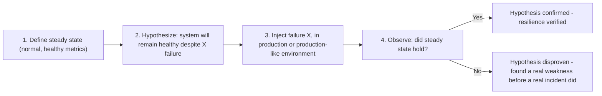

## Introduction

Chapters 40-41 covered redundancy, fault tolerance, and disaster recovery — but how do you actually know these mechanisms work correctly, before a real disaster forces you to find out the hard way? **Chaos engineering** is the discipline of deliberately, carefully injecting failures into a system (often in production) to verify resilience empirically, rather than trusting it in theory.

## Why Assumptions About Resilience Are Often Wrong

Chapter 41 explicitly warned that an untested disaster recovery plan is unreliable. The same principle applies more broadly: a circuit breaker (Chapter 36) that's never actually been triggered by a real failure might have a subtle bug in its failure-detection logic; a database failover mechanism (Chapter 15) that's never actually been exercised might fail in ways nobody anticipated; a "redundant" system that seems well-architected on a diagram might have a hidden shared dependency (Chapter 40's independence requirement) nobody noticed. Chaos engineering's core insight: **the only way to know resilience mechanisms actually work is to actually trigger the failures they're meant to handle, deliberately and safely, before an uncontrolled real failure does it for you.**

## The Core Methodology

1. **Define steady state**: What do normal, healthy system metrics look like (Chapter 42's observability directly enables this)?
2. **Form a hypothesis**: "If Service B's instances start failing, the circuit breaker should trip within 10 seconds, and overall system latency should remain within normal bounds."
3. **Inject the failure**: Deliberately cause the specific failure being tested (safely, with careful scoping — see below).
4. **Observe and compare**: Did the system actually behave as hypothesized? If yes, resilience is verified for that specific scenario. If no, you've just discovered a real, previously-unknown weakness — in a controlled way, on your own terms, rather than during an actual uncontrolled incident.

## Common Chaos Experiments

- **Instance termination**: Randomly kill a running server instance — does the load balancer (Chapter 8) correctly detect this and route around it? (Netflix's famous "Chaos Monkey" tool does exactly this.)
- **Network latency injection**: Artificially add latency to calls between specific services — does the circuit breaker (Chapter 36) trip appropriately, and do timeouts behave as expected?
- **Network partition simulation**: Block traffic between specific nodes — does the system behave according to its intended CAP/PACELC trade-off (Chapters 18-19), or does it behave in some unanticipated, incorrect way?
- **Resource exhaustion**: Deliberately consume CPU, memory, or disk on a specific instance — does the system gracefully degrade (Chapter 41) rather than failing catastrophically?
- **Dependency failure injection**: Make a specific downstream service (or a third-party API) return errors or time out — does the calling service's fallback logic (Chapter 36) actually work as designed?
- **Region/AZ failure simulation**: Simulate an entire availability zone or region becoming unavailable — does traffic correctly fail over per Chapter 40's redundancy architecture?

## Why Run Chaos Experiments in Production (Carefully)

A common objection: "Why not just test this in staging?" Staging environments frequently differ from production in ways that matter — different traffic patterns, different data volumes, different scale, sometimes even different infrastructure configurations — meaning a resilience mechanism that appears to work correctly in staging might behave completely differently under genuine production conditions (real traffic patterns, actual data skew, real-world timing and concurrency). Chaos engineering in production, done carefully, tests the system under the conditions that actually matter.

**Critical safety principles for production chaos experiments**:
- **Minimize blast radius**: Start with the smallest possible scope (e.g., affecting 1% of traffic, or a single non-critical instance) before considering broader experiments.
- **Have a rollback/abort mechanism ready**: If an experiment reveals a problem worse than expected, be able to immediately stop it.
- **Run during low-traffic periods initially**, and with the team actively monitoring, before considering more routine/automated execution.
- **Get organizational buy-in first**: Chaos engineering deliberately causes real failures — every stakeholder who could be affected needs to understand and endorse this practice before it begins.

## GameDays: Chaos Engineering as a Team Exercise

A **GameDay** is a scheduled, deliberate exercise where a team simulates a specific failure scenario (sometimes chaos-engineering-tool-driven, sometimes manually orchestrated) and practices their actual incident response — directly testing not just the system's technical resilience, but the team's own processes, runbooks (Chapter 41), and communication under simulated pressure. This combines chaos engineering's technical verification with disaster recovery's human-factor testing (also discussed in Chapter 41).

## Chaos Engineering Tools

- **Chaos Monkey (Netflix)**: The original, famous tool — randomly terminates instances in production to verify systems tolerate individual instance failures.
- **Chaos Toolkit, Gremlin**: More general-purpose chaos engineering platforms supporting a broader range of failure injection types (network, resource, dependency).
- **AWS Fault Injection Simulator, Azure Chaos Studio**: Cloud-provider-native chaos engineering tooling, integrated directly with the underlying cloud infrastructure.

## Summary

- Chaos engineering deliberately injects controlled failures into a system to empirically verify that resilience mechanisms (redundancy, circuit breakers, failover) actually work, rather than trusting untested assumptions.
- The core methodology: define steady state, form a hypothesis about resilience to a specific failure, inject that failure, and observe whether the hypothesis held.
- Common experiments include instance termination, network latency/partition injection, resource exhaustion, and simulated region/AZ failures.
- Running experiments in production (carefully, with minimized blast radius and a ready rollback plan) tests conditions staging environments often can't accurately replicate.
- GameDays extend chaos engineering into a team exercise, testing human incident-response processes alongside technical resilience.

---

## Interview Questions

### 1. What is the core insight behind chaos engineering, and why does it specifically argue against simply trusting a system's resilience mechanisms based on architecture review alone?
**Answer:** The core insight is that resilience mechanisms — redundancy, failover, circuit breakers, disaster recovery plans — are only genuinely verified to work correctly once they've actually been triggered and observed to behave as intended; an architecture diagram or code review might look correct in theory, but subtle bugs, unanticipated edge cases, hidden shared dependencies (Chapter 40's independence requirement), or incorrect assumptions about failure behavior can all exist undetected until the actual failure scenario they're meant to handle genuinely occurs. Chaos engineering directly argues against relying solely on theoretical confidence (architecture review, code review, "we designed it correctly so it should work") by empirically, deliberately testing these mechanisms under controlled, deliberate conditions — verifying actual, observed behavior rather than trusting assumed, unverified behavior, directly extending the same "untested disaster recovery plans are unreliable" principle from Chapter 41 to the broader category of all resilience mechanisms throughout a system.

**Follow-up:** *Why might even a thorough code review specifically fail to catch the kind of problems chaos engineering is designed to reveal?* — Code review typically evaluates whether code appears logically correct based on the reviewer's understanding of intended behavior and common failure scenarios they think to consider — but genuinely subtle distributed-systems bugs often only manifest under specific, hard-to-anticipate timing conditions, real production-scale concurrency, or unusual combinations of partial failures that a code reviewer, working from a static reading of the code, simply wouldn't think to specifically trace through and verify — chaos engineering's empirical, "actually trigger the real condition and observe" approach can reveal exactly these kinds of subtle, hard-to-anticipate issues that even careful, thorough code review focused on theoretical correctness might miss entirely.

### 2. Walk through the four steps of the chaos engineering methodology, and explain why defining "steady state" (step 1) must happen before injecting any failure.
**Answer:** Step 1 defines steady state — establishing clear, well-understood, normal/healthy metrics for the system under typical, non-experimental conditions (directly relying on Chapter 42's observability capabilities to actually measure and define this baseline). Step 2 forms a specific, falsifiable hypothesis about how the system should behave if a specific failure were to occur (e.g., "the circuit breaker will trip within 10 seconds, and overall checkout latency will remain under 500ms even during this failure"). Step 3 actually injects that specific failure into the system. Step 4 observes whether the system's actual behavior during and after the injected failure matched the hypothesis, by comparing against the previously-established steady-state baseline. Defining steady state before injecting any failure is essential because, without a clear, well-established baseline of what "normal" actually looks like, there would be no reliable way to determine whether the observed behavior during the injected failure represents a genuine, meaningful deviation (indicating a real resilience problem) or is simply within the range of normal, expected variation the system already exhibits even without any deliberately injected failure — the baseline is what makes the subsequent comparison in step 4 actually meaningful and interpretable.

**Follow-up:** *Why does the hypothesis in step 2 need to be specific and falsifiable, rather than a vague statement like "the system should handle this failure well"?* — A vague hypothesis provides no clear, objective criteria for determining success or failure of the experiment — "handle this well" could be interpreted many different ways after the fact, potentially leading to motivated reasoning where an ambiguous or even genuinely concerning outcome gets rationalized as acceptable; a specific, falsifiable hypothesis (with concrete, measurable thresholds like "latency remains under 500ms" or "the circuit breaker trips within 10 seconds") provides an objective, pre-committed standard against which the actual observed outcome can be clearly and unambiguously evaluated, avoiding the risk of after-the-fact rationalization and ensuring the experiment genuinely tests what it claims to test, in a way that produces a clear, actionable, and honest result (confirmed or disproven) rather than an ambiguous, debatable one.

### 3. Why might a chaos experiment specifically need to be run in production, rather than being considered fully sufficient if run only in a staging/test environment?
**Answer:** Staging environments frequently differ from production in ways that meaningfully affect how resilience mechanisms actually behave — real production traffic patterns (genuine, often unpredictable user behavior, realistic request volume and concurrency), real production data characteristics (actual data skew, real edge cases present in genuine user-generated data that synthetic test data often doesn't replicate), and sometimes even genuine infrastructure/configuration differences between staging and production environments — mean that a circuit breaker, failover mechanism, or redundancy architecture that appears to work correctly under staging's more controlled, lower-scale, and potentially less realistic conditions might behave completely differently (perhaps failing in ways not observed in staging at all) once subjected to genuine production-scale traffic and real-world data/timing conditions; chaos engineering's core value proposition is specifically about verifying resilience under the *actual* conditions that matter for real users and real business impact, which staging environments, however well-intentioned, often cannot fully and faithfully replicate.

**Follow-up:** *Given the genuine risk involved in deliberately injecting failures into a live production system, what specific safety principle from this chapter would you prioritize first when introducing chaos engineering to an organization that has never practiced it before?* — "Minimize blast radius" — starting with the smallest possible, most carefully-scoped experiments (e.g., affecting a tiny percentage of traffic, or a single non-critical instance, rather than a large-scale or system-wide experiment) allows an organization new to chaos engineering to build confidence, validate their tooling and rollback/abort mechanisms actually work correctly, and develop organizational experience and trust in the practice incrementally — before considering broader, more impactful experiments — directly mirroring this series' broader recurring theme (Chapters 7, 34, 39, 41) of introducing significant new practices/complexity incrementally and cautiously, rather than adopting the most aggressive version of a new practice immediately without first building proportionate experience and confidence.

### 4. What is a GameDay, and how does it extend chaos engineering beyond purely technical system verification?
**Answer:** A GameDay is a scheduled, deliberate team exercise where a specific failure scenario is simulated (whether through actual chaos-engineering tooling or manually orchestrated by the team), and the team practices their genuine incident-response process in reaction to it — this extends chaos engineering beyond just verifying whether the *system's* technical resilience mechanisms work correctly, to also testing whether the *team's* human processes (following documented runbooks, per Chapter 41's disaster recovery discussion; internal communication and escalation during an incident; correctly diagnosing the issue using the observability tooling from Chapter 42; making appropriate, timely decisions under simulated pressure) actually function effectively when a genuine (if simulated) failure scenario occurs — directly combining chaos engineering's technical failure-injection methodology with the human-factor testing concerns Chapter 41 raised regarding disaster recovery plans needing genuine, practiced execution rather than existing only as untested, written documentation.

**Follow-up:** *Why might a GameDay specifically reveal problems that a purely automated, tooling-driven chaos experiment (without direct team involvement) would not?* — A purely automated chaos experiment (e.g., an automated tool randomly terminating an instance in the background, with the system's automated resilience mechanisms simply handling it without any human involvement or awareness) tests only the automated, technical resilience layer — it doesn't test whether the human engineers on call would actually correctly notice, diagnose, and appropriately respond to a similar but perhaps slightly different or more severe scenario that *does* require human intervention (e.g., a failure severe enough that the automated mechanisms alone aren't sufficient, requiring a human to follow a specific runbook, make a judgment call, or coordinate with other team members) — a GameDay specifically and deliberately engages the human team in this response process, revealing gaps not just in the system's automated technical resilience, but in the team's own documented processes, tooling familiarity, communication protocols, and decision-making under the specific, realistic pressure of an active (if simulated) incident — a distinctly different and complementary kind of verification than purely automated, background chaos experiments alone provide.

### 5. A candidate proposes running a large-scale chaos experiment (simulating an entire region failure) as their organization's very first chaos engineering exercise. Why would you push back on this specific choice?
**Answer:** This directly violates the "minimize blast radius" safety principle discussed in this chapter — an organization's very first chaos engineering exercise should start with the smallest, most carefully-controlled, lowest-risk experiments (e.g., terminating a single, redundant, non-critical instance) specifically to validate that the team's chaos engineering tooling, monitoring, and rollback/abort mechanisms actually work correctly, and to build organizational experience, confidence, and appropriate safety discipline around this practice incrementally; jumping directly to a large-scale, high-blast-radius experiment (an entire region failure simulation) as a very first exercise carries substantial risk — if something goes wrong in an unexpected way (the experiment itself has an implementation bug, the "simulated" failure inadvertently causes broader, unintended real impact, or the team's rollback/abort mechanisms turn out to be inadequate, precisely because they've never been genuinely tested at all before this first, high-stakes experiment), the organization would be experiencing this failure at the largest, most impactful possible scale, with a team that has zero prior chaos-engineering experience to draw on — exactly the scenario the incremental, blast-radius-minimizing approach is specifically designed to avoid.

**Follow-up:** *What would be a more appropriate sequence of chaos experiments for this organization to build toward eventually being able to confidently run a full region-failure simulation?* — A reasonable, incremental sequence might start with: (1) terminating a single, known-redundant, non-critical instance during a low-traffic period, with the team closely monitoring and ready to intervene; (2) once that's validated successfully multiple times, expanding to terminating multiple instances of a single service simultaneously, still with careful monitoring; (3) introducing network latency/partition experiments between specific, less-critical services; (4) gradually expanding scope and criticality of experiments as the team builds confidence, tooling maturity, and validates their monitoring/rollback capabilities at each step; and only after this kind of gradual, validated progression, (5) eventually attempting a full AZ or region failure simulation, likely still starting with the smallest, most isolated version of that experiment (perhaps during a scheduled GameDay with full team awareness and readiness) before considering it a routine, more automated practice.

### 6. Why does chaos engineering's value proposition specifically depend on having good observability (Chapter 42) already in place?
**Answer:** Chaos engineering's core methodology explicitly requires being able to precisely define "steady state" (accurately measuring and understanding normal, healthy system behavior) and then being able to clearly observe and measure the system's actual behavior during and after an injected failure, in order to determine whether the pre-formed hypothesis was confirmed or disproven — without adequate observability tooling (the metrics, logs, and traces discussed in Chapter 42), a team would have no reliable, precise way to actually measure and compare "steady state" against "behavior during the injected failure," making it essentially impossible to draw any clear, confident, evidence-based conclusion from a chaos experiment at all; you'd be injecting failures somewhat blindly, without the necessary instrumentation to actually observe and understand the resulting system behavior with the precision needed to determine whether your resilience hypothesis was actually confirmed or revealed a genuine problem.

**Follow-up:** *Does this mean an organization must have "perfect" or comprehensive observability across their entire system before attempting any chaos engineering at all?* — Not necessarily to a perfect, comprehensive degree — but they do need at least sufficient observability specifically covering the particular metrics/behaviors relevant to whatever specific hypothesis a given chaos experiment is testing (e.g., if testing "does the circuit breaker trip correctly," you need at minimum reliable visibility into the circuit breaker's state and the relevant service's error rate/latency) — an organization could reasonably build out observability incrementally, in tandem with incrementally expanding their chaos engineering practice, ensuring that whatever specific experiment they're about to run has adequate, relevant observability in place to actually measure and interpret its results meaningfully, rather than needing comprehensive, system-wide observability perfection as a strict, blocking prerequisite before beginning any chaos engineering work at all.

### 7. Why might "network latency injection" be a particularly valuable chaos experiment specifically for verifying circuit breaker (Chapter 36) behavior, compared to simply terminating an instance?
**Answer:** Instance termination typically causes an immediate, clear failure (the instance simply stops responding entirely) — which is a relatively straightforward failure mode for a circuit breaker (and load balancer health checks, Chapter 8) to detect and respond to, since there's an unambiguous "this instance is completely down" signal. Network latency injection specifically tests a subtler, often more realistic and more challenging failure mode: a dependency that's still technically "up" and responding, but doing so *slowly* — this specifically tests whether a circuit breaker's failure-detection logic correctly identifies and responds to this kind of degraded-but-not-fully-down performance (e.g., does the circuit breaker's timeout and failure-threshold configuration correctly trip in response to consistently slow responses, not just complete failures?) — this distinction matters because in real-world production incidents, a slow, degraded dependency is often actually a more common and more insidious failure mode than a complete, unambiguous outage, and it's a scenario that's easy to overlook or under-test if chaos experiments only ever simulate complete, clear-cut failures like instance termination.

**Follow-up:** *Why might a "slow but not down" dependency actually be more dangerous to a calling system than a dependency that's completely, unambiguously down?* — This connects directly back to this chapter's opening cascading-failure discussion (Chapter 36) — a completely down dependency typically fails fast (connection refused, immediate error), allowing a calling service to quickly detect the failure and respond (fail fast, trigger fallback); a slow-but-technically-responding dependency, without a properly configured and tested timeout/circuit-breaker mechanism, can cause calling threads/connections to remain blocked waiting for a response that eventually does arrive (just very slowly) — this "slow" failure mode can be specifically more dangerous because it more effectively and insidiously exhausts the calling service's limited resources (threads, connections) over an extended period, compared to a fast, clean failure that at least allows for quick detection and response — making this specific failure mode (which network latency injection experiments specifically test for) a particularly important one to verify resilience against.

### 8. In a system design interview, if asked "how would you build confidence that your proposed multi-region failover architecture (Chapter 40) would actually work correctly during a genuine regional outage," how would chaos engineering factor into your answer?
**Answer:** You'd explain that architectural design and code review alone provide only theoretical confidence — genuine confidence requires empirically verifying the failover mechanism actually works as intended, which is precisely what a carefully-scoped chaos engineering experiment specifically simulating a regional failure (or, following the incremental blast-radius-minimizing principle discussed in this chapter, first simulating smaller-scale precursor failures like individual AZ failures, before eventually working up to a full region-failure simulation) would provide; you'd propose defining clear steady-state metrics and a specific, falsifiable hypothesis (e.g., "if region A becomes unavailable, traffic should automatically fail over to region B within X seconds, with no more than Y seconds of elevated error rates during the transition"), then actually executing this experiment (likely first in a lower-stakes, off-peak time window, with careful monitoring and an abort mechanism ready) to empirically confirm whether the failover architecture genuinely performs as designed under real, if deliberately induced, conditions — rather than simply asserting confidence in the architecture based on its design alone, without this kind of empirical, chaos-engineering-based verification.

**Follow-up:** *How would you incorporate GameDays into this same answer, beyond just the automated technical chaos experiment itself?* — You'd additionally propose conducting a GameDay exercise specifically built around this same regional-failure scenario — not just verifying that the automated failover mechanisms work correctly (the technical chaos experiment), but also ensuring the on-call team correctly recognizes, follows appropriate escalation/communication procedures for, and effectively responds to a genuine region-level incident scenario, practicing their actual incident-response runbooks and processes (Chapter 41) in a realistic, simulated context — this combines verifying both the technical resilience of the multi-region architecture itself and the human/organizational readiness to correctly recognize and respond to this specific class of severe incident, providing a more complete, holistic confidence-building exercise than technical chaos experimentation alone would provide.

### 9. Why does chaos engineering represent a philosophical shift from "trying to prevent all failures" to "assuming failures will happen and verifying the system handles them gracefully"?
**Answer:** Traditional approaches to reliability often focus primarily on failure *prevention* — writing more careful code, more thorough testing, more redundant infrastructure, all aimed at reducing the *probability* that any given failure occurs in the first place; chaos engineering instead starts from the explicit, realistic acknowledgment that in any sufficiently complex distributed system, failures of various kinds (individual component failures, network issues, dependency slowdowns) are not just possible but genuinely inevitable over a long enough time horizon, no matter how much prevention effort is invested — and specifically shifts focus toward verifying and improving the system's *response* to these inevitable failures (graceful degradation, correct failover, appropriate fallback behavior) rather than solely trying to prevent failures from ever occurring at all; this mirrors a broader theme found throughout Parts 4 and 7 of this series (distributed locks' fencing tokens, idempotency, circuit breakers, disaster recovery) — genuinely robust distributed systems are built with the explicit, realistic assumption that individual components *will* fail, designing for correct, graceful behavior *despite* this inevitability, rather than pursuing the unrealistic goal of a system that simply never experiences any component failure at all.

**Follow-up:** *Does this philosophical shift mean failure-prevention efforts (careful coding practices, thorough testing, code review) become less valuable or less necessary once an organization adopts chaos engineering?* — Not at all — failure prevention and failure-response verification are complementary, not competing, priorities; reducing the *frequency* of failures through good prevention practices remains valuable and important (fewer failures generally means less operational burden and better baseline user experience), while chaos engineering specifically addresses the complementary, equally important question of "given that some failures will still inevitably occur despite our prevention efforts, does our system actually handle them gracefully when they do?" — a mature, comprehensive approach to reliability engineering invests meaningfully in both failure prevention (reducing frequency) and failure-response verification via chaos engineering (ensuring graceful handling of the failures that do still occur), rather than treating either as a complete, sufficient reliability strategy on its own.

### 10. Why might introducing chaos engineering to an organization require significant "organizational buy-in," beyond just the technical implementation of the chaos experiments themselves?
**Answer:** Chaos engineering deliberately, intentionally causes real failures (even if carefully scoped and controlled) in systems that real users and business stakeholders depend on — this represents a significant cultural and organizational shift from a more traditional mindset of "we try to prevent any failures at all costs" to "we deliberately cause controlled failures on our own terms, to learn from them proactively" — without genuine buy-in and understanding from relevant stakeholders (engineering leadership, product/business stakeholders who might be understandably nervous about deliberately-caused production incidents, customer support teams who need to understand why a deliberately-induced brief disruption occurred and how to handle any resulting customer inquiries), a chaos engineering practice risks generating significant organizational friction, fear, or even direct pushback/cancellation the first time an experiment causes any visible impact, however small and however valuable the resulting learning — genuine organizational buy-in, established clearly before beginning any chaos engineering practice, ensures all relevant stakeholders understand and support the practice's value and accept its calculated, carefully-managed risks, rather than being blindsided or alarmed by what might otherwise appear to be an unexplained, concerning production incident.

**Follow-up:** *What specific communication or process practice would you recommend to help build and maintain this organizational buy-in over time, beyond just an initial one-time approval?* — Establishing clear, transparent communication practices around chaos engineering activities — such as advance notice to relevant stakeholders before significant experiments (especially larger-scale ones or GameDays), clear documentation and sharing of what was learned from each experiment (including both confirmed resilience and any newly-discovered weaknesses, framed constructively as valuable proactive learning rather than embarrassing failures), and regularly reporting on the practice's overall value (e.g., "chaos engineering helped us discover and fix N potential production issues before they caused real customer impact") — this ongoing, transparent communication helps maintain and reinforce organizational trust and support for the practice over time, rather than relying solely on a one-time initial approval that might erode if subsequent experiments aren't clearly communicated or their value isn't consistently, visibly demonstrated to the broader organization.
