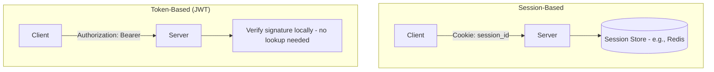
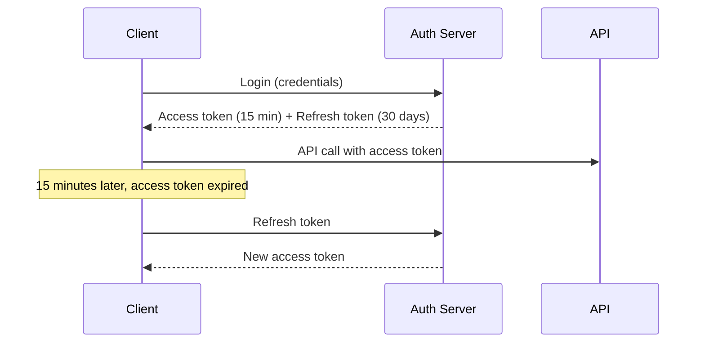
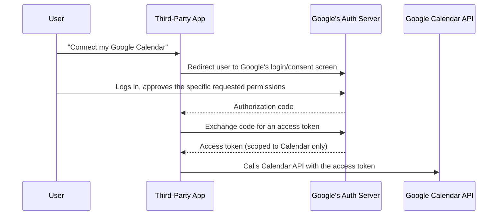
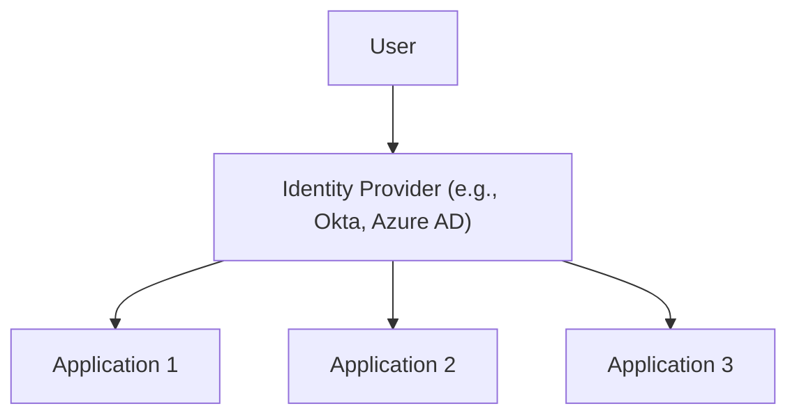

## Introduction

Chapter 4 introduced `Authorization` headers and cookies; Chapter 6 mentioned auth as an API Gateway responsibility. This chapter treats it properly — the mechanisms behind verifying identity (**authentication**) and permissions (**authorization**), and how they work across a distributed system where services can't inherently trust each other.

## Authentication vs Authorization

- **Authentication (AuthN)**: "Who are you?" — verifying identity.
- **Authorization (AuthZ)**: "What are you allowed to do?" — verifying permissions, *after* identity is established.

These are sequential and distinct: you must authenticate before you can be meaningfully authorized, but successful authentication doesn't imply any particular authorization — a correctly-identified user might still be forbidden from a specific action (directly echoing Chapter 4's `401` vs `403` distinction).

## Session-Based vs Token-Based Authentication (Revisited)

Chapter 4 introduced this distinction; here's the fuller picture:



Session-based auth requires a server-side lookup (to a shared session store) on every request — this ties back to Chapter 2's statelessness discussion, since it reintroduces a dependency the server needs to check. Token-based auth (JWTs) embeds the necessary claims directly in a cryptographically signed token, letting any server instance validate it independently, without a shared lookup — better suited to distributed, horizontally-scaled systems (Chapter 7).

## JWT (JSON Web Tokens) in Detail

A JWT has three parts, separated by dots: `header.payload.signature`.

```json
// Header (algorithm and token type)
{ "alg": "HS256", "typ": "JWT" }

// Payload (claims - the actual data)
{ "sub": "user123", "role": "admin", "exp": 1735689600 }

// Signature: HMACSHA256(base64(header) + "." + base64(payload), secretKey)
```

```java
public String generateJwt(String userId, String role) {
    return Jwts.builder()
            .setSubject(userId)
            .claim("role", role)
            .setExpiration(Date.from(Instant.now().plus(1, ChronoUnit.HOURS)))
            .signWith(SignatureAlgorithm.HS256, secretKey)
            .compact();
}

public Claims validateAndParseJwt(String token) {
    return Jwts.parser()
            .setSigningKey(secretKey)
            .parseClaimsJws(token) // throws an exception if signature is invalid or token expired
            .getBody();
}
```

**Critical property**: The payload is **base64-encoded, not encrypted** — anyone can decode and read a JWT's contents. The signature only guarantees the contents haven't been *tampered with*, not that they're secret. **Never put sensitive data (passwords, secrets) in a JWT payload.**

### Access Tokens and Refresh Tokens

- **Access token**: Short-lived (minutes to a couple hours), used for actual API calls — limits the damage window if one is stolen.
- **Refresh token**: Longer-lived, stored more securely, used *only* to obtain a new access token when the current one expires — without requiring the user to log in again.



**The revocation problem (revisited from Chapter 4)**: A stateless JWT, once issued, remains valid until it naturally expires — there's no simple way to invalidate one early. Short access-token lifetimes limit this exposure window; revoking a *refresh* token (which, unlike access tokens, is typically checked against a server-side store, since it's used relatively rarely) is how systems actually implement "log out everywhere" functionality.

## OAuth 2.0: Delegated Authorization

OAuth 2.0 solves a different, specific problem: letting a user grant a **third-party application** limited access to their data on another service, **without sharing their password** with that third party. ("Allow [App] to access your Google Calendar.")



Key concepts:
- **Scopes**: The specific, limited permissions being granted (`calendar.readonly`, not full account access) — a direct application of the principle of least privilege.
- **The user's actual Google password never touches the third-party app at all** — only Google's own login page sees it, and the app only ever receives a scoped, revocable access token.

**Important distinction**: OAuth 2.0 is fundamentally an *authorization* framework (granting access to resources), not an authentication protocol — a common point of confusion. **OpenID Connect (OIDC)** is built *on top of* OAuth 2.0 specifically to add a standardized authentication layer (an `ID token`, a JWT specifically containing identity claims like the user's verified email), which is what actually powers "Sign in with Google"-style login flows.

## Single Sign-On (SSO)

SSO lets a user authenticate once with a central **Identity Provider (IdP)** and gain access to multiple, independent applications without logging in separately to each.



Implemented via protocols like **SAML** (older, XML-based, common in enterprise contexts) or **OIDC** (newer, JSON/REST-based, increasingly the default for modern applications) — both work on the same underlying principle: the IdP authenticates the user once and issues a signed assertion/token that each participating application trusts, without each application needing to independently manage that user's password.

## Authorization Models

- **RBAC (Role-Based Access Control)**: Permissions attached to roles (`admin`, `editor`, `viewer`), users assigned to roles — simple, widely used, but can become unwieldy with highly granular, resource-specific permission needs.
- **ABAC (Attribute-Based Access Control)**: Permissions computed dynamically from attributes of the user, resource, and context (`allow if user.department == resource.department AND time is business_hours`) — more flexible and fine-grained, at the cost of more complex policy management.

## Summary

- Authentication verifies identity; authorization verifies permissions — sequential, distinct concerns.
- JWTs enable stateless, horizontally-scalable authentication by embedding signed claims directly in the token, at the cost of harder revocation — mitigated via short-lived access tokens plus longer-lived, server-checked refresh tokens.
- OAuth 2.0 solves delegated authorization (granting a third party limited, scoped access without sharing credentials); OpenID Connect builds authentication on top of it, powering "Sign in with X" flows.
- SSO lets users authenticate once with a central Identity Provider to access multiple applications, via protocols like SAML or OIDC.
- RBAC and ABAC are the two dominant authorization models, trading simplicity against fine-grained flexibility.

---

## Interview Questions

### 1. Explain the distinction between authentication and authorization, and why a correctly-authenticated user can still receive a 403 Forbidden response.
**Answer:** Authentication establishes *who* a user is — verifying their claimed identity, typically via credentials, a valid session, or a valid token. Authorization is a separate, subsequent determination of *what that specific, now-verified identity is permitted to do* — checking their permissions/roles against the specific action or resource they're attempting to access. A user can be fully, correctly authenticated (the system genuinely knows who they are, with high confidence) while still lacking the specific permissions needed for a particular action (e.g., a regular authenticated user attempting to access an admin-only endpoint) — in this case, the system correctly returns a 403 Forbidden (as discussed in Chapter 4), specifically because authentication succeeded but the subsequent, distinct authorization check failed, rather than a 401 Unauthorized which would indicate an authentication (identity-verification) failure instead.

**Follow-up:** *Why is it important for a well-designed system to keep these two checks (authentication and authorization) as clearly separate, sequential steps in its architecture, rather than combining them into a single check?* — Keeping them separate allows each concern to be reasoned about, tested, and evolved independently — authentication mechanisms (how identity is verified — password, JWT, SSO) can change without needing to touch authorization logic (what permissions specific roles/users have), and vice versa; combining them into a single, conflated check risks creating confusing, hard-to-maintain logic where it's unclear whether a specific access denial is due to a genuine identity problem or a genuine permissions problem, complicating both debugging (as discussed with the 401 vs 403 distinction) and the ability to independently evolve or audit either concern as the system's security requirements evolve over time.

### 2. Why is a JWT's payload described as "not encrypted, only signed," and what practical mistake does this distinction help prevent?
**Answer:** A JWT's payload is base64-encoded (a reversible encoding, not encryption) specifically to make it URL-safe and easy to transmit as text — anyone who obtains a JWT (whether legitimately as its intended recipient, or illegitimately by intercepting it) can trivially decode this payload and read its full contents in plain text, since base64 encoding provides no confidentiality whatsoever. The signature component only provides *integrity* — cryptographic proof that the payload hasn't been tampered with or modified since it was signed by the legitimate issuer — but it does nothing to hide or protect the *confidentiality* of that payload's actual content. This distinction directly helps prevent a common, serious mistake: developers assuming a JWT's contents are somehow private or secure simply because it's "signed" and looks like an opaque, encoded string, and consequently embedding genuinely sensitive information (passwords, API keys, personally identifiable information beyond what's strictly necessary) directly in the JWT payload — since anyone possessing that token (including, potentially, through browser developer tools, network logs, or various client-side storage locations) can trivially read this "sensitive" data in plain text.

**Follow-up:** *If a system genuinely needs to transmit sensitive data as part of a token-based authentication scheme, what alternative approach should it use instead of putting that sensitive data directly in a JWT payload?* — For genuinely sensitive data that must be transmitted, the system should either use JWE (JSON Web Encryption, a related but distinct standard specifically providing actual encryption, not just signing, for token payloads) if encryption of the token contents itself is genuinely required, or more commonly and simply, avoid embedding sensitive data in the token at all — instead including only a minimal, non-sensitive identifier (like a user ID) in the JWT, with the actual sensitive data retrieved separately via a secure, authenticated API call (using the JWT to prove the caller's identity/authorization to access that sensitive data) rather than transmitting the sensitive data itself within the token's easily-decodable payload.

### 3. Why do systems typically use a combination of short-lived access tokens and longer-lived refresh tokens, rather than simply issuing a single, longer-lived access token?
**Answer:** This combination directly addresses the token revocation problem discussed in this chapter and Chapter 4: since a stateless JWT access token, once issued, cannot be easily revoked before its natural expiration, a longer-lived access token would create an extended window during which a stolen or compromised token remains fully valid and usable by an attacker, even after the legitimate user or system has detected the compromise and wants to invalidate it. Using a short-lived access token (e.g., 15 minutes) significantly limits this exposure window — even if stolen, an attacker only has a brief period before it naturally expires. The longer-lived refresh token compensates for this short access-token lifetime by allowing the client to obtain new access tokens without requiring the user to re-enter their credentials and fully re-authenticate every 15 minutes — and critically, because refresh tokens are used much less frequently than access tokens (only when the access token expires, not on every single API call), it's practical for the server to check each refresh-token use against a server-side store (unlike the stateless, no-lookup-needed access token validation), enabling genuine, immediate revocation capability specifically for refresh tokens (e.g., implementing "log out everywhere" by simply invalidating a specific refresh token or all of a user's refresh tokens in this server-side store).

**Follow-up:** *Why doesn't this same server-side-lookup revocation approach get applied to access tokens as well, given that it would solve the revocation problem for both token types?* — Applying a server-side lookup requirement to *every single* access-token validation (which happens on essentially every single API request, far more frequently than refresh-token use) would reintroduce exactly the kind of shared-state dependency and lookup overhead that stateless JWT-based authentication is specifically designed to avoid (directly echoing Chapter 2's statelessness/horizontal-scaling discussion) — this would significantly undermine JWTs' core performance and horizontal-scalability benefit (any server instance validating a token without needing a shared database/cache lookup) for the sake of solving a problem (revocation) that short-lived access tokens already substantially mitigate through their brief natural expiration window alone, making the refresh-token-only lookup approach a more balanced, pragmatic trade-off between revocation capability and the scalability benefits JWTs are specifically chosen to provide.

### 4. Explain why OAuth 2.0 is fundamentally an authorization framework, not an authentication protocol, and why this distinction matters in practice.
**Answer:** OAuth 2.0's core purpose and design is specifically about granting a third-party application *limited, scoped access to a specific resource* on a user's behalf (e.g., "let this app read my calendar") — the access token OAuth 2.0 produces is specifically meant to authorize *access to a resource/API*, and OAuth 2.0's specification itself makes no standardized guarantee or requirement about conveying the user's actual, verified *identity* to the requesting application in any structured, reliable way. This distinction matters in practice because a common, historically frequent mistake was applications using OAuth 2.0's access token alone as if it were proof of user identity/authentication (e.g., "if I successfully obtained an OAuth access token, I must know who this user is") — but the OAuth 2.0 spec alone provides no standardized, secure mechanism for this specific authentication use case, leading to various insecure or inconsistent, ad hoc "authentication" implementations across different applications that misused OAuth 2.0's authorization mechanism for a purpose (identity verification) it wasn't actually designed to securely and reliably provide.

**Follow-up:** *How does OpenID Connect (OIDC) specifically address this gap, and what additional artifact does it introduce beyond what plain OAuth 2.0 provides?* — OIDC is built directly on top of OAuth 2.0's existing authorization flow, adding a standardized authentication layer specifically designed to address this exact gap — it introduces the **ID token**, a JWT specifically containing standardized identity claims about the authenticated user (such as their verified email address, name, and a unique, stable subject identifier), issued alongside the regular OAuth access token during the same authorization flow; this ID token is specifically, securely, and reliably designed to answer "who is this user," directly addressing the authentication need that OAuth 2.0's access token (designed purely for resource authorization) was never intended to reliably provide — this is precisely why virtually all modern "Sign in with Google/Facebook/etc." implementations use OIDC specifically (not plain OAuth 2.0 alone) for the actual authentication/identity-verification portion of that flow.

### 5. Why does the OAuth 2.0 flow specifically redirect the user to the resource owner's (e.g., Google's) own login page, rather than having the third-party app collect the user's Google credentials directly?
**Answer:** This is the core security principle OAuth 2.0 is specifically designed to enforce — the user's actual credentials (their Google password) should never be directly exposed to, handled by, or even seen by the third-party application at all; by redirecting the user to authenticate directly on Google's own, trusted login page (which the third-party app has no visibility into or control over), the user's password only ever needs to be entered into and verified by the party that actually, legitimately owns and needs to verify those credentials (Google itself) — the third-party application never receives, stores, or has any opportunity to misuse the user's actual password, receiving only a limited, specifically-scoped access token after the user has explicitly authenticated with and granted consent through Google's own trusted interface, directly implementing the principle of least privilege and minimizing the number of parties who ever have access to a user's actual, sensitive login credentials.

**Follow-up:** *What security risk would exist if a third-party application instead asked users to directly enter their Google username and password into the third-party app's own login form (sometimes seen in less secure, non-OAuth implementations)?* — This would require users to trust that this specific third-party application is handling their Google credentials securely and honestly — but the third-party app would then have direct, unrestricted access to the user's actual Google password, creating serious risks including: the third-party app potentially misusing this password for purposes beyond what the user intended or consented to (accessing far more than just the specific data/permission the user thought they were granting), the password being exposed if that third-party app's own systems are ever breached or compromised (since they'd now be storing or at least temporarily handling the user's actual Google credentials), and the user having no easy way to revoke this access without changing their actual Google password entirely (affecting every other service where they use that same password) rather than simply revoking a specific, scoped OAuth token through Google's own account settings — OAuth 2.0's redirect-based flow specifically eliminates all of these risks by ensuring the third-party app never directly handles the user's actual credentials at all.

### 6. Compare RBAC and ABAC, and describe a specific authorization requirement that RBAC alone would struggle to express cleanly, motivating a move toward ABAC.
**Answer:** RBAC assigns permissions to predefined roles (e.g., "admin," "editor," "viewer"), and users are assigned to one or more of these roles — access decisions are made by checking whether a user's assigned role(s) include the specific permission needed for a given action; this is simple to understand, implement, and audit, but becomes unwieldy when authorization requirements need to account for more granular, dynamic, or contextual factors beyond a user's static role assignment. ABAC instead evaluates access decisions dynamically based on attributes of the user, the specific resource being accessed, and often the broader context (time, location, request characteristics), using flexible policy rules rather than fixed, predefined roles. A concrete example RBAC struggles with: "employees can only edit documents belonging to their own department, and only during business hours" — this requires checking a relationship between a specific user attribute (their department) and a specific resource attribute (the document's owning department), plus a contextual attribute (current time) — RBAC's simple role-based model has no natural, clean way to express this kind of relational, cross-entity, and context-dependent condition; you'd either need an impractically large number of narrowly-scoped roles (a separate role per department, per time-window combination) or would need to layer additional, more complex logic on top of the basic RBAC model, whereas ABAC's policy-based approach can express this kind of nuanced, multi-attribute condition directly and naturally as a single, clear policy rule.

**Follow-up:** *Given ABAC's greater flexibility, why might a system still choose RBAC as its primary authorization model despite this limitation?* — RBAC's simplicity provides significant practical benefits that shouldn't be dismissed: it's much easier for administrators to understand, audit, and manage (reviewing "which roles does this user have, and what can each role do" is far more tractable than auditing potentially complex, interacting ABAC policy rules), it's less prone to subtle policy-configuration errors that could inadvertently grant unintended access (ABAC's greater expressiveness/flexibility also means greater potential for unintended, hard-to-spot combinations of conditions that produce unexpected access grants), and for systems whose actual authorization needs are genuinely well-served by relatively coarse-grained, role-based distinctions (many systems don't actually need the fine-grained, contextual nuance ABAC provides), RBAC's simplicity and auditability advantages often outweigh ABAC's greater flexibility — directly echoing this series' recurring theme of matching architectural/technical sophistication to genuine, demonstrated need rather than defaulting to the most flexible/powerful option regardless of whether that flexibility is actually required.

### 7. Why might SSO (Single Sign-On) meaningfully improve an organization's overall security posture, beyond just user convenience?
**Answer:** Without SSO, users typically need separate credentials (username/password) for each individual application they use — this significantly increases the likelihood of poor password hygiene (reusing the same password across multiple applications, since remembering many unique passwords is genuinely difficult, or using weaker, easier-to-remember passwords), and it means a security breach at any *one* of these individual applications (if that application stores passwords insecurely, or is itself compromised) could expose credentials that, due to password reuse, might also grant an attacker access to a user's *other*, unrelated accounts and applications as well. With SSO, users authenticate through a single, centralized Identity Provider (IdP) that can be built and maintained with significantly more security rigor (stronger password policies, mandatory multi-factor authentication, more sophisticated anomaly/breach detection) than any individual, smaller application might realistically invest in on its own — and critically, the individual applications themselves never see or store the user's actual credentials at all, meaning a security breach at any individual application cannot directly expose the user's actual login credentials (since that application never had them in the first place), significantly reducing the overall organizational attack surface and blast radius of any single application-level security incident.

**Follow-up:** *What new, concentrated risk does SSO introduce that didn't exist (at least not in the same concentrated form) in a world without SSO?* — SSO creates the Identity Provider itself as a highly concentrated, high-value target and potential single point of failure — if an attacker successfully compromises the central IdP itself, they could potentially gain access to *every* application that trusts and relies on that IdP for authentication, representing a much larger, more severe blast radius than compromising any single individual application would have provided in a world without SSO (where each application's credentials/security were more isolated and independent from each other); this is a direct, real trade-off requiring the organization to invest very heavily and rigorously in the IdP's own security (given its now much higher stakes and value as an attack target), directly connecting to this series' broader recurring theme (Chapters 23, 35, 40) that centralizing a critical capability for efficiency/convenience/consistency reasons also concentrates risk, requiring that centralized component to receive correspondingly rigorous investment in its own reliability and security.

### 8. In a system design interview, if asked to design authentication for a system with both a public-facing mobile app and internal, service-to-service API calls, why might you choose different authentication mechanisms for each?
**Answer:** The public-facing mobile app scenario involves human end-users authenticating with their own individual credentials, needing session/token management that handles user login flows, token refresh, and potentially SSO/OAuth integration for social login options — a JWT-based access/refresh token scheme (as discussed in this chapter) is a natural, well-suited fit for this use case, providing stateless, horizontally-scalable validation suited to a mobile app that might connect to any of many backend server instances. Internal service-to-service API calls represent a fundamentally different scenario — there's no individual human user directly authenticating; instead, one service needs to securely verify the identity of *another service* making a request to it — this is often better served by mechanisms specifically designed for service identity, such as mutual TLS (mTLS, where both the calling and receiving services present and verify cryptographic certificates proving their respective identities) or service-specific API keys/tokens issued and managed through a service mesh or dedicated service-identity system (Chapter 35's service discovery infrastructure, or the service mesh capabilities mentioned there, often provide this kind of service-to-service authentication natively) — using the same user-facing JWT/OAuth mechanism designed for human end-user authentication would be a mismatched, awkward fit for this fundamentally different service-to-service identity verification need.

**Follow-up:** *Why might mutual TLS specifically be preferred over simple API keys for internal service-to-service authentication in a highly security-sensitive environment?* — Mutual TLS provides mutual, cryptographically strong identity verification for *both* parties in the communication (each service cryptographically proves its identity to the other via certificates, verified against a trusted certificate authority), combined with the same underlying TLS encryption already providing confidentiality/integrity for the actual data being transmitted (directly connecting to Chapter 4's TLS discussion) — a simple API key, by contrast, is essentially just a shared secret string that, if intercepted or leaked (e.g., accidentally logged, or exposed through a misconfiguration), can be directly reused by an attacker to impersonate the legitimate service without needing to break any cryptographic protection, and API keys typically only verify the identity of the *calling* service to the *receiving* service (one-directional), not necessarily providing the receiving service's identity verification back to the caller in the same mutually-authenticated way mTLS provides — for highly security-sensitive internal environments, mTLS's stronger, mutual, cryptographic identity guarantees are often considered a meaningfully more robust choice than simple shared-secret API keys, despite the added complexity of certificate management infrastructure.

### 9. Why does the concept of "scopes" in OAuth 2.0 directly embody the principle of least privilege, and what security risk would arise if an application requested (and was granted) overly broad scopes?
**Answer:** Scopes allow a user to grant a third-party application access to only the *specific*, narrowly-defined subset of their data/permissions that application genuinely needs for its stated purpose (e.g., `calendar.readonly` rather than full, unrestricted account access) — this directly embodies the principle of least privilege: granting only the minimum access genuinely necessary for a specific legitimate purpose, rather than broader, unnecessary access "just in case" or for convenience. If an application requested (and a user, perhaps without carefully reading the consent screen, granted) overly broad scopes beyond what it actually needs — e.g., a simple calendar-viewing app requesting full read/write access to a user's entire Google account, including email, contacts, and files — this creates unnecessary risk: if that specific application is ever compromised (its own systems breached, or the specific access token it was issued is somehow stolen/leaked), the resulting damage/exposure is bounded only by whatever broad scope was actually granted, not by what the application's legitimate, stated functionality actually required — a breach of an over-scoped, simple calendar app could then expose or compromise far more of the user's sensitive data (emails, files, contacts) than that specific application's actual, legitimate purpose ever justified needing access to in the first place.

**Follow-up:** *What responsibility does this place on both the third-party application developer and the OAuth resource server (e.g., Google) to help enforce appropriate, minimal scope requests?* — The third-party application developer bears responsibility for deliberately requesting only the specific, minimal scopes their application genuinely needs for its actual, legitimate functionality (rather than defensively over-requesting broad access "just in case" they might need it later, which is poor security practice) — and the resource server/OAuth provider (Google, in this example) bears responsibility for presenting these requested scopes clearly and understandably to the user during the consent flow (so users can make a genuinely informed decision about what access they're granting, rather than being confused by vague or overly technical scope descriptions), and ideally for actively encouraging or even enforcing minimal-scope requests through their developer policies/review processes for applications integrating with their platform — both parties share responsibility for ensuring the least-privilege principle is actually, practically upheld throughout the real-world OAuth ecosystem, rather than it being merely a theoretical capability that scopes provide but that isn't actually consistently exercised in practice.

### 10. A candidate proposes storing JWT access tokens in browser local storage for a web application, arguing "it's simple and the JWT is signed, so it's secure." Why should you challenge this specific claim?
**Answer:** The JWT's signature only protects against *tampering* (ensuring the token's contents haven't been modified since being issued) — it does absolutely nothing to protect against the token being *stolen* in the first place, and browser local storage is directly, fully accessible to any JavaScript running on that page — meaning if the web application is ever vulnerable to a Cross-Site Scripting (XSS) attack (malicious JavaScript being injected and executed on the page, through any of various common web vulnerabilities), that malicious script could directly read the JWT access token straight out of local storage and exfiltrate it to an attacker, who could then use that stolen (but still validly-signed, since it wasn't tampered with, just stolen) token to impersonate the legitimate user — the JWT's signature validity provides no protection whatsoever against this specific, very real and common theft vector; "it's signed, so it's secure" conflates the token's *integrity* guarantee (signature) with an entirely separate concern (protecting the token from being stolen/accessed by unauthorized code in the first place), which local storage's full JavaScript-accessibility does nothing to address.

**Follow-up:** *What alternative storage approach would you recommend instead, and how does it specifically mitigate this XSS-based token-theft risk?* — Storing the token in an `HttpOnly` cookie (as discussed in Chapter 4) rather than local storage — an `HttpOnly` cookie is specifically inaccessible to JavaScript running on the page (the browser enforces this restriction at the browser level), meaning even if the application is compromised by an XSS vulnerability allowing an attacker to run malicious JavaScript, that malicious script still cannot directly read the token's value from an `HttpOnly` cookie the way it could freely read a value from local storage — this doesn't eliminate every possible risk (a sufficiently sophisticated XSS attack could still potentially perform other malicious actions using the user's authenticated session, like making unauthorized API calls on the user's behalf while they're actively using the compromised page, even without directly reading the cookie's value), but it specifically and directly closes off the particular "directly steal and exfiltrate the token for later, independent reuse" attack vector that local storage leaves wide open, representing a meaningfully more security-conscious default choice for storing authentication tokens in a browser-based web application, especially when combined with other complementary defenses like the `SameSite` cookie attribute and general XSS-prevention best practices (proper input sanitization, Content Security Policy headers) that reduce the likelihood of XSS vulnerabilities occurring in the first place.
