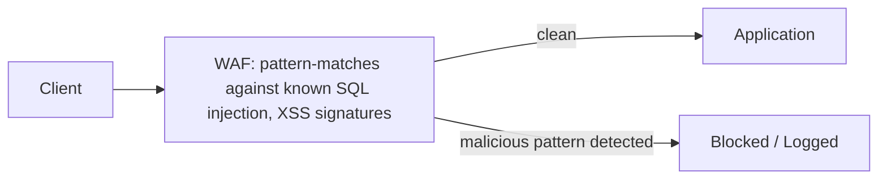
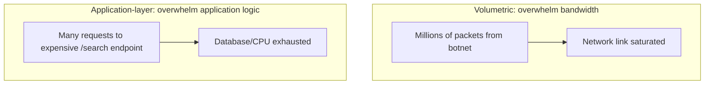

## Introduction

Chapter 44 covered verifying who a caller is and what they're allowed to do. This chapter covers the layer beneath that: protecting an API from common attacks regardless of authentication status, and defending infrastructure against being overwhelmed entirely — a threat that doesn't care who you are, only how much traffic it can throw at you.

## Common API Security Vulnerabilities (OWASP-Style)

- **Injection attacks (SQL injection, NoSQL injection)**: Untrusted input is incorporated directly into a query without proper sanitization/parameterization, letting an attacker manipulate the query's actual logic.

```java
// VULNERABLE: user input directly concatenated into the query
String query = "SELECT * FROM users WHERE email = '" + userInput + "'";
// Attacker input: ' OR '1'='1  -> query becomes: SELECT * FROM users WHERE email = '' OR '1'='1'
// Returns ALL users, bypassing the intended filter entirely.

// SAFE: parameterized query - user input is never interpreted as SQL syntax
PreparedStatement stmt = connection.prepareStatement("SELECT * FROM users WHERE email = ?");
stmt.setString(1, userInput);
```

- **Broken object-level authorization (BOLA/IDOR)**: An API checks that a user is authenticated, but fails to verify they're authorized for the *specific object* being requested — e.g., `GET /orders/12345` returns order 12345 regardless of whether the authenticated caller actually owns it, simply because they supplied a valid token.

```java
// VULNERABLE: no ownership check
@GetMapping("/orders/{orderId}")
public Order getOrder(@PathVariable String orderId) {
    return orderRepository.findById(orderId); // any authenticated user can view ANY order
}

// SAFE: explicit ownership check
@GetMapping("/orders/{orderId}")
public Order getOrder(@PathVariable String orderId, @AuthenticationPrincipal User currentUser) {
    Order order = orderRepository.findById(orderId);
    if (!order.getUserId().equals(currentUser.getId())) {
        throw new ForbiddenException(); // authenticated, but not authorized for THIS object
    }
    return order;
}
```

This is one of the most commonly exploited real-world API vulnerabilities precisely because authentication (Chapter 44) is easy to remember to check, while object-level authorization requires deliberately checking *ownership* on every single object-returning endpoint — an easy, high-impact detail to overlook.

- **Excessive data exposure**: An API returns a full internal object (including fields never meant for the client, like internal flags or other users' data nested in a response) rather than an explicit, minimal response DTO — relying on the client to "just not display" sensitive fields is not a security boundary.
- **Mass assignment**: An API blindly binds incoming request JSON directly to an internal entity, allowing an attacker to set fields they shouldn't be able to (e.g., submitting `{"role": "admin"}` in a profile-update request, if the entity has a `role` field and the endpoint doesn't explicitly whitelist which fields can be updated).
- **Improper input validation**: Failing to validate size limits, formats, or ranges on input, which can enable everything from application errors to resource-exhaustion attacks (e.g., accepting an unbounded `limit` parameter on a pagination endpoint, Chapter 6, letting a client request an absurdly large page size).

## Web Application Firewalls (WAFs)

A WAF sits in front of an application (often as part of a CDN or reverse proxy, Chapter 12) and inspects incoming HTTP requests against known attack signatures and rulesets, blocking or flagging suspicious requests before they reach the application at all.



A WAF is a valuable additional defensive layer, but is not a substitute for secure coding practices (parameterized queries, proper authorization checks) — it catches known, signature-matchable attack patterns, not application-specific logic flaws like BOLA.

## DDoS Attacks: Volumetric, Protocol, and Application-Layer

A **Denial of Service (DoS)** attack aims to make a system unavailable to legitimate users; a **Distributed** DoS (DDoS) does this using many distributed sources (often a botnet of compromised devices) simultaneously, making it much harder to block by simply blocking a single source IP.

| Type | Target | Example |
|---|---|---|
| **Volumetric** | Network bandwidth | Flooding with UDP packets/traffic to simply saturate available bandwidth |
| **Protocol** | Server/network infrastructure resources | SYN flood — sending many TCP connection requests (Chapter 2's handshake) without completing them, exhausting connection-tracking resources |
| **Application-layer** | Specific application logic | Repeatedly hitting an expensive endpoint (e.g., a complex search query) to exhaust application/database resources, mimicking legitimate traffic |



## DDoS Mitigation Strategies

- **CDN/Anycast absorption (Chapter 11)**: A globally-distributed CDN with massive aggregate bandwidth absorbs and filters volumetric attacks at the edge, before traffic ever reaches the origin — the same infrastructure discussed in Chapter 11 for latency reduction doubles as DDoS defense.
- **Rate limiting (Chapter 26)**: Directly limits how much traffic any single client/IP/API key can generate, mitigating application-layer attacks specifically.
- **Restricting origin access**: Configuring the origin server's firewall to only accept traffic from the CDN's known IP ranges (as mentioned in Chapter 11), preventing attackers from bypassing the CDN's protection by targeting the origin's IP directly.
- **SYN cookies**: A technique to mitigate SYN flood attacks by not allocating connection-tracking resources until the TCP handshake (Chapter 2) genuinely completes.
- **Behavioral/anomaly detection**: Distinguishing legitimate traffic spikes from attack traffic based on patterns (e.g., request timing, geographic distribution, user-agent consistency) rather than simple volume thresholds alone — since a legitimate traffic spike (a product going viral) and an attack can look similar in raw volume alone.
- **Auto-scaling with limits**: Elastic scaling (Chapter 7) can absorb some increased load, but must be paired with cost/resource limits — without them, a sufficiently large attack could cause runaway auto-scaling costs even if it doesn't cause an outright outage.

## Defense in Depth

No single mitigation is sufficient alone — real-world DDoS defense layers multiple techniques: CDN/Anycast absorption at the network edge, WAF rules for application-layer attack patterns, rate limiting for per-client abuse, and origin-access restriction to prevent bypass — directly echoing the "defense in depth" philosophy that recurs whenever this series discusses security (and paralleling the layered resilience patterns of Chapter 36).

## Summary

- Common API vulnerabilities include injection attacks, broken object-level authorization (checking authentication but not per-object ownership), excessive data exposure, mass assignment, and improper input validation — each requiring deliberate, specific mitigation, not just "the API requires a valid token."
- WAFs provide a valuable additional layer catching known attack signatures, but don't replace secure coding practices for application-specific logic flaws.
- DDoS attacks come in volumetric, protocol, and application-layer forms, each targeting a different resource and requiring different specific mitigations.
- CDN/Anycast absorption, rate limiting, origin-access restriction, and behavioral anomaly detection combine as layered, defense-in-depth DDoS mitigation — no single technique is sufficient alone.

---

## Interview Questions

### 1. Explain Broken Object-Level Authorization (BOLA/IDOR), and why it's considered one of the most commonly exploited real-world API vulnerabilities despite being conceptually simple to understand.
**Answer:** BOLA occurs when an API correctly verifies that a caller is authenticated (has a valid identity/token) but fails to verify that this specific, authenticated caller is actually *authorized* to access the *specific object* being requested — e.g., an endpoint like `GET /orders/{orderId}` might correctly reject entirely unauthenticated requests, but then return whatever order matches the given ID regardless of whether the authenticated caller actually owns that specific order, simply because they supplied a valid token for *some* account. It's commonly exploited despite being conceptually simple because it requires developers to remember and correctly implement an *additional*, deliberate ownership/authorization check on top of the more obvious, easier-to-remember authentication check for essentially every single object-returning endpoint in a system — with many endpoints across a large API surface, it's easy for even a diligent team to miss this specific check on some subset of endpoints, and unlike many other vulnerability classes, it's not something a generic security scanner or WAF (Chapter 45) can easily, automatically detect, since it requires understanding the specific, correct business logic of "who should legitimately be allowed to access this particular object" for each specific endpoint.

**Follow-up:** *Why can't a Web Application Firewall (WAF) reliably detect and prevent BOLA vulnerabilities the way it can detect known SQL injection patterns?* — A WAF works by pattern-matching incoming requests against known signatures of malicious *syntax* (e.g., recognizable SQL injection strings, common XSS payloads) — but a BOLA exploit typically involves a perfectly well-formed, syntactically valid API request (e.g., simply changing the `orderId` in the URL to a different, valid order ID that happens to belong to someone else) — there's no malicious "pattern" in the request itself for a WAF to recognize; the vulnerability lies entirely in the *application's own business logic* failing to check whether this specific caller should be authorized to access this specific, otherwise perfectly valid object identifier — this is fundamentally an application-logic flaw, not a detectable-at-the-network-layer syntax/pattern issue, which is precisely why BOLA requires deliberate, correct implementation within the application code itself, rather than being addressable through external, pattern-based security tooling alone.

### 2. Why does "the client won't display sensitive fields" not constitute a real security boundary, in the context of excessive data exposure?
**Answer:** An API response is not confined to only what a client application's user interface chooses to *display* — any sensitive data included in an API response, even if the client's UI code doesn't render it visibly on screen, is still fully present in the actual network response and can be trivially inspected by anyone with basic technical knowledge (e.g., using browser developer tools' network tab, or simply calling the API directly with a tool like curl or Postman, bypassing the official client application's UI entirely) — relying on "the official app just doesn't show this field" as a security measure provides zero actual protection against anyone who bypasses that specific official client and inspects the raw API response directly, which is trivially easy for any technically-inclined user or, more importantly, any malicious actor specifically probing the API for exploitable sensitive data.

**Follow-up:** *What's the correct architectural approach to prevent excessive data exposure, rather than relying on client-side display logic?* — The API itself should return an explicit, minimal, purpose-built response representation (often called a DTO — Data Transfer Object) containing *only* the specific fields that are genuinely intended to be exposed for that specific endpoint/use case, rather than serializing and returning an internal domain entity object directly (which likely contains additional internal fields never intended for external exposure) — this ensures the actual, real security boundary (what data is genuinely included in the API response) is enforced at the server/API layer itself, which is the only place that can actually, reliably control what data leaves the system, rather than depending on client-side behavior (which the server has no actual control over and cannot trust) to provide any meaningful protection.

### 3. Explain "mass assignment" as a vulnerability, and describe a specific mitigation technique.
**Answer:** Mass assignment occurs when an API endpoint blindly binds/maps the entirety of an incoming request's JSON payload directly onto an internal data entity/model, without explicitly restricting which specific fields are actually permitted to be set through that particular endpoint — if the underlying entity has fields that should never be directly settable by a regular API client (e.g., a `role` field controlling admin privileges, or an `accountBalance` field that should only ever be modified through specific, controlled business operations, not a generic "update profile" endpoint), an attacker could potentially include these unexpected fields in their request payload (e.g., adding `"role": "admin"` to what's ostensibly just a profile-update request), and if the endpoint's binding logic isn't explicitly restricted to only the intended, legitimate fields, this unauthorized field could be silently, unintentionally set exactly as the attacker specified, potentially granting them elevated privileges or otherwise corrupting data they should have no ability to directly modify.

**Follow-up:** *How does using an explicit request DTO (rather than binding directly to the internal domain entity) specifically prevent mass assignment?* — By defining a specific, purpose-built request object (a DTO) that explicitly declares only the exact fields that are legitimately intended to be settable through that particular endpoint (e.g., a `ProfileUpdateRequest` DTO containing only `name` and `email` fields, deliberately omitting `role` or other sensitive fields entirely) — the request-binding/deserialization process then has no field mapping at all for any unexpected, extra fields an attacker might include in their raw request payload (like a smuggled-in `role` field), since the DTO's structure simply doesn't define or recognize that field as something to bind at all — this explicit "whitelist only these specific fields" approach, in contrast to blindly binding the entire raw request onto a full internal entity (which might have many more fields than the endpoint should actually expose for modification), directly and structurally prevents the mass-assignment vulnerability by design, rather than relying on developers to remember to manually filter out dangerous fields on a case-by-case basis.

### 4. Compare volumetric, protocol, and application-layer DDoS attacks, and explain why a single mitigation technique (like a CDN alone) is insufficient to defend against all three.
**Answer:** Volumetric attacks aim to simply overwhelm available network bandwidth with sheer traffic volume (regardless of whether that traffic is otherwise "valid-looking"), protocol attacks specifically exploit weaknesses in network/transport-layer protocols (like TCP's connection-establishment handshake, Chapter 2) to exhaust server or network infrastructure resources without necessarily requiring massive raw bandwidth, and application-layer attacks send comparatively low-volume but individually resource-intensive requests specifically targeting expensive application logic (like a complex database query) to exhaust application-level resources (CPU, database connections) while potentially remaining within otherwise-normal-looking traffic volume and protocol behavior. A CDN with large aggregate bandwidth (Chapter 11) is specifically well-suited to absorbing and mitigating volumetric attacks (since it can absorb and filter massive raw traffic volume before it reaches the origin), but it doesn't inherently address protocol-level attacks (which may require specific infrastructure-level techniques like SYN cookies) or application-layer attacks (which require understanding and rate-limiting or filtering based on the *specific application logic* being targeted, something a generic, traffic-volume-focused CDN mitigation alone doesn't inherently address) — each attack type specifically requires its own, distinct, targeted mitigation technique, which is precisely why comprehensive DDoS defense requires the kind of layered, defense-in-depth approach this chapter emphasizes, rather than relying on any single technique to comprehensively address all three fundamentally different attack categories.

**Follow-up:** *Why might an application-layer DDoS attack be specifically harder to detect and distinguish from legitimate traffic, compared to a volumetric attack?* — A volumetric attack typically involves an obviously, dramatically abnormal spike in raw traffic volume that's relatively straightforward to detect purely based on the sheer scale of traffic involved, often far exceeding any plausible legitimate usage pattern. An application-layer attack can specifically be designed to mimic legitimate user behavior in terms of raw request volume and basic protocol conformance (e.g., a moderate number of well-formed, protocol-compliant HTTP requests hitting a specific, expensive endpoint) — the malicious intent lies specifically in *which* endpoint is being targeted and *why* (deliberately targeting the most resource-expensive operations to maximize backend resource exhaustion per request, rather than simply sending massive raw traffic volume) — this can make application-layer attacks genuinely harder to distinguish from a simple, legitimate surge in real user interest in a specific feature/endpoint, requiring more sophisticated behavioral analysis (examining request patterns, timing, and other contextual signals beyond simple volume) to reliably distinguish malicious application-layer attack traffic from a genuine, legitimate traffic spike.

### 5. Why is "restricting origin server access to only the CDN's known IP ranges" a critical complementary step to using a CDN for DDoS protection, rather than the CDN alone being sufficient?
**Answer:** If an attacker discovers the origin server's actual, underlying IP address (which can sometimes be found through various reconnaissance techniques, historical DNS records, or misconfiguration, even when a CDN is nominally in front of the public-facing domain), they could potentially bypass the CDN entirely by sending attack traffic directly to this discovered origin IP address — completely circumventing whatever protective filtering and absorption capacity the CDN would otherwise provide, since that traffic never actually passes through the CDN's protective infrastructure at all in this bypass scenario. By configuring the origin server's firewall to explicitly reject any traffic that doesn't originate from the CDN provider's known, published IP address ranges, the origin becomes unreachable via any direct-IP bypass attempt, forcing all traffic (including any attack traffic) to genuinely pass through the CDN's protective filtering, ensuring the CDN's DDoS mitigation capabilities can't be trivially circumvented simply by an attacker discovering and directly targeting the origin's actual underlying IP address.

**Follow-up:** *What operational practice should an organization follow to help prevent their origin server's actual IP address from being discovered in the first place, complementing this firewall restriction?* — Practices include: ensuring the origin server's IP address was never directly, publicly exposed via DNS records prior to (or even during) CDN adoption (since historical DNS records can sometimes still reveal a previously-used direct IP even after switching to CDN-fronted access), avoiding any services or subdomains that might inadvertently expose the origin's direct IP (e.g., a misconfigured mail server or a separate, non-CDN-fronted subdomain sharing the same underlying infrastructure/IP range as the main, CDN-protected origin), and potentially even proactively rotating/changing the origin's actual IP address periodically as a precaution — combined with the firewall-based IP restriction, these practices work together to minimize both the likelihood of the origin's true IP being discovered at all, and the impact/exploitability of that discovery if it does happen to occur despite these precautions.

### 6. A candidate implements rate limiting (Chapter 26) as their sole DDoS mitigation strategy for a public API. Why is this insufficient on its own?
**Answer:** Rate limiting is specifically effective at mitigating application-layer attacks and abuse from any *single* identifiable client/IP/API key by capping how much traffic that specific identity can generate — but it doesn't inherently address volumetric attacks, where the fundamental problem is the sheer aggregate *bandwidth* consumed by traffic arriving from potentially thousands or millions of *different*, distributed sources (a genuine DDoS, as opposed to a single bad actor) — even if each individual malicious source is rate-limited to a modest, seemingly-reasonable request rate, the sheer number of distinct, distributed attacking sources can still collectively overwhelm the origin's total available bandwidth or connection capacity long before any single source's rate limit is even triggered; rate limiting alone also doesn't address protocol-layer attacks (like SYN floods) which specifically exploit low-level connection-establishment behavior rather than generating identifiable, rate-limitable application-level requests in the first place — rate limiting is one valuable, necessary layer specifically for application-layer abuse mitigation, but it's not a comprehensive, standalone defense against the full range of DDoS attack types discussed in this chapter.

**Follow-up:** *How would you combine rate limiting with CDN-based mitigation to provide more comprehensive protection, and at what specific point in the request path would each technique typically be applied?* — CDN/Anycast-based volumetric absorption would typically be applied first, at the network edge — filtering and absorbing the bulk of raw volumetric attack traffic before it ever reaches your own origin infrastructure at all, leveraging the CDN's massive aggregate bandwidth capacity that far exceeds what any single organization's own origin infrastructure could typically handle alone; rate limiting would then be applied at a layer closer to your actual application (either at the CDN's edge, if it supports application-aware rate limiting rules, or at your own API Gateway/origin, per Chapter 6) specifically to catch and mitigate application-layer abuse from identifiable sources that made it through the initial volumetric filtering — this layered approach ensures each specific technique addresses the specific type of attack it's actually well-suited to mitigate, rather than expecting either single technique to comprehensively address every attack type on its own.

### 7. Why does parameterized query usage (as shown in this chapter's SQL injection example) fundamentally prevent injection, rather than simply making it "harder" to exploit?
**Answer:** In a vulnerable, string-concatenation-based query, user input is directly interpreted by the database as part of the *SQL syntax itself* — meaning if that input contains SQL-meaningful characters/keywords (like a quote character followed by `OR '1'='1`), the database engine parses and executes this injected content as genuine, additional SQL logic, fundamentally changing the query's actual behavior from what was intended. A parameterized query fundamentally changes this relationship: the query's actual SQL structure (with placeholder parameters, like `?`) is sent to and compiled/parsed by the database *separately and first*, before the actual parameter values are bound — this means the database engine has already fixed and locked in the query's structural logic before ever seeing the user-supplied values, and those values are then treated strictly as literal data to be matched against, never as executable SQL syntax to be parsed and interpreted, regardless of what characters or SQL-like content that input string might happen to contain — this is a fundamental, structural prevention (the user input can never be interpreted as SQL syntax at all, by design) rather than merely "making injection harder" through some kind of input filtering or escaping that could potentially be bypassed through some cleverly-crafted edge case the filtering didn't anticipate.

**Follow-up:** *Why might input escaping/sanitization (attempting to detect and neutralize dangerous characters before including them in a query string) be considered a weaker, less reliable defense compared to parameterized queries?* — Escaping/sanitization approaches rely on correctly, comprehensively identifying and neutralizing every possible dangerous character or pattern across every possible database engine's specific syntax quirks and edge cases — this is inherently fragile and error-prone, since it's essentially trying to defensively anticipate and block a potentially unbounded and evolving set of attack patterns (new bypass techniques for escaping logic are a recurring theme in security research), whereas parameterized queries structurally eliminate the entire category of risk by design (user input is never given the *opportunity* to be interpreted as SQL syntax at all, regardless of its specific content) — this is a classic, broader security engineering principle: architectural/structural prevention of an entire vulnerability class is generally far more robust and reliable than attempting to defensively detect and filter out every possible specific instance of that vulnerability through pattern-matching or escaping logic, which can always potentially be circumvented by some cleverly-crafted input the escaping logic's authors didn't specifically anticipate.

### 8. In a system design interview, if asked "how would you protect a publicly-exposed search API endpoint from being used as a vector for an application-layer DDoS attack," how would you approach this?
**Answer:** You'd first identify what makes this specific endpoint a particularly attractive application-layer DDoS target — likely that search queries can be computationally/database-resource-expensive to execute (e.g., complex full-text search, potentially involving significant database or search-index computation per request), meaning even a moderate request volume specifically targeting this expensive endpoint could disproportionately exhaust backend resources compared to the same request volume hitting simpler, cheaper endpoints. You'd propose layered mitigations specifically suited to this scenario: rate limiting (Chapter 26) specifically and perhaps more aggressively scoped to this particular expensive endpoint (rather than a uniform rate limit applied identically across all endpoints regardless of their relative cost); caching (Chapter 9) for common or repeated search queries, to avoid re-executing the same expensive underlying search operation redundantly for identical or very similar repeated requests; potentially requiring authentication (even if not otherwise strictly necessary for this endpoint's core functionality) specifically to enable more precise, identity-based rate limiting rather than only weaker, more easily-circumvented IP-based limiting (Chapter 26's discussion of NAT-related IP-based rate-limiting limitations); and considering a separate, more conservative resource pool/bulkhead (Chapter 36) specifically for this expensive endpoint's backend processing, ensuring that even if it does become a target and gets overwhelmed, it doesn't exhaust shared resources needed by other, unrelated, and comparatively cheaper endpoints/functionality.

**Follow-up:** *Why might caching be a particularly effective mitigation specifically for a search endpoint, compared to, say, a personalized user-dashboard endpoint?* — Search queries, especially for popular or common search terms, often exhibit significant natural repetition across different users (many different users searching for the same or very similar popular terms) — making the results genuinely cacheable and shareable across multiple different requesting users, directly reducing the actual number of times the expensive underlying search operation needs to be performed even under a large volume of incoming requests. A personalized user-dashboard endpoint, by contrast, typically returns data uniquely specific to each individual authenticated user — there's little to no natural cross-user repetition/cacheability for this kind of inherently personalized data, meaning caching provides much less mitigation value for this specific endpoint type, since nearly every request would still require its own unique, uncacheable backend processing regardless of how many total requests are being made — this distinction highlights why the specific, appropriate mix of mitigation techniques should be tailored to each specific endpoint's actual characteristics (cacheability, cost, personalization) rather than applying a single, uniform mitigation strategy identically across every endpoint in a system.

### 9. Why does "defense in depth" specifically matter for API/DDoS security, rather than simply identifying and implementing the single "best" defensive technique?
**Answer:** As this chapter has demonstrated throughout, different attack types and vulnerability classes (injection, BOLA, volumetric DDoS, protocol DDoS, application-layer DDoS) each require fundamentally different, specifically-targeted mitigation techniques — there is no single "best" technique that comprehensively addresses every distinct threat category simultaneously; additionally, any single defensive layer, however well-implemented, could theoretically have its own specific weakness, bypass technique, or configuration error discovered/exploited by a sufficiently determined and sophisticated attacker — layering multiple, complementary defensive techniques (secure coding practices preventing injection/BOLA at the application logic level, a WAF catching known attack signatures, rate limiting preventing per-client abuse, CDN/Anycast absorbing volumetric attacks, origin-access restriction preventing CDN bypass) means that even if an attacker somehow successfully circumvents or exploits a weakness in any *one specific* layer, the other independent layers still provide meaningful, continued protection — significantly raising the overall difficulty and required sophistication for an attack to fully succeed, compared to relying on any single defensive technique or layer alone, however individually strong that single layer might be.

**Follow-up:** *How does this "defense in depth" principle for security specifically parallel the "redundancy at every layer" principle discussed in Chapter 40 for high availability?* — Both principles share the same fundamental underlying logic: relying on a single point of protection/redundancy (whether a single security defensive layer, or a single redundant infrastructure component) leaves the overall system vulnerable to that single point's specific failure or weakness — just as Chapter 40 emphasized that true high availability requires redundancy at *every* infrastructure layer (power, network, compute, data, geography) since availability is limited by the least-redundant layer, this chapter's defense-in-depth principle emphasizes that true security requires defensive measures at *every* relevant layer (application logic, network/WAF, rate limiting, infrastructure/CDN) since overall security is similarly limited by whichever specific layer has the weakest, most exploitable protection — both are specific applications of the same broader, foundational systems-design principle: comprehensive protection (whether against failure or against attack) requires addressing every relevant layer, not just the layer that seems most obviously important or most straightforward to secure/protect.

### 10. Why might a candidate's claim that "we use HTTPS everywhere, so our API is secure" reveal an incomplete understanding of API security, connecting this chapter's material to Chapter 4's TLS discussion?
**Answer:** HTTPS/TLS (Chapter 4) provides encryption and integrity protection specifically for data *in transit* between the client and server — preventing eavesdropping or tampering with the data as it travels across the network — but it provides absolutely no protection whatsoever against the entire range of application-level vulnerabilities this chapter has discussed (SQL injection, BOLA, mass assignment, excessive data exposure) or against DDoS attacks (a request can be perfectly, validly encrypted via HTTPS while still containing a malicious SQL injection payload, or being one of millions of requests in a volumetric DDoS attack) — HTTPS addresses a genuinely important but entirely separate security concern (transport-layer confidentiality/integrity) from the application-logic and infrastructure-availability concerns this chapter addresses; claiming "HTTPS everywhere means we're secure" conflates one specific, valuable security measure (protecting data in transit) with the much broader, multi-layered set of concerns that comprehensive API and infrastructure security actually requires, revealing a significant, potentially dangerous gap in understanding if this claim is offered as a complete or sufficient security posture on its own.

**Follow-up:** *What would a more complete, accurate answer to "how do you secure this API" sound like, incorporating both Chapter 4's and this chapter's material appropriately?* — A more complete answer would explicitly address multiple distinct layers: "We use HTTPS/TLS to protect data confidentiality and integrity in transit (Chapter 4); we use parameterized queries and proper input validation to prevent injection attacks; we implement explicit object-level authorization checks (not just authentication) on every endpoint that returns or modifies specific resources, to prevent BOLA; we use explicit request/response DTOs rather than direct entity binding, to prevent mass assignment and excessive data exposure; and at the infrastructure level, we use a CDN with origin-access restriction for DDoS protection, combined with rate limiting for per-client abuse prevention" — this kind of layered, specific answer demonstrates genuine understanding that comprehensive API security requires addressing multiple, distinct concerns (transport security, application logic security, infrastructure/availability security) each with their own specific, appropriate mitigation techniques, rather than treating any single measure (however important) as a complete, sufficient security solution on its own.
