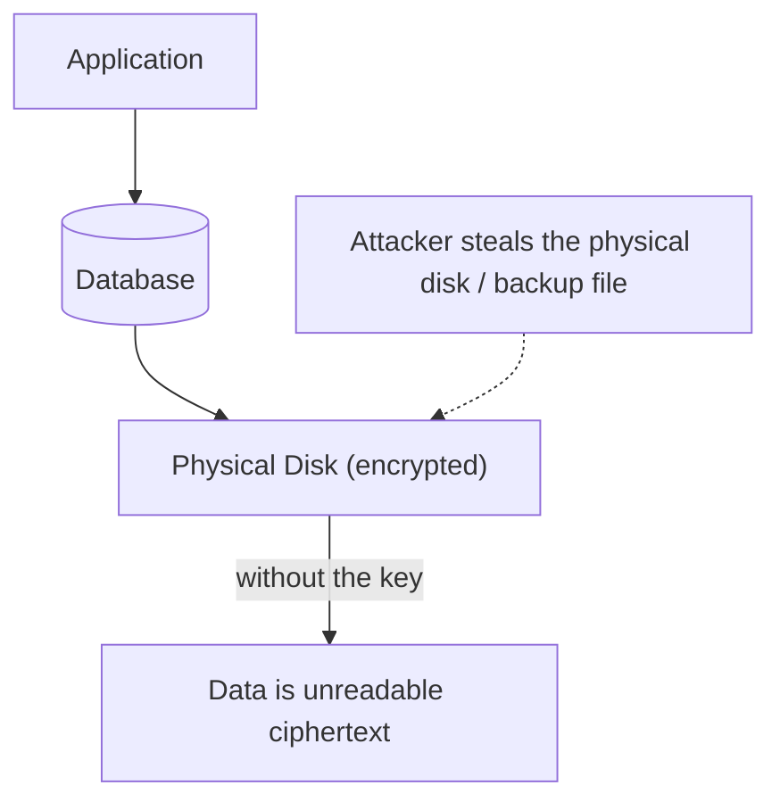
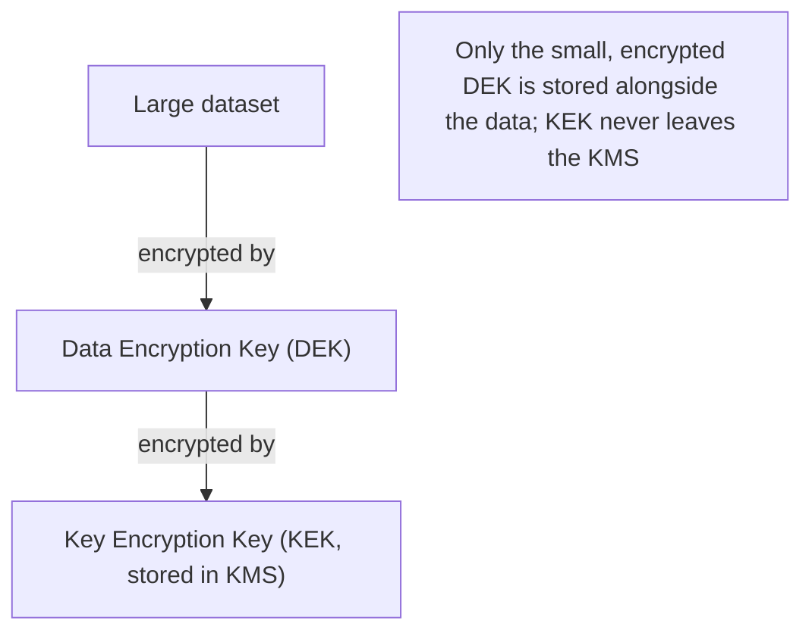

## Introduction

This chapter closes Part 7 by addressing the last major security concern referenced throughout this series but not yet fully unpacked: encryption. Chapter 4 covered TLS for data in transit; this chapter completes the picture with encryption at rest, and the key management challenge that underlies both.

## Encryption in Transit (Revisited)

As covered in Chapter 4, TLS protects data while it's actively moving across a network — between a client and server, or between internal services. The critical architectural questions (TLS termination point, mutual TLS for service-to-service auth) were covered there; this chapter's focus is the complementary concern: what protects data when it's **not** moving — sitting in a database, a file, or a backup.

## Encryption at Rest

Encryption at rest protects data stored on disk (databases, file systems, object storage, backups) from being read if the physical storage medium — or a backup of it — is accessed by someone who shouldn't have access, even if they bypass the application layer entirely.



**Why this matters even with strong application-layer access controls (Chapter 44)**: Authentication and authorization protect against unauthorized access *through the application*. Encryption at rest protects against a different threat model entirely — someone who bypasses the application altogether: a stolen physical hard drive, an improperly discarded backup tape, unauthorized direct access to cloud storage, or an insider with direct infrastructure access but no legitimate business reason to read the actual data.

### Common Approaches

- **Full-disk encryption**: The entire underlying storage volume is encrypted — simple, transparent to the application, but doesn't protect against a compromised, already-running application process directly reading its own accessible, decrypted files (since the OS decrypts data on the fly for a running process with legitimate volume access).
- **Database-level (Transparent Data Encryption, TDE)**: The database engine encrypts data files itself, decrypting transparently for authenticated queries — protects data files/backups at rest while remaining invisible to application code (no query changes needed).
- **Field-level/application-level encryption**: The application explicitly encrypts specific sensitive fields (e.g., a social security number) before writing them to the database, decrypting only when explicitly needed. More invasive to implement, but provides protection even against a compromised database (an attacker who gains raw database access still can't read the specifically-encrypted fields without the application-level key) and enables more granular access control per field.

```java
@Entity
public class Customer {
    private String name; // stored in plaintext

    @Convert(converter = EncryptedStringConverter.class)
    private String ssn; // encrypted before persistence, decrypted transparently on read

    // A converter class handles the actual encrypt/decrypt logic transparently
}
```

## The Real Challenge: Key Management

Encryption is only as strong as the protection of the encryption **keys** themselves — if an attacker obtains both the encrypted data *and* the key, encryption provides zero protection. Key management is where most real-world encryption implementations succeed or fail.

### Key Management Principles

- **Never hardcode keys in application code or configuration files checked into version control** — a shockingly common, serious real-world mistake.
- **Use a dedicated Key Management Service (KMS)** — cloud providers (AWS KMS, Google Cloud KMS, Azure Key Vault) or dedicated tools (HashiCorp Vault) manage keys separately from the application and data they protect, with strict access controls and audit logging on key usage itself.
- **Envelope encryption**: Rather than encrypting large amounts of data directly with a KMS-managed key (which can be slow and creates tight coupling to the KMS for every single encrypt/decrypt operation), generate a unique, local **data encryption key (DEK)** for the actual data, then encrypt that (small) DEK itself using a KMS-managed **key encryption key (KEK)**. Only the small, encrypted DEK needs to be sent to the KMS for decryption — the actual bulk data encryption/decryption happens locally, fast, using the now-decrypted DEK.



- **Key rotation**: Periodically replacing encryption keys limits the damage if a key is ever compromised (data encrypted with an old, potentially-compromised key isn't automatically also vulnerable via a *newer* key) — this requires a defined process for re-encrypting existing data with new keys over time, which is itself a genuine, non-trivial operational challenge, similar in spirit to the schema migration challenges discussed in Chapters 32 and 38.

## Symmetric vs Asymmetric Encryption (Revisited from Chapter 4)

As covered in Chapter 4's TLS discussion: **symmetric encryption** (the same key both encrypts and decrypts) is fast and used for the bulk of actual data encryption (both in transit, after the TLS handshake, and at rest); **asymmetric encryption** (public/private key pairs) is slower but solves the key-*distribution* problem (as in TLS's handshake) — the two are typically combined, not competing alternatives.

## Compliance and Regulatory Drivers

Encryption at rest is frequently not just a best practice but an explicit **regulatory requirement** — PCI-DSS (payment card data), HIPAA (healthcare data), GDPR (EU personal data) all mandate or strongly incentivize encryption at rest for specific categories of sensitive data, with substantial legal/financial consequences for non-compliance following a data breach. This is a case where a system design decision is driven as much by legal/compliance requirements as by pure technical risk assessment.

## Summary

- Encryption at rest protects stored data from threats that bypass the application layer entirely (stolen disks, improper backup handling, unauthorized infrastructure access) — a distinct threat model from authentication/authorization.
- Full-disk, database-level (TDE), and field-level encryption offer different trade-offs between implementation simplicity and the granularity/scope of protection provided.
- Key management — not the encryption algorithm itself — is where most real-world implementations succeed or fail; dedicated KMS tools and envelope encryption are the standard patterns.
- Symmetric and asymmetric encryption are complementary, not competing — symmetric handles bulk data encryption; asymmetric solves key distribution.
- Encryption at rest is frequently a regulatory requirement (PCI-DSS, HIPAA, GDPR), not merely a technical best practice.

---

## Interview Questions

### 1. Why does encryption at rest protect against a fundamentally different threat model than authentication and authorization (Chapter 44)?
**Answer:** Authentication and authorization protect against unauthorized access that goes *through the application's own access-control logic* — verifying identity and checking permissions before granting access to data via the application's normal, intended interfaces (APIs, user interfaces). Encryption at rest protects against threats that *bypass the application entirely* — a stolen physical hard drive, an improperly discarded or exposed backup file, an attacker who gains direct, low-level access to underlying storage infrastructure (cloud storage misconfiguration, direct database file access), or even an insider with legitimate infrastructure-level access but no legitimate business reason to read the actual data content — in all these scenarios, the application's own authentication/authorization logic is never even invoked at all, since the attacker isn't going through the application's normal interfaces; encryption at rest ensures that even in these bypass scenarios, the actual data remains unreadable (ciphertext) without the appropriate decryption key, providing protection against a threat model that authentication/authorization alone simply cannot address.

**Follow-up:** *Does this mean a system with strong encryption at rest but weak application-layer authentication/authorization is adequately secure?* — No — these are complementary, not substitutable, protections addressing genuinely different threat vectors; a system with weak authentication/authorization remains vulnerable to unauthorized access *through* the application's normal interfaces (e.g., BOLA vulnerabilities discussed in Chapter 45), regardless of how well the underlying data is encrypted at rest, since a legitimate, authenticated application process typically has the necessary keys/permissions to decrypt and access data through its normal, intended access patterns — encryption at rest specifically protects against bypass-the-application threats, while authentication/authorization specifically protects against through-the-application threats, and comprehensive security requires addressing both threat models, not substituting one for the other.

### 2. Compare full-disk encryption, database-level (TDE), and field-level encryption in terms of the specific threats each one protects against.
**Answer:** Full-disk encryption protects against physical media theft or improper disposal (a stolen hard drive is unreadable without the disk-level key) but provides no protection once the operating system has mounted and decrypted the volume for a running, legitimately-authorized process — a compromised application process, or anyone with legitimate OS-level access to the running, mounted system, can still read the data in its normal, decrypted form. Database-level TDE protects data files and backups specifically at the database layer (even a stolen database backup file, or direct filesystem access to the database's underlying files outside of normal database queries, remains encrypted/unreadable), while remaining transparent to the application (queries work normally, encryption/decryption happens automatically within the database engine) — but a database administrator or anyone with legitimate query access through the database engine itself can still read the data in decrypted form via normal queries, since TDE protects the underlying files, not query-level access. Field-level encryption additionally protects against a compromise of the database itself (or a malicious/compromised database administrator with direct query access) for the *specific* encrypted fields, since decrypting those specific fields requires an application-level key that the database engine itself never possesses — providing the narrowest but also most robust protection scope, specifically for the most sensitive individual data fields.

**Follow-up:** *Given field-level encryption's stronger protection, why wouldn't a system simply encrypt every single field at the application level, rather than selectively choosing which fields warrant this treatment?* — Field-level encryption prevents the database engine from being able to directly query, index, sort, or perform any meaningful operations on the encrypted field's actual content (since it only sees opaque ciphertext, not the actual underlying value) — this means fields frequently used in `WHERE` clauses, sorting, or aggregation (like a user's name used for search, or a timestamp used for range queries) would become effectively unusable for these common query patterns if field-level encrypted, since the database can no longer meaningfully compare or index the actual, real values; field-level encryption is therefore selectively and deliberately applied specifically to the smaller subset of fields containing genuinely highly sensitive data (SSNs, payment details) that both warrant this strongest protection level and are not typically needed for direct database querying/filtering/sorting operations, rather than being applied universally to every field regardless of its actual sensitivity or query-pattern needs.

### 3. Explain "envelope encryption," and why it's preferred over directly encrypting large amounts of data with a KMS-managed key for every operation.
**Answer:** Envelope encryption uses a two-tier key structure: a small, locally-generated Data Encryption Key (DEK) directly encrypts the actual, potentially large volume of data (fast, since this happens locally without needing to communicate with an external service for every operation), and this small DEK is itself then encrypted using a Key Encryption Key (KEK) that's securely managed by a dedicated KMS — only this small, now-encrypted DEK (not the large underlying data, and not the KEK itself) needs to be sent to and processed by the KMS when decryption is needed, at which point the KMS returns the decrypted DEK, which is then used locally to decrypt the actual bulk data. This is preferred over directly using a KMS-managed key for every single data encryption/decryption operation because: (1) KMS operations typically involve a network round-trip to an external service, which would be prohibitively slow if required for every single encryption/decryption of potentially large volumes of data; (2) many KMS implementations have practical limits on the size of data they can directly encrypt/decrypt in a single operation, unsuited to encrypting large files/datasets directly; and (3) envelope encryption limits the KMS's direct exposure to only the small, encrypted DEKs rather than needing to process the actual bulk sensitive data itself, reducing the KMS's own attack surface and operational load.

**Follow-up:** *What specific security benefit does envelope encryption provide if an attacker manages to steal the encrypted data along with its corresponding encrypted DEK, but does NOT have access to the KMS itself?* — The attacker would possess the actual encrypted data and its encrypted DEK, but since the DEK itself is encrypted with the KEK (which never leaves the KMS and to which the attacker has no access), they cannot decrypt the DEK, and therefore cannot decrypt the actual underlying data either — this demonstrates envelope encryption's core security value: even if both the encrypted data and its specific encrypted key are compromised together (e.g., both stored together in a stolen backup), the data remains genuinely protected as long as the KMS itself (holding the KEK) remains secure and inaccessible to the attacker, since decrypting the DEK (a necessary step before decrypting the actual data) absolutely requires interaction with the still-secure KMS.

### 4. Why is "never hardcode encryption keys in application code or configuration files checked into version control" considered such a critical, foundational key-management principle?
**Answer:** Source code repositories (even private ones) are typically accessed by potentially many developers over an extended period, are often backed up and mirrored in multiple locations, and — critically — their full history is typically retained indefinitely, meaning even if a hardcoded key is later removed from the *current* version of a file, it often remains permanently accessible in the repository's historical commit log unless that history is explicitly and carefully purged (a non-trivial, error-prone operation); a hardcoded key checked into version control is therefore exposed to a very wide, hard-to-fully-audit, and effectively permanent potential audience (every current and former developer with repository access, anyone who might have cloned the repository at any point, and potentially anyone who gains unauthorized access to the repository itself, whether currently or at any point in the future) — this represents a fundamentally different and much larger, more persistent, and less controllable exposure risk compared to storing that same key in a dedicated, access-controlled, and properly audited KMS specifically designed to manage and protect exactly this kind of highly sensitive secret.

**Follow-up:** *If a team discovers that a sensitive encryption key was accidentally hardcoded and committed to their version control system months ago, what's the appropriate remediation, beyond simply removing the key from the current version of the file?* — The key must be treated as fully, irrevocably compromised — simply removing it from the current file version is insufficient, since it remains accessible in the repository's historical commit log; the appropriate remediation involves immediately rotating (generating a new key and re-encrypting any data protected by the old key with this new one) the compromised key entirely, treating the old key as permanently untrustworthy going forward, and separately, though less critically urgent from a pure security-remediation standpoint, potentially also purging the sensitive key from the repository's history (a more complex, and sometimes only partially effective, operation, especially if the repository has already been cloned/mirrored elsewhere) — the core, non-negotiable remediation step is key rotation, since simply hiding or removing the exposed key from current view does nothing to address the fact that it has already been exposed and must be assumed compromised.

### 5. Why does key rotation introduce a genuine, non-trivial operational challenge, rather than being a simple configuration change?
**Answer:** When an encryption key is rotated (replaced with a new one), existing data that was previously encrypted with the *old* key doesn't automatically become encrypted with the new key simply by changing a configuration setting — that existing data remains encrypted with whatever key was in effect when it was originally written, meaning the system must either maintain the ability to decrypt using multiple different historical keys (tracking which specific key was used for which specific piece of data) indefinitely, or undertake an active, deliberate process of re-encrypting all existing historical data with the new key (requiring reading, decrypting with the old key, and re-encrypting with the new key, for potentially very large volumes of existing data) — this is directly analogous to the schema evolution challenges discussed in Chapters 32 and 38, where existing historical data/events must remain correctly interpretable even as the "current" format/key changes going forward, requiring careful, deliberate handling of this backward-compatibility concern rather than assuming a simple, instantaneous cutover to the new key.

**Follow-up:** *How does envelope encryption specifically simplify the key rotation process, compared to a system using a single key to directly encrypt all data?* — With envelope encryption, rotating the KEK (the key managed by the KMS) doesn't actually require touching or re-encrypting any of the underlying bulk data at all — you only need to re-encrypt the small, individual DEKs (which are already stored, per-dataset, alongside the data they protect) using the new KEK, a much smaller and more manageable operation than re-encrypting the potentially much larger volumes of actual underlying data directly; this significantly simplifies and reduces the cost/complexity of KEK rotation specifically, though rotating the *DEK* itself (if ever needed, e.g., due to a suspected DEK-specific compromise) would still require the more expensive process of re-encrypting the actual underlying data with a new DEK, illustrating that envelope encryption's two-tier structure specifically optimizes and simplifies the (likely more frequent) KEK rotation case, while DEK rotation (likely rarer, more targeted to specific suspected compromises) still carries the more expensive re-encryption cost when it is genuinely needed.

### 6. Why might a candidate's claim that "our data is encrypted, so we're compliant with [PCI-DSS/HIPAA/GDPR]" be an oversimplification, even though encryption is indeed a component of these regulations?
**Answer:** Regulatory frameworks like PCI-DSS, HIPAA, and GDPR typically mandate a comprehensive set of security and privacy controls, of which encryption at rest (and in transit) is just one specific, if often prominent, component — genuine compliance typically also requires proper key management practices (not just "we encrypted it," but specifically how the keys themselves are protected and managed, directly connecting to this chapter's key management discussion), access controls and audit logging (who can access the data and the ability to prove/demonstrate this after the fact), specific data retention and deletion policies, breach notification procedures, and various other organizational and technical controls well beyond encryption alone — claiming blanket "compliance" based solely on the presence of encryption, without addressing these other required components, would likely not satisfy a genuine, rigorous compliance audit, and reveals an incomplete understanding of what these regulatory frameworks actually, comprehensively require.

**Follow-up:** *Why might strong encryption at rest still provide meaningful legal/liability benefit even in the context of a data breach that does occur, despite not being sufficient for full compliance on its own?* — Many data breach notification laws and regulations specifically include "safe harbor" provisions that reduce or eliminate mandatory breach notification and associated liability requirements specifically when the breached data was properly encrypted (and the encryption keys themselves were not also compromised in the same breach) — since properly encrypted data that's stolen/exposed in a breach remains unreadable/unusable to the attacker (assuming the keys remain secure), many regulations recognize this as meaningfully different from a breach exposing readable, unencrypted data, and correspondingly impose less severe consequences — this provides a genuine, concrete legal/business incentive for encryption at rest specifically, even though, as emphasized above, encryption alone doesn't constitute full regulatory compliance across every other required dimension these frameworks address.

### 7. In a system design interview, if asked to design a system storing highly sensitive healthcare records (subject to HIPAA), how would you apply this chapter's material to your encryption strategy?
**Answer:** You'd propose a layered approach: encryption in transit (TLS, Chapter 4) for all data moving between clients, services, and the database, ensuring no sensitive healthcare data is ever transmitted in plaintext across any network segment; encryption at rest at the database level (TDE) as a baseline, protecting the underlying data files and backups from any bypass-the-application threat (stolen backups, unauthorized direct storage access); and additionally, field-level encryption specifically for the most sensitive individual fields (e.g., specific diagnosis codes, social security numbers, or other particularly sensitive identifiers) to provide defense-in-depth protection even against a potential database-level compromise or an insider with legitimate database query access but no legitimate business need to view these specific highly sensitive fields. You'd propose using a dedicated KMS with envelope encryption for key management, ensuring keys are never hardcoded and are properly access-controlled/audited, and you'd establish a defined key rotation policy and process, acknowledging the operational complexity this introduces but treating it as a necessary, non-optional practice given the sensitivity of the data and HIPAA's regulatory requirements.

**Follow-up:** *Beyond encryption itself, what other specific consideration from this chapter would you make sure to explicitly address, given HIPAA's regulatory context?* — You'd explicitly note that encryption alone doesn't constitute full HIPAA compliance (directly connecting to the previous question's discussion) — you'd propose also addressing comprehensive access controls and detailed audit logging (specifically tracking and being able to demonstrate exactly who accessed which specific patient records and when, a common, explicit HIPAA requirement), appropriate data retention/deletion policies aligned with healthcare record-keeping regulations, and formal breach-notification procedures — explicitly acknowledging in your interview answer that a genuinely complete, compliant healthcare data system design requires this broader set of controls working together with encryption, rather than presenting encryption alone as if it were a complete, sufficient answer to HIPAA's actual, comprehensive regulatory requirements.

### 8. Why does the distinction between symmetric and asymmetric encryption (revisited from Chapter 4) remain directly relevant to encryption at rest, not just encryption in transit?
**Answer:** Just as TLS uses asymmetric encryption specifically to solve the key-*distribution* problem during the handshake (safely agreeing on a shared secret without ever transmitting that secret directly), and then switches to fast symmetric encryption for the actual bulk data transfer, encryption at rest similarly uses symmetric encryption for the actual bulk data encryption (since symmetric encryption is computationally much faster, well-suited to encrypting potentially large volumes of stored data) — the "key distribution problem" in the at-rest context manifests specifically as the key-management challenge this chapter has focused on (how do you securely manage, distribute, and protect the symmetric keys/DEKs used for the actual bulk encryption), which is precisely what dedicated KMS tools and envelope encryption (using an asymmetric or otherwise securely-managed KEK to protect the symmetric DEK) are specifically designed to address — the same fundamental principle (symmetric encryption for speed on bulk data, with some additional secure mechanism specifically for protecting/distributing the symmetric key itself) applies in both the in-transit and at-rest contexts, just manifesting through somewhat different specific mechanisms (TLS's handshake vs. a KMS's envelope encryption).

**Follow-up:** *Is asymmetric encryption itself ever used directly for the bulk at-rest data encryption, rather than just for protecting/managing the symmetric key?* — Generally no, for the same fundamental performance reason discussed in Chapter 4 — asymmetric encryption/decryption operations are computationally significantly more expensive than symmetric operations, making them poorly suited to directly encrypting potentially large volumes of actual data at rest; asymmetric encryption's role in the at-rest context (similar to its role in TLS) is specifically and narrowly focused on securely protecting/wrapping the much smaller symmetric key material itself (as in envelope encryption's KEK, which is sometimes, though not always, implemented using asymmetric cryptography, depending on the specific KMS design) — the actual bulk data at rest is virtually always encrypted using fast, efficient symmetric encryption algorithms, with asymmetric (or other securely-managed) mechanisms reserved specifically for the comparatively small-scale, but critically important, task of protecting the symmetric keys themselves.

### 9. A candidate proposes implementing field-level encryption for every single field in a customer database "to be maximally secure." Why would you push back on this, connecting to this series' recurring theme of matching complexity to genuine need?
**Answer:** As discussed earlier in this chapter, field-level encryption specifically prevents the database from being able to directly query, index, sort, or perform meaningful operations on the actual content of encrypted fields — applying this universally to every single field, including fields that are frequently used for searching, filtering, sorting, or joining (like a customer's name, city, or account status) would severely cripple the database's fundamental query capabilities for a huge portion of the data, likely requiring the application to instead fetch large amounts of data and perform filtering/sorting operations in application code after decryption (since the database itself can no longer meaningfully do this work on encrypted field values) — this would represent a severe, likely unacceptable performance and architectural complexity cost, applied uniformly across data that mostly doesn't actually warrant this strongest, narrowest-scope protection level in the first place; this is a clear instance of this series' recurring theme (Chapters 7, 34, 37-41, 43) — applying the most sophisticated, most restrictive-and-costly technique universally, rather than reserving it specifically for the subset of genuinely highly sensitive fields that actually warrant this level of protection, while using more appropriate, less disruptive protection (like database-level TDE, providing solid at-rest protection without crippling query capability) for the remaining, less uniquely-sensitive fields.

**Follow-up:** *What specific criteria would you propose for determining which specific fields in this customer database genuinely warrant field-level encryption, versus relying on database-level TDE alone?* — Criteria would include: the field's inherent sensitivity and regulatory classification (e.g., SSNs, payment card numbers, or specific health information are often explicitly, legally classified as requiring the strongest protection, per PCI-DSS/HIPAA); whether the field is genuinely, frequently needed for direct database querying/filtering/sorting operations (fields that are rarely if ever queried directly, only ever retrieved and displayed for a specific, already-identified record, are better candidates for field-level encryption, since the query-capability trade-off matters less for them); and the specific threat model being addressed (if the primary concern is protecting against a compromised database administrator or a database-level breach specifically, as opposed to just physical media theft, field-level encryption's specific additional protection against this scenario becomes more clearly, specifically warranted for the particular fields where this exact threat is most concerning) — applying field-level encryption deliberately and selectively based on these kinds of concrete criteria, rather than either applying it universally or not considering it at all, represents the kind of genuinely need-justified engineering judgment this series has emphasized throughout.

### 10. Why does this chapter's emphasis on "key management, not the encryption algorithm itself, is where most real-world implementations succeed or fail" represent an important, often counter-intuitive lesson for engineers new to security?
**Answer:** Engineers new to security topics often focus disproportionate attention and concern on selecting a sufficiently strong, modern encryption *algorithm* (AES-256 vs. older, weaker algorithms, for example) — and while algorithm selection genuinely does matter and shouldn't be neglected, the reality borne out by countless real-world security incidents is that properly-implemented, modern, well-regarded encryption algorithms are rarely the actual point of failure in practice; instead, real-world breaches involving "encrypted" data overwhelmingly trace back to key-management failures — keys hardcoded in source code, keys stored alongside the very data they're meant to protect (defeating the purpose entirely), inadequate access controls on who can retrieve/use keys, keys never rotated despite known or suspected exposure, or overly permissive key-access policies — this pattern reveals that the mathematical strength of an encryption algorithm provides essentially no real-world protection if the keys themselves aren't properly, rigorously protected and managed, making key management (not algorithm selection) the actual, practical determinant of whether an encryption implementation provides genuine, real-world security value or merely a false, theoretical sense of security.

**Follow-up:** *How does this lesson connect to a broader security principle that recurs throughout this chapter and the previous two chapters (44-45) in this series?* — This directly echoes the broader, recurring security principle that a system's actual security is determined by its *weakest* link, not its strongest — just as this chapter noted that stealing both encrypted data and its key defeats encryption entirely (regardless of the algorithm's mathematical strength), and Chapter 45 emphasized that a single missed authorization check (BOLA) can undermine an otherwise robust authentication system, and Chapter 40 emphasized that a single non-redundant layer undermines otherwise comprehensive infrastructure redundancy — security (and reliability) engineering consistently requires identifying and rigorously addressing every genuinely weak or overlooked link in a system, since attackers (and failures) will naturally find and exploit whatever the weakest, most overlooked point happens to be, regardless of how strong and sophisticated the rest of the system's defenses might otherwise be — this "weakest link" principle, appearing in slightly different forms across encryption, authentication/authorization, and infrastructure redundancy alike, is one of the most consistently important, transferable lessons across this entire Part of the series.
