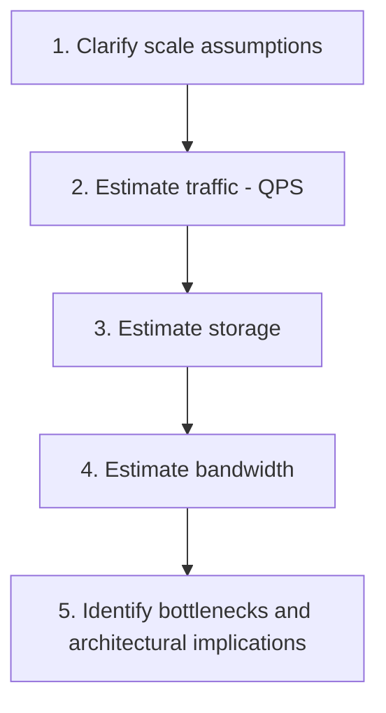

## Introduction

Chapter 1 flagged capacity estimation as a core interview skill, and nearly every chapter since has referenced numbers that "justify" a design decision. This chapter provides the actual toolkit: the reference numbers, formulas, and worked examples needed to do this confidently and quickly under interview conditions.

## Why This Matters (Revisited)

The numbers determine the architecture. A system serving 100 requests/day needs none of Parts 2-7 of this series; a system serving 100,000 requests/second needs most of it. Estimation isn't decoration on top of a design — it's the input that tells you which chapters of this entire series are actually relevant to the problem in front of you.

## Essential Reference Numbers

Memorize these — they come up constantly:

| Quantity | Approximate value |
|---|---|
| Seconds in a day | ~86,400 (~100,000 for easy mental math) |
| Seconds in a month | ~2.6 million |
| 1 KB | 10^3 bytes |
| 1 MB | 10^6 bytes |
| 1 GB | 10^9 bytes |
| 1 TB | 10^12 bytes |
| Average webpage/JSON API response | ~100 KB - 1 MB |
| Average image | ~200 KB - 2 MB |
| Average character (ASCII) | 1 byte |

| Latency reference | Approximate time |
|---|---|
| L1 cache reference | ~1 nanosecond |
| Main memory (RAM) reference | ~100 nanoseconds |
| SSD random read | ~100 microseconds |
| Round trip within same data center | ~0.5 milliseconds |
| Round trip, cross-country (US) | ~40-60 milliseconds |
| Round trip, cross-continent | ~150 milliseconds+ |
| Disk seek (spinning HDD) | ~10 milliseconds |

These latency numbers directly justify decisions from earlier chapters: why caching (Chapter 9, nanoseconds) beats a database round trip (milliseconds), and why a CDN (Chapter 11) matters for cross-continent users.

## The Estimation Process



### Step 1: Clarify Scale Assumptions

Always state assumptions explicitly rather than guessing silently — this is itself a demonstration of the requirement-gathering discipline from Chapter 1.

- Total users (e.g., "let's assume 100 million registered users")
- Daily Active Users, DAU (often 10-20% of total users for a typical consumer app — state this ratio explicitly)
- Read:write ratio (often heavily read-skewed for content platforms, e.g., 100:1 or more)

### Step 2: Estimate Traffic (QPS — Queries Per Second)

```
Daily Active Users (DAU) = 20 million
Average actions per user per day = 10
Total daily requests = 20,000,000 × 10 = 200,000,000

Average QPS = 200,000,000 / 86,400 seconds ≈ 2,315 QPS

Peak QPS (traffic is rarely uniform - apply a peak multiplier, commonly 2-3x average) 
= 2,315 × 3 ≈ 7,000 QPS
```

**Never forget the peak multiplier** — designing only for average load is a classic mistake; real traffic has daily/weekly patterns (Chapter 26's rate limiting and Chapter 7's elasticity discussions both assume this variability is real and must be planned for).

### Step 3: Estimate Storage

```
New posts per day = 2 million
Average size per post (text + metadata) = 1 KB
Daily storage growth = 2,000,000 × 1 KB = 2 GB/day

Over 5 years = 2 GB × 365 × 5 ≈ 3.65 TB (before replication factor)

With a 3x replication factor (Chapter 15) = ~11 TB total actual storage needed
```

### Step 4: Estimate Bandwidth

```
Peak QPS = 7,000
Average response size = 100 KB

Peak bandwidth = 7,000 × 100 KB = 700,000 KB/s = 700 MB/s = 5.6 Gbps
```

### Step 5: Identify Architectural Implications

This is where estimation actually pays off — translating raw numbers into concrete decisions:

- **7,000 QPS**: A single well-provisioned server typically handles a few thousand simple requests/second — this suggests horizontal scaling (Chapter 7) with multiple instances behind a load balancer (Chapter 8) is needed, but doesn't yet necessarily require aggressive sharding.
- **11 TB over 5 years**: Comfortably fits on a single well-provisioned database server's storage today (multi-TB SSDs are standard) — sharding (Chapter 16) may not be immediately necessary purely for storage volume, though write throughput might still independently justify it.
- **5.6 Gbps peak bandwidth**: Justifies CDN usage (Chapter 11) for any cacheable content, offloading this bandwidth from origin infrastructure entirely.

## A Complete Worked Example: Design a URL Shortener

```
Assumptions:
- 100 million new URLs shortened per month
- Read:write ratio = 100:1 (URLs are read/redirected far more than created)

Write QPS:
100,000,000 / 2,600,000 seconds/month ≈ 38 QPS (average writes)

Read QPS:
38 × 100 = 3,800 QPS (average reads)
Peak (3x) ≈ 11,400 QPS

Storage (assume each URL mapping ~500 bytes, retained for 5 years):
100M/month × 12 × 5 years = 6 billion URLs
6,000,000,000 × 500 bytes = 3 TB (before replication)

Implication: Read-heavy by two orders of magnitude -> caching (Chapter 9) is critical;
~11,400 peak read QPS is comfortably handled by a caching layer plus a modest number
of horizontally-scaled app servers; 3TB of data easily fits a single well-provisioned
database, likely with read replicas (Chapter 15) rather than needing sharding (Chapter 16)
purely for this data volume.
```

This is exactly the kind of estimation that should precede any case study in Part 9 of this series.

## Common Estimation Pitfalls

- **Forgetting the peak multiplier** — designing for average load alone.
- **Forgetting replication factor** when estimating storage — actual infrastructure storage needs are typically 2-3x the raw data size.
- **Over-precision**: The goal is order-of-magnitude correctness (is this thousands, millions, or billions?), not exact figures — spending excessive interview time on precise arithmetic is a poor use of limited time.
- **Skipping the "so what" step**: Numbers alone don't answer anything — the value is entirely in step 5, translating numbers into "therefore we need X."

## Summary

- Capacity estimation translates a system's scale into concrete numbers (QPS, storage, bandwidth) that directly justify architectural decisions made throughout the rest of a design.
- Memorizing key reference numbers (bytes, seconds, latency comparisons) enables fast, confident estimation without needing a calculator.
- The process: clarify assumptions, estimate QPS (with a peak multiplier), estimate storage (with a replication factor), estimate bandwidth, then translate these numbers into concrete architectural implications.
- The estimation itself is not the point — the "so what does this mean for my design" step is where the real value lies.

---

## Interview Questions

### 1. Why is applying a "peak multiplier" to average QPS considered essential, rather than designing a system based on average load alone?
**Answer:** Real-world traffic is never uniformly distributed across time — most systems experience predictable daily patterns (e.g., significantly higher usage during daytime/evening hours than at 3 AM), weekly patterns (weekday vs. weekend usage differences), and sometimes seasonal or event-driven spikes (a flash sale, a viral social media moment) — designing a system's capacity based purely on the mathematical average across an entire day would mean the system is systematically under-provisioned during these predictable peak periods, precisely when it needs to handle its highest actual load, leading to degraded performance or outright failures during exactly the times that likely matter most to the business (e.g., a shopping site failing during its highest-traffic holiday shopping period because capacity planning only considered the year-round daily average).

**Follow-up:** *Where does a reasonable peak multiplier value (like the commonly-cited 2-3x) actually come from, and would you expect it to be the same for every type of system?* — This value is typically derived from actual historical traffic pattern analysis for a specific system or industry — different types of applications exhibit different peak-to-average ratios (a B2B enterprise tool used primarily during business hours might show a very pronounced peak-to-average ratio concentrated in a narrow daily window, while a globally-distributed consumer app with users across many time zones might show a much flatter, less pronounced peak-to-average ratio since usage is naturally smoothed across different regions' different local peak hours) — in an interview setting without access to real historical data, stating a reasonable, commonly-cited assumption (2-3x) while explicitly acknowledging it's an assumption that would ideally be refined with real traffic data is the appropriate approach, rather than presenting a specific multiplier as a precise, universally-applicable constant.

### 2. Why does this chapter emphasize that "the goal is order-of-magnitude correctness, not exact figures"? What's the risk of over-indexing on precise arithmetic during a system design interview?
**Answer:** The actual architectural decisions that estimation informs (do we need sharding? do we need a CDN? does this fit on a single server?) typically hinge on which broad order of magnitude a number falls into (thousands vs. millions vs. billions of requests/records) rather than on its precise value — knowing you have "roughly 10,000 QPS" versus "roughly 100,000 QPS" meaningfully changes your architectural recommendation, while knowing whether it's precisely 10,247 versus 10,383 QPS changes nothing about the actual design decision; spending significant interview time meticulously calculating precise figures (correctly carrying exact decimal points, double-checking exact arithmetic) provides no additional decision-relevant value while consuming valuable, limited interview time that could instead be spent on the actual architectural reasoning and trade-off discussion that the numbers are meant to inform — over-indexing on precision can also signal to an interviewer that a candidate is focused on the wrong thing (calculation accuracy) rather than the actual skill being evaluated (using estimation to drive sound architectural decisions).

**Follow-up:** *How would you communicate this "order of magnitude, not precision" approach explicitly to an interviewer, to avoid seeming like you're being sloppy or careless with the math?* — You'd explicitly narrate your rounding choices and reasoning as you go — e.g., "I'll round this to roughly 100,000 seconds in a day for easier mental math, rather than the exact 86,400, since we just need the right order of magnitude here" — this kind of explicit, deliberate communication demonstrates that your rounding is a conscious, reasoned choice in service of efficient estimation (a genuine skill), rather than carelessness or an inability to do more precise arithmetic if it were actually needed — signaling competence and deliberate judgment rather than sloppiness.

### 3. Walk through why estimating storage requirements must account for a "replication factor," and how forgetting this could lead to a significant under-provisioning mistake.
**Answer:** As discussed in Chapter 15, production systems typically replicate data across multiple nodes/replicas for availability and read-scalability purposes — this means the actual, total infrastructure storage capacity needed is not simply equal to the raw, logical size of the unique data itself, but rather that raw size multiplied by however many total copies (replication factor) the system maintains (e.g., a common replication factor of 3 means the actual infrastructure storage footprint is roughly 3x the raw, logical data size). Forgetting this factor when estimating storage needs (e.g., calculating "3.65 TB of raw data, so we need a 3.65 TB storage budget") would significantly under-provision actual infrastructure capacity (in this example, actually needing roughly 11 TB once the replication factor is correctly applied) — this kind of oversight could lead to a real, embarrassing under-provisioning mistake if this estimation were used to actually inform real infrastructure procurement/budgeting decisions, or could reveal a gap in a candidate's practical, holistic understanding of what "storage requirements" actually, comprehensively encompasses in a real production system during an interview.

**Follow-up:** *Besides replication, what other factor might further increase actual storage needs beyond just "raw data size × replication factor"?* — Index overhead (Chapter 14) — database indexes themselves consume additional storage space beyond the raw underlying data they index, and depending on how many indexes a table has and their specific structure, this overhead can be a meaningful additional percentage on top of the raw data size; additionally, depending on the specific storage/database technology and its internal overhead (metadata, free space reserved for operations like compaction in an LSM Tree, per Chapter 14), actual storage consumption is often somewhat higher than a purely theoretical "raw bytes needed" calculation would suggest — a thorough estimation might apply an additional buffer/overhead percentage (e.g., an additional 20-30%) on top of the replication-adjusted figure to account for these various additional, real-world storage overhead factors.

### 4. In the URL shortener worked example, why does the 100:1 read:write ratio assumption have such a significant impact on the resulting architectural recommendation?
**Answer:** The 100:1 ratio directly reveals that read traffic (people clicking/following shortened URLs) vastly dominates write traffic (people creating new shortened URLs) by two full orders of magnitude — this specific insight directly justifies prioritizing read-path optimization (caching, per Chapter 9, becomes a clear, high-value investment since it specifically accelerates the read path that represents the overwhelming majority of the system's actual traffic) over write-path optimization (sophisticated write-scaling techniques like sharding, Chapter 16, are far less urgently needed here, since writes represent a comparatively small, manageable fraction of overall system load) — without explicitly identifying and quantifying this read:write skew, a candidate might instead default to generic, undifferentiated scaling advice (just "add more servers" or "shard the database") without the specific, targeted insight that caching is disproportionately the highest-leverage investment for this particular system's actual, skewed traffic pattern.

**Follow-up:** *How would your architectural recommendation change if, instead, this system had a much more balanced 1:1 read:write ratio?* — With a roughly balanced read:write ratio, the write path would represent a much more significant proportion of overall system load, meaning write-scaling considerations (potentially including sharding, Chapter 16, if write volume alone justified it at the estimated scale) would warrant much more serious, immediate architectural attention rather than being a comparatively lower priority — caching would still provide some benefit for the read portion of traffic, but its relative importance and leverage would be significantly reduced compared to the heavily read-skewed scenario, since it would no longer be addressing the overwhelming majority of total system load the way it does in the 100:1 read-heavy case — this illustrates precisely why explicitly estimating and stating this specific ratio (rather than assuming a generic, undifferentiated traffic pattern) is such a valuable, decision-relevant step in the overall estimation process.

### 5. Why might interview candidates specifically benefit from memorizing latency reference numbers (like "SSD random read ~100 microseconds" or "cross-continent round trip ~150ms"), beyond just knowing general concepts like "caching is faster than a database"?
**Answer:** Having these specific, memorized reference numbers readily available allows a candidate to make concrete, quantified arguments during a design discussion rather than only vague, qualitative claims — e.g., being able to state "a cache hit from an in-memory store takes on the order of microseconds, while a database round trip involving a disk-backed query might take single-digit milliseconds — that's roughly a 1000x difference, which is exactly why we'd want to cache this frequently-accessed, expensive-to-compute data" provides a much more precise, technically grounded, and persuasive justification than simply asserting "caching makes things faster" without any quantified sense of the actual magnitude of improvement involved — this level of specific, numbers-grounded reasoning (directly connecting back to Chapter 2's discussion of the physical realities underlying network/storage performance) is exactly the kind of concrete, quantitative thinking that distinguishes a strong, technically rigorous system design interview answer from a more superficial, buzzword-driven one.

**Follow-up:** *How might these same reference numbers help you reason about whether a proposed multi-region active-active architecture (Chapter 40) is likely to meet a stated latency requirement?* — Knowing that a cross-continent network round trip alone typically takes roughly 150ms or more (a hard, physics-based floor per Chapter 2) lets you quickly, quantitatively sanity-check a stated requirement — if an interviewer specifies a strict requirement like "responses must be under 100ms for all users globally," you can immediately recognize (using this memorized reference number) that this requirement is likely incompatible with any architecture requiring a genuine cross-continent round trip for every request (e.g., a design requiring every write to synchronously coordinate with a database in a different continent) — prompting you to either question/clarify this specific requirement with the interviewer, or to specifically design around it (e.g., using regional data locality so most users' requests don't require this expensive cross-continent round trip at all) — this kind of quick, numbers-grounded feasibility check is a valuable, practical application of having these reference latencies readily memorized and available.

### 6. A candidate estimates that their system needs to handle "1 million requests" without specifying a time unit. Why is this estimation practically useless, and what follow-up question would you ask to make it actionable?
**Answer:** "1 million requests" with no associated time period provides no way to determine the actual, meaningful load-handling requirement the system needs to support — 1 million requests spread evenly across an entire year represents an extremely modest, easily-handled average load (roughly 0.03 requests per second), while 1 million requests within a single second would represent an absolutely massive, extraordinarily demanding load requiring a completely different order of architectural sophistication — without a specified time unit, this number provides literally no actionable information about the actual required system capacity/throughput, making any subsequent architectural recommendation based on this incomplete figure essentially meaningless or, worse, based on an unstated, potentially very wrong assumption about the actual intended timeframe.

**Follow-up:** *If a candidate corrects themselves to state "1 million requests per day," what's the next logical estimation step you'd expect them to take, drawing on this chapter's process?* — You'd expect them to convert this daily figure into a QPS (queries per second) figure by dividing by the number of seconds in a day (using the ~86,400, or a rounded ~100,000 for easier mental math, reference figure from this chapter) to get an average QPS figure, and then — critically, per this chapter's emphasis — apply an appropriate peak multiplier (e.g., 2-3x) to that average QPS figure to arrive at a more realistic, actionable peak QPS estimate that should actually drive the system's capacity/architectural planning, rather than stopping at the average QPS figure alone and risking the under-provisioning-for-peak-load mistake this chapter specifically warns against.

### 7. Why does this chapter argue that capacity estimation numbers are valuable specifically because of the "so what" step (translating numbers into architectural implications), rather than the calculation itself?
**Answer:** Performing the arithmetic to arrive at a specific QPS or storage figure is a relatively mechanical, formulaic exercise once the necessary input assumptions are established — the genuine engineering judgment and value lies specifically in correctly interpreting what a given resulting number actually *means* for the system's architecture: recognizing that "7,000 peak QPS" specifically suggests horizontal scaling with a handful of server instances is likely sufficient (rather than requiring extreme, specialized scaling techniques), or that "11 TB over 5 years" comfortably fits on modern single-server storage without necessarily requiring sharding purely for storage-volume reasons — a candidate who correctly performs the arithmetic to arrive at accurate numbers, but then fails to draw out and articulate these specific, concrete architectural implications, has only completed the mechanical half of the exercise without demonstrating the actual system design judgment and reasoning that these numbers are meant to inform and justify — which is precisely the skill interviewers are actually trying to assess through this exercise.

**Follow-up:** *Can you give an example of two candidates arriving at the exact same numerical estimation results, but one demonstrating much stronger system design judgment than the other?* — Both candidates might correctly calculate "peak QPS of approximately 50,000" for a given system — Candidate A might simply state this number and move on to designing an elaborate, heavily-sharded, multi-region architecture without further justification, essentially treating high scale as an assumption to design maximally for regardless of the specific number's actual implications; Candidate B might instead explicitly reason: "50,000 QPS is a substantial but not extreme figure — a well-optimized single service, horizontally scaled across a moderate number of instances behind a load balancer, can likely handle this without needing full database sharding yet, especially if we add appropriate caching for the read-heavy portions of this traffic; I'd want to validate this assumption with real load testing before committing to more complex architecture" — Candidate B's response demonstrates meaningfully stronger, more nuanced system design judgment, correctly calibrating the proposed architecture's complexity specifically to what the actual numbers justify, rather than defaulting to maximal complexity regardless of the specific figures involved — precisely the "so what" reasoning this chapter emphasizes as the actual valuable skill being assessed.

### 8. Why might explicitly stating your estimation assumptions out loud during an interview (e.g., "I'll assume 20% of registered users are daily active users") be considered a best practice, even when you're not certain these specific assumptions are accurate?
**Answer:** Explicitly stating assumptions serves multiple purposes: it demonstrates the same requirement-gathering discipline emphasized in Chapter 1 (making explicit, examinable assumptions rather than silently guessing and potentially proceeding on an unstated, possibly badly wrong basis); it gives the interviewer a clear, transparent opportunity to correct or refine an assumption if they have a different scale or context in mind (e.g., "actually, for this specific type of application, DAU is typically closer to 40% of registered users" — a correction that's only possible if the original assumption was stated explicitly and visibly, rather than buried silently within an unstated calculation); and it demonstrates a mature, professional engineering habit — in real-world system design work, being explicit and transparent about underlying assumptions (rather than presenting estimates as if they were precisely known, verified facts) is itself a valuable, important practice that reduces the risk of decisions being made on the basis of hidden, unexamined, and potentially incorrect assumptions.

**Follow-up:** *What would you do, mid-estimation, if an interviewer specifically corrected one of your stated assumptions partway through your calculation?* — You'd acknowledge the correction, then explicitly and transparently redo (or at least clearly note the directional/magnitude impact of redoing) the affected portions of your calculation using the corrected assumption — demonstrating flexibility and responsiveness to new information (directly echoing Chapter 1's discussion of adapting when an interviewer changes requirements mid-interview) rather than either ignoring the correction and proceeding with your original, now-known-to-be-incorrect assumption, or becoming flustered and losing track of how this specific change propagates through and affects your broader estimation and subsequent architectural recommendations — smoothly incorporating corrections and continuing your reasoning is itself a demonstration of the kind of real-world engineering adaptability interviewers are looking to assess.

### 9. Why might a candidate reasonably choose to skip detailed capacity estimation entirely for certain types of system design interview questions, and how would you recognize when this is appropriate?
**Answer:** Detailed capacity estimation is most valuable specifically when the resulting numbers would genuinely, materially change the proposed architecture — for some system design questions, particularly those focused primarily on a specific algorithmic or logical design challenge rather than a scale/infrastructure challenge (e.g., "design the class structure for a parking lot" — more of an LLD-style question, or a question explicitly scoped by the interviewer as "let's assume this is a small-scale internal tool, don't worry about massive scale"), extensive capacity estimation might not add meaningful value to the core discussion the interviewer is actually trying to evaluate, and spending significant time on it could actually detract from addressing the question's real, intended focus; recognizing when this is appropriate requires listening carefully to the interviewer's framing and explicit or implicit signals about what aspect of the design they're most interested in evaluating — if scale/infrastructure trade-offs are clearly not the focus, a brief acknowledgment ("given this is explicitly a smaller-scale internal tool, I won't spend much time on detailed capacity estimation, since it's unlikely to meaningfully change our architectural approach here") followed by moving on to the actual focus of the question is more appropriate than mechanically performing extensive estimation regardless of its actual relevance to what's being evaluated.

**Follow-up:** *If you're genuinely uncertain whether an interviewer wants detailed capacity estimation for a given question, what would be an appropriate way to handle this uncertainty?* — Briefly asking the interviewer directly — something like "Would it be helpful for me to walk through some capacity estimation to inform the scale of this design, or would you like me to focus more directly on the architecture/component design?" — this kind of direct, efficient clarifying question (echoing this series' broader emphasis on proactive requirement clarification from Chapter 1) resolves the uncertainty quickly and ensures you spend your limited interview time on what the interviewer actually wants to evaluate, rather than either assuming detailed estimation is always expected (potentially wasting time if it's not particularly relevant to this specific question) or assuming it's never needed (potentially missing an opportunity to demonstrate this valued skill if the interviewer did want to see it).

### 10. Why does this chapter's URL shortener worked example explicitly note "before replication" when calculating raw storage, and then separately address replication as an additional consideration — rather than folding replication directly into a single combined storage calculation?
**Answer:** Separating "raw logical data size" from "actual infrastructure storage needed (including replication)" as two distinct, sequential steps mirrors the same clarity-through-explicit-decomposition principle this chapter emphasizes throughout (explicit assumptions, explicit steps) — it allows each specific factor's contribution to the final total to be clearly, individually understood and communicated (e.g., "our raw data is 3TB; with a 3x replication factor for availability, our actual infrastructure storage need is approximately 9-11TB") rather than presenting a single, combined final number that obscures how much of that total is attributable to the raw data itself versus how much is attributable to the replication overhead specifically — this kind of transparent, decomposed presentation makes it much easier for both the candidate and the interviewer to follow, verify, and productively discuss each individual component of the overall estimation, and makes it easier to adjust the final estimate cleanly if, for example, the interviewer specifies a different replication factor than the one initially assumed (you can simply recalculate the replication multiplier's effect on the already-established raw data figure, rather than needing to redo an entangled, combined calculation from scratch).

**Follow-up:** *How does this same "decompose into clear, individually-understandable steps" principle apply to how this chapter structures the overall five-step estimation process (assumptions, QPS, storage, bandwidth, implications) more broadly?* — The overall five-step structure applies this exact same principle at a higher level — rather than attempting to jump directly to a final architectural recommendation, or performing a single, monolithic, hard-to-follow calculation combining traffic, storage, and bandwidth considerations all at once, the process deliberately breaks estimation into clearly sequential, individually-understandable steps, each building on clearly-stated assumptions and previous results — this structured decomposition makes the overall reasoning process much easier for an interviewer to follow and evaluate in real-time (they can clearly see and potentially question/correct each specific step, rather than needing to reverse-engineer a complex, combined calculation to understand where a final number actually came from), and makes it easier for the candidate themselves to stay organized and avoid errors when working through a genuinely multi-faceted estimation problem under the time pressure and cognitive load of a live interview setting.
