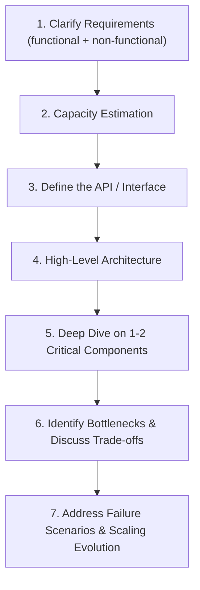
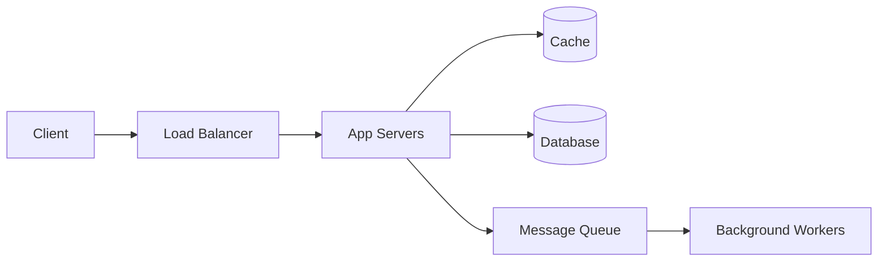

## Introduction

This chapter closes Part 8 — and the conceptual portion of this series — by assembling everything covered so far into a single, repeatable framework. Part 9's thirteen case studies will each follow this exact structure; understanding the framework itself, and *why* each step exists, matters more than memorizing any one specific design.

## The Framework, at a Glance



Roughly allocate interview time: 5-10% requirements, 5-10% estimation, 5-10% API design, 25-30% high-level architecture, 30-35% deep dive, remainder on trade-offs and failure scenarios — weighted toward the deep dive and architecture, since that's where most of the actual signal lives, but never skipping the earlier steps entirely.

## Step 1: Clarify Requirements

Directly from Chapter 1's framework. Split into two categories:

**Functional requirements** — what must the system do? Ask specific, scoping questions:
- What are the core user actions? (For a URL shortener: shorten a URL, redirect from a short URL.)
- What's explicitly *out of scope*? (Custom aliases? Analytics? Expiration?) — scoping down an intentionally broad prompt is a skill, not a shortcut.

**Non-functional requirements** — the quality attributes from Chapter 1: scale, availability, consistency, latency. Ask:
- Expected scale? (Users, requests/day — feeds directly into Step 2.)
- Read-heavy or write-heavy? (Directly informs caching and database strategy, Chapters 9, 13, 15.)
- Strong or eventual consistency needs? (Chapters 17-19 — and *which specific data* needs which guarantee, not the system as a monolithic whole.)
- Latency requirements? (Sub-100ms? A few seconds is fine?)

**Do not skip this step even under time pressure.** A technically excellent design built on wrong assumptions about scope or scale is a worse interview outcome than a simpler design built on correctly-clarified requirements.

## Step 2: Capacity Estimation

Chapter 47's process: QPS, storage, bandwidth, and — critically — the "so what" translation into architectural implications. Keep this focused and move on; it's an input to the rest of the design, not the main event.

## Step 3: Define the API / Interface

Sketch the core API endpoints (Chapters 5-6) before drawing boxes — this forces clarity about exactly what the system does, and often surfaces missing requirements.

```
POST /urls          { longUrl, customAlias? }  -> { shortUrl }
GET  /{shortCode}   -> 302 redirect to longUrl
```

Keep this brief — a handful of core endpoints, not exhaustive API documentation.

## Step 4: High-Level Architecture

Draw the major components and how data flows between them — this is where most of Parts 2-6 of this series gets applied:



Narrate *why* each component exists as you draw it — "I'm adding a cache here specifically because we established this is a 100:1 read-heavy workload" — connecting back to Steps 1-2, rather than presenting components as an assumed, unmotivated template.

## Step 5: Deep Dive on 1-2 Critical Components

This is typically where the interview's real signal comes from. Pick the most architecturally interesting or difficult part of the system and go deep — this is where Parts 3-4's specific techniques (sharding strategy, consistency model choice, specific algorithms like consistent hashing or rate limiting) actually get applied concretely, rather than just named.

**How to choose what to deep-dive**: Often the interviewer will steer you ("tell me more about how you'd handle the ID generation"), but if not, pick the piece that's most technically non-trivial and most central to the system's actual hard problem — for a URL shortener, that's unique short-code generation; for a chat system, it's real-time message delivery and connection management; for a news feed, it's the feed-generation/fan-out strategy.

## Step 6: Identify Bottlenecks and Discuss Trade-offs

Proactively revisit your own design critically: "At this scale, the database would become a bottleneck for X reason — here's how I'd address it, and here's the trade-off that introduces." This demonstrates the self-critical, trade-off-aware thinking emphasized throughout this series (Chapter 1's "great vs good" distinction) — waiting for the interviewer to find every weakness themselves is a weaker showing than surfacing them yourself.

## Step 7: Address Failure Scenarios and Scaling Evolution

Close by discussing: What happens if a specific component fails (Chapters 36, 40-41)? How would this design evolve if scale grew by 100x (Chapter 7's incremental scaling philosophy)? This demonstrates the same "narrate the evolution, don't design for an assumed end-state from scratch" thinking discussed in Chapter 7.

## Handling Interruptions and Redirects

Interviewers frequently interrupt to steer the conversation — toward a specific component, a changed requirement, or a challenge to a decision you made. Chapter 1 already covered the right response: treat this as an invitation to demonstrate adaptability, not a sign of failure. Revisit the specific affected part of your design, explain what changes and why, and continue — don't discard the entire design and start over unless the change is genuinely foundational.

## What Interviewers Are Actually Scoring (Revisited from Chapter 1)

Returning to where this series began, now with the full framework in view:

- **Structured thinking**: Did you follow a recognizable process (this framework), rather than jumping straight to a solution?
- **Requirement-driven design**: Does every major decision trace back to a stated requirement or estimated number, rather than being an unmotivated default?
- **Depth where it matters**: Did you go genuinely deep on the 1-2 hardest parts, rather than staying superficial everywhere?
- **Trade-off awareness**: Did you name the costs of your choices, not just their benefits?
- **Communication**: Could someone else follow your reasoning and rebuild your design from your explanation alone?

## Using This Framework for Part 9's Case Studies

Every chapter in Part 9 (URL shortener, chat systems, ride-sharing, video streaming, and more) follows this exact seven-step structure. Rather than treating each case study as a distinct thing to memorize, treat them as worked examples of this *one* repeatable process applied to different problems — the specific answers will differ, but the method should feel identical every time, because it's the method, not the memorized answer, that transfers to a genuinely novel "Design X" prompt you haven't seen before.

## Summary

- The seven-step framework: clarify requirements, estimate capacity, define the API, sketch high-level architecture, deep-dive on 1-2 critical components, discuss bottlenecks/trade-offs, address failure scenarios and scaling evolution.
- Time allocation should weight toward high-level architecture and the deep dive, since that's where most interview signal lives — but never skip the earlier steps entirely.
- Every design decision should trace back to a stated requirement or estimated number — narrate the "why," not just the "what."
- Proactively surfacing your own design's weaknesses and trade-offs is stronger than waiting for the interviewer to find them.
- This framework, not any single memorized case study, is what actually transfers to a novel design question — Part 9's case studies are worked examples of this one repeatable process.

---

## Interview Questions

### 1. Why does this framework place "clarify requirements" as the mandatory first step, even under significant time pressure, rather than allowing candidates to skip to architecture if they feel confident about a common problem type?
**Answer:** As emphasized since Chapter 1, skipping requirement clarification risks designing an excellent solution to the wrong problem — even for a seemingly "common," well-known problem type (like a URL shortener), the interviewer may have a specific, non-default scope or scale in mind (e.g., wanting custom aliases and analytics included, or specifically wanting to discuss a scale of 10 billion URLs rather than a more modest assumption) that a candidate who skips clarification and simply assumes a generic, "textbook" version of the problem would miss entirely — this risks spending the majority of limited interview time building out an architecture that doesn't actually address what the interviewer specifically wanted evaluated, which is a fundamentally worse outcome than a somewhat simpler design that's correctly scoped and validated against the interviewer's actual, specific intent from the very beginning.

**Follow-up:** *If an interviewer explicitly says "let's skip the requirements clarification, just assume standard requirements and go straight to the design," how would you handle this instruction while still preserving some of this step's value?* — You'd briefly, quickly state your key assumed requirements aloud as you move directly into the design (e.g., "okay, I'll assume this is a fairly standard URL shortener — basic shorten/redirect functionality, moderate scale, no custom aliases or analytics needed unless you'd like me to add them") — this preserves the core value of the clarification step (making your assumptions explicit and giving the interviewer a chance to redirect if your assumed defaults don't match their actual intent) in a much more time-efficient, condensed form, respecting their explicit instruction to move quickly while still not silently, invisibly assuming requirements without at least briefly stating them for potential correction.

### 2. Why does this chapter recommend deep-diving on only "1-2" critical components, rather than attempting to go deep on every single component in the high-level architecture?
**Answer:** Given realistic interview time constraints (typically 45-60 minutes total, covering all seven framework steps), attempting genuine technical depth on every single component in a moderately complex system's architecture would be practically impossible — spreading limited depth-oriented time thinly across many components would likely result in only superficial treatment of each, failing to demonstrate genuine technical depth and mastery on *any* specific area, which is a weaker overall interview signal than demonstrating genuinely deep, rigorous, well-reasoned technical thinking on a smaller number of carefully-chosen, particularly important or difficult components — interviewers are specifically looking for evidence that a candidate *can* reason deeply and rigorously about hard technical problems, and this is better demonstrated through focused depth on a well-chosen subset than through uniform, necessarily shallow coverage of everything.

**Follow-up:** *What risk does a candidate take on if they choose to deep-dive on a component that turns out not to be what the interviewer considers the most important or interesting part of the system?* — There's a genuine risk that the interviewer, having a specific area of interest or a specific hard problem in mind that they wanted explored in depth, might be somewhat disappointed or feel the interview didn't fully showcase the candidate's abilities on the aspect they cared most about — this is precisely why actively listening for and responding to interviewer cues/steering (as this chapter notes, "often the interviewer will steer you") is valuable — proactively asking something like "Is there a particular part of this system you'd like me to focus on in more depth, or should I pick what I think is the most technically interesting challenge here?" can help mitigate this risk by directly involving the interviewer in this choice, rather than the candidate needing to guess correctly on their own about what the interviewer most wants to see explored.

### 3. Why does this chapter argue that "proactively surfacing your own design's weaknesses" is a stronger approach than waiting for the interviewer to identify them?
**Answer:** Proactively identifying and discussing your own design's limitations and trade-offs demonstrates a genuine, mature engineering habit of continuous self-critical evaluation — the same kind of thinking a senior engineer would naturally apply when reviewing their own work before presenting it to others, rather than needing an external reviewer to catch every issue; this signals stronger, more complete ownership and understanding of the design's actual trade-offs and limitations (you clearly understand not just what you built, but precisely where and why it might struggle or need further evolution) — whereas a candidate who only ever addresses weaknesses when specifically prompted by the interviewer's direct questions may not actually possess this same depth of self-aware understanding, and could come across as having designed the system somewhat superficially, only genuinely grappling with its real limitations when explicitly forced to by external questioning, rather than as a natural, internalized part of their own design process and thinking.

**Follow-up:** *Is there a risk of being overly self-critical, spending too much interview time enumerating every conceivable weakness of your own design?* — Yes — the goal is demonstrating targeted, relevant self-awareness about the most significant, genuinely important trade-offs and limitations (particularly ones directly tied to the specific requirements/scale established earlier in the interview), not an exhaustive, unfocused list of every conceivable minor imperfection; a candidate should exercise judgment about which specific weaknesses are actually significant and worth discussing given the established context (echoing this series' broader theme of matching effort/detail to genuine significance rather than exhaustive completeness for its own sake) — briefly, efficiently naming the 1-2 most significant trade-offs or bottlenecks, and how you'd address them, is more valuable than an unfocused, time-consuming enumeration of every theoretically possible weakness, however minor or unlikely to actually matter at the established scale/requirements.

### 4. Explain why this chapter recommends defining the API (Step 3) before drawing the high-level architecture diagram (Step 4), rather than the reverse order.
**Answer:** Explicitly defining the core API endpoints first forces genuine clarity and specificity about exactly what functionality the system actually needs to support — this concrete exercise (deciding exact endpoint names, request/response shapes, key parameters) often surfaces subtle ambiguities or missing requirements that weren't fully resolved during the earlier, more abstract requirements-clarification step (e.g., realizing while defining the API that you're unsure whether URL shortening should support a custom expiration date, prompting you to go back and clarify this specific detail) — having this concrete, specific API definition established first then gives you a clearer, more grounded foundation for subsequently designing the high-level architecture, since you have a precise understanding of the actual operations the architecture needs to support, rather than attempting to design the architecture based on a still-somewhat-abstract, higher-level understanding of "what the system generally does" without having yet worked through these more concrete, specific interaction details.

**Follow-up:** *What would you do if, while defining the API in Step 3, you realize you need to revisit and adjust an assumption you made during Step 1's requirements clarification?* — You'd simply, briefly go back and adjust/clarify that specific assumption (potentially briefly confirming with the interviewer if it's a significant change) before proceeding — this kind of natural, iterative refinement between steps is a normal, healthy part of the overall design process rather than a failure of the framework's sequential structure; the framework's steps provide a useful, generally-sequential structure to organize your thinking and communication, but real design work often involves this kind of natural back-and-forth refinement between steps as new details and considerations emerge, and being willing to naturally revisit an earlier step's conclusion when a later step reveals a gap or inconsistency demonstrates flexible, non-rigid engineering thinking rather than mechanically, inflexibly treating each step as a one-way, never-revisited box to check off.

### 5. Why does this chapter emphasize narrating "why" a component exists as you draw the high-level architecture (Step 4), rather than simply presenting a complete diagram and briefly labeling each box?
**Answer:** Explicitly narrating the specific reasoning behind each component's inclusion (e.g., "I'm adding a cache here specifically because we established this is a 100:1 read-heavy workload") directly demonstrates that your architectural choices are genuinely, deliberately connected to and driven by the specific requirements and estimation established in earlier steps, rather than being an unmotivated, generic template applied regardless of this specific problem's actual, particular needs — this is precisely the "requirement-driven design" quality this chapter explicitly lists as something interviewers are scoring; simply presenting a complete, pre-formed diagram with brief labels, without this explicit connecting narration, makes it much harder for an interviewer to assess whether you genuinely understand *why* each specific component is needed for *this specific* problem's actual requirements, versus simply reciting a memorized, generic "standard" architecture diagram that happens to look superficially similar to what a well-reasoned, requirement-specific design would produce.

**Follow-up:** *How would this narration specifically differ between designing a system explicitly established as read-heavy versus one explicitly established as write-heavy, using the same basic set of architectural components?* — For a read-heavy system, your narration would emphasize the caching layer's central importance ("given our 100:1 read:write ratio, this cache is doing the heavy lifting for the vast majority of our traffic, letting us keep our database load manageable") and might deprioritize or spend less narrative time justifying more elaborate write-path scaling components; for a write-heavy system, your narration would instead emphasize write-path scaling considerations more prominently (perhaps explicitly justifying a sharding strategy, Chapter 16, or an LSM-Tree-based database choice, Chapter 14, specifically suited to high write throughput) while the caching layer's narration might be comparatively brief or even omitted if reads genuinely aren't a significant concern for this specific system — the same basic architectural "shape" (app servers, cache, database) might appear in both diagrams, but the specific justification and relative emphasis in your narration should clearly, visibly differ based on the specific, established requirements driving each particular design.

### 6. Why might a candidate who has memorized a specific "standard" answer for a common system design question (like a URL shortener) actually perform worse than a candidate genuinely applying this chapter's framework, even if both arrive at similar final architectures?
**Answer:** A candidate relying on a memorized "standard" answer typically cannot convincingly explain *why* each specific design decision was made in a way that's genuinely, flexibly connected to this chapter's specific, live-established requirements and estimation — when an interviewer inevitably introduces a variation, a changed requirement, or a probing follow-up question that deviates even slightly from the exact memorized scenario, a candidate relying purely on memorization often struggles to adapt, since their understanding is tied to reciting a specific, fixed answer rather than genuinely, flexibly reasoning from first principles about *why* that answer's specific components and trade-offs made sense for the originally assumed (and now-changed) requirements — a candidate genuinely applying this chapter's framework, by contrast, can naturally and confidently adapt their reasoning to any specific variation the interviewer introduces, since their approach is a genuinely flexible, reusable *process* for reasoning about requirements and trade-offs, not a fixed, memorized final answer tied to one specific, exact scenario.

**Follow-up:** *How might an interviewer specifically design their questions or follow-ups to distinguish between these two types of candidates?* — An experienced interviewer will often deliberately introduce a mid-interview requirement change or a specific, probing "what if" scenario that deviates from the most common, textbook version of a well-known problem (e.g., for a URL shortener, asking "what if we now need this system to support genuinely real-time analytics on every single redirect, updated within seconds" — a requirement not part of the most commonly memorized, basic URL-shortener answer) — a candidate's response to this kind of live, specific perturbation reveals whether they're genuinely reasoning from the underlying principles and framework (this chapter's approach) and can naturally, confidently extend their design to accommodate this new requirement, versus whether they're relying on a memorized answer and become noticeably less confident, more generic, or less coherent once forced outside the bounds of whatever specific scenario they had prepared and memorized in advance.

### 7. Why does this chapter recommend spending the smallest proportional time allocation on the API definition step (Step 3), despite it being an explicitly named, distinct step in the framework?
**Answer:** The API definition step's primary value (as discussed in an earlier question) is specifically in forcing clarity about the system's core operations and surfacing any remaining requirement ambiguities — this value is achieved through defining a small number of core, representative endpoints (as shown in this chapter's brief URL shortener example, just two endpoints) rather than through comprehensive, exhaustive API documentation covering every possible parameter, error response, and edge case — once this clarifying value has been achieved through a brief, representative sketch, continuing to spend significant additional time elaborating extensive API documentation details provides comparatively little additional value toward the interview's actual goals (demonstrating architectural reasoning and technical depth, per this chapter's later steps), making it appropriate to keep this step brief and efficient, reserving the interview's more substantial time allocation for the higher-value architecture and deep-dive steps where the majority of genuine technical signal and depth is actually demonstrated.

**Follow-up:** *If an interviewer specifically asks you to elaborate much further on API design details (e.g., asking about specific error handling, versioning strategy per Chapter 6, or pagination approach), how would this change your time allocation for this particular interview?* — You'd naturally and flexibly reallocate more time to this specific area in direct response to the interviewer's explicit signal that they're particularly interested in evaluating API design depth for this specific interview — this chapter's suggested time allocations are general defaults/starting points, not rigid, inflexible rules — genuinely following the interviewer's specific interests and explicit requests (as emphasized throughout this framework's discussion of adapting to interviewer steering) should always take precedence over mechanically adhering to a generic, one-size-fits-all time-allocation template, since the interviewer's specific interest signals are the most direct, reliable indication of what will actually be most valuable and well-received to spend additional time on for that particular interview.

### 8. Why does this chapter frame Part 9's upcoming case studies as "worked examples of this one repeatable process" rather than as a set of distinct designs to be individually memorized?
**Answer:** The actual, transferable skill a system design interview is trying to assess is a candidate's ability to apply sound reasoning, structured process, and trade-off-aware judgment to a *novel* problem they likely haven't seen or specifically prepared for before — memorizing a fixed set of specific case-study answers (even a comprehensive set of 13, as Part 9 will provide) provides no genuine protection against an interviewer asking about a system design problem outside that specific memorized set, or introducing a significant enough variation on a "known" problem that the memorized answer no longer directly applies; framing the case studies specifically as worked examples of applying this one general, repeatable framework emphasizes that the actual valuable takeaway is the *framework and reasoning process itself* (which genuinely does transfer to any novel problem), while the specific final architectures presented in each case study are secondary, illustrative applications of that more fundamentally important, transferable underlying method.

**Follow-up:** *How should a reader/learner's actual study approach differ if they're preparing based on this "framework first" understanding, versus a "memorize the specific answers" approach?* — A framework-first approach would prioritize genuinely internalizing and practicing the seven-step process itself (perhaps by attempting to apply it independently to a genuinely novel design problem not covered by this series' specific case studies, before checking any provided/expected answer) — using this series' Part 9 case studies primarily to observe and learn *how* the framework's specific steps get applied and adapted to different specific problems' different specific requirements and hard sub-problems, rather than primarily trying to memorize each case study's specific final architecture diagram and specific technology choices; this framework-first practice approach much better prepares a candidate to confidently, competently handle a genuinely novel "Design X" prompt in an actual interview, compared to an approach that primarily focused on memorizing a fixed set of specific, particular answers that may not directly transfer to whatever specific problem is actually posed in a real interview setting.

### 9. Why might the specific percentage-based time allocations given in this chapter (5-10% requirements, 25-30% architecture, etc.) be better understood as illustrative defaults rather than precise, rigid rules to be strictly followed in every interview?
**Answer:** As this chapter itself notes in an earlier discussion (regarding API design time allocation), the *actual* appropriate time allocation for any specific interview should be responsive to the interviewer's specific signals, interests, and explicit requests for that particular conversation — a rigid, mechanical adherence to these specific percentage figures regardless of the actual, specific interview's flow and the interviewer's demonstrated interests would work against the framework's broader, more important emphasis on adaptability and responsiveness to interviewer steering (echoing Chapter 1's explicit discussion of handling mid-interview requirement changes gracefully); these percentages are better understood as reasonable, illustrative starting-point defaults reflecting where the framework's authors believe interview signal *typically* concentrates (weighted toward architecture and deep-dive), useful for a candidate's own general time-management planning and expectation-setting, rather than as precise figures to be mechanically tracked and enforced regardless of how a specific, actual interview conversation naturally develops and where the interviewer's specific, expressed interests actually lie.

**Follow-up:** *What's a practical, real-time way a candidate could monitor and adjust their own time allocation during an actual live interview, beyond simply having memorized these rough percentage targets in advance?* — Periodically, briefly checking in with the interviewer about time and direction — e.g., "I've covered the high-level architecture; I'm thinking of diving deeper into the ID-generation strategy next, since I think that's the most interesting technical challenge here — does that sound like a good use of our remaining time, or would you prefer I focus elsewhere?" — this kind of brief, periodic, collaborative check-in serves both a practical time-management purpose and further reinforces the collaborative, communicative engagement (explicitly listed among what interviewers are scoring) that this chapter and Chapter 1 have emphasized throughout — actively involving the interviewer in these pacing/focus decisions, rather than silently, unilaterally following a fixed internal time budget regardless of how the actual conversation and the interviewer's real-time signals are naturally developing.

### 10. Having now covered Chapters 1 through 48 of this series, why does this chapter's closing framework represent a natural, appropriate capstone to the conceptual (non-case-study) portion of the series, rather than simply being "one more chapter" among many?
**Answer:** Every one of the preceding 47 chapters covered a specific concept, technique, or trade-off (caching, sharding, consistency models, circuit breakers, service discovery, observability, and so on) — but a system design interview doesn't test whether you can recite these individual concepts in isolation; it tests whether you can *synthesize and apply* the right subset of these many concepts, in the right combination, in service of a specific, coherent, well-justified design for a specific problem, under real time constraints — this closing framework chapter is specifically what ties all of these individually-learned concepts together into that actual, practiced, applied skill: a repeatable process for taking a novel "Design X" prompt and systematically working through it, pulling in exactly the specific concepts from earlier chapters that are actually relevant to that specific problem's actual requirements and scale, rather than either superficially name-dropping every concept regardless of relevance, or getting lost without a clear, structured process for organizing and applying this large body of individually-learned material — this is precisely why it serves as the natural bridge and capstone between the conceptual "building blocks" portion of this series (Chapters 1-47) and the applied "put it all together" case studies that follow in Part 9.

**Follow-up:** *What would you say to a reader who feels they've thoroughly understood every individual chapter's specific concept, but still feels uncertain or unpracticed at actually applying this framework to synthesize them into a coherent design under real interview time pressure?* — This is a genuinely common, expected experience — understanding individual concepts and being able to fluently *apply* them together under real time pressure are related but distinct skills, and the second skill specifically requires deliberate, repeated practice (not just conceptual reading/understanding) — the most direct, valuable next step would be to actually practice this framework repeatedly on a variety of specific design problems (both the case studies in Part 9, and ideally additional, genuinely novel problems beyond this series' specific coverage), ideally under realistic, timed conditions and, if possible, with a mock interview partner or at least by narrating your reasoning out loud as you would in a real interview — this kind of deliberate, repeated, applied practice is what actually builds the fluency and confidence to smoothly synthesize and apply this large body of conceptual knowledge under genuine interview time pressure, in a way that simply reading and understanding the individual concept chapters alone, however thoroughly, cannot fully substitute for.
