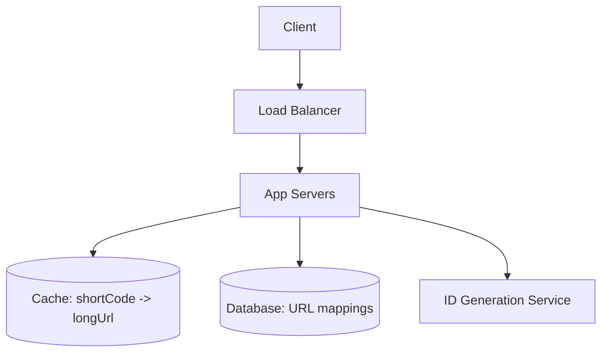
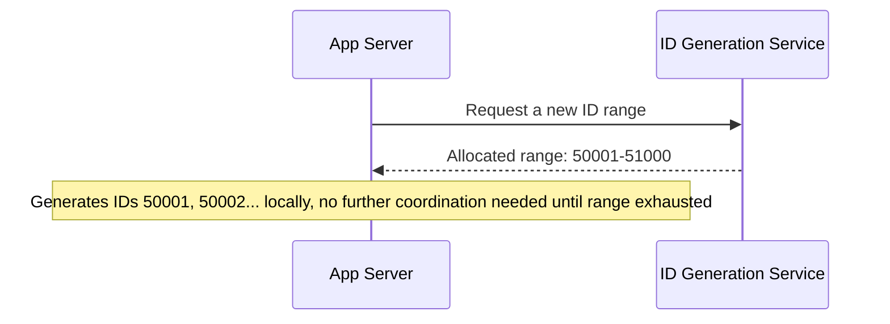

## Introduction

This is the first of thirteen case studies, each applying Chapter 48's seven-step framework end to end. A URL shortener is a deliberately good starting case study: small enough to fully cover in one chapter, but touching capacity estimation, unique ID generation, caching, and database choice — a genuine cross-section of this series.

## Step 1: Clarify Requirements

**Functional:**
- Given a long URL, generate a unique, short URL.
- Given a short URL, redirect to the original long URL.
- (Explicitly out of scope unless asked: custom aliases, link expiration, click analytics — mention these as possible extensions, but don't design for them unprompted.)

**Non-functional:**
- High availability for redirects (a broken short link is a poor, visible failure).
- Low latency redirects (users expect near-instant redirection).
- Uniqueness — no two long URLs should ever collide on the same short code (or, if they can, that's an explicit design choice to clarify).
- Read-heavy: assume redirects vastly outnumber URL creations (established explicitly, not assumed silently).

## Step 2: Capacity Estimation

Reusing Chapter 47's worked example directly:
- 100M new URLs/month → ~38 writes/second average.
- 100:1 read:write ratio → ~3,800 reads/second average, ~11,400 peak.
- 6 billion URLs over 5 years × ~500 bytes each ≈ 3TB raw, ~9-11TB with replication.

**Implication**: Heavily read-skewed, moderate absolute scale — caching is the highest-leverage investment; database sharding is not yet obviously necessary for either data volume or write throughput at this scale.

## Step 3: Define the API

```
POST /api/v1/urls
  Body: { "longUrl": "https://example.com/very/long/path" }
  Response: { "shortUrl": "https://short.ly/aZ9kX2" }

GET /{shortCode}
  Response: 301/302 redirect to the original long URL
```

## Step 4: High-Level Architecture



- **Load balancer + horizontally-scaled app servers** (Chapters 7-8): stateless, easy to scale for the read-heavy redirect traffic.
- **Cache** (Chapter 9): given the 100:1 read skew, this absorbs the vast majority of redirect traffic — a cache-aside pattern, since a miss simply falls through to the database.
- **Database**: given the moderate 3TB-ish data volume and simple key-value access pattern (`shortCode -> longUrl`), either a relational database or a key-value store works; a key-value store (Chapter 13) is arguably a more natural fit given there's no relational structure to exploit.

## Step 5: Deep Dive — Unique Short Code Generation

This is the system's actual hard problem, and where the interview signal concentrates.

### Option A: Hash the Long URL

Take an MD5/SHA hash of the long URL, truncate to 6-7 characters.

**Problem**: Truncated hashes collide. Two different long URLs can produce the same truncated hash, requiring collision detection (check if the code already exists; if so, append a value and re-hash) — added complexity and unpredictable latency on collision.

### Option B: Base62 Encoding of an Auto-Incrementing ID

Use a globally unique, auto-incrementing integer ID (from a database sequence or a dedicated ID-generation service), then encode it in **Base62** (a-z, A-Z, 0-9 — 62 characters) to produce a short, URL-safe string.

```java
public class Base62Encoder {
    private static final String ALPHABET =
        "0123456789abcdefghijklmnopqrstuvwxyzABCDEFGHIJKLMNOPQRSTUVWXYZ";

    public static String encode(long id) {
        StringBuilder sb = new StringBuilder();
        while (id > 0) {
            sb.append(ALPHABET.charAt((int) (id % 62)));
            id /= 62;
        }
        return sb.reverse().toString();
    }
}
```

**Why this is better**: No collisions are possible by construction (each integer ID maps to exactly one unique Base62 string) — no collision-detection logic needed at all. A 7-character Base62 string supports 62^7 ≈ 3.5 trillion unique codes — comfortably more than the estimated 6 billion needed over 5 years.

**The remaining hard problem**: Generating a globally unique, auto-incrementing ID *without* a single database sequence becoming a bottleneck or single point of failure (Chapter 1's SPOF discussion) at 38+ writes/second and beyond.

**Solution: Pre-allocated ID ranges.** A dedicated ID-generation service (or a lightweight coordination mechanism) hands out *ranges* of IDs to each application server instance (e.g., server A gets IDs 1-1000, server B gets 1001-2000), letting each server generate IDs locally and independently within its allocated range without needing to coordinate on every single request — directly analogous to how a database auto-increment column can be configured with a range/step, and conceptually related to the quorum-based coordination discussed in Chapter 23, just applied at a coarser granularity (ranges, not individual IDs) to minimize coordination overhead.



## Step 6: Bottlenecks and Trade-offs

- **Cache invalidation**: Since URL mappings essentially never change once created (a long URL doesn't change for a given short code), this is one of the rare cases where cache invalidation (Chapter 9) is largely a non-issue — a long TTL or even no expiration is reasonable.
- **Custom aliases**: If added, they break the clean Base62-of-auto-increment approach (a custom alias is user-chosen, not derived from a sequential ID) — would require a separate lookup path and explicit uniqueness checking against both auto-generated and custom codes.
- **Hot links**: A viral short URL could create a hotspot (Chapter 16's celebrity problem) — mitigated by the cache layer already absorbing the vast majority of read load for exactly this scenario.

## Step 7: Failure Scenarios and Scaling Evolution

- **Cache failure**: Falls through to the database — degraded latency, not an outage, given cache-aside's graceful-fallback property (Chapter 9).
- **ID Generation Service failure**: Writes (new URL creation) would fail, but reads (redirects) — the vastly more frequent, latency-critical operation — are entirely unaffected, since they don't depend on the ID generator at all. This asymmetric failure impact is worth calling out explicitly — it's a direct, positive consequence of correctly identifying and prioritizing the actual read-heavy access pattern from Step 1.
- **Scaling 100x**: At significantly higher write volume, database sharding (Chapter 16) by short-code hash would become relevant; at this current, moderate estimated scale, it's appropriately deferred.

## Summary

- A URL shortener's core hard problem is unique short-code generation — Base62-encoding an auto-incrementing ID avoids the collision-handling complexity of hash-truncation approaches.
- Pre-allocated ID ranges solve the "single sequence becomes a bottleneck" problem without requiring per-request coordination.
- The 100:1 read:write ratio established in Step 1 directly justifies aggressive caching as the highest-leverage architectural investment, and explains why an ID-generation-service failure has only a limited, write-side blast radius.
- This chapter is itself a worked example of Chapter 48's seven-step framework — the specific answer matters less than seeing the framework applied concretely, start to finish.

---

## Interview Questions

### 1. Why is Base62 encoding of an auto-incrementing ID generally preferred over hashing the long URL for short-code generation?
**Answer:** Base62 encoding of a unique, auto-incrementing ID is collision-free by mathematical construction — each distinct integer ID maps to exactly one distinct Base62 string, and vice versa, so no two different long URLs can ever be assigned the same short code through this mechanism. Hashing the long URL (even with a good hash function) and truncating to a short length inevitably risks collisions once enough URLs have been shortened (the pigeonhole principle — a 7-character truncated hash has a finite number of possible values, and with enough entries, collisions become statistically likely), requiring additional collision-detection and resolution logic (checking for existing codes, appending a suffix and re-hashing) that adds complexity and unpredictable latency to the write path that the ID-based approach avoids entirely.

**Follow-up:** *Why might a system still choose a hash-based approach despite this collision risk, in some specific scenario?* — A hash-based approach can be computed entirely locally and statelessly from the long URL alone, without needing any centralized ID-generation coordination at all — in a scenario prioritizing maximum write-path decentralization/simplicity over the small added complexity of occasional collision handling (or where the same long URL should ideally always map to the same short code, a natural property of hashing that ID-based generation doesn't provide without additional deduplication logic), a hash-based approach might be a reasonable, deliberate trade-off, provided collision handling is properly implemented.

### 2. Explain the "pre-allocated ID ranges" solution to ID generation, and why it avoids the bottleneck a naive single database auto-increment column would create at scale.
**Answer:** A single database auto-increment column requires every single write, across every application server instance, to coordinate through that one database's sequence-generation mechanism — at high write volume across many horizontally-scaled application servers, this single point of coordination can become a throughput bottleneck and a scaling constraint. Pre-allocated ID ranges instead have each application server request and receive a batch/range of IDs (e.g., 1,000 at a time) from a lightweight coordination service, and then generate IDs locally and independently within that allocated range for many subsequent requests, without needing to coordinate again until that range is exhausted — this dramatically reduces the frequency of coordination required (once per 1,000 writes, rather than once per single write), removing the single-sequence bottleneck while still guaranteeing global uniqueness, since no two servers are ever allocated overlapping ranges.

**Follow-up:** *What happens to the unused portion of an ID range if an application server crashes before exhausting its allocated range?* — Those specific IDs within the crashed server's allocated but not-yet-used range are simply never used and are effectively "wasted" — this is a deliberate, acceptable trade-off, since the total space of possible Base62-encoded IDs (trillions) vastly exceeds actual usage needs, making a modest amount of wasted ID space from occasional server crashes an entirely acceptable cost in exchange for avoiding the coordination bottleneck a stricter, no-waste-tolerant scheme would otherwise require.

### 3. Why does this case study conclude that database sharding (Chapter 16) is not yet necessary, despite designing for a multi-billion-record system?
**Answer:** Sharding is justified specifically by write throughput or data volume exceeding what a single, well-provisioned node (potentially with read replicas) can handle — this case study's capacity estimation (Step 2) established a comparatively modest ~38 writes/second average and roughly 9-11TB of total storage including replication, both of which are comfortably within the capability of a single modern, well-provisioned database server; introducing sharding's added complexity (cross-shard query limitations, more complex ID-generation coordination across shards, rebalancing) without a genuine, numbers-justified need would be a clear case of premature over-engineering, directly contradicting the numbers actually derived in Step 2 of this same design.

**Follow-up:** *What specific change in requirements or estimated scale would justify revisiting this decision?* — If write volume grew by roughly two to three orders of magnitude (e.g., into the tens of thousands of writes/second) or total data volume grew into the hundreds of terabytes, exceeding what a single well-provisioned node (even with read replicas handling the read-heavy portion) could reasonably sustain, sharding would become a well-justified, numbers-driven architectural evolution — directly illustrating Chapter 7's incremental-scaling philosophy of introducing added complexity only once genuinely demonstrated by need, not preemptively.

### 4. Why is cache invalidation described as "largely a non-issue" for this specific system, and how does this compare to a more typical caching scenario?
**Answer:** Once a short code is created and mapped to a specific long URL, that mapping is essentially immutable — a given short code will always redirect to the same long URL for its entire lifetime (barring an explicit deletion/expiration feature, which was scoped out in Step 1) — this means the classic cache-invalidation challenge from Chapter 9 (needing to detect and propagate updates to previously-cached data) simply doesn't apply here in its usual form, since the underlying data this system caches never actually changes after creation; a long, or even effectively infinite, TTL is entirely appropriate, unlike a more typical caching scenario (e.g., a user's profile data, which can be updated at any time and requires active invalidation-on-write logic to avoid serving stale data after a legitimate update).

**Follow-up:** *If the system later added a "link expiration" feature (allowing a short URL to become invalid after a set date), how would this change the caching strategy?* — This would reintroduce a genuine cache-invalidation consideration — cached entries would need either a TTL matching the shortest possible expiration window (potentially undermining caching efficiency for links with far-future or no expiration) or explicit invalidation logic triggered specifically when a link's expiration is reached, directly reintroducing the kind of active cache-management complexity this base design was fortunate enough to avoid — illustrating how a seemingly small, additional feature can meaningfully change an earlier architectural decision's underlying assumptions.

### 5. Why does this case study specifically highlight that "reads are entirely unaffected by an ID-generation-service failure" as a notable, positive design property, rather than simply listing it as one of several failure scenarios?
**Answer:** This asymmetric failure impact is a direct, deliberate consequence of correctly identifying and designing around the system's actual, established access pattern (100:1 read-heavy, per Step 1) — the read path (redirects) has no dependency whatsoever on the ID-generation service, since redirects simply look up an already-existing mapping (via cache or database) rather than needing to generate anything new; this means that even a complete failure of the write-path-specific ID-generation service leaves the overwhelming majority of actual system traffic (redirects) completely unaffected, a meaningfully better failure mode than a design where a core dependency failure would degrade or break the *majority* of traffic — explicitly calling this out demonstrates the kind of proactive, self-aware trade-off analysis (Chapter 48's Step 6) that distinguishes a strong design discussion from one that only reactively addresses failure scenarios when prompted.

**Follow-up:** *Would this same favorable asymmetry hold if the read:write ratio were closer to 1:1 instead of 100:1?* — No — with a more balanced read:write ratio, a comparable fraction of overall system traffic would depend on the write path (and therefore on the ID-generation service), meaning its failure would proportionally affect a much larger, more significant share of total system activity rather than the comparatively small slice it affects in this specific, heavily read-skewed scenario — this illustrates that the *specific, quantified* read:write ratio established during requirements/estimation isn't just an input to the caching decision, but has this further, cascading implication for how favorably or unfavorably a specific component's failure mode should be assessed.
