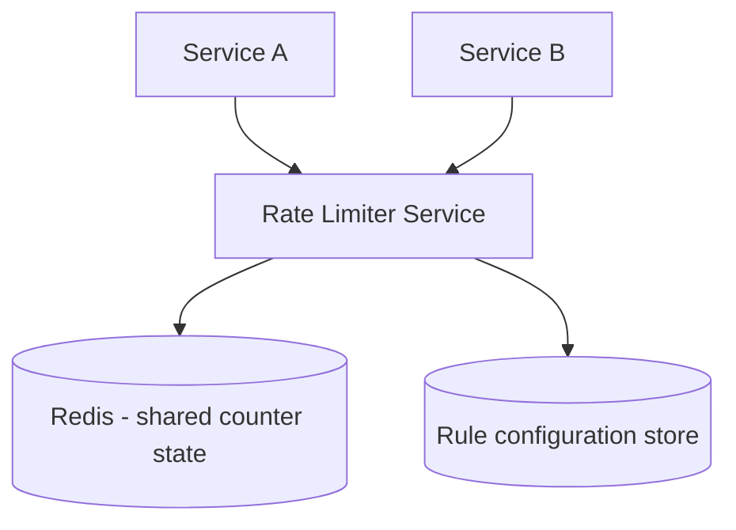

## Introduction

Chapter 26 covered rate limiting *algorithms*. This case study designs rate limiting as a **standalone, shared service** — a distinct system design problem: how do you build something many other services can call to make a fast, consistent rate-limit decision, without becoming a bottleneck or single point of failure itself?

## Step 1: Clarify Requirements

**Functional:**
- Given a client identifier (API key, user ID) and a rule (e.g., "100 requests/minute"), decide whether to allow or reject each incoming request.
- Support different limits for different clients/tiers (Chapter 26's multi-tenant discussion).

**Non-functional:**
- Very low latency (this sits on the critical path of every API call it protects — adding meaningful latency here defeats the purpose).
- Must work correctly across many horizontally-scaled instances of the services it protects (Chapter 26's distributed rate limiting problem).
- High availability — if the rate limiter is down, does it fail open (allow traffic) or fail closed (block traffic)? This is a genuine, business-driven trade-off to clarify explicitly, not assume.

## Step 2: Capacity Estimation

If this rate limiter protects an API handling 50,000 QPS across all clients, the rate limiter itself must handle at least that same 50,000+ QPS of check requests — meaning the rate limiter's own performance and availability requirements are at least as stringent as the system it protects, an important, easy-to-underestimate detail.

## Step 3: Define the API

```
POST /rate-limit/check
  Body: { "clientId": "user_123", "resource": "api_search" }
  Response: { "allowed": true, "remaining": 42, "resetAt": "..." }
```

## Step 4: High-Level Architecture



Following Chapter 26's core lesson: rate-limit state (counters, token buckets) must live in a **shared store** (Redis is the standard choice, given its speed) rather than in each rate-limiter instance's local memory — otherwise, horizontally-scaled rate limiter instances would each independently allow the full limit, multiplying the effective limit by instance count.

## Step 5: Deep Dive — Atomic Check-and-Increment at Scale

The core hard problem: performing the "check current count, and increment if allowed" operation **atomically**, to prevent race conditions between concurrent requests for the same client — directly the concern flagged in Chapter 26.

```java
// A Redis Lua script executes atomically - no race condition between
// the check and the increment, even under massive concurrent load.
String luaScript =
    "local current = redis.call('GET', KEYS[1]) " +
    "if current == false then " +
    "    redis.call('SET', KEYS[1], 1, 'EX', ARGV[1]) " +
    "    return 1 " +
    "elseif tonumber(current) < tonumber(ARGV[2]) then " +
    "    return redis.call('INCR', KEYS[1]) " +
    "else " +
    "    return -1 " + // over limit
    "end";

public boolean isAllowed(String clientId, int limit, int windowSeconds) {
    String key = "ratelimit:" + clientId;
    Long result = (Long) jedis.eval(luaScript, 
        Collections.singletonList(key),
        Arrays.asList(String.valueOf(windowSeconds), String.valueOf(limit)));
    return result != -1;
}
```

**Why Lua scripting specifically**: Redis executes a Lua script as a single, atomic, indivisible operation — no other client's commands can interleave in the middle of it, eliminating the check-then-increment race condition entirely, without needing a separate, slower distributed lock (Chapter 27) for what is fundamentally a very fast, simple operation.

## Step 6: Bottlenecks and Trade-offs

- **Redis as a single point of failure/bottleneck**: Mitigated via Redis Cluster (sharding rate-limit keys across multiple Redis nodes, directly using consistent hashing, Chapter 22) and replication (Chapter 15) for availability.
- **Fail open vs fail closed**: If Redis becomes unreachable, failing *open* (allow all traffic) prioritizes availability of the protected service at the cost of temporarily losing rate-limit protection; failing *closed* (reject all traffic) prioritizes protection at the cost of a full outage of the protected service during a Redis failure. Most systems choose fail-open specifically because a rate limiter's failure shouldn't cascade into a full outage of the actual business-critical service it's protecting (Chapter 36's cascading-failure concerns) — but this is a genuine business decision to make explicit, not a universal default.
- **Cross-region rate limiting**: If clients hit rate limiters in multiple regions, keeping a global count consistent requires cross-region coordination — most systems accept eventual consistency here (Chapter 19), tolerating some slight overshoot of the "true" global limit in exchange for avoiding expensive, latency-costly cross-region synchronous coordination.

## Step 7: Failure Scenarios and Scaling Evolution

- **Redis node failure**: Handled by Redis Cluster's own replication/failover (Chapter 15); brief unavailability during failover is mitigated by the fail-open decision above.
- **Scaling to protect many different services with different rule sets**: The rule-configuration store (Step 4) should be cached locally in each rate-limiter instance with a short refresh interval, avoiding a lookup to the configuration store on every single request — directly applying Chapter 9's caching principles to the rate limiter's own internal architecture.

## Summary

- A standalone rate limiter service must be at least as available and low-latency as the services it protects, since it sits directly on their critical path.
- Shared, atomic state (via Redis and Lua scripting) solves the race-condition problem of distributed rate limiting without needing a separate, heavier distributed lock.
- Fail-open vs fail-closed is a genuine, business-driven trade-off between availability and protection that should be made explicit, not assumed.
- Cross-region rate limiting typically accepts eventual consistency, trading perfect global accuracy for avoiding expensive synchronous cross-region coordination.

---

## Interview Questions

### 1. Why must rate-limit state be stored in a shared store like Redis rather than in each rate-limiter instance's local memory, when the rate limiter itself is horizontally scaled?
**Answer:** If each horizontally-scaled rate-limiter instance maintained its own independent, local in-memory counter for a given client, a load balancer distributing requests across multiple instances would cause that client's requests to be counted separately and independently by whichever instance happens to handle each one — the client would effectively receive the full configured limit *per instance*, multiplying their true effective rate limit by however many rate-limiter instances exist, completely undermining the intended, system-wide limit. A shared store ensures all instances check and update the same, single, authoritative count for a given client, correctly enforcing the true intended limit regardless of which specific instance handles any given request.

**Follow-up:** *Why is Redis specifically favored for this shared state, rather than a traditional relational database?* — Redis's in-memory architecture provides the very low latency needed for a check-and-increment operation that sits on the critical path of every single protected API call — a relational database's typically higher query latency (even for a simple lookup/update) would add unacceptable overhead to every single request passing through the rate limiter, directly undermining the low-latency requirement established in Step 1; Redis's native support for atomic operations (via Lua scripting or built-in atomic commands) also directly addresses the race-condition concern this case study's deep dive focuses on.

### 2. Explain why using a Redis Lua script for the check-and-increment operation avoids the need for a separate distributed lock (Chapter 27).
**Answer:** Redis guarantees that a Lua script executes as a single, atomic, indivisible unit — no other client's commands (including another concurrent request's own check-and-increment attempt for the same client) can interleave or execute in the middle of that script's execution. This directly eliminates the race condition a naive, multi-step "GET current count, then check, then SET/INCR" sequence would otherwise risk (two concurrent requests both reading the same "under limit" count before either has incremented it, both incorrectly proceeding even if their combined effect would exceed the limit) — without needing a separate, heavier-weight distributed lock (Chapter 27) to protect this critical section, since Redis's own atomic script execution already provides the necessary mutual exclusion for this specific, fast, simple operation natively.

**Follow-up:** *Why would using a full distributed lock (like the Redis-based lock from Chapter 27) be a worse choice for this specific use case, even though it would also technically prevent the race condition?* — A distributed lock introduces meaningfully more overhead (acquiring the lock, performing the operation, releasing the lock — multiple round trips or at least more processing) compared to a single, already-atomic Lua script execution — for an operation that needs to happen on essentially every single API request across a high-traffic system, this added overhead would be a significant, unnecessary latency and throughput cost, especially when Redis's native atomic scripting already fully solves the correctness problem without needing this heavier mechanism at all.

### 3. Why is the "fail open vs. fail closed" decision described as a genuine business trade-off rather than an obvious, universal default?
**Answer:** Failing open (allowing all traffic through when the rate limiter itself becomes unavailable) prioritizes the availability of the actual, underlying business-critical service being protected — accepting a temporary loss of rate-limit/abuse protection as the lesser cost. Failing closed (rejecting all traffic when the rate limiter is unavailable) prioritizes strict protection/security — accepting a complete outage of the protected service as the cost of never allowing potentially unprotected, unlimited traffic through. Which of these costs is actually worse depends entirely on the specific business context: for a typical consumer-facing API, a temporary loss of rate-limiting is usually far less damaging than a complete service outage, favoring fail-open; but for a system where unrestricted traffic during a rate-limiter outage could cause severe, immediate harm (e.g., protecting a fragile, expensive downstream resource that could be completely overwhelmed without any rate limiting at all), fail-closed might be the more appropriate, deliberately chosen default — this is precisely why the decision should be explicitly surfaced and discussed rather than assumed.

**Follow-up:** *How might a system implement a middle-ground approach between pure fail-open and pure fail-closed?* — A degraded, conservative fallback mode — e.g., if the shared Redis store is unreachable, falling back to a simpler, more conservative, locally-enforced rate limit (perhaps stricter/lower than the normal limit, and accepting the per-instance-multiplication imprecision this reintroduces) rather than either allowing fully unlimited traffic or blocking all traffic entirely — this provides some continued, if imperfect, protection during a Redis outage, balancing between the two extremes rather than committing entirely to either one.

### 4. Why does this case study emphasize that "the rate limiter's own availability/latency requirements are at least as stringent as the system it protects"?
**Answer:** Since every single request to the protected service must first pass through (or at least be checked by) the rate limiter, the rate limiter sits directly on the protected service's critical path — any latency the rate limiter itself adds is directly added to every single protected request's overall latency, and any unavailability of the rate limiter directly threatens the availability of the protected service (depending on the fail-open/fail-closed decision) — this means the rate limiter cannot be treated as a lower-priority, "best effort" component relative to the service it protects; it must be engineered with comparable or even greater rigor around latency and availability, since its own performance characteristics are now an inseparable part of the protected service's overall performance and availability profile.

**Follow-up:** *Why might this specific insight be easy for a candidate to overlook if they don't explicitly work through capacity estimation (Step 2)?* — Without explicitly estimating the actual QPS the rate limiter itself must handle (matching or exceeding the full traffic volume of every service it protects, potentially aggregated across many different protected services simultaneously), a candidate might implicitly think of the rate limiter as a small, auxiliary, lower-stakes component — only by explicitly working through the numbers does it become clear that the rate limiter must be engineered to handle traffic at the same massive scale as the (potentially many) services it protects combined, directly illustrating why Chapter 47's capacity estimation step has genuine, concrete architectural consequences beyond just informing the database/caching decisions covered in earlier case studies.

### 5. Why might cross-region rate limiting reasonably accept eventual consistency rather than strict, perfectly-accurate global enforcement?
**Answer:** Enforcing a perfectly accurate, strongly consistent global count across geographically distributed regions would require synchronous cross-region coordination for every single rate-limit check — given the physical speed-of-light latency floor discussed in Chapter 2 (potentially 100+ milliseconds for cross-region round trips), this would add unacceptable latency to every single API call across the entire system, directly undermining the rate limiter's core low-latency requirement; accepting eventual consistency instead (e.g., each region maintaining its own local count, periodically/asynchronously reconciled with other regions) allows each region to make fast, low-latency local rate-limit decisions, at the cost of the *true* global count potentially being slightly overshot in aggregate across regions during the brief windows before reconciliation — for most practical rate-limiting use cases (preventing gross abuse, not enforcing an exact, hard mathematical ceiling), this small amount of potential overshoot is an acceptable, reasonable trade-off for avoiding the much larger latency cost strict global consistency would impose on every single request.

**Follow-up:** *In what specific scenario might a business decide this eventual-consistency-based overshoot risk is NOT acceptable, requiring stricter cross-region coordination despite the latency cost?* — If the rate limit is directly tied to a hard, expensive, and strictly limited resource — for example, enforcing a strict cap on calls to an extremely expensive third-party API billed per-call, where even a modest overshoot translates directly into significant, unplanned financial cost — the business might determine that the latency cost of stricter cross-region coordination is worth paying specifically for this particular, cost-sensitive rate limit, even while using eventual consistency (accepting the overshoot risk) for other, less financially-sensitive rate limits within the same overall system — again illustrating that the right consistency trade-off should be evaluated per-specific-use-case rather than applied uniformly across every rate limit a system enforces.
