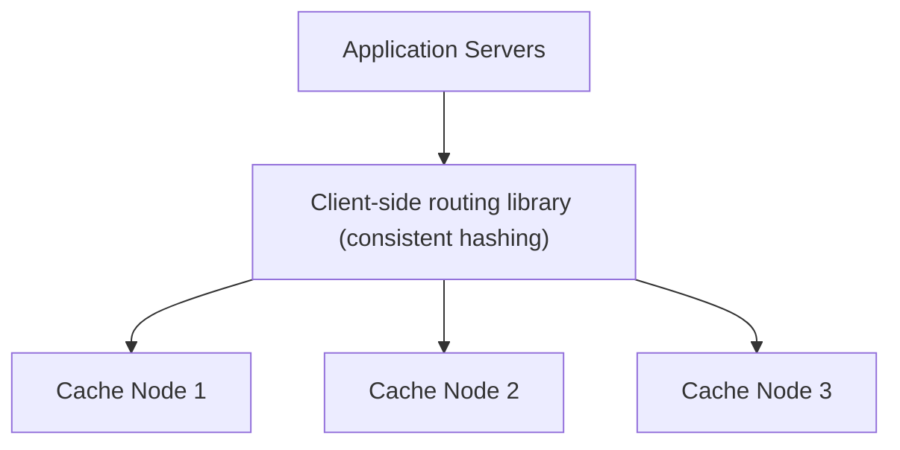

## Introduction

Chapters 9-10 covered how to *use* a cache and how eviction policies work internally on a single node. This case study designs the distributed cache system itself — the infrastructure that many application services (like the ones designed in earlier case studies) actually rely on.

## Step 1: Clarify Requirements

**Functional:**
- `GET(key)`, `SET(key, value, ttl)`, `DELETE(key)` — a standard key-value interface.
- Support for horizontal scaling across many cache nodes as data volume/traffic grows.

**Non-functional:**
- Extremely low latency (sub-millisecond) — this is the entire point of a cache.
- High availability (a cache outage shouldn't take down the applications relying on it — connects to Chapter 9's cache-aside fallback pattern).
- Eventual consistency is acceptable (Chapter 19) — a cache is explicitly not the system of record.

## Step 2: Capacity Estimation

Assume 1 billion cached key-value pairs, average size 1KB each → 1TB of total cached data. At a typical single cache node's memory capacity (e.g., 64GB usable), this requires roughly 16+ nodes purely for capacity, before even considering throughput requirements.

## Step 3: Define the API

```
GET /cache/{key}      -> value or 404 (cache miss)
PUT /cache/{key}      { value, ttlSeconds } -> 200
DELETE /cache/{key}   -> 200
```

(In practice, a binary protocol like Redis's RESP or Memcached's protocol is used for performance, not HTTP — but the logical interface is this simple.)

## Step 4: High-Level Architecture



Following Chapter 8's discovery-pattern discussion: this design uses **client-side discovery** (Chapter 35) — the client library itself knows the set of cache nodes and computes which node owns a given key, calling it directly. This avoids adding an extra network hop (a proxy/router) on the hottest, most latency-sensitive path in the entire system.

## Step 5: Deep Dive — Consistent Hashing for Node Assignment

This is a direct, concrete application of Chapter 22. Given N cache nodes, naive `hash(key) % N` would require reshuffling nearly all cached data whenever a node is added or removed — precisely the problem consistent hashing solves.

```java
// Reusing the ConsistentHashRing from Chapter 22 directly
ConsistentHashRing<CacheNode> ring = new ConsistentHashRing<>(150); // virtual nodes
ring.addNode(node1);
ring.addNode(node2);
ring.addNode(node3);

CacheNode targetNode = ring.getNode("user:42:session");
// Client library calls targetNode directly for this key
```

**Why this specific case study makes consistent hashing's value obvious**: When a cache node is added or removed (scaling up, or a node failure), only the slice of keys between that node and its neighbor need to move — everything else in the distributed cache remains correctly located exactly where it was, avoiding the "cold cache stampede" (Chapter 22's discussion) that naive modulo-based assignment would otherwise cause across the *entire* cache simultaneously.

### Replication for Availability

Each key is stored not just on its primary assigned node, but also replicated to the next N-1 nodes clockwise on the ring (directly from Chapter 22's replication discussion) — if a node fails, its replicas on neighboring nodes continue serving that data, at the cost of some staleness risk if writes were in-flight during the failure (an acceptable trade-off given the cache's already-eventual-consistency nature).

## Step 6: Bottlenecks and Trade-offs

- **Hot keys**: A single extremely popular key (Chapter 16's celebrity problem, applied here) can overwhelm the one specific node it's assigned to, even with otherwise-good overall load distribution. Mitigation: detect hot keys and replicate them more broadly (beyond the standard replication factor) across additional nodes specifically for load distribution, or maintain a small, local, in-process cache of the very hottest keys directly within each application server, avoiding the network hop to the distributed cache entirely for these specific, known-hot items.
- **Cache stampede on a popular key's expiration** (Chapter 9): Mitigated via probabilistic early refresh or a brief lock during repopulation.
- **Memory eviction policy**: Each individual node needs an eviction policy (Chapter 10's LRU discussion) for when it approaches its own memory capacity — independent of the cluster-wide consistent-hashing assignment, which determines *which* node a key lives on, not what happens when that specific node's own memory fills up.

## Step 7: Failure Scenarios and Scaling Evolution

- **Node failure**: Detected via heartbeat/gossip (Chapter 24 — real systems like Redis Cluster and Memcached clusters commonly use gossip protocols for exactly this cluster-membership purpose), with the failed node's keys served from its replicas until it recovers or is replaced.
- **Adding capacity**: New nodes are added to the consistent hash ring; only the affected slice of keys needs to be migrated, and the client-side routing library needs to learn about the topology change — typically via the same gossip-based membership propagation.
- **Scaling further**: At extreme scale, this design could evolve toward a tiered caching architecture — a small, extremely fast local (in-process) cache per application server for the hottest keys, backed by this larger distributed cache tier for everything else, itself backed by the actual database — directly mirroring the multi-layer caching hierarchy introduced in Chapter 9.

## Summary

- A distributed cache's core hard problem is node assignment and rebalancing — consistent hashing (Chapter 22) directly solves this, minimizing data movement when nodes are added or removed.
- Client-side discovery avoids adding a network hop on the cache's already latency-critical path.
- Replication across neighboring ring nodes provides availability, accepting the cache's already-eventual-consistency nature as an acceptable trade-off during failover.
- Hot keys require specific additional mitigation (broader replication, or local in-process caching) beyond what even good, evenly-distributed consistent hashing provides on its own.

---

## Interview Questions

### 1. Why does this design favor client-side discovery over server-side discovery (Chapter 35) for routing requests to the correct cache node?
**Answer:** A distributed cache's entire value proposition is extremely low, sub-millisecond latency — adding a server-side routing layer (a proxy/load balancer sitting between the client and the actual cache nodes) would introduce an additional network hop on every single cache request, directly working against the cache's core latency requirement; client-side discovery instead has the calling application's own client library directly compute (via consistent hashing) which specific cache node owns a given key and call that node directly, avoiding this extra hop entirely — for a component whose whole purpose is minimizing latency, this trade-off (accepting the added complexity of discovery-aware client libraries, as discussed in Chapter 35) clearly favors client-side discovery's lower-latency direct-call model over server-side discovery's extra-hop-but-simpler-client trade-off.

**Follow-up:** *What operational cost does this client-side discovery choice impose, connecting back to Chapter 35's broader trade-off discussion?* — Every application/service that uses this distributed cache needs to incorporate a client library capable of correctly performing the consistent-hashing lookup and staying up to date with the current cluster topology — in a genuinely polyglot environment (Chapter 34) with services written in many different languages, this means maintaining (or sourcing) a correctly-implemented client library for each language in use, a real, ongoing engineering investment that a server-side discovery approach would have avoided by centralizing this logic in one place instead.

### 2. Why is replicating a key to "the next N-1 nodes clockwise on the ring" a natural, elegant extension of the base consistent hashing mechanism, rather than requiring an entirely separate replication scheme?
**Answer:** Consistent hashing already establishes a well-defined, deterministic notion of "which node owns this key" (the first node encountered clockwise from the key's position) and, by extension, a well-defined notion of "the next nodes after that one" (simply continuing clockwise) — extending this same mechanism to also determine replica placement (the primary node, plus the next N-1 nodes clockwise) requires no additional coordination structure or separate metadata scheme at all; every node in the cluster can independently, deterministically compute both a key's primary location and its replica locations using the exact same ring structure and hash function already in place for basic key assignment, making this a natural, low-overhead extension rather than a fundamentally separate replication mechanism needing its own independent design and coordination.

**Follow-up:** *What subtlety, discussed in Chapter 22, must be handled correctly when using virtual nodes together with this "next N clockwise" replication scheme?* — Since a single physical node typically owns many virtual node positions scattered around the ring, naively selecting "the next N virtual node positions clockwise" for replica placement could result in multiple selected replicas actually residing on the *same* physical node (if that physical node happens to own several nearby virtual positions) — a correct implementation must specifically skip over virtual nodes belonging to a physical node already selected as a replica for that key, ensuring the N replicas are placed on N genuinely distinct physical nodes, not just N distinct virtual ring positions that might collapse onto fewer actual machines.

### 3. Explain the "hot key" problem in this distributed cache design, and why it represents a limitation of consistent hashing rather than a flaw in its implementation.
**Answer:** Consistent hashing is specifically designed to achieve even distribution of the *keyspace* across nodes in the general, statistical case — but it makes no guarantee about the distribution of actual *traffic/load* if that traffic is itself highly skewed toward a small number of specific keys (e.g., one specific cache key representing an extremely popular piece of content that a disproportionate fraction of all requests happen to target) — since consistent hashing deterministically assigns each specific key to one specific node (or a small, fixed set of replica nodes), an extremely popular individual key will always route to that same specific node(s), regardless of how well-distributed the overall keyspace is — this isn't a flaw in the hashing implementation itself (it's correctly, evenly distributing the *keyspace*), but rather an inherent limitation of any keyspace-partitioning scheme when actual real-world traffic is itself highly non-uniform across that keyspace.

**Follow-up:** *Why might simply increasing the replication factor for ALL keys (not just detected hot ones) be a poor general solution to this problem?* — Increasing the replication factor for every key uniformly would proportionally increase the total storage and memory overhead across the entire cluster (since every single key, not just the rare hot ones, would now be stored on more nodes), providing little to no benefit for the vast majority of keys that were never actually experiencing disproportionate load in the first place — this is a clear instance of applying a blanket, uniform solution to a problem that's actually concentrated in a small, specific subset of keys, when a more targeted approach (detecting and specifically addressing only the actual hot keys, as this chapter proposes) achieves the needed load-distribution benefit for the keys that actually need it, without the unnecessary, uniform storage/memory cost of over-replicating the vast majority of keys that don't have this problem at all.

### 4. Why does a cache node still need its own local eviction policy (Chapter 10) even though the cluster-wide consistent hashing already determines which node each key lives on?
**Answer:** Consistent hashing solves a *cluster-level* problem — determining which specific node in the overall cluster is responsible for a given key — but it says nothing about what happens *within* a single node once that node's own local memory capacity is reached; each individual node still needs its own local mechanism for deciding what to evict when its own memory fills up, exactly the LRU/LFU eviction-policy problem covered in Chapter 10 — these are genuinely separate, complementary concerns operating at different levels: consistent hashing handles the "which node" question at the cluster level, while each node's local eviction policy handles the "which specific keys to keep in memory, given this node's own finite capacity" question independently and locally, using the exact same LRU (or other) mechanisms that would apply to any single-node cache, entirely independent of the broader distributed cluster architecture surrounding it.

**Follow-up:** *If a specific node's local LRU eviction removes a key that's still being actively requested by clients, what happens on the next request for that key, given this system's cache-aside-style usage pattern (Chapter 9)?* — The next request for that now-evicted key would experience a cache miss on the distributed cache itself, causing the calling application (using the cache-aside pattern) to fall through to the actual underlying database/source of truth to retrieve the value, and then re-populate the cache with it — this is exactly the expected, correct cache-aside behavior discussed in Chapter 9; the distributed cache's job is to serve as a best-effort, evictable performance optimization, not a guaranteed, always-present store, so a node's legitimate local eviction simply results in the normal, expected cache-miss-and-repopulate cycle rather than representing any kind of failure or data-loss event.

### 5. Why might a production system layer a small, local, in-process cache on individual application servers on top of this larger distributed cache tier (as mentioned in Step 6), rather than relying solely on the distributed cache?
**Answer:** Even a well-designed, low-latency distributed cache still requires a network round trip (however fast, likely sub-millisecond within the same data center, per Chapter 40's latency reference table) between the application server and the cache node — a small, local, in-process cache (living directly within the application server's own memory) can serve the *very hottest*, most frequently-accessed subset of keys with effectively zero network latency at all (a direct in-memory lookup within the same process), providing an even faster tier specifically for this narrow, extremely hot subset of data, layered on top of the broader distributed cache tier that handles the much larger overall keyspace that doesn't justify this most-aggressive, most-local caching treatment.

**Follow-up:** *What's the specific trade-off/cost of this local, in-process caching tier compared to relying solely on the shared distributed cache?* — A local, in-process cache is inherently inconsistent across different application server instances (each instance maintains its own separate, independent local cache, potentially holding different, differently-stale versions of the same key) — unlike the shared distributed cache tier, which provides a single, consistent (if eventually-consistent) view across all application instances; this local tier is therefore best suited specifically to data that can tolerate a bit more staleness or where the specific hot keys are read-mostly and rarely updated, and this added architectural complexity (an additional caching layer, with its own invalidation/staleness considerations) is only justified for the specific, genuinely very-hot subset of keys where the additional latency savings clearly outweighs this added complexity and consistency trade-off — not applied as a blanket strategy across the entire keyspace.
