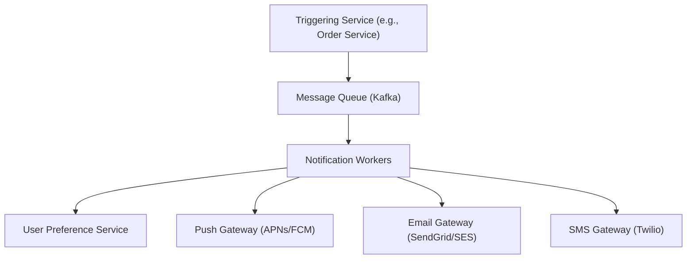
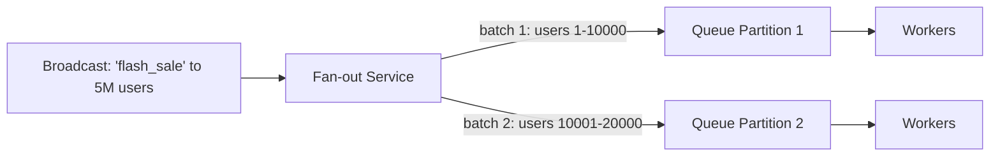

## Introduction

A notification system (push notifications, email, SMS) is a strong case study for Part 5's messaging concepts — it's fundamentally an asynchronous, fan-out problem, with the added real-world complexity of integrating multiple unreliable third-party providers.

## Step 1: Clarify Requirements

**Functional:**
- Send notifications via multiple channels: push (mobile), email, SMS.
- Support both individual, targeted notifications ("your order shipped") and bulk/broadcast notifications ("flash sale starting now," sent to millions of users).
- Users can configure channel preferences and opt out.

**Non-functional:**
- High throughput for bulk notifications (potentially millions of recipients for a single logical event).
- At-least-once delivery is acceptable (Chapter 30) — losing a notification is bad, but a rare duplicate is a much smaller problem than a rare loss.
- Asynchronous — the triggering service (e.g., Order Service) should never block waiting for a notification to actually be delivered.

## Step 2: Capacity Estimation

Assume 10 million daily active users, each receiving an average of 5 notifications/day across all channels → 50 million notifications/day → ~580 notifications/second average, with the explicit understanding that bulk/broadcast events create massive, short-lived spikes far above this average (e.g., a single broadcast to 5 million users needs to be processed in a burst, not spread evenly across the day) — this spike behavior, not the average, is what actually drives the architecture.

## Step 3: Define the API

```
POST /notifications/send
  Body: { "userId": "user_123", "template": "order_shipped", "data": {...} }

POST /notifications/broadcast
  Body: { "segment": "all_us_users", "template": "flash_sale", "data": {...} }
```

## Step 4: High-Level Architecture



- **Message queue as the entry point** (Chapter 30): decouples the triggering service from actual delivery entirely — the Order Service publishes a "send notification" event and immediately moves on, never blocking on the (potentially slow, unreliable) actual delivery process.
- **Notification workers**: consume from the queue, look up the user's channel preferences, and dispatch to the appropriate third-party gateway(s).
- **Third-party gateway integration**: push notifications go through platform-specific services (Apple's APNs, Google's FCM), email through a provider (SendGrid, AWS SES), SMS through a provider (Twilio) — the notification system is fundamentally an orchestration layer over these external, independently-reliable services.

## Step 5: Deep Dive — Handling Massive Fan-Out for Broadcast Notifications

Sending to 5 million users for a single broadcast event is the system's hardest problem — this is fundamentally a fan-out problem, directly connecting to the pub-sub concepts of Chapter 31.



Rather than a single service attempting to individually process 5 million notifications sequentially, a **fan-out service** splits the broadcast into many smaller batches, publishing each batch to a partitioned queue (Kafka's partitioning, Chapter 30) — allowing many parallel worker instances to process different batches simultaneously, dramatically reducing the total wall-clock time needed to complete the broadcast.

**Rate limiting toward third-party providers** (Chapter 26, applied in the outbound direction): Third-party gateways (SendGrid, Twilio, APNs) impose their own rate limits — the notification workers must respect these limits (using the same token-bucket/leaky-bucket algorithms from Chapter 26, but protecting an *outbound* dependency rather than an inbound API), smoothing the burst of 5 million notifications into a rate the third-party provider can actually sustain, rather than overwhelming it and having most requests rejected.

```java
// Applying Chapter 26's token bucket, but for outbound rate limiting to a third party
public class ThirdPartyRateLimitedSender {
    private final TokenBucketRateLimiter emailProviderLimiter;

    public void sendEmail(EmailNotification notification) {
        while (!emailProviderLimiter.tryConsume()) {
            // Wait/backoff (Chapter 36's retry-with-backoff) rather than
            // exceeding the third party's rate limit and getting throttled/banned
            sleep(BACKOFF_INTERVAL);
        }
        emailGateway.send(notification);
    }
}
```

## Step 6: Bottlenecks and Trade-offs

- **Idempotency (Chapter 28)**: If a worker crashes after successfully sending a notification but before acknowledging the message, at-least-once delivery (Chapter 30) means the same notification could be sent again on retry — for most notification types, an occasional duplicate is an acceptable trade-off (much better than a lost notification), but for a small number of sensitive notification types (e.g., an SMS-based one-time-password), duplicate sends could be genuinely problematic and should use an idempotency key.
- **Third-party gateway failures**: Circuit breakers (Chapter 36) around each gateway prevent one provider's outage from blocking the entire queue's processing — messages destined for a failing provider can be routed to a dead-letter queue (Chapter 30) for later retry, rather than blocking notifications to *other* providers behind them.
- **User preference lookups at scale**: Caching (Chapter 9) user preferences avoids a database round trip for every single one of millions of notifications during a broadcast.

## Step 7: Failure Scenarios and Scaling Evolution

- **Queue backlog during a massive broadcast**: Auto-scaling worker instances (Chapter 7) in response to queue depth directly addresses this — more workers spin up as the backlog grows, scaling back down once the broadcast completes.
- **A specific channel/provider being down**: Circuit breaker trips for that provider specifically; notifications for other channels continue unaffected (directly the bulkhead isolation principle from Chapter 36).
- **Scaling to support new channels** (e.g., in-app notifications, WhatsApp): The architecture's pluggable gateway pattern (each channel behind its own worker/gateway integration) accommodates this without requiring changes to the core queue/fan-out infrastructure.

## Summary

- A notification system is fundamentally an asynchronous fan-out and third-party-orchestration problem — a message queue decouples triggering services from the actual, potentially slow and unreliable delivery process.
- Massive broadcast events require explicit fan-out/batching and partitioned parallel processing to complete within a reasonable time window.
- Outbound rate limiting toward third-party providers (a less commonly discussed but equally important application of Chapter 26's algorithms) prevents overwhelming and being throttled/banned by external gateways.
- Circuit breakers per third-party provider ensure one channel's outage doesn't block notifications on other, healthy channels.

---

## Interview Questions

### 1. Why is a message queue specifically well-suited as the entry point for this notification system, rather than the triggering service (e.g., Order Service) calling the notification-sending logic directly and synchronously?
**Answer:** Actual notification delivery involves calling external, third-party services (APNs, SendGrid, Twilio) whose latency and reliability the triggering service has no control over — if the Order Service synchronously waited for a notification to actually be delivered before completing its own request, a slow or temporarily-unavailable third-party provider would directly degrade the Order Service's own response time and reliability, for a concern (notification delivery) that's not actually essential to completing the core order-placement operation itself; publishing to a message queue (Chapter 30) instead lets the Order Service immediately continue after simply publishing a "send notification" event, fully decoupling its own critical path from the notification system's potentially slower, less reliable, third-party-dependent delivery process.

**Follow-up:** *Why is "at-least-once delivery" specifically deemed acceptable for this system, when Chapter 30 discussed several different delivery-guarantee options?* — For most notification types, the cost of an occasional duplicate notification (a minor, if mildly annoying, user experience issue — receiving the same "order shipped" push notification twice) is significantly lower than the cost of a lost notification (a user never learning their order shipped at all) — this asymmetric cost profile directly justifies choosing at-least-once delivery (which guarantees no message is ever silently lost, accepting the possibility of occasional duplicates) over at-most-once delivery (which risks loss to avoid duplicates) as the more appropriate guarantee for this specific use case's actual cost trade-offs.

### 2. Explain why a dedicated "fan-out service" is needed for broadcast notifications, rather than simply publishing a single message representing "notify these 5 million users" to the queue.
**Answer:** A single queue message representing an entire 5-million-recipient broadcast would need to be processed by whichever single worker instance happens to consume it — that one worker would then need to sequentially iterate through and process all 5 million individual notifications itself, completely failing to take advantage of the horizontal parallelism that multiple worker instances could otherwise provide; a fan-out service instead explicitly splits this single broadcast intent into many smaller, independently-processable batch messages (each representing, say, 10,000 recipients), publishing each batch as its own separate message to a partitioned queue — this allows many different worker instances to each pick up and process a different batch *in parallel*, dramatically reducing the total wall-clock time needed to complete the full broadcast compared to any single worker processing the entire 5 million recipients sequentially and alone.

**Follow-up:** *Why does using Kafka's partitioning (Chapter 30) specifically, rather than a simpler queue, matter for this fan-out approach's parallelism?* — Kafka's consumer-group model allows multiple consumer instances to each independently and simultaneously process different partitions of the same topic in parallel — by publishing the various batch messages across multiple partitions (rather than all into a single, serially-consumed queue), the fan-out service ensures that many different worker instances can genuinely process different batches concurrently, maximizing the parallelism benefit; if all batch messages were instead published to a single, non-partitioned queue, they would still ultimately need to be consumed and processed by workers pulling from that single queue in a way that may not achieve the same degree of true, structurally-guaranteed parallel throughput that partitioning specifically provides.

### 3. Why does outbound rate limiting toward third-party providers (like SendGrid or Twilio) matter, even though Chapter 26 primarily discussed rate limiting inbound traffic to protect your own system?
**Answer:** Third-party providers impose their own rate limits on how many requests your system can send to them within a given time period — if your notification workers attempt to send requests to these providers faster than their imposed limits allow, the provider will likely reject/throttle the excess requests (or, in more severe or repeated cases, could even temporarily or permanently ban your account for exceeding their terms of service) — applying the exact same rate-limiting algorithms discussed in Chapter 26 (token bucket, leaky bucket), but specifically to smooth and control your own *outbound* request rate to these external providers, ensures you stay within their imposed limits, avoiding both wasted, rejected requests and the more serious risk of triggering punitive account restrictions from a third party your system depends on for critical delivery functionality.

**Follow-up:** *Why might a leaky-bucket-style outbound rate limiter (Chapter 26) be a particularly good fit for this specific scenario, compared to a token-bucket approach?* — Many third-party providers specifically enforce a strict, constant maximum request rate (e.g., "no more than 100 requests per second, with no tolerance for bursts even briefly above this") — leaky bucket's defining property of smoothing bursty input into a strictly constant output rate (as discussed in Chapter 26) directly matches this kind of strict, burst-intolerant third-party rate-limit requirement, whereas token bucket's willingness to allow controlled bursts (up to its capacity) could risk occasionally exceeding a third party's stricter, burst-intolerant limit if not very carefully tuned — making leaky bucket often the more naturally appropriate algorithm choice specifically for respecting a known, strict external rate limit, compared to protecting your own system's more flexible, burst-tolerant internal capacity.

### 4. Why does this case study recommend circuit breakers (Chapter 36) specifically scoped per third-party provider, rather than a single circuit breaker covering the entire notification-sending process?
**Answer:** Different notification channels depend on entirely independent, unrelated third-party providers (APNs for push, SendGrid for email, Twilio for SMS) — a failure or degradation specific to just one of these providers (e.g., SendGrid experiencing an outage) has no actual bearing on the health or availability of the other, entirely independent providers (Twilio and APNs might be functioning perfectly normally at the same time); a single, undifferentiated circuit breaker covering the entire notification-sending process as one unit would incorrectly trip and block *all* notification sending (including push and SMS, which are entirely unaffected by SendGrid's specific issue) the moment any single provider starts failing, unnecessarily and incorrectly extending the blast radius of one provider's isolated failure to channels that have no actual dependency on that failing provider at all — scoping circuit breakers individually per provider ensures that a failure in one specific channel's dependency only affects that specific channel, directly applying the bulkhead isolation principle (Chapter 36) at the level of distinct external dependencies.

**Follow-up:** *What fallback behavior might be appropriate when a specific channel's circuit breaker trips, given this system's multi-channel design?* — Depending on the user's configured channel preferences and the specific notification's importance, one reasonable fallback is attempting delivery via an alternate channel the user has also enabled (e.g., if push notification delivery via APNs is currently circuit-broken, falling back to email for that specific notification, if the user has both channels enabled and the notification's content is suitable for either) — though this requires the notification system to have some understanding of channel substitutability/priority for a given notification type, rather than treating every channel as entirely independent and non-substitutable; simpler alternative fallback: queue the specific channel's failed notifications in a dead-letter-style holding queue (Chapter 30) for automatic retry once that specific channel's circuit breaker eventually closes again.

### 5. Why might a candidate's design that treats "sending a notification" as a single, atomic operation (rather than separately handling per-channel delivery) struggle to correctly implement this system's stated requirement of "users can configure channel preferences"?
**Answer:** If notification sending is treated as one single, monolithic operation, it becomes awkward to cleanly express and implement per-user, per-channel logic (e.g., "this specific user wants push and email, but has explicitly opted out of SMS entirely," or "this specific user wants SMS only for critical account-security notifications, but email for general marketing") — a well-decomposed design that explicitly separates "does this event warrant a notification at all" from "for this specific user, which specific channels should this notification actually go through, based on their individual preferences" (as this case study's architecture does, via the explicit User Preference Service lookup in Step 4) naturally and cleanly accommodates this kind of per-user, per-channel configurability, since each channel's actual delivery becomes its own independent decision and code path, rather than being entangled within a single, monolithic "send the notification" operation that would need increasingly complex internal conditional logic to correctly express this same per-user, per-channel nuance.

**Follow-up:** *How would you extend this architecture to support a user who wants to receive a given notification via email, but ONLY if they haven't already interacted with the corresponding push notification within 10 minutes (a common "smart" notification de-duplication feature in real products)?* — This would require introducing additional stateful tracking (e.g., in a fast, TTL-based store like Redis, directly connecting to Chapter 9's caching infrastructure) recording whether/when a user has interacted with a specific notification's push variant, and a scheduled/delayed check (potentially using a delayed message queue feature, or a scheduled job, Chapter 61's job scheduler case study) that, after the 10-minute window, checks this interaction-tracking state before deciding whether to actually proceed with sending the email variant — this illustrates how a seemingly simple notification system can accumulate genuinely sophisticated, stateful business logic requirements over time, reinforcing why a clean, decomposed architecture (separating event-triggering, preference-checking, and per-channel delivery) pays off in accommodating this kind of incremental complexity growth more gracefully than a more tightly-coupled, monolithic initial design would.
