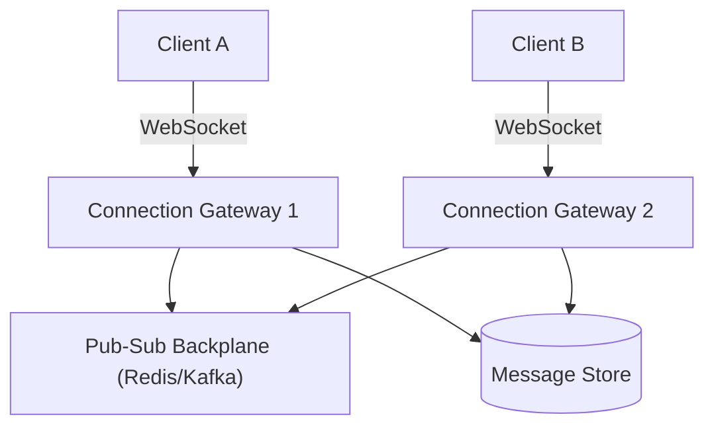
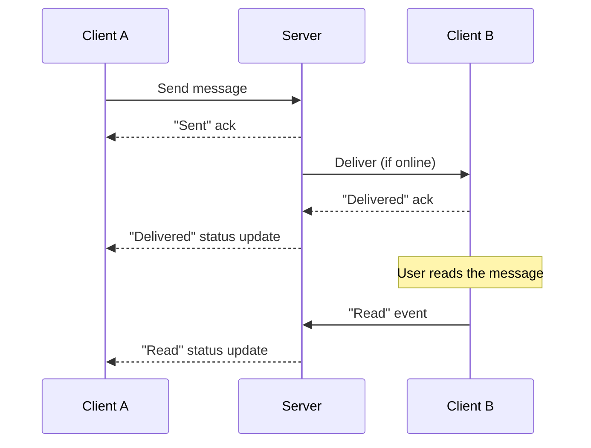

## Introduction

A chat application is where Chapter 5's WebSocket discussion and Chapter 2's connection-handling material become unavoidable — this is a system fundamentally about managing millions of persistent, stateful connections, not stateless request-response traffic.

## Step 1: Clarify Requirements

**Functional:**
- One-to-one messaging; explicitly clarify whether group chat is in scope (assume yes, but simpler — start with 1:1).
- Message delivery status: sent, delivered, read.
- Support offline users — messages sent to an offline user must be delivered once they reconnect.

**Non-functional:**
- Low latency for online users (near-instant delivery).
- Message ordering must be preserved within a conversation (Chapter 19's causal consistency is directly relevant here).
- At-least-once delivery — a duplicate message is a minor annoyance; a lost message is a real product failure.

## Step 2: Capacity Estimation

50 million daily active users, each sending an average of 40 messages/day → 2 billion messages/day → ~23,000 messages/second average, with a peak multiplier applied (Chapter 47) for realistic peak-hour traffic. The more architecturally significant number: if even 20% of DAU are simultaneously online during peak hours, that's **10 million concurrent, persistent WebSocket connections** to maintain — a fundamentally different scaling challenge than request throughput alone.

## Step 3: Define the API

```
WebSocket connection: wss://chat.example.com/connect?token=<jwt>

Client -> Server: { "type": "message", "to": "user_456", "text": "hey", "clientMsgId": "uuid" }
Server -> Client: { "type": "ack", "clientMsgId": "uuid", "serverMsgId": "..." }
Server -> Client: { "type": "message", "from": "user_123", "text": "hey", "serverMsgId": "..." }
```

## Step 4: High-Level Architecture



**The core architectural challenge, directly from Chapter 5**: If Client A and Client B are connected to *different* connection-gateway instances (near-certain at scale, given horizontal scaling from Chapter 7), Gateway 1 has no direct way to deliver Client A's message to Client B's WebSocket connection, which is held by Gateway 2 entirely. A **pub-sub backplane** (Chapter 31) solves this: every gateway subscribes to updates for the users currently connected to it; when Gateway 1 needs to deliver a message to Client B, it publishes to the backplane, and Gateway 2 (having subscribed on Client B's behalf) receives and delivers it over its own held connection.

## Step 5: Deep Dive — Message Ordering, Delivery Status, and Offline Handling

### Guaranteeing Message Order

Within a single conversation, messages must arrive in the order they were sent — directly connecting to Chapter 19's causal consistency discussion. A simple, effective approach: each message is assigned a monotonically increasing sequence number *per conversation* (not globally), and the client reassembles/displays messages in sequence-number order, buffering any that arrive out of order until the gap is filled — directly mirroring the "buffer until causal dependencies are met" technique from Chapter 19.

### Delivery Status: Sent → Delivered → Read



Each status transition is itself a small piece of state that must be reliably persisted and propagated — using the same at-least-once-plus-idempotency pattern (Chapters 28, 30) as the messages themselves, keyed by the message's unique server-assigned ID.

### Offline Message Delivery

```java
public void handleIncomingMessage(Message message) {
    boolean recipientOnline = connectionRegistry.isOnline(message.getRecipientId());
    messageStore.save(message); // always persist first - durability before attempting delivery

    if (recipientOnline) {
        pubSubBackplane.publish(message.getRecipientId(), message);
    }
    // If offline, the message simply waits in the message store.
    // On reconnect, the client fetches undelivered messages since its last known sequence number.
}
```

**Always persist before attempting real-time delivery** — this ordering guarantees durability (Chapter 17) regardless of whether the real-time delivery attempt succeeds, directly avoiding a scenario where a message is "delivered" to a momentarily-connected client but never durably stored, and is lost if that delivery attempt has any issue.

## Step 6: Bottlenecks and Trade-offs

- **Connection gateway capacity**: Each gateway instance can hold a finite number of concurrent WebSocket connections (bounded by memory and file descriptors, Chapter 2's non-blocking I/O discussion) — horizontal scaling (Chapter 7) of gateway instances, with the pub-sub backplane as the connecting layer, is what makes 10 million total concurrent connections tractable despite any single instance's limits.
- **Group chat fan-out**: A message to a 500-person group requires delivering to up to 500 recipients — this is a fan-out problem directly analogous to Chapter 52's notification broadcast discussion, requiring similar batching/parallelization for very large groups.
- **Message storage growth**: Billions of messages/day requires a database choice suited to high write throughput and simple, mostly time-ordered access patterns — a wide-column store (Chapter 13) is a common real-world choice for exactly this access pattern.

## Step 7: Failure Scenarios and Scaling Evolution

- **Connection gateway crash**: All WebSocket connections held by that instance drop; clients detect this (via a lost heartbeat/ping-pong) and reconnect, landing on a different, healthy gateway instance — the pub-sub subscription is re-established on reconnect.
- **Pub-sub backplane failure**: Real-time delivery is temporarily unavailable, but since messages are always persisted first (Step 5), no data is lost — delivery simply catches up once the backplane recovers, degrading to "feels like everyone went offline briefly" rather than data loss.
- **Scaling to video/voice calls**: A significant evolution beyond this chapter's scope, but worth naming — this would introduce a fundamentally different, latency-and-jitter-sensitive UDP-based media path (Chapter 2), architecturally separate from this text-messaging design.

## Summary

- A chat application's core hard problem is connection management at scale, not request throughput — millions of persistent WebSocket connections require a pub-sub backplane to route messages between clients connected to different gateway instances.
- Per-conversation sequence numbers and client-side buffering preserve message ordering, directly applying Chapter 19's causal consistency technique.
- Always persisting a message before attempting real-time delivery guarantees durability independent of delivery success — critical for correct offline-user handling.
- Group chat, message storage at scale, and gateway capacity limits each require the same horizontal-scaling and fan-out techniques discussed throughout Parts 2 and 5 of this series.

---

## Interview Questions

### 1. Why does a chat application need a pub-sub backplane (Chapter 31) specifically, rather than having connection gateways communicate directly with each other?
**Answer:** With potentially many gateway instances (horizontally scaled per Chapter 7) and millions of connected clients distributed unpredictably across them, any given gateway instance has no way of knowing in advance which *other* specific gateway instance currently holds a connection for an arbitrary message recipient — having every gateway instance maintain direct point-to-point awareness of every other instance's connections would require an unscalable, constantly-changing full-mesh coordination overhead; a pub-sub backplane instead provides a shared, decoupled communication layer where a gateway can simply publish "deliver this to user X" without needing to know which specific other gateway instance currently holds user X's connection — whichever gateway has legitimately subscribed on that user's behalf (because that user is connected to it) receives and delivers the message, directly applying pub-sub's core decoupling benefit (Chapter 31) to this specific connection-routing problem.

**Follow-up:** *Why might Redis Pub/Sub's lack of message persistence (discussed in Chapter 31) actually be an acceptable trade-off for this specific backplane use case, despite chat messages generally needing reliable delivery?* — The backplane's specific job is only to route an *already-persisted* message (per Step 5's "always persist first" principle) to whichever gateway currently holds the recipient's live connection — if this pub-sub routing message is lost (e.g., due to a brief backplane hiccup), the underlying chat message itself isn't lost at all, since it's already safely stored in the message store; the recipient will simply receive it slightly later, on their next reconnect/sync rather than via the intended real-time path — this is precisely why Redis Pub/Sub's ephemeral, best-effort delivery is an acceptable fit specifically for this narrow, real-time-routing-signal role, even though it would be entirely inappropriate for the actual, durable message data itself.

### 2. Explain why messages must be persisted to durable storage BEFORE attempting real-time delivery via the pub-sub backplane, rather than the reverse order or doing both simultaneously.
**Answer:** If a message were published to the pub-sub backplane first (or simultaneously with, in a way that isn't guaranteed to complete first) and only persisted afterward, a failure occurring between these two steps (e.g., the server crashing right after publishing but before the persistence write completes) could result in a message that was technically "delivered" to a currently-connected client's gateway but was never actually durably saved — if that delivery attempt itself also failed for any reason (the recipient's specific gateway also crashing at that exact moment, a network blip), the message would be entirely and silently lost, with no durable record ever having existed to allow recovery or retry; persisting first guarantees that, regardless of what happens with the subsequent real-time delivery attempt, the message's durable record already exists and can always be recovered/redelivered later (e.g., via the offline-message-sync mechanism) even if the initial real-time delivery attempt fails for any reason.

**Follow-up:** *Does persisting first introduce any added latency to the real-time delivery path for online users, and is this a meaningful trade-off?* — Yes, technically — persisting first requires waiting for the database write to complete before proceeding to the (likely faster) pub-sub publish step, adding some latency compared to attempting both simultaneously or delivery-first — but this added latency is typically very small (a well-optimized write-path database operation, especially one designed for high write throughput, can complete in low single-digit milliseconds) compared to the severe cost of potential silent message loss that the alternative ordering risks — this is a clear, easy case where a small, bounded latency cost is worth paying in exchange for eliminating a serious durability risk, directly echoing this series' repeated emphasis (Chapters 17, 28) on correctness taking priority over marginal latency optimization for genuinely important data.

### 3. Why is a per-conversation (rather than a single, global) sequence number used to preserve message ordering, and what problem would a single global sequence number introduce?
**Answer:** Message ordering only actually needs to be preserved *within* a specific conversation (messages between the same specific set of participants) — there's no meaningful, necessary ordering requirement *between* messages belonging to entirely different, unrelated conversations (e.g., there's no reason Alice's message to Bob needs any particular ordering relationship to Carol's unrelated message to Dave). A single, global sequence number shared across the entire system would require every single message across every single conversation, system-wide, to be assigned from one single, centrally-coordinated counter — reintroducing exactly the kind of single-point-of-coordination bottleneck discussed in earlier case studies (like the URL shortener's ID-generation discussion) for a guarantee (global ordering across all unrelated conversations) that isn't actually needed at all; a per-conversation sequence number can be generated and coordinated at a much smaller, more localized scope (just the specific participants of that one conversation), avoiding this unnecessary, system-wide coordination bottleneck entirely while still providing the actual, meaningful ordering guarantee the product requires.

**Follow-up:** *How does this per-conversation sequencing decision directly connect to Chapter 19's causal consistency concept, rather than requiring full, strong linearizability?* — This is a direct, practical application of causal consistency's core principle — messages within the same conversation ARE causally related (a reply naturally comes after the message it's replying to, and participants expect to see the conversation's messages in their actual sent order) and must be ordered correctly relative to each other, but messages across different, unrelated conversations are causally independent (concurrent, in the terminology of Chapter 19) and can be processed/delivered in any relative order without violating any meaningful user-facing correctness expectation — choosing per-conversation sequencing rather than a stronger, unnecessary global linearizability guarantee is precisely the kind of "use the weakest guarantee that actually satisfies the real requirement" reasoning Chapter 19 explicitly recommends.

### 4. Why does group chat fan-out (sending one message to up to 500 recipients) require similar techniques to the notification broadcast problem from Chapter 52, despite being a seemingly different feature?
**Answer:** Both problems share the same fundamental underlying shape: a single logical event (a group message being sent, or a broadcast notification being triggered) needs to be delivered to a potentially large number of distinct recipients, each of whom may be connected to (or reachable via) a different specific server instance — just as Chapter 52's notification broadcast case study required explicit fan-out/batching to parallelize delivery across many workers rather than having one component sequentially process every single recipient, a large group chat message similarly benefits from fanning out the delivery task across the pub-sub backplane to each of the up to 500 recipients' respective connected gateways in parallel, rather than having a single component sequentially iterate through and individually deliver to each of 500 separate WebSocket connections one at a time, which would introduce unnecessary, avoidable latency for what should ideally feel like a near-simultaneous group message delivery experience for all recipients.

**Follow-up:** *At what group size might this fan-out concern become a genuinely significant architectural challenge, rather than a minor implementation detail?* — For a small group (a handful to a few dozen members), sequential or lightly-parallelized delivery is likely fast enough to be imperceptible to users regardless of the specific implementation approach — but for very large groups (hundreds to potentially thousands of members, as some real-world chat platforms support for large community/broadcast-style groups), the fan-out delivery problem becomes genuinely significant and closely resembles the Chapter 52 notification-broadcast problem at meaningful scale, likely requiring the same kind of explicit batching, parallel processing across multiple worker/gateway instances, and potentially even rate-limiting the fan-out rate to avoid overwhelming the pub-sub backplane or downstream gateway instances with an enormous, instantaneous burst of delivery tasks for a single very-large-group message.

### 5. In an interview, if asked "how would you handle a user who has the app installed on both their phone and their laptop simultaneously," how would you extend this chapter's architecture to address multi-device support?
**Answer:** You'd need to extend the connection registry (which currently, as implicitly described, maps a single user to a single connection) to instead support mapping a single user to *multiple* simultaneous connections (one per active device) — when delivering a message intended for that user, the pub-sub backplane publish/delivery logic would need to fan out to *all* of that user's currently active device connections simultaneously (a small-scale version of the same fan-out principle discussed for group chat), ensuring the message appears in near-real-time on every one of the user's active devices, not just whichever one happens to be found first; you'd also need to extend the "read" status tracking to correctly handle the case where a message is read on one device — the read-receipt status update would need to propagate to and be reflected across the user's other devices as well, so the message doesn't confusingly still show as "unread" on the user's other device after they've already read it on their phone.

**Follow-up:** *Why might this multi-device extension specifically also require revisiting how offline message sync (Step 5) is implemented?* — With multiple devices, "offline" is no longer a simple single boolean per user — a user might have their phone actively connected while their laptop is closed/offline, meaning the offline-sync logic needs to track and reconcile delivery/read state independently *per device*, not just per user; a device that reconnects after being offline needs to specifically sync only the messages/status-updates it individually missed (potentially different from what another of the user's devices might have already received while it stayed online), requiring the sequence-number-based sync mechanism discussed in this chapter to actually be tracked per-device (or per-device-and-conversation) rather than assuming a single, unified "this user's" offline state that a single-device-only design might have implicitly assumed.
