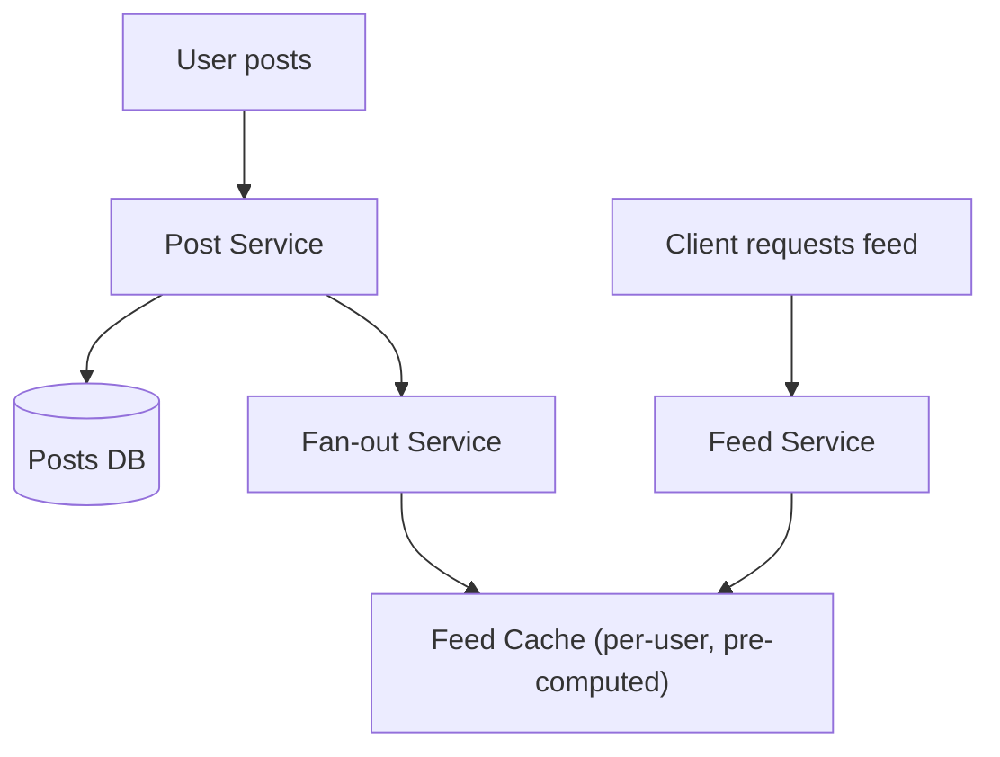
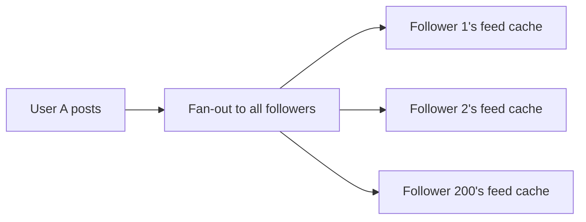
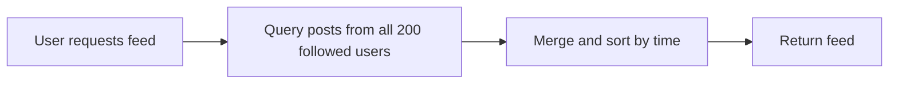
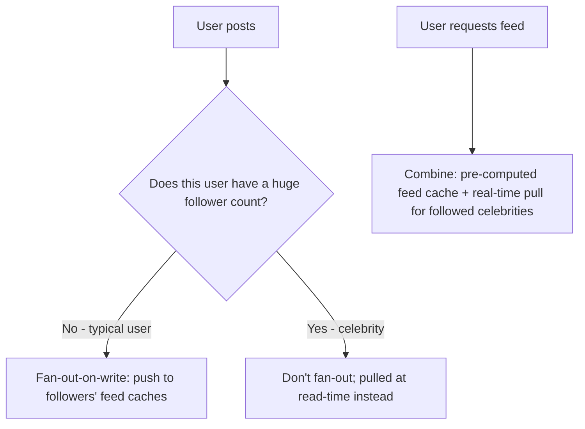

## Introduction

A news feed is the canonical case study for one of system design's most instructive trade-offs: fan-out-on-write vs fan-out-on-read — a direct, concrete application of Chapter 37's CQRS thinking to a specific, extremely common product feature.

## Step 1: Clarify Requirements

**Functional:**
- Users follow other users; a user's feed shows recent posts from everyone they follow, roughly reverse-chronological (ranking/algorithmic ordering explicitly out of scope for this core design, mentioned as a possible extension).
- Users can create posts.

**Non-functional:**
- Read-heavy: users check their feed far more often than they post (a ratio worth explicitly estimating, per Chapter 47).
- Feed loading must be fast — this is the single most frequently-used screen in the product.
- Eventual consistency is acceptable — a brand-new post appearing in followers' feeds a few seconds late is an imperceptible, non-issue (Chapter 19).

## Step 2: Capacity Estimation

500 million DAU, each posting an average of 0.5 posts/day but checking their feed 10 times/day → 250 million posts/day but 5 billion feed reads/day — a 20:1 read:write ratio at the *action* level, but the real complexity is in the *fan-out*: an average user might have 200 followers, meaning each post potentially needs to reach 200 different feeds — 250 million posts/day × 200 followers ≈ 50 billion feed-insertion operations/day if every post is proactively pushed to every follower's feed.

## Step 3: Define the API

```
POST /posts                { "text": "...", "mediaUrl": "..." }
GET  /feed?cursor=<opaque> -> { posts: [...], nextCursor: "..." }
```

## Step 4: High-Level Architecture



## Step 5: Deep Dive — Fan-Out-on-Write vs Fan-Out-on-Read

This is the system's actual hard problem, and a direct application of CQRS's write-model/read-model separation (Chapter 37).

### Fan-Out-on-Write (Push Model)

When a user posts, immediately push that post into the pre-computed feed (a cache, Chapter 9) of every one of their followers.



**Pros**: Reading a feed is extremely fast — just fetch the already-computed list from the cache, no expensive real-time aggregation needed at read time.
**Cons**: A user with millions of followers (a celebrity) creates a massive fan-out cost per single post — directly Chapter 16's celebrity/hotspot problem, now applied to write amplification rather than read hotspots.

### Fan-Out-on-Read (Pull Model)

Don't pre-compute anything at write time; when a user requests their feed, query and merge recent posts from everyone they follow, in real time.



**Pros**: No wasted write-time work for posts that might never actually be viewed by some followers; no celebrity fan-out problem on the write side.
**Cons**: Every single feed *read* now requires an expensive, real-time fan-in query across everyone the user follows — for a user following thousands of accounts, this is a heavy, repeated cost paid on every single feed load, for the product's most frequently-used feature.

### The Hybrid Approach (What Real Systems Actually Do)



Most real systems use fan-out-on-write for the vast majority of users (where the follower count is manageable), but switch to fan-out-on-read specifically for accounts with extremely large follower counts — avoiding the celebrity write-amplification problem while still keeping the common case's read path fast. A user's final feed is then assembled by combining their pre-computed (pushed) feed with a small number of real-time-pulled posts from any celebrities they follow.

## Step 6: Bottlenecks and Trade-offs

- **Feed cache staleness**: Since fan-out is asynchronous (via a queue, Chapter 30, decoupling the post-creation flow from the fan-out work), there's a brief eventual-consistency window before a new post appears in followers' feeds — explicitly acceptable per Step 1.
- **Storage cost of pre-computed feeds**: Fan-out-on-write means the same post is effectively duplicated (or referenced) across potentially hundreds of different followers' feed caches — a direct storage-for-latency trade-off, a recurring theme since Chapter 9.
- **New follows**: When a user follows someone new, their feed cache needs to be backfilled with that person's recent posts — a smaller, one-time fan-out operation, distinct from the ongoing per-post fan-out.

## Step 7: Failure Scenarios and Scaling Evolution

- **Fan-out service backlog**: Queue depth (Chapter 30) grows if fan-out workers can't keep up — auto-scaling workers (Chapter 7) addresses this, with the acceptable consequence being a temporarily longer eventual-consistency delay, not data loss (since the queue durably holds the pending fan-out work).
- **Feed cache node failure**: Since the feed cache is a derived, rebuildable view (directly the CQRS read-model philosophy from Chapter 37), a failed cache node's data can be reconstructed from the posts database if truly necessary, though in practice replication (Chapter 15) of the cache itself is the more common, faster mitigation.
- **Scaling to add ranking/algorithmic ordering**: This would evolve the simple "merge by time" read-model logic into a more sophisticated ranking service, likely still operating on the same underlying pre-computed-plus-pulled data sources established here — the fan-out architecture itself remains a stable foundation even as ranking logic evolves independently on top of it.

## Summary

- A news feed's core hard problem is choosing between fan-out-on-write (fast reads, celebrity write-amplification problem) and fan-out-on-read (no write amplification, expensive real-time reads) — a direct application of CQRS's write/read model separation.
- Real systems use a hybrid: fan-out-on-write for typical users, fan-out-on-read specifically for high-follower-count accounts, combined at read time.
- Asynchronous, queue-based fan-out decouples post-creation latency from the (potentially large) fan-out workload, at the cost of a brief, acceptable eventual-consistency window.
- The feed cache is a derived, rebuildable read-model view — directly the CQRS philosophy from Chapter 37, applied concretely.

---

## Interview Questions

### 1. Explain the fundamental trade-off between fan-out-on-write and fan-out-on-read, and why neither approach is universally superior.
**Answer:** Fan-out-on-write does the expensive work of distributing a post to all followers' feeds at write time (when a post is created), making subsequent reads extremely fast (a pre-computed feed is just a direct lookup) — but this means the cost of a single post is multiplied by the poster's follower count at write time, regardless of whether every follower will actually view that specific post; fan-out-on-read defers all this work to read time, doing no wasted work for posts that are never viewed by a specific follower, but at the cost of every single feed read requiring an expensive, real-time aggregation query across everyone the user follows. Neither approach is universally superior because they represent a direct trade-off between write-time cost (multiplied by follower count) and read-time cost (multiplied by how many accounts a user follows, and by how frequently they check their feed) — which side of this trade-off is more favorable depends entirely on the specific ratio of posts-per-user to reads-per-user and the specific distribution of follower counts across the user base, exactly the kind of numbers Chapter 47's capacity estimation step is meant to surface.

**Follow-up:** *If every user in a hypothetical system had exactly the same, moderate follower count (no extreme celebrity accounts at all), would the hybrid approach discussed in this chapter still be necessary?* — Not necessarily to the same degree — the hybrid approach's specific motivation is mitigating the celebrity/extreme-follower-count write-amplification problem; if follower counts were uniformly moderate across the entire user base (no long-tail extreme outliers), pure fan-out-on-write might be entirely sufficient and simpler to implement, without needing the added complexity of maintaining two different fan-out paths and combining them at read time — the hybrid's specific value is directly tied to the real-world reality that follower-count distributions are typically extremely skewed (a small number of accounts with enormously disproportionate follower counts), which is the actual condition that makes the pure fan-out-on-write approach's worst case genuinely problematic.

### 2. Why is the fan-out-on-write/fan-out-on-read trade-off described as "a direct, concrete application of CQRS" (Chapter 37)?
**Answer:** CQRS's core principle is maintaining separate models for writes (commands) and reads (queries), each independently optimized for its own specific concern — fan-out-on-write is precisely this: the "write side" of the system does additional, proactive work (fanning out to followers) specifically to make the "read side" (the feed cache) extremely fast and simple to query, exactly mirroring CQRS's pattern of a write-side model that maintains/updates a separately-optimized, denormalized read-side projection — the feed cache itself is a classic CQRS read model: a denormalized, pre-computed, purpose-built view specifically optimized for the "show me my feed" query pattern, built and kept up to date asynchronously (via the fan-out service, functioning as the event-consuming projection-builder) from the underlying write-side source of truth (the posts database).

**Follow-up:** *How does the fan-out service's asynchronous, queue-based operation (Step 6) directly mirror the eventual-consistency trade-off CQRS explicitly accepts, per Chapter 37?* — Just as Chapter 37 explained that a CQRS read model is typically synchronized from the write model asynchronously (introducing an inherent, brief lag between a write and its reflection in the read model), this news feed's fan-out service asynchronously processes the fan-out work via a queue after a post is created — meaning there's a similar, brief window where a just-created post exists in the write-side posts database but hasn't yet been fanned out to and reflected in followers' pre-computed feed caches (the read model) — this is the exact same "read-your-writes" style consideration Chapter 37 discussed, here manifesting as "will I immediately see my own just-created post reflected somewhere, even if my followers' feeds haven't caught up yet" — typically handled by having the posting user's own client optimistically display their own new post immediately, without waiting for the asynchronous fan-out to complete.

### 3. Why does the celebrity/high-follower-count problem specifically manifest as a WRITE-side concern in this news feed design, whereas Chapter 16 originally introduced the "celebrity problem" as primarily a READ-side hotspot concern?
**Answer:** In Chapter 16's original framing (a sharded database, where a popular entity's data always routes to the same shard), the celebrity problem manifests specifically as disproportionate *read* traffic concentrating on one specific shard, since many different clients are all trying to read that one popular entity's data. In this news feed's fan-out-on-write context, the celebrity problem instead manifests as a *write*-side concern: it's not that many people are trying to *read* the celebrity's own single post record (which would indeed still be a read hotspot in the posts database itself) — it's that the *system itself* must perform a massive number of *write* operations (fanning that single post out into potentially millions of individual followers' feed caches) as a direct consequence of that one post being created, meaning the celebrity's outsized impact here specifically shows up as extreme write amplification triggered by a single logical write event, a distinct (though related, in that both stem from extreme skew/popularity) manifestation of the general "popular entity creates disproportionate load" pattern first introduced in Chapter 16.

**Follow-up:** *Does this news feed system still have any of the original, read-side celebrity hotspot concerns from Chapter 16, separate from the write-amplification issue just described?* — Yes, potentially — in the fan-out-on-read portion of the hybrid approach (used specifically for celebrity accounts), every follower's feed-read operation now needs to directly query that celebrity's own recent posts in real time — if a celebrity has millions of followers all frequently checking their feeds, this creates exactly the kind of read-hotspot concentration on that celebrity's specific post data that Chapter 16 originally described, meaning the hybrid approach's fan-out-on-read path for celebrities still needs its own mitigation (e.g., aggressive caching of that celebrity's recent posts specifically, since many different followers' feed-read operations will all need to fetch the same, shared celebrity data) — illustrating that solving the write-amplification problem via the hybrid approach doesn't automatically eliminate the need to also separately address the more classic, read-side hotspot concern for the specific celebrity-post data itself.

### 4. Why might a candidate's initial instinct to use pure fan-out-on-write for "simplicity" be a reasonable starting answer, but require refinement once follower-count distribution is discussed?
**Answer:** For a system with a genuinely uniform, moderate follower-count distribution (or for an initial, simpler version of the design before considering edge cases), pure fan-out-on-write is indeed the simpler architecture to reason about and implement — a single, consistent fan-out path for every single post, without needing to maintain and combine two different code paths (push and pull) as the hybrid approach requires; this makes it a perfectly reasonable starting point for an initial design discussion, echoing this series' broader theme of starting simple and adding complexity only as genuinely justified (Chapter 7). However, once the interviewer (or the candidate themselves, proactively per Chapter 48's Step 6) introduces the reality of extremely skewed, real-world follower-count distributions (a small number of accounts with millions of followers), the pure fan-out-on-write approach's worst-case behavior (a single post requiring millions of individual fan-out writes) becomes a clear, serious scalability concern that must be explicitly addressed — at which point evolving toward the hybrid approach represents a well-reasoned, requirement-driven architectural refinement, not an admission that the initial simpler answer was wrong, but rather the natural, expected evolution once a more complete picture of the actual, real-world scale and distribution is considered.

**Follow-up:** *How would you decide on a specific follower-count threshold above which an account should switch from the push (fan-out-on-write) model to the pull (fan-out-on-read) model?* — This threshold should be determined empirically/pragmatically based on where the write-amplification cost genuinely becomes problematic relative to the system's actual infrastructure capacity — a reasonable approach involves estimating (per Chapter 47) the actual fan-out write cost at various follower-count levels and identifying the point where this cost meaningfully strains fan-out worker capacity or introduces unacceptable fan-out completion latency for a single post, then setting the threshold somewhat below that point to provide a reasonable safety margin — this is inherently a system-specific, empirically-tuned parameter rather than a universal constant, and real systems typically monitor and may adjust this threshold over time based on observed actual system behavior and capacity.

### 5. In a system design interview, if asked "how would you extend this design to support a user unfollowing someone," how would you address this using the architecture established in this chapter?
**Answer:** For a user who unfollows someone under the fan-out-on-write model, the previously-fanned-out posts from that now-unfollowed user would still technically remain in the follower's pre-computed feed cache unless explicitly removed — you'd need to decide whether this is actually a problem worth solving explicitly: if the feed cache only ever displays a limited, recent window of posts (e.g., the last few days), old posts from an unfollowed user would naturally, harmlessly age out of this window relatively quickly on their own, making explicit removal potentially unnecessary complexity for a self-resolving, low-stakes issue; if immediate removal is genuinely required by the product (e.g., a user unfollowing someone specifically because they don't want to see that content anymore, even briefly), you'd need an explicit "un-fanout" operation, likely implemented similarly to the original fan-out (an asynchronous job specifically removing that specific user's posts from the unfollower's feed cache) — this exact design choice (accept brief, self-resolving staleness vs. actively invalidate) directly mirrors the cache-invalidation trade-off discussions from Chapter 9, now applied specifically to this feed-cache context.

**Follow-up:** *Why might explicit removal be considered a lower priority than the original fan-out-on-post-creation logic, from an engineering-effort-prioritization standpoint?* — The core "see posts from people I follow" functionality (handled by the original fan-out) is a much more frequently-exercised, product-critical path than the comparatively rarer "immediately, completely purge a specific unfollowed user's recent posts from my feed" edge case — given limited engineering time and the general principle (echoed throughout this series) of prioritizing effort toward the most impactful, frequently-exercised functionality first, a reasonable, pragmatic initial implementation might accept the brief, self-resolving staleness of unfollowed users' recent posts (relying on the natural time-based window aging them out) rather than investing in building and maintaining a more complex, immediate explicit-removal mechanism for what's likely a comparatively rare, lower-stakes edge case relative to the system's core, primary feed-generation functionality.
