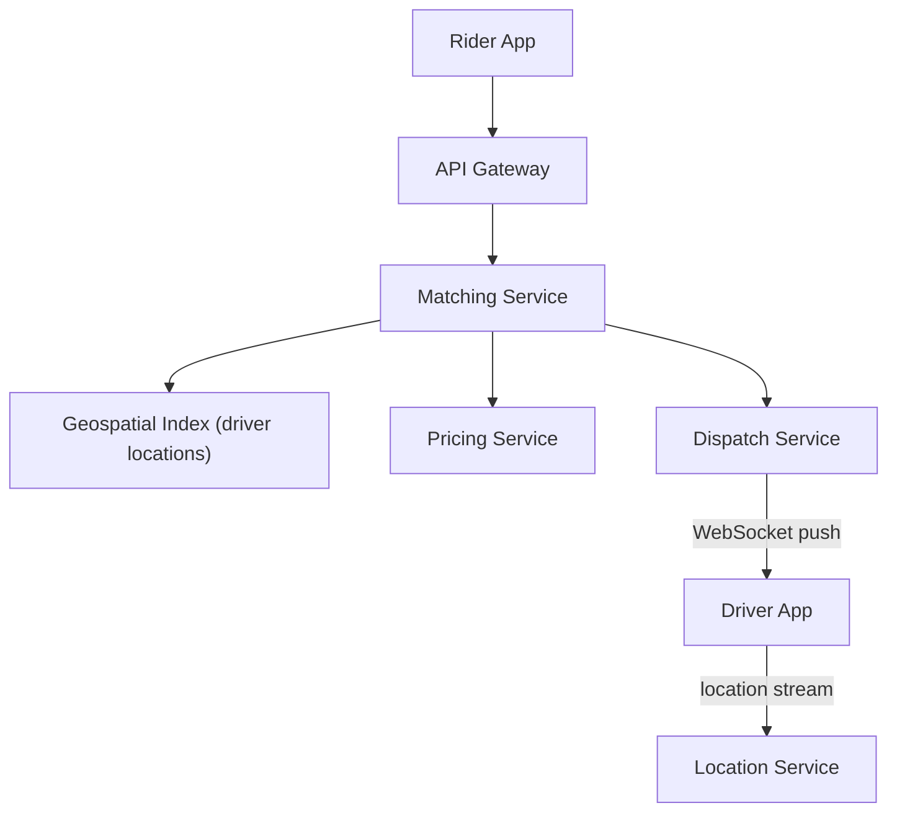
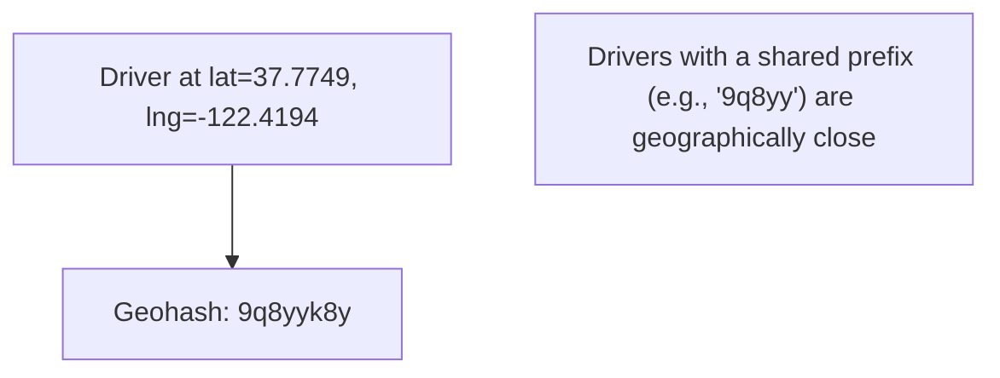
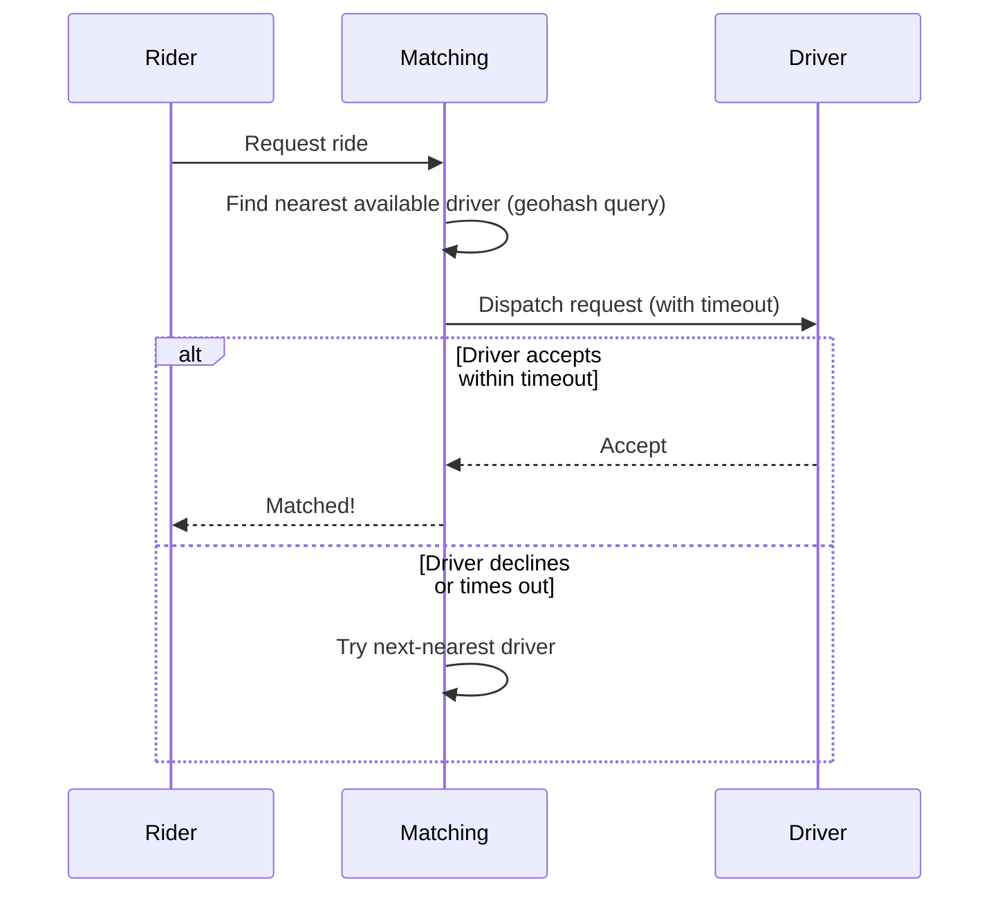

## Introduction

A ride-sharing system draws on nearly every part of this series at once: real-time location streaming (Chapter 5's WebSockets), geospatial matching (a new problem this chapter introduces), event-driven Saga-style order coordination (Chapters 20, 32), and multi-service architecture (Chapter 34) — a genuinely comprehensive case study.

## Step 1: Clarify Requirements

**Functional:**
- Riders request a ride from location A to B; the system matches them with a nearby available driver.
- Real-time driver location tracking, visible to the matched rider during an active ride.
- Fare calculation and payment.

**Non-functional:**
- Very low latency for matching (riders expect a match within seconds).
- High availability — this is a real-time, safety-relevant, revenue-generating core flow.
- Strong consistency specifically for: a ride must never be assigned to two drivers simultaneously, and a driver must never be double-booked (directly a distributed-lock-style mutual-exclusion requirement, Chapter 27).

## Step 2: Capacity Estimation

10 million daily rides, concentrated heavily into rush-hour peaks in dense urban areas — the geographic and temporal concentration is more architecturally significant than the raw daily average, since matching must work correctly and quickly specifically during these high-density peak windows in specific cities, not merely handle an evenly-distributed global average.

## Step 3: Define the API

```
POST /rides/request      { pickupLocation, dropoffLocation } -> { rideId, status: "matching" }
PUT  /drivers/location    { driverId, lat, lng } (streamed continuously while online)
GET  /rides/{rideId}/status
```

## Step 4: High-Level Architecture



## Step 5: Deep Dive — Geospatial Indexing for Driver Matching

The core hard problem: given a rider's location, efficiently find nearby available drivers among potentially millions of constantly-moving drivers, without scanning every driver's location on every single match request.

### Geohashing

Geohashing encodes a latitude/longitude pair into a short string, where geographically nearby locations tend to share string prefixes — converting a 2D proximity problem into a 1D string-prefix-matching problem that's efficient to index (directly usable with a standard B-Tree index, Chapter 14).



```java
public List<Driver> findNearbyDrivers(double lat, double lng, int precisionLevel) {
    String targetGeohash = GeohashUtil.encode(lat, lng, precisionLevel);
    // Query drivers whose geohash shares the same prefix - an indexed range scan,
    // not a full table scan across every driver
    return driverLocationRepository.findByGeohashPrefix(targetGeohash);
}
```

**A key subtlety**: Geohash boundaries can place two physically nearby points into *different* geohash cells (if they straddle a cell boundary) — a robust implementation checks the target cell plus its immediate neighboring cells, not just an exact prefix match, to avoid incorrectly missing genuinely nearby drivers sitting just across a boundary.

### Real-Time Location Updates

Drivers continuously stream their location (every few seconds) via a persistent connection — directly Chapter 53's chat-application connection-management architecture, repurposed here for location streaming instead of messages. This location stream updates the geospatial index in near-real-time, ensuring matching decisions use current, not stale, driver positions.

### The Matching and Dispatch Flow (A Saga, Chapter 20)



This dispatch flow is a Saga: each step (finding a candidate driver, offering the ride, waiting for acceptance) can fail or time out, requiring a defined compensating action (try the next candidate driver) — directly the choreography/orchestration pattern from Chapter 20, here implemented as an orchestrated dispatch loop.

**Preventing double-booking**: A driver, once offered a ride, must be marked as "pending offer" (not simply "available") atomically — using the same atomic check-and-set pattern from Chapter 26's rate limiter and Chapter 27's distributed locks, ensuring two simultaneous ride requests can never both be offered the same driver.

## Step 6: Bottlenecks and Trade-offs

- **Geospatial index write load**: Millions of drivers updating their location every few seconds creates a very high write volume against the geospatial index — this favors a database/index technology optimized for high write throughput (Chapter 14's LSM Tree discussion) over a traditional B-Tree-heavy relational setup for this specific component.
- **Surge pricing**: Calculating real-time supply/demand ratios per geographic area to adjust pricing is itself a stream-processing problem (Chapter 33) — continuously aggregating ride requests vs. available drivers within rolling time windows per geographic cell.
- **Dispatch timeout tuning**: Too short a timeout for a driver to accept risks unnecessarily skipping good matches; too long delays the rider — a genuine, tunable trade-off similar in spirit to Chapter 36's circuit-breaker timeout tuning.

## Step 7: Failure Scenarios and Scaling Evolution

- **Matching Service instance failure mid-dispatch**: The Saga's state (which driver has been offered, what timeout is pending) must be persisted, not held only in that one instance's memory, so another instance can resume the dispatch loop if the original fails — directly the Saga-state-durability requirement from Chapter 20.
- **A driver's app losing connectivity mid-ride**: The system should tolerate brief location-update gaps gracefully (showing the driver's last-known position, per Chapter 41's graceful degradation) rather than treating a brief connectivity gap as a ride-ending failure.
- **Scaling to a new city**: The geospatial and matching architecture is naturally shardable by geographic region (Chapter 16) — a new city can largely be treated as an independent partition, since ride matching is inherently local and rarely needs to span geographic regions.

## Summary

- Ride-sharing's core hard problem is efficient geospatial matching at scale — geohashing converts 2D proximity into indexable string-prefix matching.
- Real-time driver location streaming reuses the persistent-connection architecture from the chat application case study.
- The matching/dispatch flow is a Saga, requiring durable state (not just in-memory) so a failed matching-service instance doesn't lose in-progress dispatch attempts.
- Atomic check-and-set operations on driver availability prevent double-booking — the same fundamental technique used for rate limiting and distributed locks elsewhere in this series.

---

## Interview Questions

### 1. Why does geohashing convert a 2D geospatial proximity problem into a form that's efficiently indexable, and what specific database structure does this then allow you to use?
**Answer:** Standard database indexes (like the B-Trees discussed in Chapter 14) are fundamentally designed for efficiently querying and range-scanning over a single, one-dimensional, sortable key — but raw latitude/longitude pairs don't have this property in a way that's useful for proximity queries (two points with numerically close latitude values aren't necessarily geographically close if their longitudes differ significantly, and vice versa). Geohashing encodes a 2D lat/lng pair into a single string such that geographically nearby points tend to share common string prefixes — this transforms "find points geographically near this location" into "find strings sharing this prefix," which is now a standard, one-dimensional string-prefix query that a conventional B-Tree index (or similar) can efficiently support via a simple, indexed range scan, rather than requiring a specialized multi-dimensional spatial index or, worse, a full table scan computing actual geographic distance for every single record.

**Follow-up:** *Why is checking only "the exact geohash cell containing the target point" insufficient for correctly finding all genuinely nearby drivers?* — Geohash cells have hard, discrete boundaries — two points that are, in reality, very close to each other geographically could nonetheless fall into two different adjacent geohash cells if they happen to sit on opposite sides of a cell boundary line, even by a tiny physical distance — a driver just across this boundary would be incorrectly excluded from results if only the exact target cell were queried; a correct implementation must additionally check the immediate neighboring cells surrounding the target cell to properly capture drivers who are genuinely nearby but happen to fall just across a boundary, rather than relying on the (generally useful, but imperfect at the edges) prefix-sharing property alone.

### 2. Explain why the driver-dispatch flow in this system is structured as a Saga (Chapter 20), rather than a single, atomic operation that matches and confirms a driver in one step.
**Answer:** The dispatch process inherently involves multiple, sequential steps with genuine uncertainty and potential failure/rejection at each one: finding a candidate driver is one step, offering them the ride is a second step, and waiting for their acceptance (which could time out or be explicitly declined) is a third — a single driver's rejection or timeout doesn't mean the overall ride-request operation has failed; it means the process should compensate by trying the next-best candidate driver instead — this is precisely the Saga pattern's structure: a sequence of individual steps, each with a defined compensating/alternative action if that specific step doesn't succeed, rather than an all-or-nothing atomic transaction that would need to somehow instantaneously know and lock in the one single correct driver from the very start, which isn't realistic given that driver responses are asynchronous, uncertain, and outside the system's direct control.

**Follow-up:** *Why must this Saga's state (which specific driver was most recently offered the ride, what timeout is currently pending) be durably persisted rather than only held in the Matching Service instance's local memory?* — If this in-progress dispatch state existed only in one specific Matching Service instance's local memory and that instance crashed or was restarted mid-dispatch (a realistic failure scenario for any long-running, multi-step process, as discussed throughout Chapters 36, 40-41), the entire in-progress ride-matching Saga for that specific rider would be lost, potentially leaving the rider stuck indefinitely with no driver assigned and no way for a different, healthy Matching Service instance to know how to resume or restart this specific rider's matching process — durably persisting this Saga state (e.g., in a database, keyed by the ride request ID) allows any Matching Service instance, not just the specific one that started the Saga, to pick up and correctly continue the dispatch process from wherever it left off, directly connecting to this series' broader emphasis (Chapters 7, 36) on avoiding stateful, single-instance dependencies for genuinely important, in-progress work.

### 3. Why is preventing "double-booking" a driver specifically framed as requiring the same atomic check-and-set technique used in rate limiting (Chapter 26) and distributed locks (Chapter 27)?
**Answer:** Preventing double-booking requires ensuring that, even if two different ride requests' matching processes happen to simultaneously consider the exact same specific driver as their best available candidate, only one of them can actually succeed in "claiming" that driver for a ride offer — this is fundamentally the same mutual-exclusion problem underlying both rate limiting's check-and-increment race condition (Chapter 26) and distributed locking's core purpose (Chapter 27): a shared resource (in this case, a specific driver's availability status) must be atomically checked and updated as a single, indivisible operation, so that two genuinely concurrent attempts can never both succeed based on stale, pre-update information — using the same atomic compare-and-set (or equivalent Lua-script-based atomic operation, as shown in Chapter 26's rate limiter) pattern directly and correctly solves this exact class of problem here, just applied to "driver availability status" as the specific shared resource being protected, rather than a rate-limit counter or a generic lock key.

**Follow-up:** *Why might a naive "check if driver.status == AVAILABLE, then separately set driver.status = PENDING_OFFER" implementation (as two separate, non-atomic steps) fail to correctly prevent double-booking under real concurrent load?* — This introduces the exact same race-condition window discussed in Chapter 26's rate-limiter deep dive: two concurrent matching processes could both execute their "check if available" read at nearly the same moment, both observing the driver as currently available (since neither has yet performed the subsequent "set to pending" write), and both then proceed to independently, incorrectly conclude they've successfully claimed that same driver — only a single, atomic check-and-set operation (ensuring no other process's read/write can interleave in between the check and the set) correctly closes this race-condition window and guarantees that only one of the two concurrent matching attempts can actually succeed in claiming that specific driver.

### 4. Why does this case study argue that a ride-sharing system's geospatial index favors a write-optimized (LSM-Tree-style) database technology over a traditional B-Tree-heavy relational setup, connecting to Chapter 14?
**Answer:** With potentially millions of active drivers each streaming location updates every few seconds, the geospatial index experiences an extremely high, sustained write volume — directly the scenario Chapter 14 identified as favoring LSM-Tree-based storage engines (which buffer writes in memory and flush sequentially to disk, optimized for high write throughput) over traditional B-Tree-based storage (which, per Chapter 14, generally offers more balanced but comparatively slower write performance due to potential in-place update/disk-seek costs) — since this specific component's dominant, defining workload characteristic is extremely high-frequency writes (location updates) rather than complex relational queries or transactional consistency needs, a database/storage technology specifically optimized for this exact write-heavy pattern (as opposed to a general-purpose relational database better suited to more balanced or read-heavy, transactionally-complex workloads) is the more appropriate, need-justified choice for this specific component.

**Follow-up:** *Does this mean the entire ride-sharing system should use this same write-optimized database technology for all its data, including ride records and payment information?* — No — this directly echoes the polyglot persistence principle from Chapter 13: different components of the same overall system can and should use different, purpose-suited database technologies based on their own specific access patterns — the geospatial/location-tracking component's extreme write-throughput needs justify a write-optimized choice specifically for that component, while ride records and payment information (needing strong transactional consistency and correctness guarantees, per Chapter 17's ACID discussion) are better served by a traditional relational database, even within this exact same overall ride-sharing system — using one single database technology uniformly across every component, rather than matching each component's specific technology choice to its own specific needs, would be the kind of one-size-fits-all approach this series has repeatedly cautioned against.

### 5. In a system design interview, if asked "how would you handle surge pricing" (dynamically increasing prices during high-demand periods), how would you connect this to Chapter 33's stream processing material?
**Answer:** Surge pricing fundamentally requires continuously computing and updating a real-time supply/demand ratio (available drivers vs. active ride requests) for each specific geographic area, and this ratio needs to be kept reasonably current (updated within seconds to minutes, not computed as an infrequent batch job) to actually respond to rapidly-changing real-time conditions like a sudden event ending and flooding a specific area with ride requests — this is a natural fit for stream processing (Chapter 33) rather than batch processing: a stream processor would continuously consume the stream of ride requests and driver availability/location updates, maintaining a windowed (likely tumbling or sliding, per Chapter 33) aggregate of supply and demand per geographic cell (potentially reusing the same geohash-based geographic partitioning discussed in this chapter's deep dive), and use this continuously-updated ratio to compute and apply an appropriate surge multiplier to ride pricing in that specific area in near-real-time.

**Follow-up:** *Why might a sliding window (rather than a tumbling window, per Chapter 33's distinction) be a more appropriate choice for computing this real-time supply/demand ratio?* — A tumbling window would only produce an updated supply/demand ratio at discrete, fixed intervals (e.g., a fresh number only every 5 minutes, at the top of each window), potentially missing or delaying detection of a rapid demand spike that occurs mid-window; a sliding window, by continuously recalculating the ratio over a moving recent time period (e.g., "the last 5 minutes, recalculated every 10-30 seconds"), provides a more continuously responsive, up-to-date view of rapidly-changing real-time supply/demand conditions — better matching surge pricing's actual product goal of responding quickly to genuinely rapid demand shifts (like a large event suddenly ending), rather than potentially lagging behind real conditions by up to a full tumbling-window's duration before the pricing system even becomes aware a spike has occurred.
