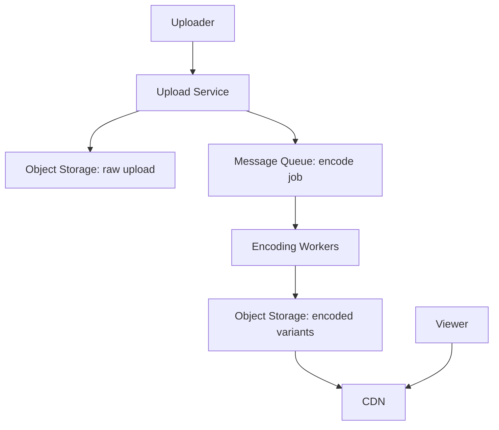
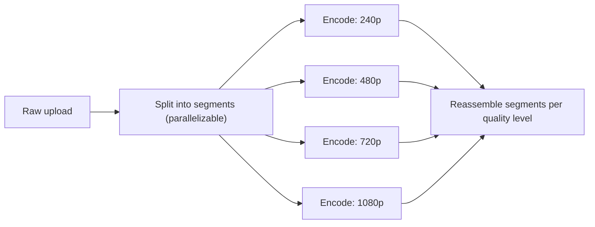
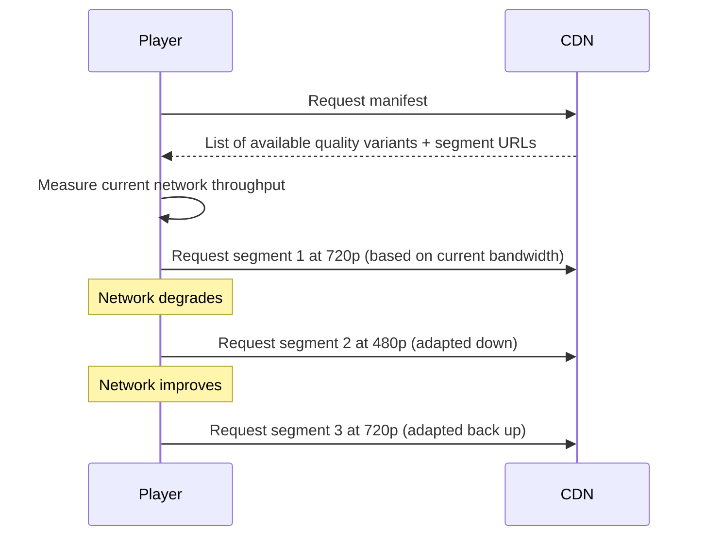

## Introduction

A video streaming platform brings together object storage (Chapter 21), CDN delivery (Chapter 11), asynchronous processing pipelines (Chapter 30), and a genuinely new concept this chapter introduces: adaptive bitrate streaming.

## Step 1: Clarify Requirements

**Functional:**
- Users upload videos; the system processes and makes them available for streaming.
- Viewers watch videos, ideally with quality that adapts to their current network conditions.

**Non-functional:**
- Massive read scale (video views vastly outnumber uploads — an extreme version of the read-heavy pattern seen throughout this series).
- Low startup latency (viewers expect playback to begin within a second or two) and minimal buffering during playback.
- Upload/encoding can tolerate higher latency (a few minutes of processing delay before a video is available is generally acceptable) — an explicit, important asymmetry to establish.

## Step 2: Capacity Estimation

500 hours of video uploaded per minute (a real, often-cited industry-scale figure), each requiring encoding into multiple quality variants — this immediately implies a very large, sustained, parallelizable background processing workload, entirely separate from the (even larger) real-time video-serving workload driven by billions of daily views.

## Step 3: Define the API

```
POST /videos/upload           (multipart upload) -> { videoId, status: "processing" }
GET  /videos/{videoId}/manifest -> adaptive streaming manifest (list of available quality variants)
GET  /videos/{videoId}/status
```

## Step 4: High-Level Architecture



- **Object storage** (Chapter 21) for both raw uploads and processed video files — the canonical use case for large binary content, explicitly not stored in a relational database.
- **Message queue-driven encoding pipeline** (Chapter 30): upload triggers an asynchronous encoding job, fully decoupling the (fast, simple) upload acknowledgment from the (slow, resource-intensive) actual video processing.
- **CDN** (Chapter 11) for actual video delivery to viewers — video content is the single clearest, highest-value use case for CDN caching discussed anywhere in this series.

## Step 5: Deep Dive — Encoding Pipeline and Adaptive Bitrate Streaming

### The Encoding Pipeline

A single uploaded video must be transcoded into multiple different quality variants (resolutions and bitrates — e.g., 240p, 480p, 720p, 1080p, 4K) to support viewers with varying screen sizes and network conditions.



Splitting a video into smaller segments and encoding them in parallel (across many encoding worker instances, Chapter 7's horizontal scaling) dramatically reduces total processing wall-clock time compared to encoding an entire long video sequentially on a single worker — a direct application of the same batching/parallelization principle from Chapter 52's notification fan-out, applied here to a computationally (rather than I/O) intensive workload.

### Adaptive Bitrate Streaming (ABR)

Rather than committing to a single quality level for an entire viewing session, the video is split into short segments (a few seconds each) at *each* quality level, with a **manifest file** listing all available segments/qualities. The video player continuously monitors the viewer's actual current network throughput and requests the next segment at whichever quality level that current bandwidth can sustain — allowing quality to adapt dynamically, segment by segment, throughout playback.



This is precisely why buffering is minimized despite variable real-world network conditions — rather than the player trying to force a fixed, possibly-too-high quality level and stalling to buffer when bandwidth genuinely can't sustain it, ABR gracefully degrades quality to match currently-available bandwidth, directly the same graceful-degradation philosophy from Chapter 41, applied here to video quality as the "non-critical" dimension that can flex, while playback continuity (the "critical" dimension) is preserved.

## Step 6: Bottlenecks and Trade-offs

- **Encoding cost vs. storage cost**: Encoding into many quality variants for every uploaded video is computationally expensive; storing all these variants indefinitely for videos that are rarely watched is a storage cost — some platforms defer encoding lower-priority quality variants until first requested, or apply more aggressive compression/fewer variants for videos with historically low view counts, an application of Chapter 9's caching principles to a media-encoding context.
- **CDN cache warming for new, highly-anticipated content**: A major new release expected to receive an immediate surge of views might benefit from proactive, push-based CDN pre-population (Chapter 11's push-CDN discussion) rather than relying on pull-based caching to warm up naturally after the surge has already begun.
- **Live streaming vs. video-on-demand**: This design assumes pre-recorded, on-demand video; live streaming introduces a fundamentally different real-time encoding and low-latency-delivery challenge, explicitly a different (though related) problem.

## Step 7: Failure Scenarios and Scaling Evolution

- **Encoding worker failure mid-job**: The encoding job (per video segment) should be idempotent and resumable (Chapter 28) — a crashed worker's in-progress segment can simply be re-processed by another worker without needing to restart the entire video's encoding from scratch.
- **CDN edge cache miss for very long-tail (rarely watched) content**: Falls through to the origin object storage — an acceptable, expected trade-off given the storage-cost discussion above; not every video benefits equally from aggressive CDN caching.
- **Scaling to support user-generated live streaming**: A substantial architectural evolution requiring real-time encoding (not batch-processed after upload) and much lower end-to-end latency tolerance, likely requiring UDP-based or specialized low-latency streaming protocols (Chapter 2) rather than this design's HTTP-based, segment-request ABR model.

## Summary

- Object storage and CDN delivery are the foundational infrastructure choices for video content, directly applying Chapters 21 and 11.
- The encoding pipeline is asynchronous, queue-driven, and parallelized by splitting videos into segments — directly reusing this series' recurring fan-out/parallelization pattern.
- Adaptive bitrate streaming gracefully degrades video quality (not playback continuity) in response to real-time network conditions — a direct, concrete application of Chapter 41's graceful degradation philosophy.
- Encoding jobs must be idempotent and resumable per segment, so a worker failure doesn't require restarting an entire video's processing from scratch.

---

## Interview Questions

### 1. Why is it explicitly important to establish, in Step 1, that "upload/encoding can tolerate higher latency" while "video serving must have low startup latency" — how does this asymmetry directly shape the architecture?
**Answer:** This explicit asymmetry directly justifies the fundamentally different architectural treatment each path receives: the upload/encoding path, being latency-tolerant, can be built as a fully asynchronous, queue-based pipeline (Chapter 30) where a user's upload is quickly acknowledged and the actual, potentially multi-minute encoding work happens entirely in the background, decoupled from the user's immediate experience — this is only an acceptable design choice specifically because the stated requirement confirms users don't expect their video to be instantly, synchronously available the moment they finish uploading. The video-serving path, by contrast, having a strict low-latency requirement, justifies the significant additional investment in CDN infrastructure (Chapter 11) and adaptive bitrate streaming specifically to minimize startup delay and buffering — if both paths had the same latency tolerance, the architecture might look meaningfully different (e.g., without this explicit asymmetry, a candidate might not clearly recognize why heavy asynchronous processing is acceptable for one path but not the other).

**Follow-up:** *What would need to change about this architecture if a new requirement were introduced: "creators want to see a preview of their uploaded video within 5 seconds of finishing upload, even before full encoding completes"?* — This would require a fast-path, lower-quality preview encoding (perhaps a single, low-resolution variant) to be prioritized and processed with much higher urgency/priority than the full multi-variant encoding pipeline — potentially using a separate, higher-priority queue (Chapter 30) or a dedicated fast-encoding worker pool specifically for this preview generation, decoupled from the standard, more latency-tolerant full encoding pipeline — directly illustrating how introducing even one new, more latency-sensitive requirement for a portion of the previously latency-tolerant upload path would require meaningful architectural extension beyond the base design established in this chapter.

### 2. Explain how Adaptive Bitrate Streaming (ABR) directly applies Chapter 41's graceful degradation principle, and identify which specific dimension is treated as "critical" versus "non-critical."
**Answer:** Chapter 41 established that graceful degradation involves explicitly, deliberately classifying system aspects as critical (must be preserved even under adverse conditions) versus non-critical (can be reduced/omitted under adverse conditions, rather than causing complete failure) — in ABR, playback continuity (the video continuing to play smoothly, without stalling/buffering) is treated as the critical dimension that must be preserved above all else, while video quality/resolution is treated as the non-critical, flexible dimension that can be dynamically reduced in response to degraded network conditions (adverse conditions, in this context) specifically to preserve that critical playback-continuity guarantee — rather than the system rigidly insisting on a fixed, potentially-too-high quality level and consequently stalling/buffering (a playback-continuity failure) when actual available bandwidth can't sustain that fixed quality, ABR explicitly, deliberately trades away quality (non-critical) to preserve continuity (critical), exactly mirroring Chapter 41's general graceful-degradation framework applied to this specific video-streaming context.

**Follow-up:** *Would a video platform explicitly targeting a niche audience of "videographers who specifically care more about maximum quality than any interruption" reasonably choose to invert this critical/non-critical classification? What would that look like?* — In principle, yes — for a genuinely different target audience/use case with different actual priorities, a platform could deliberately choose to treat quality as the higher-priority, less-flexible dimension, allowing more buffering/stalling tolerance in exchange for never dropping below a certain quality threshold even under degraded network conditions — this would represent a different, explicitly-chosen ABR configuration (e.g., a much more conservative bitrate-switching algorithm that's slower/more reluctant to drop quality, accepting more buffering risk as the trade-off) — illustrating that even the specific choice of "which dimension is critical" is itself a deliberate, context-dependent design decision (echoing Chapter 41's own explicit emphasis on this classification being a considered choice) rather than an unconditional, universal rule that must always classify playback continuity as more important than quality in every conceivable context.

### 3. Why does splitting a video into segments for parallel encoding (Step 5) mirror the same underlying principle as Chapter 52's notification broadcast fan-out, despite addressing a very different specific problem?
**Answer:** Both scenarios share the same fundamental structural pattern: a single, large logical unit of work (encoding one entire video; delivering one broadcast notification to millions of recipients) is decomposed into many smaller, independent sub-units (video segments; individual recipient batches) that can each be processed in parallel by multiple worker instances simultaneously, dramatically reducing the total wall-clock time needed to complete the overall logical operation compared to processing it as a single, large, sequential unit on one single worker — this is a general, recurring "divide the large problem into independent, parallelizable pieces" pattern that appears throughout distributed systems design whenever a single logical task is both large enough to benefit from parallelization and naturally decomposable into genuinely independent sub-pieces, regardless of whether the specific underlying work is I/O-bound (like notification delivery, waiting on network calls to third parties) or CPU-bound (like video encoding, requiring intensive local computation) — the specific *type* of work differs, but the underlying parallelization strategy and its motivating rationale are structurally identical.

**Follow-up:** *What specific characteristic must a large task have for this "split and parallelize" strategy to actually be effective, and could you imagine a scenario where video encoding might NOT cleanly decompose this way?* — The sub-units must be genuinely independent (or have only limited, manageable dependencies) — video segments can generally be encoded independently because most modern video codecs support this kind of segment-based, independent encoding; however, some more advanced or older encoding techniques might rely on information from *preceding* frames/segments to achieve better compression (inter-frame dependencies) — in such a case, naively splitting into fully-independent segments for parallel encoding could either be impossible without careful handling of these cross-segment dependencies, or could result in noticeably worse compression efficiency/quality at segment boundaries compared to a more sequential, dependency-aware encoding approach — illustrating that this parallelization strategy's effectiveness depends on the specific task's actual decomposability, not just its raw size.

### 4. Why might a video streaming platform choose to defer encoding lower-priority quality variants until first requested, rather than always encoding every quality variant immediately upon upload?
**Answer:** As discussed in Step 6, many uploaded videos receive relatively few views, and pre-emptively encoding every single quality variant (240p through 4K) for every single uploaded video, regardless of actual eventual demand, represents real, ongoing computational and storage cost that may never actually pay off for videos that end up rarely or never being watched at certain quality levels (e.g., very few viewers might ever request a rarely-uploaded, low-view-count video specifically in 4K) — deferring the encoding of less commonly-requested quality variants until they're actually, genuinely first requested (a lazy-encoding, cache-aside-like pattern directly analogous to Chapter 9's cache-aside strategy, just applied to computed video variants rather than simple cached data) avoids this wasted upfront computational cost for variants that may never actually be needed, accepting a one-time, first-request latency penalty (the requested variant must be encoded on-demand before it can be served) in exchange for avoiding this potentially substantial, often-wasted upfront processing cost across the platform's very long tail of lower-view-count content.

**Follow-up:** *Why would this lazy-encoding strategy likely NOT be applied to a video's most commonly-requested, default quality variant (e.g., 480p or 720p, whichever is the typical default for most viewers/connections)?* — The most commonly-requested default quality variant is, by definition, needed by the vast majority of actual viewers for virtually any video, regardless of that video's specific overall popularity — deferring this specific variant's encoding would mean nearly every single video would incur this first-request encoding latency penalty for nearly every one of its views, defeating much of the benefit of the asynchronous encoding pipeline established in Step 4 (which is specifically designed to have content ready and immediately servable before viewers arrive) — lazy encoding is specifically valuable and appropriately applied only to the less-commonly-needed, higher-cost variants (very high resolutions, or variants for unusual, rarely-used network conditions) where the actual probability of them ever being requested for a large fraction of the platform's total video catalog is genuinely low enough to justify deferring their encoding cost.

### 5. In a system design interview, if asked "how would you handle a video that suddenly, unexpectedly goes viral, receiving millions of views within hours," how would you connect this to concepts from earlier chapters in this series?
**Answer:** You'd first note that CDN caching (Chapter 11) should already handle much of this naturally — once the video's segments are cached at CDN edge locations (which happens automatically as early viewers' requests populate the cache in a pull-based model), subsequent viewers' requests for the same, now-popular content are served directly from the CDN edge without needing to repeatedly hit the origin, meaning a viral spike in *views* for already-encoded content is largely absorbed gracefully by the existing CDN architecture without requiring special intervention. You'd then specifically flag the earlier "lazy encoding" discussion as a potential complication: if this specific video hadn't yet had its higher-resolution variants encoded (due to the lazy, on-demand encoding strategy, given it was previously a low-view-count, unremarkable video before suddenly going viral), the sudden surge of new viewers might trigger a burst of "first-request" on-demand encoding requests for these previously-unencoded higher-quality variants — potentially causing a temporary, cache-stampede-like burst of encoding-worker load (directly connecting to Chapter 9's cache stampede discussion, here applied to on-demand encoding rather than a data cache) — you'd propose mitigating this the same way, e.g., detecting this specific "sudden popularity spike" pattern and proactively triggering pre-emptive encoding of remaining, not-yet-encoded quality variants ahead of overwhelming viewer demand, rather than waiting for many redundant, concurrent first-request-triggered encoding attempts.

**Follow-up:** *Why might this scenario specifically also warrant reconsidering whether a push-based CDN pre-population (Chapter 11) should be triggered, even though the content is technically already "in the system" (unlike a brand-new, never-before-cached piece of content)?* — Even though the video's default, already-encoded variant might already be present somewhere in the CDN's cache (from its prior, modest viewing history), a sudden massive surge in viewership from many new, geographically diverse locations might exceed what the video's existing, modest cache footprint (established during its prior low-popularity period) can efficiently serve — proactively, deliberately pushing/pre-populating this now-suddenly-popular content more broadly across many more CDN edge locations globally (rather than relying purely on the standard pull-based caching to gradually, reactively catch up to this new, much higher demand level) could help ensure a smoother, lower-latency experience for this sudden wave of new viewers, directly connecting back to Chapter 11's discussion of when proactive push-based CDN population is specifically justified despite pull being the more common general default.
