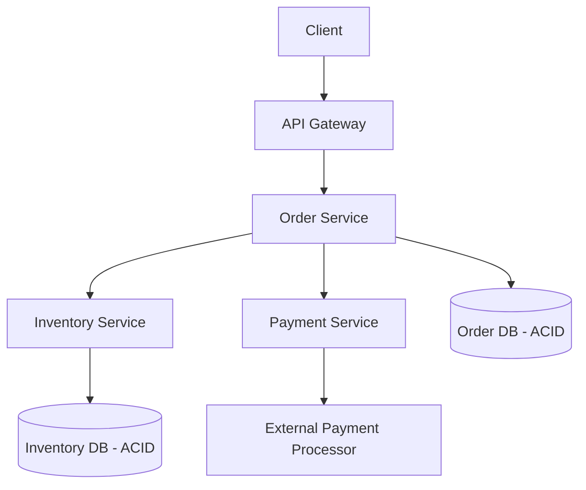
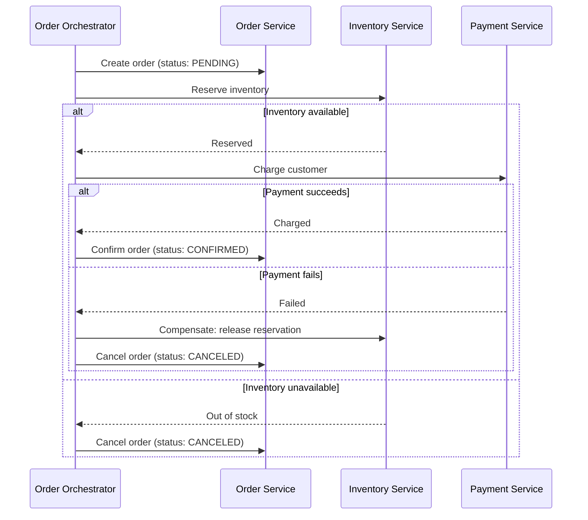

## Introduction

Most case studies so far have been dominated by scale and latency. This one inverts that: correctness dominates. Overselling inventory or double-charging a customer are real financial and legal problems, not just poor UX — this case study is where Chapters 17, 20, and 28's ACID/Saga/idempotency material becomes the central design concern rather than a footnote.

## Step 1: Clarify Requirements

**Functional:**
- Browse products, add to cart, place an order, process payment, reserve/decrement inventory.
- Order status tracking (placed, paid, shipped, delivered, canceled).

**Non-functional:**
- **Correctness over raw throughput**: never oversell inventory, never double-charge a customer — explicitly the dominant requirement, established up front per Chapter 1.
- Strong consistency specifically for inventory and payment state (Chapters 17-19); eventual consistency is acceptable for less critical data like product recommendations or view counts.
- Moderate scale relative to, say, the news feed or chat case studies — this is not a system defined primarily by extreme QPS.

## Step 2: Capacity Estimation

1 million orders/day → ~12 QPS average, with predictable peaks (e.g., flash sales, holiday shopping) potentially reaching much higher multiples. The estimation exercise here is less about proving scale challenges and more about confirming this system does *not* need Part 2's most aggressive scaling techniques — the actual hard problem is correctness under concurrency, not raw volume.

## Step 3: Define the API

```
POST /cart/items           { productId, quantity }
POST /orders                { cartId, paymentMethod } -> { orderId, status: "processing" }
GET  /orders/{orderId}
```

## Step 4: High-Level Architecture



Each service owns its own database (Chapter 34's microservices data-ownership principle) — Order, Inventory, and Payment are independently deployable and scalable, which directly creates the need for this chapter's central deep dive.

## Step 5: Deep Dive — The Order-Placement Saga

Placing an order spans three independently-owned services (Order, Inventory, Payment) — exactly the scenario Chapter 20 designed the Saga pattern for.



**Choosing orchestration over choreography** (Chapter 20): given only three participants and a need for very clear, auditable, centrally-visible tracking of exactly where a specific order is in this critical financial flow (important for customer support and compliance), an orchestrator provides the clearer, more directly debuggable structure this specific, high-stakes flow warrants, over choreography's more decentralized but harder-to-trace alternative.

### Preventing Overselling: Atomic Inventory Reservation

```java
// Atomic conditional update - the database itself enforces the invariant,
// not a read-then-write pattern in application code that would race under concurrency
@Query("UPDATE inventory SET quantity = quantity - :qty " +
       "WHERE product_id = :productId AND quantity >= :qty")
int reserveInventory(@Param("productId") String productId, @Param("qty") int qty);
// If this returns 0 rows affected, there wasn't enough stock - reject the reservation.
```

This directly mirrors the atomic check-and-set pattern used in Chapter 55's driver-double-booking prevention and Chapter 26's rate limiter — the same fundamental technique, applied to a third distinct problem, reinforcing that it's a general-purpose tool, not a one-off trick.

### Idempotent Payment Charging

The Payment Service's charge operation must accept and honor a client-supplied idempotency key (Chapter 28) — if the Order Orchestrator times out waiting for a response and retries the charge request, the Payment Service must recognize the retry and return the original result rather than charging the customer a second time.

## Step 6: Bottlenecks and Trade-offs

- **Isolation gap during the Saga**: Between "inventory reserved" and "payment confirmed," the reserved inventory is not yet a completed sale — other concurrent orders must see this as "reserved," not "available," but also not yet "sold" (Chapter 20's explicit isolation-sacrifice discussion).
- **Payment gateway as an external dependency**: Wrapped in a circuit breaker (Chapter 36) — if the external payment processor is degraded, failing fast with a clear "try again shortly" message is better than holding orders in a stuck, ambiguous "processing" state indefinitely.
- **Flash sale inventory contention**: A single extremely popular item can create a hotspot (Chapter 16's celebrity problem, applied to a single database row) — mitigated by allowing a bounded amount of overselling risk with a subsequent reconciliation/cancellation process, or by pre-splitting a hot item's inventory count across multiple database rows/shards specifically to reduce single-row write contention.

## Step 7: Failure Scenarios and Scaling Evolution

- **Orchestrator crash mid-Saga**: Saga state must be durably persisted (Chapter 20, echoing Chapter 55's dispatch-Saga durability discussion) so a replacement orchestrator instance can resume exactly where the crashed one left off, rather than losing track of a customer's in-progress order.
- **Payment succeeds but the confirmation response is lost**: The idempotency-key mechanism ensures a retried charge request is recognized as a duplicate rather than double-charging — directly the scenario Chapter 28 was built to prevent.
- **Scaling to a marketplace model** (multiple independent sellers): This would introduce split payments and per-seller inventory ownership — a natural evolution of this same Saga structure with additional participants, not a fundamentally different architecture.

## Summary

- This system is defined by correctness requirements, not raw scale — capacity estimation here confirms that aggressive scaling techniques are not the priority, redirecting focus to Chapters 17, 20, and 28's material.
- The order-placement flow is a textbook orchestrated Saga spanning three independently-owned services, with compensating actions for payment or inventory failure.
- Atomic conditional database updates prevent overselling without needing a separate distributed lock; idempotency keys prevent duplicate payment charges on retry.
- Saga state must be durably persisted so a crashed orchestrator instance doesn't leave a customer's order in permanent limbo.

---

## Interview Questions

### 1. Why does this case study emphasize that capacity estimation (Step 2) here serves to confirm the system does NOT need aggressive scaling techniques, in contrast to how estimation was used in earlier case studies like the news feed?
**Answer:** In earlier case studies (like the news feed or chat application), capacity estimation typically revealed genuinely massive scale (billions of operations/day, millions of concurrent connections) that directly justified significant, sophisticated scaling investments (fan-out strategies, connection-gateway architectures); in this e-commerce system, the estimated scale (roughly 12 QPS average, even with realistic peak multipliers) is comparatively modest — explicitly performing this estimation and arriving at these more modest numbers is valuable specifically because it correctly redirects the design's focus away from scale-oriented techniques (sharding, aggressive caching, complex fan-out) that wouldn't actually be justified by these numbers, and toward the aspects that genuinely dominate this system's real design challenge: correctness under concurrency (preventing overselling, preventing double-charging) — this is a direct, concrete demonstration of Chapter 47's core lesson that estimation's value lies in the "so what" translation, and here that translation correctly concludes "we don't need Part 2's most aggressive techniques," which is just as valuable and legitimate a conclusion as concluding the opposite in a different case study.

**Follow-up:** *If this same e-commerce platform later needed to support a global flash-sale event with 100x normal peak traffic concentrated on a small number of extremely popular items, how would this change your architectural recommendations?* — This would specifically reintroduce scale-oriented concerns, but narrowly and specifically targeted at the hot-item inventory contention problem (directly discussed in Step 6) rather than requiring a wholesale re-architecture of the entire system — you'd likely recommend the specific mitigations discussed there (pre-splitting hot inventory across multiple rows/shards, or accepting bounded overselling risk with reconciliation) specifically for the handful of flash-sale items, while the broader order/payment flow's general architecture (the orchestrated Saga, idempotent payment handling) would remain fundamentally unchanged, since those correctness mechanisms don't inherently break down under higher scale — they'd simply need to operate at a higher, more contention-prone volume for this specific, narrow scenario.

### 2. Why is orchestration explicitly chosen over choreography (Chapter 20) for this specific Saga, and what specific business consideration drives this choice?
**Answer:** This chapter specifically cites the need for "very clear, auditable, centrally-visible tracking of exactly where a specific order is" as the driving consideration — for a financial transaction flow involving real money and real inventory, being able to definitively answer "what exactly happened to this specific customer's order, and in what order" (for customer support inquiries, dispute resolution, financial reconciliation, and potential regulatory/compliance auditing) is a genuinely important, non-negotiable business requirement; orchestration's centralized coordinator naturally maintains and can expose this complete, sequential view of a Saga's progress in one place, whereas choreography's decentralized, event-reactive model (as Chapter 20 discussed) makes reconstructing this same complete picture meaningfully harder, requiring correlation across multiple independent services' own separate logs/state — for a comparatively small number of participants (three services) where this auditability need is high-stakes, orchestration's benefits clearly outweigh choreography's looser-coupling advantage in this specific context.

**Follow-up:** *Would this same reasoning necessarily apply to every Saga a company implements, or might a different Saga within the same overall e-commerce platform reasonably use choreography instead?* — Not necessarily every Saga — a different, lower-stakes Saga within the same platform (e.g., "when an order is delivered, trigger a review-request email, update analytics, and award loyalty points" — similar in spirit to the Chapter 32 event-driven order-completion example) has much lower auditability/compliance stakes and more genuinely independent, loosely-related participants, making choreography's simpler, more decoupled model a perfectly reasonable choice for that specific, different Saga — this reinforces that the orchestration-vs-choreography choice should be made per-Saga, based on that specific flow's actual stakes and participant relationships, not applied as a single, uniform architectural decision across every Saga a given platform might implement.

### 3. Explain why the inventory-reservation code example in this chapter uses a single, atomic conditional SQL UPDATE rather than a "read the current quantity, check if sufficient, then write the new quantity" sequence in application code.
**Answer:** A "read, check, then write" sequence performed as separate steps in application code introduces a classic race-condition window: two concurrent order requests for the same product could both read the same current quantity (e.g., both seeing "5 remaining" before either has written anything back), both independently conclude there's sufficient stock, and both then proceed to write a reduced quantity — potentially resulting in more units being sold than were ever actually in stock (overselling), since neither request's check accounted for the other's concurrent, not-yet-committed change. The single, atomic conditional `UPDATE ... WHERE quantity >= :qty` performs the check and the write as one indivisible database operation — the database engine itself guarantees that only one of two concurrent requests attempting to reserve from an insufficient shared quantity can actually succeed (the other will affect zero rows, since by the time it executes, the quantity condition may no longer hold), eliminating the race-condition window entirely without requiring the application code to implement any additional locking or coordination logic — the database's own atomicity guarantee (Chapter 17) directly provides the correctness this operation needs.

**Follow-up:** *Why is this atomic-SQL-update approach generally preferred over acquiring an explicit application-level lock (Chapter 27) around the read-check-write sequence, even though the lock would also technically prevent the race condition?* — The atomic SQL update leverages a guarantee the database already natively provides (a single statement's atomicity) without requiring any additional coordination infrastructure, additional network round trips to acquire/release a separate lock, or the added complexity and correctness risk of Chapter 27's fencing-token concerns — for this specific, simple check-and-update pattern that maps naturally onto a single conditional database statement, using the database's own native atomicity is a simpler, faster, and less error-prone solution than introducing an entirely separate distributed locking mechanism to protect what is, in this case, entirely expressible as one atomic database operation.

### 4. Why must the Payment Service's charge operation specifically accept a client-supplied idempotency key, rather than the Payment Service simply generating its own internal deduplication mechanism?
**Answer:** The core problem this idempotency key solves (per Chapter 28) is the fundamental ambiguity a *caller* (here, the Order Orchestrator) faces when a request times out or its response is lost — the caller cannot distinguish "the charge never actually happened" from "the charge succeeded but I never received confirmation," and its only safe recourse is to retry; this retry must be recognizable by the Payment Service as *the same logical charge attempt* that was potentially already processed, which requires the caller to supply a consistent, stable identifier (the idempotency key) across both the original attempt and any retries — a purely internally-generated deduplication mechanism within the Payment Service (with no client-supplied key) would have no way of knowing that a new, retried request represents "the same logical operation as an earlier one" versus "a genuinely new, distinct charge request," since from the Payment Service's own internal perspective, two separate incoming requests (even with identical content, like the same amount) could represent either a legitimate retry of one operation or two entirely separate, intentional charges (e.g., two genuinely separate $50 purchases) — only the calling orchestrator, which actually knows its own retry intent, can correctly supply this distinguishing information via the idempotency key, directly echoing the earlier discussion in Chapter 28 about why a client-generated key (not a server-inferred one) is the correct mechanism.

**Follow-up:** *Where and how should the Order Orchestrator generate this idempotency key, given that a single order-placement Saga might need to retry the payment step multiple times?* — The orchestrator should generate a single, unique idempotency key at the very start of the payment step for a given order (e.g., derived from or associated with the order's own unique ID) and reuse that exact same key for every retry attempt of that specific payment charge within this Saga instance — generating a *new* key for each retry attempt would defeat the entire purpose, since the Payment Service would then treat each retry as an entirely new, distinct charge request rather than recognizing it as a retry of the same original attempt; the key must remain stable and consistent specifically across all retry attempts of what is conceptually the same single logical charge operation for that order.

### 5. In a system design interview, if asked "how would you handle a scenario where the payment succeeds, but the Order Orchestrator crashes before it can update the order status or release the payment confirmation," how would you apply this chapter's material?
**Answer:** This scenario directly requires the durable Saga-state persistence discussed in Step 7 — if the orchestrator's in-progress Saga state (specifically, "payment has been successfully charged for this order, awaiting final order confirmation") is stored only in that crashed instance's local memory, a replacement orchestrator instance (or the same instance upon recovery) would have no way of knowing the payment already succeeded, potentially either leaving the order permanently stuck in an ambiguous state, or — worse — incorrectly retrying and double-charging the payment if it doesn't correctly check for this already-completed step first; with Saga state properly, durably persisted (e.g., in a database, recording each step's completion status as it happens), a replacement orchestrator can correctly recover by reading this persisted state, recognizing that the payment step has already successfully completed, and simply resuming the Saga from the next step (confirming the order), rather than either getting stuck or incorrectly re-attempting an already-successful payment.

**Follow-up:** *Why does this scenario also depend on the idempotency-key mechanism discussed earlier, even with proper Saga-state persistence in place?* — Even with well-persisted Saga state, there's a subtle timing risk: what if the orchestrator crashes in the exact narrow window *between* the payment actually succeeding at the Payment Service and the orchestrator having a chance to durably persist that specific success confirmation to its own Saga state? In this specific edge case, the recovering orchestrator might not yet have a persisted record confirming the payment succeeded, and could reasonably attempt to retry the payment step, believing it hadn't yet completed — this is precisely why the idempotency key remains essential as a second, complementary safety net: even in this edge case, the retried payment request (using the same, consistently-reused idempotency key from the original attempt) would be correctly recognized by the Payment Service as a duplicate of an already-successfully-processed charge, returning the original success result rather than charging the customer a second time — illustrating that Saga-state persistence and idempotency keys are complementary defenses, each covering a slightly different failure window, rather than either one alone being fully sufficient on its own.
