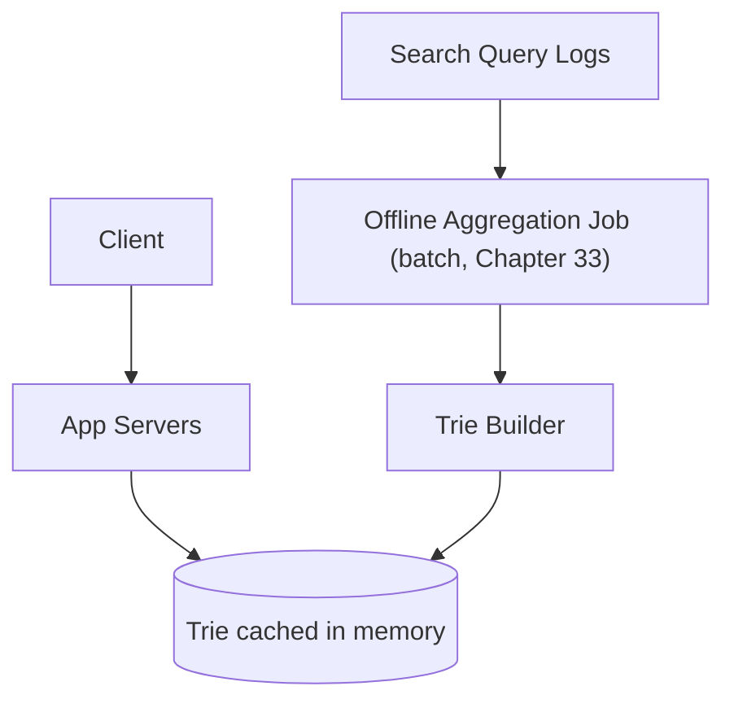
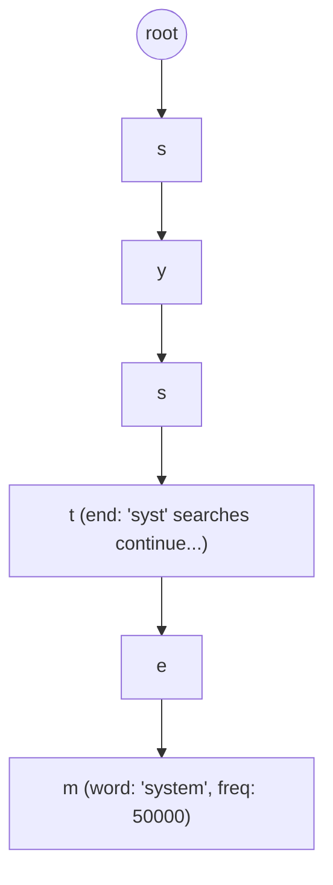
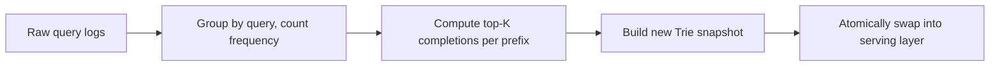

## Introduction

Search autocomplete (typeahead) is a focused, data-structure-centric case study — the core challenge is a single, well-defined algorithmic problem (efficient prefix matching) combined with a real-world twist: rankings must reflect genuine popularity, which itself requires an offline aggregation pipeline.

## Step 1: Clarify Requirements

**Functional:**
- As a user types a query prefix, return the top-K most popular completions in real time.
- Suggestions should reflect genuine search popularity (not just alphabetical order).

**Non-functional:**
- Extremely low latency — this fires on every keystroke, so even 100-200ms of added latency is perceptible and degrades the experience.
- Suggestions don't need to reflect the very latest second-by-second search activity — a data freshness lag of minutes to hours is entirely acceptable (an important, explicit eventual-consistency concession, Chapter 19).

## Step 2: Capacity Estimation

100 million searches/day generating query logs; assume the top 5-10 million distinct query prefixes need suggestion data maintained — a bounded, manageable dataset size once properly aggregated, even though raw daily search volume is large.

## Step 3: Define the API

```
GET /autocomplete?prefix=syst -> { suggestions: ["system design", "systems thinking", "systemd"] }
```

## Step 4: High-Level Architecture



## Step 5: Deep Dive — The Trie Data Structure and Offline Aggregation

### Why a Trie

A **Trie** (prefix tree) stores strings such that all strings sharing a common prefix share the same path from the root — making "find all strings starting with this prefix" an efficient traversal to the prefix's node, followed by collecting the top-K results from that subtree, rather than scanning every stored string.



```java
public class TrieNode {
    Map<Character, TrieNode> children = new HashMap<>();
    // Pre-computed top-K completions cached at each node, avoiding
    // an expensive subtree traversal on every single autocomplete request
    List<Suggestion> topKCompletions = new ArrayList<>();
}

public class AutocompleteTrie {
    private final TrieNode root = new TrieNode();

    public List<Suggestion> getSuggestions(String prefix) {
        TrieNode node = root;
        for (char c : prefix.toCharArray()) {
            node = node.children.get(c);
            if (node == null) return Collections.emptyList(); // no matches
        }
        return node.topKCompletions; // O(1) - pre-computed, not traversed at request time
    }
}
```

**Why pre-compute top-K at each node rather than traversing the subtree per request**: Traversing a potentially large subtree on every single keystroke, across potentially thousands of requests per second, would be far too slow for the sub-100ms latency requirement — pre-computing and caching the top-K completions directly at each relevant node (updated during the offline rebuild, not per request) turns each actual autocomplete request into a simple, fast tree-traversal-plus-lookup, with essentially all the real computational work shifted to the offline pipeline instead.

### Offline Aggregation Pipeline

This is where Chapter 33's batch processing concepts directly apply: a periodic (e.g., hourly) batch job aggregates raw search query logs, computes updated frequency counts for each distinct query, and rebuilds (or incrementally updates) the Trie with fresh top-K completions at each node — explicitly decoupled from the real-time serving path, since Step 1 established that a data freshness lag of minutes to hours is entirely acceptable.



**Atomic swap, not incremental in-place mutation**: Building an entirely new Trie snapshot offline and then atomically swapping it into the live serving layer (rather than mutating the live, currently-serving Trie in place) avoids ever serving a partially-updated, inconsistent Trie mid-rebuild — directly the same "build the new version fully, then cut over" principle seen in blue-green deployment strategies (Chapter 40).

## Step 6: Bottlenecks and Trade-offs

- **Trie memory footprint**: A Trie covering millions of distinct queries can require substantial memory — bounding the dataset to the top N million most-searched prefixes (rather than attempting to cover every conceivable, rarely-searched query) keeps this manageable, an explicit application of the 80/20 principle to what's actually worth caching (Chapter 9).
- **Personalization**: If suggestions should be personalized per user (recent searches, location), this requires blending the global, popularity-based Trie with a smaller, per-user layer — a meaningfully more complex extension, worth explicitly flagging as scoped out unless the interviewer asks for it.
- **New/trending queries**: A purely popularity-based, hourly-refreshed Trie is slow to surface a suddenly-trending new query (e.g., breaking news) — mitigated by a separate, faster-refreshing "trending" signal blended into results, distinct from the base Trie's slower aggregation cycle.

## Step 7: Failure Scenarios and Scaling Evolution

- **Serving-layer node failure**: Since the Trie is a read-only, precomputed, easily-replicated artifact (not a live, continuously-written store), replication (Chapter 15) across multiple serving nodes is straightforward — any replica can serve any request.
- **Offline aggregation job failure**: The currently-live Trie continues serving (based on the last successfully-completed aggregation) — a failed rebuild simply means suggestions are based on slightly older data than intended, a graceful degradation (Chapter 41) rather than an outage.
- **Scaling to multiple languages/locales**: Naturally shards by language/locale (Chapter 16) — each locale's Trie is independently built and served, since there's no meaningful cross-locale query relationship to preserve.

## Summary

- A Trie's shared-prefix structure makes "find completions for this prefix" efficient, and pre-computing top-K results at each node shifts the real computational cost to an offline pipeline, keeping the live request path extremely fast.
- Offline batch aggregation (Chapter 33) computes fresh popularity rankings periodically, explicitly trading data freshness (an acceptable minutes-to-hours lag) for a dramatically simpler, faster serving path.
- Building a new Trie snapshot and atomically swapping it into production avoids ever serving a partially-rebuilt, inconsistent structure.
- The read-only, precomputed nature of the serving-layer Trie makes replication for availability comparatively simple compared to systems with live, continuously-written state.

---

## Interview Questions

### 1. Why does pre-computing and caching the top-K completions at each Trie node specifically address this system's sub-100ms latency requirement, compared to computing top-K on demand per request?
**Answer:** Computing top-K completions on demand would require, for every single autocomplete request, traversing the entire subtree beneath the matched prefix node, collecting and ranking every single completion found there by frequency — for a popular, short prefix with potentially thousands of possible completions branching beneath it, this traversal-and-ranking work could take meaningfully longer than the sub-100ms budget allows, especially at high request volume (every keystroke, from potentially many concurrent users). Pre-computing this top-K result once, during the offline aggregation/rebuild process, and simply storing/caching it directly at each relevant node means an actual live request only needs to perform the (fast) prefix-traversal down to the matching node and then a simple, already-computed list lookup — turning what would otherwise be an expensive, per-request computation into a cheap, essentially O(1) lookup relative to the prefix length, directly enabling the sub-100ms latency target even under high concurrent request load.

**Follow-up:** *What's the storage cost trade-off of this pre-computation approach, and why is it generally considered worthwhile here?* — Storing a pre-computed top-K list at every single node in the Trie (rather than only at "leaf" or word-ending nodes) means some redundant storage, since the same underlying completions may be referenced by the pre-computed lists of many different ancestor-prefix nodes along the path to them; this additional memory cost is generally considered worthwhile because memory is comparatively cheap and the resulting latency improvement (avoiding expensive per-request subtree traversal/ranking) directly serves the system's explicitly-stated, high-priority sub-100ms latency requirement — a direct, deliberate trade of memory for latency, consistent with this series' repeated theme (Chapters 9-10) that this specific trade-off is often well worth making when latency is the dominant, explicitly-prioritized concern.

### 2. Explain why this system's architecture treats data freshness (how quickly a newly-popular search term appears in suggestions) as an acceptable, explicit trade-off rather than a strict requirement, and how this shapes the overall design.
**Answer:** As established explicitly in Step 1, autocomplete suggestions reflecting search popularity from, say, an hour ago (rather than the very latest, real-time second-by-second activity) causes no meaningful, perceptible harm to the actual user experience — a user typing a common search prefix is well-served by suggestions based on genuinely popular historical patterns, and doesn't need or expect these suggestions to reflect search activity from the literal past few seconds; explicitly establishing this acceptable staleness tolerance (an eventual-consistency trade-off, Chapter 19) directly justifies and enables the entire offline batch-aggregation architecture (Chapter 33) — if instead real-time freshness were a hard requirement, this system would need a fundamentally different, much more complex real-time stream-processing architecture (continuously updating the Trie as queries stream in) rather than the simpler, more efficient periodic batch-rebuild-and-swap approach this chapter actually proposes — this is a clear, direct illustration of how an early, explicit requirements decision (Step 1) cascades into and fundamentally shapes a much later, more concrete architectural choice (Step 5).

**Follow-up:** *How does the "trending queries" mitigation discussed in Step 6 partially reintroduce some of this real-time freshness concern, without abandoning the overall batch-based architecture?* — Rather than making the *entire* system real-time (a significant architectural overhaul), the trending-queries mitigation adds a small, separate, faster-refreshing signal specifically for detecting and surfacing genuinely rapid, unusual spikes in search volume for a *specific* query (e.g., breaking news) — this narrow, targeted addition (perhaps itself a lightweight stream-processing component, Chapter 33, operating alongside the primary batch pipeline) addresses the specific real-world gap the pure hourly-batch approach has, without requiring the wholesale abandonment of the simpler, more efficient batch architecture for the vast majority of "normal," non-trending query traffic — illustrating a hybrid approach where most of the system optimizes for simplicity/efficiency under an accepted trade-off, while a small, specifically-scoped addition addresses the trade-off's one significant, real-world limitation.

### 3. Why does this case study specifically recommend building a completely new Trie snapshot and atomically swapping it into the serving layer, rather than incrementally updating the live, currently-serving Trie in place?
**Answer:** Incrementally mutating a live, currently-serving Trie in place (updating frequency counts and top-K lists node by node as the offline aggregation processes new data) risks a live autocomplete request being served in the middle of this in-progress update — potentially seeing an inconsistent, partially-updated view of the data (e.g., a top-K list that reflects updated frequencies for some but not yet all of its potential completions, producing subtly incorrect or oddly-ordered results); building an entirely new, complete Trie snapshot offline (where consistency during construction doesn't matter, since it's not yet serving any live traffic) and then performing a single, atomic swap of the serving layer's reference from the old Trie to the fully-completed new one ensures that live requests always see either the complete old version or the complete new version, never an inconsistent, partially-updated in-between state — directly mirroring the same "build fully, then cut over atomically" principle underlying blue-green deployments (Chapter 40), just applied here to a data structure swap rather than an infrastructure/application deployment.

**Follow-up:** *What's a practical implementation consideration for making this "atomic swap" actually work correctly at the code level, given that many requests might be actively reading the old Trie at the exact moment the swap occurs?* — A common approach uses an atomic reference/pointer (e.g., Java's `AtomicReference<Trie>`) that the serving code reads from for every request — the offline rebuild process constructs the entirely new Trie object fully in memory (without affecting anything currently being served), and then performs a single atomic pointer-swap operation to update this reference to point at the new Trie — any request that had already begun reading from the old Trie object continues safely with that old, still-valid (if slightly outdated) object, while any request arriving after the swap reads the new reference and gets the new Trie — since the swap itself is a single, atomic pointer update rather than a series of individual in-place mutations, there's no window where a request could observe a genuinely inconsistent, half-old-half-new state.

### 4. Why might a naive candidate's suggestion to "just use a SQL query with a LIKE 'prefix%' clause" for autocomplete be a weaker answer than proposing a Trie, connecting to Chapter 14's indexing material?
**Answer:** While a `LIKE 'prefix%'` query with a B-Tree index (Chapter 14) on the relevant text column CAN actually be reasonably efficient for prefix matching (since a B-Tree's sorted structure does support efficient prefix-range queries, unlike a `LIKE '%suffix'` pattern which cannot leverage an index the same way), this approach still requires the database to be queried on every single autocomplete request, and would need additional logic/query complexity to also compute and return only the top-K results ranked by popularity/frequency (likely requiring an additional `ORDER BY frequency DESC LIMIT K` on top of the prefix filter) — at high request volume (every keystroke, across many concurrent users), repeatedly hitting a database (even an efficiently-indexed one) for this specific, extremely latency-sensitive operation is generally a heavier, slower path compared to an in-memory Trie structure specifically designed and pre-computed for exactly this "top-K completions for a prefix" access pattern — the Trie approach shifts virtually all the computational cost to an offline process, leaving the live path with almost no real computation at all, a meaningfully stronger fit for this specific system's stringent sub-100ms latency requirement than a database-query-per-keystroke approach, even a well-indexed one.

**Follow-up:** *Is there a legitimate scenario where the simpler SQL-based approach might actually be an acceptable, even preferable, choice over building a custom Trie?* — For a much smaller-scale system (a modest internal tool, or an application with a comparatively small, bounded set of possible search terms and much lower request volume/less stringent latency requirements than this case study's stated sub-100ms, high-traffic scenario), the SQL-based approach's much greater implementation simplicity (no need to build, maintain, and periodically rebuild a custom Trie data structure and its associated offline pipeline) could reasonably outweigh the Trie's latency advantage, especially if that latency advantage isn't actually needed to meet the specific, more modest requirements of that smaller-scale context — again illustrating this series' recurring theme that the "better" technical solution depends genuinely on the specific, stated scale and requirements, not a universal ranking of techniques independent of context.

### 5. In a system design interview, if asked "how would you extend this design to support personalized autocomplete suggestions based on a user's own recent search history," how would you approach this while preserving the core architecture established in this chapter?
**Answer:** You'd propose layering a small, per-user personalization component on top of the existing global, popularity-based Trie, rather than replacing the core architecture entirely — for example, maintaining a small, separate, per-user recent-search cache (a simple, bounded list of that specific user's own recent queries, stored in a fast key-value store like Redis, Chapter 9) and, at request time, blending/merging a small number of relevant entries from this per-user cache with the results from the global Trie (e.g., showing the user's own relevant recent searches first, followed by the broader, global popularity-ranked suggestions) — this preserves the core Trie's efficiency and simplicity for the bulk of the "what's generally popular" ranking work, while adding a comparatively lightweight, clearly-scoped additional lookup specifically for the personalization layer, rather than needing to build and maintain a genuinely separate, full Trie structure per individual user (which would be a dramatically more expensive, likely impractical approach given the potentially enormous number of distinct users).

**Follow-up:** *Why would building a genuinely separate, full Trie per individual user be impractical at scale, connecting back to this chapter's Step 6 discussion of Trie memory footprint?* — Step 6 already established that even a single, shared, global Trie covering the top few million most-popular queries has a non-trivial memory footprint requiring careful management/bounding — multiplying this by potentially hundreds of millions of individual users (each needing their own separate, full Trie structure) would represent an utterly impractical, many-orders-of-magnitude larger total memory requirement across the system, far exceeding what's reasonably achievable — this is precisely why the recommended approach instead keeps the expensive, shared computational/memory investment (the global Trie) genuinely shared across all users, and confines the necessarily-per-user-specific data (their own individual recent search history) to a much smaller, individually-bounded, and therefore practically scalable per-user data structure, rather than attempting to scale the expensive shared structure itself to a per-user granularity.
