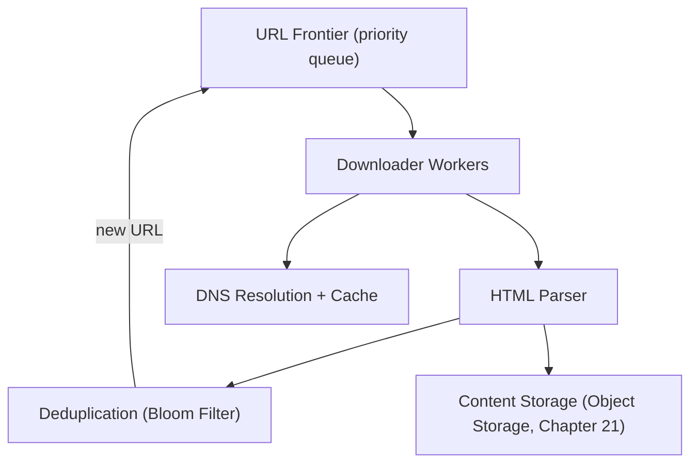
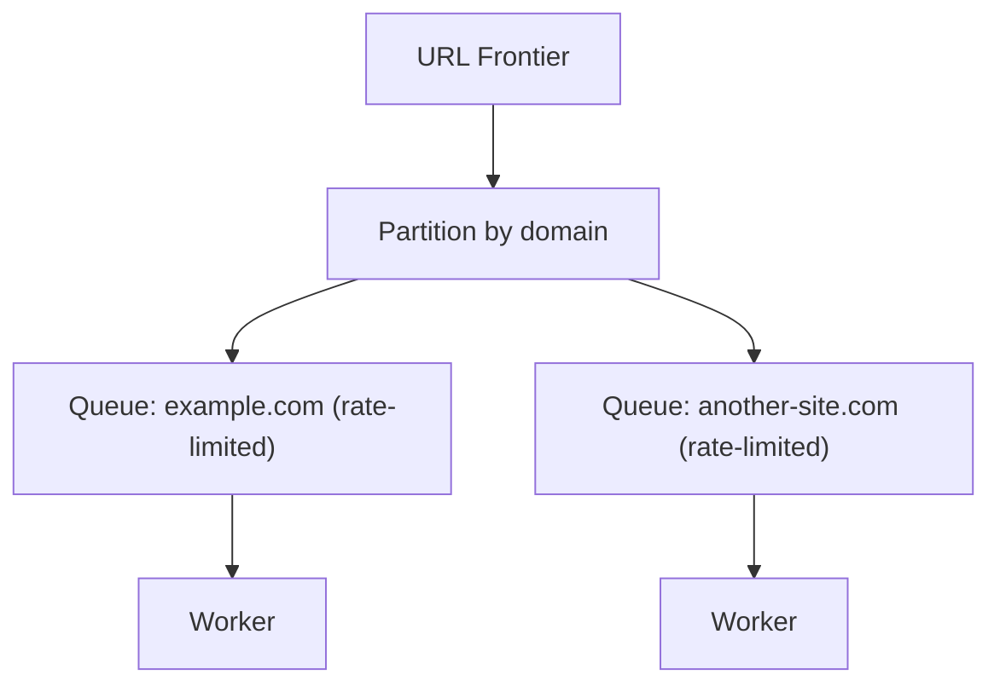

## Introduction

A web crawler is a distinctive case study: unlike most systems in this series, its "clients" are the web pages themselves — there's no human waiting on a response, which fundamentally changes the latency/throughput calculus and introduces a genuinely unique concern: being a well-behaved citizen of the sites being crawled.

## Step 1: Clarify Requirements

**Functional:**
- Given a set of seed URLs, crawl and download web pages, extract links, and continue crawling discovered pages.
- Avoid re-crawling the same page redundantly within some time window.
- Respect `robots.txt` and avoid overwhelming any single website ("politeness").

**Non-functional:**
- Extremely high throughput at the aggregate level (billions of pages) — but individual page fetches are not latency-sensitive the way a user-facing request is; **throughput, not per-request latency, is the dominant metric**, a genuine inversion of most other case studies in this series.
- Scalability to the size of the actual web (effectively unbounded, growing continuously).

## Step 2: Capacity Estimation

Target: crawl 1 billion pages/month → ~385 pages/second average. Assume average page size 500KB → ~190MB/second sustained bandwidth, and roughly 1 billion URLs needing deduplication tracking at any given time — directly motivating this chapter's Bloom filter deep dive (Chapter 25).

## Step 3: Define the "API" (Internal Interfaces, Not User-Facing)

This system has no external, user-facing API — its "interface" is internal, between its own components:

```
URL Frontier: dequeue() -> next URL to crawl
Downloader: fetch(url) -> raw HTML
Parser: extract(html) -> list of discovered URLs + content
```

## Step 4: High-Level Architecture



## Step 5: Deep Dive — The URL Frontier and Politeness

### Deduplication with a Bloom Filter

Given the estimated ~1 billion+ URLs, tracking "have we already crawled this?" with an exact structure (like a `HashSet`) would require prohibitive memory (Chapter 25). A **Bloom filter** provides this check with a small, fixed memory footprint, accepting a small, tunable false-positive rate (occasionally, and acceptably, skipping a genuinely new URL that the filter mistakenly flags as already-seen) — directly the use case Chapter 25 specifically named for web crawlers.

```java
// Reusing the BloomFilter from Chapter 25 directly
BloomFilter crawledUrls = new BloomFilter(2_000_000_000, 7); // sized for ~1B+ URLs

public boolean shouldCrawl(String url) {
    if (crawledUrls.mightContain(url)) {
        return false; // likely already crawled (or a rare false positive - acceptable)
    }
    crawledUrls.add(url);
    return true;
}
```

### The Politeness Problem

A crawler with many parallel downloader workers could easily send hundreds of simultaneous requests to the *same* website if URLs aren't carefully distributed — overwhelming that specific site's servers, a self-inflicted, unintentional denial-of-service (directly the DDoS concern from Chapter 45, just self-caused rather than malicious).



**Solution**: Partition the URL frontier by domain, with each domain's queue independently rate-limited (Chapter 26's token bucket, applied here as an *outbound*, courtesy-driven rate limit rather than a defensive, inbound one — directly echoing Chapter 52's outbound rate-limiting discussion) — ensuring no single website ever receives more than a small, respectful number of concurrent requests, regardless of how many total crawler workers exist system-wide.

### Prioritization

Not all pages are equally valuable to crawl (or re-crawl) promptly — a **priority queue** structure for the URL frontier allows prioritizing high-value pages (frequently-updated news sites, high-PageRank pages) over low-value ones (rarely-changing, low-traffic pages), directly analogous to the general priority-queue-based scheduling concepts that will reappear in Chapter 61's job scheduler case study.

## Step 6: Bottlenecks and Trade-offs

- **DNS resolution latency**: Resolving a new domain's IP address (Chapter 3) for every single page on that domain would be wasteful — a DNS cache (Chapter 9's caching principles, applied to DNS lookups specifically) avoids redundant resolution for pages on already-recently-resolved domains.
- **Malicious/malformed content**: Crawlers must defend against crawler traps (infinite link loops), oversized responses, and malformed HTML — treating every fetched page as untrusted input requiring careful, bounded parsing (Chapter 45's general "never trust external input" principle, applied here to web content rather than API request bodies).
- **Storage growth**: Billions of crawled pages require massive object storage (Chapter 21) — with a practical retention/refresh policy, since stored content itself becomes stale and needs periodic re-crawling and replacement, not indefinite accumulation.

## Step 7: Failure Scenarios and Scaling Evolution

- **Downloader worker failure**: Since URLs are dequeued from a durable frontier queue (not held only in a worker's local memory), a crashed worker's in-progress URL simply becomes available for another worker to pick up — directly the same durable-queue-based resilience pattern from Chapter 30.
- **A specific website going down or blocking the crawler**: The per-domain rate limiter and circuit breaker (Chapter 36) around that domain's queue prevents wasted, repeated failed attempts from consuming crawler resources that could be better spent on other, healthy domains.
- **Scaling to prioritize freshness for rapidly-changing sites** (like news): This evolves the priority queue's scoring function to weight update-frequency more heavily, an incremental refinement of the existing prioritization mechanism rather than a new architectural component.

## Summary

- A web crawler inverts the usual latency/throughput priority of most case studies in this series — aggregate throughput across billions of pages matters far more than any single page fetch's latency.
- Bloom filters (Chapter 25) solve the massive-scale URL-deduplication problem with a small, fixed memory footprint, accepting a tunable false-positive rate.
- Politeness (per-domain rate limiting) prevents the crawler from becoming an unintentional, self-inflicted DDoS attacker against the sites it crawls — an outbound application of Chapter 26's rate-limiting algorithms.
- A durable, priority-ordered URL frontier, partitioned by domain, is the system's central coordinating structure, directly enabling both politeness and content-freshness prioritization.

---

## Interview Questions

### 1. Why is "throughput, not per-request latency" specifically identified as the dominant metric for a web crawler, in contrast to nearly every other case study in this series?
**Answer:** In user-facing systems (chat, news feed, e-commerce), a human is directly, actively waiting for each specific response, making individual request latency a primary, directly-experienced quality metric; a web crawler's "requests" (fetching individual web pages) have no human waiting on any single specific page's fetch completion — what actually matters for the crawler's overall mission (comprehensively covering as much of the web as possible, as efficiently as possible) is the aggregate rate at which it can successfully crawl pages across its entire fleet of workers over time, not how quickly any one specific, individual page fetch completes; this fundamental difference in what's actually being optimized for (aggregate throughput across billions of independent, non-time-sensitive operations, versus individual, human-perceived response latency) directly explains why this case study's architecture prioritizes horizontal scaling of parallel workers and efficient work-distribution (the URL frontier) over the kind of low-latency-focused techniques (aggressive caching of individual responses, CDN-style edge delivery) that dominated latency-sensitive case studies like the URL shortener or distributed cache.

**Follow-up:** *Does this mean latency is completely irrelevant to this system's design, or are there still specific places where it matters?* — Latency isn't entirely irrelevant — DNS resolution latency (mentioned in Step 6) still matters in the sense that reducing it (via caching) improves the overall rate at which individual workers can process pages, indirectly contributing to the aggregate throughput goal; the key distinction is that latency here matters only insofar as it affects aggregate throughput efficiency, not as a directly user-perceived quality metric in its own right — this is a subtly different framing of "why latency matters" compared to the direct, human-experienced latency concerns of the other case studies in this series.

### 2. Explain why a Bloom filter is specifically well-suited to the URL-deduplication problem in this case study, directly connecting to the false-positive-rate discussion from Chapter 25.
**Answer:** As established in Chapter 25, a Bloom filter provides a memory-efficient way to answer "have I seen this before" at massive scale, at the cost of a tunable, small false-positive rate (occasionally, incorrectly reporting "yes, seen before" for something that was never actually added) while guaranteeing zero false negatives; for web crawling specifically, the consequence of a false positive is: the crawler skips crawling a URL that was actually genuinely new, simply because the Bloom filter incorrectly flagged it as already-seen — this is a real but generally acceptable cost (the crawler misses out on discovering/indexing that one specific page, a minor, tolerable loss relative to comprehensively crawling billions of other pages), whereas a false negative would be a correctness catastrophe (Chapter 25 correctly notes Bloom filters can never produce these) — since correctness in the "never say a genuinely-new URL is old" direction is guaranteed, and the actual real-world cost of the tolerated false-positive direction (occasionally, rarely missing a genuinely new page) is low and acceptable, this maps precisely onto the specific risk-tolerance profile Chapter 25 identified as making Bloom filters appropriate, distinguishing it from use cases (like the security-critical session-token example in Chapter 25) where this same false-positive risk would be unacceptable.

**Follow-up:** *How would you decide on an appropriate false-positive rate (and correspondingly, Bloom filter size) for this specific crawler use case?* — This requires weighing the actual cost of missing a small percentage of genuinely-new URLs (a bounded, generally low-stakes cost for a crawler aiming for broad, not perfectly complete, web coverage) against the memory cost of a larger, more accurate Bloom filter (per Chapter 25's `m`/`k`/`n` sizing trade-off discussion) — a reasonable target might accept a modest false-positive rate (e.g., 1%) if the resulting memory savings are substantial and the crawler's overall mission doesn't require perfect, guaranteed completeness — a search engine specifically prioritizing comprehensive coverage of a narrower, high-value domain set might reasonably choose a lower false-positive rate (larger filter) for that narrower use case, while a broader, more exploratory crawler might accept a higher rate in exchange for covering more total ground with the same memory budget.

### 3. Why is the "politeness" problem described as a form of "self-inflicted, unintentional DDoS," and why does the mitigation directly reuse Chapter 26's rate-limiting algorithms in an unusual, outbound direction?
**Answer:** A crawler with many parallel workers, if not carefully coordinated, could easily send a large volume of near-simultaneous requests to the same specific website (simply because that website happens to have many URLs discovered and queued for crawling around the same time) — from that target website's own perspective, this influx of many rapid, concurrent requests from the crawler is functionally indistinguishable from an actual denial-of-service attack (Chapter 45), even though the crawler has no malicious intent at all; it's "self-inflicted" in the sense that the crawler itself, through its own uncoordinated parallel operation, could inadvertently cause this harm to a third party. The mitigation reuses Chapter 26's rate-limiting algorithms (token bucket, etc.) but applied in an unusual, outbound direction — rather than protecting the crawler's *own* infrastructure from *incoming* abusive traffic (the algorithms' original, more common framing in Chapter 26), here the crawler applies the same algorithms to deliberately *throttle its own outbound* request rate *to each specific target website*, ensuring it behaves as a well-mannered, non-overwhelming visitor to every site it crawls — directly the same "outbound rate limiting toward a dependency" pattern already seen in Chapter 52's third-party-provider rate limiting, just with a different underlying motivation (courtesy/non-abuse, rather than avoiding being throttled/banned by the target).

**Follow-up:** *Why must this politeness rate limiting be applied per-domain specifically, rather than as a single, global rate limit across the crawler's entire total request volume?* — A single, global rate limit (e.g., "the entire crawler fleet sends no more than 10,000 requests/second in total, across all target websites combined") would do nothing to prevent that entire global allowance from being concentrated disproportionately onto a single specific target website at any given moment — the actual harm (overwhelming one specific site) is a property of *concentration on that one specific site*, not of the crawler's total aggregate volume across all sites combined; only a per-domain-scoped rate limit (ensuring no single domain individually receives more than a small, respectful number of requests, regardless of the crawler's total global throughput elsewhere) actually addresses the real, specific harm politeness is meant to prevent.

### 4. Why does the URL frontier need to be a durable, external structure (like a persistent queue) rather than simply an in-memory queue held by a single coordinating process?
**Answer:** Given the massive number of downloader worker instances needed to achieve this system's target throughput (Step 2's ~385 pages/second average, likely requiring many parallel workers, especially accounting for realistic network latency per individual fetch), and the need for this work to continue reliably over extended periods (crawling billions of pages is not a quick, one-off task) — a durable, external queue structure (directly the message-queue infrastructure from Chapter 30) ensures that if any individual downloader worker crashes mid-fetch, the specific URL it was working on isn't lost entirely; it simply remains available (or becomes available again, depending on the specific delivery/visibility mechanics, echoing Chapter 30's SQS visibility-timeout discussion) for another healthy worker to pick up and complete — an in-memory queue held by a single coordinating process would represent both a single point of failure (that process crashing would lose the entire frontier's current state) and a potential scalability bottleneck (a single process managing work distribution for potentially many hundreds of parallel workers).

**Follow-up:** *Why does the priority-queue aspect of the frontier (prioritizing high-value pages) add complexity beyond what a simple, standard message queue (like a basic FIFO SQS queue) typically provides?* — Standard message queue implementations (like basic SQS or simple Kafka topic consumption) are generally optimized for simple FIFO or partition-ordered delivery, not for dynamically re-prioritizing which specific queued item should be dequeued next based on a continuously-changing priority score (e.g., a page's estimated importance, or how much time has elapsed since it was last crawled) — implementing a genuinely priority-aware frontier at this scale typically requires either a specialized priority-queue-supporting data store, or a more custom architecture (e.g., multiple separate queues/partitions representing different priority tiers, with workers configured to preferentially drain higher-priority tiers first) — this added complexity is a direct, necessary consequence of the specific requirement (Step 5) to prioritize some pages over others, beyond what a simpler, priority-agnostic queue would naturally support.

### 5. In a system design interview, if asked "how would you handle a website that returns a valid HTTP response but with an infinite loop of auto-generated links (a crawler trap)," how would you address this using this chapter's material?
**Answer:** You'd first note that a crawler trap essentially represents a malicious or accidental instance of the "never trust external input" principle discussed in Step 6 — the crawler cannot assume that a website's linked structure is well-formed, finite, or genuinely useful to fully explore. Practical mitigations include: setting a maximum crawl depth or maximum number of pages crawled per specific domain within a given time period (directly extending the per-domain rate-limiting/politeness infrastructure already in place, but now bounding total volume per domain, not just request rate, specifically to detect and cap suspiciously large or infinitely-expanding sections of a single site); detecting suspiciously repetitive URL patterns (e.g., URLs that only differ by an incrementing, seemingly-arbitrary parameter, suggesting programmatically-generated, likely-low-value infinite variations rather than genuinely distinct, valuable content) and applying additional scrutiny or lower priority to such patterns; and potentially using content-similarity detection (if many "different" URLs on a domain return highly similar or identical content, this is a signal of a likely trap or low-value duplication, warranting reduced crawl priority for that pattern going forward).

**Follow-up:** *Why might relying solely on the Bloom-filter-based deduplication discussed earlier in this chapter be insufficient to fully address a crawler trap generating unique, never-before-seen URLs?* — The Bloom filter deduplication specifically prevents re-crawling URLs that have *already* been seen before — but a crawler trap generating a genuinely infinite stream of *unique*, never-before-seen URLs (e.g., through an ever-incrementing parameter or timestamp embedded in each generated link) would never trigger the "already seen" deduplication check at all, since each generated URL is, in the Bloom filter's view, genuinely new every single time — this illustrates why deduplication alone is insufficient to fully address this specific threat, and why the additional, distinct mitigations discussed above (depth/volume limits, pattern detection) are necessary as a complementary defense specifically targeting this different failure mode (infinite unique-URL generation) that simple "have I seen this exact URL before" deduplication cannot, by its very nature, catch on its own.
