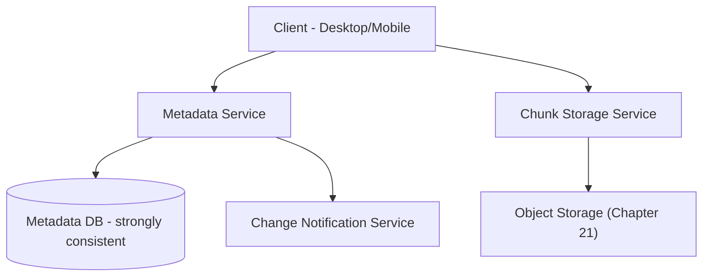
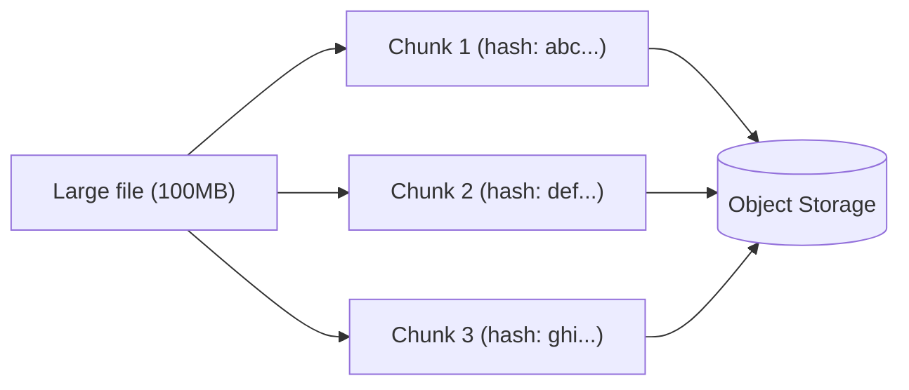

## Introduction

A Dropbox/Google-Drive-like system directly applies Chapter 21's object-storage material, but adds a genuinely new dimension: keeping a file synchronized and consistent across multiple devices a single user owns, including efficiently handling *changes* to large files.

## Step 1: Clarify Requirements

**Functional:**
- Upload, download, and sync files across multiple devices for a single user.
- Efficiently handle edits to large files (don't re-upload the entire file for a small change).
- File versioning/history.

**Non-functional:**
- Strong consistency for metadata (a file's name, location, permissions) to avoid confusing sync conflicts; the actual file content can tolerate brief propagation delay across devices.
- Bandwidth efficiency is a first-class concern — many users have limited upload bandwidth, and re-uploading entire large files for small edits is wasteful and slow.

## Step 2: Capacity Estimation

100 million users, average 10GB stored per user → 1 exabyte of total storage — a scale that immediately confirms object storage (Chapter 21), not a traditional file system or database, is the only sensible choice for the actual file content.

## Step 3: Define the API

```
POST /files/upload          (chunked upload)
GET  /files/{fileId}/download
GET  /files/{fileId}/versions
POST /sync/changes           (client polls or subscribes for changes since last sync)
```

## Step 4: High-Level Architecture



**Separating metadata from content** (directly Chapter 21's core lesson): the Metadata Service (tracking file names, folder structure, permissions, version history) uses a traditional, strongly-consistent database (Chapter 17), while actual file content lives in object storage — the same "store the reference in the database, the blob in object storage" pattern from Chapter 21's anti-pattern discussion, now the central architectural decision rather than a footnote.

## Step 5: Deep Dive — Chunking and Efficient Sync

### File Chunking

Rather than treating a file as one large, indivisible blob, it's split into fixed-size **chunks** (e.g., 4MB each), each independently content-hashed and stored.



**Why chunking enables efficient sync**: When a user edits a large file, typically only a small portion of it actually changes. By comparing the new file's chunk hashes against the previously-uploaded version's chunk hashes, the client only needs to upload the chunks that actually changed — directly analogous to Chapter 24's Merkle-tree-based anti-entropy discussion (comparing hashes to identify differences efficiently, rather than transferring or comparing entire datasets).

```java
public List<Chunk> identifyChangedChunks(File newVersion, List<String> previousChunkHashes) {
    List<Chunk> newChunks = chunker.split(newVersion, CHUNK_SIZE);
    return newChunks.stream()
        .filter(chunk -> !previousChunkHashes.contains(chunk.getHash()))
        .collect(Collectors.toList());
    // Only these changed chunks need to actually be uploaded
}
```

**Deduplication as a natural side effect**: Since chunks are content-addressed (identified by their hash, not their position), identical chunks appearing across *different* files (or the same file uploaded by different users) can be stored just once and referenced multiple times — a direct, valuable storage-savings side effect of the same content-hashing mechanism used for efficient sync.

### Change Notification and Conflict Handling

When a file changes on one device, other devices need to learn about it — a natural application of Chapter 31's pub-sub pattern, with each connected device subscribing to changes for the files/folders it has synced locally.

**Conflict handling**: If the same file is edited offline on two different devices before either syncs, a genuine write conflict exists — directly Chapter 15's multi-leader replication conflict scenario, resolved here (as many real systems do) by keeping both versions as separate files (e.g., "document.docx" and "document (conflicted copy from Device B).docx") rather than attempting an automatic, potentially-incorrect merge of arbitrary binary content — a pragmatic, product-level resolution strategy given that generic, content-agnostic automatic merging (unlike a CRDT-based approach for a specific, well-understood data type, Chapter 15) isn't reliably possible for arbitrary file types.

## Step 6: Bottlenecks and Trade-offs

- **Chunk size trade-off**: Smaller chunks enable more granular, bandwidth-efficient sync (only re-uploading truly-changed portions) but increase metadata overhead (more chunks to track per file) and per-chunk request overhead; larger chunks reduce this overhead but make sync less granular (a small edit might still require re-uploading a larger chunk containing it) — a genuine, tunable trade-off similar in spirit to earlier chapters' block-size/granularity discussions.
- **Metadata database as a potential bottleneck**: Given the strong-consistency requirement, this is a natural candidate for read replicas (Chapter 15) to handle the read-heavy "check for changes" polling/sync traffic, while writes (actual file changes) remain centralized for consistency.
- **Large file initial upload**: Chunked, resumable uploads (allowing an interrupted upload to resume from the last successfully-uploaded chunk, rather than restarting entirely) directly apply idempotency principles (Chapter 28) to the upload process itself.

## Step 7: Failure Scenarios and Scaling Evolution

- **Upload interrupted mid-transfer**: Resumable, chunk-based uploads mean only the remaining, not-yet-uploaded chunks need to be retried — not the entire file.
- **Metadata Service failure**: Since it's the strongly-consistent source of truth for file structure/permissions, this requires the same rigorous replication/failover approach (Chapters 15, 23) as any other critical, correctness-sensitive database — an outage here should degrade sync/access, not corrupt file relationships.
- **Scaling to real-time collaborative editing** (like Google Docs): A substantial evolution beyond simple file sync, likely requiring operational transformation or CRDT-based techniques (Chapter 15's CRDT discussion, applied here to genuinely concurrent, fine-grained document edits rather than whole-file conflict avoidance) — explicitly a different, harder problem than this chapter's core file-sync design.

## Summary

- Separating strongly-consistent metadata (file structure, permissions) from content stored in object storage (Chapter 21) is the foundational architectural decision.
- Content-addressed chunking enables both bandwidth-efficient incremental sync (only uploading changed chunks) and natural deduplication, directly extending the hash-comparison principle from Chapter 24's anti-entropy discussion.
- Conflicting concurrent edits across devices are pragmatically resolved by preserving both versions as separate files, rather than attempting unreliable automatic merging of arbitrary content.
- Resumable, chunked uploads apply idempotency principles to make large-file uploads resilient to interruption.

---

## Interview Questions

### 1. Why does content-addressed chunking (identifying chunks by their hash rather than their position in the file) enable both efficient sync AND deduplication as a single, unified mechanism?
**Answer:** By identifying each chunk specifically by a hash of its actual content (rather than, say, "chunk number 5 of file X"), the system gains a content-based, position-independent way to recognize when two chunks — whether from two different versions of the same file, or entirely different files altogether — are actually identical: if their hashes match, their content is (for all practical purposes) identical. This single property directly enables two distinct benefits simultaneously: efficient sync (comparing a new file version's chunk hashes against the previous version's hashes immediately reveals exactly which specific chunks have genuinely changed and need re-uploading, versus which are unchanged and can be skipped) and deduplication (if a chunk with a given hash already exists in storage — whether from this same file's earlier version, or a completely unrelated file uploaded by a different user — it never needs to be stored again, since the existing copy can simply be referenced) — both benefits emerge naturally from the same underlying content-addressing mechanism, rather than requiring two separate, independently-implemented systems.

**Follow-up:** *What privacy or security consideration might content-addressed, cross-user deduplication raise, and how might a system need to address it?* — If two different, unrelated users both upload files containing identical content (e.g., both save the same publicly-available PDF, or, more concerning, both happen to possess the same non-public but identical file), a naive cross-user deduplication scheme storing only one shared copy could, in principle, create subtle information-leakage risks or complications around per-user access control and encryption (e.g., if files are encrypted with per-user keys before chunking, identical plaintext content would actually produce different encrypted chunk hashes per user, naturally preventing cross-user deduplication at the chunk level unless deliberately designed otherwise) — a system needs to make a deliberate, explicit choice here: whether to support cross-user deduplication at all (accepting the added complexity of ensuring this doesn't create any actual access-control or information-leakage issue), or to scope deduplication only within a single user's own files (simpler, avoiding this cross-user consideration entirely, at the cost of missing the storage savings that broader, cross-user deduplication could otherwise provide).

### 2. Explain why keeping both versions as separate files ("conflicted copy") is described as a "pragmatic" conflict-resolution strategy, rather than attempting automatic merging as some database replication systems do (Chapter 15).
**Answer:** Chapter 15's CRDT-based automatic-merge techniques work specifically because they're designed for data types with well-understood, well-defined merge semantics (e.g., a counter, where merging means summing independent increments, or a set, where merging means taking the union) — a generic file storage system, by contrast, must handle *arbitrary* file types and content (text documents, spreadsheets, images, videos, proprietary binary formats) with no generic, universally-correct way to meaningfully "merge" two independently, concurrently-edited versions of arbitrary binary content — attempting to automatically merge, say, two conflicting edits to an image file or a proprietary binary format has no sensible, generally-correct definition at all, and even for more structured formats like text documents, a naive automatic merge risks silently producing corrupted or nonsensical combined content that neither user actually intended; preserving both versions as separate files sidesteps this fundamentally unsolvable general-case problem by making the conflict visible and explicit to the user, who has the actual context needed to correctly decide how (or whether) to reconcile the two versions themselves — a pragmatic acknowledgment of a genuine technical limitation rather than an attempt at a technically elegant, but practically unreliable, universal solution.

**Follow-up:** *Why might a specific, well-known file format like a shared spreadsheet potentially warrant a different, more sophisticated conflict-resolution approach than this generic "keep both copies" strategy?* — A spreadsheet has enough internal, well-understood structure (individual cells, each independently addressable) that, similar to how a CRDT can be designed for a specific, well-understood data type, a format-aware merge strategy could potentially compare individual cell-level changes between the two conflicting versions and automatically merge non-overlapping cell edits (e.g., if User A edited cell A1 and User B independently edited cell B2, both changes could reasonably, automatically be combined without conflict) — this represents exactly the kind of format-specific, deliberately-designed merge logic Chapter 15 discussed as a legitimate but more effort-intensive alternative to the generic Last-Write-Wins or "keep both" fallback, appropriate specifically when a particular, well-understood, structured format justifies the additional engineering investment, rather than being applied as a universal default across every arbitrary file type the broader storage system needs to support.

### 3. Why must the Metadata Service specifically prioritize strong consistency, while the actual file content synchronization can tolerate more relaxed, eventual consistency, per Step 1's requirements?
**Answer:** Metadata (a file's name, its location within the folder hierarchy, sharing/permission settings) directly determines what a user sees and can access when browsing their files — if two devices briefly disagreed about a file's current name or location due to weak, eventually-consistent metadata, this could produce confusing, potentially data-endangering situations (e.g., a user might not realize a file was moved/renamed on another device and could accidentally create a duplicate, or might believe they've lost access to a file that was actually just relocated) — strong consistency for this specific, comparatively small and infrequently-changing metadata ensures all devices have a single, reliably up-to-date, unambiguous view of the file structure at all times. The much larger volume of actual file *content* data, by contrast, can tolerate the file's fully-synced content taking a few extra seconds or longer to propagate across all of a user's devices without causing this same kind of confusing, structurally-ambiguous experience — a user editing a document on their laptop doesn't need that edit to be instantaneously, synchronously reflected on their phone; they just need it to reliably arrive eventually, making eventual consistency an entirely acceptable, and far more scalable/efficient, choice specifically for the bulk content-sync path.

**Follow-up:** *Why might this distinction (strong consistency for metadata, eventual consistency for content) make the Metadata Service a comparatively more challenging component to scale than the Chunk Storage Service, connecting to Chapters 15-19?* — Strong consistency inherently requires more coordination overhead (whether through synchronous replication, quorum-based writes, or similar mechanisms discussed in Chapters 15 and 23) compared to a system that can freely accept eventual consistency's more relaxed, less-coordinated replication approach — this means the Metadata Service, despite handling a comparatively smaller volume of actual data than the massive-scale object storage layer, faces a genuinely harder scaling challenge specifically because of its strong-consistency requirement, directly illustrating Chapter 18's PACELC principle that consistency requirements (not just raw data volume) are often the dominant factor determining a component's actual scaling difficulty and achievable latency, independent of that component's absolute data size.

### 4. Why does a chunked, resumable upload mechanism directly apply the idempotency principles from Chapter 28, and what specific failure scenario does this address?
**Answer:** A large file upload interrupted partway through (due to a network drop, an app being closed, or any other transient interruption) represents exactly the kind of ambiguous-outcome scenario Chapter 28 addresses — the client doesn't necessarily know which specific chunks were successfully received and stored by the server before the interruption occurred; a resumable upload mechanism must be able to safely retry/resume without either skipping chunks that were genuinely never received (causing file corruption) or redundantly re-uploading chunks that were already successfully received (wasting bandwidth, directly undermining this system's stated bandwidth-efficiency priority from Step 1) — this requires the upload protocol to support the client querying "which specific chunks has the server already successfully received for this in-progress upload" and then safely, idempotently resuming only with the genuinely still-missing chunks — precisely the kind of idempotent, safely-retryable operation design Chapter 28 describes, here applied specifically to a chunk-level upload-resumption protocol rather than a single API request-retry scenario.

**Follow-up:** *Why is content-addressed chunking (from this chapter's core deep dive) particularly well-suited to naturally supporting this kind of resumability, beyond just enabling efficient sync?* — Since each chunk is independently identified by its own content hash, the server can straightforwardly and unambiguously track exactly which specific chunk-hashes it has already successfully received and stored for a given in-progress upload, and the client can equally straightforwardly compute and compare its own local chunk hashes against this server-reported list to determine precisely which specific chunks still need to be sent — this natural, chunk-level granularity and content-based identification (rather than relying on more fragile, position/offset-based resumption tracking, which can be more error-prone if implemented naively) directly, elegantly supports building a robust resumable-upload mechanism on top of the same underlying chunking infrastructure already established for the sync-efficiency and deduplication benefits discussed earlier in this chapter.

### 5. In a system design interview, if asked "how would you extend this design to support sharing a file with another user," how would you approach this while preserving the metadata/content separation established in this chapter?
**Answer:** You'd extend the Metadata Service's data model to support access-control/permission records associated with a file or folder (e.g., a mapping of which specific users, or user groups, have read/write access to a given file or folder), rather than needing to touch or duplicate the underlying file content/chunk storage at all — sharing a file with another user, in this model, is purely a metadata-layer operation (granting that user a permission record referencing the existing file), meaning the actual content (chunks in object storage, Chapter 21) doesn't need to be copied, duplicated, or moved in any way — the shared user simply gains a new metadata pointer/permission granting them access to the exact same, single, already-stored underlying content, directly leveraging and reinforcing this chapter's foundational metadata/content separation, rather than requiring a fundamentally different architecture to support this additional, common product feature.

**Follow-up:** *What specific new consideration does this sharing feature introduce for the Metadata Service's strong-consistency requirement, discussed earlier in this chapter?* — Permission checks (verifying a specific user is actually authorized to access a specific file, per Chapter 44's authorization discussion) now become a critical, security-sensitive operation that must correctly, reliably reflect the current, true state of sharing permissions — if permission changes (e.g., revoking a user's access to a shared file) were only eventually consistent, there could be a window where a user who should no longer have access could still improperly access the file's content via a stale, not-yet-updated permission check — this reinforces and extends the case for strong consistency specifically in the Metadata Service, now explicitly including sharing/permission data as an additional category of metadata requiring this same rigorous consistency treatment, directly connecting this new feature's requirements back to the architectural principle already established for the base file-metadata use case earlier in this chapter.
