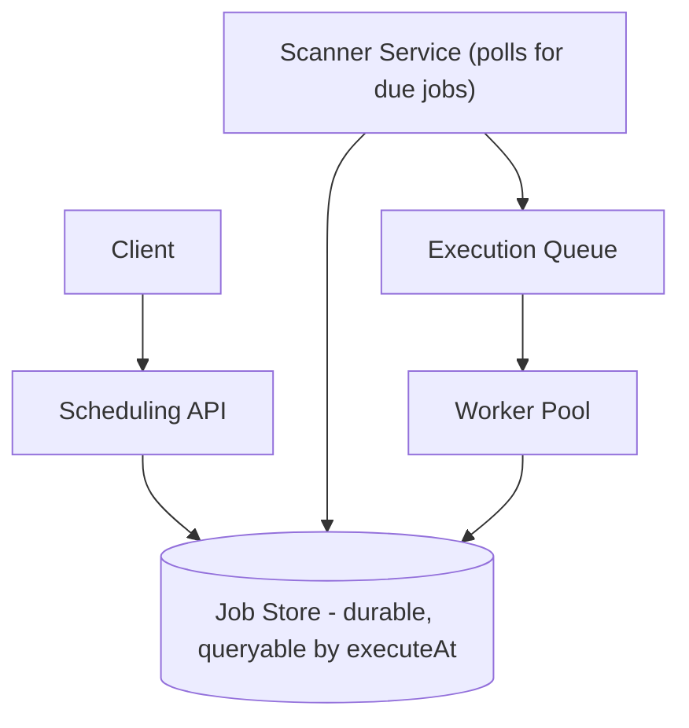
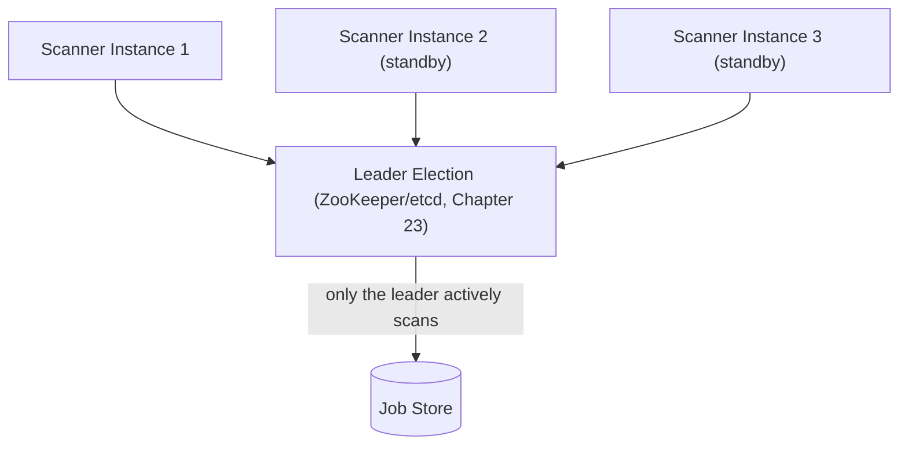

## Introduction

This final case study is deliberately synthesis-heavy — a distributed job scheduler (like a distributed cron, powering scheduled reports, delayed notifications, or periodic maintenance tasks) draws directly on leader election (Chapter 23), distributed locks (Chapter 27), and idempotency (Chapter 28) to solve a deceptively simple-sounding problem: run this job at this time, exactly once, even across a fleet of many worker machines.

## Step 1: Clarify Requirements

**Functional:**
- Schedule a job to run once at a specific future time, or on a recurring basis (e.g., "every day at 2 AM").
- Support many different job types with different handlers.

**Non-functional:**
- **Exactly-once execution** is the dominant, defining requirement — a job running twice (e.g., a duplicate billing run) or not at all (a missed critical report) are both unacceptable failure modes, explicitly more important than raw scheduling throughput for most use cases.
- Fault tolerance — the scheduler itself must not have a single point of failure that halts all scheduled jobs.

## Step 2: Capacity Estimation

1 million scheduled jobs, with execution times naturally clustering around common intervals (e.g., many jobs scheduled for "midnight" or "every hour on the hour") — this clustering, not the raw job count, is the more architecturally significant number, since it implies bursty, concentrated execution demand at specific moments rather than smooth, evenly-distributed load.

## Step 3: Define the API

```
POST /jobs/schedule    { jobType, executeAt, payload, recurring? } -> { jobId }
DELETE /jobs/{jobId}   (cancel a scheduled job)
GET  /jobs/{jobId}/status
```

## Step 4: High-Level Architecture



## Step 5: Deep Dive — Exactly-Once Execution Across a Distributed Worker Fleet

This is the system's entire reason for existing, and a direct synthesis of three earlier chapters.

### Leader Election for the Scanner

Only one Scanner instance should be actively polling the Job Store for due jobs at any given time — if multiple Scanner instances ran simultaneously and uncoordinated, they could each independently discover the same due job and enqueue it multiple times, immediately violating the exactly-once requirement.



Using the consensus-based leader election from Chapter 23 (via ZooKeeper or etcd), exactly one Scanner instance is elected leader and actively polls for due jobs; the standby instances remain idle but ready to take over immediately if the current leader fails — directly reusing Chapter 23's Raft-based leader election mechanics, not reinventing them.

### Distributed Lock for Job Claiming

Even with a single active Scanner, once a due job is enqueued, multiple worker instances might race to pick it up from the execution queue. A **distributed lock** (Chapter 27), scoped per individual job ID, ensures only one worker actually claims and executes any given specific job.

```java
public void processJob(Job job) {
    RedisDistributedLock lock = new RedisDistributedLock(jedisPool, "job-lock:" + job.getId(), 300);
    if (!lock.tryLock()) {
        return; // another worker already claimed this specific job
    }
    try {
        if (jobStore.getStatus(job.getId()) == JobStatus.COMPLETED) {
            return; // already executed - idempotency check, in case of a retry
        }
        executeJobHandler(job);
        jobStore.markCompleted(job.getId());
    } finally {
        lock.unlock();
    }
}
```

**Why both a lock AND an idempotency check**: The lock prevents *concurrent* double-execution; the idempotency check (querying whether the job is already marked completed) protects against the *fencing-token-style* edge case from Chapter 27 — a worker that acquired the lock, was delayed long enough for its lock to expire, and another worker completed the job in the meantime. Relying on the lock alone, per Chapter 27's explicit warning, is not fully sufficient — the idempotency check is the necessary second layer.

### Recurring Jobs

A recurring job (e.g., "every day at 2 AM") is modeled as: upon successful completion, the worker computes and inserts the *next* occurrence's row into the Job Store — rather than trying to represent an indefinitely-recurring job as a single, ongoing entity, each individual execution is a fresh, independent job record, keeping the exactly-once logic identical and uniform for both one-time and recurring jobs.

## Step 6: Bottlenecks and Trade-offs

- **Job Store query pattern**: The Scanner's "find all jobs due before now" query needs an index on `executeAt` (Chapter 14) — a straightforward B-Tree range query, given this system's comparatively moderate scale relative to earlier case studies' massive-throughput demands.
- **Clustered execution times**: Given Step 2's observation that jobs cluster around common times (midnight, top-of-hour), the worker pool needs headroom (or elastic auto-scaling, Chapter 7) to absorb these predictable bursts, rather than being provisioned only for the smooth, averaged load.
- **Long-running jobs**: A job that runs longer than the distributed lock's TTL risks the lock expiring mid-execution — mitigated by the same lock-extension/heartbeat technique discussed in Chapter 27, with the worker periodically renewing its lock while genuinely still actively processing.

## Step 7: Failure Scenarios and Scaling Evolution

- **Scanner leader failure**: Automatic failover to a standby instance via the same consensus mechanism (Chapter 23) that elected the original leader — jobs due during the brief failover window are simply discovered slightly late by the new leader, an acceptable, bounded delay rather than a missed execution.
- **Worker crash mid-job, after acquiring the lock but before completing**: The lock's TTL eventually expires (assuming no heartbeat renewal, since the crashed worker can no longer send one), allowing another worker to pick up and retry the job — the idempotency check ensures this retry is safe even if the crashed worker had partially completed some side effects before crashing, provided the job handler itself is designed idempotently (Chapter 28), which is the job author's own responsibility, not something the scheduler infrastructure alone can guarantee for arbitrary job logic.
- **Scaling to support job dependencies** (e.g., "run Job B only after Job A succeeds"): This evolves the system toward a full workflow/DAG-orchestration engine — a meaningfully more complex extension worth explicitly flagging as a distinct, larger problem beyond this chapter's core scheduling design.

## Summary

- This case study is a deliberate synthesis of Chapters 23, 27, and 28 — leader election ensures a single active scanner, distributed locks prevent concurrent job claiming, and idempotency checks close the fencing-token-style gap that a lock alone cannot fully guarantee.
- Recurring jobs are modeled as a fresh job record generated upon each completion, keeping exactly-once logic uniform across one-time and recurring jobs alike.
- Job clustering around common execution times (not raw job count) is the key capacity-estimation insight driving worker-pool provisioning.
- True exactly-once execution ultimately depends on both correct scheduler-infrastructure design AND idempotent job-handler logic — a responsibility split between the platform and the individual job author.

---

## Interview Questions

### 1. Why is a single distributed lock alone (Chapter 27) not fully sufficient to guarantee exactly-once job execution, and what specific additional mechanism closes this gap?
**Answer:** As Chapter 27 explicitly discussed, a distributed lock with a TTL-based expiry can suffer from a scenario where a worker acquires the lock, experiences an unexpectedly long pause (e.g., a garbage collection pause or a slow downstream call), has its lock expire and get reacquired by a second worker who then completes the job, and then the first worker resumes — still believing it holds the lock — and could proceed to also execute the job, resulting in double-execution despite the lock's existence; this is the exact fencing-token problem Chapter 27 identified as a lock's inherent limitation. The additional mechanism that closes this gap is the idempotency check performed just before actually executing the job's logic — by querying the Job Store to confirm the job hasn't already been marked completed (by whichever worker actually finished it first), the delayed, resuming worker can detect that the job is already done and safely skip re-executing it, even though it still (incorrectly) believes it holds a valid lock — this idempotency check is precisely the kind of resource-side verification Chapter 27 recommended as the true, complete solution to the fencing-token problem, here applied concretely to job execution.

**Follow-up:** *Why is checking job status specifically BEFORE executing the job's actual logic, rather than only after, important for this mechanism to work correctly?* — Checking before execution specifically prevents the delayed, resuming worker from re-executing the job's actual side effects at all — if the check happened only after execution (e.g., "run the job, then check if someone else already ran it and if so, discard/ignore the result"), the job's real-world side effects (e.g., sending a duplicate billing charge, or sending a duplicate report) would have already occurred by the time the check happens, making the check useless for preventing the actual harm; the check must happen before any side-effecting logic runs, so that a detected "already completed" status can cause the worker to skip execution entirely, rather than merely detecting the duplication after the damage is already done.

### 2. Explain why leader election (Chapter 23) is specifically needed for the Scanner component, but not necessarily for every component in this system.
**Answer:** The Scanner's specific job — polling the Job Store to discover due jobs and enqueue them for execution — has a genuine risk of duplicated work if multiple instances perform this exact same polling-and-enqueuing operation simultaneously and independently: each instance might discover the same due job at roughly the same time and each independently enqueue it, directly causing duplicate job executions even before any worker-level locking comes into play — this specific risk (multiple instances of the same logical operation producing duplicated, conflicting results) is exactly what leader election is designed to prevent, by ensuring only one designated instance is actively performing this specific, duplication-sensitive operation at any given time, with standbys ready to take over only upon the active leader's failure. Other components in this system, like the Worker Pool, are deliberately designed to have *many* instances operating concurrently and independently by design (that's the whole point of horizontal scaling for the execution workload) — their correctness under concurrency is instead protected by the per-job distributed lock and idempotency check (the mechanisms discussed in the previous question), a different, complementary correctness strategy suited to a component that's *supposed* to have many active, concurrently-operating instances, unlike the Scanner's specific single-active-instance requirement.

**Follow-up:** *Could the Scanner's single-active-instance requirement instead be satisfied using the same per-job distributed lock mechanism used for workers, rather than a separate leader-election mechanism?* — In principle, a distributed lock scoped to "the scanning operation itself" (rather than per-individual-job) could achieve a broadly similar effect (only one scanner instance actively polling at a time) — but leader election (via a purpose-built consensus system like ZooKeeper/etcd) is generally preferred for this kind of "exactly one persistent, ongoing active instance, with automatic failover to a standby" pattern because it's specifically designed for this exact scenario (Chapter 23), providing cleaner primitives for the leader to know it's still legitimately the leader (versus a simple lock, which doesn't inherently notify the holder of expiry) and for standbys to be automatically, promptly notified when they should take over — using a full leader-election mechanism, rather than repurposing the per-job lock pattern for this different, more persistent "who is currently the active scanner" role, better fits this specific, ongoing-role-assignment use case rather than the shorter-lived, per-item claiming that the per-job lock pattern is specifically designed for.

### 3. Why does this case study model each occurrence of a recurring job as "a fresh, independent job record" generated upon the previous occurrence's completion, rather than representing the recurring schedule as a single, ongoing entity the Scanner repeatedly evaluates?
**Answer:** Representing each occurrence as a fresh, independent job record means the exact same exactly-once execution logic (leader-elected scanning, per-job distributed locking, idempotency checking against the Job Store) applies completely uniformly to both one-time and recurring jobs, without needing any special-cased logic to distinguish "is this a one-time job I'm evaluating, or one specific occurrence of a recurring schedule" — this significantly simplifies the system's core execution logic, since every single job record, regardless of whether it originated from a one-time schedule request or as a freshly-generated next-occurrence of a recurring job, is handled by exactly the same code path; if instead a single, ongoing "recurring schedule" entity were repeatedly re-evaluated by the Scanner on each cycle, this would require additional, separate logic to correctly track "which occurrence of this ongoing schedule have we already executed" (essentially reinventing, in a more complex, special-cased way, the same job-completion tracking that the simpler "generate a fresh record per occurrence" approach already provides naturally and uniformly).

**Follow-up:** *What happens, in this "generate the next occurrence upon completion" model, if a specific recurring job's execution fails entirely (its handler throws an exception) — does the next occurrence still get correctly scheduled?* — This is an important design detail worth being explicit about: the "generate next occurrence" step should generally happen based on the job's *scheduled* completion time (or simply always upon processing that occurrence, regardless of success/failure), rather than being contingent on the job handler's actual success — otherwise, a single failed execution could silently break the entire remaining recurring schedule (since no future occurrences would ever be generated if generation were incorrectly made conditional on success) — a well-designed system would generate the next occurrence's record independently of whether the current occurrence's handler succeeded or failed, while separately handling and alerting on the specific failed occurrence (e.g., via retry logic or a dead-letter mechanism, Chapter 30) — ensuring a single failure doesn't cascade into silently terminating an entire ongoing recurring schedule.

### 4. Why does this case study emphasize that "true exactly-once execution ultimately depends on... idempotent job-handler logic — a responsibility split between the platform and the individual job author," rather than claiming the scheduler infrastructure alone fully guarantees this?
**Answer:** The scheduler infrastructure's mechanisms (leader election, distributed locking, idempotency checks against the Job Store) can reliably guarantee that the scheduler itself will not *invoke* a given job's handler code more than once under normal, correctly-functioning conditions — but this guarantee only extends to the scheduler's own invocation logic, not to what happens *inside* that job handler's actual business logic once it's been correctly, singularly invoked; if a specific job handler's own internal logic isn't itself idempotent (e.g., it directly increments a counter, or sends a non-idempotent external API call without its own retry-safety mechanism, per Chapter 28's broader discussion), then even a perfectly-functioning, correctly-single-invoking scheduler infrastructure cannot prevent that specific job's *own internal logic* from producing incorrect, non-idempotent side effects if, for instance, that job's own internal logic happens to be retried or partially re-executed due to a failure *within* the handler itself (separate from the scheduler's own invocation-level guarantees) — this is precisely why the responsibility is explicitly split: the scheduler platform guarantees correct, singular *invocation*, while the individual job author remains responsible for ensuring their own specific handler's *internal* logic is safely idempotent, exactly mirroring the general idempotency principle from Chapter 28 that this specific concern cannot be fully delegated away to any surrounding infrastructure alone.

**Follow-up:** *What guidance or platform-level support could this job scheduler system provide to help job authors more easily satisfy their own share of this idempotency responsibility?* — The platform could provide each job invocation with a stable, unique identifier (e.g., the specific job occurrence's ID) that job authors are encouraged or required to use as an idempotency key (Chapter 28) when making their own external API calls or database writes within their handler logic — directly giving job authors a ready-made, consistent identifier to build their own idempotent logic around, rather than needing to invent their own separate idempotency-key generation scheme; the platform might also provide clear documentation, example patterns, or even a shared utility library specifically demonstrating how to correctly use this provided job-occurrence ID for common idempotent-operation patterns, making it easier and more likely for job authors across an organization to correctly fulfill their share of this shared exactly-once responsibility, even though the platform itself cannot fully enforce or guarantee this for arbitrary, author-written handler logic.

### 5. In a system design interview, if asked "how would you handle a job that needs to run at a specific user's local time, accounting for time zones and daylight saving time changes," how would you extend this chapter's design?
**Answer:** You'd store each job's scheduled execution time in a time-zone-aware format — either storing the target local time alongside an explicit time zone identifier (e.g., "2:00 AM, America/New_York") and having the system compute the corresponding absolute UTC execution time dynamically (recalculating this conversion at read/scan time, or whenever daylight-saving transitions might affect the specific date in question), or, more robustly, pre-computing and storing the correct absolute UTC timestamp for each specific upcoming occurrence at the time that occurrence is generated (directly extending this chapter's "generate the next occurrence upon completion" pattern for recurring jobs) — this second approach is generally more robust, since it resolves the time-zone/DST conversion once, at generation time, using the correct rules in effect for that specific future date, rather than needing to handle this conversion logic repeatedly and consistently at every single point the system might need to reason about "when is this job due" (e.g., in the Scanner's polling query) — you'd explicitly flag that DST transitions specifically require careful handling (a job scheduled for "2:30 AM" on a day when clocks spring forward from 2:00 AM directly to 3:00 AM technically doesn't have a valid literal 2:30 AM local time to map to that day, requiring an explicit, documented policy decision for this edge case, such as "skip this occurrence" or "run it at the nearest valid equivalent time").

**Follow-up:** *Why might pre-computing and storing the absolute UTC execution timestamp (rather than storing the local-time-plus-timezone and converting dynamically) also simplify the Scanner's core "find all jobs due before now" query discussed in Step 6?* — If job due-times were stored as local-time-plus-timezone (requiring dynamic conversion at scan time), the Scanner's query would need to perform this timezone-aware conversion for potentially many different jobs each in different timezones, for every single scan cycle — adding real per-query computational complexity and making the simple, efficient indexed range-scan on a single `executeAt` column (as described in Step 6) much harder to implement directly and efficiently; by instead resolving and storing the absolute UTC timestamp once, at occurrence-generation time, the Scanner's actual polling query remains exactly as simple as originally described — a straightforward, efficiently-indexed "WHERE executeAt <= now()" comparison against a single, already-resolved, unambiguous UTC timestamp column, regardless of how many different job-specific time zones and DST rules were involved in originally computing that stored value.
